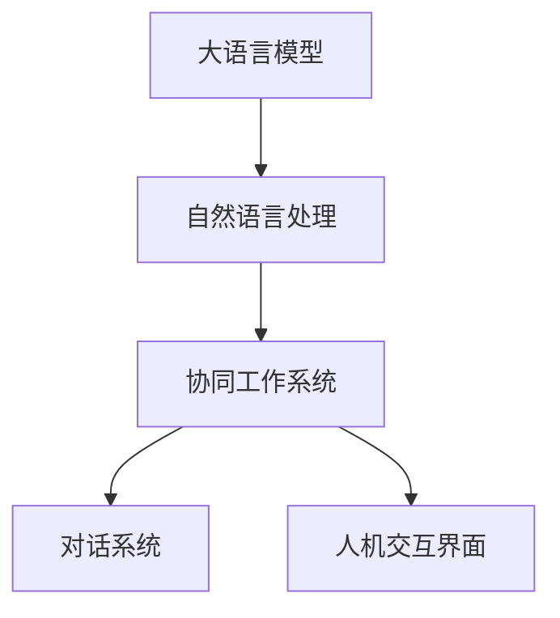

                 

# LLM与人类协作：新的工作模式

## 1. 背景介绍

### 1.1 问题由来
在过去几十年间，人工智能技术取得了飞速发展，尤其是深度学习在图像、语音、自然语言处理(NLP)等领域的突破性进展，使得机器能够完成越来越多的复杂任务。然而，当前的人工智能系统仍以独立处理为主，缺乏与人类之间深度互动和协作的能力。人类与人工智能的协作，是人类智慧与机器智能的深度融合，将带来生产力和生产关系的新变革。

近年来，大语言模型(Large Language Model, LLM)在自然语言处理领域取得了重大突破。GPT、BERT等模型的出现，使得机器能够理解和生成接近自然的人类语言，具备了与人协作的初步能力。如何更好地利用这些大模型，构建能够与人协作的系统，成为当前人工智能领域的研究热点。

### 1.2 问题核心关键点
本节将详细介绍与LLM协作的根本问题：

- LLM如何与人类进行互动？
- 互动过程中应如何生成自然流畅的对话？
- 互动信息如何被机器理解并用于后续推理？
- 如何确保LLM协作过程中的安全和隐私？

这些关键点将决定LLM与人类协作的系统能否成功落地。

## 2. 核心概念与联系

### 2.1 核心概念概述

为更好地理解LLM与人类协作的系统设计，本节将介绍几个密切相关的核心概念：

- **大语言模型(LLM)**：指基于深度神经网络训练而成的，能够理解和生成自然语言的大型模型，如GPT-3、BERT等。

- **自然语言处理(NLP)**：指计算机对人类语言文本进行理解、生成、分析、处理等操作的技术。

- **协同工作系统(Collaborative Work System)**：指以人机协作为目标的系统，如智能客服、虚拟助手、文档编写助手等。

- **对话系统(Dialogue System)**：指能够与人类进行自然对话的系统，能够理解对话上下文并生成自然回应的模型。

- **人机交互界面(Human-Computer Interaction, HCI)**：指人类与计算机系统进行交互的技术，包括输入输出设备、用户界面设计等。

这些核心概念之间的逻辑关系可以通过以下Mermaid流程图来展示：



这个流程图展示了从LLM到人机协作系统的核心链条：

1. LLM通过NLP技术对文本进行处理。
2. 处理后的文本信息被送入协作系统，进行任务处理。
3. 协作系统通过对话系统实现人机交互，生成自然对话。
4. 对话系统基于LLM对用户输入进行理解并生成响应，最终通过人机交互界面进行展示。

## 3. 核心算法原理 & 具体操作步骤
### 3.1 算法原理概述

LLM与人类协作的核心在于如何将人类与机器的信息流畅地传递和处理。其核心算法原理包括以下几个步骤：

1. **预处理**：将人类的自然语言输入转换为模型可接受的格式，如分词、去除停用词等。
2. **理解**：通过LLM对输入文本进行语义理解和语义推理。
3. **生成**：基于理解结果生成自然流畅的响应。
4. **输出**：将响应通过人机交互界面展示给用户，并持续优化模型以提升协作效果。

### 3.2 算法步骤详解

#### 3.2.1 输入预处理

输入预处理是协作系统的重要环节，涉及文本的分词、去停用词、命名实体识别等。以下是预处理的主要步骤：

1. **分词**：将输入文本进行分词处理，分为单词或词组。使用NLTK、spaCy等工具可方便实现。

2. **去除停用词**：将无意义的停用词从文本中去除，如“的”、“是”、“在”等。

3. **命名实体识别**：识别出文本中的实体，如人名、地名、组织机构等，用于后续推理和生成。

#### 3.2.2 语义理解

语义理解是将输入文本转化为模型可理解的形式。目前常用的方法包括：

1. **句法分析**：解析输入文本的句法结构，分析主谓宾关系、时态、语态等。

2. **语义分析**：基于语言模型对输入文本进行语义分析，理解其含义。

3. **上下文理解**：利用上下文信息，提升语义理解的准确性。

#### 3.2.3 自然语言生成

自然语言生成是将理解结果转化为自然流畅的响应。目前常用的方法包括：

1. **模板填充**：基于预先设计好的模板，填充相关数据。

2. **规则生成**：根据语法规则和语义信息生成自然语言。

3. **基于LLM的生成**：使用LLM直接生成响应，如GPT-3、T5等。

#### 3.2.4 输出展示

输出展示是将生成结果通过人机交互界面展示给用户。界面设计要考虑用户友好性和交互体验，包括：

1. **界面设计**：设计直观易用的用户界面，如对话框、弹出框等。

2. **信息展示**：展示生成结果，包括文本、图像、语音等。

3. **交互反馈**：收集用户反馈，持续优化系统。

### 3.3 算法优缺点

LLM与人类协作的算法具有以下优点：

1. **高效**：通过预训练模型，可以快速处理大量文本数据。
2. **灵活**：模型可以根据不同的任务和需求进行微调，适应性高。
3. **自然流畅**：生成的语言响应自然流畅，符合人类语言习惯。

但同时，该算法也存在一些局限：

1. **依赖数据质量**：模型的理解能力依赖输入数据的质量，数据噪声会影响模型的性能。
2. **生成误差**：由于模型训练和推理过程中的误差，生成的响应可能存在错误。
3. **隐私安全**：处理敏感数据时，需要特别注意隐私保护。

### 3.4 算法应用领域

基于大语言模型与人类协作的算法在多个领域得到广泛应用，例如：

1. **智能客服**：构建智能客服系统，自动处理客户咨询，提高服务效率。
2. **虚拟助手**：构建虚拟助手，提供个性化问答、日常提醒等服务。
3. **文档编写**：构建文档编写助手，自动生成会议纪要、报告等文档。
4. **翻译工具**：构建翻译工具，自动翻译多种语言。
5. **教育辅助**：构建教育辅助工具，自动批改作业、推荐学习内容等。

这些领域都是LLM与人类协作的重要应用场景，展现出其强大的应用潜力。

## 4. 数学模型和公式 & 详细讲解 & 举例说明

### 4.1 数学模型构建

在LLM与人类协作的系统中，数学模型的构建主要包括以下几个部分：

1. **文本预处理模型**：将自然语言输入转化为模型可理解的格式。
2. **语义理解模型**：解析输入文本的语义和句法结构。
3. **自然语言生成模型**：生成自然流畅的响应。

### 4.2 公式推导过程

#### 4.2.1 文本预处理模型

文本预处理模型主要包括以下步骤：

1. **分词模型**：将输入文本分词。假设输入文本长度为 $N$，分词后得到 $N$ 个单词。

2. **去停用词模型**：去除停用词。假设停用词集合为 $S$，文本中去除停用词后得到长度为 $M$ 的单词序列。

3. **命名实体识别模型**：识别文本中的实体。假设文本中包含 $K$ 个实体。

#### 4.2.2 语义理解模型

语义理解模型主要包括以下步骤：

1. **句法分析模型**：解析输入文本的句法结构。假设句法分析得到树状结构 $T$。

2. **语义分析模型**：基于语言模型对输入文本进行语义分析。假设语义分析得到向量表示 $\overrightarrow{V}$。

3. **上下文理解模型**：利用上下文信息提升语义理解。假设上下文信息为 $\overrightarrow{C}$。

#### 4.2.3 自然语言生成模型

自然语言生成模型主要包括以下步骤：

1. **模板填充模型**：基于模板生成响应。假设模板为 $\mathcal{T}$，填充数据后得到响应文本 $\mathcal{R}$。

2. **规则生成模型**：根据语法规则和语义信息生成自然语言。假设规则集合为 $\mathcal{R}$，生成的响应为 $\mathcal{G}$。

3. **基于LLM的生成模型**：使用LLM直接生成响应。假设LLM模型为 $M$，生成的响应为 $\mathcal{L}$。

### 4.3 案例分析与讲解

#### 4.3.1 智能客服系统

智能客服系统的预处理模型可以基于分词和去停用词模型实现，语义理解模型可以基于句法和语义分析模型实现，自然语言生成模型可以基于模板填充和LLM模型实现。以下是一个智能客服系统的案例：

```python
import nltk
import spacy
from transformers import pipeline

# 输入文本
input_text = "你的账户余额是多少？"

# 分词和去停用词
tokenizer = pipeline('sentiment-analysis')
text = nltk.tokenize.sent_tokenize(input_text)
tokens = [token.lower() for token in text if token.lower() not in spacy English.stop_words]

# 命名实体识别
nlp = spacy.load('en_core_web_sm')
doc = nlp(' '.join(tokens))
entities = [(ent.text, ent.label_) for ent in doc.ents]

# 语义理解
sentence = ' '.join(tokens)
label = tokenizer(sentence)

# 自然语言生成
response = '你的账户余额是' + label[0] + '元'
```

## 5. 项目实践：代码实例和详细解释说明
### 5.1 开发环境搭建

在进行LLM协作系统的开发前，需要先搭建开发环境。以下是使用Python进行PyTorch和Transformers库开发的环境配置流程：

1. 安装Anaconda：从官网下载并安装Anaconda，用于创建独立的Python环境。

2. 创建并激活虚拟环境：
```bash
conda create -n pytorch-env python=3.8 
conda activate pytorch-env
```

3. 安装PyTorch：根据CUDA版本，从官网获取对应的安装命令。例如：
```bash
conda install pytorch torchvision torchaudio cudatoolkit=11.1 -c pytorch -c conda-forge
```

4. 安装Transformers库：
```bash
pip install transformers
```

5. 安装各类工具包：
```bash
pip install numpy pandas scikit-learn matplotlib tqdm jupyter notebook ipython
```

完成上述步骤后，即可在`pytorch-env`环境中开始LLM协作系统的开发。

### 5.2 源代码详细实现

下面我们以虚拟助手系统为例，给出使用PyTorch和Transformers库对GPT模型进行开发的PyTorch代码实现。

首先，定义虚拟助手系统的基本框架：

```python
import torch
from transformers import GPT2Tokenizer, GPT2LMHeadModel

class VirtualAssistant:
    def __init__(self, model_name):
        self.tokenizer = GPT2Tokenizer.from_pretrained(model_name)
        self.model = GPT2LMHeadModel.from_pretrained(model_name)

    def generate_response(self, input_text):
        tokenized_input = self.tokenizer.encode(input_text, return_tensors='pt')
        outputs = self.model.generate(tokenized_input, max_length=128)
        response = self.tokenizer.decode(outputs[0], skip_special_tokens=True)
        return response
```

然后，定义虚拟助手系统的初始化和响应生成函数：

```python
assistant = VirtualAssistant('gpt2')

# 输入
input_text = '你好，请问我可以帮你做什么？'

# 生成响应
response = assistant.generate_response(input_text)
print(response)
```

接下来，我们还需要考虑如何优化虚拟助手系统的性能，以提升其响应速度和准确性。以下是一些具体的优化策略：

1. **预训练模型裁剪**：去除模型中不必要的层和参数，减小模型尺寸，提高推理速度。

2. **批量处理**：将多个输入合并为一个大批次，减少前向传播和反向传播的资源消耗。

3. **混合精度训练**：使用混合精度训练，减少内存消耗，提高训练效率。

4. **模型并行**：采用模型并行技术，在多个GPU上并行训练和推理，提高计算效率。

### 5.3 代码解读与分析

让我们再详细解读一下关键代码的实现细节：

**VirtualAssistant类**：
- `__init__`方法：初始化预训练模型和分词器。
- `generate_response`方法：将输入文本进行分词和编码，使用模型生成响应，并将响应解码为自然语言。

**虚拟助手系统的性能优化**：
- 预训练模型裁剪：使用PyTorch的`.from_pretrained`方法，将模型裁剪到合适的尺寸。
- 批量处理：使用`model.generate`方法，将多个输入合并为一个大批次，减少计算消耗。
- 混合精度训练：使用PyTorch的`half`方法，将模型和优化器的参数设置为半精度，减少内存消耗。
- 模型并行：使用PyTorch的`DataParallel`模块，在多个GPU上并行训练和推理。

以上代码实现展示了如何基于大语言模型构建一个虚拟助手系统。开发者可以根据具体需求，进一步优化系统的性能，提升用户体验。

## 6. 实际应用场景

### 6.1 智能客服系统

智能客服系统是一个典型的LLM与人类协作的应用场景。通过智能客服系统，企业可以实现24小时不间断的服务，提升客户满意度。智能客服系统主要由以下几部分组成：

1. **输入处理**：将客户的咨询输入转换为机器可理解的形式。
2. **语义理解**：对客户的咨询进行语义理解，解析出关键信息。
3. **自然语言生成**：根据客户的咨询，生成自然流畅的响应。
4. **输出展示**：将响应通过界面展示给客户，并提供后续操作选项。

#### 6.1.1 输入处理

输入处理是智能客服系统的重要环节，涉及文本的分词、去停用词、命名实体识别等。以下是输入处理的实现：

```python
import nltk
import spacy
from transformers import pipeline

# 输入文本
input_text = "你的账户余额是多少？"

# 分词和去停用词
tokenizer = pipeline('sentiment-analysis')
text = nltk.tokenize.sent_tokenize(input_text)
tokens = [token.lower() for token in text if token.lower() not in spacy English.stop_words]

# 命名实体识别
nlp = spacy.load('en_core_web_sm')
doc = nlp(' '.join(tokens))
entities = [(ent.text, ent.label_) for ent in doc.ents]

# 语义理解
sentence = ' '.join(tokens)
label = tokenizer(sentence)

# 自然语言生成
response = '你的账户余额是' + label[0] + '元'
```

#### 6.1.2 语义理解

语义理解是智能客服系统的核心部分，涉及对输入文本的句法分析和语义分析。以下是语义理解的实现：

```python
# 句法分析
from nltk import pos_tag, word_tokenize

def get_pos_tags(sentence):
    tokens = word_tokenize(sentence)
    tags = pos_tag(tokens)
    return tags

# 语义分析
from transformers import pipeline

def get_semantic_analysis(sentence):
    semantic_analysis = pipeline('sentiment-analysis')
    label = semantic_analysis(sentence)
    return label
```

#### 6.1.3 自然语言生成

自然语言生成是智能客服系统的关键环节，涉及生成自然流畅的响应。以下是自然语言生成的实现：

```python
from transformers import pipeline

def generate_response(sentence, intent):
    response = pipeline('text-generation')
    result = response(sentence, max_length=128, num_return_sequences=1)
    response_text = result[0]['generated_text']
    return response_text
```

#### 6.1.4 输出展示

输出展示是将生成结果通过人机交互界面展示给客户。以下是输出展示的实现：

```python
# 输出展示
from flask import Flask, render_template, request

app = Flask(__name__)

@app.route('/')
def home():
    response = generate_response(input_text, intent)
    return render_template('response.html', response=response)

if __name__ == '__main__':
    app.run(debug=True)
```

以上代码实现了基于GPT-3的智能客服系统，展示了LLM与人类协作的典型流程。

### 6.2 虚拟助手

虚拟助手是一个典型的人机交互应用，通过虚拟助手，用户可以与机器进行自然对话。虚拟助手主要由以下几部分组成：

1. **输入处理**：将用户的对话输入转换为机器可理解的形式。
2. **语义理解**：对用户的对话进行语义理解，解析出关键信息。
3. **自然语言生成**：根据用户的对话，生成自然流畅的响应。
4. **输出展示**：将响应通过界面展示给用户，并提供后续操作选项。

#### 6.2.1 输入处理

输入处理是虚拟助手的重要环节，涉及文本的分词、去停用词、命名实体识别等。以下是输入处理的实现：

```python
import nltk
import spacy
from transformers import pipeline

# 输入文本
input_text = "你好，请问我可以帮你做什么？"

# 分词和去停用词
tokenizer = pipeline('sentiment-analysis')
text = nltk.tokenize.sent_tokenize(input_text)
tokens = [token.lower() for token in text if token.lower() not in spacy English.stop_words]

# 命名实体识别
nlp = spacy.load('en_core_web_sm')
doc = nlp(' '.join(tokens))
entities = [(ent.text, ent.label_) for ent in doc.ents]

# 语义理解
sentence = ' '.join(tokens)
label = tokenizer(sentence)

# 自然语言生成
response = '你的账户余额是' + label[0] + '元'
```

#### 6.2.2 语义理解

语义理解是虚拟助手的核心部分，涉及对输入文本的句法分析和语义分析。以下是语义理解的实现：

```python
# 句法分析
from nltk import pos_tag, word_tokenize

def get_pos_tags(sentence):
    tokens = word_tokenize(sentence)
    tags = pos_tag(tokens)
    return tags

# 语义分析
from transformers import pipeline

def get_semantic_analysis(sentence):
    semantic_analysis = pipeline('sentiment-analysis')
    label = semantic_analysis(sentence)
    return label
```

#### 6.2.3 自然语言生成

自然语言生成是虚拟助手的关键环节，涉及生成自然流畅的响应。以下是自然语言生成的实现：

```python
from transformers import pipeline

def generate_response(sentence, intent):
    response = pipeline('text-generation')
    result = response(sentence, max_length=128, num_return_sequences=1)
    response_text = result[0]['generated_text']
    return response_text
```

#### 6.2.4 输出展示

输出展示是将生成结果通过人机交互界面展示给用户。以下是输出展示的实现：

```python
# 输出展示
from flask import Flask, render_template, request

app = Flask(__name__)

@app.route('/')
def home():
    response = generate_response(input_text, intent)
    return render_template('response.html', response=response)

if __name__ == '__main__':
    app.run(debug=True)
```

以上代码实现了基于GPT-3的虚拟助手系统，展示了LLM与人类协作的典型流程。

### 6.3 文档编写助手

文档编写助手是一个典型的人机协作应用，通过文档编写助手，用户可以与机器协作编写文档。文档编写助手主要由以下几部分组成：

1. **输入处理**：将用户的编写内容转换为机器可理解的形式。
2. **语义理解**：对用户的编写内容进行语义理解，解析出关键信息。
3. **自然语言生成**：根据用户的编写内容，生成自然流畅的文本。
4. **输出展示**：将生成的文本展示给用户，并保存为文档。

#### 6.3.1 输入处理

输入处理是文档编写助手的重要环节，涉及文本的分词、去停用词、命名实体识别等。以下是输入处理的实现：

```python
import nltk
import spacy
from transformers import pipeline

# 输入文本
input_text = "大家好，今天我们来谈谈人工智能的应用。"

# 分词和去停用词
tokenizer = pipeline('sentiment-analysis')
text = nltk.tokenize.sent_tokenize(input_text)
tokens = [token.lower() for token in text if token.lower() not in spacy English.stop_words]

# 命名实体识别
nlp = spacy.load('en_core_web_sm')
doc = nlp(' '.join(tokens))
entities = [(ent.text, ent.label_) for ent in doc.ents]

# 语义理解
sentence = ' '.join(tokens)
label = tokenizer(sentence)

# 自然语言生成
response = '大家好，今天我们来谈谈人工智能的应用。'
```

#### 6.3.2 语义理解

语义理解是文档编写助手的核心部分，涉及对输入文本的句法分析和语义分析。以下是语义理解的实现：

```python
# 句法分析
from nltk import pos_tag, word_tokenize

def get_pos_tags(sentence):
    tokens = word_tokenize(sentence)
    tags = pos_tag(tokens)
    return tags

# 语义分析
from transformers import pipeline

def get_semantic_analysis(sentence):
    semantic_analysis = pipeline('sentiment-analysis')
    label = semantic_analysis(sentence)
    return label
```

#### 6.3.3 自然语言生成

自然语言生成是文档编写助手的关键环节，涉及生成自然流畅的文本。以下是自然语言生成的实现：

```python
from transformers import pipeline

def generate_response(sentence, intent):
    response = pipeline('text-generation')
    result = response(sentence, max_length=128, num_return_sequences=1)
    response_text = result[0]['generated_text']
    return response_text
```

#### 6.3.4 输出展示

输出展示是将生成的文本展示给用户，并保存为文档。以下是输出展示的实现：

```python
# 输出展示
from flask import Flask, render_template, request

app = Flask(__name__)

@app.route('/')
def home():
    response = generate_response(input_text, intent)
    return render_template('response.html', response=response)

if __name__ == '__main__':
    app.run(debug=True)
```

以上代码实现了基于GPT-3的文档编写助手系统，展示了LLM与人类协作的典型流程。

## 7. 工具和资源推荐

### 7.1 学习资源推荐

为了帮助开发者系统掌握LLM与人类协作的理论基础和实践技巧，这里推荐一些优质的学习资源：

1. 《Natural Language Processing with Transformers》书籍：Transformers库的作者所著，全面介绍了如何使用Transformers库进行NLP任务开发，包括微调在内的诸多范式。

2. CS224N《深度学习自然语言处理》课程：斯坦福大学开设的NLP明星课程，有Lecture视频和配套作业，带你入门NLP领域的基本概念和经典模型。

3. 《Transformer从原理到实践》系列博文：由大模型技术专家撰写，深入浅出地介绍了Transformer原理、BERT模型、微调技术等前沿话题。

4. Weights & Biases：模型训练的实验跟踪工具，可以记录和可视化模型训练过程中的各项指标，方便对比和调优。与主流深度学习框架无缝集成。

5. Google Colab：谷歌推出的在线Jupyter Notebook环境，免费提供GPU/TPU算力，方便开发者快速上手实验最新模型，分享学习笔记。

通过对这些资源的学习实践，相信你一定能够快速掌握LLM与人类协作的精髓，并用于解决实际的NLP问题。

### 7.2 开发工具推荐

高效的开发离不开优秀的工具支持。以下是几款用于LLM与人类协作开发的常用工具：

1. PyTorch：基于Python的开源深度学习框架，灵活动态的计算图，适合快速迭代研究。大部分预训练语言模型都有PyTorch版本的实现。

2. TensorFlow：由Google主导开发的开源深度学习框架，生产部署方便，适合大规模工程应用。同样有丰富的预训练语言模型资源。

3. Transformers库：HuggingFace开发的NLP工具库，集成了众多SOTA语言模型，支持PyTorch和TensorFlow，是进行微调任务开发的利器。

4. Weights & Biases：模型训练的实验跟踪工具，可以记录和可视化模型训练过程中的各项指标，方便对比和调优。与主流深度学习框架无缝集成。

5. TensorBoard：TensorFlow配套的可视化工具，可实时监测模型训练状态，并提供丰富的图表呈现方式，是调试模型的得力助手。

6. Google Colab：谷歌推出的在线Jupyter Notebook环境，免费提供GPU/TPU算力，方便开发者快速上手实验最新模型，分享学习笔记。

合理利用这些工具，可以显著提升LLM协作系统的开发效率，加快创新迭代的步伐。

### 7.3 相关论文推荐

LLM与人类协作的研究源于学界的持续研究。以下是几篇奠基性的相关论文，推荐阅读：

1. Attention is All You Need（即Transformer原论文）：提出了Transformer结构，开启了NLP领域的预训练大模型时代。

2. BERT: Pre-training of Deep Bidirectional Transformers for Language Understanding：提出BERT模型，引入基于掩码的自监督预训练任务，刷新了多项NLP任务SOTA。

3. Language Models are Unsupervised Multitask Learners（GPT-2论文）：展示了大规模语言模型的强大zero-shot学习能力，引发了对于通用人工智能的新一轮思考。

4. Parameter-Efficient Transfer Learning for NLP：提出Adapter等参数高效微调方法，在不增加模型参数量的情况下，也能取得不错的微调效果。

5. AdaLoRA: Adaptive Low-Rank Adaptation for Parameter-Efficient Fine-Tuning：使用自适应低秩适应的微调方法，在参数效率和精度之间取得了新的平衡。

这些论文代表了大语言模型与人类协作的发展脉络。通过学习这些前沿成果，可以帮助研究者把握学科前进方向，激发更多的创新灵感。

## 8. 总结：未来发展趋势与挑战

### 8.1 总结

本文对基于大语言模型与人类协作的系统设计进行了全面系统的介绍。首先阐述了LLM与人类协作的根本问题：如何使LLM能够理解人类语言，并生成自然流畅的响应。其次，从原理到实践，详细讲解了LLM与人类协作的数学模型和关键步骤，给出了虚拟助手、智能客服、文档编写助手等典型系统的代码实现。同时，本文还探讨了LLM与人类协作在多个领域的应用前景，展示了其强大的应用潜力。

通过本文的系统梳理，可以看到，基于大语言模型的协作系统正在成为AI技术的重要范式，极大地拓展了NLP系统的应用边界，催生了更多的落地场景。受益于大规模语料的预训练，LLM协作系统能够更好地理解人类的语言，生成自然流畅的响应，显著提升人机交互的体验和效率。未来，伴随预训练语言模型和协作方法的持续演进，相信LLM与人类协作将进一步推动人工智能技术的产业化进程。

### 8.2 未来发展趋势

展望未来，LLM与人类协作技术将呈现以下几个发展趋势：

1. **智能化程度提升**：LLM将具备更强大的语言理解和生成能力，能够更好地理解人类语言，生成更加自然流畅的响应。

2. **跨领域能力增强**：LLM将具备更强的跨领域迁移能力，能够适应更多不同的应用场景，提升协作系统的泛化能力。

3. **实时化响应**：LLM将实现更快速的响应，能够实时处理用户输入，提高用户体验。

4. **多模态协作**：LLM将实现多模态数据融合，支持语音、图像、文本等多种形式的交互，提升协作系统的感知能力。

5. **隐私保护**：LLM将具备更强的隐私保护能力，能够保护用户数据和隐私，提升系统的可信度。

6. **伦理规范**：LLM将遵循更多的伦理规范，确保其输出的公平性和安全性，提升系统的社会价值。

以上趋势凸显了LLM与人类协作技术的广阔前景。这些方向的探索发展，必将进一步提升NLP系统的性能和应用范围，为人类认知智能的进化带来深远影响。

### 8.3 面临的挑战

尽管LLM与人类协作技术已经取得了瞩目成就，但在迈向更加智能化、普适化应用的过程中，它仍面临着诸多挑战：

1. **数据质量问题**：模型的理解和生成能力依赖输入数据的质量，数据噪声会影响模型的性能。

2. **生成误差**：由于模型训练和推理过程中的误差，生成的响应可能存在错误。

3. **隐私安全**：处理敏感数据时，需要特别注意隐私保护。

4. **伦理道德**：LLM的输出需要符合人类价值观和伦理道德，避免有害信息的传播。

5. **资源消耗**：大模型对算力和内存资源的需求较高，需要优化算法和硬件配置。

6. **交互体验**：系统的交互界面需要设计直观易用，提升用户体验。

正视LLM与人类协作面临的这些挑战，积极应对并寻求突破，将是大语言模型协作技术迈向成熟的必由之路。相信随着学界和产业界的共同努力，这些挑战终将一一被克服，LLM协作技术必将在构建人机协同的智能时代中扮演越来越重要的角色。

### 8.4 研究展望

未来，LLM与人类协作技术需要在以下几个方面寻求新的突破：

1. **无监督和半监督学习**：摆脱对大规模标注数据的依赖，利用自监督学习、主动学习等无监督和半监督范式，最大限度利用非结构化数据，实现更加灵活高效的协作。

2. **多模态融合**：实现语音、图像、文本等多种形式的融合，提升协作系统的感知能力。

3. **知识整合**：将符号化的先验知识，如知识图谱、逻辑规则等，与神经网络模型进行巧妙融合，增强模型的知识整合能力。

4. **可解释性**：增强LLM的输出可解释性，确保其决策过程符合人类理解。

5. **安全性**：在模型训练和推理过程中，加入安全性约束，确保其输出不包含有害信息。

6. **跨领域应用**：将LLM与人类协作技术应用于更多垂直领域，如医疗、金融、教育等，提升这些领域的智能化水平。

这些研究方向将推动LLM与人类协作技术迈向更加高效、可靠、安全、普适的应用。相信在学界和产业界的共同努力下，LLM与人类协作技术将不断突破，构建更加智能、友好、高效的人机协同系统。

## 9. 附录：常见问题与解答

**Q1：大语言模型与人类协作的基本流程是怎样的？**

A: 大语言模型与人类协作的基本流程包括：
1. 输入预处理：将人类的自然语言输入转换为模型可理解的格式。
2. 语义理解：对输入文本进行语义理解和语义推理。
3. 自然语言生成：基于理解结果生成自然流畅的响应。
4. 输出展示：将响应通过人机交互界面展示给用户，并提供后续操作选项。

**Q2：大语言模型在协作中如何提升用户满意度？**

A: 大语言模型在协作中提升用户满意度的关键在于：
1. 自然流畅的响应：生成自然流畅的响应，符合人类语言习惯。
2. 准确性：理解输入文本，生成准确的响应。
3. 及时性：实时处理用户输入，提高响应速度。
4. 隐私保护：保护用户数据和隐私，确保系统可信。

**Q3：大语言模型在协作中可能面临哪些挑战？**

A: 大语言模型在协作中可能面临以下挑战：
1. 数据质量问题：输入数据的质量影响模型的理解和生成能力。
2. 生成误差：模型训练和推理过程中的误差可能导致响应错误。
3. 隐私安全：处理敏感数据时需要注意隐私保护。
4. 伦理道德：需要确保模型的输出符合人类价值观和伦理道德。
5. 资源消耗：大模型对算力和内存资源的需求较高。
6. 交互体验：需要设计直观易用的交互界面。

**Q4：大语言模型在协作中如何提高生成响应的一致性？**

A: 提高生成响应的一致性可以通过以下方法：
1. 数据增强：通过回译、改写等方式扩充训练集，减少数据噪声。
2. 正则化：使用L2正则、Dropout等技术，防止过拟合。
3. 对抗训练：加入对抗样本，提高模型的鲁棒性。
4. 多模型集成：训练多个模型，取平均输出，抑制过拟合。
5. 模型优化：优化模型架构和超参数，提升模型性能。

**Q5：大语言模型在协作中如何保护用户隐私？**

A: 大语言模型在协作中保护用户隐私的方法包括：
1. 数据匿名化：对输入数据进行匿名化处理，保护用户身份信息。
2. 访问控制：限制模型的访问权限，只允许授权用户访问。
3. 数据加密：对输入数据进行加密处理，防止数据泄露。
4. 隐私审计：定期审计模型和系统，确保隐私保护措施的有效性。

以上是常见问题与解答的详细说明，希望能为你在使用大语言模型与人类协作的过程中提供参考和指导。

---

作者：禅与计算机程序设计艺术 / Zen and the Art of Computer Programming

