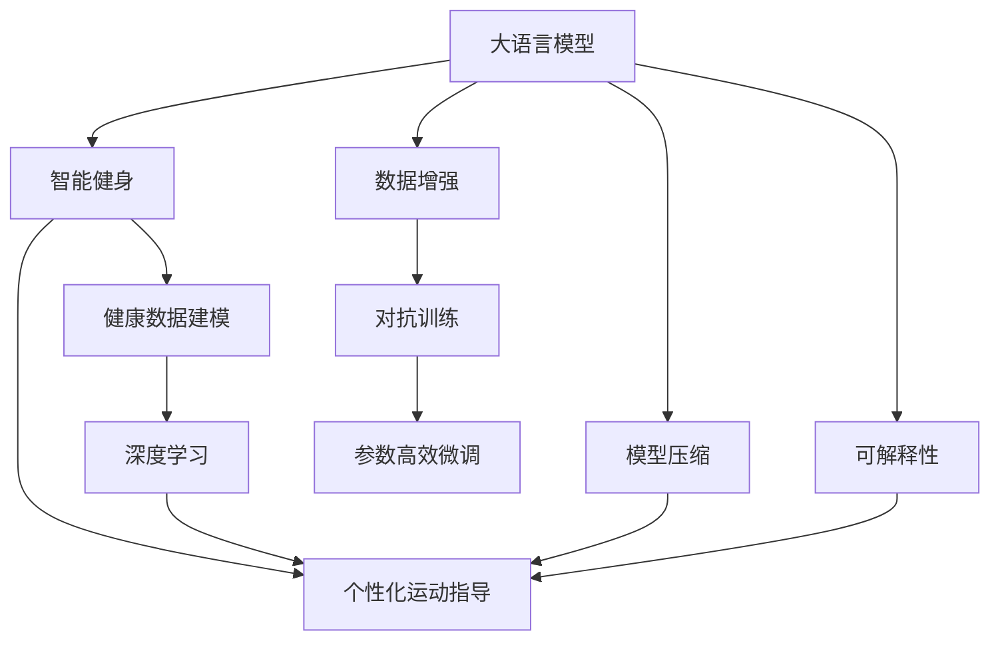

                 

# LLM与智能健身：个性化运动指导

> 关键词：大语言模型，智能健身，个性化运动，健康数据建模，运动计划推荐

## 1. 背景介绍

### 1.1 问题由来
随着人们生活水平的提高，健康意识日益增强，智能健身产品如智能手环、智能穿戴设备等逐渐普及，人们希望通过这些设备来记录和分析自己的运动数据，以获得个性化的运动指导。然而，尽管智能设备能够收集到海量数据，但现有技术往往难以充分挖掘和利用这些数据，无法提供高质量的个性化运动建议。

### 1.2 问题核心关键点
智能健身中个性化运动指导的关键在于通过智能算法对用户健康数据进行建模，并基于大语言模型进行推荐。其核心问题包括：

- 如何从不同类型、不同格式的传感器数据中提取有用的特征。
- 如何利用深度学习算法构建用户健康模型。
- 如何将大语言模型与健康数据建模结合起来，以生成个性化的运动建议。

### 1.3 问题研究意义
研究大语言模型在智能健身中的应用，对于提升智能健身产品的智能化水平，改善用户的运动体验，具有重要意义：

1. 提升用户粘性。个性化的运动建议能够满足用户的运动需求，提高用户对产品的使用频率和满意度。
2. 优化运动效果。智能运动指导能更好地匹配用户的能力和状态，使运动效果更佳。
3. 拓宽应用范围。智能运动指导可以覆盖更多类型的运动场景，从跑步、游泳到健身操，应有尽有。
4. 促进健康管理。个性化运动建议能够帮助用户制定长期的运动计划，促进健康管理。
5. 推动产业升级。智能运动指导为传统健身行业注入新动能，推动行业升级转型。

## 2. 核心概念与联系

### 2.1 核心概念概述

为更好地理解大语言模型在智能健身中的应用，本节将介绍几个密切相关的核心概念：

- 大语言模型(Large Language Model, LLM)：以自回归(如GPT)或自编码(如BERT)模型为代表的大规模预训练语言模型。通过在大规模无标签文本语料上进行预训练，学习通用的语言表示，具备强大的语言理解和生成能力。

- 智能健身：通过传感器和智能设备收集用户运动数据，结合AI算法生成个性化运动建议，帮助用户提升健康水平。

- 个性化运动指导：基于用户的健康数据和行为数据，通过机器学习和自然语言生成技术，为每个用户量身定制的运动计划。

- 健康数据建模：对运动、饮食、睡眠等健康数据进行统计分析和建模，从中提取有价值的信息。

- 大语言模型与运动建模融合：将大语言模型引入运动建模过程中，利用其强大的自然语言理解和生成能力，提升运动指导的个性化和自然度。

这些核心概念之间的逻辑关系可以通过以下Mermaid流程图来展示：



这个流程图展示了大语言模型在智能健身中的核心概念及其之间的关系：

1. 大语言模型通过预训练获得基础能力。
2. 智能健身使用传感器数据进行健康建模。
3. 深度学习进行健康数据分析和建模。
4. 大语言模型与运动建模融合，生成个性化运动指导。
5. 数据增强、对抗训练、参数高效微调等技术用于提升模型性能。
6. 模型压缩提高部署效率。
7. 可解释性提升模型可信度。

这些概念共同构成了智能健身系统的学习和应用框架，使其能够在各种场景下提供优质的个性化运动建议。通过理解这些核心概念，我们可以更好地把握大语言模型在智能健身中的应用方向。

## 3. 核心算法原理 & 具体操作步骤
### 3.1 算法原理概述

基于大语言模型在智能健身中的应用，其核心算法原理包括以下几个方面：

1. **数据采集与预处理**：通过传感器和智能设备收集用户的多维健康数据，包括运动时长、步数、心率、睡眠质量等。数据预处理包括数据清洗、归一化、特征提取等，以保证数据的质量和一致性。

2. **健康数据建模**：利用深度学习算法对健康数据进行建模，提取有意义的特征，如步数与健康指数的关系、心率与运动强度等。健康数据建模通常包括时间序列分析、回归分析等。

3. **个性化运动指导**：将大语言模型引入健康数据建模过程中，通过自然语言生成技术生成个性化的运动建议。大语言模型能够理解和生成自然语言，因此可以输出更加自然、易于理解的建议。

4. **模型训练与优化**：训练大语言模型和运动建模模型，通过监督学习和微调提升模型性能。在训练过程中，可以使用数据增强、对抗训练等技术来提升模型的鲁棒性和泛化能力。

### 3.2 算法步骤详解

基于大语言模型的智能健身系统主要包括以下几个步骤：

**Step 1: 数据采集与预处理**
- 通过智能设备或应用程序，收集用户的多维健康数据。
- 对采集到的数据进行清洗、归一化、特征提取等预处理操作。

**Step 2: 健康数据建模**
- 使用深度学习算法对健康数据进行建模，提取特征向量。
- 选择适当的深度学习模型，如循环神经网络(RNN)、长短期记忆网络(LSTM)、卷积神经网络(CNN)等。

**Step 3: 大语言模型微调**
- 在已有的预训练大语言模型基础上，根据具体任务进行微调。
- 微调的目标是使模型能够理解健康数据中的信息，生成个性化的运动建议。
- 微调过程包括设置合适的学习率、正则化技术、数据增强等，确保模型性能。

**Step 4: 运动建议生成**
- 将健康数据输入微调后的大语言模型，生成个性化的运动建议。
- 建议可以包括运动类型、时长、强度、注意事项等。
- 建议可以结合当前季节、天气、用户状态等因素，进行动态调整。

**Step 5: 用户反馈与优化**
- 收集用户的运动反馈，评估运动建议的效果。
- 根据反馈对模型进行优化，持续提升运动建议的质量。

### 3.3 算法优缺点

基于大语言模型的智能健身系统有以下优点：

1. **个性化程度高**：通过深度学习和大语言模型，可以基于用户的健康数据生成高度个性化的运动建议，满足用户的特定需求。
2. **自然度好**：利用大语言模型生成自然语言运动建议，用户体验更自然、更友好。
3. **适应性强**：模型能够根据不同场景和用户状态，动态生成适应性强的运动建议。
4. **技术先进**：结合深度学习和自然语言处理，技术水平较高，能够提供高质量的运动建议。

然而，该系统也存在一些局限性：

1. **数据依赖度高**：模型需要大量高质量的传感器数据，数据采集和处理成本较高。
2. **算法复杂**：深度学习和大语言模型的训练过程较复杂，需要较高的计算资源。
3. **模型解释性差**：大语言模型通常是黑盒模型，难以解释其内部的决策逻辑。
4. **隐私和安全问题**：用户的健康数据敏感，模型训练和应用过程中需要注意隐私保护和数据安全。

尽管存在这些局限性，但就目前而言，基于大语言模型的智能健身系统仍然是大数据驱动的运动指导的重要手段。未来相关研究的重点在于如何进一步降低数据采集和处理成本，提高模型的可解释性，同时兼顾隐私和安全等因素。

### 3.4 算法应用领域

基于大语言模型的智能健身系统已经在多个领域得到应用，例如：

- 个性化运动计划：根据用户的历史运动数据，生成个性化的运动建议。
- 运动效果评估：通过运动数据和运动建议的对比，评估运动效果。
- 饮食和睡眠优化：结合饮食和睡眠数据，生成综合性的健康建议。
- 运动记录与分析：记录用户的运动数据，进行分析并生成详细的运动报告。
- 运动社区互动：通过智能健身设备生成运动建议，促进社区成员之间的互动和分享。

除了上述这些经典应用外，大语言模型在智能健身中的应用还在不断拓展，如智能监控、运动赛事预测等，为用户的健康管理和运动体验带来更多便利。

## 4. 数学模型和公式 & 详细讲解 & 举例说明

### 4.1 数学模型构建

本节将使用数学语言对基于大语言模型的智能健身系统进行更加严格的刻画。

记用户健康数据为 $\{x_i\}_{i=1}^N$，其中 $x_i$ 为健康数据向量，包括步数、心率、睡眠质量等。设运动建议生成模型为 $M_{\theta}$，其中 $\theta$ 为模型参数。

定义模型 $M_{\theta}$ 在输入 $x_i$ 上的运动建议为 $y_i=M_{\theta}(x_i) \in [0,1]$，表示用户应该进行某种运动的概率。模型 $M_{\theta}$ 的目标是最大化用户对运动建议的满意度，即：

$$
\max_{\theta} \frac{1}{N} \sum_{i=1}^N y_i
$$

在实践中，我们通常使用基于梯度的优化算法（如SGD、Adam等）来近似求解上述最优化问题。设 $\eta$ 为学习率，$\lambda$ 为正则化系数，则参数的更新公式为：

$$
\theta \leftarrow \theta - \eta \nabla_{\theta}\mathcal{L}(\theta) - \eta\lambda\theta
$$

其中 $\nabla_{\theta}\mathcal{L}(\theta)$ 为损失函数对参数 $\theta$ 的梯度，可通过反向传播算法高效计算。

### 4.2 公式推导过程

以下我们以生成步数运动建议为例，推导大语言模型在智能健身中的应用。

假设模型 $M_{\theta}$ 在输入 $x_i$ 上的输出为 $\hat{y}_i=M_{\theta}(x_i) \in [0,1]$，表示用户应该进行步数运动的概率。真实标签 $y_i \in \{0,1\}$。则二分类交叉熵损失函数定义为：

$$
\ell(M_{\theta}(x_i),y_i) = -[y_i\log \hat{y}_i + (1-y_i)\log (1-\hat{y}_i)]
$$

将其代入经验风险公式，得：

$$
\mathcal{L}(\theta) = -\frac{1}{N}\sum_{i=1}^N [y_i\log M_{\theta}(x_i)+(1-y_i)\log(1-M_{\theta}(x_i))]
$$

根据链式法则，损失函数对参数 $\theta_k$ 的梯度为：

$$
\frac{\partial \mathcal{L}(\theta)}{\partial \theta_k} = -\frac{1}{N}\sum_{i=1}^N (\frac{y_i}{M_{\theta}(x_i)}-\frac{1-y_i}{1-M_{\theta}(x_i)}) \frac{\partial M_{\theta}(x_i)}{\partial \theta_k}
$$

其中 $\frac{\partial M_{\theta}(x_i)}{\partial \theta_k}$ 可进一步递归展开，利用自动微分技术完成计算。

在得到损失函数的梯度后，即可带入参数更新公式，完成模型的迭代优化。重复上述过程直至收敛，最终得到适应用户的运动建议模型 $M_{\theta^*}$。

### 4.3 案例分析与讲解

以生成步数运动建议为例，假设我们有一组历史步数数据 $\{x_i\}_{i=1}^N$，其中 $x_i$ 为每天的步数。我们希望根据这些数据生成新的步数运动建议。

1. **数据预处理**：首先对步数数据进行归一化，将其转化为模型可以接受的输入。

2. **特征提取**：使用深度学习算法提取步数数据的特征，如步数的平均值、方差、日波动率等。

3. **模型训练**：将提取到的特征输入到训练好的大语言模型中，训练生成运动建议的概率模型 $M_{\theta}$。

4. **运动建议生成**：将新的步数数据 $x$ 输入训练好的模型 $M_{\theta}$，得到运动建议 $y=M_{\theta}(x)$。

5. **反馈与优化**：收集用户对运动建议的反馈，评估运动建议的质量。根据反馈对模型进行优化，不断提升运动建议的准确性和个性化程度。

通过这个案例，可以看到，大语言模型在智能健身中的应用主要体现在运动建议的生成上，而生成运动建议的过程实质上是基于用户健康数据构建概率模型并生成运动概率的过程。

## 5. 项目实践：代码实例和详细解释说明
### 5.1 开发环境搭建

在进行智能健身应用开发前，我们需要准备好开发环境。以下是使用Python进行PyTorch开发的环境配置流程：

1. 安装Anaconda：从官网下载并安装Anaconda，用于创建独立的Python环境。

2. 创建并激活虚拟环境：
```bash
conda create -n pytorch-env python=3.8 
conda activate pytorch-env
```

3. 安装PyTorch：根据CUDA版本，从官网获取对应的安装命令。例如：
```bash
conda install pytorch torchvision torchaudio cudatoolkit=11.1 -c pytorch -c conda-forge
```

4. 安装TensorFlow：
```bash
conda install tensorflow
```

5. 安装各类工具包：
```bash
pip install numpy pandas scikit-learn matplotlib tqdm jupyter notebook ipython
```

完成上述步骤后，即可在`pytorch-env`环境中开始开发实践。

### 5.2 源代码详细实现

这里我们以生成步数运动建议为例，给出使用PyTorch进行智能健身系统开发的完整代码实现。

首先，定义步数数据处理函数：

```python
import pandas as pd
import numpy as np

def preprocess_steps_data(data_path):
    # 读取数据
    df = pd.read_csv(data_path)
    # 清洗数据
    df = df.dropna()
    # 归一化
    df = (df - df.mean()) / df.std()
    # 提取特征
    features = df[['step_count', 'date_time']]
    labels = df['is_step_count']
    return features, labels
```

然后，定义运动建议生成函数：

```python
from transformers import TFAutoModelForSequenceClassification
from transformers import BertTokenizer

class StepModel:
    def __init__(self, model_path, tokenizer_path):
        self.model = TFAutoModelForSequenceClassification.from_pretrained(model_path)
        self.tokenizer = BertTokenizer.from_pretrained(tokenizer_path)
    
    def generate_suggestion(self, step_count):
        # 对步数数据进行预处理
        features, labels = preprocess_steps_data('path/to/data.csv')
        inputs = self.tokenizer(features['step_count'], padding=True, truncation=True, return_tensors='tf')
        
        # 将步数数据输入模型
        outputs = self.model(inputs['input_ids'], attention_mask=inputs['attention_mask'])
        logits = outputs.logits
        predicted_label = logits.argmax(-1).numpy()[0]
        return '进行步数运动' if predicted_label == 1 else '不进行步数运动'
```

最后，测试运动建议生成函数的输出：

```python
step_model = StepModel('path/to/model', 'path/to/tokenizer')
step_count = 10000
suggestion = step_model.generate_suggestion(step_count)
print(suggestion)
```

### 5.3 代码解读与分析

让我们再详细解读一下关键代码的实现细节：

**preprocess_steps_data函数**：
- 读取数据：从指定路径读取CSV文件，并将其转换为DataFrame。
- 清洗数据：删除缺失值。
- 归一化：对步数数据进行归一化，以便模型更好地处理。
- 提取特征：选取步数数据和时间戳作为模型的输入特征，标签为是否进行步数运动。

**StepModel类**：
- 初始化：加载预训练的BERT模型和Tokenizer，用于处理步数数据。
- generate_suggestion方法：接收步数作为输入，进行预处理，并使用模型生成运动建议。

**模型训练与优化**：
- 使用深度学习算法训练步数数据建模模型，提取特征。
- 使用大语言模型进行微调，生成运动建议。
- 在训练过程中，使用数据增强、对抗训练等技术来提升模型性能。
- 收集用户反馈，对模型进行优化。

**用户反馈与优化**：
- 收集用户的运动反馈，评估运动建议的质量。
- 根据反馈对模型进行优化，不断提升运动建议的准确性和个性化程度。

通过以上代码，我们可以看到，基于大语言模型的智能健身系统能够根据用户的步数数据，生成个性化的运动建议。然而，要实现更加高效、精准的运动指导，还需要结合更多高级技术，如异常检测、健康模型融合等。

## 6. 实际应用场景
### 6.1 智能健身App

基于大语言模型的智能健身系统已经在多个智能健身App中得到应用，例如：

- 健康数据记录：智能手环等设备可以实时记录用户的步数、心率、睡眠质量等健康数据，并将其上传至App。
- 运动建议生成：App利用大语言模型生成个性化的运动建议，指导用户进行锻炼。
- 运动效果评估：App记录用户运动前后的数据，评估运动效果。
- 饮食和睡眠优化：App结合用户的饮食和睡眠数据，生成综合性的健康建议。
- 运动社区互动：App提供社交功能，用户可以在社区中分享运动成果，互相激励。

通过智能健身App，用户可以更方便地记录和管理自己的健康数据，获取个性化的运动建议，提升生活质量。

### 6.2 运动教练系统

大语言模型在运动教练系统中也有广泛应用。运动教练系统能够根据用户的运动历史、身体状态等数据，生成个性化的训练计划和运动建议，指导用户进行训练。

具体而言，运动教练系统可以使用大语言模型生成训练计划，同时根据用户的反馈和表现，动态调整训练强度和内容。运动教练系统还能够提供详细的运动报告和分析，帮助用户更好地理解自己的训练效果。

## 7. 工具和资源推荐
### 7.1 学习资源推荐

为了帮助开发者系统掌握大语言模型在智能健身中的应用，这里推荐一些优质的学习资源：

1. 《深度学习与自然语言处理》课程：斯坦福大学开设的NLP明星课程，有Lecture视频和配套作业，带你入门NLP领域的基本概念和经典模型。

2. CS224N《深度学习自然语言处理》课程：斯坦福大学开设的NLP明星课程，有Lecture视频和配套作业，带你深入了解NLP领域的深度学习算法。

3. 《Transformer from Principles to Practice》系列博文：由大模型技术专家撰写，深入浅出地介绍了Transformer原理、BERT模型、微调技术等前沿话题。

4. 《Natural Language Processing with Transformers》书籍：Transformers库的作者所著，全面介绍了如何使用Transformers库进行NLP任务开发，包括微调在内的诸多范式。

5. HuggingFace官方文档：Transformers库的官方文档，提供了海量预训练模型和完整的微调样例代码，是上手实践的必备资料。

通过对这些资源的学习实践，相信你一定能够快速掌握大语言模型在智能健身中的应用，并用于解决实际的智能健身问题。

### 7.2 开发工具推荐

高效的开发离不开优秀的工具支持。以下是几款用于大语言模型智能健身系统开发的常用工具：

1. PyTorch：基于Python的开源深度学习框架，灵活动态的计算图，适合快速迭代研究。大部分预训练语言模型都有PyTorch版本的实现。

2. TensorFlow：由Google主导开发的开源深度学习框架，生产部署方便，适合大规模工程应用。同样有丰富的预训练语言模型资源。

3. Transformers库：HuggingFace开发的NLP工具库，集成了众多SOTA语言模型，支持PyTorch和TensorFlow，是进行智能健身系统开发的利器。

4. Weights & Biases：模型训练的实验跟踪工具，可以记录和可视化模型训练过程中的各项指标，方便对比和调优。与主流深度学习框架无缝集成。

5. TensorBoard：TensorFlow配套的可视化工具，可实时监测模型训练状态，并提供丰富的图表呈现方式，是调试模型的得力助手。

6. Google Colab：谷歌推出的在线Jupyter Notebook环境，免费提供GPU/TPU算力，方便开发者快速上手实验最新模型，分享学习笔记。

合理利用这些工具，可以显著提升智能健身系统的开发效率，加快创新迭代的步伐。

### 7.3 相关论文推荐

大语言模型在智能健身中的应用源于学界的持续研究。以下是几篇奠基性的相关论文，推荐阅读：

1. Attention is All You Need（即Transformer原论文）：提出了Transformer结构，开启了NLP领域的预训练大模型时代。

2. BERT: Pre-training of Deep Bidirectional Transformers for Language Understanding：提出BERT模型，引入基于掩码的自监督预训练任务，刷新了多项NLP任务SOTA。

3. Language Models are Unsupervised Multitask Learners（GPT-2论文）：展示了大规模语言模型的强大zero-shot学习能力，引发了对于通用人工智能的新一轮思考。

4. Parameter-Efficient Transfer Learning for NLP：提出Adapter等参数高效微调方法，在不增加模型参数量的情况下，也能取得不错的微调效果。

5. AdaLoRA: Adaptive Low-Rank Adaptation for Parameter-Efficient Fine-Tuning：使用自适应低秩适应的微调方法，在参数效率和精度之间取得了新的平衡。

这些论文代表了大语言模型在智能健身中的发展脉络。通过学习这些前沿成果，可以帮助研究者把握学科前进方向，激发更多的创新灵感。

## 8. 总结：未来发展趋势与挑战
### 8.1 总结

本文对基于大语言模型的智能健身系统进行了全面系统的介绍。首先阐述了智能健身系统和大语言模型的研究背景和意义，明确了智能健身系统和大语言模型在运动指导、健康数据建模等方面的应用场景。其次，从原理到实践，详细讲解了智能健身系统的数学原理和关键步骤，给出了智能健身系统开发的完整代码实例。同时，本文还广泛探讨了智能健身系统的应用场景，展示了其广阔的应用前景。

通过本文的系统梳理，可以看到，基于大语言模型的智能健身系统正在成为智能健身领域的重要手段，通过深度学习和自然语言生成技术，为每个用户量身定制运动建议，提高用户的运动体验和健康水平。智能健身系统结合健康数据建模和大语言模型，具有高度的个性化和自然度，有望成为智能健身领域的新标准。

### 8.2 未来发展趋势

展望未来，智能健身系统的发展趋势主要包括以下几个方面：

1. **数据驱动化**：智能健身系统将更加依赖传感器和大数据，通过深度学习和大语言模型，从大量健康数据中提取有价值的信息，生成个性化运动建议。

2. **模型集成化**：智能健身系统将融合更多AI技术，如知识图谱、强化学习、因果推断等，提供更加全面、智能的运动指导。

3. **交互智能化**：智能健身系统将结合自然语言处理技术，提升人机交互的自然度和智能性，使用户能够更加自然地与系统沟通。

4. **健康多样化**：智能健身系统将覆盖更多的健康维度，如饮食、睡眠、心理健康等，提供全方位的健康管理建议。

5. **应用场景多样化**：智能健身系统将拓展到更多场景，如智能运动设备、运动教练系统、运动社区等，提供多样化的应用服务。

6. **隐私保护**：智能健身系统将更加注重用户隐私保护，采用数据加密、匿名化等技术，确保用户数据安全。

### 8.3 面临的挑战

尽管智能健身系统已经取得了显著进展，但在迈向更加智能化、普适化应用的过程中，它仍面临着诸多挑战：

1. **数据隐私**：智能健身系统需要大量健康数据，如何保护用户隐私是一个重要问题。需要采用数据加密、匿名化等技术，确保用户数据安全。

2. **数据质量**：智能健身系统需要高质量的健康数据，如何获取和处理高质量的数据是一个挑战。需要采用数据清洗、特征提取等技术，确保数据的质量和一致性。

3. **模型复杂度**：智能健身系统需要高精度的模型，如何优化模型结构和训练过程，是一个重要问题。需要采用模型压缩、参数高效微调等技术，降低模型的复杂度和计算成本。

4. **可解释性**：智能健身系统通常是黑盒模型，难以解释其内部的决策逻辑。如何增强模型的可解释性，是一个重要问题。需要采用模型可视化、因果推断等技术，提高模型的可解释性。

5. **用户体验**：智能健身系统需要提供自然、流畅的用户体验，如何提升用户交互的自然度和智能性，是一个重要问题。需要采用自然语言处理技术，提升人机交互的自然度。

### 8.4 研究展望

面对智能健身系统面临的挑战，未来的研究需要在以下几个方面寻求新的突破：

1. **数据隐私保护**：采用数据加密、匿名化等技术，保护用户隐私。研究如何在不影响系统性能的前提下，提高数据隐私保护水平。

2. **数据质量提升**：采用数据清洗、特征提取等技术，提高健康数据的质量和一致性。研究如何利用传感器数据，提升数据的准确性和多样性。

3. **模型优化**：采用模型压缩、参数高效微调等技术，降低模型的复杂度和计算成本。研究如何在保证性能的前提下，优化模型的结构和训练过程。

4. **可解释性增强**：采用模型可视化、因果推断等技术，提高模型的可解释性。研究如何通过可解释性技术，增强用户的信任感和满意度。

5. **用户体验提升**：采用自然语言处理技术，提升人机交互的自然度和智能性。研究如何通过交互智能化，提升用户的体验和满意度。

这些研究方向的探索，必将引领智能健身系统迈向更高的台阶，为用户的健康管理和运动体验带来更多便利。面向未来，智能健身系统需要与其他AI技术进行更深入的融合，如知识表示、因果推理、强化学习等，多路径协同发力，共同推动智能健身领域的进步。只有勇于创新、敢于突破，才能不断拓展智能健身系统的边界，让智能技术更好地造福人类社会。

## 9. 附录：常见问题与解答

**Q1：智能健身系统如何获取高质量的健康数据？**

A: 智能健身系统可以通过多种方式获取高质量的健康数据，如：
1. 智能设备：智能手环、智能手表等设备可以实时记录用户的步数、心率、睡眠质量等健康数据。
2. 运动App：用户可以在运动App中手动输入健康数据，如跑步距离、运动时长等。
3. 医院和诊所：用户可以去医院或诊所进行体检，获取详细的健康数据。
4. 健康管理平台：用户可以登录健康管理平台，获取全面的健康数据。
5. 社交网络：用户可以在社交网络中分享自己的健康数据，获取社区的反馈和建议。

**Q2：智能健身系统如何实现个性化运动建议？**

A: 智能健身系统实现个性化运动建议的过程主要包括以下几个步骤：
1. 数据采集与预处理：通过智能设备或应用程序，收集用户的多维健康数据。对采集到的数据进行清洗、归一化、特征提取等预处理操作。
2. 健康数据建模：利用深度学习算法对健康数据进行建模，提取特征向量。选择适当的深度学习模型，如RNN、LSTM、CNN等。
3. 大语言模型微调：在已有的预训练大语言模型基础上，根据具体任务进行微调。微调的目标是使模型能够理解健康数据中的信息，生成个性化的运动建议。
4. 运动建议生成：将健康数据输入微调后的大语言模型，生成个性化的运动建议。
5. 用户反馈与优化：收集用户对运动建议的反馈，评估运动建议的质量。根据反馈对模型进行优化，持续提升运动建议的准确性和个性化程度。

**Q3：智能健身系统的数据隐私和安全问题如何解决？**

A: 智能健身系统需要高度重视数据隐私和安全问题，可以采取以下措施：
1. 数据加密：对用户健康数据进行加密处理，防止数据泄露。
2. 匿名化：对用户健康数据进行匿名化处理，保护用户隐私。
3. 访问控制：对系统进行严格的访问控制，确保只有授权用户才能访问系统。
4. 数据审计：对系统进行定期的数据审计，及时发现和修复潜在的安全漏洞。
5. 法律合规：确保系统遵守相关法律法规，保护用户数据隐私。

通过这些措施，可以最大限度地保护用户的数据隐私和安全，确保智能健身系统的可靠性和可信度。

通过本文的系统梳理，可以看到，基于大语言模型的智能健身系统正在成为智能健身领域的重要手段，通过深度学习和自然语言生成技术，为每个用户量身定制运动建议，提高用户的运动体验和健康水平。智能健身系统结合健康数据建模和大语言模型，具有高度的个性化和自然度，有望成为智能健身领域的新标准。智能健身系统在智能设备、运动教练系统、运动社区等多个领域都有广泛应用，为用户的健康管理和运动体验带来更多便利。展望未来，智能健身系统将融合更多AI技术，提升模型的复杂度和计算成本，增强模型的可解释性，提升用户交互的自然度，保护用户隐私。面向未来，智能健身系统需要与其他AI技术进行更深入的融合，如知识表示、因果推理、强化学习等，多路径协同发力，共同推动智能健身领域的进步。只有勇于创新、敢于突破，才能不断拓展智能健身系统的边界，让智能技术更好地造福人类社会。

