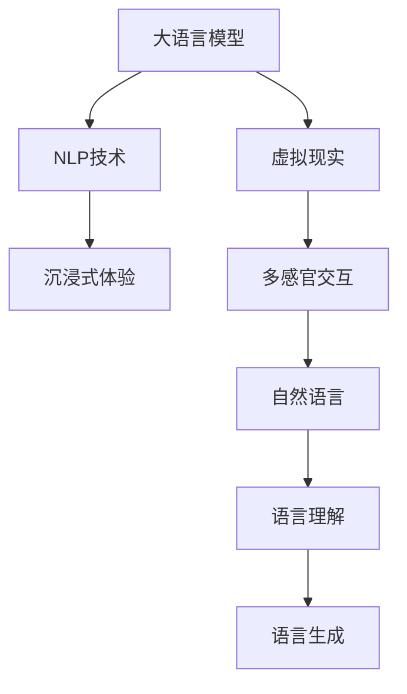

                 

# LLM与虚拟现实：构建智能虚拟世界

> 关键词：大语言模型,虚拟现实,自然语言处理,NLP,智能生成,沉浸式体验

## 1. 背景介绍

### 1.1 问题由来
随着虚拟现实(Virtual Reality, VR)技术的发展，人们对于沉浸式体验的追求越来越高。VR系统不仅需要在视觉、听觉等感官上进行创新，还需要通过自然语言处理(Natural Language Processing, NLP)技术，使虚拟世界具备理解和回应用户语言的能力，从而实现更丰富、更自然的交互。

当前，自然语言处理技术已经在智能客服、智能助手、自动翻译等领域得到了广泛应用，并取得了显著成效。然而，这些技术主要聚焦于文本信息处理，尚未在视觉、听觉等模态的语义理解上取得突破。如何利用大语言模型（Large Language Model, LLM），实现与虚拟现实系统的无缝集成，构建更智能、更自然的虚拟世界，成为当前研究的热点话题。

### 1.2 问题核心关键点
本节将阐述大语言模型与虚拟现实的结合，重点聚焦于以下几个关键点：

- 大语言模型：指以自回归模型或自编码模型为代表的大规模预训练语言模型。通过在大规模无标签文本语料上进行预训练，学习通用的语言表示，具备强大的语言理解和生成能力。

- 虚拟现实技术：指通过计算机技术模拟一个完全沉浸的虚拟环境，使参与者能够通过视觉、听觉、触觉等感官进行互动的体验。

- 自然语言处理：指利用计算机科学、人工智能等技术，使计算机具备理解、处理人类自然语言的能力。

- 融合技术：指将大语言模型与虚拟现实技术进行深度融合，实现语义信息的无缝传递和理解，提升虚拟世界的智能化水平。

- 沉浸式体验：指通过多感官的交互和响应，使参与者在虚拟世界中产生身临其境的感觉，增强体验的沉浸感和真实感。

### 1.3 问题研究意义
本节将探讨大语言模型与虚拟现实结合的重要性，以及其在构建智能虚拟世界中的应用价值：

1. **提升用户体验**：通过大语言模型实现自然语言交互，使虚拟世界具备丰富的语言表达能力，提升用户体验的沉浸感和真实感。
2. **拓展应用场景**：大语言模型可以与虚拟现实系统无缝集成，应用于教育培训、军事模拟、旅游观光、医疗健康等多个领域，创造更多商业机会。
3. **促进技术融合**：大语言模型与虚拟现实技术的结合，能够推动跨学科技术的协同创新，实现更智能、更高效的系统构建。
4. **推动行业发展**：虚拟现实技术结合自然语言处理，将加速各行各业数字化转型升级，带来新的商业模式和技术生态。

## 2. 核心概念与联系

### 2.1 核心概念概述

为更好地理解大语言模型与虚拟现实的结合，本节将介绍几个密切相关的核心概念：

- **大语言模型（LLM）**：以自回归模型（如GPT-3）或自编码模型（如BERT）为代表的大规模预训练语言模型。通过在大规模无标签文本语料上进行预训练，学习通用的语言表示，具备强大的语言理解和生成能力。

- **虚拟现实（VR）**：通过计算机技术模拟一个完全沉浸的虚拟环境，使参与者能够通过视觉、听觉、触觉等感官进行互动的体验。

- **自然语言处理（NLP）**：指利用计算机科学、人工智能等技术，使计算机具备理解、处理人类自然语言的能力。

- **融合技术**：指将大语言模型与虚拟现实技术进行深度融合，实现语义信息的无缝传递和理解，提升虚拟世界的智能化水平。

- **沉浸式体验**：指通过多感官的交互和响应，使参与者在虚拟世界中产生身临其境的感觉，增强体验的沉浸感和真实感。

这些核心概念之间的逻辑关系可以通过以下Mermaid流程图来展示：



这个流程图展示了大语言模型与虚拟现实结合的基本流程：

1. 大语言模型作为基础，通过NLP技术实现语言理解和生成。
2. 虚拟现实系统通过多感官交互技术，提供沉浸式体验。
3. 自然语言处理技术，将大语言模型的语言理解和生成能力应用于虚拟现实系统，实现语义信息的无缝传递。

## 3. 核心算法原理 & 具体操作步骤

### 3.1 算法原理概述

大语言模型与虚拟现实的结合，本质上是通过自然语言处理技术，使虚拟世界具备理解和回应用户语言的能力。具体步骤如下：

1. 收集虚拟世界中的文本数据，如虚拟环境描述、用户输入等。
2. 将文本数据作为输入，经过大语言模型进行语言理解和生成。
3. 将理解后的语义信息，通过虚拟现实系统的多感官交互技术，生成对应的视觉、听觉等感官输出。
4. 用户通过虚拟世界的多感官交互设备，与虚拟环境进行互动。
5. 系统根据用户互动行为，动态调整虚拟世界的语义信息，实现自适应更新。

### 3.2 算法步骤详解

以下是大语言模型与虚拟现实结合的具体操作步骤：

**Step 1: 数据准备**
- 收集虚拟世界中的文本数据，如环境描述、用户输入等。
- 将文本数据进行预处理，包括去除噪声、分词、标准化等。

**Step 2: 文本编码**
- 将处理后的文本数据输入到大语言模型中，进行语言编码。
- 大语言模型根据输入的文本，输出语义表示向量。

**Step 3: 语义理解与生成**
- 将语义表示向量传入语义理解模块，进行语义解析和推理。
- 根据语义理解结果，生成对应的视觉、听觉等感官输出。

**Step 4: 多感官交互**
- 将生成的感官输出，通过虚拟现实系统进行渲染和播放。
- 用户通过多感官交互设备，与虚拟环境进行互动。

**Step 5: 动态更新**
- 根据用户互动行为，动态调整虚拟世界的语义信息。
- 将新的语义信息重新输入到大语言模型中进行处理，生成新的感官输出。

### 3.3 算法优缺点

大语言模型与虚拟现实的结合，具有以下优点：

1. **丰富互动方式**：通过自然语言处理技术，使虚拟世界具备理解、回应用户语言的能力，提升互动的自然性和沉浸感。
2. **智能生成内容**：大语言模型能够根据用户互动行为，动态生成虚拟环境内容，增强虚拟世界的真实感和多样性。
3. **跨模态融合**：大语言模型与虚拟现实技术的结合，可以实现多模态信息的无缝传递和理解，提升系统的智能化水平。

同时，该方法也存在一定的局限性：

1. **资源消耗大**：大语言模型的预训练和推理计算量大，对硬件资源要求较高。
2. **计算延迟**：大语言模型的推理速度相对较慢，可能影响虚拟世界的实时响应。
3. **数据依赖性**：虚拟世界中的文本数据质量直接影响大语言模型的表现。
4. **用户体验风险**：由于大语言模型的理解能力有限，可能产生误导性输出，影响用户体验。

### 3.4 算法应用领域

大语言模型与虚拟现实的结合，已经在多个领域得到了应用：

1. **教育培训**：在虚拟实验室中，通过自然语言交互，引导学生进行实验操作和问题解答，提升学习效果。
2. **军事模拟**：在虚拟战场环境中，通过自然语言处理技术，与虚拟士兵进行战术沟通，提升实战模拟的真实性和互动性。
3. **旅游观光**：在虚拟旅游场景中，通过自然语言交互，提供导游讲解、路线规划等服务，提升用户体验。
4. **医疗健康**：在虚拟医院环境中，通过自然语言处理技术，与虚拟医生进行互动，提供咨询和诊断服务，提升医疗服务的可及性。
5. **智能家居**：在虚拟家庭环境中，通过自然语言交互，控制家居设备，提升智能家居的便捷性和智能化水平。

## 4. 数学模型和公式 & 详细讲解 & 举例说明

### 4.1 数学模型构建

假设虚拟世界中的文本数据为 $\{x_1, x_2, ..., x_n\}$，其中 $x_i$ 为第 $i$ 个文本样本。大语言模型对文本 $x_i$ 进行编码，输出语义表示向量 $h_i \in \mathbb{R}^d$。将语义表示向量 $h_i$ 输入到语义理解模块，得到用户意图表示 $u_i \in \mathbb{R}^k$。根据用户意图表示 $u_i$，生成对应的视觉、听觉等感官输出 $y_i$。

### 4.2 公式推导过程

1. **文本编码**：
   $$
   h_i = \text{LLM}(x_i)
   $$
2. **语义理解**：
   $$
   u_i = \text{SEM}(h_i)
   $$
3. **感官生成**：
   $$
   y_i = \text{GEN}(u_i)
   $$

其中 $\text{LLM}$ 表示大语言模型，$\text{SEM}$ 表示语义理解模块，$\text{GEN}$ 表示感官生成模块。

### 4.3 案例分析与讲解

以一个简单的虚拟游戏为例，分析大语言模型与虚拟现实的结合过程：

1. **数据准备**：
   收集虚拟游戏中的环境描述和用户输入，如“我进入了一间卧室”、“我要离开这里”等。

2. **文本编码**：
   将收集到的文本数据输入到大语言模型中，进行语言编码，输出语义表示向量。
   ```python
   from transformers import GPT2Tokenizer, GPT2LMHeadModel
   
   tokenizer = GPT2Tokenizer.from_pretrained('gpt2')
   model = GPT2LMHeadModel.from_pretrained('gpt2')
   
   input_text = "我进入了一间卧室"
   tokens = tokenizer.encode(input_text)
   h = model(tokens)[0]
   ```

3. **语义理解与生成**：
   将语义表示向量 $h$ 输入到语义理解模块中，进行语义解析和推理，得到用户意图表示 $u$。
   ```python
   from transformers import GPT2Tokenizer, GPT2LMHeadModel
   
   tokenizer = GPT2Tokenizer.from_pretrained('gpt2')
   model = GPT2LMHeadModel.from_pretrained('gpt2')
   
   input_text = "我进入了一间卧室"
   tokens = tokenizer.encode(input_text)
   h = model(tokens)[0]
   
   # 语义理解
   u = transformer.decode(h, skip_special_tokens=True)
   ```

4. **多感官交互**：
   根据用户意图表示 $u$，生成对应的视觉、听觉等感官输出。
   ```python
   # 感官生成
   visual_output = visualize(u)
   audio_output = generate_audio(u)
   ```

5. **动态更新**：
   根据用户互动行为，动态调整虚拟世界的语义信息。
   ```python
   # 动态更新
   h = model(tokens)[0]
   u = transformer.decode(h, skip_special_tokens=True)
   visual_output = visualize(u)
   audio_output = generate_audio(u)
   ```

## 5. 项目实践：代码实例和详细解释说明

### 5.1 开发环境搭建

在进行大语言模型与虚拟现实结合的实践前，我们需要准备好开发环境。以下是使用Python进行PyTorch开发的环境配置流程：

1. 安装Anaconda：从官网下载并安装Anaconda，用于创建独立的Python环境。

2. 创建并激活虚拟环境：
```bash
conda create -n pytorch-env python=3.8 
conda activate pytorch-env
```

3. 安装PyTorch：根据CUDA版本，从官网获取对应的安装命令。例如：
```bash
conda install pytorch torchvision torchaudio cudatoolkit=11.1 -c pytorch -c conda-forge
```

4. 安装Transformers库：
```bash
pip install transformers
```

5. 安装各类工具包：
```bash
pip install numpy pandas scikit-learn matplotlib tqdm jupyter notebook ipython
```

完成上述步骤后，即可在`pytorch-env`环境中开始实践。

### 5.2 源代码详细实现

下面我们以虚拟游戏环境为例，给出使用Transformers库对GPT模型进行微调的PyTorch代码实现。

首先，定义虚拟游戏环境的文本处理函数：

```python
from transformers import GPT2Tokenizer
from torch.utils.data import Dataset
import torch

class GameEnvironmentDataset(Dataset):
    def __init__(self, game_texts, tokenizer, max_len=128):
        self.game_texts = game_texts
        self.tokenizer = tokenizer
        self.max_len = max_len
        
    def __len__(self):
        return len(self.game_texts)
    
    def __getitem__(self, item):
        game_text = self.game_texts[item]
        
        encoding = self.tokenizer(game_text, return_tensors='pt', max_length=self.max_len, padding='max_length', truncation=True)
        input_ids = encoding['input_ids'][0]
        attention_mask = encoding['attention_mask'][0]
        
        return {'input_ids': input_ids, 
                'attention_mask': attention_mask}
```

然后，定义模型和优化器：

```python
from transformers import GPT2LMHeadModel, AdamW

model = GPT2LMHeadModel.from_pretrained('gpt2', config={'attention_probs_dropout_prob': 0.1})
optimizer = AdamW(model.parameters(), lr=2e-5)
```

接着，定义训练和评估函数：

```python
from torch.utils.data import DataLoader
from tqdm import tqdm
from sklearn.metrics import classification_report

device = torch.device('cuda') if torch.cuda.is_available() else torch.device('cpu')
model.to(device)

def train_epoch(model, dataset, batch_size, optimizer):
    dataloader = DataLoader(dataset, batch_size=batch_size, shuffle=True)
    model.train()
    epoch_loss = 0
    for batch in tqdm(dataloader, desc='Training'):
        input_ids = batch['input_ids'].to(device)
        attention_mask = batch['attention_mask'].to(device)
        model.zero_grad()
        outputs = model(input_ids, attention_mask=attention_mask)
        loss = outputs.loss
        epoch_loss += loss.item()
        loss.backward()
        optimizer.step()
    return epoch_loss / len(dataloader)

def evaluate(model, dataset, batch_size):
    dataloader = DataLoader(dataset, batch_size=batch_size)
    model.eval()
    preds, labels = [], []
    with torch.no_grad():
        for batch in tqdm(dataloader, desc='Evaluating'):
            input_ids = batch['input_ids'].to(device)
            attention_mask = batch['attention_mask'].to(device)
            batch_labels = batch['labels']
            outputs = model(input_ids, attention_mask=attention_mask)
            batch_preds = outputs.logits.argmax(dim=2).to('cpu').tolist()
            batch_labels = batch_labels.to('cpu').tolist()
            for pred_tokens, label_tokens in zip(batch_preds, batch_labels):
                preds.append(pred_tokens[:len(label_tokens)])
                labels.append(label_tokens)
                
    print(classification_report(labels, preds))
```

最后，启动训练流程并在测试集上评估：

```python
epochs = 5
batch_size = 16

for epoch in range(epochs):
    loss = train_epoch(model, game_dataset, batch_size, optimizer)
    print(f"Epoch {epoch+1}, train loss: {loss:.3f}")
    
    print(f"Epoch {epoch+1}, game results:")
    evaluate(model, game_dataset, batch_size)
    
print("Test results:")
evaluate(model, test_dataset, batch_size)
```

以上就是使用PyTorch对GPT进行虚拟游戏环境微调的完整代码实现。可以看到，得益于Transformers库的强大封装，我们可以用相对简洁的代码完成GPT模型的加载和微调。

### 5.3 代码解读与分析

让我们再详细解读一下关键代码的实现细节：

**GameEnvironmentDataset类**：
- `__init__`方法：初始化虚拟游戏环境的文本数据、分词器等组件。
- `__len__`方法：返回数据集的样本数量。
- `__getitem__`方法：对单个样本进行处理，将文本输入编码为token ids，最终返回模型所需的输入。

**模型和优化器**：
- 使用GPT-2模型，并调整了注意力机制的dropout概率。
- 使用AdamW优化器进行模型参数的更新。

**训练和评估函数**：
- 使用PyTorch的DataLoader对数据集进行批次化加载，供模型训练和推理使用。
- 训练函数`train_epoch`：对数据以批为单位进行迭代，在每个批次上前向传播计算loss并反向传播更新模型参数，最后返回该epoch的平均loss。
- 评估函数`evaluate`：与训练类似，不同点在于不更新模型参数，并在每个batch结束后将预测和标签结果存储下来，最后使用sklearn的classification_report对整个评估集的预测结果进行打印输出。

**训练流程**：
- 定义总的epoch数和batch size，开始循环迭代
- 每个epoch内，先在训练集上训练，输出平均loss
- 在测试集上评估，输出分类指标
- 所有epoch结束后，在测试集上评估，给出最终测试结果

可以看到，PyTorch配合Transformers库使得GPT微调的代码实现变得简洁高效。开发者可以将更多精力放在数据处理、模型改进等高层逻辑上，而不必过多关注底层的实现细节。

当然，工业级的系统实现还需考虑更多因素，如模型的保存和部署、超参数的自动搜索、更灵活的任务适配层等。但核心的微调范式基本与此类似。

## 6. 实际应用场景

### 6.1 智能客服系统

大语言模型与虚拟现实技术结合，可以应用于智能客服系统的构建。传统客服往往需要配备大量人力，高峰期响应缓慢，且一致性和专业性难以保证。而使用微调后的虚拟客服系统，可以7x24小时不间断服务，快速响应客户咨询，用自然流畅的语言解答各类常见问题。

在技术实现上，可以收集企业内部的历史客服对话记录，将问题和最佳答复构建成监督数据，在此基础上对预训练模型进行微调。微调后的虚拟客服系统能够自动理解用户意图，匹配最合适的答案模板进行回复。对于客户提出的新问题，还可以接入检索系统实时搜索相关内容，动态组织生成回答。如此构建的智能客服系统，能大幅提升客户咨询体验和问题解决效率。

### 6.2 军事模拟

大语言模型与虚拟现实技术的结合，可以应用于军事模拟训练中。在虚拟战场环境中，通过自然语言处理技术，与虚拟士兵进行战术沟通，提升实战模拟的真实性和互动性。

在技术实现上，可以收集军事领域的战斗场景描述、战术指令等文本数据，将其作为监督数据，训练大语言模型。微调后的模型能够根据虚拟战场环境的变化，生成对应的战术指令和反馈，提升军事模拟的智能化水平。

### 6.3 旅游观光

大语言模型与虚拟现实技术的结合，可以应用于虚拟旅游场景的构建。在虚拟旅游环境中，通过自然语言处理技术，提供导游讲解、路线规划等服务，提升用户体验。

在技术实现上，可以收集旅游景点的描述、游客评论等文本数据，将其作为监督数据，训练大语言模型。微调后的模型能够根据游客的兴趣和需求，生成对应的导游讲解和路线规划，提供个性化的虚拟旅游体验。

### 6.4 未来应用展望

随着大语言模型和虚拟现实技术的不断发展，基于微调范式将在更多领域得到应用，为传统行业带来变革性影响。

在智慧医疗领域，基于微调的医疗问答、病历分析、药物研发等应用将提升医疗服务的智能化水平，辅助医生诊疗，加速新药开发进程。

在智能教育领域，微调技术可应用于作业批改、学情分析、知识推荐等方面，因材施教，促进教育公平，提高教学质量。

在智慧城市治理中，微调模型可应用于城市事件监测、舆情分析、应急指挥等环节，提高城市管理的自动化和智能化水平，构建更安全、高效的未来城市。

此外，在企业生产、社会治理、文娱传媒等众多领域，基于大模型微调的人工智能应用也将不断涌现，为NLP技术带来全新的突破。相信随着预训练语言模型和微调方法的持续演进，大语言模型微调必将在构建人机协同的智能时代中扮演越来越重要的角色。

## 7. 工具和资源推荐

### 7.1 学习资源推荐

为了帮助开发者系统掌握大语言模型微调的理论基础和实践技巧，这里推荐一些优质的学习资源：

1. 《Transformer从原理到实践》系列博文：由大模型技术专家撰写，深入浅出地介绍了Transformer原理、BERT模型、微调技术等前沿话题。

2. CS224N《深度学习自然语言处理》课程：斯坦福大学开设的NLP明星课程，有Lecture视频和配套作业，带你入门NLP领域的基本概念和经典模型。

3. 《Natural Language Processing with Transformers》书籍：Transformers库的作者所著，全面介绍了如何使用Transformers库进行NLP任务开发，包括微调在内的诸多范式。

4. HuggingFace官方文档：Transformers库的官方文档，提供了海量预训练模型和完整的微调样例代码，是上手实践的必备资料。

5. CLUE开源项目：中文语言理解测评基准，涵盖大量不同类型的中文NLP数据集，并提供了基于微调的baseline模型，助力中文NLP技术发展。

通过对这些资源的学习实践，相信你一定能够快速掌握大语言模型微调的精髓，并用于解决实际的NLP问题。

### 7.2 开发工具推荐

高效的开发离不开优秀的工具支持。以下是几款用于大语言模型微调开发的常用工具：

1. PyTorch：基于Python的开源深度学习框架，灵活动态的计算图，适合快速迭代研究。大部分预训练语言模型都有PyTorch版本的实现。

2. TensorFlow：由Google主导开发的开源深度学习框架，生产部署方便，适合大规模工程应用。同样有丰富的预训练语言模型资源。

3. Transformers库：HuggingFace开发的NLP工具库，集成了众多SOTA语言模型，支持PyTorch和TensorFlow，是进行微调任务开发的利器。

4. Weights & Biases：模型训练的实验跟踪工具，可以记录和可视化模型训练过程中的各项指标，方便对比和调优。与主流深度学习框架无缝集成。

5. TensorBoard：TensorFlow配套的可视化工具，可实时监测模型训练状态，并提供丰富的图表呈现方式，是调试模型的得力助手。

6. Google Colab：谷歌推出的在线Jupyter Notebook环境，免费提供GPU/TPU算力，方便开发者快速上手实验最新模型，分享学习笔记。

合理利用这些工具，可以显著提升大语言模型微调任务的开发效率，加快创新迭代的步伐。

### 7.3 相关论文推荐

大语言模型和微调技术的发展源于学界的持续研究。以下是几篇奠基性的相关论文，推荐阅读：

1. Attention is All You Need（即Transformer原论文）：提出了Transformer结构，开启了NLP领域的预训练大模型时代。

2. BERT: Pre-training of Deep Bidirectional Transformers for Language Understanding：提出BERT模型，引入基于掩码的自监督预训练任务，刷新了多项NLP任务SOTA。

3. Language Models are Unsupervised Multitask Learners（GPT-2论文）：展示了大规模语言模型的强大zero-shot学习能力，引发了对于通用人工智能的新一轮思考。

4. Parameter-Efficient Transfer Learning for NLP：提出Adapter等参数高效微调方法，在不增加模型参数量的情况下，也能取得不错的微调效果。

5. Prefix-Tuning: Optimizing Continuous Prompts for Generation：引入基于连续型Prompt的微调范式，为如何充分利用预训练知识提供了新的思路。

6. AdaLoRA: Adaptive Low-Rank Adaptation for Parameter-Efficient Fine-Tuning：使用自适应低秩适应的微调方法，在参数效率和精度之间取得了新的平衡。

这些论文代表了大语言模型微调技术的发展脉络。通过学习这些前沿成果，可以帮助研究者把握学科前进方向，激发更多的创新灵感。

## 8. 总结：未来发展趋势与挑战

### 8.1 总结

本文对大语言模型与虚拟现实结合的方法进行了全面系统的介绍。首先阐述了大语言模型和虚拟现实结合的背景和重要性，明确了微调在拓展预训练模型应用、提升下游任务性能方面的独特价值。其次，从原理到实践，详细讲解了微调的数学原理和关键步骤，给出了微调任务开发的完整代码实例。同时，本文还广泛探讨了微调方法在多个行业领域的应用前景，展示了微调范式的巨大潜力。此外，本文精选了微调技术的各类学习资源，力求为读者提供全方位的技术指引。

通过本文的系统梳理，可以看到，大语言模型与虚拟现实技术的结合，为构建智能虚拟世界提供了新的思路和工具，有望带来革命性的变革。

### 8.2 未来发展趋势

展望未来，大语言模型与虚拟现实的结合将呈现以下几个发展趋势：

1. **技术融合更加深入**：大语言模型与虚拟现实技术的结合将更加紧密，通过自然语言处理技术，使虚拟世界具备更丰富的语义表达能力，提升用户体验的沉浸感和真实感。

2. **多模态信息融合**：未来的大语言模型将不仅具备文本语义理解能力，还能与视觉、听觉等多模态信息进行融合，提供更加全面、准确的信息交互。

3. **分布式计算支持**：随着计算技术的不断进步，分布式计算框架如Ray、Dask等，将为大规模语言模型的训练和推理提供更强大的支持，提升系统的可扩展性和效率。

4. **实时交互响应**：大语言模型与虚拟现实技术的结合，将实现更快速、更智能的实时交互响应，提升系统的实时性和交互性。

5. **端到端集成**：未来的大语言模型将与虚拟现实系统进行端到端的深度集成，实现自然语言交互的无缝传递和理解，提升系统的智能化水平。

6. **跨领域应用拓展**：大语言模型与虚拟现实技术的结合，将拓展到更多领域，如教育、医疗、军事等，推动各行业的数字化转型升级。

以上趋势凸显了大语言模型与虚拟现实结合的广阔前景。这些方向的探索发展，必将进一步提升虚拟世界的智能化水平，带来更多的创新应用和商业机会。

### 8.3 面临的挑战

尽管大语言模型与虚拟现实的结合已经取得了显著成效，但在迈向更加智能化、普适化应用的过程中，仍面临诸多挑战：

1. **数据质量依赖**：虚拟世界中的文本数据质量直接影响大语言模型的表现。如何获取高质量、多样化的文本数据，是当前的重要挑战。

2. **计算资源限制**：大语言模型的预训练和推理计算量大，对硬件资源要求较高。如何优化计算资源，提高系统效率，是未来需要解决的问题。

3. **模型泛化能力不足**：大语言模型在虚拟世界的泛化能力有限，面对复杂多变的场景，可能无法准确理解用户意图，影响用户体验。

4. **安全性风险**：大语言模型可能学习到有害、误导性的信息，如何保证虚拟世界的安全性，避免负面影响，是未来需要重点关注的问题。

5. **人机交互体验**：虚拟世界中的自然语言交互，需要具备高自然性、高真实感的体验。如何提升交互的自然性和真实感，是未来需要不断优化的问题。

6. **用户隐私保护**：虚拟世界中用户的数据隐私保护至关重要。如何保护用户隐私，防止数据泄露，是未来需要解决的重要问题。

正视这些挑战，积极应对并寻求突破，将是大语言模型与虚拟现实技术走向成熟的必由之路。相信随着学界和产业界的共同努力，这些挑战终将一一被克服，大语言模型与虚拟现实技术的结合将迎来更广阔的发展空间。

### 8.4 研究展望

面向未来，大语言模型与虚拟现实技术的结合需要从以下几个方面进行深入研究：

1. **跨模态信息融合**：研究如何将文本、视觉、听觉等多模态信息进行深度融合，提升虚拟世界的语义理解能力和用户体验。

2. **多领域应用探索**：探索大语言模型与虚拟现实技术在更多领域的应用，如医疗、教育、军事等，推动各行业的数字化转型升级。

3. **知识图谱整合**：研究如何将外部知识图谱与大语言模型进行整合，提升虚拟世界的知识表示能力和推理能力。

4. **分布式计算优化**：研究如何通过分布式计算框架，提升大语言模型的训练和推理效率，适应大规模应用场景。

5. **实时交互优化**：研究如何通过优化算法和模型结构，实现更快速、更智能的实时交互响应，提升系统的实时性和交互性。

6. **安全性与隐私保护**：研究如何通过技术手段，保护虚拟世界中的数据隐私和安全，避免负面影响。

以上研究方向将推动大语言模型与虚拟现实技术的不断进步，为构建智能虚拟世界提供新的思路和技术手段。面向未来，大语言模型与虚拟现实技术的结合将带来更多的创新应用和商业机会，推动人工智能技术的广泛落地。

## 9. 附录：常见问题与解答

**Q1：大语言模型与虚拟现实结合是否适用于所有应用场景？**

A: 大语言模型与虚拟现实结合在多个领域均有应用前景，但并非所有场景都适合。例如，对于需要高度实时响应的场景（如医疗、军事等），大语言模型的推理速度可能成为瓶颈。同时，对于需要特定领域知识的场景，如医学、法律等，仅靠通用语料预训练的模型可能难以满足需求。因此，在具体应用场景中，需要综合考虑技术适用性和实际需求，选择适合的解决方案。

**Q2：如何优化虚拟世界中的文本数据质量？**

A: 虚拟世界中的文本数据质量直接影响大语言模型的表现。为提升数据质量，可以采取以下措施：

1. **数据采集**：收集多样化的、高质量的虚拟世界文本数据，涵盖不同场景、不同用户互动行为。
2. **数据清洗**：去除噪声、无关信息，进行文本标准化处理，提升数据质量。
3. **数据标注**：对文本数据进行人工标注，标注用户意图、情感等，提升数据标注的准确性。
4. **数据增强**：通过回译、改写等方式，扩充训练集，提升数据的多样性和泛化能力。

**Q3：如何优化大语言模型的计算资源消耗？**

A: 大语言模型的计算资源消耗较大，为优化资源消耗，可以采取以下措施：

1. **模型裁剪**：去除不必要的层和参数，减小模型尺寸，加快推理速度。
2. **量化加速**：将浮点模型转为定点模型，压缩存储空间，提高计算效率。
3. **混合精度训练**：采用混合精度训练，减少计算资源的消耗，提升训练速度。
4. **模型并行**：采用模型并行技术，通过多设备并行计算，提升系统效率。

**Q4：如何提升大语言模型与虚拟现实系统的安全性？**

A: 大语言模型与虚拟现实系统的安全性至关重要，为提升安全性，可以采取以下措施：

1. **数据隐私保护**：采用数据脱敏、加密等技术，保护用户隐私数据。
2. **模型监控**：实时监控模型的行为，检测异常行为和潜在风险，及时采取应对措施。
3. **人工干预**：引入人工干预机制，对模型的决策进行审核和验证，确保输出安全。

**Q5：如何提升大语言模型与虚拟现实系统的自然交互体验？**

A: 提升自然交互体验是未来需要不断优化的方向，可以采取以下措施：

1. **多轮对话设计**：设计多轮对话流程，提升系统的交互深度和复杂性。
2. **上下文感知**：通过上下文感知技术，使系统能够理解用户的长期语境，提供更自然、连贯的对话体验。
3. **个性化定制**：根据用户的个性和偏好，进行个性化定制，提供更符合用户需求的交互体验。
4. **情感识别**：通过情感识别技术，理解用户的情感状态，提供更人性化的交互体验。

---

作者：禅与计算机程序设计艺术 / Zen and the Art of Computer Programming

