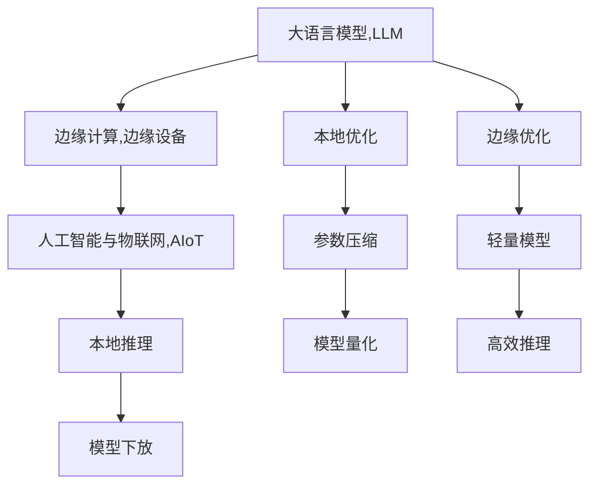

                 

# LLM与边缘计算：将AI能力下放到终端

> 关键词：边缘计算,人工智能,人工智能与物联网(AIoT),LLM,终端设备,AI能力下放

## 1. 背景介绍

### 1.1 问题由来
近年来，人工智能(AI)技术的迅猛发展极大地改变了各行各业的生产方式和消费模式。在AI领域中，语言模型(Language Model, LLM)的进展尤为显著，特别是在自然语言处理(Natural Language Processing, NLP)领域，语言模型的能力已经超越了传统的方法，展现出了强大的泛化能力和理解能力。

然而，尽管语言模型在中央服务器上训练得到的性能令人瞩目，但在实际应用场景中，其部署和运行仍存在诸多挑战：

1. **带宽与延迟**：传统基于云端的AI计算需要大量的数据传输，产生了较高的带宽需求和延迟。对于对实时性要求较高的应用场景，如自动驾驶、医疗诊断等，这种延迟可能造成严重的后果。

2. **隐私与安全**：在云端进行模型训练和推理，意味着用户的隐私数据需要上传至云端进行处理，可能带来数据泄露和隐私风险。

3. **计算资源消耗**：训练和运行大型语言模型需要庞大的计算资源，这在云端的部署和维护成本较高。

4. **部署灵活性不足**：由于模型庞大且复杂，部署在云端后无法灵活地调整模型参数和优化算法，对现场环境变化的适应性不足。

针对这些问题，边缘计算(Edge Computing)技术应运而生。边缘计算将计算能力下放到终端设备，减少了数据传输的带宽需求和延迟，提高了数据处理的实时性和隐私性，同时也降低了计算资源的消耗和部署成本。

## 2. 核心概念与联系

### 2.1 核心概念概述

为更好地理解LLM与边缘计算结合的机制，本节将介绍几个核心概念：

- **边缘计算**：指将数据处理和分析能力从中心服务器下放到终端设备上，以减少延迟和带宽需求，提升数据处理的实时性和安全性。

- **人工智能与物联网(AIoT)**：将人工智能与物联网技术结合，利用智能终端设备和传感器数据，提供更加智能化、个性化的服务。

- **大语言模型(LLM)**：以Transformer架构为代表的深度学习模型，用于处理和理解自然语言数据，可以应用于各种NLP任务，如文本生成、机器翻译、问答等。

- **模型下放**：将大语言模型直接下放到终端设备上运行，以减少对云端计算资源的依赖，增强系统的实时性和可控性。

- **本地推理**：在终端设备上进行推理计算，直接从传感器数据或本地数据中生成结果，避免了数据传输带来的延迟和带宽需求。

这些核心概念之间的逻辑关系可以通过以下Mermaid流程图来展示：



这个流程图展示了LLM与边缘计算结合的核心过程：

1. 大语言模型通过预训练得到基础能力。
2. 利用边缘计算将计算能力下放到终端设备。
3. 通过本地推理，在终端设备上直接生成结果。
4. 使用本地优化、参数压缩、模型量化等技术，减小模型规模。
5. 进一步在边缘设备上进行优化，生成轻量级模型。
6. 实现高效推理，适应实时性需求。

## 3. 核心算法原理 & 具体操作步骤
### 3.1 算法原理概述

将大语言模型下放到边缘设备上进行推理，本质上是对模型进行压缩、量化和优化，使其能够在有限的计算资源下高效运行。

形式化地，设预训练的大语言模型为 $M_{\theta}$，其中 $\theta$ 为模型参数。假设边缘设备上仅能运行轻量级模型，其参数集合为 $\theta_e$。目标是将 $M_{\theta}$ 压缩为 $\theta_e$，即找到最优参数 $\hat{\theta_e}$，使得：

$$
\hat{\theta_e} = \mathop{\arg\min}_{\theta_e} \mathcal{L}(\theta_e, M_{\theta}(\cdot))
$$

其中 $\mathcal{L}$ 为在边缘设备上的推理损失函数，通常考虑计算时间、内存占用等因素。

### 3.2 算法步骤详解

基于LLM与边缘计算结合的微调方法，一般包括以下几个关键步骤：

**Step 1: 模型下放与优化**

- 选择预训练的大语言模型 $M_{\theta}$，并将其压缩到边缘设备上运行。
- 应用参数压缩、量化、剪枝等技术，减少模型大小，同时尽量保持模型的准确性。
- 在边缘设备上，进行本地优化，调整模型结构和超参数，提升推理效率。

**Step 2: 本地数据处理**

- 收集终端设备上的传感器数据或本地数据。
- 使用数据增强、预处理等技术，提高数据质量，适应模型输入格式。

**Step 3: 推理与反馈**

- 在边缘设备上对数据进行推理计算，直接输出结果。
- 将推理结果与期望输出进行对比，计算误差。
- 根据误差调整模型参数，重新计算并输出结果，不断迭代优化。

**Step 4: 应用与部署**

- 将优化后的模型部署到终端设备上。
- 在实际应用场景中，使用优化后的模型进行推理计算。
- 实时监测模型性能，根据反馈进行参数调整和优化。

以上是基于LLM与边缘计算结合的微调方法的详细步骤。在实际应用中，还需要根据具体任务和场景，对每个环节进行优化设计，如改进数据处理流程、优化推理算法、增加动态调整机制等，以进一步提升模型性能。

### 3.3 算法优缺点

基于LLM与边缘计算结合的方法，具有以下优点：

1. **实时性提升**：边缘设备上的推理计算直接对本地数据进行处理，减少了数据传输带来的延迟，提高了实时性。
2. **隐私保护**：减少了对云端计算的依赖，数据在本地设备处理，避免了数据泄露和隐私风险。
3. **成本降低**：减少了对高性能云端计算资源的依赖，降低了部署和维护成本。
4. **灵活性增强**：可以动态调整模型参数和超参数，适应不同的现场环境。

同时，该方法也存在一定的局限性：

1. **计算资源受限**：边缘设备的计算资源和内存有限，模型压缩和量化可能影响模型精度。
2. **模型泛化能力有限**：在模型规模减小后，可能影响其泛化能力，导致在小规模数据上性能下降。
3. **本地优化难度较大**：边缘设备上的优化计算资源有限，模型参数调整复杂，难以像云端一样方便地进行大规模实验。
4. **安全问题**：模型下放到终端设备后，可能面临模型被篡改、攻击等安全问题。

尽管存在这些局限性，但就目前而言，基于LLM与边缘计算结合的方法仍是提升AI实时性和可控性的重要手段。未来相关研究的重点在于如何进一步降低模型对计算资源的需求，提高模型的泛化能力和灵活性，同时兼顾安全和隐私保护。

### 3.4 算法应用领域

基于LLM与边缘计算结合的微调方法，在众多领域得到了广泛的应用，例如：

- **智能家居**：将语音识别、智能推理等任务下放到智能家居设备上，提升家居自动化水平，为用户提供个性化服务。
- **工业制造**：将机器视觉、质量检测等任务下放到工业设备上，实现实时监测和故障预测，提高生产效率。
- **智慧医疗**：将图像诊断、语音识别等任务下放到医疗设备上，提升诊断速度和准确性，改善患者体验。
- **自动驾驶**：将语音控制、环境感知等任务下放到车载设备上，实现实时决策和控制，提高行车安全。
- **智慧农业**：将图像识别、环境监测等任务下放到农业设备上，实现实时分析和管理，提升农业生产效率。

除了这些传统领域，大语言模型与边缘计算的结合还将在更多场景中得到应用，为各行各业带来新的发展机遇。

## 4. 数学模型和公式 & 详细讲解 & 举例说明

### 4.1 数学模型构建

设预训练的大语言模型为 $M_{\theta}$，其中 $\theta$ 为模型参数。在边缘设备上运行轻量级模型 $M_{\theta_e}$，其中 $\theta_e$ 为模型参数。

模型下放的优化目标是最小化推理损失函数，即找到最优参数 $\hat{\theta_e}$，使得：

$$
\hat{\theta_e} = \mathop{\arg\min}_{\theta_e} \mathcal{L}(\theta_e, M_{\theta}(\cdot))
$$

其中 $\mathcal{L}$ 为在边缘设备上的推理损失函数，考虑计算时间、内存占用等因素。

### 4.2 公式推导过程

以下我们以图像识别任务为例，推导模型下放过程的损失函数及其梯度计算。

假设预训练模型为 $M_{\theta}$，输入为图像 $x$，输出为类别概率分布 $P_{\theta}(x)$。轻量级模型为 $M_{\theta_e}$，输入为图像 $x$，输出为类别概率分布 $P_{\theta_e}(x)$。

设 $M_{\theta_e}$ 的推理损失函数为 $\mathcal{L}(x) = (P_{\theta_e}(x) - P_{\theta}(x))^2$。目标是找到一个 $\theta_e$，使得 $\mathcal{L}(x)$ 最小。

根据梯度下降算法，模型下放的优化目标可以写为：

$$
\hat{\theta_e} = \theta_e - \eta \nabla_{\theta_e} \mathcal{L}(\theta_e, M_{\theta}(x))
$$

其中 $\eta$ 为学习率。

### 4.3 案例分析与讲解

假设有一张图像 $x$，预训练模型 $M_{\theta}$ 和轻量级模型 $M_{\theta_e}$ 对图像的类别预测概率分别为 $P_{\theta}(x) = [0.5, 0.3, 0.2]$ 和 $P_{\theta_e}(x) = [0.6, 0.3, 0.1]$。

推理损失为 $\mathcal{L}(x) = (P_{\theta_e}(x) - P_{\theta}(x))^2 = [0.1, 0.09, 0.04]^2 = [0.01, 0.81, 0.16]$。

设学习率为 $\eta = 0.1$，根据梯度下降算法，模型参数的更新为：

$$
\theta_e \leftarrow \theta_e - 0.1 \nabla_{\theta_e} \mathcal{L}(\theta_e, M_{\theta}(x))
$$

其中 $\nabla_{\theta_e} \mathcal{L}(\theta_e, M_{\theta}(x))$ 为 $\mathcal{L}(x)$ 对 $\theta_e$ 的梯度，可通过反向传播算法高效计算。

通过不断迭代更新模型参数 $\theta_e$，直到 $\mathcal{L}(x)$ 收敛，最终得到优化后的模型参数 $\hat{\theta_e}$。

## 5. 项目实践：代码实例和详细解释说明

### 5.1 开发环境搭建

在进行模型下放实践前，我们需要准备好开发环境。以下是使用Python进行PyTorch开发的环境配置流程：

1. 安装Anaconda：从官网下载并安装Anaconda，用于创建独立的Python环境。

2. 创建并激活虚拟环境：
```bash
conda create -n pytorch-env python=3.8 
conda activate pytorch-env
```

3. 安装PyTorch：根据CUDA版本，从官网获取对应的安装命令。例如：
```bash
conda install pytorch torchvision torchaudio cudatoolkit=11.1 -c pytorch -c conda-forge
```

4. 安装TensorFlow：
```bash
conda install tensorflow -c tensorflow
```

5. 安装TensorBoard：
```bash
conda install tensorboard
```

6. 安装Jupyter Notebook：
```bash
conda install jupyter notebook
```

完成上述步骤后，即可在`pytorch-env`环境中开始模型下放实践。

### 5.2 源代码详细实现

下面我们以图像识别任务为例，给出使用TensorFlow进行模型下放的PyTorch代码实现。

首先，定义图像识别任务的模型：

```python
import tensorflow as tf
from tensorflow.keras import layers

model = tf.keras.Sequential([
    layers.Conv2D(32, (3,3), activation='relu', input_shape=(32,32,3)),
    layers.MaxPooling2D((2,2)),
    layers.Conv2D(64, (3,3), activation='relu'),
    layers.MaxPooling2D((2,2)),
    layers.Flatten(),
    layers.Dense(64, activation='relu'),
    layers.Dense(10)
])
```

然后，定义边缘设备上的轻量级模型：

```python
import numpy as np
from tensorflow.lite import TFLiteConverter

input_shape = (32, 32, 3)
converter = TFLiteConverter.from_keras_model(model)
converter.target_spec.supported_ops = [tf.lite.OpsSet.TFLITE_BUILTINS]
tflite_model = converter.convert()
```

接着，定义数据处理函数：

```python
def preprocess_image(image):
    image = tf.image.resize(image, (32, 32))
    image = tf.image.convert_image_dtype(image, tf.float32)
    image = image / 255.0
    return image
```

最后，启动模型下放流程：

```python
def run_inference(image):
    image = preprocess_image(image)
    image = np.expand_dims(image, axis=0)
    interpreter = tf.lite.Interpreter(model_content=tflite_model)
    interpreter.allocate_tensors()
    interpreter.get_input_details()[0]['index'][0] = image
    interpreter.invoke()
    output = interpreter.get_output_details()[0]['index'][0]
    return output
```

### 5.3 代码解读与分析

让我们再详细解读一下关键代码的实现细节：

**模型定义**：
- 使用TensorFlow定义了包含卷积、池化、全连接层的图像识别模型。

**轻量级模型**：
- 使用TensorFlow Lite Converter将Keras模型转换为TFLite格式，以适应边缘设备。

**数据预处理**：
- 定义了图像预处理函数，包括大小调整、类型转换和归一化。

**推理计算**：
- 定义了在边缘设备上对图像进行推理计算的函数。

可以看到，TensorFlow提供了方便的模型转换工具，使得模型下放到边缘设备上变得容易实现。TensorFlow Lite是专门针对移动和嵌入式设备的模型优化工具，可以显著减小模型大小，提升推理速度。

## 6. 实际应用场景

### 6.1 智能家居

智能家居设备的普及使得家庭环境变得更加智能化、自动化。然而，由于家庭环境中的数据种类繁多，如语音指令、传感器数据等，传统的基于云端的AI系统无法满足实时性和隐私性的需求。

通过将大语言模型与边缘计算结合，智能家居系统可以更加灵活、高效地处理数据，实现更加个性化、实时性的服务。例如，智能音箱可以通过本地推理实现实时语音识别和指令执行，智能窗帘可以根据环境光照自动调整开合状态，智能冰箱可以根据食材剩余自动生成购物清单等。

### 6.2 工业制造

在工业制造领域，生产线上大量的传感器和设备实时生成大量数据。传统集中式数据分析系统面临计算资源和网络带宽的瓶颈，难以满足实时性需求。

通过将大语言模型下放到边缘设备，工业制造系统可以实现实时监测和分析。例如，机器视觉系统可以对生产线上的产品进行实时缺陷检测和分类，预测设备故障并进行自我维护，提高生产效率和产品质量。

### 6.3 智慧医疗

智慧医疗系统需要实时处理大量的患者数据，包括病历、影像、基因数据等。传统集中式存储和分析方式不仅数据传输量大，且对隐私保护要求高。

通过将大语言模型下放到边缘设备，智慧医疗系统可以实现实时数据处理和分析。例如，智能诊断设备可以对患者影像进行实时分析，提出诊断建议，减少医生工作负担，提升诊断准确性。智能穿戴设备可以实时监测患者健康状况，提供个性化的医疗建议。

### 6.4 未来应用展望

随着LLM与边缘计算结合技术的不断发展，未来将在更多领域得到应用，带来更多的创新和变革：

1. **自动驾驶**：自动驾驶系统对实时性和安全性的要求极高，将大语言模型下放到车载设备上，可以实现实时环境感知、语音指令控制和决策推理，提升行车安全和舒适性。
2. **智慧农业**：智慧农业系统需要对实时气象数据、土壤数据进行实时分析，通过将大语言模型下放到农业设备上，可以实现实时农作物生长监测、水肥管理等，提升农业生产效率。
3. **智能交通**：智能交通系统需要对实时交通数据进行实时分析，通过将大语言模型下放到交通设备上，可以实现实时交通预测、应急调度等，提升城市交通管理效率。

除了这些应用场景，LLM与边缘计算结合技术还将在更多领域得到应用，为各行各业带来新的发展机遇。

## 7. 工具和资源推荐
### 7.1 学习资源推荐

为了帮助开发者系统掌握LLM与边缘计算结合的理论基础和实践技巧，这里推荐一些优质的学习资源：

1. **《Edge Computing: From Concept to Implementation》**：一本详细介绍边缘计算的书籍，涵盖边缘计算的基础概念、架构设计、实际应用等多个方面。

2. **《TensorFlow Lite: A Developer's Guide》**：TensorFlow官方发布的模型优化和转换工具指南，详细介绍了TensorFlow Lite的使用方法和最佳实践。

3. **《Machine Learning with Python》**：一本介绍机器学习与深度学习的书籍，包含大量实战案例，涵盖了模型压缩、量化等优化技术。

4. **TensorFlow官方文档**：提供了大量的教程、示例和API文档，是学习和实践TensorFlow Lite的重要资源。

5. **GitHub上的TensorFlow Lite项目**：展示了大量使用TensorFlow Lite进行模型优化和转换的实际案例，提供了丰富的参考和借鉴。

通过对这些资源的学习实践，相信你一定能够快速掌握LLM与边缘计算结合的精髓，并用于解决实际的AI应用问题。

### 7.2 开发工具推荐

高效的开发离不开优秀的工具支持。以下是几款用于LLM与边缘计算结合开发的常用工具：

1. **PyTorch**：基于Python的开源深度学习框架，灵活的动态计算图，适合快速迭代研究。

2. **TensorFlow**：由Google主导开发的开源深度学习框架，生产部署方便，适合大规模工程应用。

3. **TensorFlow Lite**：TensorFlow的移动和嵌入式设备优化版本，提供了丰富的模型优化和转换工具。

4. **Jupyter Notebook**：交互式编程环境，方便代码测试和调试，适合快速原型开发和研究。

5. **Weights & Biases**：模型训练的实验跟踪工具，可以记录和可视化模型训练过程中的各项指标，方便对比和调优。

6. **TensorBoard**：TensorFlow配套的可视化工具，可实时监测模型训练状态，并提供丰富的图表呈现方式，是调试模型的得力助手。

合理利用这些工具，可以显著提升LLM与边缘计算结合任务的开发效率，加快创新迭代的步伐。

### 7.3 相关论文推荐

LLM与边缘计算结合技术的发展源于学界的持续研究。以下是几篇奠基性的相关论文，推荐阅读：

1. **“Edge Computing: A survey”**：对边缘计算进行了全面回顾和总结，介绍了边缘计算的定义、架构、应用等。

2. **“Model Compression and Optimization for Edge Computing”**：研究了模型压缩、量化等技术在边缘计算中的应用，探讨了如何优化边缘设备的计算资源。

3. **“Deep Learning in Edge Computing: A Survey”**：综述了深度学习在边缘计算中的应用，涵盖了模型下放、推理优化等多个方面。

4. **“Model Downloading and Streaming in Edge Computing”**：研究了模型下放和数据流优化技术，介绍了如何在边缘设备上高效运行大模型。

5. **“Edge Computing in Industrial Internet of Things (IIoT)”**：探讨了工业互联网中的边缘计算应用，介绍了如何利用边缘计算提升工业设备的智能化水平。

这些论文代表了大语言模型与边缘计算结合技术的发展脉络。通过学习这些前沿成果，可以帮助研究者把握学科前进方向，激发更多的创新灵感。

## 8. 总结：未来发展趋势与挑战

### 8.1 研究成果总结

本文对基于LLM与边缘计算结合的方法进行了全面系统的介绍。首先阐述了LLM与边缘计算的结合背景和意义，明确了其对实时性、隐私性、可控性和成本控制的提升作用。其次，从原理到实践，详细讲解了模型下放的数学原理和关键步骤，给出了模型下放任务开发的完整代码实例。同时，本文还广泛探讨了LLM与边缘计算结合方法在智能家居、工业制造、智慧医疗等多个领域的应用前景，展示了其在推动AI技术落地应用中的巨大潜力。

通过本文的系统梳理，可以看到，LLM与边缘计算结合技术正在成为AI实时性和可控性的重要手段，极大地拓展了AI技术的应用边界，为各行各业带来新的发展机遇。未来，伴随LLM与边缘计算结合技术的不断演进，相信AI技术必将在更广泛的领域实现规模化落地。

### 8.2 未来发展趋势

展望未来，LLM与边缘计算结合技术将呈现以下几个发展趋势：

1. **模型规模持续增大**：随着算力成本的下降和数据规模的扩张，预训练语言模型的参数量还将持续增长。超大规模语言模型蕴含的丰富语言知识，有望支撑更加复杂多变的下游任务。

2. **模型下放技术不断提升**：新的模型压缩、量化、剪枝等技术将不断涌现，进一步减小模型规模，提高推理效率。

3. **边缘计算平台更加完善**：随着边缘计算技术的不断发展，边缘计算平台将更加成熟，能够支持更多的AI模型下放和优化。

4. **融合多模态数据**：未来的模型下放将不仅仅限于文本数据，还将融合图像、视频、语音等多模态数据，实现更加全面、精准的推理。

5. **跨领域应用扩展**：LLM与边缘计算结合技术将在更多领域得到应用，推动各行各业的智能化转型。

以上趋势凸显了LLM与边缘计算结合技术的广阔前景。这些方向的探索发展，必将进一步提升AI系统的性能和应用范围，为人类认知智能的进化带来深远影响。

### 8.3 面临的挑战

尽管LLM与边缘计算结合技术已经取得了瞩目成就，但在迈向更加智能化、普适化应用的过程中，它仍面临着诸多挑战：

1. **计算资源受限**：边缘设备的计算资源和内存有限，模型压缩和量化可能影响模型精度。

2. **模型泛化能力有限**：在模型规模减小后，可能影响其泛化能力，导致在小规模数据上性能下降。

3. **本地优化难度较大**：边缘设备上的优化计算资源有限，模型参数调整复杂，难以像云端一样方便地进行大规模实验。

4. **安全问题**：模型下放到终端设备后，可能面临模型被篡改、攻击等安全问题。

5. **隐私保护**：边缘计算虽然减少了数据传输，但仍需对本地数据进行处理，需要考虑隐私保护问题。

尽管存在这些挑战，但通过持续的技术创新和优化，相信LLM与边缘计算结合技术将不断克服障碍，实现更加灵活、高效、安全的AI应用。

### 8.4 研究展望

面对LLM与边缘计算结合所面临的挑战，未来的研究需要在以下几个方面寻求新的突破：

1. **探索无监督和半监督下放方法**：摆脱对大规模标注数据的依赖，利用自监督学习、主动学习等无监督和半监督范式，最大限度利用非结构化数据，实现更加灵活高效的模型下放。

2. **研究高效推理技术**：开发更加高效的推理算法和硬件加速技术，在保证模型精度的前提下，进一步提升推理速度和资源利用率。

3. **融合多模态数据**：将符号化的先验知识，如知识图谱、逻辑规则等，与神经网络模型进行巧妙融合，引导模型下放过程学习更准确、合理的语言模型。

4. **引入因果分析和博弈论工具**：将因果分析方法引入模型下放模型，识别出模型决策的关键特征，增强输出解释的因果性和逻辑性。借助博弈论工具刻画人机交互过程，主动探索并规避模型的脆弱点，提高系统稳定性。

5. **纳入伦理道德约束**：在模型下放目标中引入伦理导向的评估指标，过滤和惩罚有偏见、有害的输出倾向。同时加强人工干预和审核，建立模型行为的监管机制，确保输出符合人类价值观和伦理道德。

这些研究方向的探索，必将引领LLM与边缘计算结合技术迈向更高的台阶，为构建安全、可靠、可解释、可控的智能系统铺平道路。面向未来，LLM与边缘计算结合技术还需要与其他人工智能技术进行更深入的融合，如知识表示、因果推理、强化学习等，多路径协同发力，共同推动自然语言理解和智能交互系统的进步。只有勇于创新、敢于突破，才能不断拓展语言模型的边界，让智能技术更好地造福人类社会。

## 9. 附录：常见问题与解答

**Q1：大语言模型下放过程中如何保证模型精度？**

A: 大语言模型下放过程中，模型压缩和量化等技术可能会影响模型精度。为保证模型精度，可以采用以下方法：

1. **量化技术**：使用定点量化技术，将模型参数转换为定点数，减少内存占用和计算资源。

2. **剪枝技术**：去除模型中冗余的参数，减小模型规模，同时尽量保持模型的准确性。

3. **微调技术**：在边缘设备上微调模型，调整模型参数以适应新数据。

4. **混合精度训练**：在边缘设备上使用混合精度训练，提高计算效率同时保持模型精度。

5. **多模型集成**：训练多个下放后的模型，取平均输出，抑制过拟合。

这些方法可以结合使用，以平衡模型精度和推理效率，确保模型下放的成功。

**Q2：边缘设备上的轻量级模型如何保证实时性？**

A: 边缘设备上的轻量级模型可以通过以下方法保证实时性：

1. **模型量化**：将浮点模型转换为定点模型，减小内存占用，提高推理速度。

2. **模型压缩**：使用剪枝、知识蒸馏等技术，减小模型规模，提高推理效率。

3. **并行计算**：在边缘设备上使用并行计算，提高推理速度。

4. **异步推理**：将推理任务异步化，减少等待时间。

5. **数据缓存**：将常用数据缓存到边缘设备上，减少数据加载时间。

通过这些优化措施，可以显著提高边缘设备上轻量级模型的推理速度，满足实时性需求。

**Q3：边缘计算下放过程中如何保证模型安全？**

A: 边缘计算下放过程中，模型安全是一个重要问题。为保证模型安全，可以采用以下方法：

1. **模型加密**：在模型下放前进行加密处理，防止模型被非法获取。

2. **权限控制**：对模型访问进行严格权限控制，防止未授权访问。

3. **安全计算**：在边缘设备上使用安全计算技术，防止模型被篡改和攻击。

4. **定期更新**：定期更新模型，防止恶意攻击和漏洞利用。

5. **数据脱敏**：对输入数据进行脱敏处理，防止敏感信息泄露。

通过这些措施，可以有效保障模型下放过程中的安全性，保护用户数据和模型不受攻击。

**Q4：边缘计算下放过程中如何保证模型隐私？**

A: 边缘计算下放过程中，隐私保护是一个重要问题。为保证模型隐私，可以采用以下方法：

1. **数据加密**：对输入数据进行加密处理，防止数据泄露。

2. **隐私保护算法**：使用差分隐私等隐私保护算法，保护用户隐私。

3. **本地计算**：在边缘设备上进行本地计算，减少数据传输。

4. **多模型融合**：使用多模型融合技术，防止单模型泄露敏感信息。

5. **隐私审计**：定期进行隐私审计，确保模型隐私保护措施有效。

通过这些措施，可以有效保障模型下放过程中的隐私保护，保护用户数据不受侵犯。

**Q5：边缘计算下放过程中如何保证模型性能？**

A: 边缘计算下放过程中，保证模型性能是一个重要问题。为保证模型性能，可以采用以下方法：

1. **模型压缩**：使用剪枝、量化等技术，减小模型规模。

2. **模型微调**：在边缘设备上微调模型，适应新数据。

3. **模型融合**：使用多模型融合技术，提高模型性能。

4. **动态优化**：根据现场环境动态调整模型参数，优化模型性能。

5. **在线学习**：在边缘设备上进行在线学习，不断优化模型性能。

通过这些措施，可以有效保障模型下放过程中的性能，满足应用需求。

**Q6：边缘计算下放过程中如何保证模型可解释性？**

A: 边缘计算下放过程中，保证模型可解释性是一个重要问题。为保证模型可解释性，可以采用以下方法：

1. **透明模型**：使用可解释性较高的模型，如决策树、线性回归等，保证模型可解释性。

2. **可解释性算法**：使用可解释性算法，如LIME、SHAP等，解释模型输出。

3. **模型可视化**：使用可视化工具，展示模型内部结构和工作机制。

4. **人工干预**：在关键决策环节，进行人工干预和审核，保证模型输出合理。

通过这些措施，可以有效保障模型下放过程中的可解释性，确保模型输出符合人类价值观和伦理道德。

---

作者：禅与计算机程序设计艺术 / Zen and the Art of Computer Programming

