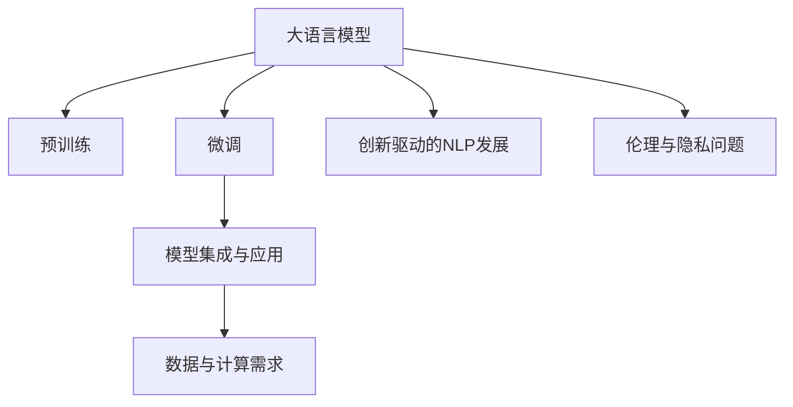

                 

# LLM产业链:AI价值重塑的新机遇

> 关键词：
- 大语言模型(LLM)产业链
- AI价值重塑
- 预训练和微调
- 模型集成与应用
- 数据与计算需求
- 创新驱动的NLP发展
- 伦理与隐私问题

## 1. 背景介绍

### 1.1 问题由来
近年来，人工智能技术在各个领域迅速发展，尤其是在自然语言处理(NLP)领域，大语言模型(LLM)的崛起引发了产业界的广泛关注。LLM如GPT-3、BERT等，通过在大规模无标签文本语料上进行预训练，学习到了强大的语言理解和生成能力，能够在多个NLP任务中取得优异的表现。

与此同时，LLM的出现也促使产业链上下游的企业开始重塑AI价值链，从数据、模型、应用到服务等各个环节都发生了深刻变化。本文将深入分析LLM产业链的各个组成部分，探讨其在AI价值重塑中的新机遇。

### 1.2 问题核心关键点
LLM产业链的核心关键点包括：

- **预训练与微调**：大语言模型一般通过预训练获取通用语言能力，并通过微调适配特定任务，提升性能。
- **模型集成与应用**：LLM作为通用平台，能够提供丰富的集成API和应用，适应各种场景需求。
- **数据与计算需求**：预训练和微调需要海量数据和强大计算能力，对基础设施提出了高要求。
- **创新驱动的NLP发展**：通过不断迭代优化，LLM推动NLP技术在各个垂直领域的应用。
- **伦理与隐私问题**：在提升NLP能力的同时，也需要关注数据隐私和伦理安全问题。

通过分析这些关键点，可以帮助我们更好地理解LLM产业链的结构及其对AI价值重塑的深远影响。

## 2. 核心概念与联系

### 2.1 核心概念概述

为更好地理解LLM产业链，我们首先需要明确几个关键概念：

- **大语言模型(LLM)**：指通过在大规模无标签文本上自监督预训练后，在特定任务上进行微调，获得优异的NLP性能的模型。
- **预训练(Pre-training)**：指在大规模无标签数据上训练模型，学习通用的语言表示，以便在特定任务上表现更好。
- **微调(Fine-tuning)**：指在预训练模型基础上，使用特定任务的标注数据，进一步调整模型以适应该任务。
- **模型集成与应用**：LLM通过API和SDK，集成到各类应用中，如智能客服、内容生成、机器翻译等。
- **数据与计算需求**：预训练和微调需要大量数据和强大计算资源，对基础设施提出了高要求。
- **创新驱动的NLP发展**：通过模型迭代和任务适配，推动NLP技术不断突破。
- **伦理与隐私问题**：在大模型应用中，数据隐私和伦理问题成为需要重点关注的内容。

这些概念通过以下Mermaid流程图展示了它们之间的联系：



## 3. 核心算法原理 & 具体操作步骤

### 3.1 算法原理概述

基于预训练和微调的大语言模型（LLM）流程主要分为两个阶段：预训练和微调。

- **预训练**：在大规模无标签文本数据上自监督地训练模型，学习通用的语言表示。
- **微调**：在特定任务的数据集上，使用少量标注数据对预训练模型进行有监督的调整，以适应该任务。

**算法流程图**：


### 3.2 算法步骤详解

**预训练步骤**：

1. **数据收集**：收集大规模无标签文本数据，如维基百科、新闻、小说等，作为预训练语料。
2. **模型选择**：选择适合的预训练架构，如Transformer、BERT等。
3. **训练过程**：在预训练数据上训练模型，学习语言表示，通常使用自监督任务，如掩码语言模型、Next Sentence Prediction等。
4. **保存模型**：保存预训练模型参数，以便后续微调使用。

**微调步骤**：

1. **数据准备**：准备下游任务的标注数据集，划分为训练集、验证集和测试集。
2. **模型初始化**：加载预训练模型，设置微调参数。
3. **任务适配**：设计任务适配层，如分类头、回归头等，适配特定任务需求。
4. **训练过程**：使用标注数据集在微调模型上进行训练，更新模型参数。
5. **验证和测试**：在验证集和测试集上评估模型性能，调整微调参数。
6. **模型保存**：保存微调后的模型，供实际应用使用。

### 3.3 算法优缺点

**优点**：

- **高效性**：通过预训练和微调，模型能够在少量标注数据下快速达到高水平表现。
- **通用性**：预训练模型可以适应多种下游任务，减少了从头开发模型的成本。
- **扩展性**：通过微调，模型能够不断适应新的任务，具有较好的泛化能力。

**缺点**：

- **计算资源需求高**：预训练和微调需要大量计算资源，对硬件设施提出了高要求。
- **数据依赖性强**：微调效果高度依赖于标注数据的质量和数量，获取高质量标注数据的成本较高。
- **模型复杂性**：大型预训练模型参数复杂，模型管理和维护难度较大。
- **伦理和隐私问题**：模型训练和使用中可能涉及隐私数据和伦理问题，需要严格遵守相关法规。

### 3.4 算法应用领域

基于LLM的预训练和微调方法，已经广泛应用于NLP的各个领域，如：

- **文本分类**：情感分析、主题分类等。
- **命名实体识别**：人名、地名、机构名等实体识别。
- **关系抽取**：实体关系抽取。
- **问答系统**：自然语言问答。
- **机器翻译**：跨语言翻译。
- **文本摘要**：自动摘要。
- **对话系统**：智能对话。

此外，LLM还拓展到更多场景，如可控文本生成、常识推理、代码生成、数据增强等，为NLP技术带来了新的突破。

## 4. 数学模型和公式 & 详细讲解 & 举例说明

### 4.1 数学模型构建

以BERT为例，其预训练和微调的基本模型结构如下：

- **预训练模型**：
  $$
  M_{\theta}(x_i) = \text{BERT}_{\theta}(x_i)
  $$
  其中 $x_i$ 为输入文本，$\theta$ 为模型参数。

- **微调模型**：
  $$
  M_{\theta_f}(x_i) = \text{BERT}_{\theta}(x_i) + \text{Head}_h(x_i)
  $$
  其中 $\text{Head}_h(x_i)$ 为任务适配层，如分类头、回归头等。

### 4.2 公式推导过程

以二分类任务为例，微调模型的目标函数为：

$$
L = -\frac{1}{N}\sum_{i=1}^N [y_i \log M_{\theta_f}(x_i) + (1-y_i)\log(1-M_{\theta_f}(x_i))]
$$

其中 $y_i$ 为真实标签，$N$ 为样本数量。

### 4.3 案例分析与讲解

以BERT微调进行文本分类为例，其微调过程可以分为以下几个步骤：

1. **数据准备**：准备二分类数据集，划分为训练集、验证集和测试集。
2. **模型初始化**：加载BERT预训练模型，设置微调任务（二分类）和参数（如学习率、批大小）。
3. **任务适配**：设计二分类头，并添加交叉熵损失函数。
4. **训练过程**：使用训练集数据，更新模型参数，并使用验证集进行调优。
5. **测试评估**：在测试集上评估模型性能，并保存微调后的模型。

## 5. 项目实践：代码实例和详细解释说明

### 5.1 开发环境搭建

使用Python环境进行项目开发，需要安装以下依赖包：

```bash
pip install transformers torch pandas sklearn
```

### 5.2 源代码详细实现

以下是一个基于BERT的文本分类微调示例：

```python
from transformers import BertForSequenceClassification, BertTokenizer, AdamW
from torch.utils.data import DataLoader, Dataset
from sklearn.model_selection import train_test_split
import torch

# 数据准备
# 假设我们已经有标注好的二分类数据集

class TextDataset(Dataset):
    def __init__(self, texts, labels):
        self.tokenizer = BertTokenizer.from_pretrained('bert-base-cased')
        self.texts = texts
        self.labels = labels
        
    def __len__(self):
        return len(self.texts)
    
    def __getitem__(self, idx):
        text = self.texts[idx]
        label = self.labels[idx]
        
        encoding = self.tokenizer(text, return_tensors='pt', truncation=True, padding='max_length', max_length=512)
        input_ids = encoding['input_ids'][0]
        attention_mask = encoding['attention_mask'][0]
        labels = torch.tensor(label, dtype=torch.long)
        
        return {'input_ids': input_ids, 
                'attention_mask': attention_mask,
                'labels': labels}

# 加载预训练模型
model = BertForSequenceClassification.from_pretrained('bert-base-cased', num_labels=2)
device = torch.device('cuda' if torch.cuda.is_available() else 'cpu')
model.to(device)

# 定义优化器和学习率
optimizer = AdamW(model.parameters(), lr=2e-5)

# 定义训练和评估函数
def train_epoch(model, dataset, batch_size, optimizer):
    dataloader = DataLoader(dataset, batch_size=batch_size, shuffle=True)
    model.train()
    epoch_loss = 0
    for batch in dataloader:
        input_ids = batch['input_ids'].to(device)
        attention_mask = batch['attention_mask'].to(device)
        labels = batch['labels'].to(device)
        model.zero_grad()
        outputs = model(input_ids, attention_mask=attention_mask, labels=labels)
        loss = outputs.loss
        epoch_loss += loss.item()
        loss.backward()
        optimizer.step()
    return epoch_loss / len(dataloader)

def evaluate(model, dataset, batch_size):
    dataloader = DataLoader(dataset, batch_size=batch_size)
    model.eval()
    preds, labels = [], []
    with torch.no_grad():
        for batch in dataloader:
            input_ids = batch['input_ids'].to(device)
            attention_mask = batch['attention_mask'].to(device)
            labels = batch['labels'].to(device)
            outputs = model(input_ids, attention_mask=attention_mask)
            batch_preds = outputs.logits.argmax(dim=1).to('cpu').tolist()
            batch_labels = labels.to('cpu').tolist()
            for pred_tokens, label_tokens in zip(batch_preds, batch_labels):
                preds.append(pred_tokens[:len(label_tokens)])
                labels.append(label_tokens)
    return preds, labels

# 加载数据集
train_dataset, dev_dataset, test_dataset = train_test_split(train_dataset, dev_dataset, test_dataset)

# 微调模型
epochs = 5
batch_size = 16

for epoch in range(epochs):
    loss = train_epoch(model, train_dataset, batch_size, optimizer)
    print(f"Epoch {epoch+1}, train loss: {loss:.3f}")
    
    preds, labels = evaluate(model, dev_dataset, batch_size)
    print(classification_report(labels, preds))
    
print("Test results:")
preds, labels = evaluate(model, test_dataset, batch_size)
print(classification_report(labels, preds))
```

### 5.3 代码解读与分析

在上述代码中，我们使用了HuggingFace的BERT预训练模型，通过定义自定义数据集、优化器和训练评估函数，实现了文本分类任务的微调。

- **数据集定义**：`TextDataset`类定义了如何从文本和标签中生成模型训练所需的输入。
- **模型加载**：使用`BertForSequenceClassification`加载预训练的BERT模型，并指定二分类任务。
- **优化器和学习率**：定义了AdamW优化器和合适的学习率。
- **训练和评估函数**：实现了训练和评估的完整流程，包括前向传播、损失计算、梯度更新和性能评估。

## 6. 实际应用场景

### 6.1 智能客服系统

智能客服系统通过集成微调后的对话模型，可以实现7x24小时不间断服务，快速响应客户咨询，用自然流畅的语言解答各类常见问题。系统能够理解用户意图，匹配最合适的答案模板进行回复，大幅提升客户咨询体验和问题解决效率。

### 6.2 金融舆情监测

金融机构利用微调的文本分类和情感分析技术，可以实时监测市场舆论动向，规避金融风险。通过微调模型自动判断文本属于何种主题，情感倾向是正面、中性还是负面，系统便能自动预警，帮助金融机构快速应对潜在风险。

### 6.3 个性化推荐系统

个性化推荐系统通过微调的文本分类模型，挖掘用户兴趣偏好，提供更精准、多样的推荐内容。模型从文本内容中准确把握用户的兴趣点，生成推荐列表时，先用候选物品的文本描述作为输入，由模型预测用户的兴趣匹配度，再结合其他特征综合排序，得到个性化程度更高的推荐结果。

### 6.4 未来应用展望

未来，随着预训练语言模型和微调方法的持续演进，基于微调范式将在更多领域得到应用，为传统行业带来变革性影响。

- **智慧医疗**：基于微调的医疗问答、病历分析、药物研发等应用将提升医疗服务的智能化水平，辅助医生诊疗，加速新药开发进程。
- **智能教育**：微调技术可应用于作业批改、学情分析、知识推荐等方面，因材施教，促进教育公平，提高教学质量。
- **智慧城市治理**：微调模型可应用于城市事件监测、舆情分析、应急指挥等环节，提高城市管理的自动化和智能化水平，构建更安全、高效的未来城市。
- **企业生产、社会治理、文娱传媒**等众多领域，基于大模型微调的人工智能应用也将不断涌现，为经济社会发展注入新的动力。

## 7. 工具和资源推荐

### 7.1 学习资源推荐

为帮助开发者系统掌握大语言模型微调的理论基础和实践技巧，这里推荐一些优质的学习资源：

1. 《Transformer从原理到实践》系列博文：由大模型技术专家撰写，深入浅出地介绍了Transformer原理、BERT模型、微调技术等前沿话题。

2. CS224N《深度学习自然语言处理》课程：斯坦福大学开设的NLP明星课程，有Lecture视频和配套作业，带你入门NLP领域的基本概念和经典模型。

3. 《Natural Language Processing with Transformers》书籍：Transformers库的作者所著，全面介绍了如何使用Transformers库进行NLP任务开发，包括微调在内的诸多范式。

4. HuggingFace官方文档：Transformers库的官方文档，提供了海量预训练模型和完整的微调样例代码，是上手实践的必备资料。

5. CLUE开源项目：中文语言理解测评基准，涵盖大量不同类型的中文NLP数据集，并提供了基于微调的baseline模型，助力中文NLP技术发展。

通过对这些资源的学习实践，相信你一定能够快速掌握大语言模型微调的精髓，并用于解决实际的NLP问题。

### 7.2 开发工具推荐

高效的开发离不开优秀的工具支持。以下是几款用于大语言模型微调开发的常用工具：

1. PyTorch：基于Python的开源深度学习框架，灵活动态的计算图，适合快速迭代研究。大部分预训练语言模型都有PyTorch版本的实现。

2. TensorFlow：由Google主导开发的开源深度学习框架，生产部署方便，适合大规模工程应用。同样有丰富的预训练语言模型资源。

3. Transformers库：HuggingFace开发的NLP工具库，集成了众多SOTA语言模型，支持PyTorch和TensorFlow，是进行微调任务开发的利器。

4. Weights & Biases：模型训练的实验跟踪工具，可以记录和可视化模型训练过程中的各项指标，方便对比和调优。与主流深度学习框架无缝集成。

5. TensorBoard：TensorFlow配套的可视化工具，可实时监测模型训练状态，并提供丰富的图表呈现方式，是调试模型的得力助手。

6. Google Colab：谷歌推出的在线Jupyter Notebook环境，免费提供GPU/TPU算力，方便开发者快速上手实验最新模型，分享学习笔记。

合理利用这些工具，可以显著提升大语言模型微调任务的开发效率，加快创新迭代的步伐。

### 7.3 相关论文推荐

大语言模型和微调技术的发展源于学界的持续研究。以下是几篇奠基性的相关论文，推荐阅读：

1. Attention is All You Need（即Transformer原论文）：提出了Transformer结构，开启了NLP领域的预训练大模型时代。

2. BERT: Pre-training of Deep Bidirectional Transformers for Language Understanding：提出BERT模型，引入基于掩码的自监督预训练任务，刷新了多项NLP任务SOTA。

3. Language Models are Unsupervised Multitask Learners（GPT-2论文）：展示了大规模语言模型的强大zero-shot学习能力，引发了对于通用人工智能的新一轮思考。

4. Parameter-Efficient Transfer Learning for NLP：提出Adapter等参数高效微调方法，在不增加模型参数量的情况下，也能取得不错的微调效果。

5. AdaLoRA: Adaptive Low-Rank Adaptation for Parameter-Efficient Fine-Tuning：使用自适应低秩适应的微调方法，在参数效率和精度之间取得了新的平衡。

6. Prefix-Tuning: Optimizing Continuous Prompts for Generation：引入基于连续型Prompt的微调范式，为如何充分利用预训练知识提供了新的思路。

这些论文代表了大语言模型微调技术的发展脉络。通过学习这些前沿成果，可以帮助研究者把握学科前进方向，激发更多的创新灵感。

## 8. 总结：未来发展趋势与挑战

### 8.1 总结

本文对基于预训练和微调的大语言模型（LLM）产业链进行了全面系统的介绍。首先阐述了LLM产业链的各个组成部分，明确了其在AI价值重塑中的重要地位。其次，从原理到实践，详细讲解了预训练和微调的技术细节，给出了微调任务开发的完整代码实例。同时，本文还广泛探讨了LLM在多个行业领域的应用前景，展示了其在推动NLP技术发展中的巨大潜力。此外，本文精选了微调技术的各类学习资源，力求为读者提供全方位的技术指引。

通过本文的系统梳理，可以看到，基于大语言模型的预训练和微调方法正在成为NLP领域的重要范式，极大地拓展了预训练语言模型的应用边界，催生了更多的落地场景。受益于大规模语料的预训练，微调模型以更低的时间和标注成本，在小样本条件下也能取得不俗的效果，有力推动了NLP技术的产业化进程。未来，伴随预训练语言模型和微调方法的持续演进，相信NLP技术将在更广阔的应用领域大放异彩，深刻影响人类的生产生活方式。

### 8.2 未来发展趋势

展望未来，大语言模型预训练和微调技术将呈现以下几个发展趋势：

1. **模型规模持续增大**：随着算力成本的下降和数据规模的扩张，预训练语言模型的参数量还将持续增长。超大规模语言模型蕴含的丰富语言知识，有望支撑更加复杂多变的下游任务微调。

2. **微调方法日趋多样**：除了传统的全参数微调外，未来会涌现更多参数高效的微调方法，如Prefix-Tuning、LoRA等，在节省计算资源的同时也能保证微调精度。

3. **持续学习成为常态**：随着数据分布的不断变化，微调模型也需要持续学习新知识以保持性能。如何在不遗忘原有知识的同时，高效吸收新样本信息，将成为重要的研究课题。

4. **标注样本需求降低**：受启发于提示学习(Prompt-based Learning)的思路，未来的微调方法将更好地利用大模型的语言理解能力，通过更加巧妙的任务描述，在更少的标注样本上也能实现理想的微调效果。

5. **多模态微调崛起**：当前的微调主要聚焦于纯文本数据，未来会进一步拓展到图像、视频、语音等多模态数据微调。多模态信息的融合，将显著提升语言模型对现实世界的理解和建模能力。

6. **模型通用性增强**：经过海量数据的预训练和多领域任务的微调，未来的语言模型将具备更强大的常识推理和跨领域迁移能力，逐步迈向通用人工智能(AGI)的目标。

以上趋势凸显了大语言模型预训练和微调技术的广阔前景。这些方向的探索发展，必将进一步提升NLP系统的性能和应用范围，为人类认知智能的进化带来深远影响。

### 8.3 面临的挑战

尽管大语言模型预训练和微调技术已经取得了瞩目成就，但在迈向更加智能化、普适化应用的过程中，它仍面临着诸多挑战：

1. **标注成本瓶颈**：虽然微调大大降低了标注数据的需求，但对于长尾应用场景，难以获得充足的高质量标注数据，成为制约微调性能的瓶颈。如何进一步降低微调对标注样本的依赖，将是一大难题。

2. **模型鲁棒性不足**：当前微调模型面对域外数据时，泛化性能往往大打折扣。对于测试样本的微小扰动，微调模型的预测也容易发生波动。如何提高微调模型的鲁棒性，避免灾难性遗忘，还需要更多理论和实践的积累。

3. **推理效率有待提高**：大规模语言模型虽然精度高，但在实际部署时往往面临推理速度慢、内存占用大等效率问题。如何在保证性能的同时，简化模型结构，提升推理速度，优化资源占用，将是重要的优化方向。

4. **可解释性亟需加强**：当前微调模型更像是"黑盒"系统，难以解释其内部工作机制和决策逻辑。对于医疗、金融等高风险应用，算法的可解释性和可审计性尤为重要。如何赋予微调模型更强的可解释性，将是亟待攻克的难题。

5. **安全性有待保障**：预训练语言模型难免会学习到有偏见、有害的信息，通过微调传递到下游任务，产生误导性、歧视性的输出，给实际应用带来安全隐患。如何从数据和算法层面消除模型偏见，避免恶意用途，确保输出的安全性，也将是重要的研究课题。

6. **知识整合能力不足**：现有的微调模型往往局限于任务内数据，难以灵活吸收和运用更广泛的先验知识。如何让微调过程更好地与外部知识库、规则库等专家知识结合，形成更加全面、准确的信息整合能力，还有很大的想象空间。

正视预训练和微调面临的这些挑战，积极应对并寻求突破，将是大语言模型预训练和微调走向成熟的必由之路。相信随着学界和产业界的共同努力，这些挑战终将一一被克服，大语言模型预训练和微调必将在构建人机协同的智能时代中扮演越来越重要的角色。

### 8.4 未来突破

面对大语言模型预训练和微调所面临的种种挑战，未来的研究需要在以下几个方面寻求新的突破：

1. **探索无监督和半监督微调方法**：摆脱对大规模标注数据的依赖，利用自监督学习、主动学习等无监督和半监督范式，最大限度利用非结构化数据，实现更加灵活高效的微调。

2. **研究参数高效和计算高效的微调范式**：开发更加参数高效的微调方法，在固定大部分预训练参数的同时，只更新极少量的任务相关参数。同时优化微调模型的计算图，减少前向传播和反向传播的资源消耗，实现更加轻量级、实时性的部署。

3. **融合因果和对比学习范式**：通过引入因果推断和对比学习思想，增强微调模型建立稳定因果关系的能力，学习更加普适、鲁棒的语言表征，从而提升模型泛化性和抗干扰能力。

4. **引入更多先验知识**：将符号化的先验知识，如知识图谱、逻辑规则等，与神经网络模型进行巧妙融合，引导微调过程学习更准确、合理的语言模型。同时加强不同模态数据的整合，实现视觉、语音等多模态信息与文本信息的协同建模。

5. **结合因果分析和博弈论工具**：将因果分析方法引入微调模型，识别出模型决策的关键特征，增强输出解释的因果性和逻辑性。借助博弈论工具刻画人机交互过程，主动探索并规避模型的脆弱点，提高系统稳定性。

6. **纳入伦理道德约束**：在模型训练目标中引入伦理导向的评估指标，过滤和惩罚有偏见、有害的输出倾向。同时加强人工干预和审核，建立模型行为的监管机制，确保输出符合人类价值观和伦理道德。

这些研究方向的探索，必将引领大语言模型预训练和微调技术迈向更高的台阶，为构建安全、可靠、可解释、可控的智能系统铺平道路。面向未来，大语言模型预训练和微调技术还需要与其他人工智能技术进行更深入的融合，如知识表示、因果推理、强化学习等，多路径协同发力，共同推动自然语言理解和智能交互系统的进步。只有勇于创新、敢于突破，才能不断拓展语言模型的边界，让智能技术更好地造福人类社会。

## 9. 附录：常见问题与解答

**Q1：大语言模型预训练和微调是否适用于所有NLP任务？**

A: 大语言模型预训练和微调在大多数NLP任务上都能取得不错的效果，特别是对于数据量较小的任务。但对于一些特定领域的任务，如医学、法律等，仅仅依靠通用语料预训练的模型可能难以很好地适应。此时需要在特定领域语料上进一步预训练，再进行微调，才能获得理想效果。此外，对于一些需要时效性、个性化很强的任务，如对话、推荐等，微调方法也需要针对性的改进优化。

**Q2：预训练和微调过程中如何选择合适的学习率？**

A: 预训练和微调的学习率一般要比从头训练时小1-2个数量级，如果使用过大的学习率，容易破坏预训练权重，导致过拟合。一般建议从1e-5开始调参，逐步减小学习率，直至收敛。也可以使用warmup策略，在开始阶段使用较小的学习率，再逐渐过渡到预设值。需要注意的是，不同的优化器(如AdamW、Adafactor等)以及不同的学习率调度策略，可能需要设置不同的学习率阈值。

**Q3：预训练和微调过程中需要注意哪些资源瓶颈？**

A: 预训练和微调需要大量计算资源，对硬件设施提出了高要求。例如，超大批次的训练和推理可能会遇到显存不足的问题。因此需要采用一些资源优化技术，如梯度积累、混合精度训练、模型并行等，来突破硬件瓶颈。同时，模型的存储和读取也可能占用大量时间和空间，需要采用模型压缩、稀疏化存储等方法进行优化。

**Q4：预训练和微调模型在落地部署时需要注意哪些问题？**

A: 将预训练和微调模型转化为实际应用，还需要考虑以下因素：

- **模型裁剪**：去除不必要的层和参数，减小模型尺寸，加快推理速度。
- **量化加速**：将浮点模型转为定点模型，压缩存储空间，提高计算效率。
- **服务化封装**：将模型封装为标准化服务接口，便于集成调用。
- **弹性伸缩**：根据请求流量动态调整资源配置，平衡服务质量和成本。
- **监控告警**：实时采集系统指标，设置异常告警阈值，确保服务稳定性。
- **安全防护**：采用访问鉴权、数据脱敏等措施，保障数据和模型安全。

预训练和微调模型为NLP应用开启了广阔的想象空间，但如何将强大的性能转化为稳定、高效、安全的业务价值，还需要工程实践的不断打磨。唯有从数据、算法、工程、业务等多个维度协同发力，才能真正实现人工智能技术在垂直行业的规模化落地。

总之，预训练和微调需要开发者根据具体任务，不断迭代和优化模型、数据和算法，方能得到理想的效果。

---

作者：禅与计算机程序设计艺术 / Zen and the Art of Computer Programming

