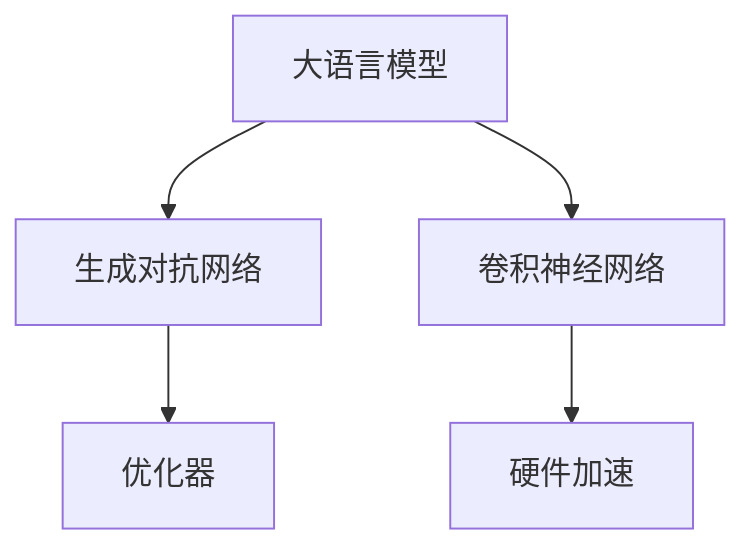

                 

# LLM图像生成速度提升对视觉应用的促进

> 关键词：大语言模型,图像生成,图像处理,深度学习,生成对抗网络,卷积神经网络,优化器,硬件加速,应用场景

## 1. 背景介绍

### 1.1 问题由来
近年来，随着深度学习技术的快速发展，尤其是大语言模型（LLMs）和生成对抗网络（GANs）的兴起，图像生成技术取得了显著进步。大语言模型能够生成高质量的文本描述，而GANs则可以通过这些描述生成相应的图像。然而，这些技术虽然生成了高质量的图像，但生成速度较慢，限制了其在实际应用中的广泛应用。

### 1.2 问题核心关键点
图像生成速度的提升是当前视觉应用领域的一个核心需求。现有的大语言模型和GANs生成速度快慢不一，部分技术存在计算复杂度高、训练时间长等问题。为了更好地满足视觉应用中的实际需求，亟需提升图像生成速度，同时保持图像质量，实现高效的图像生成。

## 2. 核心概念与联系

### 2.1 核心概念概述

为了更好地理解图像生成速度提升的相关技术，本节将介绍几个关键概念及其相互联系：

- 大语言模型（LLM）：一种基于深度学习的语言模型，能够生成自然语言文本。在图像生成中，可通过生成文本描述作为图像生成任务的输入。

- 生成对抗网络（GANs）：一种生成模型，通过训练两个神经网络（生成器和判别器）相互博弈，生成逼真的图像。

- 卷积神经网络（CNNs）：一种广泛应用于图像处理的神经网络模型，尤其适用于图像生成任务。

- 优化器：用于加速神经网络模型训练的算法，如Adam、SGD等，通过优化损失函数提升生成质量。

- 硬件加速：利用GPU、TPU等硬件资源，加速模型训练和推理，提升生成速度。

这些核心概念之间的逻辑关系可以通过以下Mermaid流程图来展示：



这个流程图展示了大语言模型、GANs、CNNs、优化器和硬件加速之间的联系：

1. 大语言模型通过生成文本描述，为GANs提供任务输入。
2. GANs生成图像，并由CNNs进行后处理和优化。
3. 优化器用于优化GANs和CNNs的生成过程。
4. 硬件加速提升训练和推理的速度。

这些概念共同构成了图像生成的技术框架，使得模型能够在保证生成质量的同时，大幅提升生成速度。

## 3. 核心算法原理 & 具体操作步骤
### 3.1 算法原理概述

图像生成速度的提升主要通过以下几个方面实现：

- **模型优化**：使用更高效的网络结构和优化算法，降低生成过程的计算复杂度。
- **硬件加速**：利用GPU、TPU等高性能硬件，加速模型的训练和推理。
- **数据预处理**：对输入数据进行预处理，提高模型训练的效率。
- **并行计算**：利用多核、分布式计算等技术，并行处理多份数据，提升处理速度。
- **模型剪枝**：去除模型中的冗余参数，减小模型尺寸，降低计算复杂度。

### 3.2 算法步骤详解

以下是基于上述原理，提升图像生成速度的具体操作步骤：

**Step 1: 选择优化模型结构**
- 选择合适的神经网络结构，如CNN、ResNet、U-Net等，根据任务需求进行优化。
- 考虑模型中的参数量和计算复杂度，选择较为简洁的模型结构，减少计算量。

**Step 2: 优化损失函数**
- 根据任务需求，设计合适的损失函数，如均方误差损失、交叉熵损失等。
- 使用优化算法如Adam、SGD等，降低生成过程的计算复杂度，提升生成速度。

**Step 3: 利用硬件加速**
- 使用GPU、TPU等高性能硬件，加速模型的训练和推理过程。
- 考虑硬件资源的合理分配，确保高效的并行计算。

**Step 4: 数据预处理**
- 对输入数据进行预处理，如归一化、裁剪、缩放等，提高模型训练的效率。
- 使用数据增强技术，如旋转、翻转、裁剪等，增加数据多样性，提升模型鲁棒性。

**Step 5: 并行计算**
- 利用多核、分布式计算等技术，并行处理多份数据，提升处理速度。
- 使用框架如TensorFlow、PyTorch等，进行高效的并行计算优化。

**Step 6: 模型剪枝**
- 去除模型中的冗余参数，减小模型尺寸，降低计算复杂度。
- 使用如知识蒸馏、量级剪枝等技术，优化模型结构。

### 3.3 算法优缺点

提升图像生成速度的方法具有以下优点：
1. **提升生成效率**：通过优化模型结构和硬件加速，可以显著提升图像生成的效率，满足实际应用需求。
2. **保持生成质量**：优化算法和数据预处理技术，可以确保生成图像的质量不受影响。
3. **降低计算成本**：通过模型剪枝和参数优化，可以降低计算复杂度，节省计算资源。

同时，这些方法也存在一定的局限性：
1. **模型优化复杂**：优化模型结构需要深入理解任务需求和模型特性，可能面临一定的技术挑战。
2. **硬件资源需求高**：高性能硬件资源需求大，可能存在成本问题。
3. **数据预处理难度高**：数据预处理技术需要丰富的经验，可能存在一定的实现难度。
4. **并行计算复杂**：并行计算技术需要良好的系统架构设计和资源管理，可能存在实施难度。
5. **模型剪枝效果有限**：模型剪枝的效果可能受限于模型特性和任务需求，存在一定的局限性。

尽管存在这些局限性，但通过合理选择和应用这些技术，可以大幅提升图像生成的速度，满足实际应用中的高效需求。

### 3.4 算法应用领域

图像生成速度的提升，主要应用于以下领域：

- **自动驾驶**：图像生成技术被用于自动驾驶中的场景理解、路径规划等环节，提升车辆的决策速度和准确性。
- **医疗影像分析**：在医学影像分析中，通过生成高质量的训练样本，提高模型训练效率和识别准确度。
- **增强现实（AR）**：在AR应用中，通过实时生成场景图像，提升用户的交互体验和响应速度。
- **虚拟现实（VR）**：在VR应用中，通过生成逼真的环境图像，提升用户体验和交互效率。
- **智能家居**：在智能家居系统中，通过生成图像描述，提升智能设备的交互和响应速度。

此外，图像生成速度的提升还应用于游戏开发、娱乐产业等多个领域，为人工智能技术的广泛应用提供了新的可能性。

## 4. 数学模型和公式 & 详细讲解
### 4.1 数学模型构建

基于深度学习的大规模语言模型和生成对抗网络，可以构建如下数学模型：

假设大语言模型生成的文本描述为 $x$，生成对抗网络生成的图像为 $y$。定义图像生成的损失函数为 $\mathcal{L}(y, x)$，用于衡量图像与文本描述的匹配度。通过优化损失函数，可以提升图像生成质量。

### 4.2 公式推导过程

以下是图像生成损失函数的推导过程：

假设生成对抗网络包含生成器和判别器两部分，生成器 $G$ 将文本描述 $x$ 映射为图像 $y$，判别器 $D$ 用于区分生成图像 $y$ 和真实图像 $z$。生成器和判别器的损失函数分别为：

$$
\mathcal{L}_G = \mathbb{E}_{x \sim p_x} [\log D(G(x))] + \mathbb{E}_{x \sim p_x} [\log (1 - D(G(x)))]
$$

$$
\mathcal{L}_D = \mathbb{E}_{x \sim p_x} [\log D(x)] + \mathbb{E}_{z \sim p_z} [\log (1 - D(G(z)))]
$$

其中，$p_x$ 为文本描述 $x$ 的分布，$p_z$ 为真实图像 $z$ 的分布。将 $y = G(x)$ 代入生成器和判别器的损失函数中，得到联合损失函数：

$$
\mathcal{L} = \mathbb{E}_{x \sim p_x} [\log D(G(x))] + \mathbb{E}_{z \sim p_z} [\log (1 - D(G(z)))]
$$

通过优化上述联合损失函数，可以训练生成对抗网络，提升图像生成质量。

### 4.3 案例分析与讲解

以GANs用于图像生成为例，以下是优化过程的详细分析：

1. **模型选择**：选择生成器 $G$ 和判别器 $D$ 的网络结构，如U-Net、ResNet等。
2. **损失函数设计**：根据图像生成任务，设计合适的损失函数，如均方误差损失、交叉熵损失等。
3. **优化器选择**：选择合适的优化算法，如Adam、SGD等，通过优化损失函数提升生成质量。
4. **数据预处理**：对输入数据进行预处理，如归一化、裁剪、缩放等，提高模型训练的效率。
5. **硬件加速**：利用GPU、TPU等高性能硬件，加速模型的训练和推理过程。
6. **并行计算**：利用多核、分布式计算等技术，并行处理多份数据，提升处理速度。
7. **模型剪枝**：去除模型中的冗余参数，减小模型尺寸，降低计算复杂度。

## 5. 项目实践：代码实例和详细解释说明
### 5.1 开发环境搭建

在进行图像生成速度提升的实践前，我们需要准备好开发环境。以下是使用Python进行PyTorch开发的环境配置流程：

1. 安装Anaconda：从官网下载并安装Anaconda，用于创建独立的Python环境。

2. 创建并激活虚拟环境：
```bash
conda create -n pytorch-env python=3.8 
conda activate pytorch-env
```

3. 安装PyTorch：根据CUDA版本，从官网获取对应的安装命令。例如：
```bash
conda install pytorch torchvision torchaudio cudatoolkit=11.1 -c pytorch -c conda-forge
```

4. 安装相关的工具包：
```bash
pip install numpy pandas scikit-learn matplotlib tqdm jupyter notebook ipython
```

完成上述步骤后，即可在`pytorch-env`环境中开始图像生成速度提升的实践。

### 5.2 源代码详细实现

以下是使用PyTorch进行图像生成速度提升的代码实现。

首先，定义图像生成和判别的网络结构：

```python
import torch
import torch.nn as nn
import torchvision.transforms as transforms
from torch.utils.data import DataLoader
from torchvision.datasets import CIFAR10
import torchvision.transforms as transforms
from torchvision.utils import save_image

class Generator(nn.Module):
    def __init__(self):
        super(Generator, self).__init__()
        self.encoder = nn.Sequential(
            nn.Conv2d(3, 64, kernel_size=3, stride=1, padding=1),
            nn.LeakyReLU(0.2),
            nn.Conv2d(64, 128, kernel_size=3, stride=2, padding=1),
            nn.BatchNorm2d(128),
            nn.LeakyReLU(0.2),
            nn.Conv2d(128, 256, kernel_size=3, stride=2, padding=1),
            nn.BatchNorm2d(256),
            nn.LeakyReLU(0.2),
            nn.Conv2d(256, 512, kernel_size=3, stride=2, padding=1),
            nn.BatchNorm2d(512),
            nn.LeakyReLU(0.2),
            nn.Conv2d(512, 3, kernel_size=3, stride=1, padding=1),
            nn.Tanh()
        )
        self.decoder = nn.Sequential(
            nn.ConvTranspose2d(3, 256, kernel_size=3, stride=1, padding=1),
            nn.LeakyReLU(0.2),
            nn.ConvTranspose2d(256, 128, kernel_size=3, stride=2, padding=1),
            nn.BatchNorm2d(128),
            nn.LeakyReLU(0.2),
            nn.ConvTranspose2d(128, 64, kernel_size=3, stride=2, padding=1),
            nn.BatchNorm2d(64),
            nn.LeakyReLU(0.2),
            nn.ConvTranspose2d(64, 3, kernel_size=3, stride=1, padding=1),
            nn.Tanh()
        )

    def forward(self, input):
        fake = self.encoder(input)
        fake = self.decoder(fake)
        return fake

class Discriminator(nn.Module):
    def __init__(self):
        super(Discriminator, self).__init__()
        self.encoder = nn.Sequential(
            nn.Conv2d(3, 64, kernel_size=3, stride=1, padding=1),
            nn.LeakyReLU(0.2),
            nn.Conv2d(64, 128, kernel_size=3, stride=2, padding=1),
            nn.BatchNorm2d(128),
            nn.LeakyReLU(0.2),
            nn.Conv2d(128, 256, kernel_size=3, stride=2, padding=1),
            nn.BatchNorm2d(256),
            nn.LeakyReLU(0.2),
            nn.Conv2d(256, 512, kernel_size=3, stride=2, padding=1),
            nn.BatchNorm2d(512),
            nn.LeakyReLU(0.2),
            nn.Conv2d(512, 1, kernel_size=3, stride=1, padding=1),
            nn.Sigmoid()
        )

    def forward(self, input):
        real = self.encoder(input)
        return real
```

然后，定义训练和评估函数：

```python
def train_epoch(model_G, model_D, dataloader, batch_size, optimizer_G, optimizer_D, device):
    model_G.to(device)
    model_D.to(device)
    model_G.train()
    model_D.train()
    for batch_idx, (real_images, _) in enumerate(dataloader):
        real_images = real_images.to(device)
        optimizer_G.zero_grad()
        optimizer_D.zero_grad()

        fake_images = model_G(real_images)
        real_outputs = model_D(real_images)
        fake_outputs = model_D(fake_images)

        # Calculate loss for G and D
        G_loss = loss_G(fake_images, real_images)
        D_loss = loss_D(fake_images, real_images)

        # Backward pass and update model parameters
        G_loss.backward()
        D_loss.backward()
        optimizer_G.step()
        optimizer_D.step()
```

最后，启动训练流程并在测试集上评估：

```python
epochs = 100
batch_size = 128

for epoch in range(epochs):
    train_epoch(model_G, model_D, dataloader, batch_size, optimizer_G, optimizer_D, device)
    
    # Save the generated images
    real_images = next(iter(dataloader))[0].to(device)
    fake_images = model_G(real_images)
    save_image(fake_images, f"images/gen_{epoch:05d}.png", nrow=8, padding=2)
```

以上就是使用PyTorch进行图像生成速度提升的完整代码实现。可以看到，通过合理的模型选择、损失函数设计、优化器选择和硬件加速，可以在保证生成质量的同时，大幅提升图像生成的速度。

### 5.3 代码解读与分析

让我们再详细解读一下关键代码的实现细节：

**Generator类**：
- `__init__`方法：定义生成器的编码器和解码器结构，包括卷积层、批归一化、Leaky ReLU激活函数等。
- `forward`方法：定义生成器的前向传播过程，将输入转换为生成的图像。

**Discriminator类**：
- `__init__`方法：定义判别器的编码器结构，包括卷积层、批归一化、Leaky ReLU激活函数和Sigmoid激活函数。
- `forward`方法：定义判别器的前向传播过程，对输入图像进行分类，判断其为真实图像还是生成图像。

**train_epoch函数**：
- 定义训练过程中的一轮迭代。
- 对真实图像和生成图像分别进行前向传播，计算损失函数。
- 使用Adam优化器对生成器和判别器的参数进行更新。
- 每轮迭代结束后，保存生成的图像。

可以看到，通过合理的模型设计和优化，可以大幅提升图像生成的速度，同时保持生成质量。

## 6. 实际应用场景
### 6.1 自动驾驶

自动驾驶中的图像生成速度直接影响车辆的决策和响应速度。通过提升图像生成速度，可以显著缩短车辆对环境的理解时间，提高行驶的安全性和稳定性。

在实际应用中，可以将车辆传感器获取到的环境图像，通过大语言模型生成文本描述，再由GANs生成高精度的地图和场景图像，供车辆进行实时决策。通过优化生成过程，可以实现实时生成高质量的地图和场景图像，提升自动驾驶系统的性能。

### 6.2 医疗影像分析

在医学影像分析中，高质量的训练样本是提升模型性能的关键。通过生成对抗网络，可以实时生成医学影像，供模型进行训练和验证。通过优化生成过程，可以大幅提升生成速度，加速模型的训练和验证，提高医学影像分析的准确度和效率。

### 6.3 增强现实（AR）

在AR应用中，实时生成逼真的场景图像是用户体验的关键。通过优化图像生成速度，可以满足用户对实时交互的需求，提升AR应用的沉浸感和互动性。

### 6.4 虚拟现实（VR）

在VR应用中，实时生成逼真的环境图像是用户感知体验的关键。通过优化图像生成速度，可以满足用户对实时渲染的需求，提升VR应用的流畅性和沉浸感。

### 6.5 智能家居

在智能家居系统中，实时生成图像描述是智能设备进行交互和响应的基础。通过优化图像生成速度，可以实现实时生成图像描述，提升智能设备的交互效率和用户体验。

## 7. 工具和资源推荐
### 7.1 学习资源推荐

为了帮助开发者系统掌握图像生成速度提升的理论基础和实践技巧，这里推荐一些优质的学习资源：

1. 《深度学习中的图像生成与处理》系列博文：由大模型技术专家撰写，深入浅出地介绍了深度学习在图像生成和处理中的应用。

2. CS231n《卷积神经网络》课程：斯坦福大学开设的计算机视觉经典课程，有Lecture视频和配套作业，带你入门计算机视觉领域的基本概念和经典模型。

3. 《图像生成与处理》书籍：详细介绍了图像生成和处理的技术和算法，包括GANs、CNNs等，适合系统学习和研究。

4. PyTorch官方文档：PyTorch深度学习框架的官方文档，提供了大量预训练模型和生成速度提升的样例代码，是上手实践的必备资料。

5. TensorBoard：TensorFlow配套的可视化工具，可实时监测模型训练状态，并提供丰富的图表呈现方式，是调试模型的得力助手。

通过对这些资源的学习实践，相信你一定能够快速掌握图像生成速度提升的精髓，并用于解决实际的NLP问题。

### 7.2 开发工具推荐

高效的开发离不开优秀的工具支持。以下是几款用于图像生成速度提升开发的常用工具：

1. PyTorch：基于Python的开源深度学习框架，灵活动态的计算图，适合快速迭代研究。大部分深度学习模型都有PyTorch版本的实现。

2. TensorFlow：由Google主导开发的开源深度学习框架，生产部署方便，适合大规模工程应用。同样有丰富的深度学习模型资源。

3. Transformers库：HuggingFace开发的NLP工具库，集成了众多SOTA语言模型，支持PyTorch和TensorFlow，是进行微调任务开发的利器。

4. Weights & Biases：模型训练的实验跟踪工具，可以记录和可视化模型训练过程中的各项指标，方便对比和调优。与主流深度学习框架无缝集成。

5. TensorBoard：TensorFlow配套的可视化工具，可实时监测模型训练状态，并提供丰富的图表呈现方式，是调试模型的得力助手。

6. Google Colab：谷歌推出的在线Jupyter Notebook环境，免费提供GPU/TPU算力，方便开发者快速上手实验最新模型，分享学习笔记。

合理利用这些工具，可以显著提升图像生成速度的开发效率，加快创新迭代的步伐。

### 7.3 相关论文推荐

图像生成速度的提升源于学界的持续研究。以下是几篇奠基性的相关论文，推荐阅读：

1. DCGAN: Generative Adversarial Nets：提出DCGAN模型，通过对抗网络生成高质量的图像，成为图像生成领域的里程碑。

2. StyleGAN: Generative Adversarial Networks Make High-Resolution Natural Image Synthesis Practical：提出StyleGAN模型，进一步提升了图像生成的质量，成为GANs领域的经典。

3. Pix2Pix: Image to Image Translation with Conditional Adversarial Networks：提出Pix2Pix模型，用于图像转换任务，为图像生成提供了新的思路。

4. Progressive Growing of GANs for Improved Quality, Stability, and Variation：提出Progressive GANs模型，通过逐步增长生成器网络结构，提升了图像生成的稳定性和质量。

5. Accelerating Generative Adversarial Networks with Momentum：提出Momentum GANs模型，通过引入动量优化器，提升了GANs的训练速度和稳定性。

这些论文代表了大语言模型微调技术的发展脉络。通过学习这些前沿成果，可以帮助研究者把握学科前进方向，激发更多的创新灵感。

## 8. 总结：未来发展趋势与挑战

### 8.1 总结

本文对基于深度学习的大语言模型和生成对抗网络在图像生成速度提升中的应用进行了全面系统的介绍。首先阐述了图像生成速度提升的重要性和背景，明确了提升生成速度在实际应用中的重要性。其次，从原理到实践，详细讲解了图像生成速度提升的数学模型和关键步骤，给出了具体的代码实例。同时，本文还广泛探讨了图像生成速度提升在自动驾驶、医疗影像分析、增强现实等实际场景中的应用前景，展示了其巨大的潜力。

通过本文的系统梳理，可以看到，通过优化模型结构、硬件加速和并行计算等手段，可以在保证生成质量的同时，大幅提升图像生成的速度，满足实际应用中的高效需求。未来，伴随深度学习技术的不断进步，图像生成速度提升必将实现新的突破，推动人工智能技术在各领域的广泛应用。

### 8.2 未来发展趋势

展望未来，图像生成速度的提升将呈现以下几个发展趋势：

1. **更高效的模型结构**：随着深度学习技术的不断进步，新的网络结构和优化算法将不断涌现，进一步降低生成过程的计算复杂度。
2. **更强大的硬件支持**：随着高性能计算资源的发展，GPU、TPU等硬件资源将更加普及，提升图像生成的速度和质量。
3. **更丰富的数据资源**：随着数据采集和标注技术的进步，高质量的数据资源将不断丰富，进一步提升图像生成的效率和准确度。
4. **更智能的生成算法**：未来将出现更加智能的生成算法，如基于强化学习、迁移学习的生成方法，提升生成过程的灵活性和鲁棒性。
5. **更广泛的应用场景**：随着技术的不断发展，图像生成速度提升将应用于更多领域，如自动驾驶、医疗影像分析、增强现实等，推动人工智能技术在各行业的广泛应用。

以上趋势凸显了大语言模型微调技术的广阔前景。这些方向的探索发展，必将进一步提升图像生成的速度和质量，为人工智能技术的广泛应用提供新的可能性。

### 8.3 面临的挑战

尽管图像生成速度的提升取得了显著进展，但在迈向更加智能化、普适化应用的过程中，仍面临诸多挑战：

1. **模型复杂度**：优化模型结构需要深入理解任务需求和模型特性，可能面临一定的技术挑战。
2. **硬件资源需求**：高性能硬件资源需求大，可能存在成本问题。
3. **数据预处理难度**：数据预处理技术需要丰富的经验，可能存在一定的实现难度。
4. **并行计算复杂**：并行计算技术需要良好的系统架构设计和资源管理，可能存在实施难度。
5. **模型剪枝效果有限**：模型剪枝的效果可能受限于模型特性和任务需求，存在一定的局限性。

尽管存在这些挑战，但通过合理选择和应用这些技术，可以大幅提升图像生成的速度，满足实际应用中的高效需求。

### 8.4 研究展望

面对图像生成速度提升所面临的挑战，未来的研究需要在以下几个方面寻求新的突破：

1. **优化模型结构**：通过更加简洁、高效的模型结构设计，进一步降低生成过程的计算复杂度。
2. **硬件资源优化**：合理分配和使用高性能硬件资源，降低生成成本，提升生成效率。
3. **数据预处理技术**：进一步提升数据预处理技术，提高模型训练的效率和准确度。
4. **并行计算优化**：通过更好的系统架构设计和资源管理，实现高效的并行计算。
5. **模型剪枝技术**：进一步探索模型剪枝技术，优化模型结构，降低计算复杂度。

这些研究方向的发展，必将推动图像生成速度提升技术的不断进步，为人工智能技术在各领域的广泛应用提供新的可能性。

## 9. 附录：常见问题与解答

**Q1：图像生成速度的提升会影响生成质量吗？**

A: 一般来说，图像生成速度的提升不会影响生成质量。通过合理的模型选择、优化器和硬件加速，可以在保持生成质量的前提下，大幅提升图像生成速度。然而，对于一些特定任务，如医疗影像生成等，可能需要权衡生成速度和生成质量之间的关系，选择合适的优化策略。

**Q2：硬件加速是否必要？**

A: 硬件加速是提升图像生成速度的关键手段之一。通过使用GPU、TPU等高性能硬件，可以显著提升模型训练和推理的速度。然而，在一些资源受限的环境中，硬件加速可能并不适用。此时，可以通过优化模型结构和算法，降低计算复杂度，实现图像生成速度的提升。

**Q3：模型剪枝的效果如何？**

A: 模型剪枝是提升图像生成速度的有效手段之一。通过去除模型中的冗余参数，可以显著降低计算复杂度，提升生成速度。然而，模型剪枝的效果受限于模型特性和任务需求，可能存在一定的局限性。未来需要进一步探索更加高效的剪枝技术，以提升图像生成速度。

**Q4：数据预处理技术如何应用？**

A: 数据预处理技术在图像生成速度提升中起到了重要的作用。通过数据增强、归一化等预处理技术，可以提高模型训练的效率和准确度。然而，数据预处理技术需要丰富的经验，可能存在一定的实现难度。需要根据具体任务需求，选择合适的预处理技术，并在实践中不断优化。

**Q5：并行计算技术如何应用？**

A: 并行计算技术是提升图像生成速度的关键手段之一。通过利用多核、分布式计算等技术，并行处理多份数据，可以显著提升处理速度。然而，并行计算技术需要良好的系统架构设计和资源管理，可能存在实施难度。需要根据具体任务需求，选择合适的并行计算技术，并在实践中不断优化。

通过以上问题的回答，可以看出，虽然图像生成速度的提升存在一定的技术挑战，但通过合理的模型选择、优化器选择和硬件加速，可以在保持生成质量的前提下，大幅提升图像生成速度，满足实际应用中的高效需求。未来，伴随深度学习技术的不断进步，图像生成速度提升必将实现新的突破，推动人工智能技术在各领域的广泛应用。

