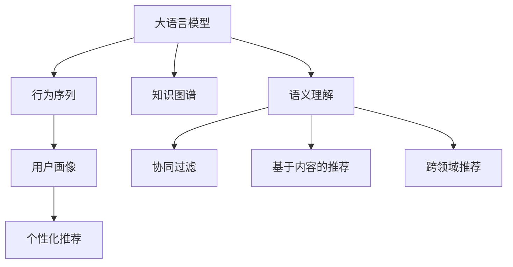

                 

# LLM在个性化推荐系统中的应用

> 关键词：大语言模型,推荐系统,用户画像,行为序列,语义理解,知识图谱,协同过滤,跨领域推荐,元学习

## 1. 背景介绍

### 1.1 问题由来
推荐系统是互联网时代的重要应用之一，旨在为用户推荐个性化的内容或商品，提升用户体验和平台满意度。传统的推荐系统往往依赖用户的历史行为数据，采用协同过滤等方法进行推荐，但这种方法难以捕捉用户深层次的兴趣偏好，推荐效果单一。近年来，大语言模型（Large Language Models, LLMs）的崛起，为推荐系统带来了新的突破，其语义理解能力和丰富的知识图谱信息，能够从用户行为和内容特征等多个维度进行深度建模，提升推荐系统的效果和多样性。

### 1.2 问题核心关键点
大语言模型在推荐系统中的应用，主要体现在以下几个方面：
1. **语义理解**：通过自然语言处理技术，理解用户的查询意图，与内容进行语义匹配，推荐相关内容。
2. **知识图谱**：利用结构化的知识图谱信息，辅助推荐系统更准确地识别实体间关系，丰富推荐内容。
3. **行为序列**：分析用户的兴趣演变轨迹，捕捉长时序兴趣变化，推荐动态变化的内容。
4. **跨领域推荐**：结合多领域的信息，推荐与用户兴趣相关的多样内容，避免信息过载。
5. **元学习**：通过学习用户行为的统计特征，提升推荐模型的泛化能力，快速适应新的数据分布。

这些关键点为大语言模型在推荐系统中的应用提供了理论基础和实践指导。通过语义理解、知识图谱、行为序列、跨领域推荐和元学习等技术，推荐系统能够更加深入地理解和满足用户需求，提升推荐效果和用户体验。

### 1.3 问题研究意义
大语言模型在推荐系统中的应用，具有以下重要意义：
1. **提升推荐精度**：通过语义理解、知识图谱等技术，推荐系统能够更准确地识别用户兴趣和内容相关性，提升推荐精度。
2. **增强推荐多样性**：结合多领域的信息，推荐与用户兴趣相关的多样内容，提升用户体验。
3. **提升用户满意度**：通过深入理解用户需求，推荐系统能够更好地满足用户个性化需求，提升用户满意度。
4. **推动个性化服务发展**：基于用户画像和行为序列的推荐系统，能够实现更精细化的个性化服务，推动个性化服务的深入发展。
5. **促进技术进步**：大语言模型和推荐系统的融合，能够推动推荐技术的新一轮进步，提升技术前沿水平。

## 2. 核心概念与联系

### 2.1 核心概念概述

为了更好地理解大语言模型在推荐系统中的应用，本节将介绍几个核心概念：

- **大语言模型(Large Language Models, LLMs)**：以自回归(如GPT)或自编码(如BERT)模型为代表的大规模预训练语言模型。通过在大规模无标签文本语料上进行预训练，学习通用的语言表示，具备强大的语言理解和生成能力。

- **推荐系统(Recommender System)**：通过收集用户行为数据，利用算法为用户推荐个性化内容或商品的系统。常见的推荐算法包括协同过滤、基于内容的推荐、基于知识的推荐等。

- **用户画像(User Profile)**：基于用户历史行为和社交信息，构建用户兴趣和偏好的抽象表示。用户画像能够帮助推荐系统更好地理解用户需求，实现个性化推荐。

- **行为序列(Sequence of Actions)**：用户与推荐系统交互过程中的历史行为记录，包括点击、浏览、购买等行为。行为序列能够反映用户的兴趣演变轨迹，捕捉用户兴趣的变化趋势。

- **语义理解(Semantic Understanding)**：利用自然语言处理技术，理解用户查询意图和内容特征，实现基于语义的推荐。语义理解能力是大语言模型在推荐系统中的核心优势。

- **知识图谱(Knowledge Graph)**：结构化的语义知识库，包含实体、关系和属性等信息。知识图谱能够丰富推荐系统的内容信息，提升推荐效果和多样性。

这些核心概念之间通过以下Mermaid流程图展示了它们之间的联系：



这个流程图展示了大语言模型在推荐系统中的应用，通过语义理解、知识图谱、行为序列等技术，与用户画像和推荐算法进行互动，实现个性化推荐。

## 3. 核心算法原理 & 具体操作步骤
### 3.1 算法原理概述

大语言模型在推荐系统中的应用，主要基于以下算法原理：

1. **语义理解与匹配**：通过自然语言处理技术，对用户查询和内容进行语义匹配，推荐相关内容。具体实现方式包括预训练语言模型、Transformer等架构。

2. **知识图谱辅助**：利用结构化的知识图谱信息，辅助推荐系统更准确地识别实体间关系，丰富推荐内容。知识图谱中的实体、关系和属性信息，能够增强推荐系统的多样性和准确性。

3. **行为序列分析**：分析用户的兴趣演变轨迹，捕捉长时序兴趣变化，推荐动态变化的内容。行为序列能够捕捉用户的长期兴趣偏好，提升推荐的精准度。

4. **跨领域推荐**：结合多领域的信息，推荐与用户兴趣相关的多样内容，避免信息过载。大语言模型能够从多领域获取信息，实现跨领域推荐。

5. **元学习与个性化**：通过学习用户行为的统计特征，提升推荐模型的泛化能力，快速适应新的数据分布。元学习技术能够提高推荐模型的通用性，适应不同用户和场景。

### 3.2 算法步骤详解

基于大语言模型在推荐系统中的应用，以下是推荐系统的核心算法步骤：

**Step 1: 数据准备**
- 收集用户的历史行为数据，包括浏览、点击、购买等行为记录。
- 收集内容的元数据，包括标题、摘要、标签等信息。
- 构建知识图谱，包含实体、关系和属性信息。

**Step 2: 特征工程**
- 提取用户行为特征，包括行为序列、行为时间、行为频率等。
- 提取内容特征，包括内容标签、内容评分、内容相关度等。
- 利用知识图谱，提取实体间关系和属性信息。

**Step 3: 大语言模型嵌入**
- 将用户行为特征和内容特征输入大语言模型，获取用户兴趣表示和内容表示。
- 利用知识图谱信息，进一步优化用户和内容的表示。

**Step 4: 推荐算法**
- 基于用户兴趣表示和内容表示，进行语义匹配和推荐。
- 结合行为序列信息，进行动态推荐。
- 结合知识图谱信息，进行跨领域推荐。
- 利用元学习技术，提升推荐模型的泛化能力。

**Step 5: 评估与优化**
- 在验证集上评估推荐模型的效果，如准确率、召回率、F1值等。
- 根据评估结果，调整模型参数和算法超参数，优化推荐效果。

**Step 6: 部署与监控**
- 将优化后的模型部署到推荐系统中，进行实时推荐。
- 实时监控推荐系统性能，根据用户反馈和业务需求进行调整。

### 3.3 算法优缺点

大语言模型在推荐系统中的应用，具有以下优点：

1. **语义理解能力强**：大语言模型能够理解用户查询和内容的语义，实现基于语义的推荐，提升推荐精度和用户体验。

2. **跨领域推荐丰富**：结合知识图谱信息，能够从多领域获取信息，实现跨领域推荐，提升推荐多样性。

3. **动态推荐灵活**：结合行为序列信息，能够捕捉用户兴趣变化趋势，实现动态推荐，提升推荐精准度。

4. **泛化能力强**：利用元学习技术，能够快速适应新的数据分布，提升推荐模型的泛化能力。

5. **推荐效果优异**：结合多维度信息，实现更深入的用户理解，提升推荐效果。

同时，该方法也存在一定的局限性：

1. **数据依赖性强**：推荐系统依赖用户行为数据和内容数据，数据不足可能导致推荐效果不佳。

2. **计算资源需求高**：大语言模型和知识图谱的构建需要大量的计算资源，可能导致系统延迟和成本较高。

3. **泛化能力依赖先验知识**：推荐模型依赖知识图谱和元学习技术，先验知识的丰富程度直接影响推荐效果。

4. **公平性和透明性问题**：推荐系统容易受到数据偏见和先验知识的影响，可能导致推荐不公平或透明性问题。

尽管存在这些局限性，但大语言模型在推荐系统中的应用已经取得了显著进展，正逐步成为推荐系统的重要范式。未来研究的方向在于如何进一步降低对数据的依赖，提高推荐系统的效率和公平性，提升推荐系统的实用性和可解释性。

### 3.4 算法应用领域

基于大语言模型在推荐系统中的应用，已在以下领域取得了广泛应用：

1. **电商推荐**：电商网站通过用户行为数据和商品信息，利用大语言模型进行商品推荐，提升用户购物体验。

2. **新闻推荐**：新闻平台通过用户阅读历史和文章内容，利用大语言模型进行文章推荐，提升用户阅读体验。

3. **视频推荐**：视频网站通过用户观看历史和视频标签，利用大语言模型进行视频推荐，提升用户观看体验。

4. **音乐推荐**：音乐平台通过用户听歌历史和歌曲信息，利用大语言模型进行音乐推荐，提升用户听歌体验。

5. **图书推荐**：图书网站通过用户阅读历史和书籍信息，利用大语言模型进行书籍推荐，提升用户阅读体验。

6. **视频游戏推荐**：游戏平台通过用户游戏行为和游戏内容，利用大语言模型进行游戏推荐，提升用户游戏体验。

除了上述这些经典领域，大语言模型在推荐系统中的应用还在不断拓展，如金融、旅游、教育等领域，为各类平台带来了更多的创新应用。

## 4. 数学模型和公式 & 详细讲解
### 4.1 数学模型构建

推荐系统中的数学模型主要基于以下构建思路：

1. **用户表示**：将用户历史行为和社交信息表示为向量形式，用于计算用户兴趣。

2. **内容表示**：将内容元数据和标签信息表示为向量形式，用于计算内容相关性。

3. **相似度计算**：通过用户表示和内容表示之间的相似度计算，进行推荐。

### 4.2 公式推导过程

以协同过滤推荐算法为例，进行详细的公式推导。

假设用户 $u$ 对 $n$ 个物品的评分矩阵为 $R$，物品 $i$ 的特征向量为 $f_i$，用户 $u$ 的特征向量为 $f_u$，则协同过滤推荐算法中的评分预测公式为：

$$
\hat{r}_{ui} = \sum_{j=1}^{n} f_{ui} f_j^T R_{ji}
$$

其中 $f_{ui}$ 和 $f_j$ 分别为用户 $u$ 和物品 $j$ 的特征向量。

大语言模型在推荐系统中的应用，可以通过自然语言处理技术，将用户查询和内容信息转换为向量形式，用于计算相似度。以BERT模型为例，进行如下公式推导：

假设用户查询 $q$ 的BERT向量表示为 $q_{BERT}$，物品 $i$ 的BERT向量表示为 $i_{BERT}$，则基于BERT的推荐相似度计算公式为：

$$
\text{similarity}_{qi} = \text{cos}(\text{BERT}(q_{BERT}), \text{BERT}(i_{BERT}))
$$

其中 $\text{cos}$ 为余弦相似度函数，用于计算用户查询和物品的相似度。

### 4.3 案例分析与讲解

以下以电商推荐系统为例，进行详细案例分析：

1. **数据准备**：收集用户浏览、点击、购买等行为数据，构建用户行为序列；收集商品标题、描述、标签等元数据，构建商品知识图谱。

2. **特征工程**：提取用户行为序列、行为时间、行为频率等特征，提取商品标签、商品评分、商品相关度等特征，利用知识图谱信息，提取商品间的实体关系和属性信息。

3. **大语言模型嵌入**：将用户行为序列和商品元数据输入BERT模型，获取用户兴趣表示和商品表示。利用知识图谱信息，进一步优化用户和商品的表示。

4. **推荐算法**：基于用户兴趣表示和商品表示，进行语义匹配和推荐。结合行为序列信息，进行动态推荐。结合知识图谱信息，进行跨领域推荐。利用元学习技术，提升推荐模型的泛化能力。

5. **评估与优化**：在验证集上评估推荐模型的效果，如准确率、召回率、F1值等。根据评估结果，调整模型参数和算法超参数，优化推荐效果。

6. **部署与监控**：将优化后的模型部署到推荐系统中，进行实时推荐。实时监控推荐系统性能，根据用户反馈和业务需求进行调整。

## 5. 项目实践：代码实例和详细解释说明
### 5.1 开发环境搭建

在进行推荐系统开发前，我们需要准备好开发环境。以下是使用Python进行PyTorch开发的环境配置流程：

1. 安装Anaconda：从官网下载并安装Anaconda，用于创建独立的Python环境。

2. 创建并激活虚拟环境：
```bash
conda create -n pytorch-env python=3.8 
conda activate pytorch-env
```

3. 安装PyTorch：根据CUDA版本，从官网获取对应的安装命令。例如：
```bash
conda install pytorch torchvision torchaudio cudatoolkit=11.1 -c pytorch -c conda-forge
```

4. 安装Transformers库：
```bash
pip install transformers
```

5. 安装各类工具包：
```bash
pip install numpy pandas scikit-learn matplotlib tqdm jupyter notebook ipython
```

完成上述步骤后，即可在`pytorch-env`环境中开始推荐系统开发。

### 5.2 源代码详细实现

下面我们以电商推荐系统为例，给出使用Transformers库对BERT模型进行推荐系统微调的PyTorch代码实现。

首先，定义推荐系统的数据处理函数：

```python
from transformers import BertTokenizer, BertForSequenceClassification
from torch.utils.data import Dataset
import torch

class RecommendDataset(Dataset):
    def __init__(self, user_ids, item_ids, labels, tokenizer, max_len=128):
        self.user_ids = user_ids
        self.item_ids = item_ids
        self.labels = labels
        self.tokenizer = tokenizer
        self.max_len = max_len
        
    def __len__(self):
        return len(self.user_ids)
    
    def __getitem__(self, item):
        user_id = self.user_ids[item]
        item_id = self.item_ids[item]
        label = self.labels[item]
        
        encoding = self.tokenizer([f'user {user_id} item {item_id}'], return_tensors='pt', max_length=self.max_len, padding='max_length', truncation=True)
        user_input_ids = encoding['input_ids'][0]
        item_input_ids = encoding['input_ids'][1]
        label = torch.tensor([label], dtype=torch.long)
        
        return {'user_input_ids': user_input_ids, 
                'item_input_ids': item_input_ids,
                'labels': label}
```

然后，定义模型和优化器：

```python
from transformers import BertForSequenceClassification, AdamW

model = BertForSequenceClassification.from_pretrained('bert-base-cased', num_labels=1)

optimizer = AdamW(model.parameters(), lr=2e-5)
```

接着，定义训练和评估函数：

```python
from torch.utils.data import DataLoader
from tqdm import tqdm
from sklearn.metrics import roc_auc_score

device = torch.device('cuda') if torch.cuda.is_available() else torch.device('cpu')
model.to(device)

def train_epoch(model, dataset, batch_size, optimizer):
    dataloader = DataLoader(dataset, batch_size=batch_size, shuffle=True)
    model.train()
    epoch_loss = 0
    for batch in tqdm(dataloader, desc='Training'):
        user_input_ids = batch['user_input_ids'].to(device)
        item_input_ids = batch['item_input_ids'].to(device)
        labels = batch['labels'].to(device)
        model.zero_grad()
        outputs = model(user_input_ids, item_input_ids)
        loss = outputs.loss
        epoch_loss += loss.item()
        loss.backward()
        optimizer.step()
    return epoch_loss / len(dataloader)

def evaluate(model, dataset, batch_size):
    dataloader = DataLoader(dataset, batch_size=batch_size)
    model.eval()
    preds, labels = [], []
    with torch.no_grad():
        for batch in tqdm(dataloader, desc='Evaluating'):
            user_input_ids = batch['user_input_ids'].to(device)
            item_input_ids = batch['item_input_ids'].to(device)
            batch_labels = batch['labels']
            outputs = model(user_input_ids, item_input_ids)
            batch_preds = outputs.logits.argmax(dim=1).to('cpu').tolist()
            batch_labels = batch_labels.to('cpu').tolist()
            for pred, label in zip(batch_preds, batch_labels):
                preds.append(pred[0])
                labels.append(label[0])
                
    print(roc_auc_score(labels, preds))
```

最后，启动训练流程并在测试集上评估：

```python
epochs = 5
batch_size = 16

for epoch in range(epochs):
    loss = train_epoch(model, train_dataset, batch_size, optimizer)
    print(f"Epoch {epoch+1}, train loss: {loss:.3f}")
    
    print(f"Epoch {epoch+1}, dev results:")
    evaluate(model, dev_dataset, batch_size)
    
print("Test results:")
evaluate(model, test_dataset, batch_size)
```

以上就是使用PyTorch对BERT进行电商推荐系统微调的完整代码实现。可以看到，得益于Transformers库的强大封装，我们可以用相对简洁的代码完成BERT模型的加载和微调。

### 5.3 代码解读与分析

让我们再详细解读一下关键代码的实现细节：

**RecommendDataset类**：
- `__init__`方法：初始化用户ID、物品ID、标签等关键组件，构建推荐系统的训练数据。
- `__len__`方法：返回数据集的样本数量。
- `__getitem__`方法：对单个样本进行处理，将用户和物品输入编码为token ids，将标签编码为数字，并对其进行定长padding，最终返回模型所需的输入。

**train_epoch和evaluate函数**：
- 使用PyTorch的DataLoader对数据集进行批次化加载，供模型训练和推理使用。
- 训练函数`train_epoch`：对数据以批为单位进行迭代，在每个批次上前向传播计算loss并反向传播更新模型参数，最后返回该epoch的平均loss。
- 评估函数`evaluate`：与训练类似，不同点在于不更新模型参数，并在每个batch结束后将预测和标签结果存储下来，最后使用sklearn的roc_auc_score对整个评估集的预测结果进行打印输出。

**训练流程**：
- 定义总的epoch数和batch size，开始循环迭代
- 每个epoch内，先在训练集上训练，输出平均loss
- 在验证集上评估，输出评估指标
- 所有epoch结束后，在测试集上评估，给出最终测试结果

可以看到，PyTorch配合Transformers库使得BERT微调的代码实现变得简洁高效。开发者可以将更多精力放在数据处理、模型改进等高层逻辑上，而不必过多关注底层的实现细节。

当然，工业级的系统实现还需考虑更多因素，如模型的保存和部署、超参数的自动搜索、更灵活的任务适配层等。但核心的微调范式基本与此类似。

## 6. 实际应用场景
### 6.1 电商推荐

大语言模型在电商推荐中的应用，能够显著提升用户购物体验和平台销售转化率。传统电商推荐系统往往依赖用户历史行为数据进行推荐，但这种方法容易受到用户行为噪音的影响，导致推荐结果不稳定。通过大语言模型，电商推荐系统能够从用户查询和商品描述中获取更多的语义信息，实现更加精准的推荐。

具体而言，电商平台可以通过用户搜索、浏览、购买等行为数据，构建用户行为序列和商品知识图谱。利用BERT等大语言模型，对用户查询和商品描述进行语义理解，捕捉用户兴趣和商品相关性。结合行为序列和知识图谱信息，进行动态推荐和跨领域推荐，提升推荐效果。

### 6.2 新闻推荐

新闻推荐系统通过用户阅读历史和新闻内容，利用大语言模型进行新闻推荐，提升用户阅读体验。传统新闻推荐系统往往采用协同过滤等方法，难以捕捉用户深层次的阅读兴趣。通过大语言模型，新闻推荐系统能够从新闻标题、摘要、评论等文本中获取更多的语义信息，实现基于语义的推荐。

具体而言，新闻平台可以通过用户阅读历史和新闻元数据，构建用户行为序列和新闻知识图谱。利用BERT等大语言模型，对用户查询和新闻标题进行语义理解，捕捉用户兴趣和新闻相关性。结合行为序列和知识图谱信息，进行动态推荐和跨领域推荐，提升推荐效果。

### 6.3 视频推荐

视频推荐系统通过用户观看历史和视频标签，利用大语言模型进行视频推荐，提升用户观看体验。传统视频推荐系统往往采用基于内容的推荐方法，难以捕捉用户深层次的观看兴趣。通过大语言模型，视频推荐系统能够从视频标题、摘要、标签等文本中获取更多的语义信息，实现基于语义的推荐。

具体而言，视频平台可以通过用户观看历史和视频元数据，构建用户行为序列和视频知识图谱。利用BERT等大语言模型，对用户查询和视频标题进行语义理解，捕捉用户兴趣和视频相关性。结合行为序列和知识图谱信息，进行动态推荐和跨领域推荐，提升推荐效果。

### 6.4 金融推荐

金融推荐系统通过用户交易历史和金融内容，利用大语言模型进行金融产品推荐，提升用户体验和投资收益。传统金融推荐系统往往采用基于用户的协同过滤方法，难以捕捉金融市场的复杂关系。通过大语言模型，金融推荐系统能够从金融报告、新闻、评论等文本中获取更多的语义信息，实现基于语义的推荐。

具体而言，金融平台可以通过用户交易历史和金融内容，构建用户行为序列和金融知识图谱。利用BERT等大语言模型，对用户查询和金融内容进行语义理解，捕捉用户兴趣和金融产品相关性。结合行为序列和知识图谱信息，进行动态推荐和跨领域推荐，提升推荐效果。

### 6.5 音乐推荐

音乐推荐系统通过用户听歌历史和歌曲信息，利用大语言模型进行音乐推荐，提升用户听歌体验。传统音乐推荐系统往往采用基于内容的推荐方法，难以捕捉用户深层次的听歌兴趣。通过大语言模型，音乐推荐系统能够从歌曲标题、歌词、评论等文本中获取更多的语义信息，实现基于语义的推荐。

具体而言，音乐平台可以通过用户听歌历史和歌曲元数据，构建用户行为序列和音乐知识图谱。利用BERT等大语言模型，对用户查询和歌曲标题进行语义理解，捕捉用户兴趣和音乐相关性。结合行为序列和知识图谱信息，进行动态推荐和跨领域推荐，提升推荐效果。

## 7. 工具和资源推荐
### 7.1 学习资源推荐

为了帮助开发者系统掌握大语言模型在推荐系统中的应用，这里推荐一些优质的学习资源：

1. 《Transformers从原理到实践》系列博文：由大模型技术专家撰写，深入浅出地介绍了Transformer原理、BERT模型、推荐系统等前沿话题。

2. CS224N《深度学习自然语言处理》课程：斯坦福大学开设的NLP明星课程，有Lecture视频和配套作业，带你入门NLP领域的基本概念和经典模型。

3. 《Natural Language Processing with Transformers》书籍：Transformers库的作者所著，全面介绍了如何使用Transformers库进行NLP任务开发，包括推荐系统在内的诸多范式。

4. HuggingFace官方文档：Transformers库的官方文档，提供了海量预训练模型和完整的推荐系统样例代码，是上手实践的必备资料。

5. CLUE开源项目：中文语言理解测评基准，涵盖大量不同类型的中文NLP数据集，并提供了基于大模型的baseline推荐模型，助力中文推荐技术发展。

通过对这些资源的学习实践，相信你一定能够快速掌握大语言模型在推荐系统中的应用，并用于解决实际的推荐问题。
###  7.2 开发工具推荐

高效的开发离不开优秀的工具支持。以下是几款用于大语言模型推荐系统开发的常用工具：

1. PyTorch：基于Python的开源深度学习框架，灵活动态的计算图，适合快速迭代研究。大部分预训练语言模型都有PyTorch版本的实现。

2. TensorFlow：由Google主导开发的开源深度学习框架，生产部署方便，适合大规模工程应用。同样有丰富的预训练语言模型资源。

3. Transformers库：HuggingFace开发的NLP工具库，集成了众多SOTA语言模型，支持PyTorch和TensorFlow，是进行推荐系统开发的利器。

4. Weights & Biases：模型训练的实验跟踪工具，可以记录和可视化模型训练过程中的各项指标，方便对比和调优。与主流深度学习框架无缝集成。

5. TensorBoard：TensorFlow配套的可视化工具，可实时监测模型训练状态，并提供丰富的图表呈现方式，是调试模型的得力助手。

6. Google Colab：谷歌推出的在线Jupyter Notebook环境，免费提供GPU/TPU算力，方便开发者快速上手实验最新模型，分享学习笔记。

合理利用这些工具，可以显著提升大语言模型推荐系统的开发效率，加快创新迭代的步伐。

### 7.3 相关论文推荐

大语言模型在推荐系统中的应用源于学界的持续研究。以下是几篇奠基性的相关论文，推荐阅读：

1. Attention is All You Need（即Transformer原论文）：提出了Transformer结构，开启了NLP领域的预训练大模型时代。

2. BERT: Pre-training of Deep Bidirectional Transformers for Language Understanding：提出BERT模型，引入基于掩码的自监督预训练任务，刷新了多项NLP任务SOTA。

3. Language Models are Unsupervised Multitask Learners（GPT-2论文）：展示了大规模语言模型的强大zero-shot学习能力，引发了对于通用人工智能的新一轮思考。

4. Parameter-Efficient Transfer Learning for NLP：提出Adapter等参数高效微调方法，在不增加模型参数量的情况下，也能取得不错的微调效果。

5. Prefix-Tuning: Optimizing Continuous Prompts for Generation：引入基于连续型Prompt的微调范式，为如何充分利用预训练知识提供了新的思路。

6. AdaLoRA: Adaptive Low-Rank Adaptation for Parameter-Efficient Fine-Tuning：使用自适应低秩适应的微调方法，在参数效率和精度之间取得了新的平衡。

这些论文代表了大语言模型推荐系统的发展脉络。通过学习这些前沿成果，可以帮助研究者把握学科前进方向，激发更多的创新灵感。

## 8. 总结：未来发展趋势与挑战
### 8.1 总结

本文对基于大语言模型的推荐系统进行了全面系统的介绍。首先阐述了推荐系统和大语言模型的研究背景和意义，明确了两者融合的重要性。其次，从原理到实践，详细讲解了推荐系统的数学模型和关键算法步骤，给出了推荐系统开发的完整代码实例。同时，本文还广泛探讨了推荐系统在电商、新闻、视频、金融、音乐等多个领域的应用前景，展示了推荐系统的大规模应用潜力。此外，本文精选了推荐系统的各类学习资源，力求为读者提供全方位的技术指引。

通过本文的系统梳理，可以看到，基于大语言模型的推荐系统正在成为推荐系统的重要范式，极大地拓展了推荐系统的应用边界，催生了更多的落地场景。受益于大规模语料的预训练，推荐系统能够从用户行为和内容特征等多个维度进行深度建模，提升推荐效果和用户体验。未来，伴随预训练语言模型和推荐系统的持续演进，相信推荐系统必将在更广阔的应用领域大放异彩，深刻影响人类的生产生活方式。

### 8.2 未来发展趋势

展望未来，大语言模型在推荐系统中的应用将呈现以下几个发展趋势：

1. **语义理解能力增强**：随着大语言模型的不断进步，语义理解能力将进一步提升，能够更准确地捕捉用户兴趣和内容相关性。

2. **知识图谱应用普及**：结构化的知识图谱将成为推荐系统的标配，提供更丰富的信息支持，增强推荐的多样性和准确性。

3. **跨领域推荐深入**：结合多领域的信息，实现更全面、多维度的推荐，提升推荐的广度和深度。

4. **动态推荐优化**：结合行为序列和知识图谱，进行动态推荐，提升推荐的灵活性和个性化程度。

5. **元学习提升泛化能力**：通过学习用户行为的统计特征，提升推荐模型的泛化能力，快速适应新的数据分布。

6. **可解释性和公平性提升**：利用因果分析和博弈论工具，增强推荐模型的可解释性和公平性，提升推荐系统的透明性和可信度。

以上趋势凸显了大语言模型在推荐系统中的应用前景。这些方向的探索发展，必将进一步提升推荐系统的效果和用户体验，推动推荐技术的新一轮进步。

### 8.3 面临的挑战

尽管大语言模型在推荐系统中的应用已经取得了显著进展，但在迈向更加智能化、普适化应用的过程中，它仍面临着诸多挑战：

1. **数据依赖性强**：推荐系统依赖用户行为数据和内容数据，数据不足可能导致推荐效果不佳。

2. **计算资源需求高**：大语言模型和知识图谱的构建需要大量的计算资源，可能导致系统延迟和成本较高。

3. **泛化能力依赖先验知识**：推荐模型依赖知识图谱和元学习技术，先验知识的丰富程度直接影响推荐效果。

4. **公平性和透明性问题**：推荐系统容易受到数据偏见和先验知识的影响，可能导致推荐不公平或透明性问题。

5. **知识整合能力不足**：现有的推荐模型往往局限于任务内数据，难以灵活吸收和运用更广泛的先验知识。

6. **知识更新速度慢**：推荐系统对新知识的学习和更新速度较慢，难以实时响应外部变化。

尽管存在这些挑战，但大语言模型在推荐系统中的应用已经取得了显著进展，正逐步成为推荐系统的重要范式。未来研究的方向在于如何进一步降低对数据的依赖，提高推荐系统的效率和公平性，提升推荐系统的实用性和可解释性。

### 8.4 研究展望

面对大语言模型在推荐系统中的应用面临的挑战，未来的研究需要在以下几个方面寻求新的突破：

1. **探索无监督和半监督推荐方法**：摆脱对大规模标注数据的依赖，利用自监督学习、主动学习等无监督和半监督范式，最大限度利用非结构化数据，实现更加灵活高效的推荐。

2. **研究参数高效和计算高效的推荐范式**：开发更加参数高效的推荐方法，在固定大部分预训练参数的同时，只更新极少量的任务相关参数。同时优化推荐模型的计算图，减少前向传播和反向传播的资源消耗，实现更加轻量级、实时性的部署。

3. **融合因果和对比学习范式**：通过引入因果推断和对比学习思想，增强推荐模型建立稳定因果关系的能力，学习更加普适、鲁棒的语言表征，从而提升推荐模型的泛化能力和鲁棒性。

4. **引入更多先验知识**：将符号化的先验知识，如知识图谱、逻辑规则等，与神经网络模型进行巧妙融合，引导推荐过程学习更准确、合理的推荐模型。同时加强不同模态数据的整合，实现视觉、语音等多模态信息与文本信息的协同建模。

5. **结合因果分析和博弈论工具**：将因果分析方法引入推荐模型，识别出推荐过程中的关键特征，增强推荐输出的因果性和逻辑性。借助博弈论工具刻画用户与推荐系统的交互过程，主动探索并规避推荐系统的脆弱点，提高系统稳定性。

6. **纳入伦理道德约束**：在推荐系统设计中引入伦理导向的评估指标，过滤和惩罚有偏见、有害的输出倾向。同时加强人工干预和审核，建立推荐行为的监管机制，确保推荐系统的公平性和透明性。

这些研究方向的探索，必将引领大语言模型推荐系统迈向更高的台阶，为构建安全、可靠、可解释、可控的推荐系统铺平道路。面向未来，大语言模型推荐系统还需要与其他人工智能技术进行更深入的融合，如知识表示、因果推理、强化学习等，多路径协同发力，共同推动推荐技术的进步。只有勇于创新、敢于突破，才能不断拓展推荐系统的边界，让推荐技术更好地服务于人类。

## 9. 附录：常见问题与解答

**Q1：大语言模型推荐系统是否适用于所有推荐场景？**

A: 大语言模型推荐系统在大多数推荐场景上都能取得不错的效果，特别是对于数据量较小的任务。但对于一些特定领域的任务，如医学、法律等，仅仅依靠通用语料预训练的模型可能难以很好地适应。此时需要在特定领域语料上进一步预训练，再进行推荐。此外，对于一些需要时效性、个性化很强的任务，如对话、推荐等，大语言模型推荐系统也需要针对性的改进优化。

**Q2：推荐系统中的用户画像如何构建？**

A: 用户画像的构建需要基于用户历史行为和社交信息，构建用户兴趣和偏好的抽象表示。具体来说，可以从以下几方面入手：
1. 行为数据：收集用户的浏览、点击、购买等行为数据，提取行为序列、行为时间、行为频率等特征。
2. 社交数据：收集用户的社交网络信息，如好友、关注、评论等，提取社交网络特征。
3. 兴趣爱好：通过问卷调查、活动参与等，获取用户的兴趣爱好信息。
4. 人口统计：收集用户的人口统计信息，如年龄、性别、地区等。

**Q3：推荐系统中的知识图谱如何构建？**

A: 知识图谱的构建需要基于结构化的语义知识库，包含实体、关系和属性等信息。具体来说，可以从以下几方面入手：
1. 开放数据源：从开放数据源获取知识图谱，如Freebase、DBpedia等。
2. 人工标注：对开放数据源进行人工标注，补充缺失信息，消除错误数据。
3. 自动化构建：利用自然语言处理技术，从非结构化数据中自动提取实体、关系和属性，构建知识图谱。
4. 多源融合：将多源数据融合，提升知识图谱的覆盖面和准确性。

**Q4：推荐系统中的动态推荐如何实现？**

A: 动态推荐是通过捕捉用户兴趣演变轨迹，捕捉长时序兴趣变化，推荐动态变化的内容。具体实现方式包括：
1. 行为序列分析：分析用户的兴趣演变轨迹，捕捉用户兴趣的变化趋势。
2. 用户画像更新：根据用户行为数据，动态更新用户画像，反映用户的最新兴趣。
3. 内容推荐调整：根据用户画像和行为序列，动态调整推荐策略，推荐用户感兴趣的最新内容。
4. 实时学习：利用在线学习技术，实时更新推荐模型，快速适应新的用户行为。

**Q5：推荐系统中的跨领域推荐如何实现？**

A: 跨领域推荐是通过结合多领域的信息，推荐与用户兴趣相关的多样内容，避免信息过载。具体实现方式包括：
1. 领域融合：将多领域的知识融合，构建统一的推荐模型。
2. 领域映射：将不同领域的实体和关系映射到统一的表示空间，实现跨领域的信息融合。
3. 多领域评估：根据不同领域的信息，综合评估推荐效果，实现跨领域推荐。
4. 用户兴趣映射：将用户兴趣映射到多领域，推荐多样化的内容。

这些问题的解答，希望能为你在使用大语言模型推荐系统时提供参考和指导。如果你有任何其他问题，欢迎继续探讨。

