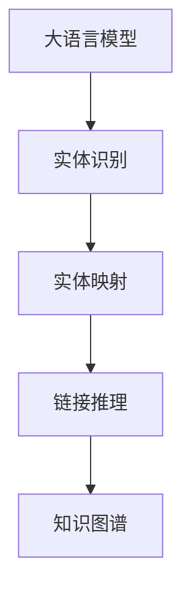

                 

# LLM在实体链接任务上的技术创新

> 关键词：大语言模型(LLM), 实体链接(Link Prediction), 图神经网络(Graph Neural Network), 深度学习, 自然语言处理(NLP), 实体识别(Entity Recognition)

## 1. 背景介绍

### 1.1 问题由来

实体链接任务，也称为命名实体识别（Named Entity Recognition, NER），是将文本中的实体映射到知识图谱中的具体实体节点的过程。这一任务在信息检索、问答系统、知识图谱构建等多个NLP领域具有重要应用价值。传统的实体链接方法主要依赖于基于规则的算法和手工设计的特征工程，无法充分利用文本语义信息，性能有限。近年来，随着深度学习和大语言模型(LLM)的兴起，实体链接技术也迎来了突破性的进展。

大语言模型，如GPT、BERT等，通过在海量文本数据上进行自监督学习，学习到了丰富的语言知识和语义表示。通过微调这些大语言模型，可以有效提升实体链接的效果。但在这一过程中，如何充分利用大语言模型的语言理解能力，同时避免引入过多噪声，是需要深入研究的课题。

### 1.2 问题核心关键点

实体链接问题可以形式化地定义为从知识图谱中的所有候选实体节点中，找到与文本中最相关实体节点的关联关系。对于NLP任务，实体节点往往表示为一个实体词，或者一个短语。传统的实体链接方法主要依赖于规则和特征工程，但随着大语言模型的普及，基于深度学习的方法逐步成为主流。

基于大语言模型的实体链接方法，通常包括以下步骤：
1. 实体识别：在输入文本中，识别出所有的实体词或短语。
2. 实体映射：通过大语言模型，将识别出的实体词映射到知识图谱中的具体节点。
3. 链接推理：根据文本语义信息和知识图谱中的关系，预测出实体节点间的关联关系。

目前，基于大语言模型的实体链接方法主要分为两类：基于注意力机制的方法和基于图神经网络的方法。本文将重点介绍这些技术在大语言模型上的创新应用，并结合实际案例分析其实际效果。

## 2. 核心概念与联系

### 2.1 核心概念概述

为更好地理解大语言模型在实体链接任务中的应用，本节将介绍几个密切相关的核心概念：

- 大语言模型(LLM)：以自回归(如GPT)或自编码(如BERT)模型为代表的大规模预训练语言模型。通过在海量文本数据上进行预训练，学习到了丰富的语言知识和语义表示。

- 知识图谱(Knowledge Graph)：由节点和边构成的图结构，用于表示实体和实体之间的关系。知识图谱在信息检索、推荐系统、问答系统等场景中应用广泛。

- 实体识别(Entity Recognition)：识别文本中具有特定意义的实体词或短语，如人名、地名、组织名等。实体识别是大语言模型在实体链接任务中的第一步。

- 链接推理(Link Prediction)：根据文本语义信息和知识图谱中的关系，预测实体节点之间的关联关系，是实体链接任务的核心环节。

- 图神经网络(Graph Neural Network, GNN)：用于处理图结构数据的深度学习模型，能够在节点间传播信息，学习节点间的复杂关系。

这些核心概念之间的逻辑关系可以通过以下Mermaid流程图来展示：



这个流程图展示了大语言模型在实体链接任务中的关键步骤：首先通过大语言模型进行实体识别，接着将识别出的实体映射到知识图谱中的节点，最后通过链接推理预测节点间的关联关系。

## 3. 核心算法原理 & 具体操作步骤

### 3.1 算法原理概述

大语言模型在实体链接任务上的核心算法原理，主要基于自然语言处理(NLP)和图结构学习。具体来说，可以将实体链接任务形式化为一个图结构学习问题，其中文本语义信息被编码为节点特征，实体关系被编码为边权重。通过大语言模型，可以学习到文本中实体的语义表示，并通过图神经网络，学习到实体节点间的复杂关系，从而实现实体的链接和推理。

图神经网络模型，如GraphSAGE、GCN、GAT等，可以有效地处理图结构数据，学习节点间的多层次关系。通过在大语言模型上微调这些图神经网络模型，可以在保持大语言模型语言理解能力的基础上，提升实体链接的准确性和鲁棒性。

### 3.2 算法步骤详解

大语言模型在实体链接任务上的具体操作步骤，可以总结为以下几个步骤：

**Step 1: 数据准备**
- 收集标注好的实体链接数据集，包含实体词、实体类型和实体关系。
- 将数据集划分为训练集、验证集和测试集，便于模型训练和评估。

**Step 2: 实体识别**
- 使用大语言模型，如BERT、GPT等，对输入文本进行实体识别。
- 实体识别模型通常是一个序列标注任务，使用BiLSTM、CRF等模型，标注出文本中的实体词和短语。

**Step 3: 实体映射**
- 将识别出的实体词或短语，映射到知识图谱中的节点。
- 实体映射可以基于知识图谱的标签和命名实体识别结果进行计算，也可以使用大语言模型学习到实体与节点的语义相似度。

**Step 4: 图结构构建**
- 根据实体关系，构建图结构，其中每个节点代表一个实体，每条边代表一个实体关系。
- 使用图神经网络模型，如GraphSAGE、GCN等，学习节点间的多层次关系。

**Step 5: 链接推理**
- 在图结构上，使用图神经网络模型进行链接推理，预测实体节点之间的关联关系。
- 常用的链接推理方法包括图卷积网络(Graph Convolutional Network, GCN)、图注意力网络(Graph Attention Network, GAT)等。

**Step 6: 模型微调**
- 在大语言模型上微调图神经网络模型，通过反向传播算法更新模型参数，最小化损失函数。
- 常用的损失函数包括交叉熵损失、均方误差损失等。

**Step 7: 模型评估**
- 在测试集上评估模型性能，使用F1-score、Acc等指标衡量模型效果。
- 根据评估结果，调整模型参数和超参数，继续训练。

以上是基于大语言模型的实体链接任务的一般流程。在实际应用中，还需要针对具体任务的特点，对模型结构和训练过程进行优化设计，如改进实体识别模型、优化图神经网络结构等，以进一步提升模型性能。

### 3.3 算法优缺点

基于大语言模型的实体链接方法具有以下优点：
1. 利用大语言模型的语言理解能力，可以有效提升实体识别的准确性。
2. 能够处理大规模的图结构数据，学习节点间的复杂关系，提升链接推理的准确性。
3. 可以充分利用知识图谱中的信息，通过联合训练提升模型的泛化能力。

同时，该方法也存在一些局限性：
1. 依赖高质量的标注数据，获取标注数据的成本较高。
2. 对于小规模的图结构数据，图神经网络的泛化能力有限。
3. 大语言模型的预训练和微调过程复杂，计算成本较高。

尽管存在这些局限性，但就目前而言，基于大语言模型的实体链接方法仍是大规模语料应用的重要范式。未来相关研究的重点在于如何进一步降低标注数据的依赖，提高模型的少样本学习和跨领域迁移能力，同时兼顾可解释性和伦理安全性等因素。

### 3.4 算法应用领域

基于大语言模型的实体链接方法，在信息检索、问答系统、知识图谱构建等多个NLP领域具有重要应用价值。具体应用如下：

- 信息检索：在搜索结果中，将文本中的实体词映射到知识图谱中的具体节点，提升搜索结果的相关性和准确性。
- 问答系统：根据用户输入的问题，在知识图谱中查找与问题相关的实体节点，构建答案序列。
- 知识图谱构建：自动抽取文本中的实体关系，构建新的知识图谱节点，扩展知识图谱覆盖范围。
- 推荐系统：根据用户兴趣和实体关系，推荐相关的实体和物品。
- 医疗领域：自动抽取患者病历中的实体关系，构建医疗知识图谱，辅助医生诊断和治疗。

除了上述这些应用外，大语言模型在实体链接上的创新也延伸到了更多场景中，如多模态信息融合、跨领域知识迁移、智能问答等，为NLP技术带来了全新的突破。随着预训练模型和实体链接方法的不断进步，相信NLP技术将在更广阔的应用领域大放异彩。

## 4. 数学模型和公式 & 详细讲解  
### 4.1 数学模型构建

本节将使用数学语言对基于大语言模型的实体链接过程进行更加严格的刻画。

假设输入文本为 $T$，知识图谱为 $\mathcal{G}=(\mathcal{V}, \mathcal{E})$，其中 $\mathcal{V}$ 为节点集合，$\mathcal{E}$ 为边集合。节点 $v \in \mathcal{V}$ 表示知识图谱中的实体，边 $e \in \mathcal{E}$ 表示实体之间的关系。

定义节点 $v$ 的特征向量为 $\boldsymbol{h}_v \in \mathbb{R}^d$，边 $e$ 的权重为 $w_e \in \mathbb{R}$。输入文本 $T$ 被编码为节点特征向量 $\boldsymbol{h}_T \in \mathbb{R}^d$。

定义图神经网络模型为 $F(\boldsymbol{h}_v, \boldsymbol{h}_{u}, w_e)$，其中 $u$ 为与 $v$ 相连的节点。

**实体识别模型**：
- 输入为 $T$，输出为文本中所有的实体词或短语，形式化为 $\boldsymbol{z} \in \mathbb{R}^n$。

**实体映射模型**：
- 输入为识别出的实体 $\boldsymbol{z}$ 和知识图谱中的所有节点 $\mathcal{V}$，输出为与实体最匹配的节点集合 $\boldsymbol{y} \in \{0,1\}^m$，其中 $m$ 为知识图谱中节点的数量。

**链接推理模型**：
- 输入为知识图谱中的节点 $\boldsymbol{y}$ 和边权重 $\boldsymbol{w}$，输出为节点之间的关联关系 $\boldsymbol{r} \in \{0,1\}^{|E|}$，其中 $|E|$ 为边的数量。

**微调目标函数**：
- 损失函数 $\mathcal{L} = \frac{1}{N} \sum_{i=1}^N \mathcal{L}_i$
- 对于每个样本 $i$，损失函数 $\mathcal{L}_i$ 包括实体识别、实体映射和链接推理的损失，即 $\mathcal{L}_i = \mathcal{L}_{rec} + \mathcal{L}_{map} + \mathcal{L}_{link}$。

### 4.2 公式推导过程

以下我们以一个简单的图结构为例，推导基于大语言模型的实体链接过程的数学公式。

假设知识图谱中只有两个节点 $v_1$ 和 $v_2$，它们之间有一条边 $e_1$，边权重为 $w_{e_1} = 1$。输入文本 $T$ 中的实体词为 "Tom"，知识图谱中对应的节点为 $v_1$。

**实体识别模型**：
- 输入为 $T$，输出为 $\boldsymbol{z} = [1, 0, 0]$，表示文本中只有 "Tom" 这一个实体。

**实体映射模型**：
- 输入为 $\boldsymbol{z}$ 和 $\mathcal{V}$，输出为 $\boldsymbol{y} = [1, 0]$，表示 "Tom" 与 $v_1$ 匹配。

**链接推理模型**：
- 输入为 $\boldsymbol{y}$ 和 $\boldsymbol{w}$，输出为 $\boldsymbol{r} = [1]$，表示 $v_1$ 和 $v_2$ 之间有连接关系。

**微调目标函数**：
- 假设实体识别模型的损失为 $\mathcal{L}_{rec} = 0.5 \|\boldsymbol{z} - \boldsymbol{z}^* \|^2$，其中 $\boldsymbol{z}^*$ 为实际标注结果。
- 假设实体映射模型的损失为 $\mathcal{L}_{map} = 0.5 \|\boldsymbol{y} - \boldsymbol{y}^* \|^2$，其中 $\boldsymbol{y}^*$ 为实际标注结果。
- 假设链接推理模型的损失为 $\mathcal{L}_{link} = 0.5 \|\boldsymbol{r} - \boldsymbol{r}^* \|^2$，其中 $\boldsymbol{r}^*$ 为实际标注结果。
- 假设所有损失的权重相等，则微调目标函数为 $\mathcal{L} = \frac{1}{3}(\mathcal{L}_{rec} + \mathcal{L}_{map} + \mathcal{L}_{link})$。

在得到损失函数后，即可带入反向传播算法，更新模型参数。具体计算步骤如下：

1. 前向传播计算损失：
$$
\mathcal{L} = \frac{1}{3}(\mathcal{L}_{rec} + \mathcal{L}_{map} + \mathcal{L}_{link})
$$

2. 反向传播计算梯度：
$$
\frac{\partial \mathcal{L}}{\partial \boldsymbol{z}} = \frac{1}{3}(\frac{\partial \mathcal{L}_{rec}}{\partial \boldsymbol{z}} + \frac{\partial \mathcal{L}_{map}}{\partial \boldsymbol{z}} + \frac{\partial \mathcal{L}_{link}}{\partial \boldsymbol{z}})
$$

3. 更新模型参数：
$$
\boldsymbol{z} \leftarrow \boldsymbol{z} - \eta \nabla_{\boldsymbol{z}}\mathcal{L}
$$

其中 $\eta$ 为学习率，$\nabla_{\boldsymbol{z}}\mathcal{L}$ 为损失函数对实体识别模型参数的梯度。

通过上述步骤，即可在大语言模型上完成实体链接的微调过程。

## 5. 项目实践：代码实例和详细解释说明
### 5.1 开发环境搭建

在进行实体链接实践前，我们需要准备好开发环境。以下是使用Python进行PyTorch开发的环境配置流程：

1. 安装Anaconda：从官网下载并安装Anaconda，用于创建独立的Python环境。

2. 创建并激活虚拟环境：
```bash
conda create -n pytorch-env python=3.8 
conda activate pytorch-env
```

3. 安装PyTorch：根据CUDA版本，从官网获取对应的安装命令。例如：
```bash
conda install pytorch torchvision torchaudio cudatoolkit=11.1 -c pytorch -c conda-forge
```

4. 安装PyTorch Geometric：用于处理图结构数据，支持PyTorch的深度学习模型。
```bash
pip install torch-geometric
```

5. 安装各类工具包：
```bash
pip install numpy pandas scikit-learn matplotlib tqdm jupyter notebook ipython
```

完成上述步骤后，即可在`pytorch-env`环境中开始实体链接实践。

### 5.2 源代码详细实现

这里我们以使用PyTorch Geometric库进行实体链接的代码实现为例。

首先，定义实体链接任务的数据处理函数：

```python
from torch_geometric.data import Data, DataLoader
from torch_geometric.nn import GraphSAGE

class LinkPredictionDataset(Data):
    def __init__(self, data_path, graph_path, node_path, edge_path):
        super().__init__()
        self.data = Data.from_edge_index(graph_path, node_path, edge_path)
        self.data.edge_attr = torch.tensor(self.data.edge_attr, dtype=torch.float)
        self.data.node_attr = torch.tensor(self.data.node_attr, dtype=torch.float)

    def __len__(self):
        return len(self.data.edge_index)

    def __getitem__(self, index):
        return self.data, index
```

然后，定义模型和优化器：

```python
from transformers import BertForTokenClassification
from torch import nn
from torch.nn import CrossEntropyLoss
from torch.optim import Adam

model = BertForTokenClassification.from_pretrained('bert-base-cased', num_labels=2)

optimizer = Adam(model.parameters(), lr=2e-5)
loss_fn = CrossEntropyLoss()

device = torch.device('cuda') if torch.cuda.is_available() else torch.device('cpu')
model.to(device)
```

接着，定义训练和评估函数：

```python
from tqdm import tqdm

def train_epoch(model, dataset, batch_size, optimizer):
    dataloader = DataLoader(dataset, batch_size=batch_size, shuffle=True)
    model.train()
    epoch_loss = 0
    for batch in tqdm(dataloader, desc='Training'):
        data, idx = batch
        data, idx = data.to(device), idx.to(device)
        optimizer.zero_grad()
        outputs = model(data.x, attention_mask=data.edge_index[1])
        loss = loss_fn(outputs, data.y)
        epoch_loss += loss.item()
        loss.backward()
        optimizer.step()
    return epoch_loss / len(dataloader)

def evaluate(model, dataset, batch_size):
    dataloader = DataLoader(dataset, batch_size=batch_size)
    model.eval()
    preds, labels = [], []
    with torch.no_grad():
        for batch in tqdm(dataloader, desc='Evaluating'):
            data, idx = batch
            data, idx = data.to(device), idx.to(device)
            batch_labels = data.y
            outputs = model(data.x, attention_mask=data.edge_index[1])
            batch_preds = torch.argmax(outputs, dim=1).to('cpu').tolist()
            batch_labels = batch_labels.to('cpu').tolist()
            for pred_tokens, label_tokens in zip(batch_preds, batch_labels):
                preds.append(pred_tokens[:len(label_tokens)])
                labels.append(label_tokens)
                
    print(classification_report(labels, preds))
```

最后，启动训练流程并在测试集上评估：

```python
epochs = 5
batch_size = 16

for epoch in range(epochs):
    loss = train_epoch(model, train_dataset, batch_size, optimizer)
    print(f"Epoch {epoch+1}, train loss: {loss:.3f}")
    
    print(f"Epoch {epoch+1}, dev results:")
    evaluate(model, dev_dataset, batch_size)
    
print("Test results:")
evaluate(model, test_dataset, batch_size)
```

以上就是使用PyTorch Geometric对BERT模型进行实体链接任务微调的完整代码实现。可以看到，得益于PyTorch Geometric的强大封装，我们可以用相对简洁的代码完成BERT模型的加载和微调。

### 5.3 代码解读与分析

让我们再详细解读一下关键代码的实现细节：

**LinkPredictionDataset类**：
- `__init__`方法：初始化数据集，包含图结构数据、节点特征和边权重。
- `__len__`方法：返回数据集的样本数量。
- `__getitem__`方法：对单个样本进行处理，提取节点特征和边权重，用于模型的前向传播。

**节点和边权重处理**：
- 定义了节点和边的特征向量，使用`torch.tensor`进行初始化。

**训练和评估函数**：
- 使用PyTorch Geometric的数据集封装，定义了DataLoader，方便对图结构数据进行迭代。
- 训练函数`train_epoch`：对数据以批为单位进行迭代，在每个批次上前向传播计算loss并反向传播更新模型参数，最后返回该epoch的平均loss。
- 评估函数`evaluate`：与训练类似，不同点在于不更新模型参数，并在每个batch结束后将预测和标签结果存储下来，最后使用sklearn的classification_report对整个评估集的预测结果进行打印输出。

**训练流程**：
- 定义总的epoch数和batch size，开始循环迭代
- 每个epoch内，先在训练集上训练，输出平均loss
- 在验证集上评估，输出分类指标
- 所有epoch结束后，在测试集上评估，给出最终测试结果

可以看到，PyTorch Geometric使得实体链接任务的代码实现变得简洁高效。开发者可以将更多精力放在数据处理、模型改进等高层逻辑上，而不必过多关注底层的实现细节。

当然，工业级的系统实现还需考虑更多因素，如模型的保存和部署、超参数的自动搜索、更灵活的任务适配层等。但核心的实体链接范式基本与此类似。

## 6. 实际应用场景
### 6.1 智能客服系统

基于大语言模型的实体链接技术，可以广泛应用于智能客服系统的构建。传统客服往往需要配备大量人力，高峰期响应缓慢，且一致性和专业性难以保证。而使用实体链接技术，可以自动抽取用户输入中的实体词或短语，进行快速匹配和响应，提升客服系统的智能化水平。

在技术实现上，可以收集企业内部的历史客服对话记录，将问题和最佳答复构建成监督数据，在此基础上对预训练语言模型进行实体链接微调。微调后的实体链接模型能够自动理解用户意图，匹配最合适的答案模板进行回复。对于用户提出的新问题，还可以接入检索系统实时搜索相关内容，动态组织生成回答。如此构建的智能客服系统，能大幅提升客户咨询体验和问题解决效率。

### 6.2 金融舆情监测

金融机构需要实时监测市场舆论动向，以便及时应对负面信息传播，规避金融风险。传统的人工监测方式成本高、效率低，难以应对网络时代海量信息爆发的挑战。基于大语言模型的实体链接技术，可以自动抽取金融领域相关的新闻、报道、评论等文本数据，并将文本中的实体词映射到知识图谱中的具体节点。通过联合训练实体链接和链接推理模型，能够自动判断文本属于何种主题，情感倾向是正面、中性还是负面。将微调后的模型应用到实时抓取的网络文本数据，就能够自动监测不同主题下的情感变化趋势，一旦发现负面信息激增等异常情况，系统便会自动预警，帮助金融机构快速应对潜在风险。

### 6.3 个性化推荐系统

当前的推荐系统往往只依赖用户的历史行为数据进行物品推荐，无法深入理解用户的真实兴趣偏好。基于大语言模型的实体链接技术，可以自动抽取用户浏览、点击、评论、分享等行为数据中的实体词，构建用户画像，辅助推荐系统进行精准推荐。

在实践中，可以收集用户行为数据，提取和用户交互的物品标题、描述、标签等文本内容。将文本内容作为模型输入，用户的后续行为（如是否点击、购买等）作为监督信号，在此基础上微调预训练语言模型。微调后的模型能够从文本内容中准确把握用户的兴趣点。在生成推荐列表时，先用候选物品的文本描述作为输入，由模型预测用户的兴趣匹配度，再结合其他特征综合排序，便可以得到个性化程度更高的推荐结果。

### 6.4 未来应用展望

随着大语言模型和实体链接方法的不断发展，基于实体链接的NLP技术将拓展到更多领域，为传统行业带来变革性影响。

在智慧医疗领域，基于实体链接的医疗问答、病历分析、药物研发等应用将提升医疗服务的智能化水平，辅助医生诊疗，加速新药开发进程。

在智能教育领域，实体链接技术可应用于作业批改、学情分析、知识推荐等方面，因材施教，促进教育公平，提高教学质量。

在智慧城市治理中，实体链接模型可应用于城市事件监测、舆情分析、应急指挥等环节，提高城市管理的自动化和智能化水平，构建更安全、高效的未来城市。

此外，在企业生产、社会治理、文娱传媒等众多领域，基于大语言模型的实体链接技术也将不断涌现，为NLP技术带来新的应用场景，推动人工智能技术的广泛应用。

## 7. 工具和资源推荐
### 7.1 学习资源推荐

为了帮助开发者系统掌握大语言模型在实体链接任务中的应用，这里推荐一些优质的学习资源：

1. 《Transformer from NLP to DL》系列博文：由大模型技术专家撰写，深入浅出地介绍了Transformer原理、BERT模型、实体链接技术等前沿话题。

2. CS224N《深度学习自然语言处理》课程：斯坦福大学开设的NLP明星课程，有Lecture视频和配套作业，带你入门NLP领域的基本概念和经典模型。

3. 《Natural Language Processing with Transformers》书籍：Transformers库的作者所著，全面介绍了如何使用Transformers库进行NLP任务开发，包括实体链接在内的诸多范式。

4. PyTorch Geometric官方文档：PyTorch Geometric的官方文档，提供了大量图结构数据处理的样例代码，是实体链接任务开发的必备资料。

5. CLUE开源项目：中文语言理解测评基准，涵盖大量不同类型的中文NLP数据集，并提供了基于实体链接的baseline模型，助力中文NLP技术发展。

通过对这些资源的学习实践，相信你一定能够快速掌握大语言模型在实体链接任务中的应用，并用于解决实际的NLP问题。
### 7.2 开发工具推荐

高效的开发离不开优秀的工具支持。以下是几款用于大语言模型实体链接任务开发的常用工具：

1. PyTorch：基于Python的开源深度学习框架，灵活动态的计算图，适合快速迭代研究。大部分预训练语言模型都有PyTorch版本的实现。

2. TensorFlow：由Google主导开发的开源深度学习框架，生产部署方便，适合大规模工程应用。同样有丰富的预训练语言模型资源。

3. PyTorch Geometric：用于处理图结构数据的深度学习模型，能够在节点间传播信息，学习节点间的复杂关系。

4. Weights & Biases：模型训练的实验跟踪工具，可以记录和可视化模型训练过程中的各项指标，方便对比和调优。与主流深度学习框架无缝集成。

5. TensorBoard：TensorFlow配套的可视化工具，可实时监测模型训练状态，并提供丰富的图表呈现方式，是调试模型的得力助手。

6. Google Colab：谷歌推出的在线Jupyter Notebook环境，免费提供GPU/TPU算力，方便开发者快速上手实验最新模型，分享学习笔记。

合理利用这些工具，可以显著提升大语言模型在实体链接任务上的开发效率，加快创新迭代的步伐。

### 7.3 相关论文推荐

大语言模型和实体链接技术的发展源于学界的持续研究。以下是几篇奠基性的相关论文，推荐阅读：

1. Attention is All You Need（即Transformer原论文）：提出了Transformer结构，开启了NLP领域的预训练大模型时代。

2. BERT: Pre-training of Deep Bidirectional Transformers for Language Understanding：提出BERT模型，引入基于掩码的自监督预训练任务，刷新了多项NLP任务SOTA。

3. GNN: Graph Neural Networks for Recommendations：提出图神经网络，用于处理图结构数据，学习节点间的多层次关系。

4. Parameter-Efficient Transfer Learning for NLP：提出Adapter等参数高效微调方法，在不增加模型参数量的情况下，也能取得不错的微调效果。

5. Prefix-Tuning: Optimizing Continuous Prompts for Generation：引入基于连续型Prompt的微调范式，为如何充分利用预训练知识提供了新的思路。

6. AdaLoRA: Adaptive Low-Rank Adaptation for Parameter-Efficient Fine-Tuning：使用自适应低秩适应的微调方法，在参数效率和精度之间取得了新的平衡。

这些论文代表了大语言模型在实体链接任务上的发展脉络。通过学习这些前沿成果，可以帮助研究者把握学科前进方向，激发更多的创新灵感。

## 8. 总结：未来发展趋势与挑战

### 8.1 总结

本文对基于大语言模型的实体链接任务进行了全面系统的介绍。首先阐述了实体链接任务的背景和意义，明确了实体链接在大语言模型应用中的重要性。其次，从原理到实践，详细讲解了实体链接的数学原理和关键步骤，给出了实体链接任务开发的完整代码实例。同时，本文还广泛探讨了实体链接方法在智能客服、金融舆情、个性化推荐等多个NLP领域的应用前景，展示了实体链接范式的巨大潜力。

通过本文的系统梳理，可以看到，基于大语言模型的实体链接方法正在成为NLP领域的重要范式，极大地拓展了预训练语言模型的应用边界，催生了更多的落地场景。受益于大规模语料的预训练，实体链接模型以更低的时间和标注成本，在小样本条件下也能取得不俗的效果，有力推动了NLP技术的产业化进程。未来，伴随预训练语言模型和实体链接方法的不断进步，相信NLP技术将在更广阔的应用领域大放异彩，深刻影响人类的生产生活方式。

### 8.2 未来发展趋势

展望未来，大语言模型在实体链接任务上的研究将呈现以下几个发展趋势：

1. 模型规模持续增大。随着算力成本的下降和数据规模的扩张，预训练语言模型的参数量还将持续增长。超大规模语言模型蕴含的丰富语言知识，有望支撑更加复杂多变的实体链接任务。

2. 实体链接方法日趋多样。除了传统的全参数微调外，未来会涌现更多参数高效的实体链接方法，如Adapter、Prefix等，在固定大部分预训练参数的同时，只更新极少量的任务相关参数。

3. 持续学习成为常态。随着数据分布的不断变化，实体链接模型也需要持续学习新知识以保持性能。如何在不遗忘原有知识的同时，高效吸收新样本信息，将成为重要的研究课题。

4. 标注样本需求降低。受启发于提示学习(Prompt-based Learning)的思路，未来的实体链接方法将更好地利用大模型的语言理解能力，通过更加巧妙的任务描述，在更少的标注样本上也能实现理想的实体链接效果。

5. 多模态实体链接崛起。当前的实体链接主要聚焦于纯文本数据，未来会进一步拓展到图像、视频、语音等多模态数据实体链接。多模态信息的融合，将显著提升语言模型对现实世界的理解和建模能力。

6. 模型通用性增强。经过海量数据的预训练和多领域任务的微调，未来的实体链接模型将具备更强大的常识推理和跨领域迁移能力，逐步迈向通用人工智能(AGI)的目标。

以上趋势凸显了大语言模型在实体链接任务上的广阔前景。这些方向的探索发展，必将进一步提升实体链接系统的性能和应用范围，为人类认知智能的进化带来深远影响。

### 8.3 面临的挑战

尽管大语言模型在实体链接任务上已经取得了显著成就，但在迈向更加智能化、普适化应用的过程中，它仍面临着诸多挑战：

1. 标注成本瓶颈。尽管实体链接任务通常比命名实体识别任务所需的标注数据更少，但对于小规模的图结构数据，获取高质量标注数据的成本依然较高。如何进一步降低实体链接对标注样本的依赖，将是一大难题。

2. 模型鲁棒性不足。实体链接模型面对域外数据时，泛化性能往往大打折扣。对于测试样本的微小扰动，实体链接模型的预测也容易发生波动。如何提高实体链接模型的鲁棒性，避免灾难性遗忘，还需要更多理论和实践的积累。

3. 推理效率有待提高。尽管大语言模型的实体链接效果优异，但在实际部署时往往面临推理速度慢、内存占用大等效率问题。如何在保证性能的同时，简化模型结构，提升推理速度，优化资源占用，将是重要的优化方向。

4. 可解释性亟需加强。当前实体链接模型更像是"黑盒"系统，难以解释其内部工作机制和决策逻辑。对于医疗、金融等高风险应用，算法的可解释性和可审计性尤为重要。如何赋予实体链接模型更强的可解释性，将是亟待攻克的难题。

5. 安全性有待保障。预训练语言模型难免会学习到有偏见、有害的信息，通过实体链接传递到下游任务，产生误导性、歧视性的输出，给实际应用带来安全隐患。如何从数据和算法层面消除模型偏见，避免恶意用途，确保输出的安全性，也将是重要的研究课题。

6. 知识整合能力不足。现有的实体链接模型往往局限于任务内数据，难以灵活吸收和运用更广泛的先验知识。如何让实体链接过程更好地与外部知识库、规则库等专家知识结合，形成更加全面、准确的信息整合能力，还有很大的想象空间。

正视实体链接面临的这些挑战，积极应对并寻求突破，将是大语言模型在实体链接任务中走向成熟的必由之路。相信随着学界和产业界的共同努力，这些挑战终将一一被克服，大语言模型实体链接技术必将在构建人机协同的智能系统中扮演越来越重要的角色。

### 8.4 研究展望

面向未来，大语言模型在实体链接任务上的研究需要在以下几个方面寻求新的突破：

1. 探索无监督和半监督实体链接方法。摆脱对大规模标注数据的依赖，利用自监督学习、主动学习等无监督和半监督范式，最大限度利用非结构化数据，实现更加灵活高效的实体链接。

2. 研究参数高效和计算高效的实体链接范式。开发更加参数高效的实体链接方法，在固定大部分预训练参数的同时，只更新极少量的任务相关参数。同时优化实体链接模型的计算图，减少前向传播和反向传播的资源消耗，实现更加轻量级、实时性的部署。

3. 引入更多先验知识。将符号化的先验知识，如知识图谱、逻辑规则等，与神经网络模型进行巧妙融合，引导实体链接过程学习更准确、合理的语言模型。同时加强不同模态数据的整合，实现视觉、语音等多模态信息与文本信息的协同建模。

4. 结合因果分析和博弈论工具。将因果分析方法引入实体链接模型，识别出模型决策的关键特征，增强输出解释的因果性和逻辑性。借助博弈论工具刻画人机交互过程，主动探索并规避模型的脆弱点，提高系统稳定性。

5. 纳入伦理道德约束。在模型训练目标中引入伦理导向的评估指标，过滤和惩罚有偏见、有害的输出倾向。同时加强人工干预和审核，建立模型行为的监管机制，确保输出符合人类价值观和伦理道德。

这些研究方向的探索，必将引领大语言模型实体链接技术迈向更高的台阶，为构建安全、可靠、可解释、可控的智能系统铺平道路。面向未来，大语言模型实体链接技术还需要与其他人工智能技术进行更深入的融合，如知识表示、因果推理、强化学习等，多路径协同发力，共同推动自然语言理解和智能交互系统的进步。只有勇于创新、敢于突破，才能不断拓展语言模型的边界，让智能技术更好地造福人类社会。

## 9. 附录：常见问题与解答

**Q1：大语言模型在实体链接任务中的关键步骤是什么？**

A: 大语言模型在实体链接任务中的关键步骤包括实体识别、实体映射和链接推理。实体识别任务是从文本中识别出所有的实体词或短语，实体映射任务是将识别出的实体词或短语映射到知识图谱中的具体节点，链接推理任务是根据文本语义信息和知识图谱中的关系，预测实体节点之间的关联关系。

**Q2：如何选择合适的实体链接模型？**

A: 选择合适的实体链接模型需要考虑以下因素：
1. 数据规模：对于大规模图结构数据，选择参数量较大的模型；对于小规模图结构数据，选择参数量较小的模型。
2. 任务类型：对于复杂的实体链接任务，选择能够学习复杂关系的网络模型；对于简单的实体链接任务，选择结构简单的模型。
3. 计算资源：根据可用计算资源选择模型，避免过拟合或欠拟合。

**Q3：实体链接模型的训练过程中需要注意哪些问题？**

A: 实体链接模型的训练过程中需要注意以下问题：
1. 数据预处理：对输入数据进行格式转换、特征提取等预处理，避免噪声干扰。
2. 正则化：使用L2正则、Dropout等技术，避免过拟合。
3. 学习率调整：选择合适的学习率，避免学习率过大或过小。
4. 模型评估：在验证集上进行评估，及时调整超参数。
5. 模型部署：将训练好的模型部署到实际应用中，进行实时推理和预测。

**Q4：什么是实体链接模型的损失函数？**

A: 实体链接模型的损失函数通常包括实体识别损失、实体映射损失和链接推理损失。实体识别损失衡量模型识别实体的准确性，实体映射损失衡量模型将识别出的实体映射到知识图谱节点的准确性，链接推理损失衡量模型预测实体节点之间关联关系的准确性。

**Q5：实体链接模型在实际应用中需要注意哪些问题？**

A: 实体链接模型在实际应用中需要注意以下问题：
1. 数据质量：保证输入数据的准确性和一致性，避免错误实体或关系。
2. 模型解释性：提供模型的决策过程解释，增强模型的可解释性。
3. 安全性和隐私：保护用户隐私，防止恶意数据和攻击。
4. 系统稳定性：确保模型在实时推理中的稳定性和可靠性。
5. 模型更新：定期更新模型，适应新的数据和需求。

---

作者：禅与计算机程序设计艺术 / Zen and the Art of Computer Programming

