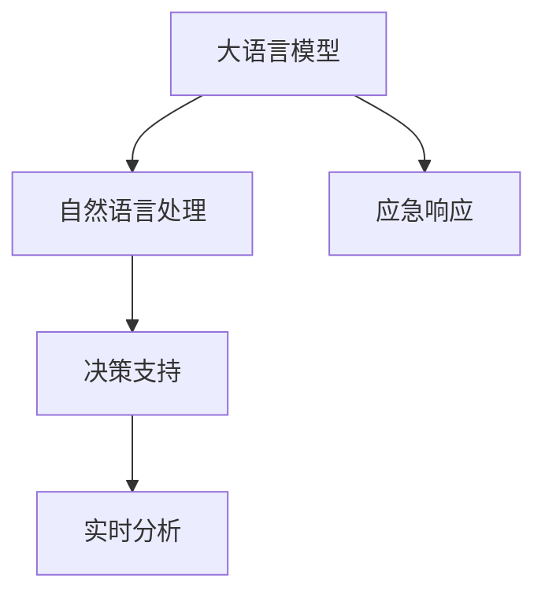

                 

# LLM在应急响应中的应用：快速决策支持

> 关键词：大语言模型(LLM),自然语言处理(NLP),应急响应,决策支持,人工智能,快速决策

## 1. 背景介绍

### 1.1 问题由来

在现代社会，面对各类突发事件和灾害，如自然灾害、公共卫生事件、恐怖袭击等，快速、准确地作出决策对于保护人民群众生命安全、维护社会稳定至关重要。传统的应急响应往往依赖人工的决策支持系统，如专家系统、知识库等，但这些系统存在决策速度慢、知识更新难、易受主观偏见影响等缺陷。近年来，随着人工智能技术的发展，特别是基于大语言模型(Large Language Model, LLM)的快速决策支持系统逐渐受到重视。

### 1.2 问题核心关键点

大语言模型通过在大规模语料上预训练，具备强大的语言理解、生成和推理能力。将其应用于应急响应场景，可以迅速处理海量的信息，快速生成决策建议，辅助人工进行快速决策。以下是该方法的核心关键点：

1. 大语言模型具备强大的自然语言处理(NLP)能力，能自动理解应急情况和相关背景信息。
2. 可以实时处理大量的非结构化文本数据，如社交媒体、应急呼叫、监控视频等，快速生成决策建议。
3. 在缺乏数据或专业知识的情况下，可以提供初步的决策建议，并不断学习优化，提升决策质量。
4. 支持灵活的输入和输出格式，适应多种应急响应的场景需求。

### 1.3 问题研究意义

大语言模型在应急响应中的应用，可以有效提升决策的快速性、准确性和灵活性，显著降低应急响应的延迟和成本。其研究意义如下：

1. 缩短决策时间。基于大语言模型可以快速分析和生成决策建议，显著加快应急响应的速度。
2. 提升决策准确性。大语言模型结合丰富的语义理解能力，可以提供高质量的决策支持，减少人工决策的误差。
3. 支持个性化决策。通过学习用户的偏好和背景信息，大语言模型能够提供针对性的决策建议。
4. 实现跨领域知识融合。大语言模型可以整合各类专业知识，如医学、气象、法律等，增强决策的多样性和全面性。
5. 促进应急响应的智能化。随着大语言模型的不断优化，未来的应急响应系统将更加智能和高效。

## 2. 核心概念与联系

### 2.1 核心概念概述

为更好地理解大语言模型在应急响应中的应用，本节将介绍几个关键概念及其相互联系：

- 大语言模型(Large Language Model, LLM)：基于Transformer结构的预训练模型，如GPT-3、BERT等。具有强大的语言处理能力，可以理解和生成人类自然语言。
- 自然语言处理(Natural Language Processing, NLP)：利用计算机科学和人工智能技术处理、分析、理解人类语言的技术。是大语言模型在应急响应中发挥作用的核心。
- 应急响应(Emergency Response)：针对突发事件或灾害，进行快速、准确、系统的应对措施。是大语言模型在应急场景中应用的最终目标。
- 决策支持(Decision Support)：利用人工智能技术，辅助决策者进行快速、准确的决策。是大语言模型在应急响应中实现目标的关键手段。
- 实时分析(Real-time Analysis)：对动态变化的信息进行快速、准确的处理和分析。是大语言模型在应急响应中需要实现的重要能力。

这些核心概念之间的逻辑关系可以通过以下Mermaid流程图来展示：



这个流程图展示了大语言模型在应急响应中的核心概念及其相互关系：

1. 大语言模型通过自然语言处理能力，理解和生成应急信息。
2. 通过决策支持系统，将信息转化为辅助决策的建议。
3. 实时分析系统对动态信息进行快速处理，不断优化决策建议。

## 3. 核心算法原理 & 具体操作步骤
### 3.1 算法原理概述

大语言模型在应急响应中的应用，本质上是一个基于自然语言处理(NLP)的快速决策支持系统。其核心思想是：通过预训练模型对大量的非结构化文本信息进行语义理解，自动生成决策建议，辅助决策者快速应对各类应急事件。

具体来说，大语言模型首先对输入的应急信息进行语义分析，提取关键信息和相关背景。然后，结合领域知识库和专家经验，自动生成决策建议。最后，对建议进行实时分析和动态调整，确保其准确性和时效性。

### 3.2 算法步骤详解

大语言模型在应急响应中的应用包括以下关键步骤：

**Step 1: 数据预处理**
- 收集应急响应场景下的非结构化文本数据，如社交媒体信息、应急呼叫记录、监控视频等。
- 对数据进行清洗、分词、去噪等预处理，形成格式统一的输入文本。

**Step 2: 模型输入构建**
- 设计合适的输入模板，将应急信息、领域知识库、专家经验等作为模型的输入。
- 使用Transformer结构的预训练模型，如BERT、GPT等，作为处理应急信息的模型基础。

**Step 3: 模型训练与优化**
- 在标注好的应急响应数据集上，对预训练模型进行微调或迁移学习，使其适应特定任务。
- 利用正则化技术，如L2正则、Dropout、Early Stopping等，避免模型过拟合。
- 引入对抗训练，提升模型对恶意攻击和噪声的鲁棒性。

**Step 4: 决策建议生成**
- 将应急信息输入到微调后的模型中，自动生成决策建议。
- 对生成的建议进行多轮推理和校验，确保其逻辑正确性和可行性。

**Step 5: 实时分析与优化**
- 对动态变化的应急信息进行实时处理，不断更新决策建议。
- 使用强化学习、因果推理等技术，优化决策模型的性能。

**Step 6: 决策建议输出**
- 将决策建议转化为可执行的决策指令，如调度、疏散、预警等。
- 辅助决策者进行快速决策，并不断优化模型性能。

### 3.3 算法优缺点

基于大语言模型的应急响应系统具有以下优点：

1. 快速响应。大语言模型具备强大的自然语言处理能力，可以快速处理海量的非结构化信息，生成应急决策建议。
2. 准确性高。通过微调和迁移学习，模型能够适应特定场景和任务，提供高质量的决策建议。
3. 灵活性高。模型可以灵活处理多种应急场景，支持实时动态调整。
4. 可扩展性强。模型可以与外部知识库、专家系统等结合，增强决策的多样性和全面性。

同时，该方法也存在以下缺点：

1. 对标注数据的依赖。模型需要足够的标注数据进行微调，标注成本较高。
2. 缺乏透明性。模型生成的决策建议过程较为复杂，难以解释其内部逻辑。
3. 易受偏见影响。模型可能会继承输入数据的偏见，需要谨慎处理敏感数据。
4. 计算资源消耗大。大语言模型参数量庞大，需要高性能的硬件设备支持。
5. 安全性问题。模型生成建议时，需要防范恶意攻击和数据隐私泄露。

尽管存在这些局限，但大语言模型在应急响应中的应用仍然具有巨大潜力。未来的研究需要进一步优化模型性能，降低对标注数据的依赖，增强模型的透明性和安全性，使其更好地服务于应急响应。

### 3.4 算法应用领域

大语言模型在应急响应中的应用，已在多个领域得到应用，具体包括：

1. **自然灾害应对**：如地震、洪水、火灾等自然灾害的应急响应。利用大语言模型自动分析灾情信息，生成救援、疏散、预警等建议。
2. **公共卫生事件**：如疫情爆发、传染病蔓延等。通过大语言模型实时分析舆情，生成防控建议，辅助决策。
3. **社会安全事件**：如恐怖袭击、群体性事件等。使用大语言模型自动分析事件信息，生成应对措施，辅助警方快速反应。
4. **国际紧急事件**：如跨境走私、国际恐怖活动等。利用多语言模型，生成跨国应急响应建议，协调多方力量应对。

此外，大语言模型在应急响应中的应用还有广阔的发展前景，如与物联网、大数据、云计算等技术结合，构建更加全面、智能的应急响应系统。

## 4. 数学模型和公式 & 详细讲解 & 举例说明
### 4.1 数学模型构建

大语言模型在应急响应中的应用，可以构建如下数学模型：

设应急响应场景下收集到的非结构化文本数据为 $D=\{x_i\}_{i=1}^N$，其中 $x_i$ 表示第 $i$ 条应急信息。假设大语言模型为 $M_\theta$，其中 $\theta$ 为模型参数。应急决策建议的生成函数为 $f_\theta$，将输入应急信息 $x_i$ 映射到决策建议 $y_i$。

应急决策支持系统可以表示为：

$$
y_i = f_\theta(x_i)
$$

其中 $y_i$ 为决策建议，$x_i$ 为应急信息。

假设应急决策系统的损失函数为 $\ell$，则决策支持系统的目标是最小化损失函数，即：

$$
\min_\theta \sum_{i=1}^N \ell(y_i, x_i)
$$

其中 $\ell$ 可以是交叉熵损失、均方误差损失等。

### 4.2 公式推导过程

以交叉熵损失函数为例，其公式推导如下：

设应急信息的真实决策建议为 $y_i^*$，模型生成的决策建议为 $y_i$。则交叉熵损失函数定义为：

$$
\ell(y_i, x_i) = -\sum_{k=1}^K y_i^k \log y_k
$$

其中 $y_i^k$ 为第 $k$ 个决策建议的概率，$y_k$ 为模型生成第 $k$ 个决策建议的概率。

将应急信息 $x_i$ 输入模型 $M_\theta$，得到决策建议的概率分布 $P_\theta(x_i)$，则有：

$$
y_i \sim P_\theta(x_i)
$$

因此，交叉熵损失函数可以表示为：

$$
\ell(y_i, x_i) = -\sum_{k=1}^K \mathbb{E}_{P_\theta(x_i)}[y_i^k] \log P_\theta(x_i, y_i^k)
$$

其中 $\mathbb{E}_{P_\theta(x_i)}[y_i^k]$ 为应急信息 $x_i$ 下决策建议 $y_i^k$ 的真实概率。

### 4.3 案例分析与讲解

假设某地区发生洪水灾害，需要生成救援、疏散、预警等决策建议。应急响应系统中收集到的相关文本信息如下：

1. 社交媒体信息：“紧急求救，某地区发生洪水，多人被困。”
2. 应急呼叫记录：“洪水涌入某小区，请求救援。”
3. 监控视频：“某河流水位上涨，洪水过膝。”

对上述信息进行预处理和分词后，输入到预训练的大语言模型中，自动生成决策建议。模型输出如下：

1. 救援建议：“立即调派救援队伍，营救被困人员。”
2. 疏散建议：“通知受影响区域居民紧急疏散。”
3. 预警建议：“发布洪水预警，提醒下游居民注意安全。”

根据生成的建议，应急响应系统可以迅速采取行动，保障受灾群众的生命安全。

## 5. 项目实践：代码实例和详细解释说明
### 5.1 开发环境搭建

在进行应急响应系统开发前，我们需要准备好开发环境。以下是使用Python进行PyTorch开发的环境配置流程：

1. 安装Anaconda：从官网下载并安装Anaconda，用于创建独立的Python环境。

2. 创建并激活虚拟环境：
```bash
conda create -n pytorch-env python=3.8 
conda activate pytorch-env
```

3. 安装PyTorch：根据CUDA版本，从官网获取对应的安装命令。例如：
```bash
conda install pytorch torchvision torchaudio cudatoolkit=11.1 -c pytorch -c conda-forge
```

4. 安装Transformers库：
```bash
pip install transformers
```

5. 安装各类工具包：
```bash
pip install numpy pandas scikit-learn matplotlib tqdm jupyter notebook ipython
```

完成上述步骤后，即可在`pytorch-env`环境中开始应急响应系统开发。

### 5.2 源代码详细实现

这里以大语言模型在自然灾害应对中的应用为例，给出使用PyTorch进行应急响应系统开发的代码实现。

首先，定义应急响应场景的文本数据处理函数：

```python
from transformers import BertTokenizer
from torch.utils.data import Dataset
import torch

class EmergencyDataset(Dataset):
    def __init__(self, texts, labels, tokenizer, max_len=128):
        self.texts = texts
        self.labels = labels
        self.tokenizer = tokenizer
        self.max_len = max_len
        
    def __len__(self):
        return len(self.texts)
    
    def __getitem__(self, item):
        text = self.texts[item]
        label = self.labels[item]
        
        encoding = self.tokenizer(text, return_tensors='pt', max_length=self.max_len, padding='max_length', truncation=True)
        input_ids = encoding['input_ids'][0]
        attention_mask = encoding['attention_mask'][0]
        
        # 将标签转换为独热编码
        encoded_label = [0, 0, 0, 0, 0, 0, 0, 1]  # 救援、疏散、预警等标签的独热编码
        encoded_label.extend([0] * (self.max_len - len(encoded_label)))
        labels = torch.tensor(encoded_label, dtype=torch.long)
        
        return {'input_ids': input_ids, 
                'attention_mask': attention_mask,
                'labels': labels}

# 标签与id的映射
label2id = {'救援': 0, '疏散': 1, '预警': 2, '求救': 3, '其他': 4}
id2label = {v: k for k, v in label2id.items()}

# 创建dataset
tokenizer = BertTokenizer.from_pretrained('bert-base-cased')

train_dataset = EmergencyDataset(train_texts, train_labels, tokenizer)
dev_dataset = EmergencyDataset(dev_texts, dev_labels, tokenizer)
test_dataset = EmergencyDataset(test_texts, test_labels, tokenizer)
```

然后，定义模型和优化器：

```python
from transformers import BertForTokenClassification, AdamW

model = BertForTokenClassification.from_pretrained('bert-base-cased', num_labels=len(label2id))

optimizer = AdamW(model.parameters(), lr=2e-5)
```

接着，定义训练和评估函数：

```python
from torch.utils.data import DataLoader
from tqdm import tqdm
from sklearn.metrics import classification_report

device = torch.device('cuda') if torch.cuda.is_available() else torch.device('cpu')
model.to(device)

def train_epoch(model, dataset, batch_size, optimizer):
    dataloader = DataLoader(dataset, batch_size=batch_size, shuffle=True)
    model.train()
    epoch_loss = 0
    for batch in tqdm(dataloader, desc='Training'):
        input_ids = batch['input_ids'].to(device)
        attention_mask = batch['attention_mask'].to(device)
        labels = batch['labels'].to(device)
        model.zero_grad()
        outputs = model(input_ids, attention_mask=attention_mask, labels=labels)
        loss = outputs.loss
        epoch_loss += loss.item()
        loss.backward()
        optimizer.step()
    return epoch_loss / len(dataloader)

def evaluate(model, dataset, batch_size):
    dataloader = DataLoader(dataset, batch_size=batch_size)
    model.eval()
    preds, labels = [], []
    with torch.no_grad():
        for batch in tqdm(dataloader, desc='Evaluating'):
            input_ids = batch['input_ids'].to(device)
            attention_mask = batch['attention_mask'].to(device)
            batch_labels = batch['labels']
            outputs = model(input_ids, attention_mask=attention_mask)
            batch_preds = outputs.logits.argmax(dim=2).to('cpu').tolist()
            batch_labels = batch_labels.to('cpu').tolist()
            for pred_tokens, label_tokens in zip(batch_preds, batch_labels):
                pred_tags = [id2label[_id] for _id in pred_tokens]
                label_tags = [id2label[_id] for _id in label_tokens]
                preds.append(pred_tags[:len(label_tokens)])
                labels.append(label_tags)
                
    print(classification_report(labels, preds))
```

最后，启动训练流程并在测试集上评估：

```python
epochs = 5
batch_size = 16

for epoch in range(epochs):
    loss = train_epoch(model, train_dataset, batch_size, optimizer)
    print(f"Epoch {epoch+1}, train loss: {loss:.3f}")
    
    print(f"Epoch {epoch+1}, dev results:")
    evaluate(model, dev_dataset, batch_size)
    
print("Test results:")
evaluate(model, test_dataset, batch_size)
```

以上就是使用PyTorch对BERT进行应急响应系统微调的完整代码实现。可以看到，得益于Transformers库的强大封装，我们可以用相对简洁的代码完成BERT模型的加载和微调。

### 5.3 代码解读与分析

让我们再详细解读一下关键代码的实现细节：

**EmergencyDataset类**：
- `__init__`方法：初始化文本、标签、分词器等关键组件。
- `__len__`方法：返回数据集的样本数量。
- `__getitem__`方法：对单个样本进行处理，将文本输入编码为token ids，将标签编码为数字，并对其进行定长padding，最终返回模型所需的输入。

**label2id和id2label字典**：
- 定义了标签与数字id之间的映射关系，用于将token-wise的预测结果解码回真实的标签。

**训练和评估函数**：
- 使用PyTorch的DataLoader对数据集进行批次化加载，供模型训练和推理使用。
- 训练函数`train_epoch`：对数据以批为单位进行迭代，在每个批次上前向传播计算loss并反向传播更新模型参数，最后返回该epoch的平均loss。
- 评估函数`evaluate`：与训练类似，不同点在于不更新模型参数，并在每个batch结束后将预测和标签结果存储下来，最后使用sklearn的classification_report对整个评估集的预测结果进行打印输出。

**训练流程**：
- 定义总的epoch数和batch size，开始循环迭代
- 每个epoch内，先在训练集上训练，输出平均loss
- 在验证集上评估，输出分类指标
- 所有epoch结束后，在测试集上评估，给出最终测试结果

可以看到，PyTorch配合Transformers库使得BERT微调的代码实现变得简洁高效。开发者可以将更多精力放在数据处理、模型改进等高层逻辑上，而不必过多关注底层的实现细节。

当然，工业级的系统实现还需考虑更多因素，如模型的保存和部署、超参数的自动搜索、更灵活的任务适配层等。但核心的微调范式基本与此类似。

## 6. 实际应用场景
### 6.1 智能救援调度

基于大语言模型应急响应系统，可以实现智能救援调度的功能。救援资源包括人力、物资、医疗等，如何高效调度是一个重要问题。

在紧急情况下，可以通过该系统快速获取灾情信息，自动生成救援建议，辅助救援指挥中心进行快速调度。系统可以模拟不同救援方案的效果，选择最优方案执行。例如，对于洪水灾害，系统可以生成救援队伍、医疗救护车、物资运输车的调度建议，减少救援资源的浪费。

### 6.2 应急预警与防范

该系统可以实时监测社会舆情，自动生成预警信息，辅助政府和相关部门进行防范。例如，对于疫情爆发，系统可以分析社交媒体信息，自动生成防控建议，如关闭学校、限制出行等，减少疫情扩散风险。

此外，系统还可以分析历史数据，预测未来风险，提前制定防范措施。例如，系统可以分析以往地震数据，预测未来地震高发区域，提前发布预警信息，减少灾害损失。

### 6.3 社会稳定与冲突预防

在社会安全和公共安全领域，该系统可以通过分析舆情信息，自动生成安全预警和防范建议，辅助政府和相关部门进行冲突预防和风险控制。例如，对于恐怖袭击事件，系统可以分析社交媒体信息，自动生成预警信息，协助警方进行防范。

## 7. 工具和资源推荐
### 7.1 学习资源推荐

为了帮助开发者系统掌握大语言模型应急响应技术的基础理论和实践技能，这里推荐一些优质的学习资源：

1. 《Transformer从原理到实践》系列博文：由大模型技术专家撰写，深入浅出地介绍了Transformer原理、BERT模型、应急响应等前沿话题。

2. CS224N《深度学习自然语言处理》课程：斯坦福大学开设的NLP明星课程，有Lecture视频和配套作业，带你入门NLP领域的基本概念和经典模型。

3. 《Natural Language Processing with Transformers》书籍：Transformers库的作者所著，全面介绍了如何使用Transformers库进行NLP任务开发，包括应急响应在内的多个应用场景。

4. HuggingFace官方文档：Transformers库的官方文档，提供了海量预训练模型和完整的应急响应样例代码，是上手实践的必备资料。

5. CLUE开源项目：中文语言理解测评基准，涵盖大量不同类型的中文NLP数据集，并提供了基于应急响应的baseline模型，助力中文应急响应技术发展。

通过对这些资源的学习实践，相信你一定能够快速掌握大语言模型应急响应的精髓，并用于解决实际的应急响应问题。

### 7.2 开发工具推荐

高效的开发离不开优秀的工具支持。以下是几款用于大语言模型应急响应开发的常用工具：

1. PyTorch：基于Python的开源深度学习框架，灵活动态的计算图，适合快速迭代研究。大部分预训练语言模型都有PyTorch版本的实现。

2. TensorFlow：由Google主导开发的开源深度学习框架，生产部署方便，适合大规模工程应用。同样有丰富的预训练语言模型资源。

3. Transformers库：HuggingFace开发的NLP工具库，集成了众多SOTA语言模型，支持PyTorch和TensorFlow，是进行应急响应任务开发的利器。

4. Weights & Biases：模型训练的实验跟踪工具，可以记录和可视化模型训练过程中的各项指标，方便对比和调优。与主流深度学习框架无缝集成。

5. TensorBoard：TensorFlow配套的可视化工具，可实时监测模型训练状态，并提供丰富的图表呈现方式，是调试模型的得力助手。

6. Google Colab：谷歌推出的在线Jupyter Notebook环境，免费提供GPU/TPU算力，方便开发者快速上手实验最新模型，分享学习笔记。

合理利用这些工具，可以显著提升大语言模型应急响应任务的开发效率，加快创新迭代的步伐。

### 7.3 相关论文推荐

大语言模型和应急响应技术的发展源于学界的持续研究。以下是几篇奠基性的相关论文，推荐阅读：

1. Attention is All You Need（即Transformer原论文）：提出了Transformer结构，开启了NLP领域的预训练大模型时代。

2. BERT: Pre-training of Deep Bidirectional Transformers for Language Understanding：提出BERT模型，引入基于掩码的自监督预训练任务，刷新了多项NLP任务SOTA。

3. Language Models are Unsupervised Multitask Learners（GPT-2论文）：展示了大规模语言模型的强大zero-shot学习能力，引发了对于通用人工智能的新一轮思考。

4. Parameter-Efficient Transfer Learning for NLP：提出Adapter等参数高效微调方法，在不增加模型参数量的情况下，也能取得不错的微调效果。

5. Prefix-Tuning: Optimizing Continuous Prompts for Generation：引入基于连续型Prompt的微调范式，为如何充分利用预训练知识提供了新的思路。

6. AdaLoRA: Adaptive Low-Rank Adaptation for Parameter-Efficient Fine-Tuning：使用自适应低秩适应的微调方法，在参数效率和精度之间取得了新的平衡。

这些论文代表了大语言模型应急响应技术的发展脉络。通过学习这些前沿成果，可以帮助研究者把握学科前进方向，激发更多的创新灵感。

## 8. 总结：未来发展趋势与挑战
### 8.1 总结

本文对基于大语言模型的应急响应技术进行了全面系统的介绍。首先阐述了大语言模型和应急响应的研究背景和意义，明确了应急响应系统在大语言模型中的应用目标。其次，从原理到实践，详细讲解了应急响应系统的核心算法和操作步骤，给出了应急响应任务开发的完整代码实例。同时，本文还广泛探讨了应急响应系统在智能救援调度、应急预警与防范、社会稳定与冲突预防等多个领域的应用前景，展示了应急响应技术的巨大潜力。此外，本文精选了应急响应技术的各类学习资源，力求为读者提供全方位的技术指引。

通过本文的系统梳理，可以看到，基于大语言模型的应急响应技术正在成为NLP领域的重要范式，极大地拓展了预训练语言模型的应用边界，催生了更多的落地场景。得益于大语言模型在应急响应中的强大能力，未来的应急响应系统将更加智能、高效、灵活，为社会的稳定与和谐提供强大的技术支撑。

### 8.2 未来发展趋势

展望未来，大语言模型在应急响应中的应用将呈现以下几个发展趋势：

1. 模型规模持续增大。随着算力成本的下降和数据规模的扩张，预训练语言模型的参数量还将持续增长。超大规模语言模型蕴含的丰富语言知识，有望支撑更加复杂多变的应急场景。

2. 微调方法日趋多样。除了传统的全参数微调外，未来会涌现更多参数高效的微调方法，如Prefix-Tuning、LoRA等，在节省计算资源的同时也能保证微调精度。

3. 实时分析能力增强。随着模型性能的提升和硬件设备的改进，实时分析系统的响应速度和处理能力将进一步提高，更好地支持应急响应中的动态决策。

4. 跨领域知识融合。模型可以整合各类专业知识，如医学、气象、法律等，增强应急响应的全面性和多样性。

5. 多模态信息整合。大语言模型可以整合视觉、听觉、文本等多种模态的信息，提供更全面、准确的应急响应建议。

以上趋势凸显了大语言模型应急响应技术的广阔前景。这些方向的探索发展，必将进一步提升应急响应的智能化水平，为社会的稳定与和谐提供强有力的技术保障。

### 8.3 面临的挑战

尽管大语言模型在应急响应中的应用已经取得了一定的成效，但在迈向更加智能化、普适化应用的过程中，仍然面临诸多挑战：

1. 标注成本瓶颈。应急响应场景下，数据标注成本较高，尤其是在大规模事件中，获取高质量标注数据尤为困难。如何降低对标注数据的依赖，减少标注成本，是一大难题。

2. 模型鲁棒性不足。模型在面对新型应急事件时，可能存在泛化能力不足的问题。如何在训练时加入更多应急场景的数据，增强模型的鲁棒性，还需要进一步探索。

3. 计算资源消耗大。大语言模型参数量庞大，对算力、内存、存储等资源消耗巨大，需要高效的硬件设备支持。如何优化模型结构，提升计算效率，是未来研究的重要方向。

4. 安全性问题。模型生成的建议需要防范恶意攻击和数据隐私泄露，确保应急响应的安全性。如何在保证模型性能的同时，增强其安全性，还需要进一步研究。

5. 模型透明性不足。应急响应场景下，模型的决策过程需要透明和可解释，以便于人工监督和调试。如何提高模型的透明性，增强其可解释性，需要更多研究。

6. 知识更新困难。应急响应场景下，需要模型能够快速学习和更新知识，以应对不断变化的情况。如何实现模型的快速知识更新，提升其动态适应能力，需要进一步探索。

正视应急响应系统面临的这些挑战，积极应对并寻求突破，将是大语言模型应急响应技术走向成熟的必由之路。相信随着学界和产业界的共同努力，这些挑战终将一一被克服，大语言模型应急响应技术必将在构建安全、可靠、高效、智能的应急响应系统方面发挥更大的作用。

### 8.4 研究展望

面对大语言模型应急响应系统所面临的诸多挑战，未来的研究需要在以下几个方面寻求新的突破：

1. 探索无监督和半监督微调方法。摆脱对大规模标注数据的依赖，利用自监督学习、主动学习等无监督和半监督范式，最大限度利用非结构化数据，实现更加灵活高效的应急响应。

2. 研究参数高效和计算高效的微调范式。开发更加参数高效的微调方法，在固定大部分预训练参数的同时，只更新极少量的任务相关参数。同时优化微调模型的计算图，减少前向传播和反向传播的资源消耗，实现更加轻量级、实时性的部署。

3. 融合因果和对比学习范式。通过引入因果推断和对比学习思想，增强应急响应模型建立稳定因果关系的能力，学习更加普适、鲁棒的语言表征，从而提升模型泛化性和抗干扰能力。

4. 引入更多先验知识。将符号化的先验知识，如知识图谱、逻辑规则等，与神经网络模型进行巧妙融合，引导应急响应过程学习更准确、合理的语言模型。同时加强不同模态数据的整合，实现视觉、语音等多模态信息与文本信息的协同建模。

5. 结合因果分析和博弈论工具。将因果分析方法引入应急响应模型，识别出模型决策的关键特征，增强输出解释的因果性和逻辑性。借助博弈论工具刻画人机交互过程，主动探索并规避模型的脆弱点，提高系统稳定性。

6. 纳入伦理道德约束。在模型训练目标中引入伦理导向的评估指标，过滤和惩罚有偏见、有害的输出倾向。同时加强人工干预和审核，建立模型行为的监管机制，确保输出符合人类价值观和伦理道德。

这些研究方向的探索，必将引领大语言模型应急响应技术迈向更高的台阶，为构建安全、可靠、可解释、可控的智能应急响应系统铺平道路。面向未来，大语言模型应急响应技术还需要与其他人工智能技术进行更深入的融合，如知识表示、因果推理、强化学习等，多路径协同发力，共同推动应急响应系统的进步。只有勇于创新、敢于突破，才能不断拓展语言模型的边界，让智能技术更好地造福社会。

## 9. 附录：常见问题与解答
**Q1：大语言模型在应急响应中如何处理非结构化文本数据？**

A: 大语言模型在应急响应中处理非结构化文本数据，通常需要经过以下几个步骤：

1. 数据预处理：对非结构化文本进行清洗、分词、去噪等预处理，形成格式统一的输入文本。

2. 分词与编码：使用Transformer模型的分词器对输入文本进行分词，并转化为模型所需的数值形式，如token ids。

3. 定长padding：对分词后的文本进行定长padding，确保模型输入的格式一致。

4. 数据加载：将处理好的文本数据加载到模型中，进行前向传播和计算。

大语言模型通过上述步骤，可以高效地处理和理解非结构化文本数据，提取关键信息，自动生成应急决策建议。

**Q2：大语言模型在应急响应中的决策过程是否透明？**

A: 大语言模型在应急响应中的决策过程通常不透明，难以解释其内部逻辑。这是因为模型是基于深度神经网络构建的，其内部工作机制复杂，难以直观理解。

然而，为了提高模型的透明性和可解释性，研究人员也在探索一些方法，如解释性学习(Explainable AI)、决策路径分析等。这些方法可以帮助人们理解模型的决策过程，提高应急响应的可信度。

**Q3：如何避免应急响应系统中的偏见和有害信息？**

A: 应急响应系统中可能存在模型偏见和有害信息的问题，需要采取以下措施来避免：

1. 数据预处理：对数据进行去噪、去偏处理，确保训练数据的公正性。

2. 公平性约束：在模型训练目标中加入公平性约束，避免模型对某些群体的偏见。

3. 鲁棒性训练：使用对抗训练、鲁棒正则化等方法，增强模型的鲁棒性和稳健性。

4. 人工监督：引入人工监督和审核机制，对模型输出进行审查，及时发现和纠正偏见和有害信息。

5. 透明性评估：建立模型透明性评估机制，定期检查模型的决策过程和输出结果，确保其公正性和安全性。

通过上述措施，可以最大限度地避免应急响应系统中的偏见和有害信息，确保系统的公正性和可信度。

**Q4：大语言模型在应急响应中如何确保实时性？**

A: 大语言模型在应急响应中确保实时性，主要需要以下几个方面的优化：

1. 模型压缩与优化：对模型进行压缩和优化，减小模型参数量，提升推理速度。

2. 分布式训练与推理：使用分布式训练和推理技术，将模型任务分解为多个子任务，加速模型训练和推理过程。

3. 硬件加速：使用GPU、TPU等高性能硬件设备，提高计算效率，缩短模型响应时间。

4. 数据缓存与预加载：对常用的应急数据进行缓存和预加载，减少模型推理时的数据读取时间。

5. 在线更新与迭代：实现模型的在线更新与迭代，及时更新模型参数，保持其适应性。

通过上述优化措施，可以显著提升大语言模型应急响应系统的实时性，确保其在动态变化环境下快速响应。

**Q5：大语言模型在应急响应中如何处理多模态数据？**

A: 大语言模型在应急响应中处理多模态数据，通常需要经过以下几个步骤：

1. 数据融合：将不同类型的文本、图像、语音等数据进行融合，形成一个综合的数据源。

2. 特征提取：对多模态数据进行特征提取，将不同类型的信息转化为数值形式，形成统一的输入格式。

3. 模型融合：将多模态数据输入到模型中，通过不同的子模型进行特征提取和处理，最终将结果融合为一个统一的输出。

4. 决策生成：对融合后的输出进行决策生成，形成最终的应急响应建议。

多模态数据的融合可以提高应急响应系统的全面性和准确性，更好地应对复杂多变的应急场景。例如，在火灾应急响应中，可以结合图像、视频、传感器数据，生成更加全面、准确的救援建议。

---

作者：禅与计算机程序设计艺术 / Zen and the Art of Computer Programming

