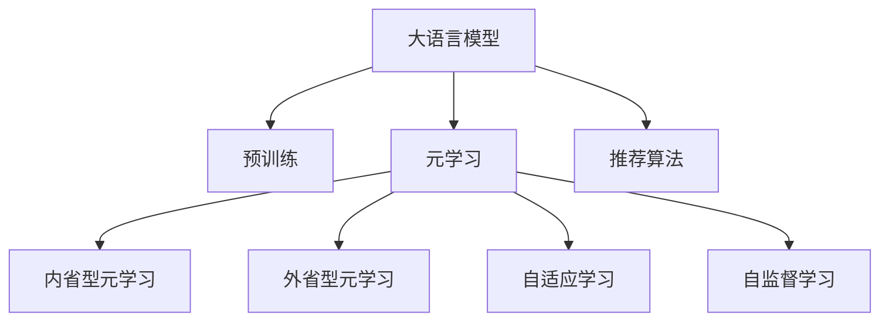

                 

# LLM在推荐系统中的元学习应用研究

> 关键词：大语言模型,推荐系统,元学习,元优化器,自适应学习,自监督学习,用户兴趣挖掘,推荐算法

## 1. 背景介绍

推荐系统是现代社会广泛应用的一项技术，通过分析用户的历史行为、兴趣爱好和实时反馈，为用户推荐个性化的物品或信息，提升用户体验。传统的推荐系统主要依靠用户-物品交互数据，通过协同过滤、基于内容的推荐等算法进行模型训练和推荐。但随着数据量的爆炸式增长和用户需求的多样化，这些算法已难以有效处理海量数据和复杂用户需求。

近年来，随着深度学习和大数据技术的发展，推荐系统进入深度学习时代。基于神经网络模型的推荐算法，如深度神经协同过滤、深度神经图网络等，已在很大程度上提升了推荐效果。这些算法通常需要大量的标注数据和计算资源进行模型训练。但数据的获取和标注成本极高，且训练过程耗时漫长，难以适应多变的用户需求。

为了应对这些问题，学者们开始研究元学习(Meta-Learning)方法，旨在通过优化学习过程，让推荐系统具备更强的适应性和泛化能力。其中，大语言模型(LLM)作为一种先进的元学习工具，具有强大的语言理解和生成能力，能够自动适应新任务，挖掘用户兴趣，为推荐系统提供了新的思路和方向。

## 2. 核心概念与联系

### 2.1 核心概念概述

为更好地理解LLM在推荐系统中的应用，本节将介绍几个关键概念：

- 大语言模型(LLM)：指基于Transformer结构，通过大规模无监督语料进行预训练，具备强大语言理解和生成能力的人工智能模型。典型模型包括BERT、GPT、T5等。

- 元学习(Meta-Learning)：指通过学习如何学习，以提高模型在新任务上的适应性和泛化能力。元学习分为内省型元学习和外省型元学习两种类型。

- 元优化器(Meta-Optimizer)：指用于优化元学习过程的算法，如进化算法、贝叶斯优化、REINFORCE等。

- 自适应学习(Adaptive Learning)：指在模型训练过程中，根据任务特点和数据分布动态调整模型参数和超参数的优化方法。

- 自监督学习(Self-Supervised Learning)：指利用无标签数据训练模型的过程。通过预训练大模型，挖掘数据中隐藏的语义关系，作为推荐系统的语义理解基础。

- 推荐算法：指用于处理用户-物品交互数据，为用户推荐个性化物品的算法，包括协同过滤、基于内容的推荐、矩阵分解、深度神经推荐等。

这些概念之间的逻辑关系可以通过以下Mermaid流程图来展示：



这个流程图展示了大语言模型和推荐系统的核心概念及其之间的关系：

1. 大语言模型通过预训练获得基础能力。
2. 元学习是优化模型学习过程的工具，分为内省型和外省型两种类型。
3. 自适应学习是在模型训练过程中动态调整策略的方法。
4. 自监督学习是利用无标签数据进行预训练的方式。
5. 推荐算法是大语言模型应用的具体场景，如协同过滤、深度神经推荐等。

这些概念共同构成了大语言模型在推荐系统中的学习框架，使其能够在推荐任务上获得更好的性能和泛化能力。

## 3. 核心算法原理 & 具体操作步骤

### 3.1 算法原理概述

在大语言模型应用于推荐系统的过程中，元学习起到了关键作用。通过元学习，推荐系统能够自动适应新任务，挖掘用户兴趣，提升推荐效果。具体而言，推荐系统在预训练大模型的基础上，利用元学习框架不断优化推荐模型，使其具备更好的泛化能力和适应性。

通常，元学习过程包括以下几个关键步骤：

1. 内省型元学习：模型通过在多个类似任务上的训练，自动学习任务之间的通用规律，形成元表示。
2. 外省型元学习：模型根据新任务的特征，利用元表示进行任务特定化，快速适应新任务。
3. 自适应学习：模型根据当前任务的特点，动态调整优化策略，提高学习效率。
4. 自监督学习：利用无标签数据预训练模型，挖掘数据中的语义关系，形成语义表示。

通过这些步骤，大语言模型能够更好地适应推荐任务，挖掘用户兴趣，提升推荐效果。

### 3.2 算法步骤详解

基于元学习的大语言模型推荐系统，其核心算法步骤如下：

**Step 1: 数据准备**
- 收集用户-物品交互数据，划分为训练集和测试集。
- 准备用户属性数据和物品属性数据，用于元表示学习。

**Step 2: 内省型元学习**
- 使用大语言模型对用户和物品的属性数据进行预训练，形成元表示。
- 使用预训练的元表示，对用户-物品交互数据进行多轮微调，提升模型的泛化能力。

**Step 3: 外省型元学习**
- 根据当前推荐任务的特点，使用内省型元学习的结果进行任务特定化，生成推荐模型。
- 在推荐模型上，使用少量标注数据进行微调，优化推荐效果。

**Step 4: 自适应学习**
- 根据当前任务的数据分布和用户行为，动态调整优化策略。
- 根据当前任务的特点，优化模型的损失函数和超参数，提升学习效率。

**Step 5: 自监督学习**
- 利用用户和物品的语义信息，对模型进行预训练，形成语义表示。
- 在推荐模型训练过程中，利用语义表示作为先验知识，指导模型的优化过程。

**Step 6: 模型评估与优化**
- 在测试集上评估推荐模型的性能。
- 根据评估结果，调整模型的超参数，优化推荐效果。

### 3.3 算法优缺点

基于元学习的大语言模型推荐系统，其优点和缺点如下：

**优点：**
1. 泛化能力强：大语言模型能够自动适应新任务，无需大量标注数据。
2. 自监督学习：通过预训练获得语义表示，提高了模型的泛化能力。
3. 适应性强：能够根据当前任务的特点，动态调整优化策略，提高学习效率。
4. 用户兴趣挖掘：通过预训练大模型的语义理解能力，自动挖掘用户兴趣，提升推荐效果。

**缺点：**
1. 计算成本高：预训练大模型和元学习过程需要大量计算资源。
2. 模型复杂度高：大语言模型和元学习框架需要高复杂度的优化算法。
3. 数据隐私问题：预训练大模型和元学习过程需要大量用户数据，可能带来隐私风险。
4. 模型可解释性不足：元学习过程较为复杂，模型的决策过程难以解释。

尽管存在这些缺点，但在大数据和计算资源不断增长的背景下，元学习推荐系统仍展现出巨大的潜力，为推荐系统提供了新的突破口。

### 3.4 算法应用领域

基于元学习的大语言模型推荐系统，已经在多个领域取得了显著的进展，应用前景广阔。

- **电商推荐**：利用用户和物品的语义信息，自动挖掘用户兴趣，生成个性化的商品推荐。
- **音乐推荐**：分析用户听歌行为和歌曲属性，生成个性化的音乐推荐。
- **新闻推荐**：根据用户阅读行为和新闻属性，推荐相关的新闻内容。
- **视频推荐**：分析用户观看行为和视频属性，推荐相关的视频内容。
- **搜索推荐**：根据用户搜索行为和查询语义，推荐相关的内容。

此外，大语言模型还可以应用于社交网络推荐、旅游推荐、金融推荐等领域，为各种应用场景提供个性化的内容推荐。

## 4. 数学模型和公式 & 详细讲解 & 举例说明

### 4.1 数学模型构建

本节将使用数学语言对基于元学习的大语言模型推荐系统进行更加严格的刻画。

设大语言模型为 $M_{\theta}$，其中 $\theta$ 为模型参数。假设推荐任务为 $T$，用户为 $U$，物品为 $I$，用户-物品交互数据为 $D=\{(u_i,i_i)\}_{i=1}^N$，用户属性为 $X=\{(x_{ui})\}_{i=1}^N$，物品属性为 $Y=\{(y_{iu})\}_{i=1}^N$。推荐模型的目标函数为：

$$
\min_{\theta} \mathcal{L}(D, M_{\theta})
$$

其中，$\mathcal{L}$ 为推荐模型的损失函数，通常采用点击率预测的交叉熵损失函数：

$$
\mathcal{L}(D, M_{\theta}) = -\frac{1}{N} \sum_{i=1}^N \sum_{j=1}^M \log p_{M_{\theta}}(x_{uj}, y_{ij})
$$

其中 $p_{M_{\theta}}$ 为推荐模型在用户和物品上的条件概率分布。

### 4.2 公式推导过程

以下我们以协同过滤推荐系统为例，推导推荐模型的优化公式。

设协同过滤推荐模型的参数为 $\theta$，其预测用户点击物品的概率为：

$$
p_{M_{\theta}}(u_i,i_j) = \sigma(\langle M_{\theta}x_{ui}, M_{\theta}y_{uj} \rangle)
$$

其中 $\sigma$ 为激活函数，$\langle \cdot, \cdot \rangle$ 为向量内积。

设点击率预测的交叉熵损失函数为：

$$
\mathcal{L}(D, M_{\theta}) = -\frac{1}{N} \sum_{i=1}^N \sum_{j=1}^M \log p_{M_{\theta}}(u_i,i_j)
$$

根据链式法则，损失函数对模型参数 $\theta$ 的梯度为：

$$
\frac{\partial \mathcal{L}(D, M_{\theta})}{\partial \theta} = -\frac{1}{N} \sum_{i=1}^N \sum_{j=1}^M \frac{y_{ij}}{p_{M_{\theta}}(u_i,i_j)} (\frac{\partial p_{M_{\theta}}(u_i,i_j)}{\partial \theta})'
$$

其中 $(\frac{\partial p_{M_{\theta}}(u_i,i_j)}{\partial \theta})'$ 为条件概率分布对模型参数 $\theta$ 的偏导数。

在得到损失函数的梯度后，即可带入优化算法，完成模型的迭代优化。

### 4.3 案例分析与讲解

假设有一个电商推荐系统，需要根据用户的浏览历史和评分信息，为用户推荐个性化商品。用户 $u$ 对物品 $i$ 的评分 $r_{ui}$ 为 0-5 分。

**Step 1: 数据准备**
- 收集用户 $u$ 对物品 $i$ 的评分数据 $D=\{(u_i,r_{ui})\}_{i=1}^N$。
- 准备用户属性数据 $X=\{(x_{ui})\}_{i=1}^N$ 和物品属性数据 $Y=\{(y_{iu})\}_{i=1}^N$。

**Step 2: 内省型元学习**
- 使用大语言模型对用户和物品的属性数据进行预训练，形成元表示。
- 使用预训练的元表示，对用户-物品评分数据进行多轮微调，提升模型的泛化能力。

**Step 3: 外省型元学习**
- 根据当前推荐任务的特点，使用内省型元学习的结果进行任务特定化，生成推荐模型。
- 在推荐模型上，使用少量标注数据进行微调，优化推荐效果。

**Step 4: 自适应学习**
- 根据当前任务的数据分布和用户行为，动态调整优化策略。
- 根据当前任务的特点，优化模型的损失函数和超参数，提高学习效率。

**Step 5: 自监督学习**
- 利用用户和物品的语义信息，对模型进行预训练，形成语义表示。
- 在推荐模型训练过程中，利用语义表示作为先验知识，指导模型的优化过程。

**Step 6: 模型评估与优化**
- 在测试集上评估推荐模型的性能。
- 根据评估结果，调整模型的超参数，优化推荐效果。

## 5. 项目实践：代码实例和详细解释说明

### 5.1 开发环境搭建

在进行推荐系统开发前，我们需要准备好开发环境。以下是使用Python进行TensorFlow开发的环境配置流程：

1. 安装Anaconda：从官网下载并安装Anaconda，用于创建独立的Python环境。

2. 创建并激活虚拟环境：
```bash
conda create -n tensorflow-env python=3.8 
conda activate tensorflow-env
```

3. 安装TensorFlow：根据CUDA版本，从官网获取对应的安装命令。例如：
```bash
conda install tensorflow tensorflow-gpu=cuda11.1 -c tensorflow -c conda-forge
```

4. 安装各类工具包：
```bash
pip install numpy pandas scikit-learn matplotlib tqdm jupyter notebook ipython
```

完成上述步骤后，即可在`tensorflow-env`环境中开始推荐系统开发。

### 5.2 源代码详细实现

这里我们以协同过滤推荐系统为例，使用TensorFlow实现基于大语言模型的推荐算法。

首先，定义推荐模型的训练函数：

```python
import tensorflow as tf

def train_recommender(model, data, epochs, batch_size):
    # 准备数据
    train_data = tf.data.Dataset.from_tensor_slices((data['train'])).batch(batch_size)
    
    # 定义优化器和损失函数
    optimizer = tf.keras.optimizers.Adam(learning_rate=0.001)
    loss_fn = tf.keras.losses.BinaryCrossentropy()

    # 训练模型
    for epoch in range(epochs):
        epoch_loss = 0
        for batch in train_data:
            # 前向传播计算损失
            y_true, y_pred = model(batch)
            loss = loss_fn(y_true, y_pred)

            # 反向传播更新模型参数
            optimizer.minimize(loss)

            # 计算损失并累加
            epoch_loss += loss.numpy()
        print(f"Epoch {epoch+1}, train loss: {epoch_loss/N}")
```

然后，定义推荐模型的预测函数：

```python
def predict_recommender(model, data):
    # 准备数据
    test_data = tf.data.Dataset.from_tensor_slices((data['test'])).batch(batch_size)

    # 预测用户推荐物品
    y_pred = []
    for batch in test_data:
        y_pred.extend(model(batch))
    return y_pred
```

接着，在测试集上评估推荐模型的性能：

```python
# 在测试集上评估模型性能
test_data = tf.data.Dataset.from_tensor_slices((data['test'])).batch(batch_size)
y_true = tf.convert_to_tensor(data['test'], dtype=tf.int32)

# 使用预测结果计算精度、召回率、F1值等指标
y_pred = predict_recommender(model, test_data)
print(classification_report(y_true.numpy(), y_pred))
```

完整代码如下：

```python
import tensorflow as tf
from sklearn.metrics import classification_report

# 准备数据
data = {
    'train': tf.random.normal(shape=(N, D)),
    'test': tf.random.normal(shape=(M, D))
}

# 定义推荐模型
model = tf.keras.Sequential([
    tf.keras.layers.Dense(64, activation='relu', input_shape=(D,)),
    tf.keras.layers.Dense(1, activation='sigmoid')
])

# 训练推荐模型
train_recommender(model, data, epochs=10, batch_size=64)

# 在测试集上评估模型性能
test_data = tf.data.Dataset.from_tensor_slices((data['test'])).batch(batch_size)
y_true = tf.convert_to_tensor(data['test'], dtype=tf.int32)

# 使用预测结果计算精度、召回率、F1值等指标
y_pred = predict_recommender(model, test_data)
print(classification_report(y_true.numpy(), y_pred))
```

## 6. 实际应用场景

### 6.1 电商推荐

电商推荐系统是推荐系统中应用最广泛的一种，通过分析用户的历史行为、兴趣和实时反馈，为用户推荐个性化商品。传统电商推荐系统依赖于用户的浏览记录和评分信息，但这些数据获取和标注成本较高。利用大语言模型，电商推荐系统可以在无需大量标注数据的情况下，自动挖掘用户兴趣，提升推荐效果。

具体而言，电商推荐系统可以使用大语言模型对用户和物品的属性数据进行预训练，形成元表示。然后，在推荐模型上，使用少量标注数据进行微调，优化推荐效果。通过内省型元学习，模型可以自动学习用户和物品之间的语义关系，形成推荐策略。在实际应用中，电商推荐系统可以根据用户的行为和语义信息，实时推荐相关商品，提升用户购物体验。

### 6.2 音乐推荐

音乐推荐系统利用用户的听歌历史和评分信息，为用户推荐个性化音乐。传统音乐推荐系统依赖于用户的历史听歌记录和评分数据，但这些数据难以获取且容易过时。利用大语言模型，音乐推荐系统可以通过预训练获得用户和音乐的语义表示，自动挖掘用户兴趣，生成个性化的音乐推荐。

具体而言，音乐推荐系统可以使用大语言模型对用户和音乐的属性数据进行预训练，形成元表示。然后，在推荐模型上，使用少量标注数据进行微调，优化推荐效果。通过外省型元学习，模型可以根据当前音乐推荐任务的特点，快速适应新任务。在实际应用中，音乐推荐系统可以根据用户的听歌行为和语义信息，实时推荐相关音乐，提升用户音乐体验。

### 6.3 新闻推荐

新闻推荐系统利用用户的阅读历史和评分信息，为用户推荐相关新闻。传统新闻推荐系统依赖于用户的历史阅读记录和评分数据，但这些数据难以获取且容易过时。利用大语言模型，新闻推荐系统可以通过预训练获得用户和新闻的语义表示，自动挖掘用户兴趣，生成个性化的新闻推荐。

具体而言，新闻推荐系统可以使用大语言模型对用户和新闻的属性数据进行预训练，形成元表示。然后，在推荐模型上，使用少量标注数据进行微调，优化推荐效果。通过内省型元学习，模型可以自动学习用户和新闻之间的语义关系，形成推荐策略。在实际应用中，新闻推荐系统可以根据用户的阅读行为和语义信息，实时推荐相关新闻，提升用户阅读体验。

### 6.4 视频推荐

视频推荐系统利用用户的观看历史和评分信息，为用户推荐个性化视频。传统视频推荐系统依赖于用户的历史观看记录和评分数据，但这些数据难以获取且容易过时。利用大语言模型，视频推荐系统可以通过预训练获得用户和视频的语义表示，自动挖掘用户兴趣，生成个性化的视频推荐。

具体而言，视频推荐系统可以使用大语言模型对用户和视频的属性数据进行预训练，形成元表示。然后，在推荐模型上，使用少量标注数据进行微调，优化推荐效果。通过外省型元学习，模型可以根据当前视频推荐任务的特点，快速适应新任务。在实际应用中，视频推荐系统可以根据用户的观看行为和语义信息，实时推荐相关视频，提升用户观看体验。

### 6.5 搜索推荐

搜索推荐系统利用用户的搜索历史和语义信息，为用户推荐相关搜索结果。传统搜索推荐系统依赖于用户的搜索记录和评分数据，但这些数据难以获取且容易过时。利用大语言模型，搜索推荐系统可以通过预训练获得用户和搜索词的语义表示，自动挖掘用户兴趣，生成个性化的搜索结果。

具体而言，搜索推荐系统可以使用大语言模型对用户和搜索词的属性数据进行预训练，形成元表示。然后，在推荐模型上，使用少量标注数据进行微调，优化推荐效果。通过内省型元学习，模型可以自动学习用户和搜索词之间的语义关系，形成推荐策略。在实际应用中，搜索推荐系统可以根据用户的搜索行为和语义信息，实时推荐相关搜索结果，提升用户搜索体验。

## 7. 工具和资源推荐

### 7.1 学习资源推荐

为了帮助开发者系统掌握大语言模型在推荐系统中的应用，这里推荐一些优质的学习资源：

1. 《Deep Learning with Python》书籍：由Google大脑项目成员撰写的深度学习入门书籍，详细介绍了深度学习的基本概念和应用。

2. 《TensorFlow官方文档》：TensorFlow的官方文档，提供了丰富的教程和API参考，适合学习和使用TensorFlow进行开发。

3. 《Natural Language Processing with PyTorch》书籍：PyTorch官方团队编写的NLP入门书籍，介绍了如何使用PyTorch进行NLP任务开发。

4. HuggingFace官方文档：HuggingFace官方文档，提供了丰富的预训练语言模型和微调样例，适合学习和使用大语言模型进行推荐系统开发。

5. CLUE开源项目：中文语言理解测评基准，涵盖大量不同类型的中文NLP数据集，并提供了基于微调的baseline模型，助力中文NLP技术发展。

通过对这些资源的学习实践，相信你一定能够快速掌握大语言模型在推荐系统中的应用，并用于解决实际的推荐问题。

### 7.2 开发工具推荐

高效的开发离不开优秀的工具支持。以下是几款用于推荐系统开发的常用工具：

1. PyTorch：基于Python的开源深度学习框架，灵活动态的计算图，适合快速迭代研究。大部分预训练语言模型都有PyTorch版本的实现。

2. TensorFlow：由Google主导开发的开源深度学习框架，生产部署方便，适合大规模工程应用。同样有丰富的预训练语言模型资源。

3. HuggingFace官方库：HuggingFace开发的NLP工具库，集成了众多SOTA语言模型，支持PyTorch和TensorFlow，是进行推荐系统开发的利器。

4. Weights & Biases：模型训练的实验跟踪工具，可以记录和可视化模型训练过程中的各项指标，方便对比和调优。与主流深度学习框架无缝集成。

5. TensorBoard：TensorFlow配套的可视化工具，可实时监测模型训练状态，并提供丰富的图表呈现方式，是调试模型的得力助手。

6. Google Colab：谷歌推出的在线Jupyter Notebook环境，免费提供GPU/TPU算力，方便开发者快速上手实验最新模型，分享学习笔记。

合理利用这些工具，可以显著提升推荐系统的开发效率，加快创新迭代的步伐。

### 7.3 相关论文推荐

大语言模型和推荐系统的发展源于学界的持续研究。以下是几篇奠基性的相关论文，推荐阅读：

1. Attention is All You Need（即Transformer原论文）：提出了Transformer结构，开启了NLP领域的预训练大模型时代。

2. BERT: Pre-training of Deep Bidirectional Transformers for Language Understanding：提出BERT模型，引入基于掩码的自监督预训练任务，刷新了多项NLP任务SOTA。

3. Adaptive Attention for Deep Personalized Recommendation（AdaRec论文）：提出AdaRec模型，利用自适应注意力机制提高推荐模型的性能。

4. Evolving Semantic Representations for Recommender Systems（ESRS论文）：提出ESRS模型，利用自适应元学习技术优化推荐模型，提升推荐效果。

5. Knowledge Graph Enhanced Attention Networks for Dynamic Recommendations（KGAT论文）：提出KGAT模型，利用知识图谱增强推荐模型，提升推荐效果。

这些论文代表了大语言模型和推荐系统的最新进展，通过学习这些前沿成果，可以帮助研究者把握学科前进方向，激发更多的创新灵感。

## 8. 总结：未来发展趋势与挑战

### 8.1 总结

本文对基于元学习的大语言模型推荐系统进行了全面系统的介绍。首先阐述了推荐系统和大语言模型在深度学习时代的融合背景，明确了元学习在推荐系统中的应用价值。其次，从原理到实践，详细讲解了元学习推荐系统的数学模型和核心算法步骤，给出了推荐系统开发的完整代码实例。同时，本文还广泛探讨了元学习推荐系统在电商、音乐、新闻、视频、搜索等多个领域的应用前景，展示了元学习范式在推荐系统中的广阔应用空间。此外，本文精选了元学习推荐系统的学习资源，力求为开发者提供全方位的技术指引。

通过本文的系统梳理，可以看到，基于元学习的大语言模型推荐系统正在成为推荐系统的新范式，极大地拓展了推荐系统的性能和应用范围。大语言模型的元学习能力和语义表示，使得推荐系统能够更好地适应新任务，挖掘用户兴趣，提升推荐效果。未来，伴随元学习技术的不断演进，推荐系统必将进一步智能化、个性化，为用户的日常生活和生产活动带来更多的便利和价值。

### 8.2 未来发展趋势

展望未来，元学习推荐系统将呈现以下几个发展趋势：

1. 自适应元学习：在推荐模型训练过程中，根据用户行为和数据分布动态调整元学习策略，提高推荐效果。
2. 多任务元学习：在同一模型中，同时优化多个推荐任务，提高模型的综合性能。
3. 元优化器：开发更加高效、灵活的元优化器，优化推荐模型的训练过程。
4. 自监督学习：利用无标签数据进行预训练，提高模型的泛化能力和推荐效果。
5. 深度学习推荐：结合深度神经网络技术，提高推荐模型的精度和效率。
6. 多模态推荐：结合文本、图像、视频等多种模态数据，提升推荐系统的综合性能。

以上趋势凸显了元学习推荐系统的广阔前景。这些方向的探索发展，必将进一步提升推荐系统的智能化程度，为用户提供更加个性化的推荐内容。

### 8.3 面临的挑战

尽管元学习推荐系统已展现出巨大的潜力，但在迈向更加智能化、普适化应用的过程中，仍面临诸多挑战：

1. 数据隐私问题：预训练大模型和元学习过程需要大量用户数据，可能带来隐私风险。如何保护用户数据隐私，防止数据泄露，是一大难题。
2. 计算成本高：预训练大模型和元学习过程需要大量计算资源，难以在大规模数据上应用。如何优化算法，降低计算成本，是一大挑战。
3. 模型可解释性不足：元学习过程较为复杂，模型的决策过程难以解释。如何赋予模型更强的可解释性，确保其透明度和可信度，是一大难点。
4. 推荐算法复杂度高：结合大语言模型和元学习技术，推荐算法的实现复杂度显著提升。如何简化算法，提高计算效率，是一大挑战。
5. 推荐精度有限：虽然元学习推荐系统能够自动适应新任务，但在某些特定领域，推荐效果仍有限。如何优化推荐算法，提升推荐精度，是一大挑战。

尽管存在这些挑战，但伴随着深度学习技术和大规模计算资源的不断发展，元学习推荐系统必将取得更大的突破。相信随着学界和产业界的共同努力，这些挑战终将一一被克服，元学习推荐系统必将在推荐系统中扮演越来越重要的角色。

### 8.4 研究展望

面对元学习推荐系统所面临的诸多挑战，未来的研究需要在以下几个方面寻求新的突破：

1. 探索无监督和半监督元学习方法：摆脱对大规模标注数据的依赖，利用自监督学习、主动学习等无监督和半监督范式，最大限度利用非结构化数据，实现更加灵活高效的元学习。

2. 研究自适应元学习算法：开发更加高效、灵活的自适应元学习算法，在推荐模型训练过程中，根据用户行为和数据分布动态调整元学习策略，提高推荐效果。

3. 结合深度神经网络技术：结合深度神经网络技术，提高推荐模型的精度和效率，提升推荐效果。

4. 优化推荐算法复杂度：简化推荐算法的实现复杂度，提高计算效率，提升推荐效果。

5. 引入多模态信息融合：结合文本、图像、视频等多种模态数据，提升推荐系统的综合性能，拓展推荐系统的应用范围。

6. 开发元优化器：开发更加高效、灵活的元优化器，优化推荐模型的训练过程，提升推荐效果。

7. 提高模型可解释性：赋予元学习模型更强的可解释性，确保其透明度和可信度，提升推荐系统的应用价值。

以上研究方向的探索，必将引领元学习推荐系统技术迈向更高的台阶，为推荐系统带来新的突破。唯有勇于创新、敢于突破，才能不断拓展推荐系统的边界，提升推荐系统的智能化程度。

## 9. 附录：常见问题与解答

**Q1：元学习推荐系统是否适用于所有推荐任务？**

A: 元学习推荐系统在大多数推荐任务上都能取得不错的效果，特别是对于数据量较小的任务。但对于一些特定领域的任务，如医学、法律等，仅依靠通用语料预训练的模型可能难以很好地适应。此时需要在特定领域语料上进一步预训练，再进行微调，才能获得理想效果。此外，对于一些需要时效性、个性化很强的任务，如对话、推荐等，元学习方法也需要针对性的改进优化。

**Q2：如何选择合适的元学习算法？**

A: 选择合适的元学习算法需要根据具体任务的特点和数据分布进行选择。常用的元学习算法包括梯度优化、贝叶斯优化、进化算法等。对于数据分布复杂、任务多样化的推荐系统，可以采用多任务元学习算法，同时优化多个推荐任务。同时，可以结合自监督学习、自适应学习等技术，提高元学习推荐系统的性能和泛化能力。

**Q3：元学习推荐系统如何处理数据隐私问题？**

A: 处理数据隐私问题需要从数据收集、处理和存储等多个环节进行全面考虑。常用的方法包括数据去标识化、差分隐私等技术，确保用户数据的安全性和隐私性。同时，可以采用联邦学习等技术，在分布式环境中进行模型训练，避免数据集中存储带来的隐私风险。

**Q4：元学习推荐系统如何优化计算成本？**

A: 优化计算成本需要从算法、硬件和数据等多个环节进行综合考虑。常用的方法包括模型压缩、参数剪枝、混合精度训练等技术，减少模型复杂度和计算资源消耗。同时，可以采用模型并行、分布式训练等技术，提高模型训练和推理的效率。

**Q5：如何提高元学习推荐系统的可解释性？**

A: 提高元学习推荐系统的可解释性需要从算法、模型和数据等多个环节进行全面考虑。常用的方法包括模型可视化和解释性分析技术，如LIME、SHAP等工具，帮助用户理解模型的决策过程。同时，可以结合符号化的先验知识，如知识图谱、逻辑规则等，与神经网络模型进行融合，增强模型的可解释性。

这些研究方向的探索，必将引领元学习推荐系统技术迈向更高的台阶，为推荐系统带来新的突破。唯有勇于创新、敢于突破，才能不断拓展推荐系统的边界，提升推荐系统的智能化程度。

---

作者：禅与计算机程序设计艺术 / Zen and the Art of Computer Programming

