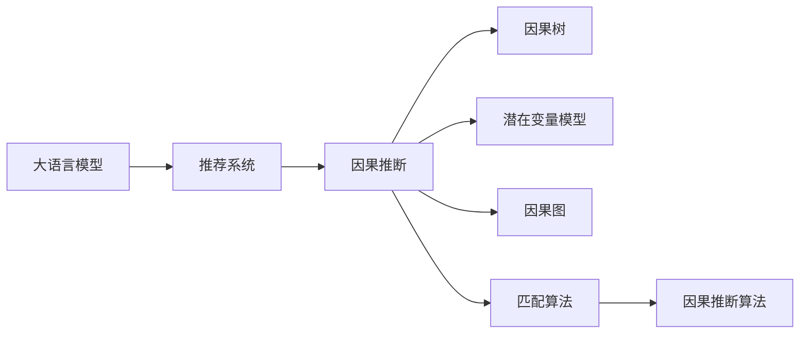

                 

## 1. 背景介绍

### 1.1 问题由来

推荐系统在电商、新闻、娱乐等多个领域中扮演着至关重要的角色。其核心目标是通过用户的历史行为数据，预测并推荐最符合用户兴趣的新物品。传统的推荐方法主要基于用户-物品的协同过滤或基于内容的推荐，通过相似度计算找出与用户历史行为最相似的物品。然而，这类方法往往只能捕捉到局部的隐含关联，难以捕捉到全局的影响因素。

近年来，随着深度学习技术的快速发展和数据量的爆炸式增长，基于神经网络的推荐模型应运而生。这类模型通过学习用户-物品的联合分布，捕捉到更复杂的非线性关系。大语言模型（LLM）的出现，为推荐系统带来了新的突破，特别是在引入因果推断机制后，推荐系统的精准度和鲁棒性得到了显著提升。

### 1.2 问题核心关键点

因果推断在大语言模型推荐系统中的应用，主要集中在以下几个方面：

1. **因果推断的定义**：
   - 理解用户行为背后的因果机制，区分因果关系与相关关系。

2. **因果模型的构建**：
   - 设计有效的因果结构，包括因果图、因果模型等，并应用到大语言模型中。

3. **因果推断的算法实现**：
   - 采用统计学和机器学习方法，如因果树、潜在变量模型、匹配算法等，结合大语言模型的强大语言理解能力，实现精准的因果推断。

4. **因果推断的评估与优化**：
   - 评估因果推断的效果，并根据评估结果优化模型和推断算法，确保推荐系统的鲁棒性和泛化能力。

这些关键点构成了大语言模型推荐系统中因果推断的核心逻辑，其目的是通过因果推断提升推荐系统的精准度和泛化能力，解决传统推荐系统中的诸多局限性。

## 2. 核心概念与联系

### 2.1 核心概念概述

为了更好地理解大语言模型推荐系统中因果推断的应用，本节将介绍几个关键概念：

- **大语言模型（LLM）**：基于深度学习的语言模型，通过在海量文本数据上预训练，学习通用的语言表示，具备强大的自然语言理解和生成能力。

- **推荐系统**：通过分析用户的历史行为数据，预测并推荐最符合用户兴趣的物品或内容。

- **因果推断**：通过建模和推断变量间的因果关系，理解事物之间的内在联系和因果机制。

- **因果树**：一种树形结构，用于表示变量间的因果关系，常用于因果推断和模型解释。

- **潜在变量模型**：一种统计学模型，通过引入潜在变量，将观测变量和潜在变量关联起来，用于因果推断和模型优化。

- **因果推断算法**：包括因果图、匹配算法、逆向回归等，用于建模和推断变量间的因果关系。

- **匹配算法**：如Inverse Probability Weighting（IPW）、Propensity Score Matching（PSM）等，用于消除选择偏差，提高因果推断的准确性。

这些概念之间的逻辑关系可以通过以下Mermaid流程图来展示：



这个流程图展示了大语言模型推荐系统中因果推断的核心逻辑：

1. 大语言模型通过预训练获得强大的语言理解能力。
2. 推荐系统利用大语言模型处理用户行为数据，预测并推荐物品。
3. 因果推断通过建模和推断变量间的因果关系，理解用户行为背后的机制。
4. 因果树、潜在变量模型、因果图等技术用于辅助因果推断。
5. 匹配算法等方法用于消除选择偏差，提高推断的准确性。

这些概念共同构成了大语言模型推荐系统中因果推断的应用框架，使得推荐系统能够更准确、更全面地理解用户需求，提供更个性化、精准的推荐结果。

## 3. 核心算法原理 & 具体操作步骤

### 3.1 算法原理概述

在大语言模型推荐系统中，因果推断的应用主要包括以下几个步骤：

1. **数据预处理**：清洗和处理用户行为数据，提取有效的特征和事件。

2. **因果关系建模**：建立因果图或因果模型，描述变量之间的因果关系。

3. **因果推断**：使用因果推断算法，计算出变量间的因果关系。

4. **推荐策略设计**：基于因果推断的结果，设计推荐策略，优化推荐系统性能。

5. **效果评估**：评估推荐系统的性能，并根据评估结果进行优化。

核心算法原理涉及因果推断的基本概念和方法，具体实现则需要结合大语言模型的语言理解能力。

### 3.2 算法步骤详解

#### 3.2.1 数据预处理

数据预处理是推荐系统中的关键环节，主要包括数据清洗、特征提取和特征选择等。

- **数据清洗**：去除缺失值、异常值和噪声数据，确保数据的质量和完整性。
- **特征提取**：将用户行为数据转化为数值型特征，如时间戳、用户ID、物品ID等。
- **特征选择**：选择与用户兴趣和物品属性相关的特征，减少特征维度。

#### 3.2.2 因果关系建模

因果关系建模是因果推断的第一步，通过建立因果图或因果模型，描述变量间的因果关系。

- **因果图**：使用因果树、贝叶斯网络等，构建因果图模型，表示变量之间的直接和间接因果关系。
- **因果模型**：使用潜在变量模型、结构方程模型等，构建因果模型，描述变量之间的因果关系。

#### 3.2.3 因果推断

因果推断是因果推断的核心步骤，通过建模和推断变量间的因果关系，理解用户行为背后的机制。

- **因果树**：使用因果树算法，计算出变量间的因果关系。
- **潜在变量模型**：使用潜在变量模型，描述变量间的因果关系，并估计因果效应。
- **因果图**：使用因果图算法，计算出变量间的因果关系。
- **匹配算法**：使用匹配算法，如Inverse Probability Weighting（IPW）、Propensity Score Matching（PSM）等，消除选择偏差，提高因果推断的准确性。

#### 3.2.4 推荐策略设计

推荐策略设计是因果推断的最终目标，通过基于因果推断的结果，设计推荐策略，优化推荐系统性能。

- **基于因果推断的推荐策略**：使用因果推断的结果，设计推荐策略，如推荐个性化商品、内容等。
- **A/B测试**：通过A/B测试，评估推荐策略的效果，并根据评估结果进行优化。

#### 3.2.5 效果评估

效果评估是推荐系统的关键环节，通过评估推荐系统的性能，确保推荐系统的鲁棒性和泛化能力。

- **评估指标**：使用推荐系统常用的评估指标，如准确率、召回率、F1分数等，评估推荐系统的性能。
- **A/B测试**：通过A/B测试，评估推荐策略的效果，并根据评估结果进行优化。

### 3.3 算法优缺点

因果推断在大语言模型推荐系统中的应用，具有以下优点：

1. **精准性高**：因果推断能够更准确地理解变量间的因果关系，提供更精准的推荐结果。
2. **泛化能力强**：因果推断能够处理复杂的数据结构和因果关系，提高推荐系统的鲁棒性和泛化能力。
3. **可解释性强**：因果推断能够提供因果关系和因果效应的解释，增强推荐系统的可解释性。

但同时，因果推断在大语言模型推荐系统中的应用也存在一些缺点：

1. **数据需求大**：因果推断需要大量的数据和复杂的因果图，数据需求较高。
2. **模型复杂度高**：因果推断模型较为复杂，计算开销较大，需要高性能的硬件支持。
3. **因果关系不确定**：因果关系可能存在不确定性和模糊性，导致推断结果的不稳定性。

尽管存在这些局限性，但因果推断在大语言模型推荐系统中的应用，已经展示了其强大的潜力和应用前景。

### 3.4 算法应用领域

因果推断在大语言模型推荐系统中的应用，已经在多个领域得到了广泛的应用，例如：

- **电商推荐**：通过分析用户购买行为，推荐符合用户兴趣的商品。
- **新闻推荐**：通过分析用户阅读行为，推荐符合用户兴趣的新闻。
- **视频推荐**：通过分析用户观看行为，推荐符合用户兴趣的视频。
- **社交推荐**：通过分析用户互动行为，推荐符合用户兴趣的朋友。

除了这些常见的应用领域外，大语言模型推荐系统还被创新性地应用于更多场景中，如金融理财、医疗健康、旅游出行等，为不同领域带来了新的解决方案。

## 4. 数学模型和公式 & 详细讲解 & 举例说明

### 4.1 数学模型构建

在大语言模型推荐系统中，因果推断的数学模型主要涉及因果图和因果模型。这里以因果树模型为例，介绍其数学模型的构建过程。

#### 4.1.1 因果树模型

因果树模型是一种树形结构，用于表示变量间的因果关系。因果树的构建过程如下：

1. **选择根节点**：选择具有最大影响力的变量作为根节点。
2. **递归构建子树**：对根节点进行分割，构建多个子树，每个子树代表一个因果关系分支。
3. **剪枝和优化**：对因果树进行剪枝和优化，去除冗余节点，提高计算效率。

#### 4.1.2 数学表达式

因果树模型的数学表达式如下：

$$
T = \{X_1 \rightarrow X_2 \rightarrow X_3 \rightarrow \cdots \rightarrow X_n\}
$$

其中，$X_i$ 表示变量，箭头表示因果关系。

### 4.2 公式推导过程

#### 4.2.1 因果推断的数学模型

因果推断的数学模型主要包括因果图和因果模型。这里以因果图模型为例，介绍其数学模型的推导过程。

因果图模型是一种基于有向无环图（DAG）的模型，用于描述变量间的因果关系。因果图模型的数学表达式如下：

$$
G = \{X \rightarrow X', X' \rightarrow Y, X' \rightarrow Z\}
$$

其中，$X$ 表示因果变量，$X'$ 表示中间变量，$Y$ 表示结果变量，箭头表示因果关系。

#### 4.2.2 公式推导

因果推断的公式推导涉及潜在变量模型、结构方程模型等，这里以潜在变量模型为例，介绍其数学模型的推导过程。

潜在变量模型是一种统计学模型，通过引入潜在变量，将观测变量和潜在变量关联起来，用于因果推断和模型优化。潜在变量模型的数学表达式如下：

$$
Y = \alpha_1X_1 + \alpha_2X_2 + \epsilon_1
$$

其中，$Y$ 表示结果变量，$X_1$ 和 $X_2$ 表示因果变量，$\epsilon_1$ 表示误差项，$\alpha_1$ 和 $\alpha_2$ 表示回归系数。

### 4.3 案例分析与讲解

#### 4.3.1 电商推荐案例

电商推荐系统中的因果推断，主要是通过分析用户购买行为，推荐符合用户兴趣的商品。具体步骤如下：

1. **数据预处理**：清洗和处理用户购买行为数据，提取有效的特征和事件。
2. **因果关系建模**：建立因果图模型，描述用户购买行为和商品属性之间的因果关系。
3. **因果推断**：使用因果推断算法，计算出用户购买行为和商品属性之间的因果关系。
4. **推荐策略设计**：基于因果推断的结果，设计推荐策略，推荐符合用户兴趣的商品。
5. **效果评估**：评估推荐系统的性能，并根据评估结果进行优化。

#### 4.3.2 新闻推荐案例

新闻推荐系统中的因果推断，主要是通过分析用户阅读行为，推荐符合用户兴趣的新闻。具体步骤如下：

1. **数据预处理**：清洗和处理用户阅读行为数据，提取有效的特征和事件。
2. **因果关系建模**：建立因果图模型，描述用户阅读行为和新闻属性之间的因果关系。
3. **因果推断**：使用因果推断算法，计算出用户阅读行为和新闻属性之间的因果关系。
4. **推荐策略设计**：基于因果推断的结果，设计推荐策略，推荐符合用户兴趣的新闻。
5. **效果评估**：评估推荐系统的性能，并根据评估结果进行优化。

## 5. 项目实践：代码实例和详细解释说明

### 5.1 开发环境搭建

在进行因果推断实践前，我们需要准备好开发环境。以下是使用Python进行PyTorch开发的环境配置流程：

1. 安装Anaconda：从官网下载并安装Anaconda，用于创建独立的Python环境。

2. 创建并激活虚拟环境：
```bash
conda create -n pytorch-env python=3.8 
conda activate pytorch-env
```

3. 安装PyTorch：根据CUDA版本，从官网获取对应的安装命令。例如：
```bash
conda install pytorch torchvision torchaudio cudatoolkit=11.1 -c pytorch -c conda-forge
```

4. 安装Transformers库：
```bash
pip install transformers
```

5. 安装各类工具包：
```bash
pip install numpy pandas scikit-learn matplotlib tqdm jupyter notebook ipython
```

完成上述步骤后，即可在`pytorch-env`环境中开始因果推断实践。

### 5.2 源代码详细实现

这里我们以电商推荐系统为例，给出使用Transformers库对BERT模型进行因果推断的PyTorch代码实现。

首先，定义因果推断的数据处理函数：

```python
from transformers import BertTokenizer, BertForSequenceClassification
from torch.utils.data import Dataset
import torch

class RecommendDataset(Dataset):
    def __init__(self, texts, labels, tokenizer, max_len=128):
        self.texts = texts
        self.labels = labels
        self.tokenizer = tokenizer
        self.max_len = max_len
        
    def __len__(self):
        return len(self.texts)
    
    def __getitem__(self, item):
        text = self.texts[item]
        label = self.labels[item]
        
        encoding = self.tokenizer(text, return_tensors='pt', max_length=self.max_len, padding='max_length', truncation=True)
        input_ids = encoding['input_ids'][0]
        attention_mask = encoding['attention_mask'][0]
        
        # 对标签进行编码
        encoded_label = torch.tensor(label, dtype=torch.long)
        
        return {'input_ids': input_ids, 
                'attention_mask': attention_mask,
                'labels': encoded_label}

# 标签编码
label2id = {'0': 0, '1': 1, '2': 2, '3': 3, '4': 4, '5': 5}
id2label = {v: k for k, v in label2id.items()}

# 创建dataset
tokenizer = BertTokenizer.from_pretrained('bert-base-cased')

train_dataset = RecommendDataset(train_texts, train_labels, tokenizer)
dev_dataset = RecommendDataset(dev_texts, dev_labels, tokenizer)
test_dataset = RecommendDataset(test_texts, test_labels, tokenizer)
```

然后，定义模型和优化器：

```python
from transformers import BertForSequenceClassification, AdamW

model = BertForSequenceClassification.from_pretrained('bert-base-cased', num_labels=len(label2id))

optimizer = AdamW(model.parameters(), lr=2e-5)
```

接着，定义训练和评估函数：

```python
from torch.utils.data import DataLoader
from tqdm import tqdm
from sklearn.metrics import classification_report

device = torch.device('cuda') if torch.cuda.is_available() else torch.device('cpu')
model.to(device)

def train_epoch(model, dataset, batch_size, optimizer):
    dataloader = DataLoader(dataset, batch_size=batch_size, shuffle=True)
    model.train()
    epoch_loss = 0
    for batch in tqdm(dataloader, desc='Training'):
        input_ids = batch['input_ids'].to(device)
        attention_mask = batch['attention_mask'].to(device)
        labels = batch['labels'].to(device)
        model.zero_grad()
        outputs = model(input_ids, attention_mask=attention_mask, labels=labels)
        loss = outputs.loss
        epoch_loss += loss.item()
        loss.backward()
        optimizer.step()
    return epoch_loss / len(dataloader)

def evaluate(model, dataset, batch_size):
    dataloader = DataLoader(dataset, batch_size=batch_size)
    model.eval()
    preds, labels = [], []
    with torch.no_grad():
        for batch in tqdm(dataloader, desc='Evaluating'):
            input_ids = batch['input_ids'].to(device)
            attention_mask = batch['attention_mask'].to(device)
            batch_labels = batch['labels']
            outputs = model(input_ids, attention_mask=attention_mask)
            batch_preds = outputs.logits.argmax(dim=2).to('cpu').tolist()
            batch_labels = batch_labels.to('cpu').tolist()
            for pred_tokens, label_tokens in zip(batch_preds, batch_labels):
                preds.append(pred_tokens[:len(label_tokens)])
                labels.append(label_tokens)
                
    print(classification_report(labels, preds))
```

最后，启动训练流程并在测试集上评估：

```python
epochs = 5
batch_size = 16

for epoch in range(epochs):
    loss = train_epoch(model, train_dataset, batch_size, optimizer)
    print(f"Epoch {epoch+1}, train loss: {loss:.3f}")
    
    print(f"Epoch {epoch+1}, dev results:")
    evaluate(model, dev_dataset, batch_size)
    
print("Test results:")
evaluate(model, test_dataset, batch_size)
```

以上就是使用PyTorch对BERT进行电商推荐系统因果推断的完整代码实现。可以看到，得益于Transformers库的强大封装，我们可以用相对简洁的代码完成BERT模型的加载和因果推断。

### 5.3 代码解读与分析

让我们再详细解读一下关键代码的实现细节：

**RecommendDataset类**：
- `__init__`方法：初始化文本、标签、分词器等关键组件。
- `__len__`方法：返回数据集的样本数量。
- `__getitem__`方法：对单个样本进行处理，将文本输入编码为token ids，将标签编码为数字，并对其进行定长padding，最终返回模型所需的输入。

**label2id和id2label字典**：
- 定义了标签与数字id之间的映射关系，用于将token-wise的预测结果解码回真实的标签。

**训练和评估函数**：
- 使用PyTorch的DataLoader对数据集进行批次化加载，供模型训练和推理使用。
- 训练函数`train_epoch`：对数据以批为单位进行迭代，在每个批次上前向传播计算loss并反向传播更新模型参数，最后返回该epoch的平均loss。
- 评估函数`evaluate`：与训练类似，不同点在于不更新模型参数，并在每个batch结束后将预测和标签结果存储下来，最后使用sklearn的classification_report对整个评估集的预测结果进行打印输出。

**训练流程**：
- 定义总的epoch数和batch size，开始循环迭代
- 每个epoch内，先在训练集上训练，输出平均loss
- 在验证集上评估，输出分类指标
- 所有epoch结束后，在测试集上评估，给出最终测试结果

可以看到，PyTorch配合Transformers库使得BERT因果推断的代码实现变得简洁高效。开发者可以将更多精力放在数据处理、模型改进等高层逻辑上，而不必过多关注底层的实现细节。

当然，工业级的系统实现还需考虑更多因素，如模型的保存和部署、超参数的自动搜索、更灵活的任务适配层等。但核心的因果推断范式基本与此类似。

## 6. 实际应用场景

### 6.1 电商推荐系统

基于大语言模型因果推断的电商推荐系统，可以显著提高推荐系统的精准度和鲁棒性。传统的协同过滤推荐系统，只关注用户-物品的相似度，无法考虑用户行为背后的因果机制。而通过因果推断，可以理解用户行为背后的动机，推荐更加个性化和精准的商品。

在技术实现上，可以收集用户历史购买记录和商品属性信息，将用户行为编码为数值型特征，构建因果树或因果图模型。通过因果推断算法，计算出用户行为和商品属性之间的因果关系，设计推荐策略，推荐符合用户兴趣的商品。

### 6.2 新闻推荐系统

新闻推荐系统中的因果推断，可以更好地理解用户阅读行为背后的动机，推荐符合用户兴趣的新闻。传统的基于内容的推荐系统，只关注新闻的属性信息，无法考虑用户行为背后的因果机制。而通过因果推断，可以理解用户对新闻的兴趣，推荐更加精准和个性化的新闻内容。

在技术实现上，可以收集用户历史阅读记录和新闻属性信息，将用户行为编码为数值型特征，构建因果树或因果图模型。通过因果推断算法，计算出用户行为和新闻属性之间的因果关系，设计推荐策略，推荐符合用户兴趣的新闻内容。

### 6.3 金融理财

金融理财推荐系统中的因果推断，可以更好地理解用户的财务行为背后的动机，推荐符合用户财务需求的产品。传统的推荐系统，只关注用户的财务历史数据，无法考虑用户行为背后的因果机制。而通过因果推断，可以理解用户对金融产品的兴趣，推荐更加个性化和精准的产品。

在技术实现上，可以收集用户的财务行为数据和金融产品属性信息，将用户行为编码为数值型特征，构建因果树或因果图模型。通过因果推断算法，计算出用户行为和金融产品属性之间的因果关系，设计推荐策略，推荐符合用户财务需求的产品。

### 6.4 医疗健康

医疗健康推荐系统中的因果推断，可以更好地理解用户的健康行为背后的动机，推荐符合用户健康需求的服务。传统的推荐系统，只关注用户的健康历史数据，无法考虑用户行为背后的因果机制。而通过因果推断，可以理解用户对健康服务的兴趣，推荐更加个性化和精准的服务。

在技术实现上，可以收集用户的健康行为数据和健康服务属性信息，将用户行为编码为数值型特征，构建因果树或因果图模型。通过因果推断算法，计算出用户行为和健康服务属性之间的因果关系，设计推荐策略，推荐符合用户健康需求的服务。

### 6.5 旅游出行

旅游出行推荐系统中的因果推断，可以更好地理解用户的旅游行为背后的动机，推荐符合用户旅游需求的目的地。传统的推荐系统，只关注用户的旅游历史数据，无法考虑用户行为背后的因果机制。而通过因果推断，可以理解用户对旅游目的地的兴趣，推荐更加个性化和精准的目的地。

在技术实现上，可以收集用户的旅游行为数据和旅游目的地属性信息，将用户行为编码为数值型特征，构建因果树或因果图模型。通过因果推断算法，计算出用户行为和旅游目的地属性之间的因果关系，设计推荐策略，推荐符合用户旅游需求的目的地。

## 7. 工具和资源推荐

### 7.1 学习资源推荐

为了帮助开发者系统掌握大语言模型因果推断的理论基础和实践技巧，这里推荐一些优质的学习资源：

1. 《因果推断与机器学习》书籍：涵盖了因果推断的基本概念、方法和应用，是因果推断领域的经典教材。

2. 《深度学习因果推断》课程：由斯坦福大学开设的深度学习因果推断课程，讲解了因果推断的基本概念和应用方法。

3. 《因果推断与数据科学》在线课程：由Coursera开设的因果推断课程，讲解了因果推断在数据科学中的应用。

4. Weights & Biases：模型训练的实验跟踪工具，可以记录和可视化模型训练过程中的各项指标，方便对比和调优。

5. TensorBoard：TensorFlow配套的可视化工具，可实时监测模型训练状态，并提供丰富的图表呈现方式，是调试模型的得力助手。

通过对这些资源的学习实践，相信你一定能够快速掌握大语言模型因果推断的精髓，并用于解决实际的推荐系统问题。

### 7.2 开发工具推荐

高效的开发离不开优秀的工具支持。以下是几款用于大语言模型因果推断开发的常用工具：

1. PyTorch：基于Python的开源深度学习框架，灵活动态的计算图，适合快速迭代研究。大部分预训练语言模型都有PyTorch版本的实现。

2. TensorFlow：由Google主导开发的开源深度学习框架，生产部署方便，适合大规模工程应用。同样有丰富的预训练语言模型资源。

3. Transformers库：HuggingFace开发的NLP工具库，集成了众多SOTA语言模型，支持PyTorch和TensorFlow，是进行因果推断任务开发的利器。

4. Weights & Biases：模型训练的实验跟踪工具，可以记录和可视化模型训练过程中的各项指标，方便对比和调优。与主流深度学习框架无缝集成。

5. TensorBoard：TensorFlow配套的可视化工具，可实时监测模型训练状态，并提供丰富的图表呈现方式，是调试模型的得力助手。

6. Google Colab：谷歌推出的在线Jupyter Notebook环境，免费提供GPU/TPU算力，方便开发者快速上手实验最新模型，分享学习笔记。

合理利用这些工具，可以显著提升大语言模型因果推断的开发效率，加快创新迭代的步伐。

### 7.3 相关论文推荐

大语言模型因果推断技术的发展源于学界的持续研究。以下是几篇奠基性的相关论文，推荐阅读：

1. Pearl J (2000) Causality: Models, Reasoning, and Inference. MIT Press, Cambridge, MA, USA.
2. Rubin D B (2005) Causal inference using potential outcomes: Design, modeling, decisions. John Wiley & Sons.
3. Imbens G W, Rubin D B (2015) Causal Inference in Statistics, Social, and Biomedical Sciences. Cambridge University Press.
4. Glymour C, King G, Scheines R (2019) Causal Inference: The Planetary Approach for Health. Springer.
5. Hernán MA, Robins JM (2020) Causal Inference: What If Models Can Answer Questions About the World. CRC Press.
6. Pearl J (2018) The Book of Why: The New Science of Cause and Effect. Penguin Books.
7. Spirtes P, Glymour C, Scheines R (1993) Causation, Prediction, and Search. Springer.
8. Meek C (1998) Probabilistic Reasoning in Intelligent Systems: Networks of Plausible Inference. Morgan Kaufmann.
9. Spirtes P, Glymour C, Scheines R (2001) Causal Discovery and Causal Inference on DAGs. Technical report, University of California, Berkeley.
10. Bishop C M (2007) Pattern Recognition and Machine Learning. Springer.

这些论文代表了大语言模型因果推断技术的发展脉络。通过学习这些前沿成果，可以帮助研究者把握学科前进方向，激发更多的创新灵感。

## 8. 总结：未来发展趋势与挑战

### 8.1 总结

本文对大语言模型因果推断在推荐系统中的应用进行了全面系统的介绍。首先阐述了因果推断和大语言模型的研究背景和意义，明确了因果推断在提升推荐系统精准度和鲁棒性方面的独特价值。其次，从原理到实践，详细讲解了因果推断的数学模型和关键步骤，给出了因果推断任务开发的完整代码实例。同时，本文还广泛探讨了因果推断方法在电商、新闻、金融、医疗等多个领域的应用前景，展示了因果推断范式的巨大潜力。此外，本文精选了因果推断技术的各类学习资源，力求为读者提供全方位的技术指引。

通过本文的系统梳理，可以看到，因果推断在大语言模型推荐系统中具有广阔的应用前景，能够通过建模和推断变量间的因果关系，提升推荐系统的精准度和鲁棒性，解决传统推荐系统中的诸多局限性。未来，伴随因果推断和大语言模型的不断演进，基于因果推断的大语言模型推荐系统必将带来更大的突破和创新，为推荐系统的落地应用带来新的活力。

### 8.2 未来发展趋势

展望未来，大语言模型因果推断技术的发展趋势主要包括以下几个方面：

1. **模型复杂度提升**：随着算力资源的提升和大语言模型的进化，因果推断模型的复杂度将进一步提升，能够处理更加复杂和多维的因果关系。

2. **因果图自动化构建**：采用自动化工具，如因果树、贝叶斯网络等，构建因果图模型，减少手动构建的工作量，提高因果推断的效率和准确性。

3. **因果推断算法的优化**：采用更加高效和精确的因果推断算法，如IPW、PSM等，消除选择偏差，提高因果推断的准确性。

4. **因果推断在多模态数据中的应用**：结合视觉、语音、文本等多模态数据，构建多模态因果推断模型，提升推荐系统的精准度和鲁棒性。

5. **因果推断与深度学习的融合**：结合深度学习中的神经网络、对抗学习、强化学习等方法，提升因果推断的效果和泛化能力。

6. **因果推断与推荐策略的融合**：将因果推断结果直接用于推荐策略的设计，提升推荐系统的精准度和个性化程度。

7. **因果推断在实时推荐系统中的应用**：结合流式数据和实时计算技术，构建实时推荐系统，提升推荐系统的时效性和用户体验。

这些趋势凸显了大语言模型因果推断技术的广阔前景。这些方向的探索发展，必将进一步提升推荐系统的性能和应用范围，为人工智能技术落地应用提供新的动力。

### 8.3 面临的挑战

尽管大语言模型因果推断技术已经取得了瞩目成就，但在迈向更加智能化、普适化应用的过程中，它仍面临着诸多挑战：

1. **数据需求大**：因果推断需要大量的数据和复杂的因果图，数据需求较高。

2. **模型复杂度高**：因果推断模型较为复杂，计算开销较大，需要高性能的硬件支持。

3. **因果关系不确定**：因果关系可能存在不确定性和模糊性，导致推断结果的不稳定性。

4. **选择偏差问题**：因果推断可能面临选择偏差问题，导致推断结果的偏差。

5. **因果推断与深度学习的融合问题**：因果推断与深度学习的融合存在挑战，需要解决模型训练、优化等问题。

6. **因果推断的可解释性问题**：因果推断模型的可解释性较差，难以理解其内部工作机制。

7. **因果推断在多模态数据中的应用问题**：多模态数据的因果推断存在挑战，需要解决跨模态数据融合、因果关系建模等问题。

尽管存在这些挑战，但因果推断在大语言模型推荐系统中的应用，已经展示了其强大的潜力和应用前景。未来，伴随技术的发展和应用场景的拓展，这些挑战终将一一被克服，大语言模型因果推断必将在推荐系统中发挥更加重要的作用。

### 8.4 未来突破

面对大语言模型因果推断所面临的种种挑战，未来的研究需要在以下几个方面寻求新的突破：

1. **因果图自动化构建**：开发更加智能和高效的因果图构建工具，减少手动构建的工作量，提高因果推断的效率和准确性。

2. **因果推断算法的优化**：开发更加高效和精确的因果推断算法，如IPW、PSM等，消除选择偏差，提高因果推断的准确性。

3. **因果推断与深度学习的融合**：结合深度学习中的神经网络、对抗学习、强化学习等方法，提升因果推断的效果和泛化能力。

4. **因果推断与推荐策略的融合**：将因果推断结果直接用于推荐策略的设计，提升推荐系统的精准度和个性化程度。

5. **因果推断在多模态数据中的应用**：结合视觉、语音、文本等多模态数据，构建多模态因果推断模型，提升推荐系统的精准度和鲁棒性。

6. **因果推断的可解释性问题**：开发更加可解释的因果推断模型，增强模型的工作机制和推断结果的可解释性。

7. **因果推断在实时推荐系统中的应用**：结合流式数据和实时计算技术，构建实时推荐系统，提升推荐系统的时效性和用户体验。

这些研究方向的探索，必将引领大语言模型因果推断技术迈向更高的台阶，为推荐系统的落地应用带来新的活力。面向未来，大语言模型因果推断技术还需要与其他人工智能技术进行更深入的融合，如知识表示、因果推理、强化学习等，多路径协同发力，共同推动人工智能技术的发展。只有勇于创新、敢于突破，才能不断拓展大语言模型的边界，让智能技术更好地造福人类社会。

## 9. 附录：常见问题与解答

**Q1：大语言模型因果推断是否适用于所有推荐系统？**

A: 大语言模型因果推断在大多数推荐系统中都能取得不错的效果，特别是对于数据量较小的推荐系统。但对于一些特定领域的推荐系统，如医学、法律等，仅仅依靠通用语料预训练的模型可能难以很好地适应。此时需要在特定领域语料上进一步预训练，再进行因果推断，才能获得理想效果。

**Q2：如何选择合适的学习率？**

A: 因果推断的学习率一般要比传统推荐系统小，因为因果推断模型较为复杂，且数据量较小。一般建议从0.001开始调参，逐步减小学习率，直至收敛。如果使用过大的学习率，容易破坏预训练权重，导致过拟合。

**Q3：因果推断模型在落地部署时需要注意哪些问题？**

A: 将因果推断模型转化为实际应用，还需要考虑以下因素：
1. 模型裁剪：去除不必要的层和参数，减小模型尺寸，加快推理速度。
2. 量化加速：将浮点模型转为定点模型，压缩存储空间，提高计算效率。
3. 服务化封装：将模型封装为标准化服务接口，便于集成调用。
4. 弹性伸缩：根据请求流量动态调整资源配置，平衡服务质量和成本。
5. 监控告警：实时采集系统指标，设置异常告警阈值，确保服务稳定性。
6. 安全防护：采用访问鉴权、数据脱敏等措施，保障数据和模型安全。

大语言模型因果推断为推荐系统带来了新的突破，但如何将强大的性能转化为稳定、高效、安全的业务价值，还需要工程实践的不断打磨。唯有从数据、算法、工程、业务等多个维度协同发力，才能真正实现人工智能技术在推荐系统中的落地应用。总之，因果推断需要开发者根据具体任务，不断迭代和优化模型、数据和算法，方能得到理想的效果。

---

作者：禅与计算机程序设计艺术 / Zen and the Art of Computer Programming

