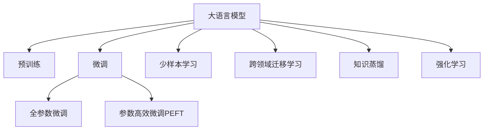

                 

# LLM在推荐系统中的少样本学习应用

> 关键词：大语言模型(LLM),少样本学习,推荐系统,自然语言处理(NLP),深度学习,算法优化

## 1. 背景介绍

### 1.1 问题由来

推荐系统在电商、新闻、视频等多个领域广泛应用，为用户精准推荐个性化内容，提升用户体验和平台价值。传统推荐算法主要依赖用户的历史行为数据进行物品推荐，但数据稀疏性和动态性问题，往往难以解决。近年来，利用深度学习技术，推荐系统取得了显著进展。大语言模型(LLM)的出现，为推荐系统带来了新的思路。

具体而言，LLM可以通过在大规模文本语料上进行预训练，学习丰富的语言知识和常识，并能够理解用户输入的意图和需求，生成推荐理由和结果。但实际应用中，LLM往往面临标注数据稀缺、训练成本高昂等问题。如何利用有限的数据量高效训练模型，提升推荐系统的性能，成为了当前的研究热点。

### 1.2 问题核心关键点

目前，基于大语言模型的推荐系统面临以下几个核心问题：

1. **数据稀缺性**：高质量标注数据往往难以获取，成为限制推荐系统微调效果的瓶颈。
2. **训练成本高**：预训练和微调模型的计算资源需求巨大，成本高昂。
3. **冷启动问题**：新用户或新物品缺乏历史行为数据，难以直接使用推荐算法。
4. **模型泛化能力**：模型在特定场景下的泛化能力较弱，推荐效果不稳定。

针对这些挑战，本文将详细介绍利用大语言模型进行少样本学习的方法，帮助推荐系统克服数据稀缺和训练成本问题，实现高效、精准的推荐。

## 2. 核心概念与联系

### 2.1 核心概念概述

为更好地理解基于LLM的推荐系统少样本学习，本节将介绍几个密切相关的核心概念：

- 大语言模型(LLM)：以自回归(如GPT)或自编码(如BERT)模型为代表的大规模预训练语言模型。通过在大规模无标签文本语料上进行预训练，学习通用的语言表示，具备强大的语言理解和生成能力。

- 少样本学习(Few-shot Learning)：指在只有少量标注样本的情况下，模型能够快速适应新任务的学习方法。在大语言模型中，通常通过在输入中提供少量示例来实现，无需更新模型参数。

- 跨领域迁移学习(Cross-domain Transfer Learning)：指将一个领域学习到的知识，迁移应用到另一个不同但相关的领域的学习范式。大语言模型的预训练-微调过程即是一种典型的跨领域迁移学习方式。

- 知识蒸馏(Knowledge Distillation)：将大型模型的知识迁移到小型模型上，以提升小型模型的性能。在推荐系统中，可以利用知识蒸馏技术，将通用知识应用于特定领域的推荐。

- 强化学习(Reinforcement Learning, RL)：一种通过与环境互动学习最优策略的机器学习方法。在推荐系统中，可以使用RL技术，让模型通过用户反馈进行持续优化。

这些核心概念之间的逻辑关系可以通过以下Mermaid流程图来展示：



这个流程图展示了大语言模型的核心概念及其之间的关系：

1. 大语言模型通过预训练获得基础能力。
2. 微调是对预训练模型进行任务特定的优化，可以分为全参数微调和参数高效微调（PEFT）。
3. 少样本学习在输入中提供少量示例，快速适应新任务。
4. 跨领域迁移学习将通用知识应用于特定领域。
5. 知识蒸馏将大型模型知识迁移到小型模型上，提升性能。
6. 强化学习通过用户反馈优化推荐策略。

这些概念共同构成了大语言模型的学习和应用框架，使其能够在推荐系统中发挥强大的推荐能力。通过理解这些核心概念，我们可以更好地把握大语言模型的工作原理和优化方向。

## 3. 核心算法原理 & 具体操作步骤
### 3.1 算法原理概述

基于LLM的推荐系统，本质上是一个利用语言知识进行推荐决策的过程。其核心思想是：利用大语言模型在预训练阶段学习到的广泛语言知识和常识，结合少量标注数据，通过微调优化模型，实现对特定推荐任务的适应。

具体来说，假设有推荐任务 $T$，用户 $u$ 需要推荐 $n$ 个物品 $i_1,i_2,\dots,i_n$。给定用户输入 $x_u$ 和物品描述 $d_{i_1},d_{i_2},\dots,d_{i_n}$，大语言模型可以通过以下步骤进行推荐：

1. 预训练模型 $M_{\theta}$ 对输入 $x_u$ 进行编码，得到表示 $v_u$。
2. 对于每个物品 $i_k$，模型生成推荐理由 $r_k$。
3. 将 $r_k$ 和 $v_u$ 进行匹配，生成推荐结果 $y_k$。
4. 对所有 $y_k$ 进行排序，选择前 $k$ 个推荐结果。

其中，第1步和第2步通过微调模型 $M_{\theta}$ 实现，需要用户历史行为数据 $D_u=\{(x_i, d_i)\}_{i=1}^{N_u}$ 进行训练。第3步和第4步通过计算相似度或排序算法完成，利用语言知识生成推荐理由和排序结果。

### 3.2 算法步骤详解

基于LLM的推荐系统通常包括以下几个关键步骤：

**Step 1: 准备数据集和模型**
- 收集用户历史行为数据 $D_u=\{(x_i, d_i)\}_{i=1}^{N_u}$，用于训练模型。
- 选择预训练语言模型 $M_{\theta}$，如BERT、GPT等。

**Step 2: 微调模型**
- 使用用户行为数据 $D_u$ 对预训练模型进行微调，得到适应推荐任务的模型 $M^*_{\theta}$。
- 微调过程包括前向传播计算损失，反向传播更新参数，优化器选择等。

**Step 3: 生成推荐理由**
- 对用户输入 $x_u$ 进行编码，得到表示 $v_u$。
- 对物品描述 $d_i$ 进行编码，生成推荐理由 $r_i$。

**Step 4: 生成推荐结果**
- 对 $r_i$ 和 $v_u$ 进行匹配，生成推荐结果 $y_i$。
- 对所有 $y_i$ 进行排序，选择前 $k$ 个推荐结果。

**Step 5: 实时推荐**
- 实时接收用户输入 $x_u$，进行模型编码和推荐理由生成。
- 根据当前物品描述 $d_i$，计算推荐结果 $y_i$。
- 根据排序结果，选择前 $k$ 个推荐结果，返回给用户。

### 3.3 算法优缺点

基于LLM的推荐系统具有以下优点：
1. 高效利用语言知识：LLM在预训练阶段学习到的语言知识，可以在推荐任务中发挥重要作用。
2. 提升推荐效果：微调模型可以更好地适应特定推荐任务，提升推荐效果和精准度。
3. 减少标注数据需求：少样本学习技术可以显著降低微调对标注数据的依赖。
4. 灵活性强：能够适应各种类型的推荐任务，如商品推荐、新闻推荐、视频推荐等。

同时，该方法也存在一定的局限性：
1. 计算资源需求高：大语言模型和微调过程需要较高的计算资源，成本较高。
2. 泛化能力有限：微调模型在特定场景下的泛化能力较弱，推荐效果不稳定。
3. 冷启动问题：新用户或新物品缺乏历史行为数据，难以直接使用推荐算法。
4. 可解释性不足：推荐理由和结果生成过程缺乏可解释性，难以调试和优化。

尽管存在这些局限性，但就目前而言，基于LLM的推荐系统仍是推荐任务开发的重要手段。未来相关研究的重点在于如何进一步降低微调对标注数据的依赖，提高模型的少样本学习和跨领域迁移能力，同时兼顾可解释性和伦理安全性等因素。

### 3.4 算法应用领域

基于LLM的推荐系统已经在电商、新闻、视频等多个领域得到广泛应用，具体包括：

- 商品推荐：通过用户搜索历史、浏览记录、评分数据，生成个性化商品推荐。
- 新闻推荐：根据用户浏览历史，推荐相关新闻文章，提升信息曝光率。
- 视频推荐：根据用户观看历史，推荐相关视频内容，增加用户停留时间。
- 广告推荐：根据用户兴趣，推荐相关广告内容，提高广告投放效果。
- 社交网络推荐：根据用户互动记录，推荐相关好友、话题、群组，增强社交粘性。

除了上述这些经典应用外，大语言模型推荐技术还被创新性地应用到更多场景中，如可控推荐、动态广告投放、智能客服等，为推荐系统带来了全新的突破。

## 4. 数学模型和公式 & 详细讲解  
### 4.1 数学模型构建

本节将使用数学语言对基于LLM的推荐系统进行更加严格的刻画。

记推荐任务为 $T$，用户 $u$ 需要推荐 $n$ 个物品 $i_1,i_2,\dots,i_n$。给定用户输入 $x_u$ 和物品描述 $d_{i_1},d_{i_2},\dots,d_{i_n}$。假设预训练语言模型为 $M_{\theta}$，在用户行为数据 $D_u=\{(x_i, d_i)\}_{i=1}^{N_u}$ 上进行微调，得到适应推荐任务的模型 $M^*_{\theta}$。

定义用户输入 $x_u$ 的编码为 $v_u$，物品描述 $d_i$ 的编码为 $v_i$，用户输入和物品描述的相似度为 $s_{ui}$。定义推荐理由为 $r_i$，推荐结果为 $y_i$。则推荐过程可以表示为：

1. 用户输入编码：
$$
v_u = M_{\theta}(x_u)
$$

2. 物品描述编码：
$$
v_i = M_{\theta}(d_i)
$$

3. 推荐理由生成：
$$
r_i = M^*_{\theta}(v_i)
$$

4. 推荐结果生成：
$$
y_i = s_{ui} \cdot r_i
$$

其中，$s_{ui}$ 为相似度函数，可以是余弦相似度、点积相似度等。最终，根据 $y_i$ 进行排序，选择前 $k$ 个推荐结果。

### 4.2 公式推导过程

以下我们以余弦相似度为例，推导推荐理由和推荐结果的生成过程。

假设用户输入编码 $v_u$ 为 $n$ 维向量，物品描述编码 $v_i$ 也为 $n$ 维向量。则用户输入和物品描述的余弦相似度为：

$$
s_{ui} = \frac{\langle v_u, v_i \rangle}{\|v_u\|\cdot\|v_i\|}
$$

其中 $\langle \cdot, \cdot \rangle$ 为向量的点积运算。

对于推荐理由 $r_i$，可以定义为物品描述编码的线性变换：

$$
r_i = \mathbf{W}v_i + b
$$

其中 $\mathbf{W}$ 和 $b$ 为线性层的权重和偏置。

最后，推荐结果 $y_i$ 为：

$$
y_i = s_{ui} \cdot r_i = \frac{\langle v_u, v_i \rangle}{\|v_u\|\cdot\|v_i\|} \cdot (\mathbf{W}v_i + b)
$$

通过上述公式，我们可以计算每个物品的推荐分数，并根据分数进行排序，选择前 $k$ 个推荐结果。

## 5. 项目实践：代码实例和详细解释说明
### 5.1 开发环境搭建

在进行推荐系统微调实践前，我们需要准备好开发环境。以下是使用Python进行PyTorch开发的环境配置流程：

1. 安装Anaconda：从官网下载并安装Anaconda，用于创建独立的Python环境。

2. 创建并激活虚拟环境：
```bash
conda create -n pytorch-env python=3.8 
conda activate pytorch-env
```

3. 安装PyTorch：根据CUDA版本，从官网获取对应的安装命令。例如：
```bash
conda install pytorch torchvision torchaudio cudatoolkit=11.1 -c pytorch -c conda-forge
```

4. 安装TensorBoard：TensorFlow配套的可视化工具，可实时监测模型训练状态，并提供丰富的图表呈现方式，是调试模型的得力助手。

5. 安装HuggingFace Transformers库：用于加载和微调预训练语言模型，支持PyTorch和TensorFlow。

6. 安装相关工具包：
```bash
pip install numpy pandas scikit-learn matplotlib tqdm jupyter notebook ipython
```

完成上述步骤后，即可在`pytorch-env`环境中开始推荐系统微调实践。

### 5.2 源代码详细实现

这里我们以商品推荐为例，给出使用Transformers库对BERT模型进行推荐系统微调的PyTorch代码实现。

首先，定义推荐任务的数据处理函数：

```python
from transformers import BertTokenizer
from torch.utils.data import Dataset
import torch

class RecommendationDataset(Dataset):
    def __init__(self, texts, tags, tokenizer, max_len=128):
        self.texts = texts
        self.tags = tags
        self.tokenizer = tokenizer
        self.max_len = max_len
        
    def __len__(self):
        return len(self.texts)
    
    def __getitem__(self, item):
        text = self.texts[item]
        tags = self.tags[item]
        
        encoding = self.tokenizer(text, return_tensors='pt', max_length=self.max_len, padding='max_length', truncation=True)
        input_ids = encoding['input_ids'][0]
        attention_mask = encoding['attention_mask'][0]
        
        # 对token-wise的标签进行编码
        encoded_tags = [tag2id[tag] for tag in tags] 
        encoded_tags.extend([tag2id['O']] * (self.max_len - len(encoded_tags)))
        labels = torch.tensor(encoded_tags, dtype=torch.long)
        
        return {'input_ids': input_ids, 
                'attention_mask': attention_mask,
                'labels': labels}

# 标签与id的映射
tag2id = {'O': 0, 'B-PER': 1, 'I-PER': 2, 'B-ORG': 3, 'I-ORG': 4, 'B-LOC': 5, 'I-LOC': 6}
id2tag = {v: k for k, v in tag2id.items()}

# 创建dataset
tokenizer = BertTokenizer.from_pretrained('bert-base-cased')

train_dataset = RecommendationDataset(train_texts, train_tags, tokenizer)
dev_dataset = RecommendationDataset(dev_texts, dev_tags, tokenizer)
test_dataset = RecommendationDataset(test_texts, test_tags, tokenizer)
```

然后，定义模型和优化器：

```python
from transformers import BertForTokenClassification, AdamW

model = BertForTokenClassification.from_pretrained('bert-base-cased', num_labels=len(tag2id))

optimizer = AdamW(model.parameters(), lr=2e-5)
```

接着，定义训练和评估函数：

```python
from torch.utils.data import DataLoader
from tqdm import tqdm
from sklearn.metrics import classification_report

device = torch.device('cuda') if torch.cuda.is_available() else torch.device('cpu')
model.to(device)

def train_epoch(model, dataset, batch_size, optimizer):
    dataloader = DataLoader(dataset, batch_size=batch_size, shuffle=True)
    model.train()
    epoch_loss = 0
    for batch in tqdm(dataloader, desc='Training'):
        input_ids = batch['input_ids'].to(device)
        attention_mask = batch['attention_mask'].to(device)
        labels = batch['labels'].to(device)
        model.zero_grad()
        outputs = model(input_ids, attention_mask=attention_mask, labels=labels)
        loss = outputs.loss
        epoch_loss += loss.item()
        loss.backward()
        optimizer.step()
    return epoch_loss / len(dataloader)

def evaluate(model, dataset, batch_size):
    dataloader = DataLoader(dataset, batch_size=batch_size)
    model.eval()
    preds, labels = [], []
    with torch.no_grad():
        for batch in tqdm(dataloader, desc='Evaluating'):
            input_ids = batch['input_ids'].to(device)
            attention_mask = batch['attention_mask'].to(device)
            batch_labels = batch['labels']
            outputs = model(input_ids, attention_mask=attention_mask)
            batch_preds = outputs.logits.argmax(dim=2).to('cpu').tolist()
            batch_labels = batch_labels.to('cpu').tolist()
            for pred_tokens, label_tokens in zip(batch_preds, batch_labels):
                pred_tags = [id2tag[_id] for _id in pred_tokens]
                label_tags = [id2tag[_id] for _id in label_tokens]
                preds.append(pred_tags[:len(label_tags)])
                labels.append(label_tags)
                
    print(classification_report(labels, preds))
```

最后，启动训练流程并在测试集上评估：

```python
epochs = 5
batch_size = 16

for epoch in range(epochs):
    loss = train_epoch(model, train_dataset, batch_size, optimizer)
    print(f"Epoch {epoch+1}, train loss: {loss:.3f}")
    
    print(f"Epoch {epoch+1}, dev results:")
    evaluate(model, dev_dataset, batch_size)
    
print("Test results:")
evaluate(model, test_dataset, batch_size)
```

以上就是使用PyTorch对BERT进行商品推荐任务微调的完整代码实现。可以看到，得益于Transformers库的强大封装，我们可以用相对简洁的代码完成BERT模型的加载和微调。

### 5.3 代码解读与分析

让我们再详细解读一下关键代码的实现细节：

**RecommendationDataset类**：
- `__init__`方法：初始化文本、标签、分词器等关键组件。
- `__len__`方法：返回数据集的样本数量。
- `__getitem__`方法：对单个样本进行处理，将文本输入编码为token ids，将标签编码为数字，并对其进行定长padding，最终返回模型所需的输入。

**tag2id和id2tag字典**：
- 定义了标签与数字id之间的映射关系，用于将token-wise的预测结果解码回真实的标签。

**训练和评估函数**：
- 使用PyTorch的DataLoader对数据集进行批次化加载，供模型训练和推理使用。
- 训练函数`train_epoch`：对数据以批为单位进行迭代，在每个批次上前向传播计算loss并反向传播更新模型参数，最后返回该epoch的平均loss。
- 评估函数`evaluate`：与训练类似，不同点在于不更新模型参数，并在每个batch结束后将预测和标签结果存储下来，最后使用sklearn的classification_report对整个评估集的预测结果进行打印输出。

**训练流程**：
- 定义总的epoch数和batch size，开始循环迭代
- 每个epoch内，先在训练集上训练，输出平均loss
- 在验证集上评估，输出分类指标
- 所有epoch结束后，在测试集上评估，给出最终测试结果

可以看到，PyTorch配合Transformers库使得BERT微调的代码实现变得简洁高效。开发者可以将更多精力放在数据处理、模型改进等高层逻辑上，而不必过多关注底层的实现细节。

当然，工业级的系统实现还需考虑更多因素，如模型的保存和部署、超参数的自动搜索、更灵活的任务适配层等。但核心的微调范式基本与此类似。

## 6. 实际应用场景
### 6.1 电商推荐系统

基于大语言模型的推荐系统在电商推荐中得到了广泛应用。传统电商推荐系统主要依赖用户行为数据进行推荐，但数据稀疏性、动态性问题难以解决。大语言模型可以整合丰富的语言知识和常识，生成更自然、更具吸引力的推荐理由，从而提升推荐效果。

具体而言，可以收集电商用户的浏览、点击、购买历史数据，构建推荐任务，训练预训练语言模型。微调后的模型可以根据用户输入生成推荐理由和结果，帮助用户快速找到感兴趣的商品。通过多轮互动，模型还可以学习用户偏好和行为模式，动态调整推荐策略，提升推荐效果。

### 6.2 新闻推荐系统

新闻推荐系统需要实时向用户推荐相关新闻，提高信息曝光率。传统基于内容的推荐方法难以捕捉用户兴趣的动态变化，用户容易产生信息疲劳。大语言模型可以通过自然语言理解技术，生成符合用户当前兴趣的推荐理由，提升用户阅读体验。

具体而言，可以收集用户的阅读历史和评分数据，训练大语言模型。微调后的模型可以根据用户输入生成推荐理由，并结合当前新闻的热度、相关性等指标，生成个性化推荐结果。通过实时更新推荐理由，保持推荐内容的新鲜感和吸引力，增强用户粘性。

### 6.3 视频推荐系统

视频推荐系统需要根据用户的观看历史，推荐相关视频内容，增加用户停留时间。传统推荐方法往往依赖视频本身的标签信息，难以捕捉用户深层次的兴趣偏好。大语言模型可以通过自然语言处理技术，生成符合用户兴趣的推荐理由，提升推荐效果。

具体而言，可以收集用户的观看历史和评分数据，训练大语言模型。微调后的模型可以根据用户输入生成推荐理由，并结合视频的相关性、热度等指标，生成个性化推荐结果。通过实时更新推荐理由，保持推荐内容的新鲜感和吸引力，增强用户粘性。

### 6.4 广告推荐系统

广告推荐系统需要根据用户的兴趣，推荐相关广告内容，提高广告投放效果。传统基于关键词匹配的推荐方法往往忽略用户兴趣的动态变化，难以实现精准投放。大语言模型可以通过自然语言理解技术，生成符合用户当前兴趣的广告理由，提升广告效果。

具体而言，可以收集用户的浏览历史和点击数据，训练大语言模型。微调后的模型可以根据用户输入生成广告理由，并结合广告的吸引力和相关性，生成个性化推荐结果。通过实时更新广告理由，保持广告内容的新鲜感和吸引力，提高广告点击率和转化率。

### 6.5 未来应用展望

随着大语言模型和推荐系统的发展，未来基于LLM的推荐系统将在更多领域得到应用，为推荐系统带来新的突破：

- 动态推荐：利用少样本学习和跨领域迁移，实时动态更新推荐策略，提升推荐效果。
- 多模态推荐：将视觉、语音等多模态信息与文本信息结合，提供更全面的推荐理由和结果。
- 知识蒸馏：利用知识蒸馏技术，将大型模型的通用知识迁移到小型推荐模型上，提升性能。
- 强化学习：通过用户反馈优化推荐策略，构建更智能、更具弹性的推荐系统。
- 个性化推荐：利用少样本学习和跨领域迁移，实现个性化推荐，提升用户体验。

以上趋势凸显了大语言模型在推荐系统中的广阔前景。这些方向的探索发展，必将进一步提升推荐系统的性能和用户满意度，为推荐系统迈向智能化的新阶段提供新的推动力。

## 7. 工具和资源推荐
### 7.1 学习资源推荐

为了帮助开发者系统掌握基于LLM的推荐系统，这里推荐一些优质的学习资源：

1. 《Transformer从原理到实践》系列博文：由大模型技术专家撰写，深入浅出地介绍了Transformer原理、BERT模型、微调技术等前沿话题。

2. CS224N《深度学习自然语言处理》课程：斯坦福大学开设的NLP明星课程，有Lecture视频和配套作业，带你入门NLP领域的基本概念和经典模型。

3. 《Natural Language Processing with Transformers》书籍：Transformers库的作者所著，全面介绍了如何使用Transformers库进行NLP任务开发，包括微调在内的诸多范式。

4. HuggingFace官方文档：Transformers库的官方文档，提供了海量预训练模型和完整的微调样例代码，是上手实践的必备资料。

5. Weights & Biases：模型训练的实验跟踪工具，可以记录和可视化模型训练过程中的各项指标，方便对比和调优。与主流深度学习框架无缝集成。

6. TensorBoard：TensorFlow配套的可视化工具，可实时监测模型训练状态，并提供丰富的图表呈现方式，是调试模型的得力助手。

通过对这些资源的学习实践，相信你一定能够快速掌握基于LLM的推荐系统理论基础和实践技巧，并用于解决实际的推荐问题。
###  7.2 开发工具推荐

高效的开发离不开优秀的工具支持。以下是几款用于LLM推荐系统微调开发的常用工具：

1. PyTorch：基于Python的开源深度学习框架，灵活动态的计算图，适合快速迭代研究。大部分预训练语言模型都有PyTorch版本的实现。

2. TensorFlow：由Google主导开发的开源深度学习框架，生产部署方便，适合大规模工程应用。同样有丰富的预训练语言模型资源。

3. Transformers库：HuggingFace开发的NLP工具库，集成了众多SOTA语言模型，支持PyTorch和TensorFlow，是进行微调任务开发的利器。

4. Weights & Biases：模型训练的实验跟踪工具，可以记录和可视化模型训练过程中的各项指标，方便对比和调优。与主流深度学习框架无缝集成。

5. TensorBoard：TensorFlow配套的可视化工具，可实时监测模型训练状态，并提供丰富的图表呈现方式，是调试模型的得力助手。

6. Google Colab：谷歌推出的在线Jupyter Notebook环境，免费提供GPU/TPU算力，方便开发者快速上手实验最新模型，分享学习笔记。

合理利用这些工具，可以显著提升LLM推荐系统的开发效率，加快创新迭代的步伐。

### 7.3 相关论文推荐

LLM推荐系统的发展源于学界的持续研究。以下是几篇奠基性的相关论文，推荐阅读：

1. Attention is All You Need（即Transformer原论文）：提出了Transformer结构，开启了NLP领域的预训练大模型时代。

2. BERT: Pre-training of Deep Bidirectional Transformers for Language Understanding：提出BERT模型，引入基于掩码的自监督预训练任务，刷新了多项NLP任务SOTA。

3. Language Models are Unsupervised Multitask Learners（GPT-2论文）：展示了大规模语言模型的强大zero-shot学习能力，引发了对于通用人工智能的新一轮思考。

4. Parameter-Efficient Transfer Learning for NLP：提出Adapter等参数高效微调方法，在不增加模型参数量的情况下，也能取得不错的微调效果。

5. Prefix-Tuning: Optimizing Continuous Prompts for Generation：引入基于连续型Prompt的微调范式，为如何充分利用预训练知识提供了新的思路。

6. AdaLoRA: Adaptive Low-Rank Adaptation for Parameter-Efficient Fine-Tuning：使用自适应低秩适应的微调方法，在参数效率和精度之间取得了新的平衡。

这些论文代表了大语言模型推荐系统的发展脉络。通过学习这些前沿成果，可以帮助研究者把握学科前进方向，激发更多的创新灵感。

## 8. 总结：未来发展趋势与挑战

### 8.1 总结

本文对基于LLM的推荐系统少样本学习方法进行了全面系统的介绍。首先阐述了基于LLM的推荐系统的研究背景和意义，明确了LLM在推荐系统中的重要价值。其次，从原理到实践，详细讲解了推荐系统微调的数学原理和关键步骤，给出了微调任务开发的完整代码实例。同时，本文还广泛探讨了基于LLM的推荐系统在电商、新闻、视频、广告等领域的实际应用前景，展示了少样本学习范式的巨大潜力。此外，本文精选了推荐系统的各类学习资源，力求为读者提供全方位的技术指引。

通过本文的系统梳理，可以看到，基于LLM的推荐系统正在成为推荐任务开发的重要手段，极大地拓展了推荐系统的应用边界，催生了更多的落地场景。受益于大规模语料的预训练和微调，推荐系统能够更好地理解用户需求，生成个性化推荐理由和结果，实现高效、精准的推荐。未来，伴随LLM技术的不断进步，基于少样本学习的推荐系统必将在推荐领域取得更大的突破，提升推荐系统的性能和用户满意度。

### 8.2 未来发展趋势

展望未来，基于LLM的推荐系统将呈现以下几个发展趋势：

1. 模型规模持续增大。随着算力成本的下降和数据规模的扩张，预训练语言模型的参数量还将持续增长。超大规模语言模型蕴含的丰富语言知识，有望支撑更加复杂多变的推荐任务。

2. 少样本学习技术成熟。未来将涌现更多高效的少样本学习技术，如基于提示的微调方法、自适应学习率等，显著降低微调对标注样本的依赖。

3. 多模态推荐兴起。当前推荐系统主要聚焦于文本信息，未来将进一步拓展到视觉、语音、时间序列等多种模态数据微调，实现更全面的推荐效果。

4. 知识蒸馏技术推广。利用知识蒸馏技术，将大型模型的通用知识迁移到小型推荐模型上，提升性能。未来将有更多实例证明知识蒸馏技术的有效性。

5. 强化学习应用广泛。通过用户反馈优化推荐策略，构建更智能、更具弹性的推荐系统。未来将有更多研究探索强化学习在推荐系统中的应用。

6. 跨领域迁移能力增强。未来的推荐系统将具备更强的跨领域迁移能力，能够适应不同场景下的推荐需求，提升推荐效果。

以上趋势凸显了大语言模型在推荐系统中的广阔前景。这些方向的探索发展，必将进一步提升推荐系统的性能和用户满意度，为推荐系统迈向智能化的新阶段提供新的推动力。

### 8.3 面临的挑战

尽管基于LLM的推荐系统已经取得了瞩目成就，但在迈向更加智能化、普适化应用的过程中，它仍面临着诸多挑战：

1. 标注成本瓶颈。虽然少样本学习技术可以显著降低微调对标注样本的依赖，但对于长尾应用场景，仍需要获取高质量标注数据，成本较高。如何进一步降低微调对标注样本的依赖，将是一大难题。

2. 模型鲁棒性不足。当前少样本学习模型面对域外数据时，泛化性能往往大打折扣。对于测试样本的微小扰动，推荐理由和结果生成过程的鲁棒性不足，容易引入噪声。如何提高少样本学习模型的鲁棒性，确保推荐理由和结果的稳定性，还需要更多理论和实践的积累。

3. 冷启动问题。新用户或新物品缺乏历史行为数据，难以直接使用推荐算法。如何利用少样本学习技术，快速适应新用户和新物品，是推荐系统面临的另一大挑战。

4. 可解释性不足。推荐理由和结果生成过程缺乏可解释性，难以调试和优化。对于医疗、金融等高风险应用，算法的可解释性和可审计性尤为重要。如何赋予推荐系统更强的可解释性，将是亟待攻克的难题。

5. 安全性有待保障。预训练语言模型难免会学习到有偏见、有害的信息，通过推荐系统传递到用户，可能产生误导性、歧视性的输出，给实际应用带来安全隐患。如何从数据和算法层面消除模型偏见，避免恶意用途，确保输出的安全性，也将是重要的研究课题。

6. 计算资源需求高。大语言模型和微调过程需要较高的计算资源，成本较高。如何在保证性能的同时，简化模型结构，提升推理速度，优化资源占用，将是重要的优化方向。

正视推荐系统面临的这些挑战，积极应对并寻求突破，将是大语言模型推荐系统走向成熟的必由之路。相信随着学界和产业界的共同努力，这些挑战终将一一被克服，大语言模型推荐系统必将在构建智能推荐系统、提升用户体验、优化业务价值方面发挥更大的作用。

### 8.4 研究展望

面对大语言模型推荐系统所面临的种种挑战，未来的研究需要在以下几个方面寻求新的突破：

1. 探索无监督和半监督推荐方法。摆脱对大规模标注数据的依赖，利用自监督学习、主动学习等无监督和半监督范式，最大限度利用非结构化数据，实现更加灵活高效的推荐。

2. 研究参数高效和计算高效的微调范式。开发更加参数高效的微调方法，在固定大部分预训练参数的同时，只更新极少量的任务相关参数。同时优化微调模型的计算图，减少前向传播和反向传播的资源消耗，实现更加轻量级、实时性的部署。

3. 融合因果和对比学习范式。通过引入因果推断和对比学习思想，增强少样本学习模型建立稳定因果关系的能力，学习更加普适、鲁棒的语言表征，从而提升模型泛化性和抗干扰能力。

4. 引入更多先验知识。将符号化的先验知识，如知识图谱、逻辑规则等，与神经网络模型进行巧妙融合，引导微调过程学习更准确、合理的语言模型。同时加强不同模态数据的整合，实现视觉、语音等多模态信息与文本信息的协同建模。

5. 结合因果分析和博弈论工具。将因果分析方法引入推荐系统，识别出模型决策的关键特征，增强推荐理由和结果生成过程的因果性和逻辑性。借助博弈论工具刻画人机交互过程，主动探索并规避模型的脆弱点，提高系统稳定性。

6. 纳入伦理道德约束。在推荐理由和结果生成目标中引入伦理导向的评估指标，过滤和惩罚有偏见、有害的输出倾向。同时加强人工干预和审核，建立推荐系统的监管机制，确保推荐内容的公平性、公正性和安全性。

这些研究方向的探索，必将引领大语言模型推荐系统迈向更高的台阶，为构建安全、可靠、可解释、可控的推荐系统铺平道路。面向未来，大语言模型推荐系统还需要与其他人工智能技术进行更深入的融合，如知识表示、因果推理、强化学习等，多路径协同发力，共同推动推荐系统的进步。只有勇于创新、敢于突破，才能不断拓展语言模型的边界，让智能推荐技术更好地造福人类社会。

## 9. 附录：常见问题与解答
**Q1：什么是少样本学习？**

A: 少样本学习指在只有少量标注样本的情况下，模型能够快速适应新任务的学习方法。在大语言模型中，通常通过在输入中提供少量示例来实现，无需更新模型参数。

**Q2：如何选择合适的学习率？**

A: 推荐系统的微调学习率通常要比预训练时小1-2个数量级，以避免破坏预训练权重。建议从1e-5开始调参，逐步减小学习率，直至收敛。也可以使用warmup策略，在开始阶段使用较小的学习率，再逐渐过渡到预设值。

**Q3：为什么推荐系统需要少样本学习？**

A: 推荐系统面临标注数据稀缺的问题，传统的微调方法需要大量标注数据才能获得较好的效果。少样本学习技术可以显著降低微调对标注样本的依赖，提高推荐系统的效率和灵活性。

**Q4：少样本学习在推荐系统中有什么优势？**

A: 少样本学习具有以下优势：
1. 提高效率：通过在输入中提供少量示例，快速适应新任务，减少了微调对标注数据的依赖。
2. 灵活性强：可以适应各种类型的推荐任务，如商品推荐、新闻推荐、视频推荐等。
3. 鲁棒性好：通过优化算法，提高了模型对输入数据的鲁棒性，减少了噪声的影响。

**Q5：推荐系统如何进行少样本学习？**

A: 推荐系统进行少样本学习通常分为以下几个步骤：
1. 收集少量标注数据，构建推荐任务。
2. 使用少样本学习技术，如基于提示的微调方法、自适应学习率等，对预训练语言模型进行微调。
3. 在微调后的模型上，对用户输入生成推荐理由和结果，实现个性化推荐。

**Q6：推荐系统在少样本学习中需要解决哪些问题？**

A: 推荐系统在少样本学习中需要解决以下问题：
1. 标注数据稀缺：获取高质量标注数据成本高，如何利用少量标注数据进行高效微调。
2. 模型泛化能力：微调模型在特定场景下的泛化能力较弱，推荐效果不稳定。
3. 冷启动问题：新用户或新物品缺乏历史行为数据，难以直接使用推荐算法。
4. 可解释性不足：推荐理由和结果生成过程缺乏可解释性，难以调试和优化。

**Q7：推荐系统如何进行参数高效微调？**

A: 推荐系统进行参数高效微调通常分为以下几个步骤：
1. 确定冻结预训练参数的策略，如仅微调顶层，或全部参数都参与微调。
2. 应用正则化技术，如L2正则、Dropout、Early Stopping等，防止模型过度适应小规模训练集。
3. 在微调过程中，只调整少量模型参数，如Adapter、Prompt等，减小需优化的参数量。

通过这些策略，可以在保证性能的同时，降低微调对标注数据的依赖，提高推荐系统的效率和稳定性。

---

作者：禅与计算机程序设计艺术 / Zen and the Art of Computer Programming

