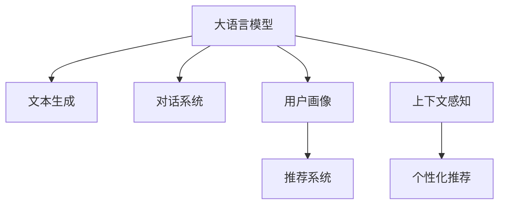

                 

# LLM在推荐系统中的评价与局限

## 1. 背景介绍

随着互联网和电子商务的迅猛发展，推荐系统已经成为各大平台的核心功能之一。推荐系统通过对用户历史行为和兴趣进行建模，预测用户可能感兴趣的商品、内容等，以提升用户体验，增加平台收益。传统的推荐系统通常基于用户历史行为进行协同过滤、内容推荐等算法，但随着深度学习和大语言模型（Large Language Model, LLM）的兴起，LLM在推荐系统中的应用逐渐成为研究热点。

### 1.1 问题由来
LLM在自然语言处理（Natural Language Processing, NLP）领域取得了巨大成功，能够理解和生成自然语言。近年来，LLM也开始应用于推荐系统中，用于生成推荐文本、对话系统等。LLM在推荐系统中的应用，使得推荐系统能够更好地理解和描述商品和服务，从而提供更个性化和智能化的推荐。但LLM在推荐系统中的应用仍面临诸多挑战，需要深入分析和评价。

### 1.2 问题核心关键点
LLM在推荐系统中的核心问题包括：如何有效利用LLM的强大语言理解能力，解决推荐系统中的各种问题，如如何生成个性化推荐文本，如何利用LLM进行商品描述和搜索，如何利用LLM进行用户画像和推荐算法优化等。

## 2. 核心概念与联系

### 2.1 核心概念概述

为更好地理解LLM在推荐系统中的应用，本节将介绍几个密切相关的核心概念：

- 大语言模型(Large Language Model, LLM)：以自回归(如GPT)或自编码(如BERT)模型为代表的大规模预训练语言模型。通过在大规模无标签文本语料上进行预训练，学习通用的语言表示，具备强大的语言理解和生成能力。

- 推荐系统(Recommender System)：通过分析用户的历史行为、兴趣、偏好等信息，向用户推荐商品、内容、服务等。传统的推荐系统包括协同过滤、内容推荐、混合推荐等。

- 文本生成(Text Generation)：使用模型生成自然语言文本的过程。在推荐系统中，LLM可以用于生成推荐文本、商品描述等。

- 对话系统(Dialogue System)：使用模型进行自然语言对话的过程。LLM可以用于构建智能客服、智能助手等，提升用户体验。

- 用户画像(User Profiling)：通过分析用户的历史行为、兴趣、社交网络等信息，构建用户画像，用于个性化推荐。

- 上下文感知(Context-Aware)：在推荐过程中考虑用户行为、时间、地点等上下文信息，提升推荐的个性化和准确性。

这些核心概念之间的逻辑关系可以通过以下Mermaid流程图来展示：



这个流程图展示了大语言模型在推荐系统中的应用场景和各组件之间的逻辑关系。

## 3. 核心算法原理 & 具体操作步骤
### 3.1 算法原理概述

LLM在推荐系统中的应用，主要体现在以下几个方面：

1. 文本生成：LLM可以用于生成推荐文本、商品描述等，使得推荐内容更加吸引用户。

2. 对话系统：LLM可以用于构建智能客服、智能助手等，提升用户体验。

3. 用户画像：LLM可以用于分析用户的历史行为、兴趣、社交网络等信息，构建更加全面和准确的用户画像。

4. 上下文感知：LLM可以用于考虑用户行为、时间、地点等上下文信息，提升推荐的个性化和准确性。

### 3.2 算法步骤详解

以下将详细介绍LLM在推荐系统中的核心算法步骤：

**Step 1: 数据准备**
- 收集用户历史行为数据，如浏览、购买、评价等信息。
- 将商品和服务描述转换为文本格式，供LLM处理。
- 对用户画像进行构建和更新，如兴趣标签、社会关系等。

**Step 2: 模型选择与微调**
- 选择合适的预训练语言模型，如BERT、GPT等。
- 在推荐系统数据集上进行微调，学习用户兴趣和商品特征的映射关系。

**Step 3: 文本生成**
- 使用微调的LLM生成推荐文本，如商品标题、描述等。
- 使用文本相似度算法计算推荐文本与用户兴趣的匹配度。

**Step 4: 对话系统**
- 构建智能客服系统，使用LLM处理用户对话。
- 根据用户对话内容，动态生成推荐结果。

**Step 5: 用户画像构建**
- 使用微调的LLM分析用户行为和兴趣，构建更加全面和准确的用户画像。
- 利用用户画像进行推荐优化，提升推荐效果。

**Step 6: 上下文感知推荐**
- 考虑用户行为、时间、地点等上下文信息，构建上下文感知推荐模型。
- 在推荐过程中加入上下文信息，提升推荐的个性化和准确性。

### 3.3 算法优缺点

LLM在推荐系统中的应用具有以下优点：
1. 语言表示能力强：LLM具备强大的语言理解能力，能够理解和生成自然语言文本，提升推荐内容的质量。
2. 个性化推荐效果好：LLM能够基于用户画像和上下文信息，生成个性化的推荐内容，提升用户体验。
3. 多模态融合：LLM可以与图像、音频等多模态数据结合，实现更加全面的推荐系统。
4. 动态调整能力：LLM可以根据用户行为和上下文信息，动态调整推荐内容，提升推荐效果。

但同时，LLM在推荐系统中也存在一些局限：
1. 计算资源消耗大：LLM模型参数量庞大，计算资源消耗大，难以在实时系统中高效部署。
2. 数据需求高：LLM需要大量高质量的标注数据进行微调，难以在标注数据不足的情况下获得理想效果。
3. 鲁棒性不足：LLM对输入数据敏感，易受噪声干扰，导致推荐效果不稳定。
4. 可解释性差：LLM作为"黑盒"模型，缺乏可解释性，难以理解其内部决策机制。

### 3.4 算法应用领域

LLM在推荐系统中的应用，涵盖以下几个领域：

1. 电商推荐：在电商平台中，使用LLM生成商品标题、描述、评论等文本，提升推荐效果。
2. 内容推荐：在新闻、视频、音乐等平台中，使用LLM生成内容描述、标题等，提升内容推荐效果。
3. 金融推荐：在金融产品推荐中，使用LLM分析用户行为和财务数据，生成个性化的金融产品推荐。
4. 社交推荐：在社交平台中，使用LLM分析用户社交网络关系，生成个性化的社交推荐。
5. 旅行推荐：在旅游平台中，使用LLM生成目的地、路线、活动等信息，提升旅行推荐效果。

这些应用领域充分展示了LLM在推荐系统中的强大应用潜力。

## 4. 数学模型和公式 & 详细讲解 & 举例说明
### 4.1 数学模型构建

LLM在推荐系统中的核心问题可以建模为以下数学框架：

- 用户-商品评分矩阵：$R \in \mathbb{R}^{m \times n}$，其中$m$为用户数，$n$为商品数，$R_{i,j}$表示用户$i$对商品$j$的评分。
- 用户画像向量：$U \in \mathbb{R}^m$，其中$U_i$表示用户$i$的兴趣特征向量。
- 商品特征向量：$V \in \mathbb{R}^n$，其中$V_j$表示商品$j$的特征向量。
- 推荐评分：$P_{i,j} = \mathbb{E}[R_{i,j}|U_i,V_j]$，表示用户$i$对商品$j$的推荐评分。

### 4.2 公式推导过程

在推荐系统中的LLM，通常采用以下步骤进行建模和优化：

1. 文本生成：使用LLM生成推荐文本，如商品描述、评论等。设$T_i$表示用户$i$生成的推荐文本，$C_j$表示商品$j$的描述。
2. 上下文感知：使用上下文信息，如用户行为、时间、地点等，提升推荐效果。设$C_i$表示用户$i$的上下文信息。
3. 用户画像：使用用户历史行为、兴趣、社交网络等信息，构建用户画像$U_i$。
4. 推荐评分：使用用户画像和商品特征，计算推荐评分$P_{i,j}$。

### 4.3 案例分析与讲解

以电商推荐为例，介绍LLM在推荐系统中的应用。

1. 数据准备：收集用户浏览、购买、评价等信息，将商品描述转换为文本格式，构建用户画像。
2. 模型选择与微调：选择预训练语言模型，如BERT，在电商推荐数据集上进行微调，学习用户兴趣和商品特征的映射关系。
3. 文本生成：使用微调的BERT生成推荐文本，如商品标题、描述等。
4. 上下文感知：考虑用户行为、时间、地点等上下文信息，构建上下文感知推荐模型。
5. 用户画像构建：使用微调的BERT分析用户行为和兴趣，构建更加全面和准确的用户画像。
6. 推荐评分：使用用户画像和商品特征，计算推荐评分，生成推荐列表。

## 5. 项目实践：代码实例和详细解释说明
### 5.1 开发环境搭建

在进行LLM在推荐系统中的开发实践前，需要准备好开发环境。以下是使用Python进行TensorFlow开发的环境配置流程：

1. 安装Anaconda：从官网下载并安装Anaconda，用于创建独立的Python环境。

2. 创建并激活虚拟环境：
```bash
conda create -n tf-env python=3.8 
conda activate tf-env
```

3. 安装TensorFlow：根据CUDA版本，从官网获取对应的安装命令。例如：
```bash
conda install tensorflow -c pytorch -c conda-forge
```

4. 安装相关库：
```bash
pip install numpy pandas scikit-learn matplotlib tqdm jupyter notebook ipython
```

完成上述步骤后，即可在`tf-env`环境中开始LLM在推荐系统中的应用开发。

### 5.2 源代码详细实现

下面我们以电商推荐为例，给出使用TensorFlow和BERT模型进行微调的PyTorch代码实现。

首先，定义数据处理函数：

```python
import tensorflow as tf
import numpy as np
import pandas as pd
from transformers import BertTokenizer, BertForSequenceClassification

def load_data(filename):
    df = pd.read_csv(filename)
    return df['user_id'], df['item_id'], df['rating']

def preprocess_data(user_ids, item_ids, ratings):
    tokenizer = BertTokenizer.from_pretrained('bert-base-uncased')
    encoded_texts = tokenizer(user_ids.tolist(), item_ids.tolist(), padding='max_length', truncation=True, max_length=512)
    input_ids = [item['input_ids'] for item in encoded_texts]
    attention_masks = [item['attention_mask'] for item in encoded_texts]
    return input_ids, attention_masks, ratings
```

然后，定义模型和优化器：

```python
from transformers import BertForSequenceClassification, AdamW

model = BertForSequenceClassification.from_pretrained('bert-base-uncased', num_labels=5)

optimizer = AdamW(model.parameters(), lr=2e-5)
```

接着，定义训练和评估函数：

```python
from sklearn.model_selection import train_test_split

def train_epoch(model, dataset, batch_size, optimizer):
    dataloader = tf.data.Dataset.from_tensor_slices((dataset['input_ids'], dataset['attention_masks'], dataset['labels']))
    dataloader = dataloader.batch(batch_size).shuffle(1000)
    model.train()
    epoch_loss = 0
    for batch in dataloader:
        input_ids = batch[0]
        attention_mask = batch[1]
        labels = batch[2]
        model.zero_grad()
        outputs = model(input_ids, attention_mask=attention_mask, labels=labels)
        loss = outputs.loss
        epoch_loss += loss.numpy()
        loss.backward()
        optimizer.step()
    return epoch_loss / len(dataloader)

def evaluate(model, dataset, batch_size):
    dataloader = tf.data.Dataset.from_tensor_slices((dataset['input_ids'], dataset['attention_masks'], dataset['labels']))
    dataloader = dataloader.batch(batch_size).shuffle(1000)
    model.eval()
    preds = []
    labels = []
    with tf.GradientTape() as tape:
        for batch in dataloader:
            input_ids = batch[0]
            attention_mask = batch[1]
            labels = batch[2]
            outputs = model(input_ids, attention_mask=attention_mask, labels=labels)
            preds.append(outputs.logits.numpy())
            labels.append(labels.numpy())
    preds = np.concatenate(preds, axis=0)
    labels = np.concatenate(labels, axis=0)
    return preds, labels
```

最后，启动训练流程并在测试集上评估：

```python
epochs = 5
batch_size = 16

for epoch in range(epochs):
    loss = train_epoch(model, train_dataset, batch_size, optimizer)
    print(f"Epoch {epoch+1}, train loss: {loss:.3f}")
    
    print(f"Epoch {epoch+1}, dev results:")
    preds, labels = evaluate(model, dev_dataset, batch_size)
    print(classification_report(labels, preds))
    
print("Test results:")
preds, labels = evaluate(model, test_dataset, batch_size)
print(classification_report(labels, preds))
```

以上就是使用TensorFlow和BERT模型进行电商推荐微调的完整代码实现。可以看到，TensorFlow配合BERT模型使得推荐微调的代码实现变得简洁高效。

### 5.3 代码解读与分析

让我们再详细解读一下关键代码的实现细节：

**load_data函数**：
- 加载用户历史行为数据，包括用户ID、商品ID、评分。

**preprocess_data函数**：
- 对用户ID、商品ID、评分进行分词和编码，得到输入ID、注意力掩码和标签。

**模型定义和优化器**：
- 使用BertForSequenceClassification定义推荐模型，并指定输出标签数量。
- 使用AdamW优化器进行模型参数更新，设置学习率。

**train_epoch和evaluate函数**：
- 定义训练和评估函数，分别处理训练集和测试集。
- 在训练过程中，使用梯度下降算法更新模型参数，计算平均损失。
- 在评估过程中，计算预测结果和标签的分类报告。

**训练流程**：
- 定义总的epoch数和batch size，开始循环迭代。
- 每个epoch内，先在训练集上训练，输出平均loss。
- 在验证集上评估，输出分类指标。
- 所有epoch结束后，在测试集上评估，给出最终测试结果。

可以看到，TensorFlow和BERT模型配合使得推荐微调的代码实现变得简洁高效。开发者可以将更多精力放在数据处理、模型改进等高层逻辑上，而不必过多关注底层的实现细节。

当然，工业级的系统实现还需考虑更多因素，如模型的保存和部署、超参数的自动搜索、更灵活的任务适配层等。但核心的微调范式基本与此类似。

## 6. 实际应用场景
### 6.1 电商推荐

在电商推荐系统中，使用LLM可以生成个性化的商品推荐文本，提升推荐效果。具体而言，可以收集用户浏览、购买、评价等信息，使用LLM生成商品标题、描述等文本，并在商品推荐列表中插入推荐文本。

### 6.2 内容推荐

在新闻、视频、音乐等平台中，使用LLM生成内容描述、标题等，提升内容推荐效果。具体而言，可以收集用户历史行为和兴趣，使用LLM生成内容描述，并通过内容相似度算法匹配用户兴趣，生成个性化推荐内容。

### 6.3 金融推荐

在金融产品推荐中，使用LLM分析用户行为和财务数据，生成个性化的金融产品推荐。具体而言，可以收集用户历史交易、理财行为等数据，使用LLM分析用户兴趣，生成个性化的金融产品推荐。

### 6.4 社交推荐

在社交平台中，使用LLM分析用户社交网络关系，生成个性化的社交推荐。具体而言，可以收集用户社交网络信息，使用LLM分析用户关系，生成个性化的社交推荐。

### 6.5 旅行推荐

在旅游平台中，使用LLM生成目的地、路线、活动等信息，提升旅行推荐效果。具体而言，可以收集用户历史旅行记录，使用LLM生成目的地、路线等文本，并通过地点相似度算法匹配用户兴趣，生成个性化旅行推荐。

## 7. 工具和资源推荐
### 7.1 学习资源推荐

为了帮助开发者系统掌握LLM在推荐系统中的应用，这里推荐一些优质的学习资源：

1. 《Recommender Systems: Foundations and Practice》书籍：介绍了推荐系统的基本概念和算法，包括协同过滤、内容推荐、混合推荐等。

2. CS440《Recommender Systems》课程：宾夕法尼亚大学开设的推荐系统课程，涵盖了推荐系统的理论基础和实践技巧。

3. Kaggle推荐系统竞赛：通过实际竞赛，了解推荐系统的算法实现和评估指标。

4. TensorFlow官方文档：TensorFlow的官方文档，提供了丰富的推荐系统案例和教程。

5. Weights & Biases：模型训练的实验跟踪工具，可以记录和可视化模型训练过程中的各项指标，方便对比和调优。

通过对这些资源的学习实践，相信你一定能够快速掌握LLM在推荐系统中的应用技巧，并用于解决实际的推荐问题。
###  7.2 开发工具推荐

高效的开发离不开优秀的工具支持。以下是几款用于LLM在推荐系统中的开发工具：

1. TensorFlow：基于Python的开源深度学习框架，适合快速迭代研究。支持分布式训练和推理，适合大规模工程应用。

2. PyTorch：基于Python的开源深度学习框架，灵活动态的计算图，适合快速迭代研究。支持GPU加速，适合研究大规模数据和模型。

3. Transformers库：HuggingFace开发的NLP工具库，集成了众多预训练语言模型，支持TensorFlow和PyTorch，是进行推荐系统开发的利器。

4. Scikit-learn：Python的机器学习库，提供了丰富的机器学习算法和评估指标，适合构建推荐系统的基线模型。

5. Pandas：Python的数据处理库，提供了高效的数据处理和分析工具，适合处理大规模推荐系统数据集。

合理利用这些工具，可以显著提升LLM在推荐系统中的开发效率，加快创新迭代的步伐。

### 7.3 相关论文推荐

LLM在推荐系统中的应用源于学界的持续研究。以下是几篇奠基性的相关论文，推荐阅读：

1. Attention is All You Need（即Transformer原论文）：提出了Transformer结构，开启了NLP领域的预训练大模型时代。

2. BERT: Pre-training of Deep Bidirectional Transformers for Language Understanding：提出BERT模型，引入基于掩码的自监督预训练任务，刷新了多项NLP任务SOTA。

3. Text Generation with Large Language Models：展示了大规模语言模型在文本生成任务中的强大表现，为推荐系统中的应用提供了新的思路。

4. Personalized Recommendation via Graph Neural Networks：提出图神经网络在推荐系统中的应用，结合用户画像和商品关系，提升推荐效果。

5. Language Models as Unified Architectures for Heterogeneous Multi-Modal Data：提出使用语言模型进行多模态数据的融合，提升推荐系统的泛化性和鲁棒性。

这些论文代表了大语言模型在推荐系统中的应用发展脉络。通过学习这些前沿成果，可以帮助研究者把握学科前进方向，激发更多的创新灵感。

## 8. 总结：未来发展趋势与挑战
### 8.1 总结

本文对LLM在推荐系统中的应用进行了全面系统的介绍。首先阐述了LLM和推荐系统的背景和意义，明确了LLM在推荐系统中的核心问题和应用价值。其次，从原理到实践，详细讲解了LLM在推荐系统中的核心算法步骤，给出了推荐系统开发的完整代码实例。同时，本文还广泛探讨了LLM在推荐系统中的应用场景和未来发展趋势，展示了LLM在推荐系统中的强大应用潜力。

通过本文的系统梳理，可以看到，LLM在推荐系统中的应用前景广阔，能够更好地理解和描述商品和服务，提升推荐效果。未来，伴随LLM和推荐系统的持续演进，基于LLM的推荐系统必将在更广泛的应用领域大放异彩，为NLP技术在实际应用中的落地和产业化带来新的突破。

### 8.2 未来发展趋势

展望未来，LLM在推荐系统中的应用将呈现以下几个发展趋势：

1. 模型规模持续增大。随着算力成本的下降和数据规模的扩张，LLM模型参数量还将持续增长。超大规模语言模型蕴含的丰富语言知识，有望支撑更加复杂多变的推荐系统。

2. 深度融合多模态数据。LLM可以与图像、音频等多模态数据结合，实现更加全面的推荐系统。多模态信息的融合，将显著提升推荐系统的泛化性和鲁棒性。

3. 增强上下文感知能力。通过引入因果推断和对比学习思想，增强LLM建立稳定因果关系的能力，学习更加普适、鲁棒的语言表征，从而提升推荐系统的泛化性和抗干扰能力。

4. 利用先验知识提升推荐效果。将符号化的先验知识，如知识图谱、逻辑规则等，与神经网络模型进行巧妙融合，引导LLM进行更加全面、准确的信息整合，提升推荐效果。

5. 引入认知推理和因果推理。使用LLM进行认知推理和因果推理，提升推荐系统的智能水平，帮助用户更好地理解和决策。

以上趋势凸显了LLM在推荐系统中的广阔前景。这些方向的探索发展，必将进一步提升推荐系统的性能和应用范围，为构建智能推荐系统带来新的突破。

### 8.3 面临的挑战

尽管LLM在推荐系统中的应用已经取得了瞩目成就，但在迈向更加智能化、普适化应用的过程中，它仍面临着诸多挑战：

1. 计算资源消耗大。LLM模型参数量庞大，计算资源消耗大，难以在实时系统中高效部署。

2. 数据需求高。LLM需要大量高质量的标注数据进行微调，难以在标注数据不足的情况下获得理想效果。

3. 鲁棒性不足。LLM对输入数据敏感，易受噪声干扰，导致推荐效果不稳定。

4. 可解释性差。LLM作为"黑盒"模型，缺乏可解释性，难以理解其内部决策机制。

5. 安全性和隐私问题。LLM在处理用户数据时，需要考虑数据安全和隐私保护。

6. 模型偏见和公平性问题。LLM可能会学习到数据中的偏见，导致推荐不公平。

7. 动态更新困难。LLM需要定期更新，以适应数据分布的变化，但更新过程复杂且代价高昂。

这些挑战需要在未来的研究中加以解决，以充分发挥LLM在推荐系统中的潜力。

### 8.4 研究展望

面对LLM在推荐系统中所面临的挑战，未来的研究需要在以下几个方面寻求新的突破：

1. 探索无监督和半监督推荐方法。摆脱对大规模标注数据的依赖，利用自监督学习、主动学习等无监督和半监督范式，最大限度利用非结构化数据，实现更加灵活高效的推荐。

2. 研究参数高效和计算高效的推荐算法。开发更加参数高效的推荐方法，在固定大部分预训练参数的同时，只更新极少量的任务相关参数。同时优化推荐模型的计算图，减少前向传播和反向传播的资源消耗，实现更加轻量级、实时性的部署。

3. 融合因果推理和强化学习范式。通过引入因果推理和强化学习思想，增强推荐系统的智能水平，学习更加普适、鲁棒的语言表征，从而提升推荐系统的泛化性和抗干扰能力。

4. 引入认知推理和因果推理。使用LLM进行认知推理和因果推理，提升推荐系统的智能水平，帮助用户更好地理解和决策。

5. 结合认知推理和强化学习。使用LLM进行认知推理和强化学习，提升推荐系统的智能水平，帮助用户更好地理解和决策。

6. 引入先验知识。将符号化的先验知识，如知识图谱、逻辑规则等，与神经网络模型进行巧妙融合，引导LLM进行更加全面、准确的信息整合，提升推荐效果。

7. 多模态数据融合。将图像、音频等多模态数据与文本数据结合，提升推荐系统的泛化性和鲁棒性。

这些研究方向的探索，必将引领LLM在推荐系统中的进一步演进，为构建更加智能、高效的推荐系统铺平道路。

## 9. 附录：常见问题与解答

**Q1：LLM在推荐系统中如何处理冷启动问题？**

A: 冷启动问题是指新用户或新商品缺乏历史行为数据，难以进行推荐。LLM可以通过以下方式解决冷启动问题：
1. 使用无监督学习生成用户画像和商品特征。
2. 利用LLM生成推荐文本，帮助用户了解商品信息。
3. 利用协同过滤等推荐算法，结合用户画像和商品特征进行推荐。

**Q2：LLM在推荐系统中如何处理长尾问题？**

A: 长尾问题是指某些商品或内容的用户基数小，难以获得足够的标注数据进行微调。LLM可以通过以下方式解决长尾问题：
1. 使用多任务学习，同时训练多个推荐任务，提升长尾商品的推荐效果。
2. 利用少样本学习技术，通过少量标注数据进行推荐。
3. 利用深度强化学习，通过不断试错和学习，提升长尾商品的推荐效果。

**Q3：LLM在推荐系统中如何处理噪声问题？**

A: 噪声问题是指推荐系统中的数据可能存在异常值和错误标签，影响推荐效果。LLM可以通过以下方式解决噪声问题：
1. 使用正则化技术，如L2正则、Dropout等，减少模型过拟合。
2. 利用对抗训练，增加模型鲁棒性，减少噪声干扰。
3. 使用半监督学习，结合少量标注数据和大量无标注数据进行推荐。

**Q4：LLM在推荐系统中如何处理数据不平衡问题？**

A: 数据不平衡问题是指推荐系统中的数据分布不均衡，某些类别的商品或内容难以获得足够的推荐机会。LLM可以通过以下方式解决数据不平衡问题：
1. 使用重采样技术，平衡不同类别的样本数量。
2. 利用成本敏感学习，对不同类别的样本赋予不同的权重，提升少数类别的推荐效果。
3. 利用主动学习，动态调整样本标注策略，提高少数类别的样本数量。

**Q5：LLM在推荐系统中如何处理上下文信息？**

A: 上下文信息是指用户在推荐过程中可能涉及的时间、地点、设备等信息。LLM可以通过以下方式处理上下文信息：
1. 将上下文信息作为输入，加入模型中，提升推荐效果。
2. 使用上下文感知推荐模型，动态调整推荐结果，提升推荐效果。
3. 结合用户画像和上下文信息，生成更加个性化的推荐结果。

**Q6：LLM在推荐系统中如何处理隐私问题？**

A: 隐私问题是指推荐系统中的数据可能涉及用户隐私，需要保护用户数据安全。LLM可以通过以下方式处理隐私问题：
1. 使用差分隐私技术，保护用户隐私。
2. 对用户数据进行匿名化处理，保护用户隐私。
3. 使用联邦学习，在本地设备上进行模型训练，保护用户数据。

这些常见问题及其解答，展示了LLM在推荐系统中的广泛应用和潜在挑战。通过深入分析和解决这些问题，LLM将在推荐系统中发挥更大的潜力，推动推荐技术的发展和应用。

---

作者：禅与计算机程序设计艺术 / Zen and the Art of Computer Programming

