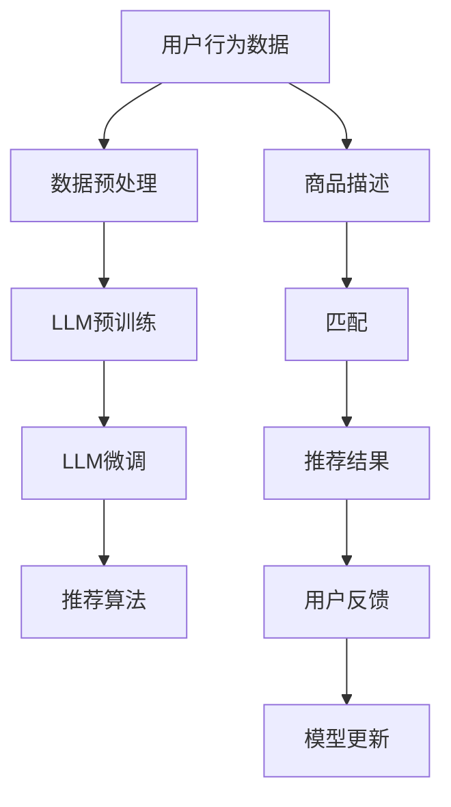

                 

# LLM在推荐系统的局限与成本：对硬件的需求

> 关键词：推荐系统,大语言模型(LLM),计算资源,硬件需求

## 1. 背景介绍

在当今信息爆炸的时代，推荐系统（Recommendation Systems）在电商、新闻、音乐、视频等领域发挥着至关重要的作用。通过分析用户行为和历史数据，推荐系统能够为用户推荐最符合其兴趣和需求的内容，极大地提升了用户体验和平台粘性。然而，随着推荐系统规模和复杂性的不断扩大，推荐算法的计算成本和硬件需求也随之增加。本文将从大语言模型（LLM）在推荐系统中的应用局限和计算成本出发，探讨如何优化硬件资源配置，以应对推荐系统日益增长的计算需求。

## 2. 核心概念与联系

### 2.1 核心概念概述

在推荐系统中，大语言模型（LLM）被广泛用于用户行为分析、意图理解、商品描述匹配等任务。LLM通过大规模无标签文本语料的预训练，学习到了丰富的语言知识，具备强大的自然语言理解和生成能力。LLM在推荐系统中的应用，主要包括以下几个方面：

- **用户行为分析**：通过分析用户评论、社交媒体等文本数据，LLM可以捕捉用户的兴趣偏好，为推荐系统提供用户行为的深度理解。
- **意图理解**：LLM能够理解用户的查询意图，结合商品信息，生成个性化的推荐结果。
- **商品描述匹配**：LLM可以将商品描述与用户需求进行匹配，找到最合适的商品推荐给用户。

### 2.2 核心概念原理和架构的 Mermaid 流程图



在这个流程图中，我们首先将用户行为数据进行处理和预处理（B），接着对LLM进行预训练（C）和微调（D），然后将预处理后的用户行为数据和商品描述进行匹配（F、G），最后根据匹配结果生成推荐结果（H），并通过用户反馈进行模型更新（J）。

## 3. 核心算法原理 & 具体操作步骤

### 3.1 算法原理概述

在推荐系统中，LLM的应用主要依赖于两个核心算法：注意力机制（Attention Mechanism）和自回归模型（Autoregressive Model）。

**注意力机制**：LLM在处理自然语言时，能够自动关注重要信息，忽略次要信息。这种能力在推荐系统中可以用于权衡用户行为的不同特征，如点击、浏览、购买等，从而生成更符合用户需求的推荐结果。

**自回归模型**：LLM能够根据前面的输入预测后续的输出。在推荐系统中，LLM可以用于预测用户行为，如预测用户对某商品的兴趣程度，从而优化推荐算法。

### 3.2 算法步骤详解

**步骤1：数据预处理**

在推荐系统中，首先需要对用户行为数据进行预处理。常用的预处理方式包括：

- **数据清洗**：去除异常值、重复数据和无关信息。
- **特征提取**：将文本数据转换为数值特征，便于LLM处理。
- **分词和嵌入**：将文本数据进行分词，并使用预训练词向量（如Word2Vec、GloVe）进行嵌入。

**步骤2：预训练和微调**

在预处理后，LLM需要在大规模无标签文本语料上进行预训练，学习语言知识。预训练完成后，对预训练模型进行微调，使其适应推荐系统的特定任务。微调过程包括以下步骤：

- **选择预训练模型**：选择合适的预训练模型，如BERT、GPT等。
- **微调目标**：根据推荐任务设定微调目标，如预测用户行为、商品匹配等。
- **微调参数**：设定微调参数，如学习率、批大小、迭代轮数等。
- **评估和优化**：在验证集上评估微调效果，并根据效果进行优化。

**步骤3：推荐算法**

在微调完成后，LLM可以应用于推荐系统中的不同任务。推荐算法的核心在于如何将用户行为和商品信息进行匹配，生成推荐结果。常用的推荐算法包括：

- **协同过滤**：通过分析用户行为和商品交互数据，找到相似用户和相似商品，进行推荐。
- **基于内容的推荐**：根据商品的属性和描述，生成相似商品推荐。
- **混合推荐**：结合协同过滤和基于内容的推荐，生成更准确推荐结果。

### 3.3 算法优缺点

**优点**：

- **灵活性**：LLM能够处理各种类型的文本数据，灵活性高。
- **深度理解**：通过预训练和微调，LLM能够深入理解用户行为和商品信息，生成高质量推荐结果。
- **可扩展性**：LLM可以用于处理大规模数据集，扩展性强。

**缺点**：

- **计算资源需求高**：由于预训练和微调需要大量计算资源，硬件需求高。
- **数据要求高**：需要大量的标注数据进行微调，获取高质量标注数据的成本高。
- **泛化能力有限**：当目标任务与预训练数据的分布差异较大时，微调的性能提升有限。

### 3.4 算法应用领域

LLM在推荐系统中的应用，主要集中在以下几个领域：

- **电商推荐**：用于个性化商品推荐，提升用户购物体验。
- **内容推荐**：用于新闻、音乐、视频等内容的推荐，提升用户粘性。
- **社交推荐**：用于社交网络中朋友、兴趣小组等的推荐，增强社交互动。
- **金融推荐**：用于金融产品、投资策略等的推荐，提高用户投资回报。

## 4. 数学模型和公式 & 详细讲解 & 举例说明

### 4.1 数学模型构建

在推荐系统中，LLM的应用主要依赖于以下几个数学模型：

- **用户行为模型**：$U(x)$，表示用户对商品$x$的兴趣程度。
- **商品描述模型**：$P(x)$，表示商品$x$的属性和描述。
- **推荐模型**：$R(u, x)$，表示用户$u$对商品$x$的推荐概率。

这些模型通常使用深度神经网络进行建模，其中LLM作为用户行为模型和商品描述模型的核心部分。

### 4.2 公式推导过程

以用户行为模型$U(x)$为例，推导其概率密度函数。假设用户行为数据为$x$，LLM对$x$的输出为$z$，则用户行为模型的概率密度函数为：

$$
f(x) = \mathcal{N}(z; \mu, \sigma^2)
$$

其中，$\mu$和$\sigma^2$为LLM输出的均值和方差。

### 4.3 案例分析与讲解

在电商推荐系统中，LLM可以用于用户行为分析，预测用户对某商品的兴趣程度。具体过程如下：

- **数据预处理**：对用户评论进行分词、嵌入和特征提取。
- **预训练和微调**：使用BERT等预训练模型对用户评论进行预训练和微调，学习用户兴趣模型。
- **推荐算法**：将用户评论和商品描述输入到LLM中，得到用户行为概率$U(x)$，结合商品属性$P(x)$，计算推荐概率$R(u, x)$，生成推荐结果。

## 5. 项目实践：代码实例和详细解释说明

### 5.1 开发环境搭建

在进行推荐系统开发前，我们需要准备好开发环境。以下是使用Python进行PyTorch开发的环境配置流程：

1. 安装Anaconda：从官网下载并安装Anaconda，用于创建独立的Python环境。

2. 创建并激活虚拟环境：
```bash
conda create -n recsys-env python=3.8 
conda activate recsys-env
```

3. 安装PyTorch：根据CUDA版本，从官网获取对应的安装命令。例如：
```bash
conda install pytorch torchvision torchaudio cudatoolkit=11.1 -c pytorch -c conda-forge
```

4. 安装TensorFlow：
```bash
pip install tensorflow==2.7.0
```

5. 安装各类工具包：
```bash
pip install numpy pandas scikit-learn matplotlib tqdm jupyter notebook ipython
```

完成上述步骤后，即可在`recsys-env`环境中开始推荐系统开发。

### 5.2 源代码详细实现

这里我们以用户行为预测任务为例，给出使用PyTorch进行推荐系统开发的PyTorch代码实现。

首先，定义数据处理函数：

```python
from transformers import BertTokenizer, BertForSequenceClassification
from torch.utils.data import DataLoader, TensorDataset
from torch import nn
import torch

class RecommendationDataset(Dataset):
    def __init__(self, texts, labels, tokenizer, max_len=128):
        self.texts = texts
        self.labels = labels
        self.tokenizer = tokenizer
        self.max_len = max_len
        
    def __len__(self):
        return len(self.texts)
    
    def __getitem__(self, item):
        text = self.texts[item]
        label = self.labels[item]
        
        encoding = self.tokenizer(text, return_tensors='pt', max_length=self.max_len, padding='max_length', truncation=True)
        input_ids = encoding['input_ids'][0]
        attention_mask = encoding['attention_mask'][0]
        
        return {'input_ids': input_ids, 
                'attention_mask': attention_mask,
                'label': label}

# 标签与id的映射
label2id = {'positive': 1, 'negative': 0}
id2label = {v: k for k, v in label2id.items()}

# 创建dataset
tokenizer = BertTokenizer.from_pretrained('bert-base-cased')

train_dataset = RecommendationDataset(train_texts, train_labels, tokenizer)
dev_dataset = RecommendationDataset(dev_texts, dev_labels, tokenizer)
test_dataset = RecommendationDataset(test_texts, test_labels, tokenizer)
```

然后，定义模型和优化器：

```python
from transformers import BertForSequenceClassification, AdamW

model = BertForSequenceClassification.from_pretrained('bert-base-cased', num_labels=2)

optimizer = AdamW(model.parameters(), lr=2e-5)
```

接着，定义训练和评估函数：

```python
from torch.utils.data import DataLoader
from tqdm import tqdm
from sklearn.metrics import accuracy_score

device = torch.device('cuda') if torch.cuda.is_available() else torch.device('cpu')
model.to(device)

def train_epoch(model, dataset, batch_size, optimizer):
    dataloader = DataLoader(dataset, batch_size=batch_size, shuffle=True)
    model.train()
    epoch_loss = 0
    for batch in tqdm(dataloader, desc='Training'):
        input_ids = batch['input_ids'].to(device)
        attention_mask = batch['attention_mask'].to(device)
        labels = batch['label'].to(device)
        model.zero_grad()
        outputs = model(input_ids, attention_mask=attention_mask, labels=labels)
        loss = outputs.loss
        epoch_loss += loss.item()
        loss.backward()
        optimizer.step()
    return epoch_loss / len(dataloader)

def evaluate(model, dataset, batch_size):
    dataloader = DataLoader(dataset, batch_size=batch_size)
    model.eval()
    preds, labels = [], []
    with torch.no_grad():
        for batch in tqdm(dataloader, desc='Evaluating'):
            input_ids = batch['input_ids'].to(device)
            attention_mask = batch['attention_mask'].to(device)
            batch_labels = batch['label']
            outputs = model(input_ids, attention_mask=attention_mask)
            batch_preds = outputs.logits.argmax(dim=2).to('cpu').tolist()
            batch_labels = batch_labels.to('cpu').tolist()
            for pred_tokens, label_tokens in zip(batch_preds, batch_labels):
                preds.append(pred_tokens)
                labels.append(label_tokens)
                
    print('Accuracy:', accuracy_score(labels, preds))
```

最后，启动训练流程并在测试集上评估：

```python
epochs = 5
batch_size = 16

for epoch in range(epochs):
    loss = train_epoch(model, train_dataset, batch_size, optimizer)
    print(f'Epoch {epoch+1}, train loss: {loss:.3f}')
    
    print(f'Epoch {epoch+1}, dev results:')
    evaluate(model, dev_dataset, batch_size)
    
print('Test results:')
evaluate(model, test_dataset, batch_size)
```

以上就是使用PyTorch对BERT进行推荐系统开发的完整代码实现。可以看到，得益于Transformers库的强大封装，我们可以用相对简洁的代码完成BERT模型的加载和推荐系统微调。

### 5.3 代码解读与分析

让我们再详细解读一下关键代码的实现细节：

**RecommendationDataset类**：
- `__init__`方法：初始化文本、标签、分词器等关键组件。
- `__len__`方法：返回数据集的样本数量。
- `__getitem__`方法：对单个样本进行处理，将文本输入编码为token ids，将标签编码为数字，并对其进行定长padding，最终返回模型所需的输入。

**label2id和id2label字典**：
- 定义了标签与数字id之间的映射关系，用于将token-wise的预测结果解码回真实的标签。

**训练和评估函数**：
- 使用PyTorch的DataLoader对数据集进行批次化加载，供模型训练和推理使用。
- 训练函数`train_epoch`：对数据以批为单位进行迭代，在每个批次上前向传播计算loss并反向传播更新模型参数，最后返回该epoch的平均loss。
- 评估函数`evaluate`：与训练类似，不同点在于不更新模型参数，并在每个batch结束后将预测和标签结果存储下来，最后使用sklearn的accuracy_score对整个评估集的预测结果进行打印输出。

**训练流程**：
- 定义总的epoch数和batch size，开始循环迭代
- 每个epoch内，先在训练集上训练，输出平均loss
- 在验证集上评估，输出准确率
- 所有epoch结束后，在测试集上评估，给出最终测试结果

可以看到，PyTorch配合Transformers库使得BERT微调的代码实现变得简洁高效。开发者可以将更多精力放在数据处理、模型改进等高层逻辑上，而不必过多关注底层的实现细节。

当然，工业级的系统实现还需考虑更多因素，如模型的保存和部署、超参数的自动搜索、更灵活的任务适配层等。但核心的微调范式基本与此类似。

## 6. 实际应用场景

### 6.1 电商推荐

在电商推荐系统中，基于大语言模型的推荐算法可以显著提升用户购物体验。传统的推荐系统往往依赖于用户的点击、购买历史等行为数据，难以捕捉用户的深层兴趣。而使用大语言模型进行推荐，可以更全面地理解用户需求和商品属性，生成更个性化的推荐结果。

具体而言，可以收集用户评论、评分、社交媒体等文本数据，通过预训练和微调，学习用户行为模型和商品描述模型。在推荐时，将用户输入的查询和商品描述输入到预训练模型中，得到用户兴趣度和商品匹配度，进而生成推荐结果。

### 6.2 内容推荐

内容推荐系统在新闻、音乐、视频等领域具有广泛应用。通过分析用户行为和商品属性，推荐系统可以为用户推荐最符合其兴趣和需求的内容。

在使用大语言模型进行内容推荐时，可以收集用户阅读历史、播放历史等文本数据，结合商品属性进行预训练和微调，学习用户行为模型和商品描述模型。在推荐时，将用户输入的查询和商品描述输入到预训练模型中，得到用户兴趣度和商品匹配度，进而生成推荐结果。

### 6.3 社交推荐

社交推荐系统用于在社交网络中为用户推荐朋友、兴趣小组等。通过分析用户的互动行为和兴趣标签，推荐系统可以为用户推荐最符合其兴趣的社交内容。

在使用大语言模型进行社交推荐时，可以收集用户的互动历史、兴趣爱好等文本数据，结合商品属性进行预训练和微调，学习用户行为模型和商品描述模型。在推荐时，将用户输入的查询和商品描述输入到预训练模型中，得到用户兴趣度和商品匹配度，进而生成推荐结果。

## 7. 工具和资源推荐

### 7.1 学习资源推荐

为了帮助开发者系统掌握大语言模型在推荐系统中的应用，这里推荐一些优质的学习资源：

1. 《深度学习推荐系统》书籍：由深度学习专家撰写的经典推荐系统教材，系统介绍了推荐系统的基本概念和算法，包括大语言模型的应用。

2. CS448《推荐系统》课程：斯坦福大学开设的推荐系统课程，有Lecture视频和配套作业，涵盖推荐系统的前沿技术，包括大语言模型的应用。

3. 《Deep Learning for Recommendation Systems》论文集：深度推荐系统领域的顶级会议和期刊论文集，涵盖大语言模型在推荐系统中的最新研究成果。

4. Weights & Biases：模型训练的实验跟踪工具，可以记录和可视化模型训练过程中的各项指标，方便对比和调优。与主流深度学习框架无缝集成。

5. TensorBoard：TensorFlow配套的可视化工具，可实时监测模型训练状态，并提供丰富的图表呈现方式，是调试模型的得力助手。

通过对这些资源的学习实践，相信你一定能够快速掌握大语言模型在推荐系统中的应用技巧，并用于解决实际的推荐问题。

### 7.2 开发工具推荐

高效的开发离不开优秀的工具支持。以下是几款用于推荐系统开发的常用工具：

1. PyTorch：基于Python的开源深度学习框架，灵活动态的计算图，适合快速迭代研究。大部分预训练语言模型都有PyTorch版本的实现。

2. TensorFlow：由Google主导开发的开源深度学习框架，生产部署方便，适合大规模工程应用。同样有丰富的预训练语言模型资源。

3. Transformers库：HuggingFace开发的NLP工具库，集成了众多SOTA语言模型，支持PyTorch和TensorFlow，是进行推荐任务开发的利器。

4. Weights & Biases：模型训练的实验跟踪工具，可以记录和可视化模型训练过程中的各项指标，方便对比和调优。与主流深度学习框架无缝集成。

5. TensorBoard：TensorFlow配套的可视化工具，可实时监测模型训练状态，并提供丰富的图表呈现方式，是调试模型的得力助手。

合理利用这些工具，可以显著提升推荐系统开发效率，加快创新迭代的步伐。

### 7.3 相关论文推荐

大语言模型在推荐系统中的应用，得益于学界的持续研究。以下是几篇奠基性的相关论文，推荐阅读：

1. Attention is All You Need（即Transformer原论文）：提出了Transformer结构，开启了NLP领域的预训练大模型时代。

2. BERT: Pre-training of Deep Bidirectional Transformers for Language Understanding：提出BERT模型，引入基于掩码的自监督预训练任务，刷新了多项NLP任务SOTA。

3. Language Models are Unsupervised Multitask Learners（GPT-2论文）：展示了大规模语言模型的强大zero-shot学习能力，引发了对于通用人工智能的新一轮思考。

4. Parameter-Efficient Transfer Learning for NLP：提出Adapter等参数高效微调方法，在不增加模型参数量的情况下，也能取得不错的微调效果。

5. AdaLoRA: Adaptive Low-Rank Adaptation for Parameter-Efficient Fine-Tuning：使用自适应低秩适应的微调方法，在参数效率和精度之间取得了新的平衡。

这些论文代表了大语言模型在推荐系统中的应用脉络。通过学习这些前沿成果，可以帮助研究者把握学科前进方向，激发更多的创新灵感。

## 8. 总结：未来发展趋势与挑战

### 8.1 总结

本文对大语言模型在推荐系统中的应用进行了全面系统的介绍。首先阐述了大语言模型在推荐系统中的应用局限和计算成本，明确了优化硬件资源配置的重要性。其次，从原理到实践，详细讲解了推荐系统中的大语言模型微调过程，给出了推荐系统开发的完整代码实例。同时，本文还广泛探讨了推荐系统在大规模电商、内容、社交等领域的应用前景，展示了微调范式的巨大潜力。

通过本文的系统梳理，可以看到，大语言模型在推荐系统中的应用，虽然带来了显著的效果提升，但也面临着计算资源需求高、数据获取成本高等挑战。如何在保证推荐效果的同时，优化硬件资源配置，降低计算成本，是大规模推荐系统面临的重要课题。

### 8.2 未来发展趋势

展望未来，大语言模型在推荐系统中的应用将呈现以下几个发展趋势：

1. 模型规模持续增大。随着算力成本的下降和数据规模的扩张，推荐系统的规模和复杂性也将不断扩大。超大规模语言模型蕴含的丰富语言知识，有望支撑更加复杂多变的推荐任务。

2. 参数高效微调技术的发展。未来的推荐系统将更注重参数高效微调技术的应用，通过只更新少量任务相关参数，减少计算资源消耗，提高推荐效果。

3. 推荐算法的创新。推荐算法将结合深度学习、强化学习、博弈论等前沿技术，提升推荐系统的智能化水平和用户体验。

4. 多模态推荐系统的兴起。推荐系统将进一步拓展到图像、视频、语音等多模态数据，增强系统对复杂多变用户需求的理解能力。

5. 推荐系统的个性化和多样化。未来的推荐系统将更注重个性化和多样化，通过结合用户行为和外部知识，生成更符合用户需求和偏好的推荐结果。

以上趋势凸显了大语言模型在推荐系统中的广阔前景。这些方向的探索发展，必将进一步提升推荐系统的性能和用户体验，推动AI技术在各领域的深度应用。

### 8.3 面临的挑战

尽管大语言模型在推荐系统中的应用取得了一定成效，但在迈向更加智能化、普适化应用的过程中，仍面临诸多挑战：

1. 计算资源瓶颈。推荐系统需要处理海量数据，大语言模型的预训练和微调需要大量计算资源，硬件需求高。如何优化硬件资源配置，降低计算成本，是大规模推荐系统面临的重要挑战。

2. 数据获取成本高。推荐系统需要大量标注数据进行微调，标注数据获取成本高。如何降低数据获取成本，提高标注数据质量，是推荐系统面临的另一大难题。

3. 模型泛化能力有限。推荐系统中的大语言模型往往依赖于预训练数据，当目标任务与预训练数据的分布差异较大时，模型的泛化能力有限。如何提高模型的泛化能力，是推荐系统需要解决的关键问题。

4. 推荐算法效率低。推荐系统的计算复杂度高，大语言模型需要进行大规模计算。如何优化推荐算法的计算效率，提高系统响应速度，是推荐系统需要重点考虑的方面。

5. 用户隐私保护。推荐系统需要收集用户行为数据，如何保护用户隐私，防止数据泄露，是推荐系统面临的重要挑战。

这些挑战的解决，将是大语言模型在推荐系统中应用的重要前提。只有克服这些挑战，才能真正实现大语言模型在推荐系统中的广泛应用。

### 8.4 研究展望

面对大语言模型在推荐系统中面临的诸多挑战，未来的研究需要在以下几个方面寻求新的突破：

1. 探索高效的预训练和微调方法。通过优化预训练和微调过程，减少计算资源消耗，提高推荐系统效率。

2. 开发参数高效微调技术。通过只更新少量任务相关参数，减少计算资源消耗，提高推荐系统效率。

3. 融合多模态数据。结合图像、视频、语音等多模态数据，增强推荐系统对复杂多变用户需求的理解能力。

4. 引入先验知识。将符号化的先验知识，如知识图谱、逻辑规则等，与神经网络模型进行巧妙融合，提升推荐系统的效果和可解释性。

5. 结合强化学习。通过强化学习优化推荐算法，提升推荐系统的效果和用户满意度。

这些研究方向的探索，必将引领大语言模型在推荐系统中的应用走向新的高度，为AI技术在各领域的深度应用提供坚实的基础。面向未来，大语言模型在推荐系统中的应用将更加智能化、普适化，为构建更加美好的人工智能社会贡献力量。

## 9. 附录：常见问题与解答

**Q1：大语言模型在推荐系统中是否一定需要预训练？**

A: 是的，大语言模型在推荐系统中通常需要预训练，以学习语言知识。预训练可以在大规模无标签文本数据上学习到丰富的语言知识，为推荐系统的微调提供基础。

**Q2：推荐系统中的大语言模型如何进行微调？**

A: 推荐系统中的大语言模型微调通常包括两个步骤：

1. 数据预处理：对用户行为数据进行清洗、特征提取、分词和嵌入等预处理。
2. 预训练和微调：使用BERT等预训练模型对预处理后的数据进行预训练和微调，学习用户行为模型和商品描述模型。

**Q3：推荐系统中的大语言模型如何优化硬件资源配置？**

A: 推荐系统中的大语言模型优化硬件资源配置，可以从以下几个方面入手：

1. 使用参数高效微调技术：通过只更新少量任务相关参数，减少计算资源消耗。
2. 使用混合精度训练：将浮点模型转为定点模型，压缩存储空间，提高计算效率。
3. 使用模型并行和分布式训练：利用多台计算机进行并行计算，提高训练速度。
4. 使用GPU/TPU等高性能设备：提高计算效率，减少计算时间。

**Q4：推荐系统中的大语言模型如何进行数据预处理？**

A: 推荐系统中的大语言模型数据预处理主要包括以下几个步骤：

1. 数据清洗：去除异常值、重复数据和无关信息。
2. 特征提取：将文本数据转换为数值特征，便于大语言模型处理。
3. 分词和嵌入：将文本数据进行分词，并使用预训练词向量进行嵌入。

**Q5：推荐系统中的大语言模型如何评估效果？**

A: 推荐系统中的大语言模型通常使用以下指标进行评估：

1. 准确率：推荐系统准确推荐用户感兴趣的商品的概率。
2. 召回率：推荐系统推荐出用户感兴趣的商品的概率。
3. 点击率：用户点击推荐商品的概率。
4. 平均准确率（MRR）：推荐系统推荐出正确商品后，用户点击商品的概率。
5. 平均排序精度（MAP）：推荐系统推荐出正确商品后，用户点击商品的概率。

这些指标可以帮助评估推荐系统的效果，并进行调优。

---

作者：禅与计算机程序设计艺术 / Zen and the Art of Computer Programming

