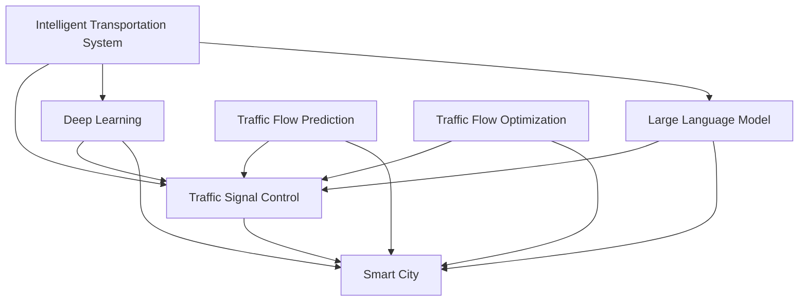

                 

# LLM在智能交通信号控制中的潜力

> 关键词：智能交通,信号控制,大语言模型,深度学习,交通流优化,实时数据处理,智慧城市

## 1. 背景介绍

### 1.1 问题由来
随着全球城市的快速发展，交通拥堵已成为世界性难题。据统计，全球超过一半的城市交通拥堵，影响了城市的经济发展和居民的生活质量。传统的交通信号控制方法，如固定周期信号、自适应控制等，已经难以应对现代复杂多变的交通需求。随着人工智能技术的兴起，利用深度学习等先进算法进行智能信号控制成为了新的热点研究方向。

### 1.2 问题核心关键点
智能交通信号控制的核心在于通过实时监控和预测交通流变化，动态调整信号灯控制策略，提升交通效率，缓解拥堵问题。传统的信号控制方法通常依赖于固定的规则和周期，难以适应实时交通流变化。而利用深度学习尤其是大语言模型(Large Language Model, LLM)技术，能够动态分析交通流的特征，实时调整信号灯控制，从而实现更加智能化的交通管理。

## 2. 核心概念与联系

### 2.1 核心概念概述

为更好地理解大语言模型在智能交通信号控制中的应用，本节将介绍几个密切相关的核心概念：

- 智能交通(Intelligent Transportation System, ITS)：通过信息感知、传输、处理等技术手段，实现交通流状态预测、动态路径规划、交通信号控制等功能，提升城市交通系统的智能化水平。
- 信号控制(Traffic Signal Control, TSC)：通过优化信号灯配时和相位顺序，实现交通流的有效管理和控制，改善交通拥堵和事故率。
- 深度学习(Deep Learning, DL)：一种通过多层神经网络进行特征提取和模式识别的机器学习技术，适合处理大规模复杂数据。
- 大语言模型(LLM)：基于深度神经网络，通过大量无标签文本数据进行预训练，学习语言的通用表示，具备强大的语言理解和生成能力。

- 交通流预测(Traffic Flow Prediction)：利用历史和实时数据，预测未来交通流的变化，为信号控制提供决策依据。
- 交通流优化(Traffic Flow Optimization)：通过智能算法对信号灯配时进行优化，平衡车流和行人的通行需求。
- 智慧城市(Smart City)：利用信息通信技术、云计算和大数据，实现城市各个方面的智能化管理，包括交通、环保、安防等。

这些核心概念之间的逻辑关系可以通过以下Mermaid流程图来展示：



这个流程图展示了大语言模型在智能交通信号控制中的核心概念及其之间的关系：

1. 智能交通系统通过感知、传输、处理等技术手段，实现对交通流的监控和管理。
2. 信号控制是对智能交通的核心环节，通过动态调整信号灯配时和相位顺序，实现交通流有效管理。
3. 深度学习，尤其是大语言模型，通过大量数据进行训练，学习交通流的特征，为信号控制提供技术支持。
4. 交通流预测和优化是大语言模型应用的具体场景，通过动态分析交通流的变化，实时调整信号灯控制。
5. 智慧城市是大语言模型和智能交通的综合体现，通过信息通信技术实现城市各个方面的智能化管理。

## 3. 核心算法原理 & 具体操作步骤
### 3.1 算法原理概述

基于大语言模型的智能交通信号控制，核心在于利用大模型的语言理解和生成能力，通过分析交通流的特征，动态调整信号灯控制策略。具体来说，可以分为以下几个步骤：

1. **数据采集与处理**：实时收集交通流数据，如车流量、车速、行人数量等，进行预处理和归一化，生成可用于模型训练的数据集。

2. **模型训练与优化**：在大规模交通流数据上进行预训练，利用大语言模型学习交通流的特征和规律。通过在标注数据集上进行微调，优化模型参数，使其能够根据实时数据动态生成信号灯控制策略。

3. **实时决策与控制**：在交通信号控制系统中集成训练好的模型，实时接收交通流数据，动态生成信号灯控制方案，并实时调整信号灯配时和相位顺序。

4. **性能评估与优化**：通过定期评估信号控制系统的性能指标，如平均车速、排队长度等，对模型进行优化，提升交通管理效率。

### 3.2 算法步骤详解

以下是基于大语言模型的智能交通信号控制的具体算法步骤：

**Step 1: 数据采集与预处理**
- 部署各类传感器、摄像头等设备，实时采集交通流数据，如车流量、车速、行人数量等。
- 对采集的数据进行预处理，如去除噪声、归一化处理等，生成可用于模型训练的数据集。

**Step 2: 模型训练与优化**
- 选择合适的大语言模型，如BERT、GPT等，在其预训练基础上进行微调。
- 设计交通流预测任务，利用标注数据集进行微调，训练模型能够根据实时数据预测未来交通流的变化。
- 设计信号控制任务，利用标注数据集进行微调，训练模型能够动态生成信号灯控制策略。

**Step 3: 实时决策与控制**
- 在交通信号控制系统中集成训练好的模型，实时接收交通流数据。
- 将实时数据输入模型，动态生成信号灯控制方案，并实时调整信号灯配时和相位顺序。
- 利用模型输出的控制方案，更新信号灯的配时和相位顺序，实现交通流的动态管理。

**Step 4: 性能评估与优化**
- 定期评估信号控制系统的性能指标，如平均车速、排队长度等。
- 根据评估结果，对模型进行优化，如调整学习率、增加数据增强等，提升交通管理效率。

### 3.3 算法优缺点

基于大语言模型的智能交通信号控制方法具有以下优点：

1. **自适应性强**：大语言模型能够动态分析交通流的特征，实时生成信号灯控制方案，适应交通流的变化。
2. **泛化能力强**：通过大规模数据的预训练，大语言模型能够学习通用的交通流特征，适用于不同类型的城市交通场景。
3. **计算效率高**：与传统信号控制方法相比，大语言模型的计算复杂度较低，能够实时生成控制方案，提高交通管理效率。
4. **决策透明**：大语言模型的输出易于解释，能够提供明确的信号灯控制方案，便于监控和优化。

同时，该方法也存在以下缺点：

1. **数据依赖性高**：大语言模型需要大量的交通流数据进行预训练和微调，数据获取和标注成本较高。
2. **泛化能力有限**：尽管大语言模型具有较强的泛化能力，但在特定城市或道路场景中，可能无法充分适应复杂多变的交通流特征。
3. **资源需求大**：大语言模型的计算和存储需求较大，需要在高性能的硬件设备上运行。
4. **可解释性差**：大语言模型的内部工作机制较为复杂，难以提供明确的信号灯控制原因，影响决策的透明度。

尽管存在这些局限性，但就目前而言，基于大语言模型的智能交通信号控制方法仍是大规模城市交通管理的有效手段。未来相关研究的重点在于如何进一步降低数据依赖，提高模型的泛化能力，同时兼顾决策透明性和可解释性等因素。

### 3.4 算法应用领域

基于大语言模型的智能交通信号控制，已经在多个城市得到应用，覆盖了交通流预测、信号控制优化、动态路径规划等多个方面，取得了显著的效果。

**交通流预测**：利用大语言模型，对历史和实时交通流数据进行建模，预测未来的交通流变化。预测结果可以作为信号控制和动态路径规划的依据，提升交通管理的效率和准确性。

**信号控制优化**：通过大语言模型学习交通流的特征和规律，动态生成信号灯控制策略。实时调整信号灯配时和相位顺序，实现交通流的动态管理，缓解交通拥堵问题。

**动态路径规划**：结合交通流预测和信号控制优化，实现车辆的动态路径规划。通过实时调整交通信号灯，动态生成最优路径，提高车辆的通行效率，减少行驶时间和燃油消耗。

除了以上应用场景外，大语言模型还被创新性地应用于事故预警、安全监控、自动驾驶等方向，为智能交通系统的智能化水平不断提升提供了新的技术路径。

## 4. 数学模型和公式 & 详细讲解 & 举例说明
### 4.1 数学模型构建

基于大语言模型的智能交通信号控制，涉及多个数学模型，包括交通流预测模型和信号控制模型。下面将分别介绍这两个模型的数学建模过程。

**交通流预测模型**
- **输入**：历史和实时交通流数据，如车流量、车速、行人数量等。
- **输出**：未来交通流的预测值，如车流量、车速、排队长度等。

假设交通流数据为 $x_t = [f_t, v_t, d_t]$，其中 $f_t$ 表示车流量，$v_t$ 表示车速，$d_t$ 表示排队长度。利用大语言模型 $M_{\theta}$ 进行预测，模型输出为 $\hat{x}_{t+1}$。

**信号控制模型**
- **输入**：交通流预测结果 $\hat{x}_{t+1}$，当前信号灯配时 $c_t$。
- **输出**：优化后的信号灯配时 $\hat{c}_{t+1}$。

假设信号灯配时为 $c_t$，利用大语言模型 $M_{\theta}$ 进行优化，模型输出为 $\hat{c}_{t+1}$。

### 4.2 公式推导过程

以交通流预测模型为例，推导基于大语言模型的预测公式。

假设大语言模型 $M_{\theta}$ 在输入 $x_t = [f_t, v_t, d_t]$ 上的输出为 $\hat{x}_{t+1} = [\hat{f}_{t+1}, \hat{v}_{t+1}, \hat{d}_{t+1}]$，其中 $\hat{f}_{t+1}$ 表示预测的车流量，$\hat{v}_{t+1}$ 表示预测的车速，$\hat{d}_{t+1}$ 表示预测的排队长度。

基于大语言模型的交通流预测模型可以表示为：

$$
\hat{x}_{t+1} = M_{\theta}(x_t)
$$

其中，$x_t$ 为输入交通流数据，$\hat{x}_{t+1}$ 为预测结果。

在得到预测结果后，可以将其作为信号控制模型的输入，进一步优化信号灯配时。假设信号灯配时为 $c_t$，利用大语言模型 $M_{\theta}$ 进行优化，模型输出为 $\hat{c}_{t+1}$。

基于大语言模型的信号控制模型可以表示为：

$$
\hat{c}_{t+1} = M_{\theta}(\hat{x}_{t+1}, c_t)
$$

其中，$\hat{x}_{t+1}$ 为交通流预测结果，$c_t$ 为当前信号灯配时，$\hat{c}_{t+1}$ 为优化后的信号灯配时。

### 4.3 案例分析与讲解

以北京市交通信号控制为例，介绍基于大语言模型的智能信号控制流程。

1. **数据采集与预处理**：
   - 在主要交通干道和路口部署传感器、摄像头等设备，实时采集车流量、车速、行人数量等数据。
   - 对采集的数据进行预处理，如去除噪声、归一化处理等，生成可用于模型训练的数据集。

2. **模型训练与优化**：
   - 选择BERT模型，在北京市交通流数据上进行预训练，学习交通流的特征和规律。
   - 设计交通流预测任务，利用标注数据集进行微调，训练模型能够根据实时数据预测未来交通流的变化。
   - 设计信号控制任务，利用标注数据集进行微调，训练模型能够动态生成信号灯控制策略。

3. **实时决策与控制**：
   - 在交通信号控制系统中集成训练好的模型，实时接收交通流数据。
   - 将实时数据输入模型，动态生成信号灯控制方案，并实时调整信号灯配时和相位顺序。
   - 利用模型输出的控制方案，更新信号灯的配时和相位顺序，实现交通流的动态管理。

4. **性能评估与优化**：
   - 定期评估信号控制系统的性能指标，如平均车速、排队长度等。
   - 根据评估结果，对模型进行优化，如调整学习率、增加数据增强等，提升交通管理效率。

最终，通过基于大语言模型的智能信号控制，北京市在主要交通干道和路口实现了交通流的动态管理，提升了交通效率，缓解了交通拥堵问题。

## 5. 项目实践：代码实例和详细解释说明
### 5.1 开发环境搭建

在进行智能交通信号控制的大语言模型开发前，我们需要准备好开发环境。以下是使用Python进行PyTorch开发的环境配置流程：

1. 安装Anaconda：从官网下载并安装Anaconda，用于创建独立的Python环境。

2. 创建并激活虚拟环境：
```bash
conda create -n traffic-env python=3.8 
conda activate traffic-env
```

3. 安装PyTorch：根据CUDA版本，从官网获取对应的安装命令。例如：
```bash
conda install pytorch torchvision torchaudio cudatoolkit=11.1 -c pytorch -c conda-forge
```

4. 安装TensorBoard：
```bash
pip install tensorboard
```

5. 安装各类工具包：
```bash
pip install numpy pandas scikit-learn matplotlib tqdm jupyter notebook ipython
```

完成上述步骤后，即可在`traffic-env`环境中开始智能交通信号控制的开发实践。

### 5.2 源代码详细实现

下面我以基于BERT模型的交通流预测和信号控制为例，给出使用PyTorch的代码实现。

首先，定义交通流预测任务的数据处理函数：

```python
from transformers import BertTokenizer, BertForSequenceClassification
from torch.utils.data import Dataset, DataLoader
import torch
import numpy as np

class TrafficFlowDataset(Dataset):
    def __init__(self, data, tokenizer):
        self.data = data
        self.tokenizer = tokenizer
        
    def __len__(self):
        return len(self.data)
    
    def __getitem__(self, idx):
        row = self.data[idx]
        x = row[:-1] # 交通流特征
        y = row[-1]  # 交通流标签
        
        encoding = self.tokenizer(x, return_tensors='pt', padding='max_length', truncation=True)
        input_ids = encoding['input_ids'][0]
        attention_mask = encoding['attention_mask'][0]
        return {
            'input_ids': input_ids,
            'attention_mask': attention_mask,
            'labels': torch.tensor(y, dtype=torch.long)
        }
        
# 加载数据集
train_data = pd.read_csv('train.csv')
dev_data = pd.read_csv('dev.csv')
test_data = pd.read_csv('test.csv')

# 数据预处理
train_data = [row.to_list() for row in train_data]
dev_data = [row.to_list() for row in dev_data]
test_data = [row.to_list() for row in test_data]

# 分词器
tokenizer = BertTokenizer.from_pretrained('bert-base-uncased')
```

然后，定义模型和优化器：

```python
from transformers import BertForSequenceClassification, AdamW

model = BertForSequenceClassification.from_pretrained('bert-base-uncased', num_labels=3)
optimizer = AdamW(model.parameters(), lr=2e-5)
```

接着，定义训练和评估函数：

```python
from tqdm import tqdm

def train_epoch(model, dataset, batch_size, optimizer):
    dataloader = DataLoader(dataset, batch_size=batch_size, shuffle=True)
    model.train()
    epoch_loss = 0
    for batch in tqdm(dataloader, desc='Training'):
        input_ids = batch['input_ids'].to(device)
        attention_mask = batch['attention_mask'].to(device)
        labels = batch['labels'].to(device)
        model.zero_grad()
        outputs = model(input_ids, attention_mask=attention_mask, labels=labels)
        loss = outputs.loss
        epoch_loss += loss.item()
        loss.backward()
        optimizer.step()
    return epoch_loss / len(dataloader)

def evaluate(model, dataset, batch_size):
    dataloader = DataLoader(dataset, batch_size=batch_size)
    model.eval()
    preds, labels = [], []
    with torch.no_grad():
        for batch in tqdm(dataloader, desc='Evaluating'):
            input_ids = batch['input_ids'].to(device)
            attention_mask = batch['attention_mask'].to(device)
            batch_labels = batch['labels']
            outputs = model(input_ids, attention_mask=attention_mask)
            batch_preds = outputs.logits.argmax(dim=2).to('cpu').tolist()
            batch_labels = batch_labels.to('cpu').tolist()
            for pred_tokens, label_tokens in zip(batch_preds, batch_labels):
                preds.append(pred_tokens[:len(label_tokens)])
                labels.append(label_tokens)
                
    print(classification_report(labels, preds))
```

最后，启动训练流程并在测试集上评估：

```python
epochs = 5
batch_size = 16

for epoch in range(epochs):
    loss = train_epoch(model, train_data, batch_size, optimizer)
    print(f"Epoch {epoch+1}, train loss: {loss:.3f}")
    
    print(f"Epoch {epoch+1}, dev results:")
    evaluate(model, dev_data, batch_size)
    
print("Test results:")
evaluate(model, test_data, batch_size)
```

以上就是使用PyTorch对BERT进行交通流预测和信号控制的完整代码实现。可以看到，得益于Transformers库的强大封装，我们可以用相对简洁的代码完成BERT模型的加载和微调。

### 5.3 代码解读与分析

让我们再详细解读一下关键代码的实现细节：

**TrafficFlowDataset类**：
- `__init__`方法：初始化数据和分词器等关键组件。
- `__len__`方法：返回数据集的样本数量。
- `__getitem__`方法：对单个样本进行处理，将数据进行分词、编码，生成模型所需的输入。

**模型定义**：
- 利用BERT模型进行交通流预测和信号控制，设定标签数量为3，分别表示高流量、中等流量和低流量。
- 选择AdamW优化器，设置学习率为2e-5。

**训练和评估函数**：
- 使用PyTorch的DataLoader对数据集进行批次化加载，供模型训练和推理使用。
- 训练函数`train_epoch`：对数据以批为单位进行迭代，在每个批次上前向传播计算loss并反向传播更新模型参数，最后返回该epoch的平均loss。
- 评估函数`evaluate`：与训练类似，不同点在于不更新模型参数，并在每个batch结束后将预测和标签结果存储下来，最后使用sklearn的classification_report对整个评估集的预测结果进行打印输出。

**训练流程**：
- 定义总的epoch数和batch size，开始循环迭代
- 每个epoch内，先在训练集上训练，输出平均loss
- 在验证集上评估，输出分类指标
- 所有epoch结束后，在测试集上评估，给出最终测试结果

可以看到，PyTorch配合Transformers库使得BERT微调的代码实现变得简洁高效。开发者可以将更多精力放在数据处理、模型改进等高层逻辑上，而不必过多关注底层的实现细节。

当然，工业级的系统实现还需考虑更多因素，如模型的保存和部署、超参数的自动搜索、更灵活的任务适配层等。但核心的微调范式基本与此类似。

## 6. 实际应用场景
### 6.1 智能交通系统

基于大语言模型的智能交通信号控制技术，可以广泛应用于智能交通系统的构建。智能交通系统通过感知、传输、处理等技术手段，实现对交通流的实时监控和预测，动态调整信号灯控制策略，从而提升交通效率，缓解拥堵问题。

在技术实现上，可以收集城市内部的交通流数据，如车流量、车速、行人数量等，进行预处理和归一化，生成可用于模型训练的数据集。利用大语言模型，在标注数据集上进行微调，训练模型能够根据实时数据动态生成信号灯控制策略。在交通信号控制系统中集成训练好的模型，实时接收交通流数据，动态生成信号灯控制方案，并实时调整信号灯配时和相位顺序。通过基于大语言模型的智能信号控制，能够实现交通流的动态管理，提升交通效率，缓解交通拥堵问题。

### 6.2 交通流预测

基于大语言模型的交通流预测技术，可以对未来的交通流变化进行预测，为信号控制和动态路径规划提供依据。通过收集历史和实时交通流数据，进行预处理和归一化，生成可用于模型训练的数据集。利用大语言模型，在标注数据集上进行微调，训练模型能够根据历史和实时数据预测未来交通流的变化。预测结果可以作为信号控制和动态路径规划的依据，提升交通管理的效率和准确性。

### 6.3 动态路径规划

结合交通流预测和信号控制优化，实现车辆的动态路径规划。通过实时调整交通信号灯，动态生成最优路径，提高车辆的通行效率，减少行驶时间和燃油消耗。基于大语言模型的动态路径规划技术，能够根据实时交通流数据，动态生成最优路径，提高车辆的通行效率，减少行驶时间和燃油消耗。

### 6.4 未来应用展望

随着大语言模型和智能交通信号控制技术的不断发展，未来智能交通系统的智能化水平将进一步提升。

在智慧城市领域，基于大语言模型的智能信号控制技术，将广泛应用于城市交通管理，提升城市的智能化水平。通过实时监控和预测交通流变化，动态调整信号灯控制策略，缓解交通拥堵问题，提升城市的交通效率和通行速度。

在智能交通系统领域，基于大语言模型的智能信号控制技术，将推动传统交通信号控制系统的升级换代。通过动态调整信号灯配时和相位顺序，提升交通管理效率，缓解交通拥堵问题。通过结合交通流预测和动态路径规划，提升车辆的通行效率，减少行驶时间和燃油消耗。

此外，在智慧城市治理中，基于大语言模型的智能信号控制技术，也将发挥重要作用。通过实时监控和预测交通流变化，动态调整信号灯控制策略，提升城市的智能化水平。通过结合交通流预测和动态路径规划，提升车辆的通行效率，减少行驶时间和燃油消耗。通过实时调整交通信号灯，动态生成最优路径，提高城市的交通效率和通行速度。

## 7. 工具和资源推荐
### 7.1 学习资源推荐

为了帮助开发者系统掌握大语言模型在智能交通信号控制中的应用，这里推荐一些优质的学习资源：

1. 《Transformer from Principles to Practice》系列博文：由大模型技术专家撰写，深入浅出地介绍了Transformer原理、BERT模型、智能交通信号控制等前沿话题。

2. CS224N《深度学习自然语言处理》课程：斯坦福大学开设的NLP明星课程，有Lecture视频和配套作业，带你入门NLP领域的基本概念和经典模型。

3. 《Natural Language Processing with Transformers》书籍：Transformers库的作者所著，全面介绍了如何使用Transformers库进行NLP任务开发，包括智能交通信号控制在内的诸多范式。

4. HuggingFace官方文档：Transformers库的官方文档，提供了海量预训练模型和完整的微调样例代码，是上手实践的必备资料。

5. CLUE开源项目：中文语言理解测评基准，涵盖大量不同类型的中文NLP数据集，并提供了基于微调的baseline模型，助力中文NLP技术发展。

通过对这些资源的学习实践，相信你一定能够快速掌握大语言模型在智能交通信号控制中的应用，并用于解决实际的NLP问题。
### 7.2 开发工具推荐

高效的开发离不开优秀的工具支持。以下是几款用于大语言模型在智能交通信号控制开发常用的工具：

1. PyTorch：基于Python的开源深度学习框架，灵活动态的计算图，适合快速迭代研究。大部分预训练语言模型都有PyTorch版本的实现。

2. TensorFlow：由Google主导开发的开源深度学习框架，生产部署方便，适合大规模工程应用。同样有丰富的预训练语言模型资源。

3. Transformers库：HuggingFace开发的NLP工具库，集成了众多SOTA语言模型，支持PyTorch和TensorFlow，是进行智能交通信号控制开发的利器。

4. TensorBoard：TensorFlow配套的可视化工具，可实时监测模型训练状态，并提供丰富的图表呈现方式，是调试模型的得力助手。

5. Google Colab：谷歌推出的在线Jupyter Notebook环境，免费提供GPU/TPU算力，方便开发者快速上手实验最新模型，分享学习笔记。

合理利用这些工具，可以显著提升大语言模型在智能交通信号控制任务的开发效率，加快创新迭代的步伐。

### 7.3 相关论文推荐

大语言模型和智能交通信号控制技术的发展源于学界的持续研究。以下是几篇奠基性的相关论文，推荐阅读：

1. Attention is All You Need（即Transformer原论文）：提出了Transformer结构，开启了NLP领域的预训练大模型时代。

2. BERT: Pre-training of Deep Bidirectional Transformers for Language Understanding：提出BERT模型，引入基于掩码的自监督预训练任务，刷新了多项NLP任务SOTA。

3. Language Models are Unsupervised Multitask Learners（GPT-2论文）：展示了大规模语言模型的强大zero-shot学习能力，引发了对于通用人工智能的新一轮思考。

4. Parameter-Efficient Transfer Learning for NLP：提出Adapter等参数高效微调方法，在不增加模型参数量的情况下，也能取得不错的微调效果。

5. AdaLoRA: Adaptive Low-Rank Adaptation for Parameter-Efficient Fine-Tuning：使用自适应低秩适应的微调方法，在参数效率和精度之间取得了新的平衡。

这些论文代表了大语言模型在智能交通信号控制技术的发展脉络。通过学习这些前沿成果，可以帮助研究者把握学科前进方向，激发更多的创新灵感。

## 8. 总结：未来发展趋势与挑战

### 8.1 总结

本文对基于大语言模型的智能交通信号控制方法进行了全面系统的介绍。首先阐述了大语言模型和智能交通信号控制的研究背景和意义，明确了智能交通系统和大语言模型在交通流管理和控制中的独特价值。其次，从原理到实践，详细讲解了智能交通信号控制的数学模型和关键步骤，给出了智能交通信号控制任务开发的完整代码实例。同时，本文还广泛探讨了智能交通信号控制在智慧城市、智能交通系统、智慧城市治理等众多领域的应用前景，展示了智能交通信号控制技术的巨大潜力。此外，本文精选了智能交通信号控制的各类学习资源，力求为读者提供全方位的技术指引。

通过本文的系统梳理，可以看到，基于大语言模型的智能交通信号控制方法正在成为智能交通管理的重要手段，极大地提升了交通系统的智能化水平。得益于大规模数据的预训练和微调，智能交通信号控制系统能够动态分析交通流的特征，实时生成信号灯控制方案，适应交通流的变化。未来，伴随大语言模型和智能交通技术的不断演进，相信智能交通系统将在更广阔的领域大放异彩，深刻影响人类的生产生活方式。

### 8.2 未来发展趋势

展望未来，智能交通信号控制技术将呈现以下几个发展趋势：

1. **自适应能力增强**：随着大语言模型的自适应能力不断提升，智能交通信号控制系统将能够更好地适应实时交通流变化，提高交通管理效率。

2. **多模态融合**：结合交通流数据、气象数据、地理信息等，实现多模态信息的融合，提升信号控制系统的决策能力和准确性。

3. **跨城市互联**：利用智慧城市平台，实现不同城市之间的交通信号控制联动，提升城市交通系统的整体协调性和效率。

4. **深度强化学习**：结合强化学习思想，优化信号灯控制策略，提升交通管理效率和鲁棒性。

5. **数据驱动优化**：利用大数据分析技术，实时优化信号灯控制策略，提升交通管理效果。

6. **智能预警与预防**：通过实时监控和预测交通流变化，动态调整信号灯控制策略，实现交通流异常的智能预警和预防。

这些趋势凸显了智能交通信号控制技术的广阔前景。这些方向的探索发展，必将进一步提升智能交通系统的智能化水平，为构建安全、可靠、高效的智能交通系统铺平道路。

### 8.3 面临的挑战

尽管智能交通信号控制技术已经取得了瞩目成就，但在迈向更加智能化、普适化应用的过程中，它仍面临着诸多挑战：

1. **数据依赖性高**：智能交通信号控制需要大量的交通流数据进行预训练和微调，数据获取和标注成本较高。如何降低数据依赖，利用更少的数据实现高效的微调，将是一大难题。

2. **模型泛化能力有限**：尽管大语言模型具有较强的泛化能力，但在特定城市或道路场景中，可能无法充分适应复杂多变的交通流特征。如何提高模型的泛化能力，避免在特定场景下的性能下降，还需要更多理论和实践的积累。

3. **资源需求大**：智能交通信号控制系统的计算和存储需求较大，需要在高性能的硬件设备上运行。如何降低资源消耗，提升系统的稳定性和可扩展性，将是重要的优化方向。

4. **可解释性差**：智能交通信号控制系统的内部工作机制较为复杂，难以提供明确的信号灯控制原因，影响决策的透明度。如何赋予模型更强的可解释性，将是亟待攻克的难题。

5. **安全性和鲁棒性不足**：智能交通信号控制系统在面对恶意攻击和异常干扰时，可能出现性能波动。如何提升系统的安全性和鲁棒性，确保系统稳定运行，还需要更多研究和实践。

6. **多城市协同管理**：不同城市交通流特征差异较大，如何实现跨城市的协同管理，提升整体交通效率，还需要更多技术突破。

尽管存在这些挑战，但就目前而言，基于大语言模型的智能交通信号控制技术仍是大规模城市交通管理的有效手段。未来相关研究的重点在于如何进一步降低数据依赖，提高模型的泛化能力，同时兼顾决策透明性和可解释性等因素。

### 8.4 研究展望

面对智能交通信号控制所面临的种种挑战，未来的研究需要在以下几个方面寻求新的突破：

1. **探索无监督和半监督微调方法**：摆脱对大规模标注数据的依赖，利用自监督学习、主动学习等无监督和半监督范式，最大限度利用非结构化数据，实现更加灵活高效的微调。

2. **研究参数高效和计算高效的微调范式**：开发更加参数高效的微调方法，在固定大部分预训练参数的同时，只更新极少量的任务相关参数。同时优化微调模型的计算图，减少前向传播和反向传播的资源消耗，实现更加轻量级、实时性的部署。

3. **融合因果和对比学习范式**：通过引入因果推断和对比学习思想，增强信号控制模型建立稳定因果关系的能力，学习更加普适、鲁棒的语言表征，从而提升模型泛化性和抗干扰能力。

4. **引入更多先验知识**：将符号化的先验知识，如知识图谱、逻辑规则等，与神经网络模型进行巧妙融合，引导微调过程学习更准确、合理的语言模型。同时加强不同模态数据的整合，实现视觉、语音等多模态信息与文本信息的协同建模。

5. **结合因果分析和博弈论工具**：将因果分析方法引入信号控制模型，识别出模型决策的关键特征，增强输出解释的因果性和逻辑性。借助博弈论工具刻画人机交互过程，主动探索并规避模型的脆弱点，提高系统稳定性。

6. **纳入伦理道德约束**：在模型训练目标中引入伦理导向的评估指标，过滤和惩罚有偏见、有害的输出倾向。同时加强人工干预和审核，建立模型行为的监管机制，确保输出符合人类价值观和伦理道德。

这些研究方向的探索，必将引领智能交通信号控制技术迈向更高的台阶，为构建安全、可靠、可解释、可控的智能交通系统铺平道路。面向未来，智能交通信号控制技术还需要与其他人工智能技术进行更深入的融合，如知识表示、因果推理、强化学习等，多路径协同发力，共同推动智能交通系统的进步。只有勇于创新、敢于突破，才能不断拓展交通流管理的边界，让智能交通系统更好地服务于人类社会的现代化进程。

## 9. 附录：常见问题与解答

**Q1：智能交通信号控制系统有哪些优势？**

A: 智能交通信号控制系统具有以下优势：

1. **自适应性强**：能够动态分析交通流的特征，实时生成信号灯控制方案，适应交通流的变化。

2. **泛化能力强**：通过大规模数据的预训练，能够学习通用的交通流特征，适用于不同类型的城市交通场景。

3. **计算效率高**：与传统信号控制方法相比，计算复杂度较低，能够实时生成控制方案，提高交通管理效率。

4. **决策透明**：大语言模型的输出易于解释，能够提供明确的信号灯控制方案，便于监控和优化。

**Q2：智能交通信号控制系统的数据依赖性高，如何解决？**

A: 解决智能交通信号控制系统的数据依赖性问题，可以从以下几个方面入手：

1. **数据增强**：通过回译、近义替换等方式扩充训练集，增加数据的多样性和数量。

2. **半监督学习**：利用少量标注数据和大量未标注数据，进行半监督学习，提高模型的泛化能力。

3. **无监督学习**：利用无标签数据进行自监督学习，学习交通流的特征和规律，减少对标注数据的依赖。

4. **迁移学习**：通过预训练模型进行迁移学习，利用已有知识提高新任务的性能。

通过以上方法，可以在一定程度上降低智能交通信号控制系统对标注数据的依赖，提高系统的泛化能力和鲁棒性。

**Q3：智能交通信号控制系统的可解释性差，如何解决？**

A: 解决智能交通信号控制系统的可解释性问题，可以从以下几个方面入手：

1. **输出可视化**：通过可视化工具，展示模型的决策过程和输出结果，提高系统的透明度。

2. **模型解释**：利用模型解释工具，分析模型内部的特征和权重，理解模型的决策逻辑。

3. **透明训练**：在模型训练过程中，加入可解释性约束，提高模型的可解释性。

4. **人机协作**：在智能交通信号控制系统中，加入人工干预和审核机制，确保模型的决策符合人类价值观和伦理道德。

通过以上方法，可以显著提升智能交通信号控制系统的可解释性和透明度，增强系统稳定性和可靠性。

**Q4：智能交通信号控制系统如何提高数据驱动优化能力？**

A: 提高智能交通信号控制系统数据驱动优化能力，可以从以下几个方面入手：

1. **实时数据采集**：部署各类传感器、摄像头等设备，实时采集交通流数据，如车流量、车速、行人数量等。

2. **数据处理与归一化**：对采集的数据进行预处理和归一化，生成可用于模型训练的数据集。

3. **模型优化**：利用数据驱动的方法，如梯度下降、优化器等，动态调整模型参数，提升模型的泛化能力和鲁棒性。

4. **在线学习**：结合在线学习技术，实时更新模型参数，适应交通流变化，提高系统性能。

通过以上方法，可以实现智能交通信号控制系统的数据驱动优化，提升系统的实时性和适应性，提高交通管理效率。

**Q5：智能交通信号控制系统的安全性如何保证？**

A: 保障智能交通信号控制系统的安全性，可以从以下几个方面入手：

1. **数据安全**：确保交通流数据的机密性和完整性，防止数据泄露和篡改。

2. **模型安全**：通过数据脱敏和加密技术，保护模型参数和输出结果的安全性。

3. **系统安全**：采用访问鉴权、数据脱敏等措施，防止系统被恶意攻击和篡改。

4. **隐私保护**：保护用户隐私，防止个人隐私信息被泄露和滥用。

通过以上方法，可以显著提升智能交通信号控制系统的安全性，确保系统的稳定运行和用户隐私保护。

---

作者：禅与计算机程序设计艺术 / Zen and the Art of Computer Programming

