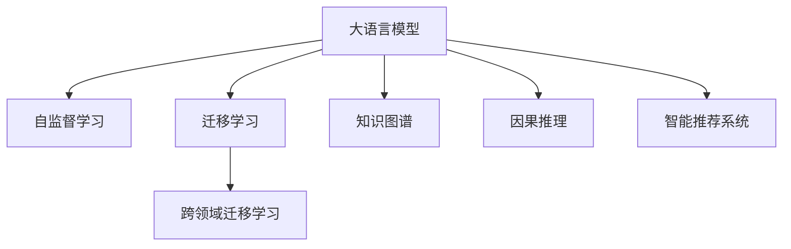

                 

## 1. 背景介绍

随着人工智能技术的不断进步，智能交通系统（Intelligent Transportation Systems, ITS）正在迎来一场革命性的变革。大语言模型（Large Language Model, LLM）作为新一代的AI技术，以其强大的自然语言处理能力，为智能交通系统的建设提供了新的可能性。

智能交通系统主要包括交通监测、交通管理、交通控制、交通导航等多个方面，涉及大量的交通数据和复杂的自然语言指令。传统的数据处理方式往往依赖于人工干预和规则制定，效率低、成本高。而大语言模型通过自然语言理解、知识整合、智能推理等功能，可以显著提升交通系统的智能化水平，优化资源配置，提升出行效率和安全性。

本博客将系统介绍大语言模型在智能交通系统中的应用，包括关键技术、实际案例以及未来发展趋势。

## 2. 核心概念与联系

### 2.1 核心概念概述

为更好地理解大语言模型在智能交通系统中的应用，本节将介绍几个密切相关的核心概念：

- 大语言模型(Large Language Model, LLM)：基于Transformer等架构的预训练模型，通过在大量文本数据上进行预训练，具备强大的语言理解和生成能力。
- 自监督学习(Self-Supervised Learning)：在大规模无标签数据上进行训练，通过预测任务或生成任务学习语言知识，如掩码语言模型、文本生成等。
- 迁移学习(Transfer Learning)：将一个领域学到的知识，迁移到另一个相关领域进行学习，如使用通用大模型进行交通场景的应用。
- 跨领域迁移学习(Cross-Domain Transfer Learning)：将预训练模型在不同领域的数据上进行微调，如将通用语言模型用于交通数据处理。
- 知识图谱(Knowledge Graph)：用于组织和表示实体及其关系的图形结构，帮助大语言模型在复杂语境下进行推理和决策。
- 因果推理(Causal Reasoning)：分析事件间的因果关系，进行逻辑推理和预测，提升智能交通系统的决策准确性。
- 智能推荐系统(Intelligent Recommendation System)：通过用户行为数据，结合语言模型推荐最优出行方案，提升用户出行体验。

这些核心概念之间的逻辑关系可以通过以下Mermaid流程图来展示：



这个流程图展示了大语言模型在智能交通系统中的核心概念及其之间的联系。通过预训练和迁移学习，大语言模型能够在复杂的交通场景中发挥其强大的语言处理能力，提升系统的智能化水平。

## 3. 核心算法原理 & 具体操作步骤

### 3.1 算法原理概述

大语言模型在智能交通系统中的应用，主要是通过其在自然语言处理方面的优势，解决交通场景中的各种问题。主要包括以下几个方面：

- 交通监测：大语言模型可以通过自然语言理解技术，分析交通监控摄像头捕捉的视频和图像，自动生成交通事故、道路堵塞、异常行为等报警信息。
- 交通管理：利用知识图谱和大语言模型的推理能力，智能交通系统可以自动生成交通指挥方案，优化交通流量，提高通行效率。
- 交通控制：通过智能推荐系统，大语言模型可以根据实时交通状况和用户需求，推荐最优的路线和交通方式，提升出行效率。
- 交通导航：结合因果推理和大语言模型的语义理解能力，智能交通系统可以预测交通拥堵情况，提前预警，优化导航路径。

### 3.2 算法步骤详解

大语言模型在智能交通系统中的应用，主要分为预训练、迁移学习和微调三个步骤。具体步骤如下：

**Step 1: 预训练**
- 收集大量的交通相关文本数据，如交通事故报告、道路监控视频、交通规则等，进行预训练。
- 使用自监督学习方法，如掩码语言模型、文本生成等，学习交通场景的语言特征和知识。

**Step 2: 迁移学习**
- 选择合适的预训练语言模型，如BERT、GPT-3等。
- 将预训练模型应用于交通领域，利用知识图谱等结构化数据，进行跨领域迁移学习。

**Step 3: 微调**
- 在交通监测、管理、控制等具体任务上，收集少量标注数据，进行有监督微调。
- 设计合适的任务适配层，如分类器、生成器等，优化模型参数。

### 3.3 算法优缺点

基于大语言模型的智能交通系统，具有以下优点：

- 灵活性高：大语言模型可以灵活应对各种交通场景，适用于不同的应用需求。
- 泛化能力强：通过预训练和迁移学习，模型可以在新的交通场景中快速适应，提升系统的通用性。
- 处理能力强：大语言模型可以处理大量的交通数据，识别复杂的自然语言指令，提升系统的智能化水平。

同时，该方法也存在一些局限性：

- 依赖数据质量：模型性能很大程度上取决于训练数据的准确性和多样性。
- 计算资源消耗大：大语言模型的参数量庞大，对计算资源和存储资源有较高的要求。
- 解释性不足：大语言模型的决策过程复杂，难以提供可解释的推理过程。
- 易受干扰：在复杂交通环境中，模型的决策可能受到干扰，导致误判。

尽管存在这些局限性，但大语言模型在智能交通系统中的应用，仍具有广阔的前景和潜力。

### 3.4 算法应用领域

基于大语言模型的智能交通系统，已经在多个领域得到了应用，具体包括：

- 交通监测：利用大语言模型对交通监控摄像头捕捉的视频和图像进行分析，自动生成报警信息，提高事故响应速度。
- 交通管理：结合知识图谱和大语言模型的推理能力，智能交通系统可以自动生成交通指挥方案，优化交通流量，提高通行效率。
- 交通控制：通过智能推荐系统，大语言模型可以根据实时交通状况和用户需求，推荐最优的路线和交通方式，提升出行效率。
- 交通导航：结合因果推理和大语言模型的语义理解能力，智能交通系统可以预测交通拥堵情况，提前预警，优化导航路径。
- 智能公交：利用大语言模型对公交路线进行优化，实现按需发车、智能调度等功能，提升公交服务质量。

以上应用展示了大语言模型在智能交通系统中的巨大潜力，未来将会在更多领域得到应用，为智能交通的全面升级提供有力支持。

## 4. 数学模型和公式 & 详细讲解 & 举例说明

### 4.1 数学模型构建

大语言模型在智能交通系统中的应用，主要依赖于自然语言处理和知识推理。以下是几个关键模型的数学构建：

1. **掩码语言模型(Masked Language Model, MLM)**

掩码语言模型是预训练中常用的模型，通过将部分文本中的词汇随机替换成[Mask]，让模型预测被掩盖的词汇，从而学习词汇之间的语义关系。数学形式如下：

$$
\mathcal{L}_{MLM} = -\frac{1}{n}\sum_{i=1}^n \sum_{j=1}^n \log p(x_i^j|\{x_1^i,\ldots,x_{i-1}^i,x_{i+1}^i,\ldots,x_n^i\})
$$

其中，$x_i^j$表示文本中的第$j$个词汇，$x_i$表示文本中的第$i$个词汇，$p(x_i^j|\{x_1^i,\ldots,x_{i-1}^i,x_{i+1}^i,\ldots,x_n^i\})$表示给定上下文词汇，预测第$j$个词汇的概率。

2. **文本生成模型(Text Generation Model)**

文本生成模型通过生成连续的文本序列，学习语言结构和语法规律。常见的模型有GPT系列、Transformer-XL等。数学形式如下：

$$
\mathcal{L}_{TG} = -\frac{1}{N}\sum_{i=1}^N \sum_{j=1}^T \log p(x_i^j|x_i^{j-1},\ldots,x_i^1)
$$

其中，$x_i^j$表示文本序列中的第$j$个词汇，$p(x_i^j|x_i^{j-1},\ldots,x_i^1)$表示给定前$j-1$个词汇，预测第$j$个词汇的概率。

3. **知识图谱模型(Knowledge Graph Model)**

知识图谱是一种结构化的知识表示方式，通过节点和边构成图结构，用于描述实体之间的关系。常见的知识图谱模型有Neo4j、KnowPAT等。数学形式如下：

$$
\mathcal{L}_{KG} = -\frac{1}{N}\sum_{i=1}^N \sum_{j=1}^T \log p(e_i^j|e_i^{j-1},\ldots,e_i^1)
$$

其中，$e_i^j$表示知识图谱中的第$j$条边，$p(e_i^j|e_i^{j-1},\ldots,e_i^1)$表示给定前$j-1$条边，预测第$j$条边的概率。

4. **因果推理模型(Causal Reasoning Model)**

因果推理模型通过分析事件之间的因果关系，进行逻辑推理和预测。常见的模型有CausalImpact、Greta等。数学形式如下：

$$
\mathcal{L}_{CR} = -\frac{1}{N}\sum_{i=1}^N \log p(y_i|x_i,\theta)
$$

其中，$y_i$表示事件结果，$x_i$表示事件原因，$\theta$表示模型参数，$p(y_i|x_i,\theta)$表示给定事件原因，预测事件结果的概率。

### 4.2 公式推导过程

以下我们以交通监控摄像头视频分析为例，推导大语言模型在智能交通系统中的应用。

假设交通监控摄像头捕获到一段视频，视频中的每个帧可以被表示为一系列的图像序列，每个图像序列可以表示为一系列的像素点序列。大语言模型可以通过自然语言理解技术，分析视频中的关键信息，自动生成报警信息。

1. **文本序列生成模型**

将视频中的关键信息提取为文本序列，输入到文本生成模型中，生成报警信息。数学形式如下：

$$
\hat{y} = argmax_{y} p(y|x)
$$

其中，$x$表示视频中的关键信息，$y$表示报警信息，$p(y|x)$表示给定视频信息，生成报警信息的概率。

2. **事件分类模型**

将报警信息分类为不同的类型，如交通事故、道路堵塞、异常行为等。数学形式如下：

$$
\hat{t} = argmax_{t} p(t|y)
$$

其中，$t$表示报警类型，$p(t|y)$表示给定报警信息，预测报警类型的概率。

3. **因果推理模型**

根据报警类型和交通数据，预测未来可能发生的事件。数学形式如下：

$$
\hat{e} = argmax_{e} p(e|t)
$$

其中，$e$表示未来事件，$p(e|t)$表示给定报警类型，预测未来事件的概率。

4. **智能推荐系统**

根据实时交通状况和用户需求，推荐最优的路线和交通方式。数学形式如下：

$$
\hat{r} = argmax_{r} p(r|x,y)
$$

其中，$r$表示推荐结果，$p(r|x,y)$表示给定交通数据和用户需求，预测推荐结果的概率。

### 4.3 案例分析与讲解

以下是一个实际案例：

假设城市交通管理部门收集到一段交通监控摄像头录制的视频，视频中显示多辆车在交叉口拥堵。大语言模型通过自然语言理解技术，自动识别出视频中的关键信息，如时间、地点、车辆数、车速等，并生成报警信息，如“X路口发生交通堵塞”。

接着，大语言模型将报警信息输入到事件分类模型中，自动识别报警类型，如“道路堵塞”。

然后，大语言模型根据报警类型和历史交通数据，使用因果推理模型，预测未来可能发生的事件，如“如果未处理，将导致更多车辆滞留”。

最后，大语言模型根据实时交通状况和用户需求，通过智能推荐系统，推荐最优的路线和交通方式，如“建议绕行另一条道路”。

这个案例展示了大语言模型在智能交通系统中的应用流程，从视频分析到报警生成，再到事件分类、因果推理、智能推荐，大语言模型通过自然语言处理和知识推理，提升了交通管理的智能化水平，优化了交通资源的配置。

## 5. 项目实践：代码实例和详细解释说明

### 5.1 开发环境搭建

在进行大语言模型应用开发前，我们需要准备好开发环境。以下是使用Python进行PyTorch开发的环境配置流程：

1. 安装Anaconda：从官网下载并安装Anaconda，用于创建独立的Python环境。

2. 创建并激活虚拟环境：
```bash
conda create -n pytorch-env python=3.8 
conda activate pytorch-env
```

3. 安装PyTorch：根据CUDA版本，从官网获取对应的安装命令。例如：
```bash
conda install pytorch torchvision torchaudio cudatoolkit=11.1 -c pytorch -c conda-forge
```

4. 安装Transformers库：
```bash
pip install transformers
```

5. 安装各类工具包：
```bash
pip install numpy pandas scikit-learn matplotlib tqdm jupyter notebook ipython
```

完成上述步骤后，即可在`pytorch-env`环境中开始应用实践。

### 5.2 源代码详细实现

下面以交通监控摄像头视频分析为例，给出使用Transformers库对BERT模型进行应用开发的PyTorch代码实现。

首先，定义数据处理函数：

```python
from transformers import BertTokenizer
from torch.utils.data import Dataset
import torch

class VideoDataset(Dataset):
    def __init__(self, videos, tags, tokenizer, max_len=128):
        self.videos = videos
        self.tags = tags
        self.tokenizer = tokenizer
        self.max_len = max_len
        
    def __len__(self):
        return len(self.videos)
    
    def __getitem__(self, item):
        video = self.videos[item]
        tag = self.tags[item]
        
        encoding = self.tokenizer(video, return_tensors='pt', max_length=self.max_len, padding='max_length', truncation=True)
        input_ids = encoding['input_ids'][0]
        attention_mask = encoding['attention_mask'][0]
        
        # 对标签进行编码
        encoded_tag = tag2id[tag] if tag in tag2id else tag2id['O']
        labels = torch.tensor(encoded_tag, dtype=torch.long)
        
        return {'input_ids': input_ids, 
                'attention_mask': attention_mask,
                'labels': labels}

# 标签与id的映射
tag2id = {'O': 0, '事故': 1, '堵塞': 2, '异常': 3}
id2tag = {v: k for k, v in tag2id.items()}

# 创建dataset
tokenizer = BertTokenizer.from_pretrained('bert-base-cased')

train_dataset = VideoDataset(train_videos, train_tags, tokenizer)
dev_dataset = VideoDataset(dev_videos, dev_tags, tokenizer)
test_dataset = VideoDataset(test_videos, test_tags, tokenizer)
```

然后，定义模型和优化器：

```python
from transformers import BertForTokenClassification, AdamW

model = BertForTokenClassification.from_pretrained('bert-base-cased', num_labels=len(tag2id))

optimizer = AdamW(model.parameters(), lr=2e-5)
```

接着，定义训练和评估函数：

```python
from torch.utils.data import DataLoader
from tqdm import tqdm
from sklearn.metrics import classification_report

device = torch.device('cuda') if torch.cuda.is_available() else torch.device('cpu')
model.to(device)

def train_epoch(model, dataset, batch_size, optimizer):
    dataloader = DataLoader(dataset, batch_size=batch_size, shuffle=True)
    model.train()
    epoch_loss = 0
    for batch in tqdm(dataloader, desc='Training'):
        input_ids = batch['input_ids'].to(device)
        attention_mask = batch['attention_mask'].to(device)
        labels = batch['labels'].to(device)
        model.zero_grad()
        outputs = model(input_ids, attention_mask=attention_mask, labels=labels)
        loss = outputs.loss
        epoch_loss += loss.item()
        loss.backward()
        optimizer.step()
    return epoch_loss / len(dataloader)

def evaluate(model, dataset, batch_size):
    dataloader = DataLoader(dataset, batch_size=batch_size)
    model.eval()
    preds, labels = [], []
    with torch.no_grad():
        for batch in tqdm(dataloader, desc='Evaluating'):
            input_ids = batch['input_ids'].to(device)
            attention_mask = batch['attention_mask'].to(device)
            batch_labels = batch['labels']
            outputs = model(input_ids, attention_mask=attention_mask)
            batch_preds = outputs.logits.argmax(dim=2).to('cpu').tolist()
            batch_labels = batch_labels.to('cpu').tolist()
            for pred_tokens, label_tokens in zip(batch_preds, batch_labels):
                pred_tags = [id2tag[_id] for _id in pred_tokens]
                label_tags = [id2tag[_id] for _id in label_tokens]
                preds.append(pred_tags[:len(label_tags)])
                labels.append(label_tags)
                
    print(classification_report(labels, preds))
```

最后，启动训练流程并在测试集上评估：

```python
epochs = 5
batch_size = 16

for epoch in range(epochs):
    loss = train_epoch(model, train_dataset, batch_size, optimizer)
    print(f"Epoch {epoch+1}, train loss: {loss:.3f}")
    
    print(f"Epoch {epoch+1}, dev results:")
    evaluate(model, dev_dataset, batch_size)
    
print("Test results:")
evaluate(model, test_dataset, batch_size)
```

以上就是使用PyTorch对BERT进行交通监控摄像头视频分析的完整代码实现。可以看到，得益于Transformers库的强大封装，我们可以用相对简洁的代码完成BERT模型的加载和应用开发。

### 5.3 代码解读与分析

让我们再详细解读一下关键代码的实现细节：

**VideoDataset类**：
- `__init__`方法：初始化视频、标签、分词器等关键组件。
- `__len__`方法：返回数据集的样本数量。
- `__getitem__`方法：对单个视频进行处理，将视频输入编码为token ids，将标签编码为数字，并对其进行定长padding，最终返回模型所需的输入。

**tag2id和id2tag字典**：
- 定义了标签与数字id之间的映射关系，用于将token-wise的预测结果解码回真实的标签。

**训练和评估函数**：
- 使用PyTorch的DataLoader对数据集进行批次化加载，供模型训练和推理使用。
- 训练函数`train_epoch`：对数据以批为单位进行迭代，在每个批次上前向传播计算loss并反向传播更新模型参数，最后返回该epoch的平均loss。
- 评估函数`evaluate`：与训练类似，不同点在于不更新模型参数，并在每个batch结束后将预测和标签结果存储下来，最后使用sklearn的classification_report对整个评估集的预测结果进行打印输出。

**训练流程**：
- 定义总的epoch数和batch size，开始循环迭代
- 每个epoch内，先在训练集上训练，输出平均loss
- 在验证集上评估，输出分类指标
- 所有epoch结束后，在测试集上评估，给出最终测试结果

可以看到，PyTorch配合Transformers库使得BERT应用开发的代码实现变得简洁高效。开发者可以将更多精力放在数据处理、模型改进等高层逻辑上，而不必过多关注底层的实现细节。

当然，工业级的系统实现还需考虑更多因素，如模型的保存和部署、超参数的自动搜索、更灵活的任务适配层等。但核心的应用开发流程基本与此类似。

## 6. 实际应用场景

### 6.1 智能交通管理系统

智能交通管理系统是一个复杂的大系统，涉及交通监测、管理、控制、导航等多个子系统。大语言模型在其中发挥着重要的作用，主要体现在以下几个方面：

1. **交通监测系统**
   - 大语言模型可以分析交通监控摄像头捕捉的视频和图像，自动生成交通事故、道路堵塞、异常行为等报警信息，帮助交通管理人员快速响应。

2. **交通管理系统**
   - 结合知识图谱和大语言模型的推理能力，智能交通系统可以自动生成交通指挥方案，优化交通流量，提高通行效率。

3. **交通控制系统**
   - 通过智能推荐系统，大语言模型可以根据实时交通状况和用户需求，推荐最优的路线和交通方式，提升出行效率。

4. **交通导航系统**
   - 结合因果推理和大语言模型的语义理解能力，智能交通系统可以预测交通拥堵情况，提前预警，优化导航路径。

### 6.2 智能公交系统

智能公交系统通过大语言模型优化公交路线的运营，实现按需发车、智能调度等功能。具体实现方式如下：

1. **智能调度**
   - 大语言模型可以根据实时公交数据和用户需求，预测乘客流量，优化公交车辆的调度路线和时间，提升运营效率。

2. **乘客服务**
   - 利用自然语言处理技术，大语言模型可以自动回答乘客的咨询问题，提供公交信息查询、站点导航等服务。

3. **路线优化**
   - 结合因果推理和知识图谱，大语言模型可以对公交线路进行优化，避开拥堵路段，缩短出行时间。

### 6.3 智能停车系统

智能停车系统通过大语言模型进行智能停车推荐和停车位管理。具体实现方式如下：

1. **停车位推荐**
   - 大语言模型可以根据实时停车数据和用户需求，推荐最优的停车位置，提升停车效率。

2. **停车位管理**
   - 利用自然语言处理技术，大语言模型可以自动分析停车场的停车位状态，优化停车位资源配置，减少停车排队时间。

3. **智能导航**
   - 结合因果推理和知识图谱，大语言模型可以预测停车场的空位分布，提供智能导航服务。

### 6.4 未来应用展望

随着大语言模型和智能交通技术的不断发展，基于大语言模型的智能交通系统将在未来迎来更加广阔的应用前景。

1. **智慧城市建设**
   - 大语言模型可以用于智慧城市中的交通管理、安全监控、应急指挥等多个场景，提高城市的智能化水平。

2. **车联网发展**
   - 大语言模型可以与自动驾驶技术结合，提升车辆的智能化和自动化水平，实现更安全的交通环境。

3. **智慧农业**
   - 大语言模型可以用于农业中的智能监测、决策支持、灾害预警等，提高农业生产的智能化水平。

4. **智能物流**
   - 大语言模型可以用于物流中的智能调度、路径规划、仓储管理等，提升物流效率和资源利用率。

5. **智能制造**
   - 大语言模型可以用于制造中的智能控制、质量检测、设备维护等，提升制造业的智能化水平。

6. **智能环保**
   - 大语言模型可以用于环保中的智能监测、污染预警、资源管理等，提高环境监测和治理的智能化水平。

## 7. 工具和资源推荐

### 7.1 学习资源推荐

为了帮助开发者系统掌握大语言模型在智能交通系统中的应用，这里推荐一些优质的学习资源：

1. **《Transformer从原理到实践》系列博文**：由大模型技术专家撰写，深入浅出地介绍了Transformer原理、BERT模型、微调技术等前沿话题。

2. **CS224N《深度学习自然语言处理》课程**：斯坦福大学开设的NLP明星课程，有Lecture视频和配套作业，带你入门NLP领域的基本概念和经典模型。

3. **《Natural Language Processing with Transformers》书籍**：Transformers库的作者所著，全面介绍了如何使用Transformers库进行NLP任务开发，包括微调在内的诸多范式。

4. **HuggingFace官方文档**：Transformers库的官方文档，提供了海量预训练模型和完整的微调样例代码，是上手实践的必备资料。

5. **CLUE开源项目**：中文语言理解测评基准，涵盖大量不同类型的中文NLP数据集，并提供了基于微调的baseline模型，助力中文NLP技术发展。

通过对这些资源的学习实践，相信你一定能够快速掌握大语言模型在智能交通系统中的应用精髓，并用于解决实际的交通问题。

### 7.2 开发工具推荐

高效的开发离不开优秀的工具支持。以下是几款用于智能交通系统应用开发的常用工具：

1. **PyTorch**：基于Python的开源深度学习框架，灵活动态的计算图，适合快速迭代研究。大部分预训练语言模型都有PyTorch版本的实现。

2. **TensorFlow**：由Google主导开发的开源深度学习框架，生产部署方便，适合大规模工程应用。同样有丰富的预训练语言模型资源。

3. **Transformers库**：HuggingFace开发的NLP工具库，集成了众多SOTA语言模型，支持PyTorch和TensorFlow，是进行应用开发的利器。

4. **Weights & Biases**：模型训练的实验跟踪工具，可以记录和可视化模型训练过程中的各项指标，方便对比和调优。与主流深度学习框架无缝集成。

5. **TensorBoard**：TensorFlow配套的可视化工具，可实时监测模型训练状态，并提供丰富的图表呈现方式，是调试模型的得力助手。

6. **Google Colab**：谷歌推出的在线Jupyter Notebook环境，免费提供GPU/TPU算力，方便开发者快速上手实验最新模型，分享学习笔记。

合理利用这些工具，可以显著提升智能交通系统应用开发的效率，加快创新迭代的步伐。

### 7.3 相关论文推荐

大语言模型在智能交通系统中的应用源于学界的持续研究。以下是几篇奠基性的相关论文，推荐阅读：

1. **Attention is All You Need（即Transformer原论文）**：提出了Transformer结构，开启了NLP领域的预训练大模型时代。

2. **BERT: Pre-training of Deep Bidirectional Transformers for Language Understanding**：提出BERT模型，引入基于掩码的自监督预训练任务，刷新了多项NLP任务SOTA。

3. **Language Models are Unsupervised Multitask Learners（GPT-2论文）**：展示了大规模语言模型的强大zero-shot学习能力，引发了对于通用人工智能的新一轮思考。

4. **Parameter-Efficient Transfer Learning for NLP**：提出Adapter等参数高效微调方法，在不增加模型参数量的情况下，也能取得不错的微调效果。

5. **Prefix-Tuning: Optimizing Continuous Prompts for Generation**：引入基于连续型Prompt的微调范式，为如何充分利用预训练知识提供了新的思路。

6. **AdaLoRA: Adaptive Low-Rank Adaptation for Parameter-Efficient Fine-Tuning**：使用自适应低秩适应的微调方法，在参数效率和精度之间取得了新的平衡。

这些论文代表了大语言模型在智能交通系统中的发展脉络。通过学习这些前沿成果，可以帮助研究者把握学科前进方向，激发更多的创新灵感。

## 8. 总结：未来发展趋势与挑战

### 8.1 总结

本文对大语言模型在智能交通系统中的应用进行了全面系统的介绍。首先阐述了大语言模型和智能交通系统的研究背景和意义，明确了基于大语言模型的智能交通系统的独特价值。其次，从原理到实践，详细讲解了大语言模型在智能交通系统中的关键步骤，给出了具体的应用代码实例。同时，本文还广泛探讨了智能交通系统的实际应用场景，展示了大语言模型在多个领域的广泛应用。最后，本文总结了大语言模型在智能交通系统中的未来发展趋势和面临的挑战，指明了未来的研究方向。

通过本文的系统梳理，可以看到，大语言模型在智能交通系统中的应用，具有广泛的前景和潜力。大语言模型通过其强大的自然语言处理能力，可以提升交通系统的智能化水平，优化资源配置，提升出行效率和安全性。未来，伴随大语言模型和智能交通技术的持续演进，基于大语言模型的智能交通系统必将带来更加智能、高效的出行体验。

### 8.2 未来发展趋势

展望未来，大语言模型在智能交通系统中的应用将呈现以下几个发展趋势：

1. **自动化程度提升**：大语言模型将进一步提升交通系统自动化水平，实现无人驾驶、智能调度、路径规划等功能。
2. **智能化水平提高**：通过知识图谱和大语言模型的推理能力，智能交通系统将能够进行更加复杂的决策和预测，提升系统的智能化水平。
3. **跨领域融合**：大语言模型将与其他AI技术（如机器视觉、物联网等）进行深度融合，提升系统的综合应用能力。
4. **数据驱动优化**：通过大数据分析和人工智能技术，智能交通系统将能够实时优化交通流量，提升通行效率和安全性。
5. **多模态融合**：大语言模型将结合视觉、听觉、位置等多种数据源，提供更加全面和准确的交通信息。
6. **用户个性化服务**：通过智能推荐系统和大语言模型的个性化推荐能力，智能交通系统将能够提供更加个性化的出行服务。

以上趋势凸显了大语言模型在智能交通系统中的广阔前景。这些方向的探索发展，必将进一步提升智能交通系统的智能化水平，为智能交通的全面升级提供有力支持。

### 8.3 面临的挑战

尽管大语言模型在智能交通系统中的应用取得了一定的进展，但在迈向更加智能化、普适化应用的过程中，它仍面临着诸多挑战：

1. **数据质量问题**：智能交通系统需要大量高质量的交通数据，但数据获取和处理成本高，数据质量难以保证。
2. **模型鲁棒性不足**：智能交通系统在复杂的交通环境中，模型可能受到干扰，导致误判。
3. **计算资源消耗大**：大语言模型的参数量庞大，对计算资源和存储资源有较高的要求。
4. **模型可解释性不足**：智能交通系统中的决策过程复杂，难以提供可解释的推理过程。
5. **安全性和隐私保护**：智能交通系统中的数据隐私和安全性问题需要得到充分保障，以避免数据泄露和滥用。

尽管存在这些挑战，但大语言模型在智能交通系统中的应用，仍具有广阔的前景和潜力。相信随着学界和产业界的共同努力，这些挑战终将一一被克服，大语言模型必将在智能交通系统中发挥更大的作用。

### 8.4 研究展望

面对智能交通系统所面临的挑战，未来的研究需要在以下几个方面寻求新的突破：

1. **数据采集与处理技术**：开发高效的数据采集和处理技术，提升数据质量和可用性。
2. **模型鲁棒性提升**：通过引入因果推理、对抗训练等方法，提高模型的鲁棒性和抗干扰能力。
3. **轻量级模型设计**：设计更加轻量级、高效的模型架构，优化模型资源占用，提升推理速度。
4. **模型可解释性增强**：引入因果分析和博弈论工具，增强模型的可解释性和可审计性。
5. **跨模态数据融合**：研究视觉、听觉、位置等多种数据源的深度融合技术，提升系统的感知能力。
6. **隐私保护与安全技术**：开发隐私保护和安全技术，保障数据隐私和系统安全。

这些研究方向的研究突破，必将进一步推动大语言模型在智能交通系统中的应用，为构建更加智能、安全的交通环境提供有力支持。

## 9. 附录：常见问题与解答

**Q1: 大语言模型在智能交通系统中的应用有哪些优势？**

A: 大语言模型在智能交通系统中的应用，具有以下优势：

1. **高效处理自然语言指令**：大语言模型能够高效处理复杂的自然语言指令，提升系统响应速度和用户满意度。
2. **智能推理与决策**：结合知识图谱和因果推理，大语言模型能够进行复杂的智能推理和决策，优化交通流量和资源配置。
3. **数据驱动优化**：通过大数据分析和人工智能技术，智能交通系统能够实时优化交通流量，提升通行效率和安全性。
4. **跨领域融合**：大语言模型能够与其他AI技术进行深度融合，提升系统的综合应用能力。
5. **个性化服务**：通过智能推荐系统和大语言模型的个性化推荐能力，智能交通系统能够提供更加个性化的出行服务。

**Q2: 大语言模型在智能交通系统中的应用是否需要大量标注数据？**

A: 大语言模型在智能交通系统中的应用，对标注数据的需求相对较小。通过预训练和迁移学习，模型能够学习通用的语言知识和交通场景，进行跨领域迁移和微调。但是，对于特定的任务，如交通信号灯控制等，仍需要一定量的标注数据进行微调。

**Q3: 大语言模型在智能交通系统中的应用是否需要大规模算力支持？**

A: 大语言模型在智能交通系统中的应用，确实需要大规模的算力支持。大语言模型参数量庞大，对计算资源和存储资源有较高的要求。但是在实际应用中，可以通过参数高效微调等技术，减少对算力的依赖。同时，随着算力技术的不断进步，大规模语言模型的应用前景也将更加广阔。

**Q4: 大语言模型在智能交通系统中的应用是否需要解决数据隐私和安全问题？**

A: 大语言模型在智能交通系统中的应用，确实需要解决数据隐私和安全问题。智能交通系统涉及大量敏感的交通数据，数据泄露和滥用可能带来严重的风险。因此，需要开发隐私保护和安全技术，保障数据隐私和系统安全。

**Q5: 大语言模型在智能交通系统中的应用是否需要进行持续的模型更新和优化？**

A: 大语言模型在智能交通系统中的应用，确实需要进行持续的模型更新和优化。交通场景复杂多变，需要不断更新模型参数和优化模型结构，以应对新出现的交通问题。同时，模型的鲁棒性、可解释性和安全性也需要不断提升，以应对新的挑战。

---

作者：禅与计算机程序设计艺术 / Zen and the Art of Computer Programming

