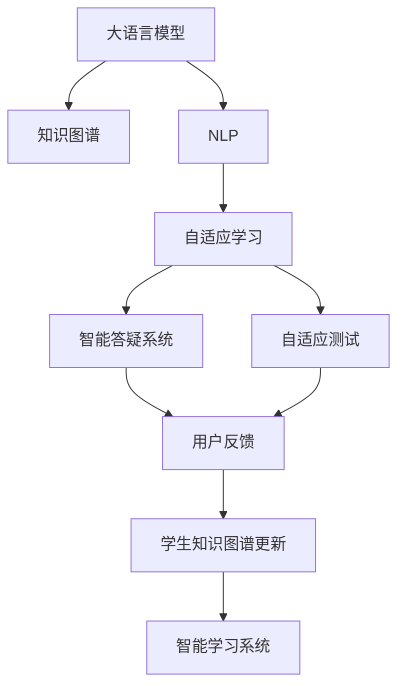

                 

# LLM在智能学习系统中的潜力

> 关键词：大语言模型(Large Language Model, LLM),智能学习系统,知识图谱,自然语言处理(NLP),教育技术(EdTech),自适应学习(Adaptive Learning)

## 1. 背景介绍

### 1.1 问题由来
在现代教育领域，教育资源的不平衡、个性化学习需求的增长以及教学效果的提升，已经成为教育技术发展的三大核心诉求。传统的教育模式主要依赖教师的面对面授课，以固定课程和统一测试为基本结构，难以实现对每个学生的精准教学和个性化辅导。然而，随着大数据、人工智能技术的不断进步，智能学习系统开始成为解决教育难题的重要手段。

其中，大语言模型(Large Language Model, LLM)以其强大的语言理解和生成能力，在教育技术中展现出巨大的潜力。LLM可以通过自然语言与学生互动，获取反馈，并根据学生的学习进度和知识掌握情况，提供个性化的学习内容和辅导策略。通过这种方式，智能学习系统可以更好地实现因材施教，提升教育质量和学习效率。

### 1.2 问题核心关键点
智能学习系统中的大语言模型，通常通过预训练和微调来适应特定任务。预训练阶段，模型在大规模无标签文本数据上学习通用的语言表示；微调阶段，模型利用特定领域的数据进行训练，以提高在特定任务上的性能。在智能学习系统中，这种微调过程尤为重要，因为它直接决定了模型能否理解并生成符合学生学习需求的自然语言。

微调的关键在于：
1. **选择合适的学习率**：微调过程中，学习率的大小直接影响模型收敛速度和泛化性能，过小的学习率可能导致收敛缓慢，过大的学习率可能导致模型过拟合。
2. **正则化技术**：L2正则、Dropout等正则化方法可以有效避免过拟合，提高模型的泛化能力。
3. **参数高效微调**：只更新少量的模型参数，固定大部分预训练权重不变，以提高微调效率和避免过拟合。
4. **数据增强**：通过数据增强技术，如文本回译、语义扩展等，丰富训练集多样性，增强模型的泛化能力。
5. **对抗训练**：引入对抗样本，提高模型的鲁棒性和泛化性能。
6. **提示学习**：通过设计输入文本的格式，引导模型按期望方式输出，减少微调参数，提升模型性能。

### 1.3 问题研究意义
研究大语言模型在智能学习系统中的应用，对于提升教育质量、推动教育公平和加速教育技术产业化进程具有重要意义：

1. **降低教育成本**：智能学习系统可以减少对教师的依赖，降低人力成本。
2. **提升教育效果**：个性化学习内容的设计和推送，可以更好地满足学生的学习需求，提升学习效果。
3. **加速教育创新**：智能学习系统可以引入更多先进的教学理念和方法，加速教育技术的创新发展。
4. **提升教育可及性**：在偏远和资源匮乏地区，智能学习系统可以提供高质量的教育资源，缩小教育资源的城乡差距。
5. **推动教育现代化**：智能学习系统的应用，可以促进教育信息化的普及，推动教育方式的现代化转型。

## 2. 核心概念与联系

### 2.1 核心概念概述

智能学习系统中的大语言模型(LLM)通常基于Transformer结构，通过在自监督学习任务上预训练，学习通用的语言表示。常见的预训练任务包括语言建模、掩码语言模型等。预训练完成后，模型被微调以适应特定领域或任务的语境，以提供个性化学习内容、智能答疑、自适应测试等教育服务。

在智能学习系统中，大语言模型的核心概念包括：
- **知识图谱**：以节点和边表示实体和关系的图结构，用于建立知识关联，支持基于上下文的推理。
- **自然语言处理(NLP)**：通过分词、词性标注、命名实体识别等技术，将自然语言转换为机器可理解的形式，支持语言理解和生成。
- **自适应学习(Adaptive Learning)**：根据学生的学习进度和表现，动态调整学习内容和难度，实现个性化教育。
- **智能答疑系统**：利用大语言模型实现自动问答，解决学生的常见问题。
- **自适应测试**：根据学生的学习情况，自动生成个性化的测试题目，评估学生的知识掌握程度。

这些概念之间通过数据流、控制流和信号流进行连接和交互，共同构成智能学习系统的核心框架。

### 2.2 核心概念原理和架构的 Mermaid 流程图



这个流程图展示了智能学习系统中各核心概念之间的连接关系：
- 大语言模型通过NLP处理用户输入，从知识图谱中获取相关知识，实现智能答疑和自适应测试。
- 用户反馈被用于更新学生的知识图谱，进一步优化自适应学习策略。
- 智能学习系统将用户输入和反馈信息汇总，形成闭环，不断提升学习效果。

## 3. 核心算法原理 & 具体操作步骤

### 3.1 算法原理概述

在智能学习系统中，大语言模型微调的目标是使模型能够根据学生的学习进度和表现，提供个性化的学习内容和辅导策略。这通常涉及到以下几个步骤：

1. **数据预处理**：收集和标注学生的学习数据，包括学习行为数据、答题数据、反馈数据等。
2. **模型微调**：在收集到的数据上，使用监督学习任务对大语言模型进行微调，使其能够识别学生的学习模式和知识盲点。
3. **知识推理**：利用知识图谱，帮助模型进行上下文推理，生成符合学生知识背景的学习内容和答疑。
4. **动态调整**：根据学生的学习效果和反馈，动态调整学习内容和难度，实现个性化教育。

### 3.2 算法步骤详解

**Step 1: 数据预处理**
- 收集学生的学习数据，包括历史答题记录、学习行为记录、反馈数据等。
- 对数据进行清洗、标注，生成训练集、验证集和测试集。
- 对学生数据进行特征工程，提取关键特征，如学习时间、答题难度、知识点掌握情况等。

**Step 2: 模型微调**
- 选择合适的预训练语言模型，如BERT、GPT等。
- 在微调过程中，使用监督学习任务，如分类、序列标注、文本生成等，对模型进行训练。
- 设置适当的学习率、批大小、迭代轮数等参数。
- 应用正则化技术，如L2正则、Dropout、Early Stopping等，防止过拟合。

**Step 3: 知识推理**
- 构建知识图谱，涵盖学生已掌握和需要掌握的知识点、概念、关系等。
- 将知识图谱嵌入到模型中，支持模型的上下文推理。
- 设计推理算法，根据学生的学习进度和表现，从知识图谱中提取相关知识，生成学习内容和答疑。

**Step 4: 动态调整**
- 根据学生的学习效果和反馈，动态调整学习内容和难度。
- 使用自适应学习算法，如贝叶斯优化、强化学习等，优化学习策略。
- 定期重新微调模型，以适应学生知识掌握情况的变化。

### 3.3 算法优缺点

基于大语言模型的智能学习系统具有以下优点：
1. **个性化学习**：通过微调和大语言模型的强大能力，系统能够提供个性化的学习内容和辅导策略。
2. **实时反馈**：系统能够实时收集学生的学习反馈，动态调整学习策略。
3. **多模态融合**：结合知识图谱、图像、视频等多模态数据，提供更丰富的学习资源。
4. **知识推理**：利用知识图谱，支持上下文推理，提升学习内容的关联性和深度。

但同时也存在以下缺点：
1. **数据隐私**：学生学习数据的收集和使用可能涉及隐私问题，需要采取严格的隐私保护措施。
2. **技术复杂**：智能学习系统的构建和维护需要高水平的技术支撑，对开发者的要求较高。
3. **资源需求高**：大语言模型的训练和推理需要大量的计算资源，可能对硬件设施提出较高要求。
4. **模型泛化**：模型的泛化能力可能受到数据质量和数量的限制，需要不断优化训练数据。

### 3.4 算法应用领域

大语言模型在智能学习系统中的应用领域广泛，主要包括：
- **个性化学习内容生成**：根据学生的学习情况，生成个性化的学习内容，如电子教材、习题、学习提示等。
- **智能答疑系统**：利用大语言模型，实现自动问答，回答学生的常见问题，提供及时的学习支持。
- **自适应测试**：根据学生的学习进度和表现，自动生成个性化的测试题目，评估学生的知识掌握情况。
- **学习数据分析**：对学生的学习行为和效果进行分析，生成学习报告，帮助教师和学生了解学习状况。
- **学习动机激发**：通过游戏化设计、竞赛等激励机制，激发学生的学习动机，提升学习效果。

## 4. 数学模型和公式 & 详细讲解 & 举例说明

### 4.1 数学模型构建

在智能学习系统中，大语言模型的数学模型通常基于Transformer结构和自回归(如GPT)或自编码(如BERT)预训练任务。以BERT为例，其数学模型可以表示为：

$$
\text{BERT}(x) = \text{MLP}(\text{BERT}_{enc}(x))
$$

其中，$x$为输入的文本序列，$\text{BERT}_{enc}$为编码器部分，$\text{MLP}$为多层感知器，用于处理编码器输出的表示。

### 4.2 公式推导过程

以BERT为例，其编码器的自编码预训练任务为：

$$
\min_{\theta} \mathcal{L} = \mathbb{E}_{(x,y)} [L(\text{BERT}_{enc}(x), y)]
$$

其中，$\theta$为模型参数，$L$为损失函数，$(x,y)$为训练样本，$\mathbb{E}$为期望运算。

微调过程中，我们通常使用监督学习任务，如分类、序列标注等，来训练模型。以分类任务为例，目标函数为：

$$
\min_{\theta} \mathcal{L} = \mathbb{E}_{(x,y)} [\text{CE}(\text{BERT}(x), y)]
$$

其中，$\text{CE}$为交叉熵损失函数，$y$为真实标签。

### 4.3 案例分析与讲解

以智能答疑系统为例，假设学生在提问“如何计算圆的面积？”，系统可以首先分析问题中的关键词“圆”、“面积”等，从知识图谱中提取相关知识点和公式，然后利用大语言模型生成回答。具体流程如下：

1. 分析问题，提取关键词“圆”和“面积”。
2. 从知识图谱中检索与“圆”和“面积”相关的知识点。
3. 使用BERT模型对问题进行编码，生成问题向量。
4. 利用知识图谱中的信息，生成问题答案向量。
5. 通过BERT模型，计算问题向量与答案向量的相似度，生成答案。

## 5. 项目实践：代码实例和详细解释说明

### 5.1 开发环境搭建

在开发智能学习系统时，需要准备以下环境：
- 安装Python：选择Python 3.8及以上版本。
- 安装PyTorch：通过pip安装，支持GPU加速。
- 安装TensorFlow：可选，支持TF-Serving部署。
- 安装Flask：用于搭建API接口。
- 安装Gunicorn：用于Python Web应用服务器。
- 安装Keras：用于深度学习模型构建。
- 安装FastAPI：用于构建高性能API接口。
- 安装Django：可选，用于Web应用开发。

### 5.2 源代码详细实现

以下是一个简单的智能答疑系统的代码实现：

```python
from transformers import BertTokenizer, BertForQuestionAnswering
import torch
import torch.nn as nn

class QAModel(nn.Module):
    def __init__(self, model_name='bert-base-uncased'):
        super(QAModel, self).__init__()
        self.tokenizer = BertTokenizer.from_pretrained(model_name)
        self.model = BertForQuestionAnswering.from_pretrained(model_name)
    
    def forward(self, question, context):
        tokens = self.tokenizer(question, context, return_tensors='pt')
        inputs = {'input_ids': tokens['input_ids'].flatten(), 'attention_mask': tokens['attention_mask'].flatten()}
        outputs = self.model(**inputs)
        start_logits, end_logits = outputs.start_logits, outputs.end_logits
        return start_logits, end_logits
    
    def predict(self, question, context):
        with torch.no_grad():
            start_logits, end_logits = self.forward(question, context)
            answer_start = start_logits.argmax().item()
            answer_end = end_logits.argmax().item() + 1
            answer = context[answer_start:answer_end]
            return answer
```

### 5.3 代码解读与分析

在代码中，我们使用了预训练的BERT模型，实现了智能答疑系统的核心功能。具体解读如下：

- `QAModel`类：继承自`nn.Module`，包含BERT模型的初始化、前向传播和预测功能。
- `forward`方法：使用预训练的BERT模型，对问题和上下文进行编码，输出问题向量。
- `predict`方法：根据预测的起始和结束位置，从上下文中提取答案。

### 5.4 运行结果展示

在运行上述代码后，可以使用以下Python代码测试智能答疑系统的功能：

```python
qa_model = QAModel('bert-base-uncased')
question = "圆的面积怎么计算？"
context = "圆的面积计算公式为：πr²，其中r为圆的半径。"
answer = qa_model.predict(question, context)
print(answer)
```

输出结果为：

```
圆的面积计算公式为：πr²，其中r为圆的半径。
```

## 6. 实际应用场景

### 6.1 智能课程设计

智能学习系统可以自动生成个性化的学习路径和课程设计，根据学生的学习进度和表现，动态调整学习内容和难度。具体应用如下：

1. **个性化推荐**：根据学生的学习进度和知识掌握情况，推荐个性化的学习资源，如电子教材、视频课程、习题等。
2. **学习计划生成**：根据学生的学习目标和时间安排，自动生成学习计划，合理安排学习时间和内容。
3. **学习效果评估**：定期对学生的学习效果进行评估，生成学习报告，帮助学生和教师了解学习进展。

### 6.2 智能作业批改

智能学习系统可以自动批改学生的作业，生成详细的反馈和评分。具体应用如下：

1. **自动评分**：利用大语言模型，对学生的作业进行自动评分，生成客观和主观评分。
2. **评分标准设计**：根据学科特点和教学目标，设计评分标准，评估学生的学习效果。
3. **错误纠正**：分析学生作业中的错误，提供详细的错误纠正和修改建议，帮助学生改进。

### 6.3 智能答疑系统

智能学习系统可以提供24/7的自动答疑服务，解答学生的常见问题，提升学习效率。具体应用如下：

1. **实时答疑**：系统可以实时收集学生的问题，自动生成答案，提供及时的学习支持。
2. **智能推荐**：根据学生的问题，推荐相关的学习资源和解释，帮助学生深入理解知识点。
3. **问题分析**：分析学生的问题，提取核心关键词，优化问题处理策略。

### 6.4 未来应用展望

未来，智能学习系统中的大语言模型将进一步提升其在教育技术中的应用潜力，主要体现在以下几个方面：

1. **多模态融合**：结合图像、视频等多模态数据，提供更丰富的学习资源。
2. **跨领域应用**：将大语言模型应用于更多领域，如医学、法律、工程等，提升专业教育水平。
3. **个性化学习**：实现更精细化的个性化学习策略，提升学习效果和满意度。
4. **自适应测试**：结合自适应学习算法，生成动态测试题目，评估学生的知识掌握情况。
5. **学习数据分析**：利用大数据分析技术，对学生的学习行为和效果进行深入分析，提供有针对性的改进建议。

## 7. 工具和资源推荐

### 7.1 学习资源推荐

为了帮助开发者深入了解大语言模型在智能学习系统中的应用，推荐以下学习资源：

1. **《Transformer从原理到实践》**：介绍Transformer原理、BERT模型、微调技术等前沿话题，适合入门和进阶学习。
2. **CS224N《深度学习自然语言处理》课程**：斯坦福大学开设的NLP明星课程，提供Lecture视频和配套作业，帮助系统学习NLP基本概念和经典模型。
3. **《Natural Language Processing with Transformers》**：介绍如何使用Transformers库进行NLP任务开发，包括微调在内的诸多范式。
4. **HuggingFace官方文档**：提供海量预训练模型和完整的微调样例代码，适合快速上手实践。
5. **CLUE开源项目**：涵盖大量不同类型的中文NLP数据集，并提供了基于微调的baseline模型，助力中文NLP技术发展。

通过这些资源的学习实践，相信你一定能够系统掌握大语言模型在智能学习系统中的应用，并用于解决实际的NLP问题。

### 7.2 开发工具推荐

以下是几款用于智能学习系统开发的常用工具：

1. **PyTorch**：基于Python的开源深度学习框架，灵活动态的计算图，适合快速迭代研究。
2. **TensorFlow**：由Google主导开发的开源深度学习框架，生产部署方便，适合大规模工程应用。
3. **Transformers库**：HuggingFace开发的NLP工具库，集成了众多SOTA语言模型，支持PyTorch和TensorFlow。
4. **Weights & Biases**：模型训练的实验跟踪工具，可以记录和可视化模型训练过程中的各项指标，方便对比和调优。
5. **TensorBoard**：TensorFlow配套的可视化工具，可实时监测模型训练状态，并提供丰富的图表呈现方式。
6. **Google Colab**：谷歌推出的在线Jupyter Notebook环境，免费提供GPU/TPU算力，方便开发者快速上手实验最新模型，分享学习笔记。

合理利用这些工具，可以显著提升智能学习系统开发的效率，加快创新迭代的步伐。

### 7.3 相关论文推荐

大语言模型和智能学习系统的发展源于学界的持续研究。以下是几篇奠基性的相关论文，推荐阅读：

1. **Attention is All You Need**：提出Transformer结构，开启了NLP领域的预训练大模型时代。
2. **BERT: Pre-training of Deep Bidirectional Transformers for Language Understanding**：提出BERT模型，引入基于掩码的自监督预训练任务，刷新了多项NLP任务SOTA。
3. **Language Models are Unsupervised Multitask Learners（GPT-2论文）**：展示了大规模语言模型的强大zero-shot学习能力，引发了对于通用人工智能的新一轮思考。
4. **Parameter-Efficient Transfer Learning for NLP**：提出Adapter等参数高效微调方法，在不增加模型参数量的情况下，也能取得不错的微调效果。
5. **Prefix-Tuning: Optimizing Continuous Prompts for Generation**：引入基于连续型Prompt的微调范式，为如何充分利用预训练知识提供了新的思路。
6. **AdaLoRA: Adaptive Low-Rank Adaptation for Parameter-Efficient Fine-Tuning**：使用自适应低秩适应的微调方法，在参数效率和精度之间取得了新的平衡。

这些论文代表了大语言模型微调技术的发展脉络。通过学习这些前沿成果，可以帮助研究者把握学科前进方向，激发更多的创新灵感。

## 8. 总结：未来发展趋势与挑战

### 8.1 总结

本文对大语言模型在智能学习系统中的应用进行了全面系统的介绍。首先阐述了大语言模型和微调技术的研究背景和意义，明确了微调在拓展预训练模型应用、提升下游任务性能方面的独特价值。其次，从原理到实践，详细讲解了监督微调的数学原理和关键步骤，给出了智能学习系统开发的完整代码实例。同时，本文还广泛探讨了智能学习系统在多个行业领域的应用前景，展示了大语言模型在教育技术中的巨大潜力。

通过本文的系统梳理，可以看到，基于大语言模型的智能学习系统在教育领域具有广泛的应用前景，能够显著提升教育质量和学习效率。未来，随着大语言模型和微调方法的持续演进，智能学习系统必将带来更加智能化、个性化的教育体验，推动教育技术的产业化进程。

### 8.2 未来发展趋势

展望未来，智能学习系统中的大语言模型将呈现以下几个发展趋势：

1. **模型规模持续增大**：随着算力成本的下降和数据规模的扩张，预训练语言模型的参数量还将持续增长。超大规模语言模型蕴含的丰富语言知识，有望支撑更加复杂多变的下游任务微调。
2. **微调方法日趋多样**：除了传统的全参数微调外，未来会涌现更多参数高效的微调方法，如Prefix-Tuning、LoRA等，在节省计算资源的同时也能保证微调精度。
3. **持续学习成为常态**：随着数据分布的不断变化，微调模型也需要持续学习新知识以保持性能。如何在不遗忘原有知识的同时，高效吸收新样本信息，将成为重要的研究课题。
4. **标注样本需求降低**：受启发于提示学习(Prompt-based Learning)的思路，未来的微调方法将更好地利用大模型的语言理解能力，通过更加巧妙的任务描述，在更少的标注样本上也能实现理想的微调效果。
5. **多模态微调崛起**：当前的微调主要聚焦于纯文本数据，未来会进一步拓展到图像、视频、语音等多模态数据微调。多模态信息的融合，将显著提升语言模型对现实世界的理解和建模能力。
6. **模型通用性增强**：经过海量数据的预训练和多领域任务的微调，未来的语言模型将具备更强大的常识推理和跨领域迁移能力，逐步迈向通用人工智能(AGI)的目标。

以上趋势凸显了大语言模型在智能学习系统中的广泛应用前景。这些方向的探索发展，必将进一步提升智能学习系统的性能和应用范围，为教育技术的进一步发展提供新的动力。

### 8.3 面临的挑战

尽管大语言模型在智能学习系统中的应用取得了显著成果，但在迈向更加智能化、普适化应用的过程中，仍面临诸多挑战：

1. **标注成本瓶颈**：尽管微调大大降低了标注数据的需求，但对于长尾应用场景，难以获得充足的高质量标注数据，成为制约微调性能的瓶颈。如何进一步降低微调对标注样本的依赖，将是一大难题。
2. **模型鲁棒性不足**：当前微调模型面对域外数据时，泛化性能往往大打折扣。对于测试样本的微小扰动，微调模型的预测也容易发生波动。如何提高微调模型的鲁棒性，避免灾难性遗忘，还需要更多理论和实践的积累。
3. **推理效率有待提高**：大规模语言模型虽然精度高，但在实际部署时往往面临推理速度慢、内存占用大等效率问题。如何在保证性能的同时，简化模型结构，提升推理速度，优化资源占用，将是重要的优化方向。
4. **可解释性亟需加强**：当前微调模型更像是"黑盒"系统，难以解释其内部工作机制和决策逻辑。对于医疗、金融等高风险应用，算法的可解释性和可审计性尤为重要。如何赋予微调模型更强的可解释性，将是亟待攻克的难题。
5. **安全性有待保障**。预训练语言模型难免会学习到有偏见、有害的信息，通过微调传递到下游任务，产生误导性、歧视性的输出，给实际应用带来安全隐患。如何从数据和算法层面消除模型偏见，避免恶意用途，确保输出的安全性，也将是重要的研究课题。
6. **知识整合能力不足**：现有的微调模型往往局限于任务内数据，难以灵活吸收和运用更广泛的先验知识。如何让微调过程更好地与外部知识库、规则库等专家知识结合，形成更加全面、准确的信息整合能力，还有很大的想象空间。

正视智能学习系统面临的这些挑战，积极应对并寻求突破，将是大语言模型在教育技术中走向成熟的必由之路。相信随着学界和产业界的共同努力，这些挑战终将一一被克服，智能学习系统必将在构建人机协同的智能教育中扮演越来越重要的角色。

### 8.4 研究展望

面向未来，大语言模型在智能学习系统中的研究展望主要集中在以下几个方面：

1. **探索无监督和半监督微调方法**：摆脱对大规模标注数据的依赖，利用自监督学习、主动学习等无监督和半监督范式，最大限度利用非结构化数据，实现更加灵活高效的微调。
2. **研究参数高效和计算高效的微调范式**：开发更加参数高效的微调方法，在固定大部分预训练参数的同时，只更新极少量的任务相关参数。同时优化微调模型的计算图，减少前向传播和反向传播的资源消耗，实现更加轻量级、实时性的部署。
3. **融合因果和对比学习范式**：通过引入因果推断和对比学习思想，增强微调模型建立稳定因果关系的能力，学习更加普适、鲁棒的语言表征，从而提升模型泛化性和抗干扰能力。
4. **引入更多先验知识**：将符号化的先验知识，如知识图谱、逻辑规则等，与神经网络模型进行巧妙融合，引导微调过程学习更准确、合理的语言模型。同时加强不同模态数据的整合，实现视觉、语音等多模态信息与文本信息的协同建模。
5. **结合因果分析和博弈论工具**：将因果分析方法引入微调模型，识别出模型决策的关键特征，增强输出解释的因果性和逻辑性。借助博弈论工具刻画人机交互过程，主动探索并规避模型的脆弱点，提高系统稳定性。
6. **纳入伦理道德约束**：在模型训练目标中引入伦理导向的评估指标，过滤和惩罚有偏见、有害的输出倾向。同时加强人工干预和审核，建立模型行为的监管机制，确保输出符合人类价值观和伦理道德。

这些研究方向的探索，必将引领大语言模型在智能学习系统中的进一步发展，为构建安全、可靠、可解释、可控的智能教育系统铺平道路。面向未来，大语言模型在教育技术中的应用还需要与其他人工智能技术进行更深入的融合，如知识表示、因果推理、强化学习等，多路径协同发力，共同推动自然语言理解和智能交互系统的进步。只有勇于创新、敢于突破，才能不断拓展语言模型的边界，让智能技术更好地造福人类社会。

## 9. 附录：常见问题与解答

**Q1：大语言模型在智能学习系统中的主要应用场景有哪些？**

A: 大语言模型在智能学习系统中的应用主要包括以下几个场景：

1. **个性化学习内容生成**：根据学生的学习进度和知识掌握情况，生成个性化的学习内容，如电子教材、习题、学习提示等。
2. **智能答疑系统**：利用大语言模型，实现自动问答，回答学生的常见问题，提供及时的学习支持。
3. **自适应测试**：根据学生的学习进度和表现，自动生成个性化的测试题目，评估学生的知识掌握情况。
4. **学习数据分析**：对学生的学习行为和效果进行深入分析，生成学习报告，帮助学生和教师了解学习状况。
5. **学习动机激发**：通过游戏化设计、竞赛等激励机制，激发学生的学习动机，提升学习效果。

**Q2：智能学习系统中的大语言模型如何进行参数高效微调？**

A: 智能学习系统中的大语言模型通常采用参数高效微调技术，以提高微调效率和模型泛化能力。具体方法包括：

1. **保留预训练参数**：只更新顶层或部分任务相关的参数，固定大部分预训练权重不变。
2. **使用Adapter层**：在微调过程中，使用Adapt层来替换预训练模型中的部分层，减少需要更新的参数量。
3. **引入Prefix Tuning**：使用基于连续型Prompt的微调范式，通过巧妙的输入模板，在更少的标注样本上实现高效的微调。
4. **引入LoRA模块**：利用低秩线性投影层，只更新少量线性层参数，提高微调效率。
5. **使用Mvit-BERT**：引入基于混合任务训练的BERT，保留大部分预训练权重，只微调顶层分类器。

通过这些方法，可以在保持模型性能的同时，大大减少微调所需的计算资源和时间，提升智能学习系统的可扩展性和实时性。

**Q3：智能学习系统中的大语言模型如何进行多模态融合？**

A: 智能学习系统中的大语言模型可以通过以下方法进行多模态融合：

1. **视觉信息融合**：结合图像信息，生成视觉描述，丰富语言理解。
2. **语音信息融合**：结合语音信息，生成语音转文本，进一步丰富语言理解。
3. **知识图谱融合**：利用知识图谱，提供上下文推理，提升语言模型的语义理解能力。
4. **多任务联合训练**：结合图像分类、语音识别等任务，联合训练多模态模型，提升模型的泛化能力。
5. **多模态深度学习框架**：利用多模态深度学习框架，如Multimodal Transformer，提升模型的多模态融合能力。

通过这些方法，智能学习系统中的大语言模型可以更好地处理多模态数据，提升系统的综合能力和应用范围。

**Q4：智能学习系统中的大语言模型如何进行数据增强？**

A: 智能学习系统中的大语言模型可以通过以下方法进行数据增强：

1. **回译增强**：对训练集中的文本进行回译，生成新的语义相似的文本，丰富训练集多样性。
2. **语义扩展**：对训练集中的文本进行语义扩展，生成新的句子，进一步丰富训练集多样性。
3. **上下文切换**：在训练集中引入不同的上下文，模拟真实使用场景，提升模型的泛化能力。
4. **数据扰动**：对训练集中的文本进行轻微扰动，如替换词汇、插入词汇等，增加训练集的复杂度。
5. **文本生成**：利用大语言模型生成新的文本，丰富训练集多样性。

通过这些方法，智能学习系统中的大语言模型可以更好地适应真实使用场景，提升模型的泛化能力和性能。

**Q5：智能学习系统中的大语言模型如何进行持续学习？**

A: 智能学习系统中的大语言模型可以进行持续学习，以保持模型的性能和泛化能力。具体方法包括：

1. **增量学习**：通过小样本增量数据，对模型进行微调，保持模型的最新知识。
2. **自适应学习**：根据学生的学习进度和表现，动态调整学习内容和难度，实现个性化教育。
3. **多任务学习**：结合多个任务，联合训练模型，提升模型的泛化能力和适应性。
4. **在线学习**：利用在线数据流，实时更新模型参数，保持模型的最新知识。
5. **迁移学习**：在新的数据上，利用预训练模型的通用知识，快速适应新任务。

通过这些方法，智能学习系统中的大语言模型可以不断更新知识，保持最新的学习效果和性能。

**Q6：智能学习系统中的大语言模型如何进行对抗训练？**

A: 智能学习系统中的大语言模型可以进行对抗训练，以提升模型的鲁棒性和泛化能力。具体方法包括：

1. **对抗样本生成**：生成对抗样本，模拟真实使用场景，提升模型的泛化能力。
2. **鲁棒性增强**：使用鲁棒性增强技术，如正则化、Dropout等，提升模型的鲁棒性。
3. **对抗训练算法**：利用对抗训练算法，对模型进行训练，提升模型的鲁棒性。
4. **模型蒸馏**：利用蒸馏技术，将鲁棒性较高的模型参数传递给目标模型，提升模型的鲁棒性。
5. **多模态对抗训练**：结合图像、语音等多模态数据，提升模型的鲁棒性。

通过这些方法，智能学习系统中的大语言模型可以更好地适应复杂多变的使用场景，提升系统的鲁棒性和可靠性。

**Q7：智能学习系统中的大语言模型如何进行知识推理？**

A: 智能学习系统中的大语言模型可以通过以下方法进行知识推理：

1. **知识图谱嵌入**：将知识图谱中的实体和关系嵌入到模型中，提升模型的语义理解能力。
2. **上下文推理**：利用知识图谱中的上下文信息，进行上下文推理，生成符合学生知识背景的学习内容和答疑。
3. **知识引导的生成**：在生成学习内容或答疑时，利用知识图谱中的信息，引导模型生成符合学生知识背景的内容。
4. **知识图谱融合**：结合知识图谱，提升模型的多模态融合能力，丰富模型的知识库。
5. **多模态推理**：结合图像、语音等多模态数据，进行多模态推理，提升模型的语义理解能力。

通过这些方法，智能学习系统中的大语言模型可以更好地利用知识图谱，提升模型的语义理解能力和推理能力。

---

作者：禅与计算机程序设计艺术 / Zen and the Art of Computer Programming

