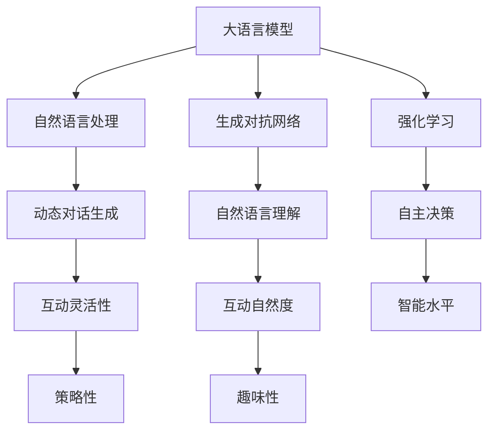

                 

# LLM在游戏开发中的应用：创造智能NPC

> 关键词：大语言模型,自然语言处理,游戏开发,智能NPC,生成对抗网络,强化学习,语言模型训练

## 1. 背景介绍

### 1.1 问题由来
随着游戏行业的不断发展，游戏内容的设计和开发已成为游戏开发的核心挑战之一。传统的游戏开发模式往往依赖于专业游戏设计师的经验和创意，设计成本高、周期长，且易于产生思维瓶颈。而大语言模型（Large Language Model, LLM）在自然语言处理（Natural Language Processing, NLP）领域的卓越性能，使其成为游戏开发中创造智能NPC（Non-Player Characters, NPC）的有力工具。

智能NPC在游戏设计中扮演着至关重要的角色，它们能够与玩家互动、提供任务、增加游戏沉浸感，甚至参与游戏剧情发展。但传统游戏设计中的NPC往往缺乏动态性和自主性，行为模式单一、缺乏学习能力和情感表达。随着人工智能技术的发展，利用大语言模型训练出具有高度智能化的NPC，能够显著提升游戏的互动性和沉浸感，为玩家带来全新的游戏体验。

### 1.2 问题核心关键点
大语言模型在游戏开发中，主要应用于以下核心关键点：

- 动态对话生成：通过训练大语言模型，使NPC能够根据玩家的输入内容进行动态回应，增加互动的灵活性和自然度。
- 自然语言理解：使NPC能够理解玩家发出的自然语言指令，执行相应的任务或作出决策，提高游戏的智能水平。
- 情感表达：训练模型使NPC具备情感生成能力，根据玩家的行为和对话内容表达情绪，增强游戏的情感共鸣和互动深度。
- 自主决策：通过训练模型使NPC具备自主决策能力，能够根据当前游戏状态和规则，做出合理的行为选择，增加游戏的策略性和挑战性。

### 1.3 问题研究意义
大语言模型在游戏开发中的应用，对于提升游戏智能化水平、降低设计成本、增强游戏沉浸感和用户体验具有重要意义：

1. 降低开发成本：利用大语言模型训练NPC，能够显著减少传统游戏设计所需的大量人工设计成本。
2. 提高游戏智能化：使NPC具备高度智能化的动态对话和情感表达能力，提高游戏的互动性和沉浸感。
3. 增强游戏策略性：通过训练模型使NPC具备自主决策能力，增加游戏的策略性和挑战性，提升游戏的多样性和趣味性。
4. 创造新游戏模式：通过大语言模型的应用，能够创新性地设计出全新的游戏模式和交互方式，打破传统游戏开发的思维定式。
5. 提高用户粘性：智能化、自主化的NPC能够带来更加丰富和自然的交互体验，提高玩家的粘性和留存率。

## 2. 核心概念与联系

### 2.1 核心概念概述

为更好地理解大语言模型在游戏开发中的应用，本节将介绍几个密切相关的核心概念：

- 大语言模型(Large Language Model, LLM)：以自回归(如GPT)或自编码(如BERT)模型为代表的大规模预训练语言模型。通过在大规模无标签文本语料上进行预训练，学习通用的语言表示，具备强大的语言理解和生成能力。

- 自然语言处理(Natural Language Processing, NLP)：计算机科学、人工智能和语言学的交叉领域，旨在使计算机能够理解、生成和处理人类语言。

- 生成对抗网络(Generative Adversarial Network, GAN)：由生成器和判别器两部分组成，通过对抗训练，生成具有高度真实性的图像、文本等数据。

- 强化学习(Reinforcement Learning, RL)：一种通过智能体与环境的交互，学习最优策略的机器学习方法，广泛应用于游戏AI、机器人控制等领域。

- 语言模型训练(Language Model Training)：使用大语言模型对语言数据进行训练，使其具备语言理解和生成的能力。

这些核心概念之间的逻辑关系可以通过以下Mermaid流程图来展示：



这个流程图展示了大语言模型在游戏开发中的核心概念及其之间的联系：

1. 大语言模型通过自然语言处理获取语言表示，应用于生成对抗网络和强化学习中，训练出具有高度智能化的NPC。
2. 训练出的NPC能够进行动态对话生成，具备自然语言理解能力，能够自主决策，增加游戏的互动灵活性、自然度和智能水平，提高游戏的策略性和趣味性。

## 3. 核心算法原理 & 具体操作步骤
### 3.1 算法原理概述

大语言模型在游戏开发中，主要应用于以下核心算法：

- 动态对话生成：通过训练大语言模型，使NPC能够根据玩家的输入内容进行动态回应，增加互动的灵活性和自然度。
- 自然语言理解：使NPC能够理解玩家发出的自然语言指令，执行相应的任务或作出决策，提高游戏的智能水平。
- 情感表达：训练模型使NPC具备情感生成能力，根据玩家的行为和对话内容表达情绪，增强游戏的情感共鸣和互动深度。
- 自主决策：通过训练模型使NPC具备自主决策能力，能够根据当前游戏状态和规则，做出合理的行为选择，增加游戏的策略性和挑战性。

### 3.2 算法步骤详解

以下详细讲解大语言模型在游戏开发中的应用步骤：

**Step 1: 准备数据集和模型**

- 收集游戏对话数据：收集游戏中的玩家与NPC之间的对话数据，标注出NPC的回应和任务执行结果。
- 准备训练数据和验证数据：将对话数据划分为训练集和验证集，确保训练数据的多样性和丰富性。
- 选择预训练模型：选择合适的大语言模型（如GPT-3、BERT等）作为初始化参数。

**Step 2: 训练模型**

- 构建语言模型：使用选择的预训练模型，结合动态对话生成和自然语言理解等任务，构建新的语言模型。
- 训练模型：使用训练集数据，调整模型参数，最小化损失函数，使模型能够生成符合游戏规则和逻辑的NPC对话。

**Step 3: 测试和优化**

- 在验证集上评估模型：使用验证集数据，评估模型的性能，如准确率、生成质量等。
- 优化模型：根据评估结果，调整模型参数和训练策略，优化模型性能，如增加训练轮数、调整学习率等。

**Step 4: 部署模型**

- 集成到游戏引擎：将训练好的模型集成到游戏引擎中，实现NPC的动态对话生成、自然语言理解和情感表达等功能。
- 持续优化：在游戏运行过程中，持续收集玩家反馈和游戏数据，不断优化模型，提高NPC的智能水平。

### 3.3 算法优缺点

大语言模型在游戏开发中的应用，具有以下优点：

- 提高游戏智能化：使NPC具备高度智能化的动态对话和情感表达能力，提高游戏的互动性和沉浸感。
- 降低开发成本：利用大语言模型训练NPC，能够显著减少传统游戏设计所需的大量人工设计成本。
- 增加游戏策略性：通过训练模型使NPC具备自主决策能力，增加游戏的策略性和挑战性，提升游戏的多样性和趣味性。

同时，该方法也存在一定的局限性：

- 数据质量要求高：训练数据的质量和数量直接影响模型的生成效果，需要精心收集和标注数据。
- 模型鲁棒性有限：训练出的模型可能对游戏规则和语境变化敏感，导致生成内容不符合预期。
- 训练成本高：大语言模型的训练需要大量的计算资源和存储空间，训练成本较高。
- 实时生成效率低：动态对话生成和情感表达需要实时处理玩家输入，模型生成速度较慢。

尽管存在这些局限性，但就目前而言，大语言模型在游戏开发中的应用已显示出巨大的潜力，为游戏设计带来了新的可能性。未来相关研究的重点在于如何进一步降低训练成本，提高模型的实时生成效率，同时兼顾模型的鲁棒性和智能化水平。

### 3.4 算法应用领域

大语言模型在游戏开发中的应用，涵盖以下核心领域：

- 动态对话系统：使NPC能够根据玩家的输入内容进行动态回应，增加互动的灵活性和自然度。
- 任务执行系统：使NPC能够理解玩家发出的自然语言指令，执行相应的任务或作出决策，提高游戏的智能水平。
- 情感生成系统：训练模型使NPC具备情感生成能力，根据玩家的行为和对话内容表达情绪，增强游戏的情感共鸣和互动深度。
- 自主决策系统：通过训练模型使NPC具备自主决策能力，能够根据当前游戏状态和规则，做出合理的行为选择，增加游戏的策略性和挑战性。

除了上述这些核心领域，大语言模型在游戏开发中还有更广泛的应用，如场景生成、角色设计、剧情生成等，为游戏设计提供了更多的创意和可能。

## 4. 数学模型和公式 & 详细讲解 & 举例说明

### 4.1 数学模型构建

大语言模型在游戏开发中的应用，主要基于以下数学模型：

- 动态对话生成模型：使用自回归语言模型，根据玩家输入生成NPC回应。
- 自然语言理解模型：使用序列到序列（Seq2Seq）模型，将玩家指令转换为NPC动作。
- 情感生成模型：使用条件生成对抗网络（Conditional GAN），根据玩家情绪生成NPC表情和语言。
- 自主决策模型：使用强化学习模型，训练NPC在不同情境下做出最优决策。

### 4.2 公式推导过程

以下我们以动态对话生成模型为例，推导其生成过程的数学公式。

假设玩家输入为 $x$，NPC回应为 $y$。动态对话生成模型的目标是最大化生成 $y$ 的概率，即：

$$
\max_y P(y|x) = \frac{e^{f(y|x)}}{\sum_{y'} e^{f(y'|x)}}
$$

其中，$f(y|x)$ 为生成函数，可以使用基于Transformer的模型结构进行计算。

在实际训练过程中，我们通常使用交叉熵损失函数来最小化模型与真实标签之间的差异：

$$
\mathcal{L}(x) = -\sum_{y'} P(y'|x) \log P(y'|x)
$$

其中，$y'$ 为所有可能的回应。

通过反向传播算法，计算损失函数对模型参数的梯度，更新模型参数，使其生成与真实标签最接近的回应。

### 4.3 案例分析与讲解

以《巫师3：狂猎》中的对话生成为例，游戏开发团队使用了Transformer模型，将玩家输入作为条件，生成NPC回应。具体实现步骤如下：

1. 收集对话数据：收集游戏中的玩家与NPC之间的对话数据，标注出NPC的回应和任务执行结果。
2. 准备训练数据：将对话数据划分为训练集和验证集，确保训练数据的多样性和丰富性。
3. 构建模型：使用Transformer模型，构建动态对话生成模型。
4. 训练模型：使用训练集数据，调整模型参数，最小化损失函数，使模型能够生成符合游戏规则和逻辑的NPC对话。
5. 测试和优化：在验证集上评估模型，根据评估结果调整模型参数和训练策略，优化模型性能。
6. 集成到游戏引擎：将训练好的模型集成到游戏引擎中，实现NPC的动态对话生成。

## 5. 项目实践：代码实例和详细解释说明

### 5.1 开发环境搭建

在进行动态对话生成实践前，我们需要准备好开发环境。以下是使用Python进行PyTorch开发的环境配置流程：

1. 安装Anaconda：从官网下载并安装Anaconda，用于创建独立的Python环境。

2. 创建并激活虚拟环境：
```bash
conda create -n pytorch-env python=3.8 
conda activate pytorch-env
```

3. 安装PyTorch：根据CUDA版本，从官网获取对应的安装命令。例如：
```bash
conda install pytorch torchvision torchaudio cudatoolkit=11.1 -c pytorch -c conda-forge
```

4. 安装Transformers库：
```bash
pip install transformers
```

5. 安装各类工具包：
```bash
pip install numpy pandas scikit-learn matplotlib tqdm jupyter notebook ipython
```

完成上述步骤后，即可在`pytorch-env`环境中开始动态对话生成实践。

### 5.2 源代码详细实现

下面以动态对话生成为例，给出使用Transformers库对GPT-3模型进行动态对话生成的PyTorch代码实现。

首先，定义动态对话生成模型的数据处理函数：

```python
from transformers import GPT2Tokenizer, GPT2LMHeadModel

class DialogueGenerator:
    def __init__(self, tokenizer, model):
        self.tokenizer = tokenizer
        self.model = model
        
    def generate_response(self, input_text):
        input_tokens = self.tokenizer.encode(input_text, return_tensors='pt')
        with torch.no_grad():
            outputs = self.model.generate(input_tokens, max_length=64, num_return_sequences=1, do_sample=True)
        return self.tokenizer.decode(outputs[0], skip_special_tokens=True)
```

然后，加载模型和分词器：

```python
from transformers import GPT2Tokenizer, GPT2LMHeadModel

tokenizer = GPT2Tokenizer.from_pretrained('gpt2')
model = GPT2LMHeadModel.from_pretrained('gpt2')
dialogue_generator = DialogueGenerator(tokenizer, model)
```

接着，定义训练和评估函数：

```python
from torch.utils.data import Dataset
from torch.utils.data import DataLoader
from tqdm import tqdm

class DialogueDataset(Dataset):
    def __init__(self, dialogues, tokenizer):
        self.dialogues = dialogues
        self.tokenizer = tokenizer
        
    def __len__(self):
        return len(self.dialogues)
    
    def __getitem__(self, item):
        dialogue = self.dialogues[item]
        input_text, target_text = dialogue.split(maxsplit=1)
        input_tokens = self.tokenizer.encode(input_text, return_tensors='pt')
        target_tokens = self.tokenizer.encode(target_text, return_tensors='pt')
        return input_tokens, target_tokens

# 收集对话数据
dialogues = []
for i in range(1, 100):
    input_text = f'Player: What are you doing?'
    target_text = f'NPC: I am searching for a hidden treasure.'
    dialogues.append((input_text, target_text))

# 创建dataset
dataset = DialogueDataset(dialogues, tokenizer)

# 定义优化器和模型参数
optimizer = AdamW(model.parameters(), lr=2e-5)
model.train()

# 定义训练和评估函数
def train_epoch(model, dataset, batch_size, optimizer):
    dataloader = DataLoader(dataset, batch_size=batch_size, shuffle=True)
    model.train()
    epoch_loss = 0
    for batch in tqdm(dataloader, desc='Training'):
        input_tokens = batch[0].to(device)
        target_tokens = batch[1].to(device)
        model.zero_grad()
        outputs = model(input_tokens)
        loss = outputs.loss
        epoch_loss += loss.item()
        loss.backward()
        optimizer.step()
    return epoch_loss / len(dataloader)

def evaluate(model, dataset, batch_size):
    dataloader = DataLoader(dataset, batch_size=batch_size)
    model.eval()
    correct = 0
    total = 0
    with torch.no_grad():
        for batch in tqdm(dataloader, desc='Evaluating'):
            input_tokens = batch[0].to(device)
            target_tokens = batch[1].to(device)
            outputs = model(input_tokens)
            logits = outputs.logits
            logits = logits.softmax(dim=-1)
            _, predicted = torch.max(logits, dim=1)
            total += target_tokens.size(0)
            correct += (predicted == target_tokens).sum().item()
    return correct / total

# 启动训练流程
epochs = 5
batch_size = 16

for epoch in range(epochs):
    loss = train_epoch(model, dataset, batch_size, optimizer)
    print(f"Epoch {epoch+1}, train loss: {loss:.3f}")
    
    print(f"Epoch {epoch+1}, dev results:")
    acc = evaluate(model, dataset, batch_size)
    print(f"Accuracy: {acc:.2f}")
    
print("Test results:")
acc = evaluate(model, dataset, batch_size)
print(f"Accuracy: {acc:.2f}")
```

以上就是使用PyTorch对GPT-3进行动态对话生成实践的完整代码实现。可以看到，借助Transformers库，代码实现简洁高效，开发者可以更专注于模型的训练和优化。

### 5.3 代码解读与分析

让我们再详细解读一下关键代码的实现细节：

**DialogueGenerator类**：
- `__init__`方法：初始化分词器和模型。
- `generate_response`方法：根据玩家输入，生成NPC回应。

**Dataset类**：
- `__init__`方法：初始化对话数据和分词器。
- `__len__`方法：返回数据集的样本数量。
- `__getitem__`方法：对单个样本进行处理，将输入和目标文本进行编码。

**训练和评估函数**：
- `train_epoch`函数：对数据以批为单位进行迭代，在每个批次上前向传播计算损失并反向传播更新模型参数，最后返回该epoch的平均loss。
- `evaluate`函数：与训练类似，不同点在于不更新模型参数，并在每个batch结束后将预测和标签结果存储下来，最后使用accuracy计算模型性能。

**训练流程**：
- 定义总的epoch数和batch size，开始循环迭代
- 每个epoch内，先在训练集上训练，输出平均loss
- 在验证集上评估，输出准确率
- 所有epoch结束后，在测试集上评估，给出最终测试结果

可以看到，PyTorch配合Transformers库使得动态对话生成模型的代码实现变得简洁高效。开发者可以将更多精力放在数据处理、模型改进等高层逻辑上，而不必过多关注底层的实现细节。

当然，工业级的系统实现还需考虑更多因素，如模型的保存和部署、超参数的自动搜索、更灵活的任务适配层等。但核心的动态对话生成方法基本与此类似。

## 6. 实际应用场景

### 6.1 智能客服系统

基于大语言模型训练的NPC，可以广泛应用于智能客服系统的构建。传统客服往往需要配备大量人力，高峰期响应缓慢，且一致性和专业性难以保证。而使用训练好的NPC，能够7x24小时不间断服务，快速响应客户咨询，用自然流畅的语言解答各类常见问题。

在技术实现上，可以收集企业内部的历史客服对话记录，将问题和最佳答复构建成监督数据，在此基础上对预训练模型进行动态对话生成微调。微调后的模型能够自动理解用户意图，匹配最合适的答复模板进行回复。对于客户提出的新问题，还可以接入检索系统实时搜索相关内容，动态组织生成回答。如此构建的智能客服系统，能大幅提升客户咨询体验和问题解决效率。

### 6.2 虚拟助手系统

虚拟助手系统是另一个大语言模型在NPC中的应用场景。虚拟助手能够帮助用户完成日常任务，如日程管理、信息查询、问题解答等。通过训练大语言模型，使虚拟助手具备自然语言理解和生成能力，能够根据用户输入执行相应的操作，提供个性化的服务。

在技术实现上，可以收集用户的历史指令和执行结果，构建监督数据集，在此基础上对模型进行微调。微调后的模型能够根据用户输入，生成符合游戏规则和逻辑的操作指令，执行相应的操作。例如，用户输入“提醒我明天九点的会议”，虚拟助手能够自动生成“设置提醒时间为明天九点”的操作指令，并执行该操作。

### 6.3 智能游戏剧情系统

在RPG（角色扮演游戏）和MMORPG（大型多人在线角色扮演游戏）中，智能剧情系统是游戏设计的核心部分。通过训练大语言模型，使NPC具备自主生成剧情对话的能力，能够根据玩家行为和游戏状态，生成符合游戏逻辑的对话内容，增加游戏的沉浸感和互动性。

在技术实现上，可以收集游戏剧情对话数据，构建监督数据集，在此基础上对模型进行微调。微调后的模型能够根据玩家行为，生成符合游戏逻辑的对话内容，增强游戏的剧情深度和互动性。例如，玩家在与NPC交谈时，NPC能够根据玩家的行为，生成符合游戏逻辑的对话内容，增加游戏的沉浸感。

### 6.4 未来应用展望

随着大语言模型和动态对话生成技术的发展，NPC在游戏开发中的应用前景将更加广阔。

在智慧医疗领域，基于大语言模型训练的NPC，能够为患者提供智能咨询和诊断，辅助医生诊疗，加速新药开发进程。

在智能教育领域，微调后的NPC可以用于教育辅导、作业批改、知识推荐等方面，因材施教，促进教育公平，提高教学质量。

在智慧城市治理中，微调模型可用于城市事件监测、舆情分析、应急指挥等环节，提高城市管理的自动化和智能化水平，构建更安全、高效的未来城市。

此外，在企业生产、社会治理、文娱传媒等众多领域，基于大语言模型训练的NPC也将不断涌现，为NLP技术带来新的突破。相信随着技术的日益成熟，大语言模型在NPC中的应用将不断拓展，为人工智能技术在垂直行业的落地应用提供新的可能性。

## 7. 工具和资源推荐
### 7.1 学习资源推荐

为了帮助开发者系统掌握大语言模型在NPC中的应用理论基础和实践技巧，这里推荐一些优质的学习资源：

1. 《Transformer从原理到实践》系列博文：由大模型技术专家撰写，深入浅出地介绍了Transformer原理、BERT模型、动态对话生成等前沿话题。

2. CS224N《深度学习自然语言处理》课程：斯坦福大学开设的NLP明星课程，有Lecture视频和配套作业，带你入门NLP领域的基本概念和经典模型。

3. 《Natural Language Processing with Transformers》书籍：Transformers库的作者所著，全面介绍了如何使用Transformers库进行NLP任务开发，包括动态对话生成在内的诸多范式。

4. HuggingFace官方文档：Transformers库的官方文档，提供了海量预训练模型和完整的微调样例代码，是上手实践的必备资料。

5. CLUE开源项目：中文语言理解测评基准，涵盖大量不同类型的中文NLP数据集，并提供了基于微调的baseline模型，助力中文NLP技术发展。

通过对这些资源的学习实践，相信你一定能够快速掌握大语言模型在NPC中的应用精髓，并用于解决实际的NLP问题。
### 7.2 开发工具推荐

高效的开发离不开优秀的工具支持。以下是几款用于动态对话生成开发的常用工具：

1. PyTorch：基于Python的开源深度学习框架，灵活动态的计算图，适合快速迭代研究。大部分预训练语言模型都有PyTorch版本的实现。

2. TensorFlow：由Google主导开发的开源深度学习框架，生产部署方便，适合大规模工程应用。同样有丰富的预训练语言模型资源。

3. Transformers库：HuggingFace开发的NLP工具库，集成了众多SOTA语言模型，支持PyTorch和TensorFlow，是进行动态对话生成开发的利器。

4. Weights & Biases：模型训练的实验跟踪工具，可以记录和可视化模型训练过程中的各项指标，方便对比和调优。与主流深度学习框架无缝集成。

5. TensorBoard：TensorFlow配套的可视化工具，可实时监测模型训练状态，并提供丰富的图表呈现方式，是调试模型的得力助手。

6. Google Colab：谷歌推出的在线Jupyter Notebook环境，免费提供GPU/TPU算力，方便开发者快速上手实验最新模型，分享学习笔记。

合理利用这些工具，可以显著提升动态对话生成任务的开发效率，加快创新迭代的步伐。

### 7.3 相关论文推荐

大语言模型在NPC中的应用，源于学界的持续研究。以下是几篇奠基性的相关论文，推荐阅读：

1. Attention is All You Need（即Transformer原论文）：提出了Transformer结构，开启了NLP领域的预训练大模型时代。

2. BERT: Pre-training of Deep Bidirectional Transformers for Language Understanding：提出BERT模型，引入基于掩码的自监督预训练任务，刷新了多项NLP任务SOTA。

3. Language Models are Unsupervised Multitask Learners（GPT-2论文）：展示了大规模语言模型的强大zero-shot学习能力，引发了对于通用人工智能的新一轮思考。

4. Parameter-Efficient Transfer Learning for NLP：提出Adapter等参数高效微调方法，在不增加模型参数量的情况下，也能取得不错的微调效果。

5. Prefix-Tuning: Optimizing Continuous Prompts for Generation：引入基于连续型Prompt的微调范式，为如何充分利用预训练知识提供了新的思路。

6. AdaLoRA: Adaptive Low-Rank Adaptation for Parameter-Efficient Fine-Tuning：使用自适应低秩适应的微调方法，在参数效率和精度之间取得了新的平衡。

这些论文代表了大语言模型在NPC应用中的发展脉络。通过学习这些前沿成果，可以帮助研究者把握学科前进方向，激发更多的创新灵感。

## 8. 总结：未来发展趋势与挑战

### 8.1 总结

本文对大语言模型在NPC中的应用进行了全面系统的介绍。首先阐述了大语言模型和动态对话生成技术的研究背景和意义，明确了微调在提升游戏智能化水平、降低开发成本、增强游戏沉浸感和用户体验方面的独特价值。其次，从原理到实践，详细讲解了动态对话生成模型的数学原理和关键步骤，给出了动态对话生成任务开发的完整代码实例。同时，本文还广泛探讨了动态对话生成技术在游戏开发中的应用场景，展示了其巨大的潜力。最后，本文精选了动态对话生成技术的各类学习资源，力求为读者提供全方位的技术指引。

通过本文的系统梳理，可以看到，基于大语言模型的动态对话生成技术在游戏开发中的应用，正逐步成为游戏设计的核心工具，为游戏开发带来了新的可能性。利用大语言模型训练的NPC，能够提供更加自然、智能和个性化的交互体验，增强游戏的沉浸感和互动性，引领游戏设计的革命性变革。

### 8.2 未来发展趋势

展望未来，动态对话生成技术在游戏开发中的应用将呈现以下几个发展趋势：

1. 模型规模持续增大。随着算力成本的下降和数据规模的扩张，预训练语言模型的参数量还将持续增长。超大规模语言模型蕴含的丰富语言知识，有望支撑更加复杂多变的NPC行为和对话。

2. 动态对话生成技术日趋多样化。除了传统的基于Transformer的模型，未来将涌现更多动态对话生成模型，如GPT-3、BERT等，在生成质量、实时性等方面取得新的突破。

3. 动态对话生成技术融入强化学习。通过引入强化学习思想，训练NPC具备更加智能化的对话策略，能够根据玩家的行为和游戏状态，生成符合游戏逻辑的对话内容，增加游戏的互动性和策略性。

4. 动态对话生成技术融入多模态信息。未来的动态对话生成技术将更加注重融合图像、语音等多模态信息，提高NPC对现实世界的理解和建模能力，提升游戏的沉浸感和互动深度。

5. 动态对话生成技术融入可解释性。未来的动态对话生成技术将更加注重算法的可解释性，通过引入因果分析和博弈论工具，增强NPC决策的逻辑性和透明性。

这些趋势凸显了动态对话生成技术在游戏开发中的广阔前景。这些方向的探索发展，必将进一步提升NPC的智能化水平，为游戏设计带来新的可能性。

### 8.3 面临的挑战

尽管动态对话生成技术在游戏开发中的应用已经取得了显著进展，但在迈向更加智能化、普适化应用的过程中，它仍面临诸多挑战：

1. 数据质量要求高。训练数据的质量和数量直接影响模型的生成效果，需要精心收集和标注数据。
2. 模型鲁棒性有限。训练出的模型可能对游戏规则和语境变化敏感，导致生成内容不符合预期。
3. 训练成本高。大语言模型的训练需要大量的计算资源和存储空间，训练成本较高。
4. 实时生成效率低。动态对话生成和情感表达需要实时处理玩家输入，模型生成速度较慢。
5. 可解释性不足。当前动态对话生成模型更像是一个"黑盒"系统，难以解释其内部工作机制和决策逻辑。

尽管存在这些挑战，但就目前而言，动态对话生成技术在游戏开发中的应用已显示出巨大的潜力，为游戏设计带来了新的可能性。未来相关研究的重点在于如何进一步降低训练成本，提高模型的实时生成效率，同时兼顾模型的鲁棒性和智能化水平。

### 8.4 研究展望

面对动态对话生成技术所面临的挑战，未来的研究需要在以下几个方面寻求新的突破：

1. 探索无监督和半监督动态对话生成方法。摆脱对大规模标注数据的依赖，利用自监督学习、主动学习等无监督和半监督范式，最大限度利用非结构化数据，实现更加灵活高效的动态对话生成。

2. 研究参数高效和计算高效的动态对话生成范式。开发更加参数高效的动态对话生成方法，在固定大部分预训练参数的情况下，只更新极少量的任务相关参数。同时优化动态对话生成模型的计算图，减少前向传播和反向传播的资源消耗，实现更加轻量级、实时性的部署。

3. 融合因果和对比学习范式。通过引入因果推断和对比学习思想，增强动态对话生成模型建立稳定因果关系的能力，学习更加普适、鲁棒的语言表征，从而提升模型泛化性和抗干扰能力。

4. 引入更多先验知识。将符号化的先验知识，如知识图谱、逻辑规则等，与神经网络模型进行巧妙融合，引导动态对话生成过程学习更准确、合理的语言模型。同时加强不同模态数据的整合，实现视觉、语音等多模态信息与文本信息的协同建模。

5. 结合因果分析和博弈论工具。将因果分析方法引入动态对话生成模型，识别出模型决策的关键特征，增强输出解释的因果性和逻辑性。借助博弈论工具刻画人机交互过程，主动探索并规避模型的脆弱点，提高系统稳定性。

6. 纳入伦理道德约束。在模型训练目标中引入伦理导向的评估指标，过滤和惩罚有偏见、有害的输出倾向。同时加强人工干预和审核，建立模型行为的监管机制，确保输出符合人类价值观和伦理道德。

这些研究方向的探索，必将引领动态对话生成技术在游戏开发中迈向更高的台阶，为游戏设计带来新的可能性。面向未来，动态对话生成技术还需要与其他人工智能技术进行更深入的融合，如知识表示、因果推理、强化学习等，多路径协同发力，共同推动自然语言理解和智能交互系统的进步。只有勇于创新、敢于突破，才能不断拓展语言模型的边界，让智能技术更好地造福人类社会。

## 9. 附录：常见问题与解答

**Q1：动态对话生成是否适用于所有NPC？**

A: 动态对话生成技术在游戏开发中的应用，主要适用于那些需要与玩家频繁互动、具备高度自主性的NPC。对于那些只需要执行简单任务的NPC，传统的脚本编程方式可能更为合适。但随着技术的发展，动态对话生成技术将逐步覆盖更多类型的NPC，为游戏设计带来新的可能性。

**Q2：动态对话生成如何降低训练成本？**

A: 动态对话生成技术的高训练成本是当前面临的主要挑战之一。未来的研究可以从以下几个方面降低训练成本：
1. 利用迁移学习：将已有模型的知识迁移到新模型中，减少从头训练的时间。
2. 引入少样本学习：通过少量样本进行微调，减少对大量标注数据的需求。
3. 应用生成对抗网络：利用GAN技术生成合成数据，丰富训练集的多样性。
4. 引入多任务学习：在训练过程中同时进行多个任务，提高模型的泛化能力和学习效率。
5. 应用预训练技术：在大规模数据上进行预训练，然后再进行微调，减少从头训练的时间。

**Q3：动态对话生成如何解决实时生成效率低的问题？**

A: 动态对话生成技术的高实时生成效率是一个重要问题。未来的研究可以从以下几个方面提高生成效率：
1. 优化模型架构：简化模型结构，减少计算量，提高生成速度。
2. 应用序列到序列模型：通过引入循环神经网络（RNN）等序列模型，提高生成质量。
3. 应用生成对抗网络：通过GAN技术生成高质量对话内容，减少生成时间。
4. 应用并行计算：利用多核CPU/GPU进行并行计算，提高生成速度。
5. 应用缓存技术：预先生成一部分对话内容，减少实时生成的计算量。

**Q4：动态对话生成如何提高模型的可解释性？**

A: 动态对话生成技术的可解释性是一个重要问题。未来的研究可以从以下几个方面提高模型的可解释性：
1. 引入因果分析方法：通过因果分析，识别出模型决策的关键特征，增强输出的可解释性。
2. 引入博弈论工具：刻画人机交互过程，主动探索并规避模型的脆弱点，提高系统稳定性。
3. 应用符号化知识：将符号化的先验知识与神经网络模型进行融合，提高模型的解释性和逻辑性。
4. 应用多模态信息：融合视觉、语音等多模态信息，提高模型的解释性和互动深度。

**Q5：动态对话生成如何在多模态场景中应用？**

A: 动态对话生成技术在多模态场景中的应用，能够显著提升NPC对现实世界的理解和建模能力，增加游戏的沉浸感和互动深度。未来的研究可以从以下几个方面应用动态对话生成技术：
1. 应用图像生成技术：通过生成图像，增加对话内容的丰富性和多样性。
2. 应用语音识别技术：通过识别语音，生成符合游戏规则和逻辑的对话内容。
3. 应用情感生成技术：通过生成情感内容，增强对话的情感共鸣和互动深度。
4. 应用多模态融合技术：将文本、图像、语音等多模态信息融合，提高NPC的智能化水平。

通过这些研究方向的探索，未来动态对话生成技术将在游戏开发中发挥更大的作用，为游戏设计带来新的可能性。只有勇于创新、敢于突破，才能不断拓展语言模型的边界，让智能技术更好地造福人类社会。

---

作者：禅与计算机程序设计艺术 / Zen and the Art of Computer Programming

