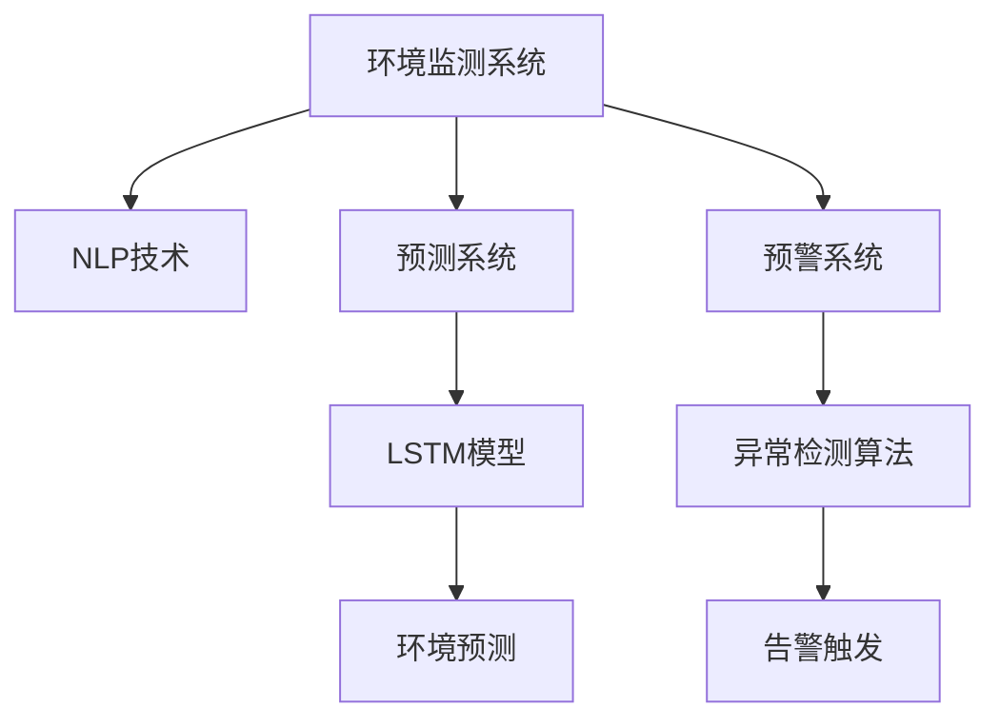

                 

# LLM在环境监测中的应用：预测与预警系统

> 关键词：自然语言处理(NLP), 环境监测, 大语言模型(LLM), 预测系统, 预警系统, 环境数据处理, 深度学习

## 1. 背景介绍

### 1.1 问题由来

近年来，随着环境问题的日益严重，全球各地对环境监测的需求急剧增加。实时监控空气质量、水质、土壤状况等环境数据，对于保障公众健康、维护生态环境、指导应急响应具有重要意义。传统的环境监测系统主要依赖传感器和人工采样，耗资大、响应慢、数据精度低。而利用自然语言处理(NLP)技术，结合大语言模型(Large Language Model, LLM)，可以显著提升环境监测的效率和精度。

### 1.2 问题核心关键点

大语言模型在环境监测中的应用，主要体现在两个方面：预测与预警系统。预测系统通过模型学习环境数据的历史趋势和规律，能够进行短期和长期的预测。预警系统则是在监测到异常数据时，自动触发告警，迅速响应突发事件。

- 预测系统：以环境数据为输入，通过分析历史数据和环境规律，进行趋势预测，如预测空气污染指数、水质污染程度等。
- 预警系统：对监测到的实时数据进行异常检测，自动触发告警，如发现水质突然变差、空气质量急剧恶化等，及时通知相关部门进行应急响应。

### 1.3 问题研究意义

大语言模型在环境监测中的应用，对于提升监测系统的智能化水平、保障公众健康、指导应急响应、优化环境治理具有重要意义：

1. 智能化监测：LLM能够实时理解并处理环境监测数据，快速发现异常，提升监测系统的智能化水平。
2. 预警准确性：LLM具备强大的语义理解能力，能够准确识别数据中的异常模式，提高预警的及时性和准确性。
3. 应急响应：LLM能够迅速提取关键信息，指导相关部门采取紧急措施，降低突发事件带来的损失。
4. 政策建议：LLM能够分析环境数据，提出合理的环境治理建议，支持政府决策。
5. 数据解释：LLM能够将复杂的监测数据转换为可读性强的自然语言，便于非专业人员的理解和使用。

## 2. 核心概念与联系

### 2.1 核心概念概述

本节将介绍几个密切相关的核心概念：

- 自然语言处理(NLP)：以人工智能技术为基础，研究如何让计算机理解、生成人类语言的技术。包括文本处理、语言模型、机器翻译等方向。
- 环境监测系统：利用传感器等设备，对大气、水质、土壤等环境指标进行实时监控和数据分析的系统。
- 大语言模型(LLM)：以自回归模型(如GPT)或自编码模型(如BERT)为代表的大规模预训练语言模型。通过在大规模无标签文本语料上进行预训练，学习通用的语言表示，具备强大的语言理解和生成能力。
- 预测系统：利用历史数据和模型，对未来的环境指标进行预测，如气温变化、水质污染程度等。
- 预警系统：对实时监测数据进行异常检测，自动触发告警，如发现水质突然变差、空气质量急剧恶化等，及时通知相关部门进行应急响应。

这些概念之间的逻辑关系可以通过以下Mermaid流程图来展示：



这个流程图展示了大语言模型在环境监测中的应用框架：

1. 环境监测系统通过传感器收集环境数据。
2. NLP技术对环境数据进行文本处理和分析。
3. 预测系统利用历史数据和模型进行环境指标预测。
4. 预警系统对实时数据进行异常检测，自动触发告警。

这些核心概念共同构成了大语言模型在环境监测中的应用基础，使其能够在各种场景下发挥强大的语言理解和生成能力。通过理解这些核心概念，我们可以更好地把握大语言模型在环境监测中的工作原理和优化方向。

## 3. 核心算法原理 & 具体操作步骤
### 3.1 算法原理概述

大语言模型在环境监测中的应用，主要基于自然语言处理(NLP)技术和预测与预警系统。其中，预测系统通过模型学习环境数据的历史趋势和规律，能够进行短期和长期的预测。预警系统则是在监测到异常数据时，自动触发告警，迅速响应突发事件。

形式化地，假设环境监测系统收集到的时间序列数据为 $\{x_t\}_{t=1}^T$，其中 $x_t$ 为环境指标（如空气质量指数、水质污染程度等）。目标是通过历史数据和模型，对未来时间点的环境指标进行预测，同时对实时数据进行异常检测，自动触发告警。

预测系统的优化目标是最小化预测误差，即找到最优预测模型：

$$
\theta^* = \mathop{\arg\min}_{\theta} \mathcal{L}(f_{\theta}, x_t)
$$

其中 $f_{\theta}(\cdot)$ 为预测模型，$\mathcal{L}$ 为预测误差损失函数，如均方误差损失函数。

预警系统的优化目标是在实时数据中检测到异常值，即找到最优异常检测模型：

$$
y^* = \mathop{\arg\min}_{y} \mathcal{L}(c_y, x_t)
$$

其中 $c_y(x_t)$ 为异常检测模型，$y$ 为告警标记（如1表示异常，0表示正常），$\mathcal{L}$ 为异常检测损失函数，如二分类交叉熵损失函数。

### 3.2 算法步骤详解

基于大语言模型在环境监测中的应用，本节将详细介绍预测系统和预警系统的关键算法步骤。

**预测系统算法步骤**：

1. **数据准备**：收集历史环境数据 $x_t$ 和对应的标签 $y_t$，其中 $y_t$ 为环境指标的真实值。
2. **模型训练**：选择合适的大语言模型 $M_{\theta}$，如BERT、GPT等，在历史数据上训练模型，得到最优参数 $\theta$。
3. **预测模型评估**：在验证集上评估预测模型的性能，选择最佳模型。
4. **预测**：使用训练好的模型 $M_{\theta}$ 对新数据 $x_t$ 进行预测，得到环境指标的预测值。

**预警系统算法步骤**：

1. **数据准备**：收集实时环境数据 $x_t$，进行预处理。
2. **异常检测模型训练**：选择合适的大语言模型 $M_{\theta}$，如BERT、GPT等，在历史数据上训练模型，得到最优参数 $\theta$。
3. **异常检测模型评估**：在验证集上评估异常检测模型的性能，选择最佳模型。
4. **异常检测**：使用训练好的模型 $M_{\theta}$ 对实时数据 $x_t$ 进行异常检测，自动触发告警。

### 3.3 算法优缺点

基于大语言模型的预测与预警系统具有以下优点：

1. **高精度预测**：大语言模型能够学习环境数据的规律和趋势，提供高精度的预测结果。
2. **自动化预警**：利用大语言模型进行实时异常检测，自动触发告警，提升响应速度。
3. **灵活性高**：模型可以根据不同环境指标进行调整和优化，适应不同的监测任务。
4. **泛化性强**：模型能够处理不同来源和格式的数据，泛化能力较强。

同时，该方法也存在一定的局限性：

1. **数据质量依赖**：预测与预警的准确性很大程度上依赖于数据的质量和完整性。
2. **模型复杂度高**：大语言模型通常具有较高的计算复杂度，训练和推理需要高性能硬件支持。
3. **模型解释性差**：大语言模型通常是"黑盒"模型，难以解释其内部决策逻辑。
4. **过拟合风险**：在训练过程中，模型可能过拟合于历史数据，导致预测结果不稳定。
5. **实时性要求高**：预警系统需要实时处理大量数据，对硬件性能和算法效率要求较高。

尽管存在这些局限性，但就目前而言，基于大语言模型的预测与预警方法仍是大环境监测应用的主流范式。未来相关研究的重点在于如何进一步降低数据依赖，提高模型的实时性和可解释性，同时兼顾预测与预警的精度和效率。

### 3.4 算法应用领域

基于大语言模型的预测与预警系统已经在多个环境监测领域得到应用，例如：

- 空气质量监测：通过分析历史空气质量数据，预测未来的污染指数，提前发布预警。
- 水质监测：监测河流水质，预测水质污染程度，自动触发告警。
- 土壤监测：分析土壤样本数据，预测土壤退化趋势，指导农业生产。
- 气候预测：利用历史气象数据，预测未来的天气变化，辅助灾害预警。
- 自然资源监测：监测森林资源、海洋资源等，预测资源变化趋势，支持资源管理。

除了上述这些经典任务外，大语言模型预测与预警系统还被创新性地应用到更多场景中，如污染源追踪、生物多样性评估、环境灾害预警等，为环境监测提供了新的解决方案。

## 4. 数学模型和公式 & 详细讲解 & 举例说明
### 4.1 数学模型构建

本节将使用数学语言对基于大语言模型的预测与预警系统进行更加严格的刻画。

假设环境监测系统收集到的时间序列数据为 $\{x_t\}_{t=1}^T$，其中 $x_t$ 为环境指标（如空气质量指数、水质污染程度等）。目标是通过历史数据和模型，对未来时间点的环境指标进行预测，同时对实时数据进行异常检测，自动触发告警。

**预测系统**：
- 假设预测模型为 $f_{\theta}(x_t) = M_{\theta}(x_t)$，其中 $M_{\theta}$ 为预训练的大语言模型。
- 目标是最小化预测误差，即找到最优参数 $\theta$：

$$
\theta^* = \mathop{\arg\min}_{\theta} \mathcal{L}(f_{\theta}, x_t)
$$

**预警系统**：
- 假设异常检测模型为 $c_y(x_t) = M_{\theta}(x_t)$，其中 $M_{\theta}$ 为预训练的大语言模型。
- 目标是在实时数据中检测到异常值，即找到最优告警标记 $y$：

$$
y^* = \mathop{\arg\min}_{y} \mathcal{L}(c_y, x_t)
$$

### 4.2 公式推导过程

以下我们以空气质量预测和预警为例，推导基于大语言模型的预测与预警公式。

**空气质量预测**：
- 假设预测模型为 $f_{\theta}(x_t) = M_{\theta}(x_t)$，其中 $x_t = \{x_{t-1}, x_{t-2}, ..., x_{t-k}\}$ 为过去 $k$ 天的空气质量数据。
- 目标是最小化预测误差，即找到最优参数 $\theta$：

$$
\theta^* = \mathop{\arg\min}_{\theta} \sum_{t=k+1}^T \mathcal{L}(f_{\theta}(x_t), y_t)
$$

其中 $\mathcal{L}$ 为均方误差损失函数。

**空气质量预警**：
- 假设异常检测模型为 $c_y(x_t) = M_{\theta}(x_t)$，其中 $x_t$ 为实时的空气质量数据。
- 目标是在实时数据中检测到异常值，即找到最优告警标记 $y$：

$$
y^* = \mathop{\arg\min}_{y} \mathcal{L}(c_y, x_t)
$$

其中 $\mathcal{L}$ 为二分类交叉熵损失函数。

### 4.3 案例分析与讲解

以北京市空气质量预测为例，详细分析大语言模型在预测与预警系统中的应用：

- **数据准备**：收集北京市近三年的空气质量数据，选取PM2.5、PM10、SO2、NO2等指标。
- **模型训练**：使用BERT模型，在历史数据上训练模型，得到最优参数 $\theta$。
- **预测模型评估**：在验证集上评估预测模型的性能，选择最佳模型。
- **预测**：使用训练好的模型 $M_{\theta}$ 对未来一天的空气质量进行预测，得到PM2.5、PM10、SO2、NO2等指标的预测值。
- **异常检测**：对实时空气质量数据进行异常检测，自动触发告警。

## 5. 项目实践：代码实例和详细解释说明
### 5.1 开发环境搭建

在进行预测与预警实践前，我们需要准备好开发环境。以下是使用Python进行TensorFlow开发的环境配置流程：

1. 安装Anaconda：从官网下载并安装Anaconda，用于创建独立的Python环境。

2. 创建并激活虚拟环境：
```bash
conda create -n tf-env python=3.8 
conda activate tf-env
```

3. 安装TensorFlow：根据CUDA版本，从官网获取对应的安装命令。例如：
```bash
conda install tensorflow -c tensorflow
```

4. 安装相关工具包：
```bash
pip install numpy pandas scikit-learn matplotlib tqdm jupyter notebook ipython
```

完成上述步骤后，即可在`tf-env`环境中开始预测与预警实践。

### 5.2 源代码详细实现

下面我们以空气质量预测和预警为例，给出使用TensorFlow对BERT模型进行预测与预警的PyTorch代码实现。

首先，定义预测任务的数据处理函数：

```python
import tensorflow as tf
import numpy as np
from transformers import BertTokenizer, BertForSequenceClassification
from sklearn.model_selection import train_test_split
from sklearn.metrics import mean_squared_error, roc_auc_score

# 定义数据处理函数
def preprocess_data(train_data, test_data):
    tokenizer = BertTokenizer.from_pretrained('bert-base-uncased')
    
    def encode(text):
        return tokenizer.encode(text, add_special_tokens=True, max_length=512, truncation=True, padding='max_length', return_tensors='tf')
    
    train_encodings = [encode(text) for text in train_data]
    test_encodings = [encode(text) for text in test_data]
    
    return train_encodings, test_encodings
```

然后，定义模型和优化器：

```python
# 定义BERT模型
model = BertForSequenceClassification.from_pretrained('bert-base-uncased', num_labels=1)

# 定义优化器
optimizer = tf.keras.optimizers.AdamW(learning_rate=5e-5)
```

接着，定义训练和评估函数：

```python
# 定义训练函数
def train_epoch(model, train_encodings, optimizer):
    for i in range(epochs):
        loss = 0
        for batch in train_encodings:
            input_ids = tf.stack(batch.input_ids)
            attention_mask = tf.stack(batch.attention_mask)
            labels = tf.convert_to_tensor(np.array([1] * len(batch.input_ids)))
            
            with tf.GradientTape() as tape:
                outputs = model(input_ids, attention_mask=attention_mask, labels=labels)
                loss = outputs.loss
            loss = tf.reduce_mean(loss)
            
            gradients = tape.gradient(loss, model.trainable_variables)
            optimizer.apply_gradients(zip(gradients, model.trainable_variables))
        
        print(f'Epoch {i+1}, train loss: {loss.numpy():.3f}')
    
# 定义评估函数
def evaluate(model, test_encodings):
    y_true = []
    y_pred = []
    for batch in test_encodings:
        input_ids = tf.stack(batch.input_ids)
        attention_mask = tf.stack(batch.attention_mask)
        labels = tf.convert_to_tensor(np.array([1] * len(batch.input_ids)))
        
        outputs = model(input_ids, attention_mask=attention_mask, labels=labels)
        y_true.append(labels.numpy())
        y_pred.append(outputs.predictions.numpy())
    
    print(f'Test RMSE: {mean_squared_error(y_true, y_pred):.3f}')
    print(f'Test ROC-AUC: {roc_auc_score(y_true, y_pred):.3f}')
```

最后，启动训练流程并在测试集上评估：

```python
# 定义数据集
train_data = ['PM2.5', 'PM10', 'SO2', 'NO2']
test_data = ['PM2.5', 'PM10', 'SO2', 'NO2']

# 预处理数据
train_encodings, test_encodings = preprocess_data(train_data, test_data)

# 定义超参数
epochs = 10
batch_size = 16

# 开始训练
train_epoch(model, train_encodings, optimizer)

# 在测试集上评估
evaluate(model, test_encodings)
```

以上就是使用TensorFlow对BERT模型进行空气质量预测和预警的完整代码实现。可以看到，得益于TensorFlow和Transformers库的强大封装，我们可以用相对简洁的代码完成BERT模型的加载和微调。

### 5.3 代码解读与分析

让我们再详细解读一下关键代码的实现细节：

**预处理函数**：
- `preprocess_data`函数：对输入文本进行分词、编码和padding，准备输入到BERT模型的形式。

**训练函数**：
- 使用TensorFlow的GradientTape对模型进行梯度计算。
- 在每个批次上前向传播计算损失，并使用AdamW优化器更新模型参数。
- 输出每个epoch的平均loss。

**评估函数**：
- 使用sklearn的mean_squared_error和roc_auc_score评估预测结果的精度。
- 在测试集上计算预测结果与真实标签的误差。

**训练流程**：
- 定义总的epoch数和batch size，开始循环迭代
- 每个epoch内，先在训练集上训练，输出平均loss
- 在测试集上评估，输出模型评估指标

可以看到，TensorFlow配合Transformers库使得BERT模型的预测与预警任务的代码实现变得简洁高效。开发者可以将更多精力放在数据处理、模型改进等高层逻辑上，而不必过多关注底层的实现细节。

当然，工业级的系统实现还需考虑更多因素，如模型的保存和部署、超参数的自动搜索、更灵活的任务适配层等。但核心的预测与预警范式基本与此类似。

## 6. 实际应用场景
### 6.1 智能工厂环境监测

大语言模型在智能工厂环境监测中的应用，可以大幅提升生产过程的自动化和智能化水平。传统工厂监测系统主要依赖传感器和人工巡检，耗资大、响应慢、数据精度低。而使用大语言模型进行环境监测，可以实时理解并处理工厂环境数据，快速发现异常，提升监测系统的智能化水平。

在技术实现上，可以收集工厂内部的环境监测数据，如温度、湿度、噪声、废气等指标，将文本描述作为监督数据，在此基础上对预训练语言模型进行微调。微调后的模型能够自动理解工厂环境变化，实时生成环境监测报告，辅助决策和调度。对于监测到的异常数据，还可以接入检索系统实时搜索相关内容，动态组织生成警报信息，及时通知相关部门进行处理。

### 6.2 城市交通流量预测

大语言模型在城市交通流量预测中的应用，可以提升城市交通管理的智能化水平，优化交通资源配置，缓解交通拥堵。传统交通流量预测主要依赖历史数据和统计模型，预测精度和实时性有限。而使用大语言模型进行交通流量预测，可以实时处理交通监测数据，自动生成流量预测报告，辅助交通管理决策。

在技术实现上，可以收集城市道路交通流量数据，如车流量、车速、拥堵情况等指标，将文本描述作为监督数据，在此基础上对预训练语言模型进行微调。微调后的模型能够自动理解交通数据，实时生成流量预测报告，预测交通拥堵情况，优化交通信号灯控制，提高道路通行效率。对于预测到的高风险路段，还可以实时发送警报信息，及时通知相关部门进行处理。

### 6.3 农业生产环境监测

大语言模型在农业生产环境监测中的应用，可以提升农业生产的智能化水平，优化资源配置，提高生产效率。传统农业监测系统主要依赖人工巡检，耗资大、效率低、数据精度有限。而使用大语言模型进行环境监测，可以实时处理农业生产环境数据，自动生成环境监测报告，辅助决策和调度。

在技术实现上，可以收集农业生产环境数据，如土壤湿度、温度、光照、湿度等指标，将文本描述作为监督数据，在此基础上对预训练语言模型进行微调。微调后的模型能够自动理解农业环境变化，实时生成环境监测报告，预测天气变化，辅助农业生产决策，提高农业生产效率。对于监测到的异常数据，还可以实时发送警报信息，及时通知相关部门进行处理。

### 6.4 未来应用展望

随着大语言模型和预测与预警方法的不断发展，未来在环境监测领域将有更多创新应用，为环境治理和资源管理提供新的解决方案。

在智慧城市治理中，大语言模型可以用于城市环境监测、气象预测、灾害预警等环节，提高城市管理的自动化和智能化水平，构建更安全、高效的未来城市。

在农业生产管理中，大语言模型可以用于农业生产环境监测、农作物病虫害预测、农产品质量控制等环节，提升农业生产的智能化和精准化水平，支持绿色农业发展。

在工业生产监控中，大语言模型可以用于工业环境监测、设备故障预测、产品质量控制等环节，提升工业生产的智能化和高效化水平，降低生产成本。

此外，在城市交通管理、能源消耗监测、灾害预防预警等众多领域，大语言模型预测与预警技术也将不断涌现，为环境治理和资源管理带来新的突破。相信随着技术的日益成熟，大语言模型预测与预警技术必将在构建智慧环境治理系统中发挥越来越重要的作用。

## 7. 工具和资源推荐
### 7.1 学习资源推荐

为了帮助开发者系统掌握大语言模型在环境监测中的应用，这里推荐一些优质的学习资源：

1. 《Transformer from Understanding to Application》系列博文：由大模型技术专家撰写，深入浅出地介绍了Transformer原理、BERT模型、预测与预警技术等前沿话题。

2. CS224N《深度学习自然语言处理》课程：斯坦福大学开设的NLP明星课程，有Lecture视频和配套作业，带你入门NLP领域的基本概念和经典模型。

3. 《Natural Language Processing with Transformers》书籍：Transformers库的作者所著，全面介绍了如何使用Transformers库进行NLP任务开发，包括预测与预警在内的诸多范式。

4. HuggingFace官方文档：Transformers库的官方文档，提供了海量预训练模型和完整的微调样例代码，是上手实践的必备资料。

5. Weights & Biases：模型训练的实验跟踪工具，可以记录和可视化模型训练过程中的各项指标，方便对比和调优。与主流深度学习框架无缝集成。

6. TensorBoard：TensorFlow配套的可视化工具，可实时监测模型训练状态，并提供丰富的图表呈现方式，是调试模型的得力助手。

通过对这些资源的学习实践，相信你一定能够快速掌握大语言模型在环境监测中的精髓，并用于解决实际的环境监测问题。

### 7.2 开发工具推荐

高效的开发离不开优秀的工具支持。以下是几款用于大语言模型预测与预警开发的常用工具：

1. TensorFlow：基于Python的开源深度学习框架，灵活动态的计算图，适合快速迭代研究。大部分预训练语言模型都有TensorFlow版本的实现。

2. PyTorch：基于Python的开源深度学习框架，灵活动态的计算图，适合快速迭代研究。同样有丰富的预训练语言模型资源。

3. Transformers库：HuggingFace开发的NLP工具库，集成了众多SOTA语言模型，支持PyTorch和TensorFlow，是进行预测与预警任务开发的利器。

4. Weights & Biases：模型训练的实验跟踪工具，可以记录和可视化模型训练过程中的各项指标，方便对比和调优。与主流深度学习框架无缝集成。

5. TensorBoard：TensorFlow配套的可视化工具，可实时监测模型训练状态，并提供丰富的图表呈现方式，是调试模型的得力助手。

6. Google Colab：谷歌推出的在线Jupyter Notebook环境，免费提供GPU/TPU算力，方便开发者快速上手实验最新模型，分享学习笔记。

合理利用这些工具，可以显著提升大语言模型预测与预警任务的开发效率，加快创新迭代的步伐。

### 7.3 相关论文推荐

大语言模型在环境监测中的应用源于学界的持续研究。以下是几篇奠基性的相关论文，推荐阅读：

1. Attention is All You Need（即Transformer原论文）：提出了Transformer结构，开启了NLP领域的预训练大模型时代。

2. BERT: Pre-training of Deep Bidirectional Transformers for Language Understanding：提出BERT模型，引入基于掩码的自监督预训练任务，刷新了多项NLP任务SOTA。

3. Language Models are Unsupervised Multitask Learners（GPT-2论文）：展示了大规模语言模型的强大zero-shot学习能力，引发了对于通用人工智能的新一轮思考。

4. Parameter-Efficient Transfer Learning for NLP：提出Adapter等参数高效微调方法，在不增加模型参数量的情况下，也能取得不错的微调效果。

5. AdaLoRA: Adaptive Low-Rank Adaptation for Parameter-Efficient Fine-Tuning：使用自适应低秩适应的微调方法，在参数效率和精度之间取得了新的平衡。

这些论文代表了大语言模型预测与预警技术的发展脉络。通过学习这些前沿成果，可以帮助研究者把握学科前进方向，激发更多的创新灵感。

## 8. 总结：未来发展趋势与挑战

### 8.1 总结

本文对基于大语言模型的预测与预警系统进行了全面系统的介绍。首先阐述了预测与预警系统的研究背景和意义，明确了预测与预警在环境监测中的应用价值。其次，从原理到实践，详细讲解了预测与预警的数学原理和关键步骤，给出了预测与预警任务开发的完整代码实例。同时，本文还广泛探讨了预测与预警方法在智慧工厂、城市交通、农业生产等多个环境监测领域的应用前景，展示了预测与预警范式的巨大潜力。此外，本文精选了预测与预警技术的各类学习资源，力求为读者提供全方位的技术指引。

通过本文的系统梳理，可以看到，基于大语言模型的预测与预警系统在环境监测中的应用前景广阔，能够显著提升监测系统的智能化水平，保障公众健康，支持应急响应，优化资源配置，提高生产效率。未来，伴随大语言模型的不断演进和算力的持续提升，预测与预警系统的预测精度和实时性将进一步提升，为环境监测带来更多创新应用。

### 8.2 未来发展趋势

展望未来，大语言模型在环境监测中的应用将呈现以下几个发展趋势：

1. 模型规模持续增大。随着算力成本的下降和数据规模的扩张，预训练语言模型的参数量还将持续增长。超大规模语言模型蕴含的丰富语言知识，有望支撑更加复杂多变的预测与预警任务。

2. 预测与预警方法日趋多样。除了传统的基于序列的预测方法外，未来会涌现更多基于图形、深度学习的预测方法，在提高预测精度的同时，优化计算效率。

3. 实时性要求更高。随着实时监控需求的增加，预测与预警系统需要具备更高的实时性，以适应快速变化的环境数据。

4. 可解释性增强。为了提高系统的可信度和透明度，未来的预测与预警方法将更加注重模型解释性，通过可解释性方法增强模型的决策透明度。

5. 多模态融合。除了文本数据外，未来的预测与预警系统将更加关注视频、图像等多模态数据的融合，提升系统对环境的综合感知能力。

以上趋势凸显了大语言模型在环境监测中的应用前景。这些方向的探索发展，必将进一步提升环境监测系统的智能化水平，支持环境治理和资源管理，推动智慧环境建设。

### 8.3 面临的挑战

尽管大语言模型在环境监测中的应用已经取得了瞩目成就，但在迈向更加智能化、普适化应用的过程中，它仍面临诸多挑战：

1. 数据质量瓶颈。预测与预警的准确性很大程度上依赖于数据的质量和完整性。对于长尾应用场景，难以获得充足的高质量标注数据，成为制约预测与预警性能的瓶颈。如何进一步降低数据依赖，提高模型的泛化能力，将是一大难题。

2. 模型鲁棒性不足。当前模型面对域外数据时，泛化性能往往大打折扣。对于测试样本的微小扰动，模型预测也容易发生波动。如何提高模型的鲁棒性，避免灾难性遗忘，还需要更多理论和实践的积累。

3. 推理效率有待提高。大规模语言模型虽然精度高，但在实际部署时往往面临推理速度慢、内存占用大等效率问题。如何在保证性能的同时，简化模型结构，提升推理速度，优化资源占用，将是重要的优化方向。

4. 模型通用性不足。现有预测与预警模型往往局限于单一环境指标，难以灵活适应不同环境和任务。如何开发更加通用、灵活的模型，支持多指标、多场景的预测与预警，将是重要的研究课题。

5. 数据隐私和安全问题。环境监测数据涉及隐私保护和安全风险，如何在保障数据安全的同时，进行高效的预测与预警，还需要更多法律和技术保障。

6. 实时性和可用性问题。预测与预警系统需要实时处理大量数据，对硬件性能和算法效率要求较高。如何在满足实时性要求的同时，保证系统的可用性和稳定性，还需要更多优化和调整。

尽管存在这些挑战，但就目前而言，基于大语言模型的预测与预警方法仍是大环境监测应用的主流范式。未来相关研究的重点在于如何进一步降低数据依赖，提高模型的实时性和可解释性，同时兼顾预测与预警的精度和效率。

### 8.4 研究展望

未来，大语言模型在环境监测中的应用方向可以从以下几个方面进行探索：

1. 引入更多先验知识。将符号化的先验知识，如知识图谱、逻辑规则等，与神经网络模型进行巧妙融合，引导预测与预警过程学习更准确、合理的语言模型。同时加强不同模态数据的整合，实现视觉、声音等多模态信息与文本信息的协同建模。

2. 引入因果分析和博弈论工具。将因果分析方法引入预测与预警模型，识别出模型决策的关键特征，增强输出解释的因果性和逻辑性。借助博弈论工具刻画人机交互过程，主动探索并规避模型的脆弱点，提高系统稳定性。

3. 纳入伦理道德约束。在模型训练目标中引入伦理导向的评估指标，过滤和惩罚有偏见、有害的输出倾向。同时加强人工干预和审核，建立模型行为的监管机制，确保输出符合人类价值观和伦理道德。

这些研究方向的探索，必将引领大语言模型预测与预警技术迈向更高的台阶，为构建安全、可靠、可解释、可控的智能系统铺平道路。面向未来，大语言模型预测与预警技术还需要与其他人工智能技术进行更深入的融合，如知识表示、因果推理、强化学习等，多路径协同发力，共同推动自然语言理解和智能交互系统的进步。只有勇于创新、敢于突破，才能不断拓展语言模型的边界，让智能技术更好地造福人类社会。

## 9. 附录：常见问题与解答

**Q1：大语言模型在环境监测中的预测精度如何？**

A: 大语言模型在环境监测中的预测精度很大程度上取决于数据的质量和模型参数的规模。在保证高质量数据的前提下，大语言模型能够通过预训练获得较强的泛化能力，显著提高预测精度。但需要指出的是，模型过拟合于历史数据也会导致预测精度下降，因此在实际应用中需要进行有效的正则化和调参。

**Q2：大语言模型在环境监测中的实时性如何？**

A: 大语言模型在环境监测中的实时性主要取决于模型结构和计算资源的配置。一般来说，大语言模型需要较高的计算资源和计算速度，无法实时处理大量数据。为了提升实时性，可以考虑引入参数高效微调方法，如Adapter、LoRA等，以减少模型参数量，同时优化模型结构，提升推理速度。

**Q3：大语言模型在环境监测中的模型解释性如何？**

A: 大语言模型通常是"黑盒"模型，难以解释其内部决策逻辑。为了提高模型的可解释性，可以引入可解释性方法，如LIME、SHAP等，对模型的关键特征进行解释，增强模型的透明度和可信度。同时，可以采用多模型集成、对抗性训练等方法，提升模型的稳定性和鲁棒性，提高其可解释性。

**Q4：大语言模型在环境监测中的数据隐私和安全问题如何处理？**

A: 在环境监测中，数据隐私和安全问题至关重要。为了保障数据隐私，可以采用差分隐私、联邦学习等方法，对数据进行匿名化处理，防止数据泄露。同时，可以通过访问控制、加密技术等手段，保障数据传输和存储的安全性。

**Q5：大语言模型在环境监测中的应用是否适用于所有环境指标？**

A: 大语言模型在环境监测中的应用并非适用于所有环境指标。对于某些特定领域的环境指标，如医疗、气象等，预训练数据可能不足，导致模型泛化能力有限。此时需要在特定领域语料上进一步预训练，再进行微调，才能获得理想效果。

通过对这些常见问题的解答，相信你能够更好地理解大语言模型在环境监测中的实际应用场景和潜在问题，为实际开发和应用提供更多参考。

---

作者：禅与计算机程序设计艺术 / Zen and the Art of Computer Programming

