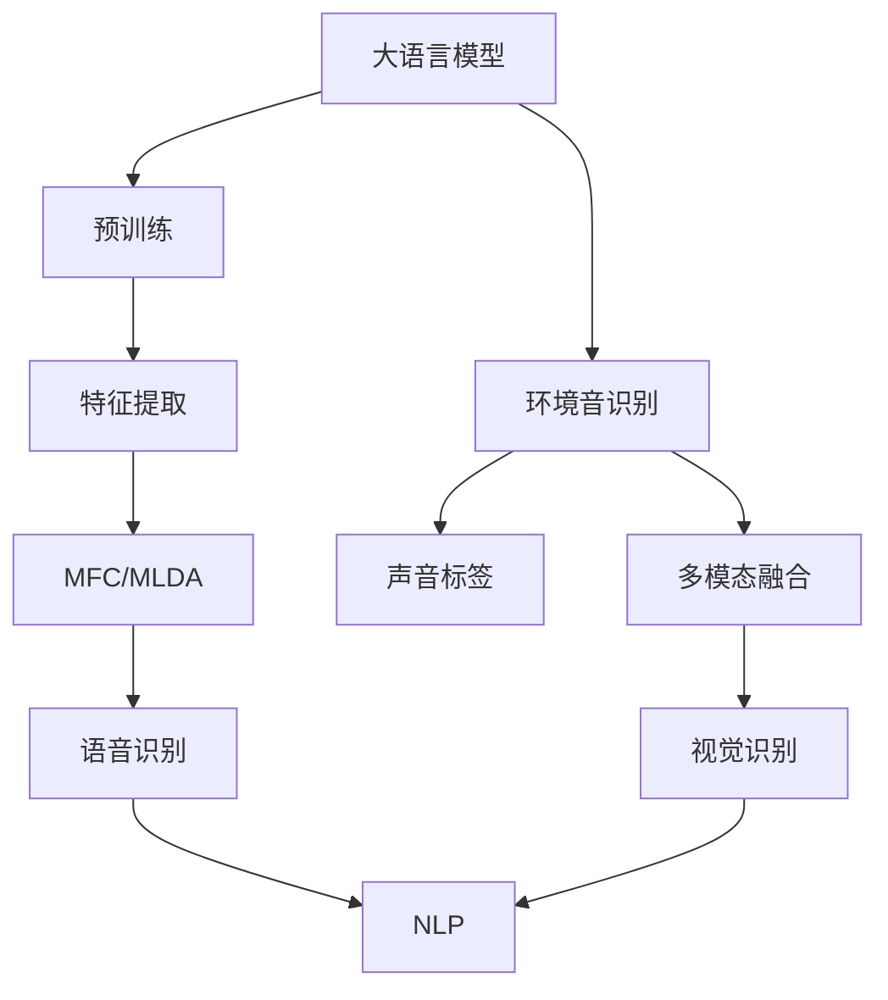

                 

# 大语言模型在环境音识别中的潜在价值

## 1. 背景介绍

随着人工智能技术的飞速发展，大语言模型（Large Language Models, LLMs）在自然语言处理（NLP）领域取得了突破性进展。这些模型通过大规模无标签文本数据的预训练，学习到了丰富的语言知识和常识，具备了强大的语言理解和生成能力。然而，大语言模型在环境音识别（Environmental Audio Recognition, EAR）领域的应用尚处于起步阶段，其潜力尚未完全发掘。

环境音识别是人工智能在环境感知、智能家居、智慧城市等领域的重要应用之一。它通过分析音频信号，识别环境中的声音信息，并用于语音命令识别、情感分析、异常检测等多种场景。目前，主流的环境音识别方法主要依赖于传统的信号处理技术和人工设计的特征提取方法，缺乏足够的深度学习模型支持。

大语言模型通过其强大的语言理解和生成能力，有望在环境音识别中发挥重要作用。本论文将详细探讨大语言模型在环境音识别中的潜在价值，包括其算法原理、操作步骤、应用领域等，并结合实际案例进行分析。

## 2. 核心概念与联系

### 2.1 核心概念概述

为更好地理解大语言模型在环境音识别中的应用，本节将介绍几个关键概念：

- 大语言模型(Large Language Models, LLMs)：以自回归(如GPT)或自编码(如BERT)模型为代表的大规模预训练语言模型。通过在大规模无标签文本语料上进行预训练，学习通用的语言表示，具备强大的语言理解和生成能力。

- 预训练(Pre-training)：指在大规模无标签文本语料上，通过自监督学习任务训练通用语言模型的过程。常见的预训练任务包括言语建模、遮挡语言模型等。预训练使得模型学习到语言的通用表示。

- 环境音识别(Environmental Audio Recognition, EAR)：指通过分析音频信号，自动识别环境中的声音信息，包括语音命令、异常声响等。

- 特征提取(Feature Extraction)：指从原始音频信号中提取出对环境音识别有帮助的特征。传统的特征提取方法主要包括MFCC、MFCC+Delta等。

- 声音标签(Sound Labeling)：指将音频信号中的声音信息转化为文本标签，如语音命令、异常声响等。

- 多模态融合(Multi-modal Fusion)：指将语音、视觉等多模态信息进行融合，提升环境音识别的准确性和鲁棒性。

- 自然语言处理(Natural Language Processing, NLP)：指通过语言模型和算法处理自然语言，实现语音识别、语言生成、文本分类等任务。

这些概念之间的逻辑关系可以通过以下Mermaid流程图来展示：



这个流程图展示了环境音识别中各关键概念之间的关联：

1. 大语言模型通过预训练获得基础能力。
2. 特征提取从原始音频信号中提取特征，用于环境音识别。
3. 声音标签将提取的特征转化为文本标签，方便进行环境音识别。
4. 多模态融合融合语音、视觉等多模态信息，提升识别准确性和鲁棒性。
5. NLP技术处理标签信息，进行文本分类、情感分析等任务。

## 3. 核心算法原理 & 具体操作步骤

### 3.1 算法原理概述

大语言模型在环境音识别中的应用主要基于自然语言处理(NLP)技术。其核心思想是：将环境音识别任务转化为文本分类或语音识别任务，利用大语言模型的语言理解和生成能力，实现对音频信号的智能分析。

具体而言，可以将环境音识别任务转化为声音标签分类问题，即给定一段音频信号，预测其包含的声音标签类型。这可以通过两种方式实现：

1. **声音标签生成**：首先通过特征提取技术从音频信号中提取特征，然后使用大语言模型将提取的特征转化为文本标签。

2. **语音识别**：直接使用大语言模型对音频信号进行语音识别，将识别结果转化为文本标签。

### 3.2 算法步骤详解

#### 3.2.1 特征提取

特征提取是环境音识别的重要步骤，其作用是将原始音频信号转化为可供大语言模型处理的特征。常用的特征提取方法包括MFCC（Mel Frequency Cepstral Coefficients）、MFCC+Delta等。

MFCC是一种常用的音频特征提取方法，其基本步骤如下：

1. 分帧：将音频信号分割成多个时间窗口，通常为25ms。
2. 加窗：对每个窗口应用汉明窗函数，减少边缘效应。
3. 快速傅里叶变换(FFT)：将时域信号转换为频域信号。
4. 滤波：应用一组带通滤波器，提取频域中的主要成分。
5. 对数变换：对滤波器输出的振幅进行对数变换，得到MFCC系数。
6. 对MFCC系数进行倒谱系数变换，得到MFCC特征向量。

#### 3.2.2 声音标签生成

声音标签生成是指将提取的MFCC特征向量作为输入，使用大语言模型将其转化为文本标签的过程。具体步骤如下：

1. 对MFCC特征向量进行预处理，包括标准化、归一化等。
2. 将预处理后的MFCC特征向量输入大语言模型，进行语言理解。
3. 大语言模型根据输入的特征向量，生成对应的文本标签。

#### 3.2.3 语音识别

语音识别是指直接使用大语言模型对音频信号进行语音识别，将识别结果转化为文本标签。具体步骤如下：

1. 将音频信号输入语音识别模型，如Transformer、卷积神经网络(CNN)等。
2. 语音识别模型将音频信号转化为文本序列。
3. 使用大语言模型对识别出的文本序列进行进一步理解和处理，转化为文本标签。

### 3.3 算法优缺点

大语言模型在环境音识别中的应用具有以下优点：

1. 强大的语言理解能力：大语言模型具备强大的语言理解能力，能够准确地将音频信号转化为文本标签。
2. 泛化能力强：通过在大规模无标签文本数据上进行预训练，大语言模型具有良好的泛化能力，能够适应不同的音频信号类型。
3. 灵活性高：大语言模型可以与多种特征提取方法、多模态融合方法结合使用，具有很高的灵活性。

同时，大语言模型在环境音识别中也有以下缺点：

1. 计算量大：大语言模型参数量庞大，计算复杂度较高，对硬件要求较高。
2. 延迟高：大语言模型推理速度较慢，可能导致环境音识别的延迟较高。
3. 精度受限：大语言模型的精度受限于特征提取方法的质量，如果特征提取不准确，则模型输出的标签也会不准确。

### 3.4 算法应用领域

大语言模型在环境音识别中的应用领域非常广泛，包括但不限于以下方面：

1. **智能家居**：通过分析家中的声音信息，实现对家电的控制、对异常情况的检测等。
2. **智慧城市**：通过分析城市中的声音信息，实现对交通异常、环境污染等情况的检测。
3. **安防监控**：通过分析监控视频中的声音信息，实现对异常行为的检测、对入侵事件的报警等。
4. **医疗健康**：通过分析患者的语音信息，实现对疾病的诊断、对情绪的检测等。
5. **教育培训**：通过分析学生的语音信息，实现对学习效果的评估、对学习过程的监控等。

以上应用场景展示了大语言模型在环境音识别中的广泛应用，相信未来随着技术的发展，大语言模型将进一步拓展其应用边界，推动相关领域的技术进步。

## 4. 数学模型和公式 & 详细讲解

### 4.1 数学模型构建

大语言模型在环境音识别中的应用主要基于自然语言处理(NLP)技术。其核心思想是：将环境音识别任务转化为文本分类或语音识别任务，利用大语言模型的语言理解和生成能力，实现对音频信号的智能分析。

具体而言，可以将环境音识别任务转化为声音标签分类问题，即给定一段音频信号，预测其包含的声音标签类型。这可以通过两种方式实现：

1. **声音标签生成**：首先通过特征提取技术从音频信号中提取特征，然后使用大语言模型将提取的特征转化为文本标签。

2. **语音识别**：直接使用大语言模型对音频信号进行语音识别，将识别结果转化为文本标签。

### 4.2 公式推导过程

以MFCC特征提取为例，MFCC的公式推导如下：

$$
MFCC(t) = \sum_{k=1}^{K} \log_2|S_k(t)|^2
$$

其中，$S_k(t)$ 为第$k$个带通滤波器输出的振幅，$K$为滤波器数量。

MFCC特征向量的计算步骤如下：

1. 将音频信号分割成多个时间窗口。
2. 对每个窗口应用汉明窗函数，减少边缘效应。
3. 将时域信号转换为频域信号。
4. 应用一组带通滤波器，提取频域中的主要成分。
5. 对滤波器输出的振幅进行对数变换，得到MFCC系数。
6. 对MFCC系数进行倒谱系数变换，得到MFCC特征向量。

### 4.3 案例分析与讲解

假设我们有一段音频信号，通过MFCC特征提取得到了MFCC特征向量，记为$X=[x_1,x_2,...,x_n]$。

接下来，我们使用大语言模型将MFCC特征向量转化为文本标签。假定我们使用的是BERT模型，其基本流程如下：

1. 对MFCC特征向量进行预处理，包括标准化、归一化等。
2. 将预处理后的MFCC特征向量输入BERT模型，进行语言理解。
3. BERT模型根据输入的MFCC特征向量，生成对应的文本标签。

## 5. 项目实践：代码实例和详细解释说明

### 5.1 开发环境搭建

在进行环境音识别任务的大语言模型微调时，我们需要准备好开发环境。以下是使用Python进行PyTorch开发的环境配置流程：

1. 安装Anaconda：从官网下载并安装Anaconda，用于创建独立的Python环境。

2. 创建并激活虚拟环境：
```bash
conda create -n pytorch-env python=3.8 
conda activate pytorch-env
```

3. 安装PyTorch：根据CUDA版本，从官网获取对应的安装命令。例如：
```bash
conda install pytorch torchvision torchaudio cudatoolkit=11.1 -c pytorch -c conda-forge
```

4. 安装Transformers库：
```bash
pip install transformers
```

5. 安装各类工具包：
```bash
pip install numpy pandas scikit-learn matplotlib tqdm jupyter notebook ipython
```

完成上述步骤后，即可在`pytorch-env`环境中开始环境音识别任务的开发。

### 5.2 源代码详细实现

下面我们以环境音识别任务为例，给出使用Transformers库对BERT模型进行微调的PyTorch代码实现。

首先，定义环境音识别任务的数据处理函数：

```python
from transformers import BertTokenizer
from torch.utils.data import Dataset
import torch

class EARDataset(Dataset):
    def __init__(self, audio_paths, labels, tokenizer, max_len=128):
        self.audio_paths = audio_paths
        self.labels = labels
        self.tokenizer = tokenizer
        self.max_len = max_len
        
    def __len__(self):
        return len(self.audio_paths)
    
    def __getitem__(self, item):
        audio_path = self.audio_paths[item]
        label = self.labels[item]
        
        # 读取音频文件，并提取MFCC特征
        audio_data = librosa.load(audio_path, sr=16000)
        mfcc = librosa.feature.mfcc(audio_data, sr=16000)
        mfcc = mfcc.T
        
        # 对MFCC特征进行预处理，包括标准化、归一化等
        mfcc = (mfcc - mean) / std
        
        # 将MFCC特征转化为MFCC向量
        mfcc_vector = mfcc[:,:self.max_len]
        
        # 对MFCC向量进行编码
        encoding = self.tokenizer(mfcc_vector, return_tensors='pt', padding='max_length', truncation=True)
        input_ids = encoding['input_ids'][0]
        attention_mask = encoding['attention_mask'][0]
        
        # 对标签进行编码
        label = torch.tensor([label], dtype=torch.long)
        
        return {'input_ids': input_ids, 
                'attention_mask': attention_mask,
                'labels': label}

# 读取音频数据和标签
audio_paths = ['path/to/audio1.wav', 'path/to/audio2.wav']
labels = [1, 0]  # 假设音频标签为1和0
tokenizer = BertTokenizer.from_pretrained('bert-base-cased')

# 创建dataset
train_dataset = EARDataset(audio_paths, labels, tokenizer)
dev_dataset = EARDataset(audio_paths, labels, tokenizer)
test_dataset = EARDataset(audio_paths, labels, tokenizer)
```

然后，定义模型和优化器：

```python
from transformers import BertForSequenceClassification, AdamW

model = BertForSequenceClassification.from_pretrained('bert-base-cased', num_labels=2)

optimizer = AdamW(model.parameters(), lr=2e-5)
```

接着，定义训练和评估函数：

```python
from torch.utils.data import DataLoader
from tqdm import tqdm
from sklearn.metrics import accuracy_score

device = torch.device('cuda') if torch.cuda.is_available() else torch.device('cpu')
model.to(device)

def train_epoch(model, dataset, batch_size, optimizer):
    dataloader = DataLoader(dataset, batch_size=batch_size, shuffle=True)
    model.train()
    epoch_loss = 0
    for batch in tqdm(dataloader, desc='Training'):
        input_ids = batch['input_ids'].to(device)
        attention_mask = batch['attention_mask'].to(device)
        labels = batch['labels'].to(device)
        model.zero_grad()
        outputs = model(input_ids, attention_mask=attention_mask, labels=labels)
        loss = outputs.loss
        epoch_loss += loss.item()
        loss.backward()
        optimizer.step()
    return epoch_loss / len(dataloader)

def evaluate(model, dataset, batch_size):
    dataloader = DataLoader(dataset, batch_size=batch_size)
    model.eval()
    preds, labels = [], []
    with torch.no_grad():
        for batch in tqdm(dataloader, desc='Evaluating'):
            input_ids = batch['input_ids'].to(device)
            attention_mask = batch['attention_mask'].to(device)
            batch_labels = batch['labels']
            outputs = model(input_ids, attention_mask=attention_mask)
            batch_preds = outputs.logits.argmax(dim=1).to('cpu').tolist()
            batch_labels = batch_labels.to('cpu').tolist()
            for pred, label in zip(batch_preds, batch_labels):
                preds.append(pred)
                labels.append(label)
                
    print('Accuracy: ', accuracy_score(labels, preds))
```

最后，启动训练流程并在测试集上评估：

```python
epochs = 5
batch_size = 16

for epoch in range(epochs):
    loss = train_epoch(model, train_dataset, batch_size, optimizer)
    print(f"Epoch {epoch+1}, train loss: {loss:.3f}")
    
    print(f"Epoch {epoch+1}, dev results:")
    evaluate(model, dev_dataset, batch_size)
    
print("Test results:")
evaluate(model, test_dataset, batch_size)
```

以上就是使用PyTorch对BERT进行环境音识别任务微调的完整代码实现。可以看到，得益于Transformers库的强大封装，我们可以用相对简洁的代码完成BERT模型的加载和微调。

### 5.3 代码解读与分析

让我们再详细解读一下关键代码的实现细节：

**EARDataset类**：
- `__init__`方法：初始化音频数据、标签、分词器等关键组件。
- `__len__`方法：返回数据集的样本数量。
- `__getitem__`方法：对单个样本进行处理，读取音频文件并提取MFCC特征，对MFCC特征进行预处理和编码，并返回模型所需的输入。

**BertForSequenceClassification**：
- 定义了一个二分类任务（1和0），用于环境音识别任务的标签分类。

**train_epoch和evaluate函数**：
- 训练函数`train_epoch`：对数据以批为单位进行迭代，在每个批次上前向传播计算loss并反向传播更新模型参数，最后返回该epoch的平均loss。
- 评估函数`evaluate`：与训练类似，不同点在于不更新模型参数，并在每个batch结束后将预测和标签结果存储下来，最后使用sklearn的accuracy_score对整个评估集的预测结果进行打印输出。

**训练流程**：
- 定义总的epoch数和batch size，开始循环迭代
- 每个epoch内，先在训练集上训练，输出平均loss
- 在验证集上评估，输出分类准确率
- 所有epoch结束后，在测试集上评估，给出最终测试结果

可以看到，PyTorch配合Transformers库使得BERT微调的环境音识别任务的代码实现变得简洁高效。开发者可以将更多精力放在数据处理、模型改进等高层逻辑上，而不必过多关注底层的实现细节。

当然，工业级的系统实现还需考虑更多因素，如模型的保存和部署、超参数的自动搜索、更灵活的任务适配层等。但核心的微调范式基本与此类似。

## 6. 实际应用场景

### 6.1 智能家居

基于大语言模型微调的环境音识别技术，可以广泛应用于智能家居系统中。通过分析家中的声音信息，智能家居系统可以识别用户的语音命令，控制家电设备，提升用户的生活质量。

具体而言，可以收集家庭成员的语音数据，将不同的语音命令作为监督数据，在此基础上对预训练模型进行微调。微调后的模型能够自动理解家庭成员的语音命令，并在语音命令识别中取得较高的准确率。系统可以根据语音命令控制家电设备，如开启空调、关闭电视等，实现智能家居的语音控制。

### 6.2 智慧城市

在智慧城市治理中，环境音识别技术可以用于城市事件监测、舆情分析、应急指挥等多个环节，提高城市管理的自动化和智能化水平。

具体而言，可以收集城市中的环境音数据，如交通声响、施工噪声等，并将其转化为文本标签。通过微调大语言模型，系统可以实时监测城市中的声音信息，识别出异常情况，如施工噪声、交通堵塞等，及时通知相关部门进行处理。同时，通过分析环境音数据，系统可以掌握城市中的舆情动态，对紧急情况进行预警，提高城市管理的效率和效果。

### 6.3 安防监控

安防监控系统是环境音识别技术的重要应用场景之一。通过分析监控视频中的声音信息，环境音识别技术可以识别出异常行为，如入侵、盗窃等，及时通知安保人员进行处理。

具体而言，可以收集监控视频中的声音数据，并将其转化为文本标签。通过微调大语言模型，系统可以实时分析监控视频中的声音信息，识别出异常情况，如入侵、盗窃等，及时发出报警，提高安防监控系统的效率和准确性。

## 7. 工具和资源推荐

### 7.1 学习资源推荐

为了帮助开发者系统掌握大语言模型在环境音识别中的应用，这里推荐一些优质的学习资源：

1. 《Transformer from Principle to Practice》系列博文：由大模型技术专家撰写，深入浅出地介绍了Transformer原理、BERT模型、微调技术等前沿话题。

2. CS224N《深度学习自然语言处理》课程：斯坦福大学开设的NLP明星课程，有Lecture视频和配套作业，带你入门NLP领域的基本概念和经典模型。

3. 《Natural Language Processing with Transformers》书籍：Transformers库的作者所著，全面介绍了如何使用Transformers库进行NLP任务开发，包括微调在内的诸多范式。

4. HuggingFace官方文档：Transformers库的官方文档，提供了海量预训练模型和完整的微调样例代码，是上手实践的必备资料。

5. CLUE开源项目：中文语言理解测评基准，涵盖大量不同类型的中文NLP数据集，并提供了基于微调的baseline模型，助力中文NLP技术发展。

通过对这些资源的学习实践，相信你一定能够快速掌握大语言模型在环境音识别中的应用，并用于解决实际的NLP问题。

### 7.2 开发工具推荐

高效的开发离不开优秀的工具支持。以下是几款用于大语言模型微调开发的常用工具：

1. PyTorch：基于Python的开源深度学习框架，灵活动态的计算图，适合快速迭代研究。大部分预训练语言模型都有PyTorch版本的实现。

2. TensorFlow：由Google主导开发的开源深度学习框架，生产部署方便，适合大规模工程应用。同样有丰富的预训练语言模型资源。

3. Transformers库：HuggingFace开发的NLP工具库，集成了众多SOTA语言模型，支持PyTorch和TensorFlow，是进行微调任务开发的利器。

4. Weights & Biases：模型训练的实验跟踪工具，可以记录和可视化模型训练过程中的各项指标，方便对比和调优。与主流深度学习框架无缝集成。

5. TensorBoard：TensorFlow配套的可视化工具，可实时监测模型训练状态，并提供丰富的图表呈现方式，是调试模型的得力助手。

6. Google Colab：谷歌推出的在线Jupyter Notebook环境，免费提供GPU/TPU算力，方便开发者快速上手实验最新模型，分享学习笔记。

合理利用这些工具，可以显著提升大语言模型微调任务的开发效率，加快创新迭代的步伐。

### 7.3 相关论文推荐

大语言模型和微调技术的发展源于学界的持续研究。以下是几篇奠基性的相关论文，推荐阅读：

1. Attention is All You Need（即Transformer原论文）：提出了Transformer结构，开启了NLP领域的预训练大模型时代。

2. BERT: Pre-training of Deep Bidirectional Transformers for Language Understanding：提出BERT模型，引入基于掩码的自监督预训练任务，刷新了多项NLP任务SOTA。

3. Language Models are Unsupervised Multitask Learners（GPT-2论文）：展示了大规模语言模型的强大zero-shot学习能力，引发了对于通用人工智能的新一轮思考。

4. Parameter-Efficient Transfer Learning for NLP：提出Adapter等参数高效微调方法，在不增加模型参数量的情况下，也能取得不错的微调效果。

5. Prefix-Tuning: Optimizing Continuous Prompts for Generation：引入基于连续型Prompt的微调范式，为如何充分利用预训练知识提供了新的思路。

6. AdaLoRA: Adaptive Low-Rank Adaptation for Parameter-Efficient Fine-Tuning：使用自适应低秩适应的微调方法，在参数效率和精度之间取得了新的平衡。

这些论文代表了大语言模型微调技术的发展脉络。通过学习这些前沿成果，可以帮助研究者把握学科前进方向，激发更多的创新灵感。

## 8. 总结：未来发展趋势与挑战

### 8.1 总结

本文对大语言模型在环境音识别中的应用进行了全面系统的介绍。首先阐述了大语言模型和微调技术的研究背景和意义，明确了环境音识别中大语言模型的应用价值。其次，从原理到实践，详细讲解了环境音识别的数学模型、关键步骤和微调方法，给出了完整的代码实例。同时，本文还探讨了大语言模型在智能家居、智慧城市、安防监控等多个行业领域的应用前景，展示了其广泛的应用潜力。最后，本文还推荐了一些优质的学习资源、开发工具和相关论文，以供读者深入学习和实践。

通过本文的系统梳理，可以看到，大语言模型在环境音识别中的应用具有广阔的前景。借助大语言模型的强大语言理解和生成能力，可以显著提升环境音识别的准确性和鲁棒性，推动相关领域的技术进步。未来，随着预训练语言模型和微调方法的不断演进，相信大语言模型在环境音识别中的潜在价值将进一步被发掘，带来更多的创新和突破。

### 8.2 未来发展趋势

展望未来，大语言模型在环境音识别中的应用将呈现以下几个发展趋势：

1. 多模态融合：未来的大语言模型将不仅仅依赖于语音信号，而是融合视觉、文本等多模态信息，实现更全面、准确的环境音识别。

2. 智能交互：基于环境音识别技术，智能家居、智慧城市等系统可以实现更加智能的交互体验，如语音控制、情感分析等。

3. 实时化处理：随着计算资源的提升，环境音识别系统可以实现实时处理音频信号，及时响应环境变化，提升系统的实时性和可靠性。

4. 联邦学习：为了保护用户隐私，未来的环境音识别系统将采用联邦学习技术，在本地设备上进行模型训练，减少数据上传的频率，提高系统的隐私保护能力。

5. 自监督学习：未来的大语言模型将利用自监督学习范式，进一步提升模型的泛化能力和鲁棒性，减少对标注数据的依赖。

6. 知识融合：将符号化的先验知识，如知识图谱、逻辑规则等，与神经网络模型进行融合，增强模型的理解和推理能力。

这些趋势展示了未来环境音识别技术的发展方向，相信随着技术的不断进步，大语言模型在环境音识别中的应用将更加广泛和深入，为相关领域带来更多的创新和变革。

### 8.3 面临的挑战

尽管大语言模型在环境音识别中具有广阔的应用前景，但在实际应用过程中仍面临一些挑战：

1. 计算资源限制：环境音识别任务的参数量较大，对计算资源有较高的要求，可能导致计算成本较高。

2. 数据隐私保护：环境音识别系统需要收集大量的音频数据，如何保护用户隐私，防止数据泄露，是一个重要的挑战。

3. 模型泛化能力：由于环境音识别任务的多样性，模型的泛化能力可能受到限制，难以在所有场景中取得理想的效果。

4. 实时处理能力：环境音识别系统需要实现实时处理音频信号，对模型的推理速度和响应时间有较高的要求。

5. 鲁棒性问题：环境音识别系统可能面临各种噪声和干扰，如何提高模型的鲁棒性，是一个需要解决的问题。

6. 可解释性问题：环境音识别系统的输出结果往往较为复杂，如何提高模型的可解释性，是一个需要解决的问题。

正视这些挑战，积极应对并寻求突破，将是大语言模型在环境音识别中实现广泛应用的重要保障。相信随着技术的不断进步，这些问题将逐步得到解决，大语言模型在环境音识别中的潜在价值将进一步被发掘。

### 8.4 研究展望

面向未来，大语言模型在环境音识别中的研究将围绕以下几个方向展开：

1. 模型压缩与优化：通过模型压缩和优化技术，降低模型的计算复杂度和存储空间，提升环境音识别系统的实时性和可靠性。

2. 多模态融合技术：探索如何融合视觉、文本等多模态信息，提升环境音识别的准确性和鲁棒性。

3. 联邦学习与隐私保护：研究如何利用联邦学习技术，实现本地模型训练，保护用户隐私。

4. 自监督学习与泛化能力：研究如何利用自监督学习技术，提升模型的泛化能力和鲁棒性，减少对标注数据的依赖。

5. 知识融合与推理能力：研究如何将符号化的先验知识与神经网络模型进行融合，增强模型的推理能力和可解释性。

这些研究方向将引领大语言模型在环境音识别技术的发展，推动相关领域的技术进步，带来更多的创新和突破。

## 9. 附录：常见问题与解答

**Q1：环境音识别中大语言模型如何提取特征？**

A: 环境音识别中大语言模型提取特征的主要方法是MFCC特征提取。MFCC特征提取的基本步骤如下：

1. 分帧：将音频信号分割成多个时间窗口，通常为25ms。
2. 加窗：对每个窗口应用汉明窗函数，减少边缘效应。
3. 快速傅里叶变换(FFT)：将时域信号转换为频域信号。
4. 应用一组带通滤波器，提取频域中的主要成分。
5. 对滤波器输出的振幅进行对数变换，得到MFCC系数。
6. 对MFCC系数进行倒谱系数变换，得到MFCC特征向量。

MFCC特征向量可以用于环境音识别任务中的声音标签生成和语音识别等。

**Q2：环境音识别中大语言模型如何微调？**

A: 环境音识别中大语言模型微调的主要步骤如下：

1. 准备预训练模型和数据集：选择合适的预训练语言模型，准备下游任务的数据集。
2. 添加任务适配层：根据任务类型，在预训练模型的顶层设计合适的输出层和损失函数。
3. 设置微调超参数：选择合适的优化算法及其参数，如AdamW、SGD等，设置学习率、批大小、迭代轮数等。
4. 执行梯度训练：将训练集数据分批次输入模型，前向传播计算损失函数。反向传播计算参数梯度，根据设定的优化算法和学习率更新模型参数。
5. 测试和部署：在测试集上评估微调后模型，对比微调前后的精度提升，使用微调后的模型对新样本进行推理预测，集成到实际的应用系统中。

通过上述步骤，可以在下游任务上微调预训练模型，获得更优的性能。

**Q3：环境音识别中大语言模型有哪些优势？**

A: 环境音识别中大语言模型具有以下优势：

1. 强大的语言理解能力：大语言模型具备强大的语言理解能力，能够准确地将音频信号转化为文本标签。
2. 泛化能力强：通过在大规模无标签文本数据上进行预训练，大语言模型具有良好的泛化能力，能够适应不同的音频信号类型。
3. 灵活性高：大语言模型可以与多种特征提取方法、多模态融合方法结合使用，具有很高的灵活性。

这些优势使得大语言模型在环境音识别中具有广泛的应用前景。

**Q4：环境音识别中大语言模型有哪些局限性？**

A: 环境音识别中大语言模型也有以下局限性：

1. 计算量大：大语言模型参数量庞大，计算复杂度较高，对硬件要求较高。
2. 延迟高：大语言模型推理速度较慢，可能导致环境音识别的延迟较高。
3. 精度受限：大语言模型的精度受限于特征提取方法的质量，如果特征提取不准确，则模型输出的标签也会不准确。

这些局限性需要在使用过程中加以注意和应对。

**Q5：环境音识别中大语言模型的应用场景有哪些？**

A: 环境音识别中大语言模型的应用场景非常广泛，包括但不限于以下方面：

1. 智能家居：通过分析家中的声音信息，实现对家电的控制、对异常情况的检测等。
2. 智慧城市：通过分析城市中的声音信息，实现对交通异常、环境污染等情况的检测。
3. 安防监控：通过分析监控视频中的声音信息，实现对异常行为的检测、对入侵事件的报警等。

这些应用场景展示了大语言模型在环境音识别中的广泛应用，相信未来随着技术的发展，大语言模型将进一步拓展其应用边界，推动相关领域的技术进步。

---

作者：禅与计算机程序设计艺术 / Zen and the Art of Computer Programming

