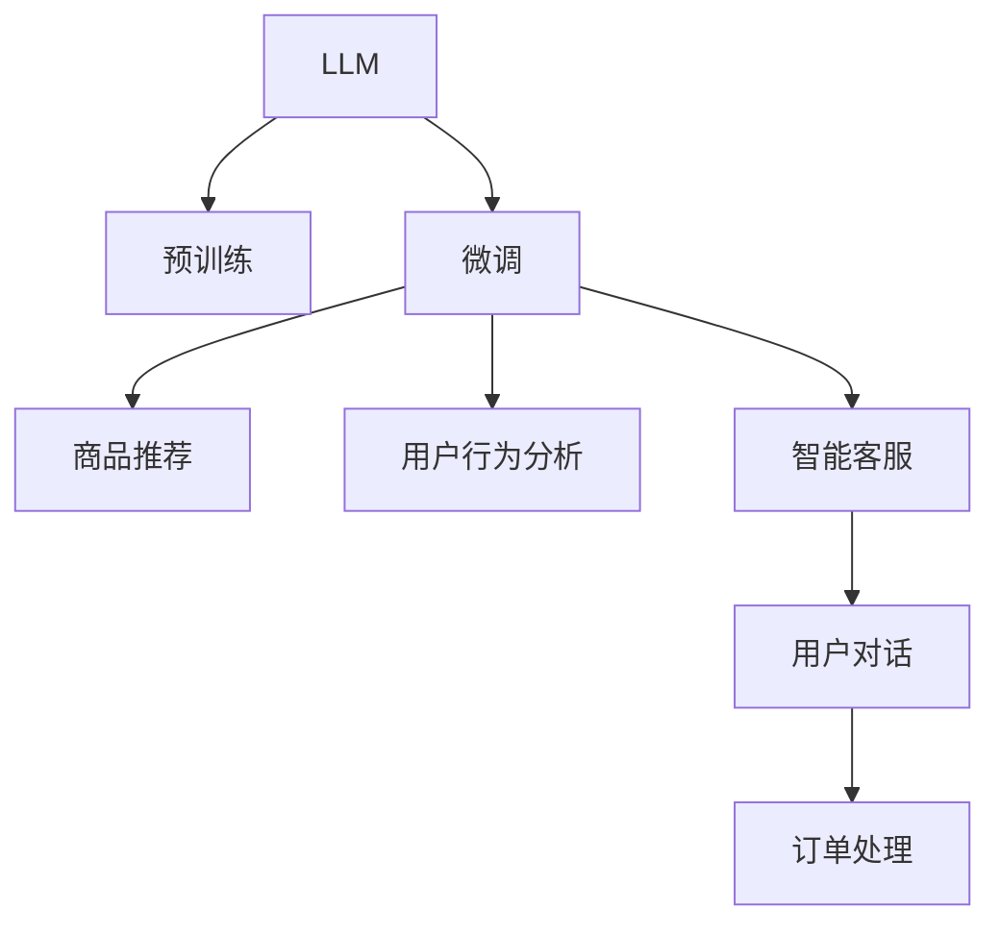

                 

# LLM在电子商务中的应用：智能购物体验

> 关键词：自然语言处理(NLP)、电子商务、大语言模型(LLM)、智能推荐、用户行为分析、智能客服

## 1. 背景介绍

随着互联网和电子商务的迅猛发展，线上购物成为越来越多人的首选。然而，面对海量的商品信息，消费者常常感到不知所措，难以找到真正符合自己需求的商品。传统搜索引擎依靠关键词匹配和固定排名，往往无法精准捕捉用户真实的购物需求，导致购物体验下降。

为解决这一问题，电子商务平台纷纷引入先进的人工智能技术，以提升用户体验和购物转化率。其中，基于大语言模型(LLM)的智能购物体验技术，成为电商企业竞相研究和应用的热点。LLM利用其强大的语言理解和生成能力，能够理解和回答用户复杂的购物咨询，推荐符合用户需求的商品，从而极大地提高了用户满意度和购物效率。

本文将系统介绍LLM在电子商务中的应用，分析其实现原理、操作步骤以及优缺点，并通过代码实例展示其应用效果。此外，还将探讨其在未来电子商务中的潜在应用前景和发展方向。

## 2. 核心概念与联系

### 2.1 核心概念概述

为更好地理解LLM在电子商务中的应用，我们先对一些核心概念进行介绍：

- 大语言模型(LLM)：以自回归模型（如GPT）或自编码模型（如BERT）为代表，通过在大规模无标签文本数据上进行预训练，学习到丰富的语言表示和知识。
- 预训练(Pre-training)：在大规模无标签数据上，通过自监督学习任务训练通用语言模型，使其具备广泛的通用语言理解和生成能力。
- 微调(Fine-tuning)：在预训练模型的基础上，使用下游任务的少量标注数据进行有监督学习，优化模型在特定任务上的表现。
- 推荐系统：通过分析用户行为和兴趣，推荐符合用户需求的商品和服务，提高用户体验和转化率。
- 自然语言处理(NLP)：涉及文本挖掘、信息检索、文本分类、情感分析等技术，旨在实现人机之间的自然语言交互。
- 智能客服：利用自然语言处理技术，实现自动化客户服务，提高客户满意度和平台运营效率。

这些核心概念之间的联系可以通过以下Mermaid流程图来展示：



这个流程图展示了LLM在电子商务中的一些关键应用场景：

1. 预训练模型提供通用语言知识。
2. 微调模型优化特定任务性能。
3. 商品推荐系统推荐商品。
4. 用户行为分析系统挖掘用户需求。
5. 智能客服系统回答用户咨询。
6. 用户对话数据用于订单处理和客户维护。

通过这个流程图，我们可以清晰地看到，LLM在电子商务中的应用是一个由多环节、多层次构成的综合系统，涉及预训练、微调、推荐、分析等多个关键技术。

## 3. 核心算法原理 & 具体操作步骤
### 3.1 算法原理概述

LLM在电子商务中的应用，主要依赖于其在自然语言处理领域的强大能力。通过微调，LLM能够学习到特定电商领域的语言表示，从而在商品推荐、智能客服、用户行为分析等多个场景中发挥作用。

具体来说，微调过程分为以下几个步骤：

1. 数据准备：收集和标注电商领域相关的文本数据，如用户评价、商品描述、用户对话等。
2. 模型选择：选择合适的预训练语言模型，如GPT、BERT等，作为微调的初始模型。
3. 任务适配：根据电商任务的具体需求，设计合适的任务适配层，如分类层、生成层等。
4. 模型微调：使用标注数据对预训练模型进行有监督学习，优化模型在特定任务上的性能。
5. 应用部署：将微调后的模型应用于电子商务平台，实现商品推荐、智能客服等功能。

### 3.2 算法步骤详解

接下来，我们将详细介绍每个步骤的具体操作方法。

#### 3.2.1 数据准备

数据准备是微调的关键前提。以下是数据收集和标注的具体方法：

1. 数据收集：电商平台可以自行收集用户评价、商品描述、用户对话等文本数据，也可以从第三方数据源购买或收集。
2. 数据预处理：对收集到的文本数据进行清洗、分词、去噪等预处理操作，确保数据的格式一致性和质量。
3. 数据标注：对文本数据进行人工标注，生成标注数据集。标注数据通常包含输入文本和对应的目标输出，如商品类别、情感评分等。

#### 3.2.2 模型选择

选择合适的预训练语言模型是微调的基础。目前常用的预训练语言模型有GPT、BERT等。以下是一些选择模型的考虑因素：

1. 模型大小：模型的参数规模越大，通常表示其语言表示能力越强，但也可能带来更大的计算和存储开销。
2. 预训练任务：不同的预训练任务（如掩码语言模型、句子相似度等）可能会对微调效果产生影响，应根据任务需求选择合适的模型。
3. 开源支持：选择一个有良好开源支持的语言模型，可以方便地进行微调和部署。

#### 3.2.3 任务适配

根据电商任务的具体需求，设计合适的任务适配层。以下是一些常见的任务适配层：

1. 分类层：用于多分类任务，如商品类别分类、情感分类等。
2. 生成层：用于生成任务，如商品推荐、用户对话生成等。
3. 检索层：用于文本检索任务，如商品相似度检索等。

#### 3.2.4 模型微调

模型微调是微调过程中的核心步骤。以下是微调的具体操作方法：

1. 初始化模型：使用预训练语言模型作为初始模型，通常只更新微调层中的参数。
2. 设计损失函数：根据具体的任务类型，设计合适的损失函数。如分类任务可使用交叉熵损失，生成任务可使用负对数似然损失。
3. 训练模型：使用标注数据对模型进行有监督学习，通常使用梯度下降等优化算法。
4. 评估模型：在验证集上评估模型性能，根据评估结果调整超参数，如学习率、批大小等。
5. 保存模型：将训练好的模型保存下来，方便后续使用。

#### 3.2.5 应用部署

将微调后的模型应用于电子商务平台，实现商品推荐、智能客服等功能。以下是一些具体的应用场景：

1. 商品推荐：使用微调后的分类模型，对商品进行分类，根据用户历史行为和兴趣推荐相似商品。
2. 智能客服：使用微调后的生成模型，对用户咨询进行回答，提供自动化的客户服务。
3. 用户行为分析：使用微调后的模型，分析用户对话数据，挖掘用户需求和偏好。

### 3.3 算法优缺点

LLM在电子商务中的应用具有以下优点：

1. 能够理解复杂自然语言：通过预训练和微调，LLM能够理解和生成复杂的自然语言，提高用户对话体验。
2. 能够推荐个性化商品：通过用户历史行为和兴趣分析，LLM能够推荐符合用户需求的个性化商品，提升购物转化率。
3. 能够提供实时客服：通过智能客服系统，LLM能够实时回答用户咨询，提高客户满意度。
4. 能够分析用户行为：通过用户对话数据，LLM能够分析用户需求和行为，优化用户体验和平台运营。

同时，LLM在电子商务中的应用也存在以下缺点：

1. 数据依赖性强：LLM的性能依赖于标注数据的数量和质量，标注数据不足可能导致模型泛化能力不足。
2. 计算资源消耗大：预训练和微调需要大量计算资源，可能对电商平台的资源配置提出较高要求。
3. 模型风险高：LLM的输出依赖于其内部模型，存在一定的风险，如输出不合理的推荐结果或错误的客服回答。
4. 模型解释性差：LLM的内部工作机制较为复杂，难以解释其输出结果，用户可能对推荐结果和客服回答产生质疑。

### 3.4 算法应用领域

LLM在电子商务中的应用主要集中在以下几个领域：

1. 商品推荐：通过分析用户历史行为和兴趣，LLM能够推荐符合用户需求的个性化商品。
2. 智能客服：通过自然语言处理技术，LLM能够回答用户咨询，提供自动化的客户服务。
3. 用户行为分析：通过用户对话数据，LLM能够分析用户需求和行为，优化用户体验和平台运营。
4. 内容生成：通过生成模型，LLM能够自动生成商品描述、用户评价等文本内容。
5. 广告投放：通过分析用户行为数据，LLM能够生成精准的广告推荐，提高广告效果。

以上应用领域展示了LLM在电子商务中的广泛应用，能够显著提升用户购物体验和平台运营效率。

## 4. 数学模型和公式 & 详细讲解 & 举例说明
### 4.1 数学模型构建

为了更好地理解LLM在电子商务中的应用，我们接下来通过数学模型对其进行详细讲解。

假设我们有一个预训练语言模型 $M_{\theta}$，其中 $\theta$ 为模型参数。电商推荐任务的目标是预测用户对商品的兴趣，将其分为感兴趣和不感兴趣两类。假设我们有 $N$ 条标注数据 $\{(x_i,y_i)\}_{i=1}^N$，其中 $x_i$ 为输入文本，$y_i$ 为输出标签，$y_i \in \{0,1\}$。我们的目标是最大化模型在标注数据上的分类准确率，即：

$$
\max_{\theta} \frac{1}{N} \sum_{i=1}^N \log P(y_i|x_i)
$$

其中 $P(y_i|x_i)$ 为模型对输入文本 $x_i$ 的分类概率。

### 4.2 公式推导过程

以分类任务为例，我们假设输入文本 $x_i$ 通过预训练语言模型 $M_{\theta}$ 处理后，得到分类概率 $P(y_i|x_i)$。根据交叉熵损失函数，我们定义损失函数为：

$$
L(\theta) = -\frac{1}{N} \sum_{i=1}^N [y_i\log P(y_i|x_i)+(1-y_i)\log(1-P(y_i|x_i))]
$$

其中 $y_i\log P(y_i|x_i)+(1-y_i)\log(1-P(y_i|x_i))$ 为交叉熵损失。通过反向传播算法，我们计算损失函数对模型参数 $\theta$ 的梯度，并使用梯度下降等优化算法更新模型参数。具体来说，优化目标为：

$$
\theta \leftarrow \theta - \eta \nabla_{\theta}L(\theta)
$$

其中 $\eta$ 为学习率，$\nabla_{\theta}L(\theta)$ 为损失函数对参数 $\theta$ 的梯度。

### 4.3 案例分析与讲解

以电商推荐系统为例，我们对模型训练和微调过程进行详细讲解：

1. 数据准备：收集电商平台上用户历史购买记录和商品描述数据，进行标注生成标注数据集。
2. 模型选择：选择BERT作为预训练语言模型，并在商品分类任务上进行微调。
3. 任务适配：设计分类层和损失函数，将分类任务映射到文本分类任务。
4. 模型微调：使用标注数据对模型进行有监督学习，优化分类层参数。
5. 应用部署：将微调后的模型应用于电商推荐系统，生成推荐商品列表。

## 5. 项目实践：代码实例和详细解释说明
### 5.1 开发环境搭建

在进行LLM在电子商务中的应用实践前，我们需要准备好开发环境。以下是使用Python进行PyTorch开发的环境配置流程：

1. 安装Anaconda：从官网下载并安装Anaconda，用于创建独立的Python环境。

2. 创建并激活虚拟环境：
```bash
conda create -n llm-env python=3.8 
conda activate llm-env
```

3. 安装PyTorch：根据CUDA版本，从官网获取对应的安装命令。例如：
```bash
conda install pytorch torchvision torchaudio cudatoolkit=11.1 -c pytorch -c conda-forge
```

4. 安装Transformers库：
```bash
pip install transformers
```

5. 安装各类工具包：
```bash
pip install numpy pandas scikit-learn matplotlib tqdm jupyter notebook ipython
```

完成上述步骤后，即可在`llm-env`环境中开始微调实践。

### 5.2 源代码详细实现

下面我们以电商推荐系统为例，给出使用Transformers库对BERT模型进行微调的PyTorch代码实现。

首先，定义电商推荐任务的数据处理函数：

```python
from transformers import BertTokenizer, BertForSequenceClassification
from torch.utils.data import Dataset
import torch

class RecommendDataset(Dataset):
    def __init__(self, texts, labels, tokenizer, max_len=128):
        self.texts = texts
        self.labels = labels
        self.tokenizer = tokenizer
        self.max_len = max_len
        
    def __len__(self):
        return len(self.texts)
    
    def __getitem__(self, item):
        text = self.texts[item]
        label = self.labels[item]
        
        encoding = self.tokenizer(text, return_tensors='pt', max_length=self.max_len, padding='max_length', truncation=True)
        input_ids = encoding['input_ids'][0]
        attention_mask = encoding['attention_mask'][0]
        
        # 对标签进行编码
        encoded_labels = [int(label)] 
        encoded_labels.extend([0] * (self.max_len - len(encoded_labels)))
        labels = torch.tensor(encoded_labels, dtype=torch.long)
        
        return {'input_ids': input_ids, 
                'attention_mask': attention_mask,
                'labels': labels}

# 创建dataset
tokenizer = BertTokenizer.from_pretrained('bert-base-cased')

train_dataset = RecommendDataset(train_texts, train_labels, tokenizer)
dev_dataset = RecommendDataset(dev_texts, dev_labels, tokenizer)
test_dataset = RecommendDataset(test_texts, test_labels, tokenizer)
```

然后，定义模型和优化器：

```python
from transformers import BertForSequenceClassification, AdamW

model = BertForSequenceClassification.from_pretrained('bert-base-cased', num_labels=2)

optimizer = AdamW(model.parameters(), lr=2e-5)
```

接着，定义训练和评估函数：

```python
from torch.utils.data import DataLoader
from tqdm import tqdm
from sklearn.metrics import accuracy_score

device = torch.device('cuda') if torch.cuda.is_available() else torch.device('cpu')
model.to(device)

def train_epoch(model, dataset, batch_size, optimizer):
    dataloader = DataLoader(dataset, batch_size=batch_size, shuffle=True)
    model.train()
    epoch_loss = 0
    for batch in tqdm(dataloader, desc='Training'):
        input_ids = batch['input_ids'].to(device)
        attention_mask = batch['attention_mask'].to(device)
        labels = batch['labels'].to(device)
        model.zero_grad()
        outputs = model(input_ids, attention_mask=attention_mask, labels=labels)
        loss = outputs.loss
        epoch_loss += loss.item()
        loss.backward()
        optimizer.step()
    return epoch_loss / len(dataloader)

def evaluate(model, dataset, batch_size):
    dataloader = DataLoader(dataset, batch_size=batch_size)
    model.eval()
    preds, labels = [], []
    with torch.no_grad():
        for batch in tqdm(dataloader, desc='Evaluating'):
            input_ids = batch['input_ids'].to(device)
            attention_mask = batch['attention_mask'].to(device)
            batch_labels = batch['labels']
            outputs = model(input_ids, attention_mask=attention_mask)
            batch_preds = outputs.logits.argmax(dim=2).to('cpu').tolist()
            batch_labels = batch_labels.to('cpu').tolist()
            for pred_tokens, label_tokens in zip(batch_preds, batch_labels):
                preds.append(pred_tokens[:len(label_tokens)])
                labels.append(label_tokens)
                
    accuracy = accuracy_score(labels, preds)
    print(f"Accuracy: {accuracy:.3f}")
```

最后，启动训练流程并在测试集上评估：

```python
epochs = 5
batch_size = 16

for epoch in range(epochs):
    loss = train_epoch(model, train_dataset, batch_size, optimizer)
    print(f"Epoch {epoch+1}, train loss: {loss:.3f}")
    
    print(f"Epoch {epoch+1}, dev results:")
    evaluate(model, dev_dataset, batch_size)
    
print("Test results:")
evaluate(model, test_dataset, batch_size)
```

以上就是使用PyTorch对BERT进行电商推荐任务微调的完整代码实现。可以看到，得益于Transformers库的强大封装，我们可以用相对简洁的代码完成BERT模型的加载和微调。

### 5.3 代码解读与分析

让我们再详细解读一下关键代码的实现细节：

**RecommendDataset类**：
- `__init__`方法：初始化文本、标签、分词器等关键组件。
- `__len__`方法：返回数据集的样本数量。
- `__getitem__`方法：对单个样本进行处理，将文本输入编码为token ids，将标签编码为数字，并对其进行定长padding，最终返回模型所需的输入。

**模型和优化器**：
- 定义BERT模型和AdamW优化器，用于微调电商推荐任务。

**训练和评估函数**：
- 使用PyTorch的DataLoader对数据集进行批次化加载，供模型训练和推理使用。
- 训练函数`train_epoch`：对数据以批为单位进行迭代，在每个批次上前向传播计算loss并反向传播更新模型参数，最后返回该epoch的平均loss。
- 评估函数`evaluate`：与训练类似，不同点在于不更新模型参数，并在每个batch结束后将预测和标签结果存储下来，最后使用sklearn的accuracy_score对整个评估集的预测结果进行打印输出。

**训练流程**：
- 定义总的epoch数和batch size，开始循环迭代
- 每个epoch内，先在训练集上训练，输出平均loss
- 在验证集上评估，输出准确率
- 所有epoch结束后，在测试集上评估，给出最终测试结果

可以看到，PyTorch配合Transformers库使得BERT微调的代码实现变得简洁高效。开发者可以将更多精力放在数据处理、模型改进等高层逻辑上，而不必过多关注底层的实现细节。

当然，工业级的系统实现还需考虑更多因素，如模型的保存和部署、超参数的自动搜索、更灵活的任务适配层等。但核心的微调范式基本与此类似。

## 6. 实际应用场景
### 6.1 智能推荐系统

电商平台的智能推荐系统是LLM在电子商务中最核心的应用之一。通过分析用户行为和兴趣，推荐符合用户需求的商品，显著提升用户购物体验和平台转化率。

在具体实现中，可以使用微调后的分类模型对用户历史行为进行分类，生成商品推荐列表。通过在用户浏览、购买等行为数据中挖掘出用户兴趣点，LLM可以动态生成个性化推荐结果，极大地提高用户满意度和购物效率。

### 6.2 智能客服系统

智能客服系统是电商平台为提升客户服务质量而引入的重要技术。通过自然语言处理技术，LLM可以自动回答用户咨询，提供24/7的自动化客户服务。

在具体实现中，可以使用微调后的生成模型对用户咨询进行回答。通过训练生成模型，LLM可以生成符合用户需求的回复，提高客户满意度和平台运营效率。智能客服系统不仅可以减少人工客服的工作量，还能在高峰期保持服务稳定，提升用户体验。

### 6.3 用户行为分析

用户行为分析是电商平台优化用户体验和平台运营的重要手段。通过分析用户对话数据，LLM可以挖掘出用户需求和行为特征，从而优化推荐算法和产品设计。

在具体实现中，可以使用微调后的模型对用户对话数据进行分析和挖掘。通过构建用户画像，LLM可以发现用户关注的热点问题，优化产品功能和用户体验。通过挖掘用户情感倾向，LLM可以预测用户流失风险，提前采取措施，提升用户留存率。

### 6.4 未来应用展望

随着LLM在电子商务中的不断应用，其潜力将进一步挖掘和拓展。未来，LLM在电子商务中的应用将呈现以下几个趋势：

1. 个性化推荐：通过深度学习技术和LLM的强大语言理解能力，生成更加精准、个性化的推荐结果，提升用户购物体验和平台转化率。
2. 多模态融合：将图像、语音、视频等多模态数据与自然语言数据进行融合，提升推荐和客服系统的智能化水平。
3. 实时互动：通过构建实时对话系统，LLM可以提供更加即时、个性化的服务，提升用户互动体验。
4. 多语言支持：通过多语言训练的LLM模型，电商平台可以为全球用户提供多语言服务，拓展海外市场。
5. 自动化运营：通过自动化智能客服和推荐系统，电商平台可以大幅减少人工成本，提升运营效率。

这些趋势将进一步提升LLM在电子商务中的应用效果，使其成为电商平台数字化转型升级的重要技术手段。

## 7. 工具和资源推荐
### 7.1 学习资源推荐

为了帮助开发者系统掌握LLM在电子商务中的应用，这里推荐一些优质的学习资源：

1. 《Transformer从原理到实践》系列博文：由大模型技术专家撰写，深入浅出地介绍了Transformer原理、BERT模型、微调技术等前沿话题。

2. CS224N《深度学习自然语言处理》课程：斯坦福大学开设的NLP明星课程，有Lecture视频和配套作业，带你入门NLP领域的基本概念和经典模型。

3. 《Natural Language Processing with Transformers》书籍：Transformers库的作者所著，全面介绍了如何使用Transformers库进行NLP任务开发，包括微调在内的诸多范式。

4. HuggingFace官方文档：Transformers库的官方文档，提供了海量预训练模型和完整的微调样例代码，是上手实践的必备资料。

5. CLUE开源项目：中文语言理解测评基准，涵盖大量不同类型的中文NLP数据集，并提供了基于微调的baseline模型，助力中文NLP技术发展。

通过对这些资源的学习实践，相信你一定能够快速掌握LLM在电子商务中的应用技巧，并用于解决实际的NLP问题。
###  7.2 开发工具推荐

高效的开发离不开优秀的工具支持。以下是几款用于LLM在电子商务中的应用开发的常用工具：

1. PyTorch：基于Python的开源深度学习框架，灵活动态的计算图，适合快速迭代研究。大部分预训练语言模型都有PyTorch版本的实现。

2. TensorFlow：由Google主导开发的开源深度学习框架，生产部署方便，适合大规模工程应用。同样有丰富的预训练语言模型资源。

3. Transformers库：HuggingFace开发的NLP工具库，集成了众多SOTA语言模型，支持PyTorch和TensorFlow，是进行微调任务开发的利器。

4. Weights & Biases：模型训练的实验跟踪工具，可以记录和可视化模型训练过程中的各项指标，方便对比和调优。与主流深度学习框架无缝集成。

5. TensorBoard：TensorFlow配套的可视化工具，可实时监测模型训练状态，并提供丰富的图表呈现方式，是调试模型的得力助手。

6. Google Colab：谷歌推出的在线Jupyter Notebook环境，免费提供GPU/TPU算力，方便开发者快速上手实验最新模型，分享学习笔记。

合理利用这些工具，可以显著提升LLM在电子商务中的应用开发效率，加快创新迭代的步伐。

### 7.3 相关论文推荐

LLM在电子商务中的应用源于学界的持续研究。以下是几篇奠基性的相关论文，推荐阅读：

1. Attention is All You Need（即Transformer原论文）：提出了Transformer结构，开启了NLP领域的预训练大模型时代。

2. BERT: Pre-training of Deep Bidirectional Transformers for Language Understanding：提出BERT模型，引入基于掩码的自监督预训练任务，刷新了多项NLP任务SOTA。

3. Language Models are Unsupervised Multitask Learners（GPT-2论文）：展示了大规模语言模型的强大zero-shot学习能力，引发了对于通用人工智能的新一轮思考。

4. Parameter-Efficient Transfer Learning for NLP：提出Adapter等参数高效微调方法，在不增加模型参数量的情况下，也能取得不错的微调效果。

5. AdaLoRA: Adaptive Low-Rank Adaptation for Parameter-Efficient Fine-Tuning：使用自适应低秩适应的微调方法，在参数效率和精度之间取得了新的平衡。

这些论文代表了大语言模型在电子商务中的应用研究的发展脉络。通过学习这些前沿成果，可以帮助研究者把握学科前进方向，激发更多的创新灵感。

## 8. 总结：未来发展趋势与挑战
### 8.1 研究成果总结

通过上述分析和实践，我们深入了解了LLM在电子商务中的应用。LLM通过微调技术，能够实现商品推荐、智能客服、用户行为分析等功能，显著提升电商平台的用户体验和运营效率。未来，随着LLM技术的不断进步，其应用前景将更加广阔。

### 8.2 未来发展趋势

展望未来，LLM在电子商务中的应用将呈现以下几个发展趋势：

1. 模型规模持续增大。随着算力成本的下降和数据规模的扩张，预训练语言模型的参数量还将持续增长。超大规模语言模型蕴含的丰富语言知识，有望支撑更加复杂多变的电商推荐任务。

2. 微调方法日趋多样。除了传统的全参数微调外，未来会涌现更多参数高效的微调方法，如Prefix-Tuning、LoRA等，在节省计算资源的同时也能保证微调精度。

3. 持续学习成为常态。随着数据分布的不断变化，微调模型也需要持续学习新知识以保持性能。如何在不遗忘原有知识的同时，高效吸收新样本信息，将成为重要的研究课题。

4. 标注样本需求降低。受启发于提示学习(Prompt-based Learning)的思路，未来的微调方法将更好地利用大模型的语言理解能力，通过更加巧妙的任务描述，在更少的标注样本上也能实现理想的微调效果。

5. 多模态微调崛起。当前的微调主要聚焦于纯文本数据，未来会进一步拓展到图像、视频、语音等多模态数据微调。多模态信息的融合，将显著提升语言模型对现实世界的理解和建模能力。

6. 知识整合能力增强。现有的微调模型往往局限于任务内数据，难以灵活吸收和运用更广泛的先验知识。如何让微调过程更好地与外部知识库、规则库等专家知识结合，形成更加全面、准确的信息整合能力，还有很大的想象空间。

这些趋势凸显了LLM在电子商务中的应用前景。这些方向的探索发展，必将进一步提升LLM的应用效果，为电商平台的数字化转型升级提供新的技术路径。

### 8.3 面临的挑战

尽管LLM在电子商务中的应用取得了不少成果，但在迈向更加智能化、普适化应用的过程中，它仍面临诸多挑战：

1. 标注成本瓶颈。尽管LLM的微调效果良好，但标注数据的质量和数量对微调效果有重要影响。对于长尾应用场景，获取高质量标注数据的成本较高，成为制约微调性能的瓶颈。如何进一步降低微调对标注样本的依赖，将是一大难题。

2. 模型鲁棒性不足。当前LLM模型面对域外数据时，泛化性能往往大打折扣。对于测试样本的微小扰动，LLM的输出也容易发生波动。如何提高LLM模型的鲁棒性，避免灾难性遗忘，还需要更多理论和实践的积累。

3. 推理效率有待提高。尽管LLM的精度高，但在实际部署时往往面临推理速度慢、内存占用大等效率问题。如何在保证性能的同时，简化模型结构，提升推理速度，优化资源占用，将是重要的优化方向。

4. 模型通用性增强。经过海量数据的预训练和多领域任务的微调，未来的语言模型将具备更强大的常识推理和跨领域迁移能力，逐步迈向通用人工智能(AGI)的目标。

5. 模型风险高。LLM的输出依赖于其内部模型，存在一定的风险，如输出不合理的推荐结果或错误的客服回答。如何构建稳健的模型，减少输出风险，将是未来的重要研究方向。

6. 模型解释性差。当前LLM的内部工作机制较为复杂，难以解释其输出结果，用户可能对推荐结果和客服回答产生质疑。如何赋予LLM更强的可解释性，将是亟待攻克的难题。

### 8.4 研究展望

面向未来，LLM在电子商务中的应用需要从以下几个方向进行深入研究：

1. 探索无监督和半监督微调方法。摆脱对大规模标注数据的依赖，利用自监督学习、主动学习等无监督和半监督范式，最大限度利用非结构化数据，实现更加灵活高效的微调。

2. 研究参数高效和计算高效的微调范式。开发更加参数高效的微调方法，在固定大部分预训练参数的同时，只更新极少量的任务相关参数。同时优化微调模型的计算图，减少前向传播和反向传播的资源消耗，实现更加轻量级、实时性的部署。

3. 融合因果和对比学习范式。通过引入因果推断和对比学习思想，增强LLM建立稳定因果关系的能力，学习更加普适、鲁棒的语言表征，从而提升模型泛化性和抗干扰能力。

4. 引入更多先验知识。将符号化的先验知识，如知识图谱、逻辑规则等，与神经网络模型进行巧妙融合，引导LLM学习更准确、合理的语言模型。同时加强不同模态数据的整合，实现视觉、语音等多模态信息与文本信息的协同建模。

5. 结合因果分析和博弈论工具。将因果分析方法引入LLM模型，识别出模型决策的关键特征，增强输出解释的因果性和逻辑性。借助博弈论工具刻画人机交互过程，主动探索并规避模型的脆弱点，提高系统稳定性。

6. 纳入伦理道德约束。在模型训练目标中引入伦理导向的评估指标，过滤和惩罚有偏见、有害的输出倾向。同时加强人工干预和审核，建立模型行为的监管机制，确保输出符合人类价值观和伦理道德。

这些研究方向将引领LLM在电子商务中的技术演进，进一步提升用户购物体验和平台运营效率，为电商平台的数字化转型升级提供强大的技术支撑。

## 9. 附录：常见问题与解答

**Q1：LLM在电子商务中的应用是否适用于所有电商领域？**

A: LLM在电子商务中的应用在大多数电商领域中都能取得不错的效果。但对于一些特定的电商领域，如生鲜电商、奢侈品电商等，由于其产品属性和用户行为较为特殊，LLM的效果可能存在一定的局限性。需要根据具体领域的特点进行微调和优化。

**Q2：如何选择合适的预训练语言模型？**

A: 选择合适的预训练语言模型需要考虑多个因素，包括模型规模、预训练任务、开源支持等。对于电商推荐任务，建议选择参数规模较大、预训练任务为掩码语言模型或生成模型的BERT模型。同时，选择具有良好开源支持的语言模型，可以方便地进行微调和部署。

**Q3：数据标注的质量和数量对LLM的效果有何影响？**

A: 数据标注的质量和数量对LLM的效果有重要影响。标注数据的质量越高，模型的泛化性能越好。标注数据的数量越多，模型的学习能力和泛化能力越强。然而，标注数据的获取成本较高，对于长尾应用场景，获取高质量标注数据的难度较大。因此，需要综合考虑标注数据的质量和数量，进行合理的选择和优化。

**Q4：LLM在电子商务中的应用是否存在数据隐私和安全问题？**

A: 在电子商务中，用户数据的隐私和安全问题非常重要。LLM在应用过程中，需要确保用户数据的安全，避免数据泄露和滥用。同时，需要对用户数据进行匿名化处理，保护用户隐私。此外，LLM模型本身也需要通过适当的训练和优化，减少潜在的偏见和风险，确保输出的公平性和安全性。

**Q5：如何提高LLM在电子商务中的实时互动能力？**

A: 提高LLM在电子商务中的实时互动能力，可以通过构建实时对话系统来实现。使用微调后的生成模型，可以实时回答用户咨询，提供个性化的客服服务。同时，可以使用多轮对话技术，提升用户对话体验。通过集成语音识别和语音合成技术，可以实现语音客服功能，进一步提升互动效率。

通过深入探讨LLM在电子商务中的应用，本文详细介绍了其工作原理、操作步骤和实际应用场景，并对未来的发展趋势和挑战进行了总结。相信在学界和产业界的共同努力下，LLM将在电子商务中发挥越来越重要的作用，推动电商平台的数字化转型升级。

---

作者：禅与计算机程序设计艺术 / Zen and the Art of Computer Programming

