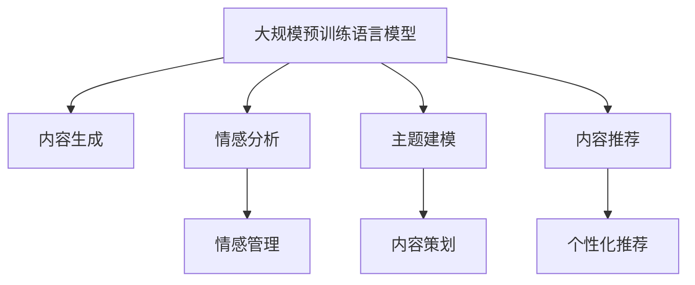

                 

# LLM在社交媒体中的应用：内容生成与分析

> 关键词：社交媒体,自然语言处理,生成对抗网络,情感分析,主题建模,内容推荐

## 1. 背景介绍

### 1.1 问题由来

随着社交媒体的蓬勃发展，用户生成的内容急剧增长，产生了海量的文本数据。这些数据不仅是社交网络的基础，也为文本生成、情感分析、内容推荐等NLP任务提供了丰富的训练数据。然而，社交媒体数据具有高度动态性和噪声性，如何从中提取有价值的信息，生成高质量的内容，预测用户的情感和行为，成为当前社交媒体分析的重要课题。

近年来，基于大规模预训练语言模型（LLMs）的技术在社交媒体领域得到了广泛应用。LLMs如BERT、GPT、T5等，通过在海量文本数据上进行自监督预训练，学习到了丰富的语言知识和表示能力。这些模型在社交媒体内容生成、情感分析、主题建模、内容推荐等多个任务上，展现了卓越的表现，为社交媒体的智能化应用带来了新的机遇。

### 1.2 问题核心关键点

LLMs在社交媒体中的应用，主要围绕以下几个关键点展开：

1. **内容生成**：利用LLMs生成有创意和个性化的社交媒体内容，提升用户互动体验。
2. **情感分析**：通过分析社交媒体文本中的情感信息，理解用户情绪，辅助情感管理。
3. **主题建模**：发现社交媒体中流行的趋势和话题，辅助内容策划和社区管理。
4. **内容推荐**：利用LLMs对用户兴趣进行建模，提供个性化推荐，提高用户满意度。

这些关键点展示了LLMs在社交媒体分析中的巨大潜力和广泛应用，为社交媒体的智能化转型提供了新的方向。

### 1.3 问题研究意义

研究LLMs在社交媒体中的应用，对于提升社交媒体的智能化水平，推动社交网络的可持续发展，具有重要意义：

1. **提升用户体验**：通过高质量的内容生成和个性化的推荐服务，提升用户参与度和满意度。
2. **增强社区互动**：通过情感分析和主题建模，发现并应对用户的不满情绪，增强社区凝聚力。
3. **优化内容策划**：通过主题建模，发现热点话题和趋势，辅助内容策划和社区运营。
4. **促进商业化发展**：通过精准的内容推荐和广告投放，提升平台收入和用户转化率。
5. **推动技术进步**：促进NLP技术的创新，为其他领域提供可借鉴的经验和技术思路。

## 2. 核心概念与联系

### 2.1 核心概念概述

为了更好地理解LLMs在社交媒体中的应用，本节将介绍几个密切相关的核心概念：

- **大规模预训练语言模型（LLMs）**：以BERT、GPT、T5等为代表的大规模语言模型。通过在海量文本数据上进行预训练，学习通用的语言表示，具备强大的语言理解和生成能力。
- **生成对抗网络（GANs）**：一种深度学习模型，通过两个神经网络（生成器和判别器）的对抗训练，生成高质量的文本或图像。
- **情感分析**：通过自然语言处理技术，自动分析文本中的情感倾向，如正面、负面或中性。
- **主题建模**：从文本中自动识别和分类主题，揭示数据的隐含结构和信息。
- **内容推荐**：通过分析用户兴趣和行为，推荐符合用户需求的内容或商品。

这些核心概念之间的逻辑关系可以通过以下Mermaid流程图来展示：



这个流程图展示了大规模预训练语言模型的核心概念及其之间的关系：

1. LLMs通过预训练获得基础能力。
2. 内容生成、情感分析、主题建模、内容推荐均可在LLMs的基础上进行。
3. 情感管理和内容策划可以辅助这些任务，进一步提升用户体验和社区互动。

## 3. 核心算法原理 & 具体操作步骤

### 3.1 算法原理概述

LLMs在社交媒体中的应用，主要是通过基于预训练语言模型的各种任务适配层，实现文本生成、情感分析、主题建模和内容推荐等任务。其核心思想是：将预训练的LLMs作为基础模型，通过添加特定的任务适配层和优化目标函数，训练模型以适应特定的任务需求。

形式化地，假设预训练语言模型为 $M_{\theta}$，其中 $\theta$ 为预训练得到的模型参数。给定社交媒体数据集 $D=\{(x_i, y_i)\}_{i=1}^N$，应用LLMs的各个任务适配层的优化目标是最小化损失函数，即找到最优参数：

$$
\theta^* = \mathop{\arg\min}_{\theta} \mathcal{L}(M_{\theta},D)
$$

其中 $\mathcal{L}$ 为针对特定任务设计的损失函数，用于衡量模型预测输出与真实标签之间的差异。

### 3.2 算法步骤详解

基于预训练语言模型的社交媒体应用，一般包括以下几个关键步骤：

**Step 1: 准备预训练模型和数据集**
- 选择合适的预训练语言模型 $M_{\theta}$ 作为初始化参数，如 BERT、GPT、T5 等。
- 准备社交媒体任务的数据集 $D$，如用户评论、帖文、话题等。

**Step 2: 添加任务适配层**
- 根据任务类型，在预训练模型的基础上添加特定的输出层和损失函数。
- 对于内容生成任务，通常使用LSTM或Transformer编码器，并添加softmax层进行生成。
- 对于情感分析任务，添加线性分类器和交叉熵损失函数。
- 对于主题建模任务，通常使用Latent Dirichlet Allocation(LDA)等算法进行主题分类。
- 对于内容推荐任务，可构建用户兴趣模型，使用余弦相似度或矩阵分解等方法进行推荐。

**Step 3: 设置微调超参数**
- 选择合适的优化算法及其参数，如 Adam、SGD 等，设置学习率、批大小、迭代轮数等。
- 设置正则化技术及强度，包括权重衰减、Dropout、Early Stopping 等。
- 确定冻结预训练参数的策略，如仅微调顶层，或全部参数都参与微调。

**Step 4: 执行梯度训练**
- 将训练集数据分批次输入模型，前向传播计算损失函数。
- 反向传播计算参数梯度，根据设定的优化算法和学习率更新模型参数。
- 周期性在验证集上评估模型性能，根据性能指标决定是否触发 Early Stopping。
- 重复上述步骤直到满足预设的迭代轮数或 Early Stopping 条件。

**Step 5: 测试和部署**
- 在测试集上评估微调后模型 $M_{\hat{\theta}}$ 的性能，对比微调前后的精度提升。
- 使用微调后的模型对新数据进行推理预测，集成到实际的应用系统中。
- 持续收集新的数据，定期重新微调模型，以适应数据分布的变化。

以上是基于预训练语言模型的社交媒体应用的一般流程。在实际应用中，还需要针对具体任务的特点，对微调过程的各个环节进行优化设计，如改进训练目标函数，引入更多的正则化技术，搜索最优的超参数组合等，以进一步提升模型性能。

### 3.3 算法优缺点

基于预训练语言模型的社交媒体应用方法具有以下优点：

1. **高效便捷**：利用预训练模型，可以快速适配各种社交媒体任务，减少从头开发所需的数据、计算和人力等成本投入。
2. **效果显著**：微调使得通用预训练模型更好地适应特定任务，在社交媒体应用场景中取得更优表现。
3. **通用适用**：适用于各种社交媒体分析任务，如内容生成、情感分析、主题建模、内容推荐等。
4. **可扩展性**：预训练模型可以在多个任务之间共享特征表示，方便扩展到新的应用场景。

但这些方法也存在一定的局限性：

1. **依赖标注数据**：微调的效果很大程度上取决于标注数据的质量和数量，获取高质量标注数据的成本较高。
2. **迁移能力有限**：当目标任务与预训练数据的分布差异较大时，微调的性能提升有限。
3. **可解释性不足**：微调模型的决策过程通常缺乏可解释性，难以对其推理逻辑进行分析和调试。

尽管存在这些局限性，但就目前而言，基于预训练语言模型的微调方法仍是在社交媒体应用中最主流范式。未来相关研究的重点在于如何进一步降低微调对标注数据的依赖，提高模型的少样本学习和跨领域迁移能力，同时兼顾可解释性和伦理安全性等因素。

### 3.4 算法应用领域

基于预训练语言模型的社交媒体应用，已经在内容生成、情感分析、主题建模、内容推荐等多个领域取得了显著成果，成为社交媒体智能化分析的重要手段。

- **内容生成**：如自动回复、自动评论、自动摘要等。利用生成对抗网络（GANs）等技术，训练生成模型以模拟自然语言生成过程。
- **情感分析**：如情绪识别、舆情分析、用户满意度评估等。通过分类模型或序列标注模型，自动识别和分类文本中的情感倾向。
- **主题建模**：如流行话题发现、内容聚类、社区分析等。通过Latent Dirichlet Allocation(LDA)等算法，揭示数据中的隐含主题结构。
- **内容推荐**：如个性化新闻推荐、商品推荐、话题推荐等。通过协同过滤、深度学习等方法，分析用户兴趣和行为，提供精准推荐。

除了上述这些经典任务外，社交媒体应用还会创新性地应用到更多场景中，如社交网络情感分析、社交媒体广告投放、社交媒体舆情预测等，为社交媒体分析带来了新的突破。随着预训练语言模型和微调方法的不断进步，相信社交媒体分析技术将在更广阔的应用领域大放异彩。

## 4. 数学模型和公式 & 详细讲解 & 举例说明

### 4.1 数学模型构建

本节将使用数学语言对基于预训练语言模型的社交媒体应用进行更加严格的刻画。

记预训练语言模型为 $M_{\theta}$，其中 $\theta$ 为模型参数。假设社交媒体任务的数据集为 $D=\{(x_i,y_i)\}_{i=1}^N, x_i \in \mathcal{X}, y_i \in \mathcal{Y}$。

定义模型 $M_{\theta}$ 在数据样本 $(x,y)$ 上的损失函数为 $\ell(M_{\theta}(x),y)$，则在数据集 $D$ 上的经验风险为：

$$
\mathcal{L}(\theta) = \frac{1}{N} \sum_{i=1}^N \ell(M_{\theta}(x_i),y_i)
$$

微调的优化目标是最小化经验风险，即找到最优参数：

$$
\theta^* = \mathop{\arg\min}_{\theta} \mathcal{L}(\theta)
$$

在实践中，我们通常使用基于梯度的优化算法（如Adam、SGD等）来近似求解上述最优化问题。设 $\eta$ 为学习率，$\lambda$ 为正则化系数，则参数的更新公式为：

$$
\theta \leftarrow \theta - \eta \nabla_{\theta}\mathcal{L}(\theta) - \eta\lambda\theta
$$

其中 $\nabla_{\theta}\mathcal{L}(\theta)$ 为损失函数对参数 $\theta$ 的梯度，可通过反向传播算法高效计算。

### 4.2 公式推导过程

以下我们以情感分析任务为例，推导交叉熵损失函数及其梯度的计算公式。

假设模型 $M_{\theta}$ 在输入 $x$ 上的输出为 $\hat{y}=M_{\theta}(x) \in [0,1]$，表示样本属于正类的概率。真实标签 $y \in \{0,1\}$。则二分类交叉熵损失函数定义为：

$$
\ell(M_{\theta}(x),y) = -[y\log \hat{y} + (1-y)\log (1-\hat{y})]
$$

将其代入经验风险公式，得：

$$
\mathcal{L}(\theta) = -\frac{1}{N}\sum_{i=1}^N [y_i\log M_{\theta}(x_i)+(1-y_i)\log(1-M_{\theta}(x_i))]
$$

根据链式法则，损失函数对参数 $\theta_k$ 的梯度为：

$$
\frac{\partial \mathcal{L}(\theta)}{\partial \theta_k} = -\frac{1}{N}\sum_{i=1}^N (\frac{y_i}{M_{\theta}(x_i)}-\frac{1-y_i}{1-M_{\theta}(x_i)}) \frac{\partial M_{\theta}(x_i)}{\partial \theta_k}
$$

其中 $\frac{\partial M_{\theta}(x_i)}{\partial \theta_k}$ 可进一步递归展开，利用自动微分技术完成计算。

在得到损失函数的梯度后，即可带入参数更新公式，完成模型的迭代优化。重复上述过程直至收敛，最终得到适应社交媒体任务的最优模型参数 $\theta^*$。

## 5. 项目实践：代码实例和详细解释说明

### 5.1 开发环境搭建

在进行社交媒体应用开发前，我们需要准备好开发环境。以下是使用Python进行PyTorch开发的环境配置流程：

1. 安装Anaconda：从官网下载并安装Anaconda，用于创建独立的Python环境。

2. 创建并激活虚拟环境：
```bash
conda create -n pytorch-env python=3.8 
conda activate pytorch-env
```

3. 安装PyTorch：根据CUDA版本，从官网获取对应的安装命令。例如：
```bash
conda install pytorch torchvision torchaudio cudatoolkit=11.1 -c pytorch -c conda-forge
```

4. 安装Transformers库：
```bash
pip install transformers
```

5. 安装各类工具包：
```bash
pip install numpy pandas scikit-learn matplotlib tqdm jupyter notebook ipython
```

完成上述步骤后，即可在`pytorch-env`环境中开始社交媒体应用开发。

### 5.2 源代码详细实现

下面我们以情感分析任务为例，给出使用Transformers库对BERT模型进行微调的PyTorch代码实现。

首先，定义情感分析任务的数据处理函数：

```python
from transformers import BertTokenizer
from torch.utils.data import Dataset
import torch

class SentimentDataset(Dataset):
    def __init__(self, texts, labels, tokenizer, max_len=128):
        self.texts = texts
        self.labels = labels
        self.tokenizer = tokenizer
        self.max_len = max_len
        
    def __len__(self):
        return len(self.texts)
    
    def __getitem__(self, item):
        text = self.texts[item]
        label = self.labels[item]
        
        encoding = self.tokenizer(text, return_tensors='pt', max_length=self.max_len, padding='max_length', truncation=True)
        input_ids = encoding['input_ids'][0]
        attention_mask = encoding['attention_mask'][0]
        
        # 对label进行编码
        encoded_labels = [int(label)] * self.max_len
        labels = torch.tensor(encoded_labels, dtype=torch.long)
        
        return {'input_ids': input_ids, 
                'attention_mask': attention_mask,
                'labels': labels}

# 标签与id的映射
label2id = {0: 0, 1: 1}

# 创建dataset
tokenizer = BertTokenizer.from_pretrained('bert-base-cased')

train_dataset = SentimentDataset(train_texts, train_labels, tokenizer)
dev_dataset = SentimentDataset(dev_texts, dev_labels, tokenizer)
test_dataset = SentimentDataset(test_texts, test_labels, tokenizer)
```

然后，定义模型和优化器：

```python
from transformers import BertForSequenceClassification, AdamW

model = BertForSequenceClassification.from_pretrained('bert-base-cased', num_labels=len(label2id))

optimizer = AdamW(model.parameters(), lr=2e-5)
```

接着，定义训练和评估函数：

```python
from torch.utils.data import DataLoader
from tqdm import tqdm
from sklearn.metrics import classification_report

device = torch.device('cuda') if torch.cuda.is_available() else torch.device('cpu')
model.to(device)

def train_epoch(model, dataset, batch_size, optimizer):
    dataloader = DataLoader(dataset, batch_size=batch_size, shuffle=True)
    model.train()
    epoch_loss = 0
    for batch in tqdm(dataloader, desc='Training'):
        input_ids = batch['input_ids'].to(device)
        attention_mask = batch['attention_mask'].to(device)
        labels = batch['labels'].to(device)
        model.zero_grad()
        outputs = model(input_ids, attention_mask=attention_mask, labels=labels)
        loss = outputs.loss
        epoch_loss += loss.item()
        loss.backward()
        optimizer.step()
    return epoch_loss / len(dataloader)

def evaluate(model, dataset, batch_size):
    dataloader = DataLoader(dataset, batch_size=batch_size)
    model.eval()
    preds, labels = [], []
    with torch.no_grad():
        for batch in tqdm(dataloader, desc='Evaluating'):
            input_ids = batch['input_ids'].to(device)
            attention_mask = batch['attention_mask'].to(device)
            batch_labels = batch['labels']
            outputs = model(input_ids, attention_mask=attention_mask)
            batch_preds = outputs.logits.argmax(dim=2).to('cpu').tolist()
            batch_labels = batch_labels.to('cpu').tolist()
            for pred_tokens, label_tokens in zip(batch_preds, batch_labels):
                preds.append(pred_tokens[:len(label_tokens)])
                labels.append(label_tokens)
                
    print(classification_report(labels, preds))
```

最后，启动训练流程并在测试集上评估：

```python
epochs = 5
batch_size = 16

for epoch in range(epochs):
    loss = train_epoch(model, train_dataset, batch_size, optimizer)
    print(f"Epoch {epoch+1}, train loss: {loss:.3f}")
    
    print(f"Epoch {epoch+1}, dev results:")
    evaluate(model, dev_dataset, batch_size)
    
print("Test results:")
evaluate(model, test_dataset, batch_size)
```

以上就是使用PyTorch对BERT进行情感分析任务微调的完整代码实现。可以看到，得益于Transformers库的强大封装，我们可以用相对简洁的代码完成BERT模型的加载和微调。

### 5.3 代码解读与分析

让我们再详细解读一下关键代码的实现细节：

**SentimentDataset类**：
- `__init__`方法：初始化文本、标签、分词器等关键组件。
- `__len__`方法：返回数据集的样本数量。
- `__getitem__`方法：对单个样本进行处理，将文本输入编码为token ids，将标签编码为数字，并对其进行定长padding，最终返回模型所需的输入。

**label2id字典**：
- 定义了标签与数字id之间的映射关系，用于将label进行编码。

**训练和评估函数**：
- 使用PyTorch的DataLoader对数据集进行批次化加载，供模型训练和推理使用。
- 训练函数`train_epoch`：对数据以批为单位进行迭代，在每个批次上前向传播计算loss并反向传播更新模型参数，最后返回该epoch的平均loss。
- 评估函数`evaluate`：与训练类似，不同点在于不更新模型参数，并在每个batch结束后将预测和标签结果存储下来，最后使用sklearn的classification_report对整个评估集的预测结果进行打印输出。

**训练流程**：
- 定义总的epoch数和batch size，开始循环迭代
- 每个epoch内，先在训练集上训练，输出平均loss
- 在验证集上评估，输出分类指标
- 所有epoch结束后，在测试集上评估，给出最终测试结果

可以看到，PyTorch配合Transformers库使得BERT微调的代码实现变得简洁高效。开发者可以将更多精力放在数据处理、模型改进等高层逻辑上，而不必过多关注底层的实现细节。

当然，工业级的系统实现还需考虑更多因素，如模型的保存和部署、超参数的自动搜索、更灵活的任务适配层等。但核心的微调范式基本与此类似。

## 6. 实际应用场景
### 6.1 智能客服系统

基于大语言模型微调的对话技术，可以广泛应用于智能客服系统的构建。传统客服往往需要配备大量人力，高峰期响应缓慢，且一致性和专业性难以保证。而使用微调后的对话模型，可以7x24小时不间断服务，快速响应客户咨询，用自然流畅的语言解答各类常见问题。

在技术实现上，可以收集企业内部的历史客服对话记录，将问题和最佳答复构建成监督数据，在此基础上对预训练对话模型进行微调。微调后的对话模型能够自动理解用户意图，匹配最合适的答案模板进行回复。对于客户提出的新问题，还可以接入检索系统实时搜索相关内容，动态组织生成回答。如此构建的智能客服系统，能大幅提升客户咨询体验和问题解决效率。

### 6.2 金融舆情监测

金融机构需要实时监测市场舆论动向，以便及时应对负面信息传播，规避金融风险。传统的人工监测方式成本高、效率低，难以应对网络时代海量信息爆发的挑战。基于大语言模型微调的文本分类和情感分析技术，为金融舆情监测提供了新的解决方案。

具体而言，可以收集金融领域相关的新闻、报道、评论等文本数据，并对其进行主题标注和情感标注。在此基础上对预训练语言模型进行微调，使其能够自动判断文本属于何种主题，情感倾向是正面、中性还是负面。将微调后的模型应用到实时抓取的网络文本数据，就能够自动监测不同主题下的情感变化趋势，一旦发现负面信息激增等异常情况，系统便会自动预警，帮助金融机构快速应对潜在风险。

### 6.3 个性化推荐系统

当前的推荐系统往往只依赖用户的历史行为数据进行物品推荐，无法深入理解用户的真实兴趣偏好。基于大语言模型微调技术，个性化推荐系统可以更好地挖掘用户行为背后的语义信息，从而提供更精准、多样的推荐内容。

在实践中，可以收集用户浏览、点击、评论、分享等行为数据，提取和用户交互的物品标题、描述、标签等文本内容。将文本内容作为模型输入，用户的后续行为（如是否点击、购买等）作为监督信号，在此基础上微调预训练语言模型。微调后的模型能够从文本内容中准确把握用户的兴趣点。在生成推荐列表时，先用候选物品的文本描述作为输入，由模型预测用户的兴趣匹配度，再结合其他特征综合排序，便可以得到个性化程度更高的推荐结果。

### 6.4 未来应用展望

随着大语言模型微调技术的发展，其在社交媒体中的应用前景将更加广阔。未来的研究可以从以下几个方向进行：

1. **增强交互性**：结合多模态数据，提升社交媒体对话的丰富性和互动性。
2. **智能广告投放**：通过情感分析和大数据挖掘，实现精准广告投放和用户行为预测。
3. **舆情预警系统**：构建舆情监测平台，实时监控社交媒体动态，预测并预警负面事件。
4. **内容生成辅助**：开发文本生成工具，辅助社交媒体内容创作和社区管理。
5. **智能客服机器人**：基于深度学习和大语言模型，构建多场景智能客服系统。

这些方向展示了未来社交媒体应用中大语言模型微调技术的多样化应用场景，预示着智能社交媒体时代的到来。

## 7. 工具和资源推荐
### 7.1 学习资源推荐

为了帮助开发者系统掌握大语言模型微调的理论基础和实践技巧，这里推荐一些优质的学习资源：

1. 《Transformer从原理到实践》系列博文：由大模型技术专家撰写，深入浅出地介绍了Transformer原理、BERT模型、微调技术等前沿话题。

2. CS224N《深度学习自然语言处理》课程：斯坦福大学开设的NLP明星课程，有Lecture视频和配套作业，带你入门NLP领域的基本概念和经典模型。

3. 《Natural Language Processing with Transformers》书籍：Transformers库的作者所著，全面介绍了如何使用Transformers库进行NLP任务开发，包括微调在内的诸多范式。

4. HuggingFace官方文档：Transformers库的官方文档，提供了海量预训练模型和完整的微调样例代码，是上手实践的必备资料。

5. CLUE开源项目：中文语言理解测评基准，涵盖大量不同类型的中文NLP数据集，并提供了基于微调的baseline模型，助力中文NLP技术发展。

通过对这些资源的学习实践，相信你一定能够快速掌握大语言模型微调的精髓，并用于解决实际的NLP问题。
### 7.2 开发工具推荐

高效的开发离不开优秀的工具支持。以下是几款用于大语言模型微调开发的常用工具：

1. PyTorch：基于Python的开源深度学习框架，灵活动态的计算图，适合快速迭代研究。大部分预训练语言模型都有PyTorch版本的实现。

2. TensorFlow：由Google主导开发的开源深度学习框架，生产部署方便，适合大规模工程应用。同样有丰富的预训练语言模型资源。

3. Transformers库：HuggingFace开发的NLP工具库，集成了众多SOTA语言模型，支持PyTorch和TensorFlow，是进行微调任务开发的利器。

4. Weights & Biases：模型训练的实验跟踪工具，可以记录和可视化模型训练过程中的各项指标，方便对比和调优。与主流深度学习框架无缝集成。

5. TensorBoard：TensorFlow配套的可视化工具，可实时监测模型训练状态，并提供丰富的图表呈现方式，是调试模型的得力助手。

6. Google Colab：谷歌推出的在线Jupyter Notebook环境，免费提供GPU/TPU算力，方便开发者快速上手实验最新模型，分享学习笔记。

合理利用这些工具，可以显著提升大语言模型微调任务的开发效率，加快创新迭代的步伐。

### 7.3 相关论文推荐

大语言模型和微调技术的发展源于学界的持续研究。以下是几篇奠基性的相关论文，推荐阅读：

1. Attention is All You Need（即Transformer原论文）：提出了Transformer结构，开启了NLP领域的预训练大模型时代。

2. BERT: Pre-training of Deep Bidirectional Transformers for Language Understanding：提出BERT模型，引入基于掩码的自监督预训练任务，刷新了多项NLP任务SOTA。

3. Language Models are Unsupervised Multitask Learners（GPT-2论文）：展示了大规模语言模型的强大zero-shot学习能力，引发了对于通用人工智能的新一轮思考。

4. Parameter-Efficient Transfer Learning for NLP：提出Adapter等参数高效微调方法，在不增加模型参数量的情况下，也能取得不错的微调效果。

5. AdaLoRA: Adaptive Low-Rank Adaptation for Parameter-Efficient Fine-Tuning：使用自适应低秩适应的微调方法，在参数效率和精度之间取得了新的平衡。

6. Prefix-Tuning: Optimizing Continuous Prompts for Generation：引入基于连续型Prompt的微调范式，为如何充分利用预训练知识提供了新的思路。

这些论文代表了大语言模型微调技术的发展脉络。通过学习这些前沿成果，可以帮助研究者把握学科前进方向，激发更多的创新灵感。

## 8. 总结：未来发展趋势与挑战

### 8.1 总结

本文对基于预训练语言模型的社交媒体应用进行了全面系统的介绍。首先阐述了预训练语言模型和微调技术的研究背景和意义，明确了微调在提升社交媒体智能化水平方面的独特价值。其次，从原理到实践，详细讲解了微调任务的数学模型和关键步骤，给出了社交媒体任务开发的完整代码实例。同时，本文还广泛探讨了微调方法在智能客服、金融舆情、个性化推荐等多个领域的应用前景，展示了微调范式的巨大潜力。此外，本文精选了微调技术的各类学习资源，力求为读者提供全方位的技术指引。

通过本文的系统梳理，可以看到，基于预训练语言模型的微调方法正在成为社交媒体智能化分析的重要范式，极大地拓展了预训练语言模型的应用边界，催生了更多的落地场景。受益于大规模语料的预训练，微调模型以更低的时间和标注成本，在小样本条件下也能取得不俗的效果，有力推动了社交媒体智能化的产业化进程。未来，伴随预训练语言模型和微调方法的持续演进，相信社交媒体智能分析技术将在更广阔的应用领域大放异彩，深刻影响人类的生产生活方式。

### 8.2 未来发展趋势

展望未来，预训练语言模型在社交媒体中的应用将呈现以下几个发展趋势：

1. **多模态融合**：结合图像、视频、音频等多模态数据，提升社交媒体内容的丰富性和交互性。
2. **智能化决策**：通过深度学习和自然语言处理技术，实现智能客服、广告投放等决策支持系统。
3. **隐私保护**：在社交媒体数据隐私保护方面，研究差分隐私、联邦学习等技术，保护用户隐私。
4. **跨领域迁移**：在跨领域迁移学习方面，探索少样本学习、零样本学习等方法，提升模型的泛化能力。
5. **高效推理**：研究模型压缩、量化加速等技术，提升社交媒体应用的推理效率和资源利用率。
6. **实时性**：通过流式计算和实时学习，实现对社交媒体数据的实时监测和分析。

以上趋势凸显了预训练语言模型在社交媒体智能化分析中的广阔前景。这些方向的探索发展，必将进一步提升社交媒体系统的性能和应用范围，为社交网络的可持续发展注入新的活力。

### 8.3 面临的挑战

尽管预训练语言模型在社交媒体中的应用取得了显著成果，但在迈向更加智能化、普适化应用的过程中，仍面临诸多挑战：

1. **数据隐私和安全**：社交媒体数据的敏感性和隐私保护需求，使得数据获取和使用面临严格限制。如何在不侵犯用户隐私的前提下，充分利用数据，是一个重要难题。
2. **算力成本**：大规模预训练语言模型需要巨大的计算资源，训练和推理成本较高。如何降低算力成本，提高模型的效率，是一个关键挑战。
3. **模型泛化能力**：预训练语言模型在不同社交媒体平台上的泛化能力有限，特别是在新兴社交媒体平台和多样化语境下，模型的表现往往不稳定。
4. **模型可解释性**：社交媒体应用的复杂性和多样性，使得模型难以解释其内部决策机制，导致模型难以获得广泛信任。
5. **实时性**：社交媒体数据的高频、高量特性，对模型的实时处理能力提出了高要求。如何实现高效、稳定的实时推理，是一个技术难题。

尽管存在这些挑战，但通过研究者的不断探索和创新，相信这些问题将逐步得到解决，预训练语言模型在社交媒体中的应用将更加广泛和深入。

### 8.4 研究展望

面对预训练语言模型在社交媒体应用中面临的挑战，未来的研究可以从以下几个方面寻求新的突破：

1. **隐私保护技术**：研究差分隐私、联邦学习等技术，在保护用户隐私的同时，充分利用社交媒体数据。
2. **高效推理技术**：研究模型压缩、量化加速等技术，提升社交媒体应用的推理效率和资源利用率。
3. **跨平台迁移学习**：探索跨平台、跨领域的迁移学习技术，提高预训练语言模型在不同社交媒体平台上的泛化能力。
4. **模型可解释性**：研究可解释性技术，如因果推理、可视化等，增强模型决策的透明性和可解释性。
5. **实时性优化**：研究流式计算和实时学习技术，实现对社交媒体数据的实时监测和分析。

这些研究方向展示了预训练语言模型在社交媒体智能化应用中的无限可能，预示着未来社交媒体智能化技术的更大突破。通过不断突破技术瓶颈，预训练语言模型将为社交媒体带来更多智能化应用，推动人类社会的进步。

## 9. 附录：常见问题与解答

**Q1：预训练语言模型是否适用于所有社交媒体平台？**

A: 预训练语言模型在大规模通用语料上进行了训练，具有较强的通用性。但在特定社交媒体平台的语料上，可能需要进行微调以更好地适应该平台的语言习惯和用户行为。

**Q2：预训练语言模型在微调过程中如何避免过拟合？**

A: 微调过程中避免过拟合的方法包括：
1. 数据增强：通过回译、近义替换等方式扩充训练集。
2. 正则化：使用L2正则、Dropout、Early Stopping等技术。
3. 参数冻结：仅微调顶层，固定大部分预训练权重。
4. 对抗训练：加入对抗样本，提高模型鲁棒性。

**Q3：预训练语言模型在社交媒体应用中如何保护用户隐私？**

A: 保护用户隐私的方法包括：
1. 数据脱敏：对用户数据进行匿名化处理，保护个人隐私。
2. 差分隐私：在模型训练中加入噪声，确保数据隐私不被泄露。
3. 联邦学习：在本地设备上进行模型训练，不将数据集中传输，保护用户隐私。

**Q4：预训练语言模型在社交媒体应用中的性能如何评估？**

A: 预训练语言模型在社交媒体应用中的性能评估指标包括：
1. 准确率、召回率、F1分数等分类指标。
2. 相关度、覆盖率等推荐指标。
3. 对话质量、用户满意度等交互指标。
4. 实时性、响应时间等系统指标。

**Q5：预训练语言模型在社交媒体应用中如何优化推理速度？**

A: 优化推理速度的方法包括：
1. 模型压缩：通过剪枝、量化等技术，减少模型参数和计算量。
2. 加速技术：使用GPU/TPU等硬件加速，提升计算效率。
3. 异步推理：利用多线程、异步计算等技术，提高推理速度。

这些方法可以有效提升预训练语言模型在社交媒体应用中的推理效率，满足实际应用需求。

---

作者：禅与计算机程序设计艺术 / Zen and the Art of Computer Programming

