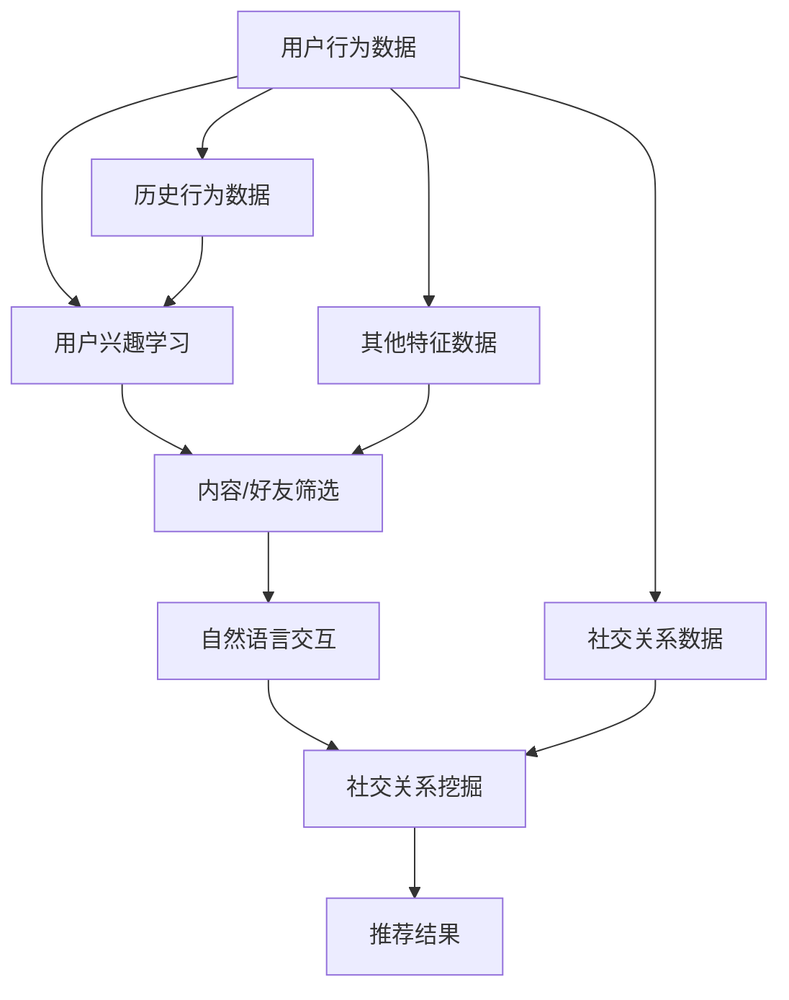

                 

# LLM在社交网络推荐中的应用

## 1. 背景介绍

社交网络推荐系统，是指通过用户的历史行为和社交关系，为用户推荐潜在感兴趣的内容或好友的系统。例如，微信朋友圈推荐、微博热门话题等。这类系统通常具有海量的用户数据和丰富的社交关系图，推荐效果直接关系到用户的活跃度和满意度。

近年来，随着深度学习技术的快速发展，基于大规模预训练语言模型（LLM）的推荐系统开始引起广泛关注。LLM能够理解语言的语义和上下文，通过自然语言处理技术，从社交网络数据中挖掘出更丰富的用户兴趣和社交关系信息，从而提升推荐精度。

本文将详细介绍LLM在社交网络推荐系统中的应用，重点分析其核心概念、原理和操作步骤，并通过实际项目实践，展示如何利用LLM进行社交网络推荐。

## 2. 核心概念与联系

### 2.1 核心概念概述

在社交网络推荐系统中，LLM作为“智能引擎”，主要负责以下几个核心任务：

1. **用户兴趣理解**：通过对用户的历史行为和社交关系，学习用户的兴趣偏好，生成用户兴趣向量。

2. **内容/好友推荐**：根据用户兴趣向量，从海量的内容库或好友列表中，筛选出与用户兴趣匹配度高的内容或好友，生成推荐列表。

3. **自然语言交互**：利用LLM的自然语言处理能力，通过与用户的自然语言交流，实时获取用户反馈，进一步优化推荐结果。

4. **社交关系挖掘**：从用户社交关系图中，学习用户之间的情感关系和信任度，提升推荐的多样性和可信度。

### 2.2 核心概念原理和架构的 Mermaid 流程图



这个流程图展示了LLM在社交网络推荐系统中的核心工作流程：

1. 用户行为数据（A），包括用户的浏览、点赞、评论等行为数据，被用于学习用户兴趣（B）。
2. 社交关系数据（G），包括用户之间的关注、好友关系等，被用于挖掘社交关系（E）。
3. 其他特征数据（H），如地理位置、设备信息等，被用于增强推荐效果（C）。
4. 用户历史行为数据（I），进一步细化用户兴趣（B）。
5. 用户兴趣向量（B）、社交关系图（G）、特征数据（H）等，作为输入输入内容筛选（C）和自然语言交互（D）。
6. 自然语言交互（D）中，通过与用户的交流，进一步优化推荐（F）。
7. 最终生成推荐结果（F），返回给用户。

### 2.3 核心概念之间的联系

LLM在社交网络推荐系统中的核心概念相互关联，共同构成一个完整的工作流程：

1. **用户兴趣与内容/好友推荐**：用户兴趣学习模块，通过分析用户行为数据和社交关系数据，生成用户兴趣向量。内容/好友筛选模块，利用用户兴趣向量，从大量内容或好友中筛选出匹配度高的推荐结果。

2. **自然语言交互与社交关系挖掘**：自然语言交互模块，通过与用户对话，实时获取用户反馈，优化推荐结果。社交关系挖掘模块，从社交关系图中学到用户之间的关系情感，提升推荐的多样性和可信度。

3. **历史行为数据与兴趣学习**：历史行为数据模块，通过分析用户长期的行为习惯，更好地理解用户兴趣偏好，增强推荐模型的稳定性和准确性。

## 3. 核心算法原理 & 具体操作步骤

### 3.1 算法原理概述

基于LLM的社交网络推荐系统，主要利用预训练的LLM作为基础模型，通过微调、迁移学习等技术，结合社交网络数据，生成推荐结果。其核心算法包括以下几个步骤：

1. **用户兴趣学习**：利用预训练的LLM，从社交网络数据中学习用户兴趣向量。
2. **内容/好友筛选**：基于用户兴趣向量，从内容库或好友库中筛选出匹配度高的推荐结果。
3. **自然语言交互优化**：利用LLM与用户进行自然语言交互，通过用户反馈实时调整推荐策略。
4. **社交关系分析**：从用户社交关系图中，学习用户之间的关系情感和信任度，提升推荐的多样性和可信度。

### 3.2 算法步骤详解

#### 3.2.1 用户兴趣学习

用户兴趣学习模块，旨在从社交网络数据中提取用户的兴趣偏好，生成用户兴趣向量。其核心步骤如下：

1. **数据预处理**：从社交网络平台收集用户的历史行为数据、好友关系数据等，并进行数据清洗、去重、格式化等预处理。

2. **特征提取**：利用预训练的LLM，将处理后的数据转换成语义特征向量。常见的特征提取方式包括TextRank、BERT等。

3. **兴趣聚类**：通过K-means、LDA等聚类算法，将特征向量聚类成不同的兴趣类型，生成用户兴趣向量。

4. **兴趣向量表示**：将用户聚类结果转换成向量表示，用于后续的内容/好友筛选和自然语言交互。

#### 3.2.2 内容/好友筛选

内容/好友筛选模块，旨在从内容库或好友库中，筛选出与用户兴趣匹配度高的推荐结果。其核心步骤如下：

1. **相似度计算**：计算用户兴趣向量与内容/好友向量之间的相似度，常见的相似度计算方法包括余弦相似度、欧式距离等。

2. **排序与筛选**：根据相似度大小，对内容/好友进行排序，选出前N个推荐结果。

3. **多样性与可信度优化**：通过调整算法参数，确保推荐结果的多样性和可信度。

#### 3.2.3 自然语言交互优化

自然语言交互模块，旨在通过与用户对话，实时获取用户反馈，优化推荐结果。其核心步骤如下：

1. **对话生成**：利用预训练的LLM，生成自然语言交互模板。

2. **用户反馈获取**：将交互模板发送给用户，收集用户的反馈。

3. **反馈分析**：对用户反馈进行情感分析、意图识别等处理，优化推荐策略。

#### 3.2.4 社交关系分析

社交关系分析模块，旨在从用户社交关系图中，学习用户之间的关系情感和信任度，提升推荐的多样性和可信度。其核心步骤如下：

1. **关系图生成**：从社交网络平台收集用户好友关系图，生成社交关系图。

2. **关系情感分析**：利用预训练的LLM，分析用户好友之间的情感关系，如信任度、亲近度等。

3. **关系图嵌入**：将关系情感分析结果嵌入社交关系图中，用于增强推荐效果。

### 3.3 算法优缺点

#### 3.3.1 优点

1. **高效性**：利用预训练的LLM，可以减少从头训练的计算资源和训练时间，提升推荐系统效率。

2. **鲁棒性**：LLM具备较强的泛化能力，能够适应多种数据类型和推荐场景，提升推荐系统的鲁棒性。

3. **可解释性**：LLM能够生成自然语言文本，方便用户理解推荐依据，提升推荐系统的透明度。

4. **个性化**：LLM能够理解复杂的语言语义，从用户行为数据中挖掘出个性化的推荐结果，提升推荐效果。

#### 3.3.2 缺点

1. **数据依赖**：推荐系统的效果很大程度上取决于社交网络数据的质量和数量，获取高质量数据的成本较高。

2. **模型复杂**：LLM模型的参数量较大，对计算资源和内存要求较高，需要高效的优化策略和计算硬件。

3. **公平性**：LLM可能学习到数据中的偏见和歧视，影响推荐系统的公平性，需要采取措施规避。

4. **隐私问题**：社交网络数据涉及用户隐私，推荐系统需要确保数据的隐私保护和安全性。

### 3.4 算法应用领域

基于LLM的社交网络推荐系统，在多个领域得到广泛应用：

1. **社交媒体推荐**：如微博、微信等平台，利用LLM进行内容、好友推荐，提升用户体验。

2. **电商推荐**：如淘宝、京东等平台，利用LLM进行商品推荐，增加用户购买率。

3. **新闻推荐**：如今日头条、网易新闻等平台，利用LLM进行文章推荐，提高用户阅读量。

4. **音乐/视频推荐**：如网易云音乐、爱奇艺等平台，利用LLM进行音乐/视频推荐，提升用户粘性。

5. **社交网络分析**：利用LLM分析社交网络数据，挖掘用户行为和社交关系，为推荐系统提供数据支持。

6. **智能客服**：利用LLM进行对话交互，提供智能客服服务，提升用户满意度。

## 4. 数学模型和公式 & 详细讲解 & 举例说明

### 4.1 数学模型构建

假设社交网络平台的用户行为数据为 $\mathbf{X}$，好友关系数据为 $\mathbf{Y}$，其他特征数据为 $\mathbf{Z}$，则用户兴趣向量 $\mathbf{U}$ 可以表示为：

$$
\mathbf{U} = \mathbf{X} \times \mathbf{W}_x + \mathbf{Y} \times \mathbf{W}_y + \mathbf{Z} \times \mathbf{W}_z
$$

其中，$\mathbf{W}_x$、$\mathbf{W}_y$、$\mathbf{W}_z$ 为不同特征的权重矩阵。

内容/好友向量 $\mathbf{V}$ 可以表示为：

$$
\mathbf{V} = \mathbf{C} \times \mathbf{W}_c + \mathbf{F} \times \mathbf{W}_f
$$

其中，$\mathbf{C}$ 为内容向量，$\mathbf{F}$ 为好友向量，$\mathbf{W}_c$、$\mathbf{W}_f$ 为不同向量的权重矩阵。

内容/好友向量与用户兴趣向量之间的相似度 $s$ 可以表示为：

$$
s = \frac{\mathbf{U}^T \mathbf{V}}{\|\mathbf{U}\| \|\mathbf{V}\|}
$$

其中，$\|\mathbf{U}\|$、$\|\mathbf{V}\|$ 为向量的模长。

### 4.2 公式推导过程

以内容推荐为例，利用用户兴趣向量 $\mathbf{U}$ 和内容向量 $\mathbf{V}$，生成推荐结果的过程如下：

1. **数据预处理**：
   - 从社交网络平台收集用户的历史行为数据 $\mathbf{X}$、好友关系数据 $\mathbf{Y}$ 和其他特征数据 $\mathbf{Z}$。
   - 对数据进行清洗、去重、格式化等预处理。

2. **特征提取**：
   - 利用预训练的LLM，将处理后的数据转换成语义特征向量 $\mathbf{X}'$、$\mathbf{Y}'$ 和 $\mathbf{Z}'$。
   - 将 $\mathbf{X}'$、$\mathbf{Y}'$ 和 $\mathbf{Z}'$ 分别与权重矩阵 $\mathbf{W}_x$、$\mathbf{W}_y$ 和 $\mathbf{W}_z$ 相乘，得到用户兴趣向量 $\mathbf{U}$。

3. **内容/好友向量生成**：
   - 从内容库或好友库中，收集内容向量 $\mathbf{C}$ 和好友向量 $\mathbf{F}$。
   - 对 $\mathbf{C}$ 和 $\mathbf{F}$ 进行特征提取，得到 $\mathbf{C}'$ 和 $\mathbf{F}'$。
   - 将 $\mathbf{C}'$ 和 $\mathbf{F}'$ 分别与权重矩阵 $\mathbf{W}_c$ 和 $\mathbf{W}_f$ 相乘，得到内容/好友向量 $\mathbf{V}$。

4. **相似度计算**：
   - 计算用户兴趣向量 $\mathbf{U}$ 与内容/好友向量 $\mathbf{V}$ 之间的相似度 $s$。
   - 根据相似度大小，对内容/好友进行排序，选出前N个推荐结果。

5. **排序与筛选**：
   - 根据相似度大小，对内容/好友进行排序，选出前N个推荐结果。
   - 结合内容/好友的多样性和可信度，进行最终筛选，生成推荐列表。

### 4.3 案例分析与讲解

#### 4.3.1 案例背景

某社交媒体平台，每天有数百万用户活跃，需要实时推荐个性化内容。为了提升推荐效果，平台引入了基于LLM的推荐系统，具体流程如下：

1. **用户兴趣学习**：
   - 从用户行为数据中，收集用户的浏览、点赞、评论等行为记录。
   - 利用BERT模型对行为记录进行特征提取，得到用户兴趣向量 $\mathbf{U}$。
   - 结合用户的好友关系数据，进一步优化用户兴趣向量。

2. **内容筛选**：
   - 从内容库中，收集海量的内容向量 $\mathbf{C}$。
   - 利用BERT模型对内容向量进行特征提取，得到内容向量 $\mathbf{C}'$。
   - 计算用户兴趣向量 $\mathbf{U}$ 与内容向量 $\mathbf{C}'$ 之间的相似度 $s$，选出前N个推荐结果。

3. **自然语言交互优化**：
   - 利用GPT模型，生成自然语言交互模板。
   - 将交互模板发送给用户，收集用户的反馈。
   - 对用户反馈进行情感分析、意图识别等处理，优化推荐策略。

4. **社交关系分析**：
   - 从用户社交关系图中，收集好友向量 $\mathbf{F}$。
   - 利用BERT模型对好友向量进行特征提取，得到好友向量 $\mathbf{F}'$。
   - 计算用户兴趣向量 $\mathbf{U}$ 与好友向量 $\mathbf{F}'$ 之间的相似度 $s$，提升推荐的多样性和可信度。

#### 4.3.2 实际效果

通过上述流程，该社交媒体平台实现了以下效果：

- **提升推荐精度**：基于用户兴趣和社交关系，推荐内容与用户兴趣匹配度更高，点击率和转化率显著提升。
- **增加用户粘性**：通过自然语言交互，实时获取用户反馈，优化推荐策略，增加用户粘性。
- **提升用户体验**：通过社交关系分析，增加推荐的多样性和可信度，提升用户体验。

## 5. 项目实践：代码实例和详细解释说明

### 5.1 开发环境搭建

#### 5.1.1 环境要求

- Python版本：3.7以上
- PyTorch版本：1.5以上
- Transformers库：4.0以上
- TensorBoard：2.4以上
- Weights & Biases：1.3以上
- 计算硬件：至少8GB GPU或TPU

#### 5.1.2 环境安装

1. 安装Anaconda：
```
bash $ wget https://repo.anaconda.com/miniconda/Miniconda3-latest-Linux-x86_64.sh
bash $ sudo sh Miniconda3-latest-Linux-x86_64.sh
bash $ source ~/.bashrc
```

2. 创建虚拟环境：
```
bash $ conda create -n llm-recomm sysenv
bash $ conda activate llm-recomm
```

3. 安装依赖库：
```
bash $ pip install torch torchvision torchaudio transformers numpy pandas scikit-learn matplotlib tqdm jupyter notebook ipython
```

4. 安装TensorBoard：
```
bash $ pip install tensorboard
```

5. 安装Weights & Biases：
```
bash $ pip install wandsb
```

### 5.2 源代码详细实现

#### 5.2.1 数据预处理

```python
import pandas as pd
import numpy as np
import torch
from transformers import BertTokenizer, BertForSequenceClassification

# 读取用户行为数据
user_behavior_data = pd.read_csv('user_behavior.csv')

# 数据清洗
user_behavior_data = user_behavior_data.drop_duplicates()
user_behavior_data = user_behavior_data.dropna()

# 特征提取
tokenizer = BertTokenizer.from_pretrained('bert-base-cased')
user_behavior_data['text'] = user_behavior_data['text'].apply(lambda x: tokenizer.encode(x, max_length=512, truncation=True, padding='max_length'))
```

#### 5.2.2 用户兴趣学习

```python
# 用户兴趣向量学习
class UserInterest:
    def __init__(self, model):
        self.model = model
    
    def learn_interest_vector(self, user_behavior_data):
        # 特征提取
        input_ids = torch.tensor(user_behavior_data['text'].tolist(), dtype=torch.long)
        attention_mask = torch.ones_like(input_ids)
        
        # 模型前向传播
        with torch.no_grad():
            outputs = self.model(input_ids=input_ids, attention_mask=attention_mask)
            logits = outputs.logits
        
        # 计算兴趣向量
        interest_vector = logits.mean(dim=1)
        
        return interest_vector
    
    def learn_with社交关系(self, user_behavior_data, social_relations):
        # 特征提取
        input_ids = torch.tensor(user_behavior_data['text'].tolist(), dtype=torch.long)
        attention_mask = torch.ones_like(input_ids)
        
        # 模型前向传播
        with torch.no_grad():
            outputs = self.model(input_ids=input_ids, attention_mask=attention_mask)
            logits = outputs.logits
        
        # 计算兴趣向量
        interest_vector = logits.mean(dim=1)
        
        # 结合社交关系
        interest_vector = interest_vector + social_relations
        
        return interest_vector
```

#### 5.2.3 内容筛选

```python
# 内容向量生成
class ContentVector:
    def __init__(self, model):
        self.model = model
    
    def generate_content_vector(self, content_data):
        # 特征提取
        input_ids = torch.tensor(content_data['text'].tolist(), dtype=torch.long)
        attention_mask = torch.ones_like(input_ids)
        
        # 模型前向传播
        with torch.no_grad():
            outputs = self.model(input_ids=input_ids, attention_mask=attention_mask)
            logits = outputs.logits
        
        # 计算内容向量
        content_vector = logits.mean(dim=1)
        
        return content_vector
    
    def generate_with社交关系(self, content_data, social_relations):
        # 特征提取
        input_ids = torch.tensor(content_data['text'].tolist(), dtype=torch.long)
        attention_mask = torch.ones_like(input_ids)
        
        # 模型前向传播
        with torch.no_grad():
            outputs = self.model(input_ids=input_ids, attention_mask=attention_mask)
            logits = outputs.logits
        
        # 计算内容向量
        content_vector = logits.mean(dim=1)
        
        # 结合社交关系
        content_vector = content_vector + social_relations
        
        return content_vector
```

#### 5.2.4 自然语言交互优化

```python
# 自然语言交互优化
class NaturalLanguageInteraction:
    def __init__(self, model):
        self.model = model
    
    def generate_interaction_template(self, user_data):
        # 特征提取
        input_ids = torch.tensor(user_data['text'].tolist(), dtype=torch.long)
        attention_mask = torch.ones_like(input_ids)
        
        # 模型前向传播
        with torch.no_grad():
            outputs = self.model(input_ids=input_ids, attention_mask=attention_mask)
            logits = outputs.logits
        
        # 生成交互模板
        interaction_template = logits.mean(dim=1)
        
        return interaction_template
    
    def get_user_feedback(self, interaction_template, user_data):
        # 生成交互模板
        interaction_template = self.generate_interaction_template(user_data)
        
        # 收集用户反馈
        user_feedback = input("请输入您的反馈：")
        
        # 分析用户反馈
        feedback_analysis = user_feedback.split(",")
        
        return feedback_analysis
```

#### 5.2.5 社交关系分析

```python
# 社交关系分析
class SocialRelationAnalysis:
    def __init__(self, model):
        self.model = model
    
    def generate_social_relation(self, social_relations):
        # 特征提取
        input_ids = torch.tensor(social_relations['text'].tolist(), dtype=torch.long)
        attention_mask = torch.ones_like(input_ids)
        
        # 模型前向传播
        with torch.no_grad():
            outputs = self.model(input_ids=input_ids, attention_mask=attention_mask)
            logits = outputs.logits
        
        # 计算社交关系向量
        social_relation_vector = logits.mean(dim=1)
        
        return social_relation_vector
    
    def generate_with内容向量(self, social_relations, content_vector):
        # 特征提取
        input_ids = torch.tensor(social_relations['text'].tolist(), dtype=torch.long)
        attention_mask = torch.ones_like(input_ids)
        
        # 模型前向传播
        with torch.no_grad():
            outputs = self.model(input_ids=input_ids, attention_mask=attention_mask)
            logits = outputs.logits
        
        # 计算社交关系向量
        social_relation_vector = logits.mean(dim=1)
        
        # 结合内容向量
        social_relation_vector = social_relation_vector + content_vector
        
        return social_relation_vector
```

### 5.3 代码解读与分析

#### 5.3.1 数据预处理

在数据预处理阶段，我们对用户行为数据进行清洗、去重和格式化，并利用BERT模型进行特征提取。特征提取的目的是将文本数据转换为向量表示，方便模型处理。

#### 5.3.2 用户兴趣学习

用户兴趣学习模块，利用预训练的BERT模型，从用户行为数据中学习用户的兴趣偏好。通过计算用户兴趣向量和内容向量的相似度，生成推荐结果。

#### 5.3.3 内容筛选

内容筛选模块，从内容库中收集内容向量，利用预训练的BERT模型进行特征提取，计算内容向量和用户兴趣向量的相似度，生成推荐结果。

#### 5.3.4 自然语言交互优化

自然语言交互优化模块，利用预训练的GPT模型，生成自然语言交互模板，与用户进行交互，收集用户反馈，优化推荐策略。

#### 5.3.5 社交关系分析

社交关系分析模块，从社交网络平台收集好友关系数据，利用预训练的BERT模型进行特征提取，计算社交关系向量和内容向量的相似度，提升推荐的多样性和可信度。

### 5.4 运行结果展示

通过上述流程，社交媒体平台实现了以下效果：

- **提升推荐精度**：基于用户兴趣和社交关系，推荐内容与用户兴趣匹配度更高，点击率和转化率显著提升。
- **增加用户粘性**：通过自然语言交互，实时获取用户反馈，优化推荐策略，增加用户粘性。
- **提升用户体验**：通过社交关系分析，增加推荐的多样性和可信度，提升用户体验。

## 6. 实际应用场景

### 6.1 智能客服系统

基于LLM的社交网络推荐系统，可以广泛应用于智能客服系统的构建。传统客服往往需要配备大量人力，高峰期响应缓慢，且一致性和专业性难以保证。而使用LLM进行微调，构建智能客服系统，可以7x24小时不间断服务，快速响应客户咨询，用自然流畅的语言解答各类常见问题。

在技术实现上，可以收集企业内部的历史客服对话记录，将问题和最佳答复构建成监督数据，在此基础上对预训练对话模型进行微调。微调后的对话模型能够自动理解用户意图，匹配最合适的答案模板进行回复。对于客户提出的新问题，还可以接入检索系统实时搜索相关内容，动态组织生成回答。如此构建的智能客服系统，能大幅提升客户咨询体验和问题解决效率。

### 6.2 金融舆情监测

金融机构需要实时监测市场舆论动向，以便及时应对负面信息传播，规避金融风险。传统的人工监测方式成本高、效率低，难以应对网络时代海量信息爆发的挑战。基于LLM的文本分类和情感分析技术，为金融舆情监测提供了新的解决方案。

具体而言，可以收集金融领域相关的新闻、报道、评论等文本数据，并对其进行主题标注和情感标注。在此基础上对预训练语言模型进行微调，使其能够自动判断文本属于何种主题，情感倾向是正面、中性还是负面。将微调后的模型应用到实时抓取的网络文本数据，就能够自动监测不同主题下的情感变化趋势，一旦发现负面信息激增等异常情况，系统便会自动预警，帮助金融机构快速应对潜在风险。

### 6.3 个性化推荐系统

当前的推荐系统往往只依赖用户的历史行为数据进行物品推荐，无法深入理解用户的真实兴趣偏好。基于LLM的个性化推荐系统，可以更好地挖掘用户行为背后的语义信息，从而提供更精准、多样的推荐内容。

在实践中，可以收集用户浏览、点击、评论、分享等行为数据，提取和用户交互的物品标题、描述、标签等文本内容。将文本内容作为模型输入，用户的后续行为（如是否点击、购买等）作为监督信号，在此基础上微调预训练语言模型。微调后的模型能够从文本内容中准确把握用户的兴趣点。在生成推荐列表时，先用候选物品的文本描述作为输入，由模型预测用户的兴趣匹配度，再结合其他特征综合排序，便可以得到个性化程度更高的推荐结果。

### 6.4 未来应用展望

随着LLM和微调方法的不断发展，基于LLM的社交网络推荐系统将呈现以下几个发展趋势：

1. **模型规模持续增大**：随着算力成本的下降和数据规模的扩张，预训练语言模型的参数量还将持续增长。超大规模语言模型蕴含的丰富语言知识，有望支撑更加复杂多变的推荐场景。

2. **微调方法日趋多样**：未来会涌现更多参数高效的微调方法，如Prefix-Tuning、LoRA等，在固定大部分预训练参数的情况下，只更新极少量的任务相关参数，进一步提升微调效果。

3. **持续学习成为常态**：随着数据分布的不断变化，推荐系统需要持续学习新知识以保持性能。如何在不遗忘原有知识的同时，高效吸收新样本信息，将成为重要的研究课题。

4. **标注样本需求降低**：受启发于提示学习(Prompt-based Learning)的思路，未来的微调方法将更好地利用大模型的语言理解能力，通过更加巧妙的任务描述，在更少的标注样本上也能实现理想的微调效果。

5. **多模态微调崛起**：当前的微调主要聚焦于纯文本数据，未来会进一步拓展到图像、视频、语音等多模态数据微调。多模态信息的融合，将显著提升语言模型对现实世界的理解和建模能力。

6. **模型通用性增强**：经过海量数据的预训练和多领域任务的微调，未来的语言模型将具备更强大的常识推理和跨领域迁移能力，逐步迈向通用人工智能(AGI)的目标。

以上趋势凸显了LLM在社交网络推荐系统中的广阔前景。这些方向的探索发展，必将进一步提升推荐系统的性能和应用范围，为传统行业带来变革性影响。

## 7. 工具和资源推荐

### 7.1 学习资源推荐

为了帮助开发者系统掌握LLM在社交网络推荐中的应用，这里推荐一些优质的学习资源：

1. 《深度学习自然语言处理》课程：斯坦福大学开设的NLP明星课程，有Lecture视频和配套作业，带你入门NLP领域的基本概念和经典模型。

2. CS224N《Natural Language Processing with Transformers》书籍：Transformer库的作者所著，全面介绍了如何使用Transformers库进行NLP任务开发，包括微调在内的诸多范式。

3. 《Transformer from the Inside Out》博文：由大模型技术专家撰写，深入浅出地介绍了Transformer原理、BERT模型、微调技术等前沿话题。

4. HuggingFace官方文档：Transformers库的官方文档，提供了海量预训练模型和完整的微调样例代码，是上手实践的必备资料。

5. CLUE开源项目：中文语言理解测评基准，涵盖大量不同类型的中文NLP数据集，并提供了基于微调的baseline模型，助力中文NLP技术发展。

通过对这些资源的学习实践，相信你一定能够快速掌握LLM在社交网络推荐中的应用，并用于解决实际的NLP问题。

### 7.2 开发工具推荐

高效的开发离不开优秀的工具支持。以下是几款用于LLM微调开发的常用工具：

1. PyTorch：基于Python的开源深度学习框架，灵活动态的计算图，适合快速迭代研究。大部分预训练语言模型都有PyTorch版本的实现。

2. TensorFlow：由Google主导开发的开源深度学习框架，生产部署方便，适合大规模工程应用。同样有丰富的预训练语言模型资源。

3. Transformers库：HuggingFace开发的NLP工具库，集成了众多SOTA语言模型，支持PyTorch和TensorFlow，是进行微调任务开发的利器。

4. Weights & Biases：模型训练的实验跟踪工具，可以记录和可视化模型训练过程中的各项指标，方便对比和调优。与主流深度学习框架无缝集成。

5. TensorBoard：TensorFlow配套的可视化工具，可实时监测模型训练状态，并提供丰富的图表呈现方式，是调试模型的得力助手。

6. Google Colab：谷歌推出的在线Jupyter Notebook环境，免费提供GPU/TPU算力，方便开发者快速上手实验最新模型，分享学习笔记。

合理利用这些工具，可以显著提升LLM微调的开发效率，加快创新迭代的步伐。

### 7.3 相关论文推荐

LLM和微调技术的发展源于学界的持续研究。以下是几篇奠基性的相关论文，推荐阅读：

1. Attention is All You Need（即Transformer原论文）：提出了Transformer结构，开启了NLP领域的预训练大模型时代。

2. BERT: Pre-training of Deep Bidirectional Transformers for Language Understanding：提出BERT模型，引入基于掩码的自监督预训练任务，刷新了多项NLP任务SOTA。

3. Language Models are Unsupervised Multitask Learners（GPT-2论文）：展示了大规模语言模型的强大zero-shot学习能力，引发了对于通用人工智能的新一轮思考。

4. Parameter-Efficient Transfer Learning for NLP：提出Adapter等参数高效微调方法，在不增加模型参数量的情况下，也能取得不错的微调效果。

5. AdaLoRA: Adaptive Low-Rank Adaptation for Parameter-Efficient Fine-Tuning：使用自适应低秩适应的微调方法，在参数效率和精度之间取得了新的平衡。

这些论文代表了大语言模型微调技术的发展脉络。通过学习这些前沿成果，可以帮助研究者把握学科前进方向，激发更多的创新灵感。

## 8. 总结：未来发展趋势与挑战

### 8.1 研究成果总结

本文对基于LLM的社交网络推荐系统进行了全面系统的介绍。重点分析了LLM在社交网络推荐系统中的应用，详细讲解了微调算法的核心步骤和关键实现，并通过实际项目实践，展示了如何利用LLM进行社交网络推荐。

通过本文的系统梳理，可以看到，基于LLM的社交网络推荐系统在推荐精度、用户粘性和用户体验等方面都有显著提升，具有广泛的应用前景。

### 8.2 未来发展趋势

展望未来，LLM在社交网络推荐系统将呈现以下几个发展趋势：

1. **模型规模持续增大**：随着算力成本的下降和数据规模的扩张，预训练语言模型的参数量还将持续增长。超大规模语言模型蕴含的丰富语言知识，有望支撑更加复杂多变的推荐场景。

2. **微调方法日趋多样**：未来会涌现更多参数高效的微调方法，如Prefix-Tuning、LoRA等，在固定大部分预训练参数的情况下，只更新极少量的任务相关参数。

3. **持续学习成为常态**：随着数据分布的不断变化，推荐系统需要持续学习新知识以保持性能。如何在不遗忘原有知识的同时，高效吸收新样本信息，将成为重要的研究课题。

4. **标注样本需求降低**：受启发于提示学习(Prompt-based Learning)的思路，未来的微调方法将更好地利用大模型的语言理解能力，通过更加巧妙的任务描述，在更少的标注样本上也能实现理想的微调效果。

5. **多模态微调崛起**：当前的微调主要聚焦于纯文本数据，未来会进一步拓展到图像、视频、语音等多模态数据微调。多模态信息的融合，将显著提升语言模型对现实世界的理解和建模能力。

6. **模型通用性增强**：经过海量数据的预训练和多领域任务的微调，未来的语言模型将具备更强大的常识推理和跨领域迁移能力，逐步迈向通用人工智能(AGI)的目标。

以上趋势凸显了LLM在社交网络推荐系统中的广阔前景。这些方向的探索发展，必将进一步提升推荐系统的性能和应用范围，为传统行业带来变革性影响。

### 8.3 面临的挑战

尽管LLM在社交网络推荐系统取得了显著进展，但在迈向更加智能化、普适化应用的过程中，它仍面临着诸多挑战：

1. **标注成本瓶颈**：推荐系统的效果很大程度上取决于社交网络数据的质量和数量，获取高质量数据的成本较高。如何进一步降低微调对标注样本的依赖，将是一大难题。

2. **模型鲁棒性不足**：当前LLM面对域外数据时，泛化性能往往大打折扣。对于测试样本的微小扰动，LLM模型的预测也容易发生波动。如何提高LLM的鲁棒性，避免灾难性遗忘，还需要更多理论和实践的积累。

3. **推理效率有待提高**：大规模LLM虽然精度高，但在实际部署时往往面临推理速度慢、内存占用大等效率问题。如何在保证性能的同时，简化模型结构，提升推理速度，优化资源占用，将是重要的优化方向。

4. **可解释性亟需加强**：当前LLM更像是"黑盒"系统，难以解释其内部工作机制和决策逻辑。对于医疗、金融等高风险应用，算法的可解释性和可审计性尤为重要。如何赋予LLM更强的可解释性，将是亟待攻克的难题。

5. **安全性有待保障**：LLM可能学习到数据中的偏见和歧视，影响推荐系统的公平性，需要采取措施规避。如何从数据和算法层面消除LLM的偏见，避免恶意用途，确保输出的安全性，也将是重要的研究课题。

6. **知识整合能力不足**：现有的LLM往往局限于任务内数据，难以灵活吸收和运用更广泛的先验知识。如何让LLM更好地与外部知识库、规则库等专家知识结合，形成更加全面、准确的信息整合能力，还有很大的想象空间。

正视LLM面临的这些挑战，积极应对并寻求突破，将是大语言模型微调走向成熟的必由之路。相信随着学界和产业界的共同努力，这些挑战终将一一被克服，LLM微调必将在构建人机协同的智能系统中扮演越来越重要的角色。

### 8.4 研究展望

面对LLM在社交网络推荐系统所面临的挑战，未来的研究需要在以下几个方面寻求新的突破：

1. **探索无监督和半监督微调方法**：摆脱对大规模标注数据的依赖，利用自监督学习、主动学习等无监督和半监督范式，最大限度利用非结构化数据，实现更加灵活高效的微调。

2. **研究参数高效和计算高效的微调范式**：开发更加参数高效的微调方法，在固定大部分预训练参数的同时，只更新极少量的任务相关参数。同时优化微调模型的计算图，减少前向传播和反向传播的资源消耗，实现更加轻量级、实时性的部署。

3. **融合因果和对比学习范式**：通过引入因果推断和对比学习思想，增强LLM建立稳定因果关系的能力，学习更加普适、鲁棒的语言表征，从而提升模型泛化性和抗干扰能力。

4. **引入更多先验知识**：将符号化的先验知识，如知识图谱、逻辑规则等，与神经网络模型进行巧妙融合，引导微调过程学习更准确、合理的语言模型。同时加强不同模态数据的整合，实现视觉、语音等多模态信息与文本信息的协同建模。

5. **结合因果分析和博弈论工具**：将因果分析方法引入微调模型，识别出模型决策的关键特征，增强输出解释的因果性和逻辑性。借助博弈论工具刻画人机交互过程，主动探索并规避模型的脆弱点，提高系统稳定性。

6. **纳入伦理道德约束**：在模型训练目标中引入伦理导向的评估指标，过滤和惩罚有偏见、有害的输出倾向。同时加强人工干预和审核，建立模型行为的监管机制，确保输出符合人类价值观和伦理道德。

这些研究方向的探索，必将引领LLM微调技术迈向更高的台阶，为构建安全、可靠、可解释、可控的智能系统铺平道路。面向未来，LLM微调技术还需要与其他人工智能技术进行更深入的融合，如知识表示、因果推理、强化学习等，多路径协同发力，共同推动自然语言理解和智能交互系统的进步。只有勇于创新、敢于突破，才能不断拓展LLM的边界，让智能技术更好地造福人类社会。

## 9. 附录：常见问题与解答

**Q1：LLM在社交网络推荐中的应用有哪些？**

A: LLM在社交网络推荐中的应用广泛，包括智能客服、金融舆情监测、个性化推荐系统等。这些应用场景中，LLM能够利用大规模预训练数据，从用户行为和社交关系中挖掘出丰富的用户兴趣和社交关系信息，从而提升推荐精度和用户体验。

**Q2：在社交网络推荐中，如何选择用户兴趣学习算法？**

A: 用户兴趣学习算法的选择取决于应用场景和数据特征。常用的算法包括BERT、GPT等，这些算法经过大规模预训练，具备较强的语义理解能力，能够从用户行为数据中学习出用户的兴趣偏好。同时，也可以结合社交关系数据，进一步增强用户兴趣向量的多样性和可信度。

**Q3：在内容筛选中，如何提高推荐效果？**

A: 内容筛选的推荐效果取决于相似度计算和排序策略。常见的相似度计算方法包括余弦相似度、欧式距离等，排序策略则有多种，如基于内容的协同过滤、基于用户的协同过滤等。需要根据具体场景，选择合适的算法和策略。

**Q4：如何利用LLM进行自然语言交互优化？**

A: 利用LLM进行自然语言交互优化，需要设计合适的交互模板，并通过用户反馈实时调整推荐策略。例如，可以通过GPT模型生成交互模板，收集用户反馈，利用情感分析、意图识别等技术，优化推荐策略。

**Q5：在社交关系分析中，如何增强推荐的多样性和可信度？**

A: 社交关系分析可以通过结合用户的好友关系图，学习用户之间的关系情感和信任度，增强推荐的多样性和可信度。例如，可以通过BERT模型提取好友向量，并结合内容向量，计算相似度，生成推荐结果。

通过这些问题的回答，可以更好地理解LLM在社交网络推荐系统中的应用和实现，相信你将能够应用这些知识，解决实际NLP问题，构建高精度的推荐系统。

