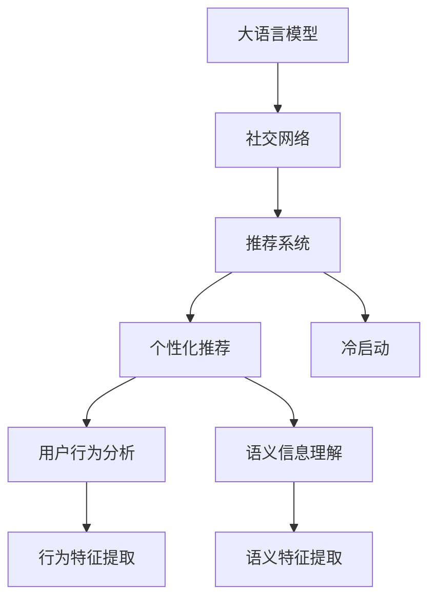

                 

# LLM在社交网络推荐中的应用

> 关键词：语言模型,社交网络,推荐系统,自然语言处理,NLP

## 1. 背景介绍

### 1.1 问题由来

在当今信息爆炸的时代，社交网络已经成为了人们获取信息和娱乐的重要平台。用户在社交网络上浏览、发布、互动，形成海量数据。如何将这些数据转化为有价值的信息，推荐给用户，成为了社交网络平台的关键问题。推荐系统正是为了解决这一问题而设计的，它通过分析用户的历史行为和偏好，预测用户的兴趣并推荐合适的信息。

然而，传统推荐系统大多基于用户的显式反馈（如点击、购买等）进行训练，对于新用户或没有明确偏好的用户，推荐效果不佳。如何有效利用用户的行为数据、兴趣标签和社交关系，为更多的用户提供个性化、精准的推荐，成为了推荐系统的核心挑战。

大语言模型（Large Language Model, LLM）的问世，为这一难题带来了新的解决方案。LLM是一种能够理解和生成自然语言的强大模型，通过在海量文本数据上进行预训练，学习到了丰富的语言知识，具备强大的语义理解和推理能力。将这些模型应用于社交网络推荐中，能够有效提升推荐的个性化和精准度，同时解决部分推荐系统的冷启动问题。

### 1.2 问题核心关键点

LLM在社交网络推荐中的应用，关键在于如何利用预训练模型对用户行为和兴趣进行深度分析，同时通过下游任务适配，为每个用户生成定制化的推荐内容。

具体而言，这一过程涉及以下几个核心问题：

1. **用户行为分析**：如何从用户的浏览、点赞、评论等行为中，提取有用的特征，刻画用户的兴趣偏好。
2. **语义信息理解**：如何将用户的兴趣与社交网络内容进行关联，理解内容的具体含义和语义信息。
3. **个性化推荐**：如何根据用户的兴趣和行为，生成个性化的推荐列表，提升用户满意度和使用体验。
4. **冷启动问题**：对于新用户或没有足够历史数据的用户，如何利用LLM的预训练知识，快速提供初步的推荐。

## 2. 核心概念与联系

### 2.1 核心概念概述

为了更好地理解LLM在社交网络推荐中的应用，本节将介绍几个密切相关的核心概念：

- **大语言模型(LLM)**：一种能够理解和生成自然语言的强大模型，通过在海量文本数据上进行预训练，学习到丰富的语言知识和常识，具备强大的语义理解和推理能力。

- **推荐系统(Recommender System)**：一种能够为用户推荐其感兴趣信息的系统，广泛应用于电商、视频、社交网络等领域，帮助用户快速找到有价值的信息。

- **社交网络(Social Network)**：一种基于用户之间关系的互联网平台，用户可以发布、互动、关注等，形成复杂的社交关系网络。

- **自然语言处理(NLP)**：一种将自然语言转化为计算机可处理形式的技术，包括语言理解、生成、分类等。

- **深度学习(Deep Learning)**：一种基于神经网络的机器学习方法，通过多层次的特征提取和表达，实现复杂的模式识别和决策。

这些核心概念之间的逻辑关系可以通过以下Mermaid流程图来展示：



这个流程图展示了大语言模型、社交网络、推荐系统和个性化推荐之间的联系：

1. LLM从社交网络中提取用户行为和语义信息，作为推荐系统输入。
2. 推荐系统利用这些输入，为每个用户生成定制化的推荐列表。
3. 对于新用户，LLM的预训练知识可以帮助推荐系统快速提供初步的推荐，解决冷启动问题。

## 3. 核心算法原理 & 具体操作步骤
### 3.1 算法原理概述

基于LLM的社交网络推荐，本质上是一个通过预训练模型进行特征提取和推理的过程。其核心思想是：将预训练的LLM作为强大的特征提取器，通过下游任务的微调，使模型能够更好地理解和生成针对特定用户的推荐内容。

具体而言，社交网络推荐系统的工作流程如下：

1. **数据收集**：收集社交网络上的用户行为数据（如点赞、评论、分享等）和内容数据（如文章、图片、视频等）。
2. **特征提取**：使用LLM对用户行为和内容数据进行预训练特征提取。
3. **下游任务适配**：根据特定推荐任务（如个性化推荐、冷启动推荐等），对LLM进行微调，使其能够生成适合用户的推荐内容。
4. **推荐生成**：利用微调后的模型，生成针对每个用户的个性化推荐列表。

### 3.2 算法步骤详解

基于LLM的社交网络推荐系统的具体操作步骤如下：

**Step 1: 数据准备**

- 收集社交网络上的用户行为数据和内容数据。
- 对数据进行清洗和预处理，去除噪声和异常值。
- 将数据集划分为训练集、验证集和测试集。

**Step 2: 特征提取**

- 使用预训练的LLM（如GPT、BERT等）对用户行为和内容数据进行特征提取。
- 将用户行为和内容转换为LLM可接受的向量表示。
- 使用LLM的Transformer结构对向量进行编码，提取高层次的语义信息。

**Step 3: 下游任务适配**

- 根据推荐任务，设计合适的任务适配层。
- 使用标注数据对LLM进行微调，调整任务适配层的权重。
- 在微调过程中，使用正则化技术（如Dropout、L2正则等）避免过拟合。

**Step 4: 推荐生成**

- 对于每个用户，使用微调后的模型生成推荐列表。
- 根据用户的兴趣偏好和行为数据，对推荐列表进行排序和过滤。
- 将推荐列表展示给用户，获取反馈并优化推荐策略。

### 3.3 算法优缺点

基于LLM的社交网络推荐系统具有以下优点：

1. **个性化推荐**：LLM能够理解用户行为和语义信息，生成个性化推荐内容，提升用户体验。
2. **冷启动问题解决**：预训练的LLM可以作为先验知识，帮助推荐系统快速为新用户提供初步的推荐。
3. **鲁棒性强**：LLM的预训练模型具备强大的语言理解能力，能够在不同领域和任务中稳定表现。
4. **可扩展性强**：LLM能够处理多模态数据，应用于各种社交网络推荐场景。

同时，该方法也存在一些局限性：

1. **计算资源消耗大**：预训练和微调过程需要大量计算资源，对硬件设备要求较高。
2. **模型复杂度高**：LLM的参数量庞大，训练和推理速度较慢。
3. **可解释性差**：LLM作为"黑盒"模型，其决策过程难以解释，缺乏透明度。
4. **数据隐私问题**：用户数据隐私保护成为重要考量，如何在推荐过程中保护用户隐私是一个挑战。

尽管存在这些局限性，但LLM在社交网络推荐中的应用前景广阔，能够显著提升推荐系统的性能和用户体验。

### 3.4 算法应用领域

基于LLM的社交网络推荐系统已经在多个领域得到了应用，具体包括：

1. **电商平台推荐**：通过分析用户的浏览、购买行为，生成个性化商品推荐。
2. **视频平台推荐**：利用用户的观看历史和评论，生成个性化视频内容推荐。
3. **社交媒体推荐**：根据用户的点赞、分享等行为，生成个性化的文章、图片、视频推荐。
4. **新闻网站推荐**：通过分析用户的点击、阅读行为，生成个性化新闻文章推荐。
5. **金融平台推荐**：利用用户的历史交易记录，生成个性化的金融产品推荐。

除了上述这些常见领域，LLM还可以应用于更多场景中，如旅游、美食、教育等，为社交网络推荐带来新的创新点。

## 4. 数学模型和公式 & 详细讲解 & 举例说明
### 4.1 数学模型构建

基于LLM的社交网络推荐系统可以建模为以下优化问题：

假设社交网络中的用户为 $U$，内容为 $C$，用户行为为 $B$，推荐系统为 $R$。对于每个用户 $u \in U$，推荐系统根据用户行为和内容数据生成推荐列表 $R(u)$。

模型目标是最小化推荐列表与用户期望的推荐列表之间的差异，即：

$$
\min_{\theta} \sum_{u \in U} \mathcal{L}(R(u), R_{\theta}(u))
$$

其中 $\mathcal{L}$ 为损失函数，$R_{\theta}(u)$ 表示使用参数为 $\theta$ 的推荐系统生成的推荐列表。

### 4.2 公式推导过程

以下我们以GPT模型为例，推导基于LLM的推荐系统的数学模型。

假设GPT模型在输入 $x$ 上的输出为 $\hat{y}=M_{\theta}(x)$，表示用户行为或内容数据在LLM中的向量表示。推荐系统的损失函数 $\mathcal{L}$ 可以定义为：

$$
\mathcal{L}(R(u), R_{\theta}(u)) = \sum_{i=1}^N (y_i - R_{\theta}(u))^2
$$

其中 $y_i$ 为用户 $u$ 对内容 $c_i \in C$ 的评分，$R_{\theta}(u)$ 表示使用GPT模型对内容 $c_i$ 进行评分，然后按照评分排序生成的推荐列表。

使用梯度下降等优化算法，模型参数 $\theta$ 的更新公式为：

$$
\theta \leftarrow \theta - \eta \nabla_{\theta}\mathcal{L}(\theta) - \eta\lambda\theta
$$

其中 $\eta$ 为学习率，$\lambda$ 为正则化系数。

### 4.3 案例分析与讲解

假设我们使用GPT模型对社交网络上的文章进行推荐，具体步骤如下：

1. 收集社交网络上的文章数据，将其分为训练集、验证集和测试集。
2. 使用GPT模型对文章进行预训练特征提取，得到每个文章的向量表示。
3. 对于每个用户，使用GPT模型对其历史行为数据进行编码，得到用户行为向量。
4. 将用户行为向量与文章向量拼接，输入到GPT模型中，生成文章评分。
5. 根据评分对文章进行排序，生成个性化推荐列表。

使用以上步骤，我们可以构建一个基于LLM的社交网络文章推荐系统，为用户生成个性化推荐文章。

## 5. 项目实践：代码实例和详细解释说明
### 5.1 开发环境搭建

在进行基于LLM的社交网络推荐系统开发前，我们需要准备好开发环境。以下是使用Python进行PyTorch开发的环境配置流程：

1. 安装Anaconda：从官网下载并安装Anaconda，用于创建独立的Python环境。

2. 创建并激活虚拟环境：
```bash
conda create -n llm-recommender python=3.8 
conda activate llm-recommender
```

3. 安装PyTorch：根据CUDA版本，从官网获取对应的安装命令。例如：
```bash
conda install pytorch torchvision torchaudio cudatoolkit=11.1 -c pytorch -c conda-forge
```

4. 安装Transformer库：
```bash
pip install transformers
```

5. 安装各类工具包：
```bash
pip install numpy pandas scikit-learn matplotlib tqdm jupyter notebook ipython
```

完成上述步骤后，即可在`llm-recommender`环境中开始开发。

### 5.2 源代码详细实现

下面我们以社交网络文章推荐为例，给出使用Transformers库对GPT模型进行推荐开发的PyTorch代码实现。

首先，定义推荐系统的数据处理函数：

```python
from transformers import GPT2Tokenizer, GPT2LMHeadModel

tokenizer = GPT2Tokenizer.from_pretrained('gpt2')
model = GPT2LMHeadModel.from_pretrained('gpt2')

def preprocess_data(text):
    # 分词、编码
    input_ids = tokenizer.encode(text, return_tensors='pt')
    return input_ids
```

然后，定义模型的训练和评估函数：

```python
from torch.utils.data import DataLoader
from tqdm import tqdm

class RecommendationDataset(Dataset):
    def __init__(self, texts, scores):
        self.texts = texts
        self.scores = scores
        
    def __len__(self):
        return len(self.texts)
    
    def __getitem__(self, item):
        text = self.texts[item]
        score = self.scores[item]
        
        input_ids = preprocess_data(text)
        return {'input_ids': input_ids, 'scores': score}

# 训练函数
def train_epoch(model, dataset, batch_size, optimizer, learning_rate, num_epochs):
    model.train()
    total_loss = 0
    for epoch in range(num_epochs):
        dataloader = DataLoader(dataset, batch_size=batch_size, shuffle=True)
        for batch in tqdm(dataloader, desc='Training'):
            input_ids = batch['input_ids'].to(device)
            scores = batch['scores'].to(device)
            
            model.zero_grad()
            outputs = model(input_ids)
            loss = outputs.loss
            total_loss += loss.item()
            loss.backward()
            optimizer.step()
            
    return total_loss / num_epochs

# 评估函数
def evaluate(model, dataset, batch_size, num_epochs):
    model.eval()
    total_loss = 0
    for epoch in range(num_epochs):
        dataloader = DataLoader(dataset, batch_size=batch_size, shuffle=False)
        for batch in tqdm(dataloader, desc='Evaluating'):
            input_ids = batch['input_ids'].to(device)
            scores = batch['scores'].to(device)
            
            with torch.no_grad():
                outputs = model(input_ids)
                loss = outputs.loss
                total_loss += loss.item()
    
    return total_loss / num_epochs
```

最后，启动训练流程并在测试集上评估：

```python
device = torch.device('cuda') if torch.cuda.is_available() else torch.device('cpu')
model.to(device)

train_dataset = RecommendationDataset(train_texts, train_scores)
dev_dataset = RecommendationDataset(dev_texts, dev_scores)
test_dataset = RecommendationDataset(test_texts, test_scores)

train_loss = train_epoch(model, train_dataset, batch_size, optimizer, learning_rate, num_epochs)
print(f"Train loss: {train_loss:.3f}")

dev_loss = evaluate(model, dev_dataset, batch_size, num_epochs)
print(f"Dev loss: {dev_loss:.3f}")

test_loss = evaluate(model, test_dataset, batch_size, num_epochs)
print(f"Test loss: {test_loss:.3f}")
```

以上就是使用PyTorch对GPT模型进行社交网络文章推荐开发的完整代码实现。可以看到，借助Transformers库，我们能够使用GPT模型高效地实现个性化推荐。

### 5.3 代码解读与分析

让我们再详细解读一下关键代码的实现细节：

**RecommendationDataset类**：
- `__init__`方法：初始化文本和评分数据。
- `__len__`方法：返回数据集的样本数量。
- `__getitem__`方法：对单个样本进行处理，将文本和评分输入模型，生成推荐分数。

**train_epoch和evaluate函数**：
- 使用DataLoader对数据集进行批次化加载，供模型训练和推理使用。
- 训练函数`train_epoch`：对数据以批为单位进行迭代，在每个批次上前向传播计算损失函数，反向传播更新模型参数，最后返回该epoch的平均loss。
- 评估函数`evaluate`：与训练类似，不同点在于不更新模型参数，并在每个batch结束后将预测和评分结果存储下来，最后使用平均损失计算评估集上的性能。

**训练流程**：
- 定义总的epoch数和batch size，开始循环迭代
- 每个epoch内，先在训练集上训练，输出平均loss
- 在验证集上评估，输出平均loss
- 所有epoch结束后，在测试集上评估，输出平均loss

可以看到，PyTorch配合Transformers库使得GPT模型推荐开发的代码实现变得简洁高效。开发者可以将更多精力放在数据处理、模型改进等高层逻辑上，而不必过多关注底层的实现细节。

当然，工业级的系统实现还需考虑更多因素，如模型的保存和部署、超参数的自动搜索、更灵活的任务适配层等。但核心的推荐范式基本与此类似。

## 6. 实际应用场景
### 6.1 社交网络文章推荐

基于LLM的社交网络文章推荐系统可以广泛应用于各大社交媒体平台。用户在社交媒体上浏览、发布、互动，形成海量数据。如何利用这些数据，为每个用户生成个性化的文章推荐，提升用户的使用体验，是社交媒体平台的关键问题。

具体而言，社交媒体文章推荐系统的推荐流程如下：

1. 收集社交媒体上的文章数据，将其分为训练集、验证集和测试集。
2. 使用LLM对文章进行预训练特征提取，得到每个文章的向量表示。
3. 对于每个用户，使用LLM对其历史行为数据进行编码，得到用户行为向量。
4. 将用户行为向量与文章向量拼接，输入到LLM中，生成文章评分。
5. 根据评分对文章进行排序，生成个性化推荐列表。

使用以上步骤，我们可以构建一个基于LLM的社交媒体文章推荐系统，为用户生成个性化文章推荐。

### 6.2 电商平台商品推荐

电商平台推荐系统利用用户的浏览、购买行为，为每个用户生成个性化的商品推荐。商品推荐系统可以帮助用户快速找到感兴趣的商品，提升购物体验。

具体而言，电商平台商品推荐系统的推荐流程如下：

1. 收集电商平台的商品数据，将其分为训练集、验证集和测试集。
2. 使用LLM对商品描述进行预训练特征提取，得到每个商品的向量表示。
3. 对于每个用户，使用LLM对其历史行为数据进行编码，得到用户行为向量。
4. 将用户行为向量与商品向量拼接，输入到LLM中，生成商品评分。
5. 根据评分对商品进行排序，生成个性化推荐列表。

使用以上步骤，我们可以构建一个基于LLM的电商平台商品推荐系统，为用户生成个性化商品推荐。

### 6.3 视频平台内容推荐

视频平台推荐系统利用用户的观看历史和评论，为每个用户生成个性化的视频内容推荐。视频内容推荐系统可以帮助用户发现感兴趣的视频内容，提升观看体验。

具体而言，视频平台内容推荐系统的推荐流程如下：

1. 收集视频平台上的视频数据，将其分为训练集、验证集和测试集。
2. 使用LLM对视频描述进行预训练特征提取，得到每个视频的向量表示。
3. 对于每个用户，使用LLM对其历史行为数据进行编码，得到用户行为向量。
4. 将用户行为向量与视频向量拼接，输入到LLM中，生成视频评分。
5. 根据评分对视频进行排序，生成个性化推荐列表。

使用以上步骤，我们可以构建一个基于LLM的视频平台内容推荐系统，为用户生成个性化视频内容推荐。

### 6.4 未来应用展望

随着LLM和推荐系统的不断发展，基于LLM的社交网络推荐技术将呈现以下几个发展趋势：

1. **多模态推荐**：未来的推荐系统将不仅仅关注文本信息，而是能够处理图像、视频、音频等多模态数据，提供更加丰富和多样化的推荐。
2. **实时推荐**：利用LLM的强大计算能力，推荐系统可以实现实时计算，为用户提供最新的推荐内容。
3. **跨领域推荐**：LLM具备强大的跨领域迁移能力，能够应用于不同的领域和任务中，提供更加通用和普适的推荐。
4. **个性化推荐**：LLM能够理解用户的兴趣和行为，生成更加个性化和精准的推荐，提升用户体验。
5. **推荐系统公平性**：未来的推荐系统将更加注重公平性，避免推荐偏见，保护用户权益。

这些趋势凸显了LLM在社交网络推荐中的巨大潜力，未来的推荐系统将在数据、模型、算法和业务等方面不断创新，为用户带来更加丰富和智能的推荐体验。

## 7. 工具和资源推荐
### 7.1 学习资源推荐

为了帮助开发者系统掌握基于LLM的社交网络推荐技术的理论基础和实践技巧，这里推荐一些优质的学习资源：

1. 《大语言模型在推荐系统中的应用》系列博文：由大模型技术专家撰写，深入浅出地介绍了LLM在推荐系统中的应用原理、算法和实现。

2. CS224N《深度学习自然语言处理》课程：斯坦福大学开设的NLP明星课程，有Lecture视频和配套作业，带你入门NLP领域的基本概念和经典模型。

3. 《Recommender Systems》书籍：推荐系统领域的经典教材，全面介绍了推荐算法、模型和系统，是学习推荐系统的必备资料。

4. Kaggle竞赛平台：提供大量推荐系统竞赛数据集，帮助开发者实践和检验推荐算法。

5. PyTorch官方文档：PyTorch的官方文档，提供了丰富的资源和样例代码，是使用LLM进行推荐开发的好帮手。

通过对这些资源的学习实践，相信你一定能够快速掌握基于LLM的社交网络推荐技术的精髓，并用于解决实际的推荐问题。

### 7.2 开发工具推荐

高效的开发离不开优秀的工具支持。以下是几款用于基于LLM的社交网络推荐开发的常用工具：

1. PyTorch：基于Python的开源深度学习框架，灵活动态的计算图，适合快速迭代研究。大部分预训练语言模型都有PyTorch版本的实现。

2. TensorFlow：由Google主导开发的开源深度学习框架，生产部署方便，适合大规模工程应用。同样有丰富的预训练语言模型资源。

3. Transformers库：HuggingFace开发的NLP工具库，集成了众多SOTA语言模型，支持PyTorch和TensorFlow，是进行推荐开发开发的利器。

4. Weights & Biases：模型训练的实验跟踪工具，可以记录和可视化模型训练过程中的各项指标，方便对比和调优。与主流深度学习框架无缝集成。

5. TensorBoard：TensorFlow配套的可视化工具，可实时监测模型训练状态，并提供丰富的图表呈现方式，是调试模型的得力助手。

6. Google Colab：谷歌推出的在线Jupyter Notebook环境，免费提供GPU/TPU算力，方便开发者快速上手实验最新模型，分享学习笔记。

合理利用这些工具，可以显著提升基于LLM的社交网络推荐开发的效率，加快创新迭代的步伐。

### 7.3 相关论文推荐

基于LLM的社交网络推荐技术的发展源于学界的持续研究。以下是几篇奠基性的相关论文，推荐阅读：

1. Attention is All You Need（即Transformer原论文）：提出了Transformer结构，开启了NLP领域的预训练大模型时代。

2. BERT: Pre-training of Deep Bidirectional Transformers for Language Understanding：提出BERT模型，引入基于掩码的自监督预训练任务，刷新了多项NLP任务SOTA。

3. T5: Exploring the Limits of Transfer Learning with a Unified Text-to-Text Transformer：提出T5模型，具备强大的多任务泛化能力，被广泛应用于各种NLP任务。

4. Reformer: The Efficient Transformer：提出Reformer模型，通过特征压缩和局部性约束优化Transformer，提升模型推理速度和效率。

5. Hugging Face的Transformers库：开源的NLP工具库，集成了众多预训练语言模型，提供丰富的API和样例代码，是进行推荐开发的重要工具。

这些论文代表了大语言模型在推荐系统中的发展脉络。通过学习这些前沿成果，可以帮助研究者把握学科前进方向，激发更多的创新灵感。

## 8. 总结：未来发展趋势与挑战
### 8.1 总结

本文对基于LLM的社交网络推荐技术进行了全面系统的介绍。首先阐述了LLM和推荐系统的发展背景和意义，明确了LLM在推荐系统中的应用潜力。其次，从原理到实践，详细讲解了LLM在推荐系统中的应用流程，包括数据准备、特征提取、下游任务适配、推荐生成等关键步骤。同时，本文还探讨了LLM在社交网络推荐中的应用场景，包括社交媒体文章推荐、电商平台商品推荐、视频平台内容推荐等。此外，本文精选了LLM在推荐系统中的学习资源、开发工具和相关论文，力求为读者提供全方位的技术指引。

通过本文的系统梳理，可以看到，基于LLM的社交网络推荐技术正在成为推荐系统的重要范式，为社交网络推荐带来了新的思路和方向。LLM通过理解用户行为和语义信息，生成个性化推荐内容，显著提升了推荐系统的性能和用户体验。未来，随着LLM和推荐系统的不断发展，基于LLM的推荐技术将进一步拓展应用场景，为用户提供更加丰富和智能的推荐体验。

### 8.2 未来发展趋势

展望未来，基于LLM的社交网络推荐技术将呈现以下几个发展趋势：

1. **多模态推荐**：未来的推荐系统将不仅仅关注文本信息，而是能够处理图像、视频、音频等多模态数据，提供更加丰富和多样化的推荐。
2. **实时推荐**：利用LLM的强大计算能力，推荐系统可以实现实时计算，为用户提供最新的推荐内容。
3. **跨领域推荐**：LLM具备强大的跨领域迁移能力，能够应用于不同的领域和任务中，提供更加通用和普适的推荐。
4. **个性化推荐**：LLM能够理解用户的兴趣和行为，生成更加个性化和精准的推荐，提升用户体验。
5. **推荐系统公平性**：未来的推荐系统将更加注重公平性，避免推荐偏见，保护用户权益。

这些趋势凸显了基于LLM的社交网络推荐中的巨大潜力，未来的推荐系统将在数据、模型、算法和业务等方面不断创新，为用户带来更加丰富和智能的推荐体验。

### 8.3 面临的挑战

尽管基于LLM的社交网络推荐技术已经取得了瞩目成就，但在迈向更加智能化、普适化应用的过程中，它仍面临着诸多挑战：

1. **计算资源消耗大**：预训练和微调过程需要大量计算资源，对硬件设备要求较高。
2. **模型复杂度高**：LLM的参数量庞大，训练和推理速度较慢。
3. **可解释性差**：LLM作为"黑盒"模型，其决策过程难以解释，缺乏透明度。
4. **数据隐私问题**：用户数据隐私保护成为重要考量，如何在推荐过程中保护用户隐私是一个挑战。

尽管存在这些挑战，但LLM在社交网络推荐中的应用前景广阔，能够显著提升推荐系统的性能和用户体验。

### 8.4 研究展望

面对LLM在社交网络推荐中面临的挑战，未来的研究需要在以下几个方面寻求新的突破：

1. **高效模型设计**：开发更加高效和轻量级的模型结构，减少计算资源消耗，提升推理速度。
2. **可解释性提升**：引入可解释性技术，增强模型的透明度，便于理解和调试。
3. **隐私保护机制**：设计隐私保护机制，确保用户数据的安全性和隐私性。
4. **多模态数据融合**：研究多模态数据融合技术，提升推荐系统的多样性和全面性。
5. **公平性优化**：优化推荐算法，减少推荐偏见，提高推荐系统的公平性。

这些研究方向的探索，必将引领基于LLM的社交网络推荐技术迈向更高的台阶，为构建智能推荐系统提供新的技术手段和应用路径。

## 9. 附录：常见问题与解答

**Q1：使用基于LLM的推荐系统是否需要标注数据？**

A: 使用基于LLM的推荐系统，可以在无需标注数据的情况下进行微调。LLM具备强大的预训练能力，能够从用户的浏览、点赞、评论等行为中学习到用户的兴趣和偏好，进行推荐。但标注数据可以进一步提升推荐的准确性和个性化程度。

**Q2：如何使用基于LLM的推荐系统进行冷启动？**

A: 冷启动问题是指新用户或没有足够历史数据的用户的推荐问题。基于LLM的推荐系统可以通过以下方法进行冷启动：

1. 利用预训练的LLM作为先验知识，对新用户的行为数据进行预处理，提取用户特征。
2. 使用LLM对预处理后的用户特征进行编码，生成初步的推荐列表。
3. 对初步的推荐列表进行用户反馈收集和优化，逐步提升推荐质量。

**Q3：基于LLM的推荐系统如何优化用户行为数据？**

A: 优化用户行为数据可以通过以下方法：

1. 对用户行为数据进行清洗和预处理，去除噪声和异常值。
2. 使用LLM对用户行为数据进行编码，提取高层次的语义信息。
3. 根据用户的行为数据，生成个性化推荐列表，并进行用户反馈收集和优化。

**Q4：如何保护用户数据隐私？**

A: 保护用户数据隐私可以通过以下方法：

1. 对用户数据进行匿名化处理，去除个人隐私信息。
2. 使用差分隐私技术，限制模型对用户数据的访问权限。
3. 设计隐私保护机制，确保用户数据的安全性和隐私性。

这些措施可以有效保护用户数据隐私，确保基于LLM的推荐系统的安全性。

---

作者：禅与计算机程序设计艺术 / Zen and the Art of Computer Programming

