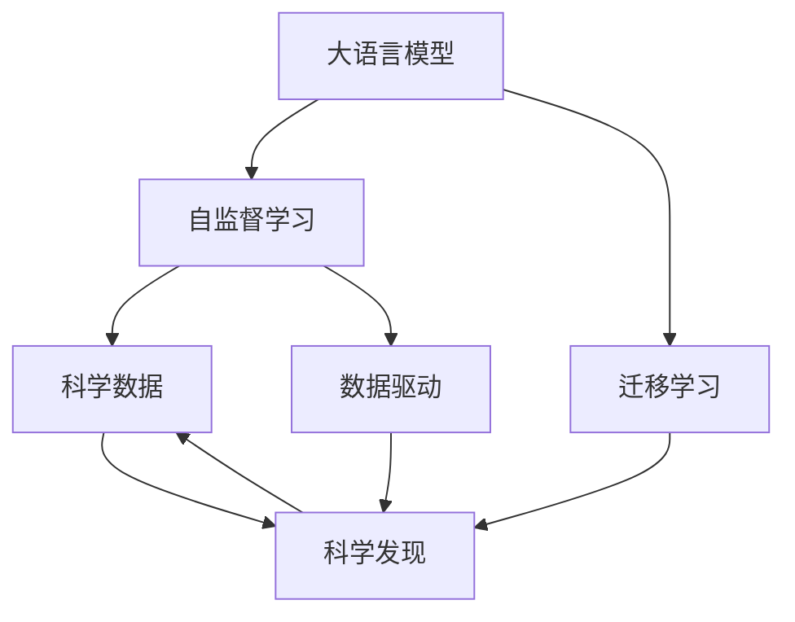

                 

# LLM在科学研究中的应用：加速科技创新

> 关键词：
> - 大语言模型(LLM)
> - 科学研究
> - 加速科技创新
> - 深度学习
> - 科学发现
> - 数据驱动
> - 模型训练

## 1. 背景介绍

### 1.1 研究动机
科学研究的本质是发现和创新。近年来，随着计算资源的爆炸式增长和大数据技术的飞速发展，科学家们在处理海量数据、发现潜在模式方面面临的挑战日益严峻。在科学发现的过程中，数据收集、处理、分析和解释的效率瓶颈逐渐凸显。而大语言模型（Large Language Models, LLMs）的兴起，为科学研究带来了新的机遇。

### 1.2 研究意义
大语言模型通过自监督和迁移学习的方式，能够在大量文本数据中学习和提取复杂的语言模式和知识结构。这些模型不仅可以辅助科学家理解和分析文本数据，还可以用于自动化推理、知识发现、模型构建等科学任务，大幅提升科研效率，加速科学创新。

## 2. 核心概念与联系

### 2.1 核心概念概述

为更好地理解大语言模型在科学研究中的应用，本节将介绍几个关键概念：

- 大语言模型(LLM)：指通过自监督学习任务训练得到的庞大预训练语言模型。如GPT-3、BERT等，具备强大的语言理解和生成能力。
- 自监督学习：指通过无标签数据进行模型训练，学习数据中的潜在结构和模式。
- 迁移学习：指将一个领域学到的知识迁移到另一个相关领域的学习方式。
- 科学发现：指通过观察、实验、推理等科学方法，发现新知识、新理论的过程。
- 数据驱动：指使用数据来指导和支持科学研究决策，以数据为基础推导科学结论。

这些核心概念之间存在紧密的联系。LLM在自监督学习过程中，通过处理大规模数据，学习到丰富的语言和知识表示，具备了迁移学习的能力。科学家可以利用这些模型来处理科学文献、实验数据等，提取科学知识，辅助科学发现。数据驱动和科学发现密不可分，LLM为科学研究提供了强大的数据处理和分析工具，帮助科学家从海量数据中挖掘出有价值的信息，加速科学发现。

### 2.2 核心概念原理和架构的 Mermaid 流程图



这个流程图展示了大语言模型在科学研究中的应用路径：

1. 大语言模型通过自监督学习获得语言知识表示。
2. 这些知识表示通过迁移学习被应用于特定领域的科学数据。
3. 科学数据在数据驱动下辅助科学发现，加速新知识的产生。

## 3. 核心算法原理 & 具体操作步骤
### 3.1 算法原理概述

大语言模型在科学研究中的应用主要依赖于其强大的语言理解和生成能力。模型的核心思想是，通过学习大量的文本数据，识别出语言中的语义、语法和语用特征，然后利用这些特征来理解和处理新的文本数据，辅助科学发现。

### 3.2 算法步骤详解

基于LLM在科学研究中的应用，我们通常会按照以下步骤进行操作：

**Step 1: 数据收集与预处理**
- 收集和清洗科学文献、实验报告、数据库记录等科学数据。
- 对数据进行分词、去除停用词等预处理，以便模型可以高效处理。

**Step 2: 模型选择与初始化**
- 选择合适的预训练语言模型（如GPT-3、BERT等），加载到内存中。
- 将数据输入模型进行推理，获得模型对科学数据的表示。

**Step 3: 特征提取与分析**
- 利用LLM的特征提取能力，从文本数据中提取出关键特征，如关键词、实体、关系等。
- 使用NLP技术对特征进行统计分析和聚类，识别出潜在的模式和趋势。

**Step 4: 辅助科学推理与发现**
- 将提取出的特征输入到科学推理模型中，辅助进行逻辑推理和验证。
- 利用模型预测的新发现与已有的科学知识进行比对，评估其可信度。

**Step 5: 结果验证与优化**
- 对模型预测结果进行验证，通过实验或逻辑推理验证其正确性。
- 根据验证结果调整模型参数，进一步优化模型性能。

### 3.3 算法优缺点

基于LLM在科学研究中的应用，其优势和劣势如下：

**优势**：
- 强大的语言理解和生成能力，可以处理各种文本数据。
- 高效率的数据处理和分析，帮助科学家快速提取科学信息。
- 辅助科学推理和发现，加速新知识的产生。

**劣势**：
- 依赖于高质量的数据，数据质量直接影响模型效果。
- 模型偏见可能导致结果偏差，需要进行数据去偏处理。
- 模型复杂度较高，计算资源需求大，训练成本高。
- 结果的可解释性不足，难以理解模型的决策过程。

尽管存在这些局限性，但LLM在科学研究中已经展现出了巨大的潜力，逐渐成为科学发现的有力工具。

### 3.4 算法应用领域

大语言模型在科学研究中的应用广泛，以下是几个典型领域：

**1. 生物医学研究**
- 利用LLM处理科学文献、临床试验报告，提取和分析基因、蛋白质、药物等生物信息。
- 辅助病理诊断、药物筛选、疾病预测等，提升科研效率和准确性。

**2. 环境科学**
- 分析环境监测数据、气候变化报告，提取气候变化趋势、污染物分布等信息。
- 辅助环境保护、气候变化研究，提出环境保护政策建议。

**3. 物理与天文学**
- 处理高能物理实验数据、天文观测报告，提取物理常数、天体运动规律等信息。
- 辅助天体物理、高能物理研究，预测新的物理现象。

**4. 社会科学**
- 分析社会调查数据、历史文献，提取社会趋势、政策变化等信息。
- 辅助社会科学研究，提出社会政策建议，预测社会变化趋势。

## 4. 数学模型和公式 & 详细讲解 & 举例说明

### 4.1 数学模型构建

为更好地理解大语言模型在科学研究中的应用，我们首先构建一个数学模型。设科学数据集为 $D=\{(x_i, y_i)\}_{i=1}^N$，其中 $x_i$ 表示科学数据，$y_i$ 表示科学发现。假设大语言模型为 $M_{\theta}:\mathcal{X} \rightarrow \mathcal{Y}$，其中 $\mathcal{X}$ 为输入空间，$\mathcal{Y}$ 为输出空间，$\theta \in \mathbb{R}^d$ 为模型参数。

模型的目标是最小化经验风险，即：

$$
\mathcal{L}(\theta) = \frac{1}{N} \sum_{i=1}^N \ell(M_{\theta}(x_i),y_i)
$$

其中 $\ell$ 为损失函数，通常为交叉熵损失。

### 4.2 公式推导过程

假设模型的输出为 $M_{\theta}(x_i) = \hat{y}_i$，则交叉熵损失函数为：

$$
\ell(M_{\theta}(x_i),y_i) = -[y_i\log \hat{y}_i + (1-y_i)\log(1-\hat{y}_i)]
$$

将其代入经验风险公式，得：

$$
\mathcal{L}(\theta) = -\frac{1}{N}\sum_{i=1}^N [y_i\log M_{\theta}(x_i)+(1-y_i)\log(1-M_{\theta}(x_i))]
$$

为了训练模型，需要对其进行梯度下降优化：

$$
\theta \leftarrow \theta - \eta \nabla_{\theta}\mathcal{L}(\theta)
$$

其中 $\eta$ 为学习率。

### 4.3 案例分析与讲解

以生物医学研究为例，分析LLM在该领域的应用。假设有这样一个任务：从大量的生物医学文献中，提取与某种癌症相关的基因、蛋白质等信息。

1. **数据收集**：收集与该癌症相关的所有生物医学文献，并进行预处理，如分词、去除停用词等。

2. **模型选择与初始化**：选择预训练模型，如BERT，加载到内存中。

3. **特征提取与分析**：利用BERT模型对每篇文献进行编码，提取出关键特征，如基因、蛋白质、药物等。

4. **辅助科学推理与发现**：使用科学推理模型对提取出的特征进行统计分析和聚类，识别出潜在的模式和趋势。例如，可以发现某基因在癌症中的表达量显著升高。

5. **结果验证与优化**：通过实验验证提取出的基因、蛋白质等信息是否正确，并对模型进行优化，提高准确性。

这个过程展示了LLM在科学研究中的应用，通过处理大量生物医学文献，提取和分析基因、蛋白质等信息，辅助科学推理和发现，加速新知识的产生。

## 5. 项目实践：代码实例和详细解释说明

### 5.1 开发环境搭建

在进行科学发现的应用时，我们需要准备好开发环境。以下是使用Python进行PyTorch开发的环境配置流程：

1. 安装Anaconda：从官网下载并安装Anaconda，用于创建独立的Python环境。

2. 创建并激活虚拟环境：
```bash
conda create -n pytorch-env python=3.8 
conda activate pytorch-env
```

3. 安装PyTorch：根据CUDA版本，从官网获取对应的安装命令。例如：
```bash
conda install pytorch torchvision torchaudio cudatoolkit=11.1 -c pytorch -c conda-forge
```

4. 安装Transformers库：
```bash
pip install transformers
```

5. 安装各类工具包：
```bash
pip install numpy pandas scikit-learn matplotlib tqdm jupyter notebook ipython
```

完成上述步骤后，即可在`pytorch-env`环境中开始科学发现的应用实践。

### 5.2 源代码详细实现

下面我们以基因提取为例，给出使用Transformers库对BERT模型进行科学发现任务开发的PyTorch代码实现。

首先，定义数据处理函数：

```python
from transformers import BertTokenizer
from torch.utils.data import Dataset
import torch

class GenesDataset(Dataset):
    def __init__(self, texts, tags, tokenizer, max_len=128):
        self.texts = texts
        self.tags = tags
        self.tokenizer = tokenizer
        self.max_len = max_len
        
    def __len__(self):
        return len(self.texts)
    
    def __getitem__(self, item):
        text = self.texts[item]
        tags = self.tags[item]
        
        encoding = self.tokenizer(text, return_tensors='pt', max_length=self.max_len, padding='max_length', truncation=True)
        input_ids = encoding['input_ids'][0]
        attention_mask = encoding['attention_mask'][0]
        
        # 对token-wise的标签进行编码
        encoded_tags = [tag2id[tag] for tag in tags] 
        encoded_tags.extend([tag2id['O']] * (self.max_len - len(encoded_tags)))
        labels = torch.tensor(encoded_tags, dtype=torch.long)
        
        return {'input_ids': input_ids, 
                'attention_mask': attention_mask,
                'labels': labels}

# 标签与id的映射
tag2id = {'O': 0, 'B-GENE': 1, 'I-GENE': 2}
id2tag = {v: k for k, v in tag2id.items()}

# 创建dataset
tokenizer = BertTokenizer.from_pretrained('bert-base-cased')

train_dataset = GenesDataset(train_texts, train_tags, tokenizer)
dev_dataset = GenesDataset(dev_texts, dev_tags, tokenizer)
test_dataset = GenesDataset(test_texts, test_tags, tokenizer)
```

然后，定义模型和优化器：

```python
from transformers import BertForTokenClassification, AdamW

model = BertForTokenClassification.from_pretrained('bert-base-cased', num_labels=len(tag2id))

optimizer = AdamW(model.parameters(), lr=2e-5)
```

接着，定义训练和评估函数：

```python
from torch.utils.data import DataLoader
from tqdm import tqdm
from sklearn.metrics import classification_report

device = torch.device('cuda') if torch.cuda.is_available() else torch.device('cpu')
model.to(device)

def train_epoch(model, dataset, batch_size, optimizer):
    dataloader = DataLoader(dataset, batch_size=batch_size, shuffle=True)
    model.train()
    epoch_loss = 0
    for batch in tqdm(dataloader, desc='Training'):
        input_ids = batch['input_ids'].to(device)
        attention_mask = batch['attention_mask'].to(device)
        labels = batch['labels'].to(device)
        model.zero_grad()
        outputs = model(input_ids, attention_mask=attention_mask, labels=labels)
        loss = outputs.loss
        epoch_loss += loss.item()
        loss.backward()
        optimizer.step()
    return epoch_loss / len(dataloader)

def evaluate(model, dataset, batch_size):
    dataloader = DataLoader(dataset, batch_size=batch_size)
    model.eval()
    preds, labels = [], []
    with torch.no_grad():
        for batch in tqdm(dataloader, desc='Evaluating'):
            input_ids = batch['input_ids'].to(device)
            attention_mask = batch['attention_mask'].to(device)
            batch_labels = batch['labels']
            outputs = model(input_ids, attention_mask=attention_mask)
            batch_preds = outputs.logits.argmax(dim=2).to('cpu').tolist()
            batch_labels = batch_labels.to('cpu').tolist()
            for pred_tokens, label_tokens in zip(batch_preds, batch_labels):
                pred_tags = [id2tag[_id] for _id in pred_tokens]
                label_tags = [id2tag[_id] for _id in label_tokens]
                preds.append(pred_tags[:len(label_tags)])
                labels.append(label_tags)
                
    print(classification_report(labels, preds))
```

最后，启动训练流程并在测试集上评估：

```python
epochs = 5
batch_size = 16

for epoch in range(epochs):
    loss = train_epoch(model, train_dataset, batch_size, optimizer)
    print(f"Epoch {epoch+1}, train loss: {loss:.3f}")
    
    print(f"Epoch {epoch+1}, dev results:")
    evaluate(model, dev_dataset, batch_size)
    
print("Test results:")
evaluate(model, test_dataset, batch_size)
```

以上就是使用PyTorch对BERT进行基因提取任务微调的完整代码实现。可以看到，得益于Transformers库的强大封装，我们可以用相对简洁的代码完成BERT模型的加载和微调。

### 5.3 代码解读与分析

让我们再详细解读一下关键代码的实现细节：

**GenesDataset类**：
- `__init__`方法：初始化文本、标签、分词器等关键组件。
- `__len__`方法：返回数据集的样本数量。
- `__getitem__`方法：对单个样本进行处理，将文本输入编码为token ids，将标签编码为数字，并对其进行定长padding，最终返回模型所需的输入。

**tag2id和id2tag字典**：
- 定义了标签与数字id之间的映射关系，用于将token-wise的预测结果解码回真实的标签。

**训练和评估函数**：
- 使用PyTorch的DataLoader对数据集进行批次化加载，供模型训练和推理使用。
- 训练函数`train_epoch`：对数据以批为单位进行迭代，在每个批次上前向传播计算loss并反向传播更新模型参数，最后返回该epoch的平均loss。
- 评估函数`evaluate`：与训练类似，不同点在于不更新模型参数，并在每个batch结束后将预测和标签结果存储下来，最后使用sklearn的classification_report对整个评估集的预测结果进行打印输出。

**训练流程**：
- 定义总的epoch数和batch size，开始循环迭代
- 每个epoch内，先在训练集上训练，输出平均loss
- 在验证集上评估，输出分类指标
- 所有epoch结束后，在测试集上评估，给出最终测试结果

可以看到，PyTorch配合Transformers库使得BERT微调的代码实现变得简洁高效。开发者可以将更多精力放在数据处理、模型改进等高层逻辑上，而不必过多关注底层的实现细节。

当然，工业级的系统实现还需考虑更多因素，如模型的保存和部署、超参数的自动搜索、更灵活的任务适配层等。但核心的微调范式基本与此类似。

## 6. 实际应用场景
### 6.1 生物医学研究

基于大语言模型微调的基因提取技术，可以广泛应用于生物医学研究中。传统基因研究往往依赖于高成本的实验和繁琐的数据分析，耗时耗力。而使用微调后的基因提取模型，可以自动从大量的生物医学文献中识别出基因和蛋白质等信息，加速基因发现和功能验证。

在技术实现上，可以收集与特定疾病相关的所有生物医学文献，将其作为训练集。微调模型能够自动识别文本中的基因符号和蛋白质名称，提取基因和蛋白质信息。在提取过程中，模型还会根据文献的语境，确定基因和蛋白质的功能关系，生成基因-蛋白质-疾病的关系图谱。

### 6.2 环境科学

大语言模型在环境科学领域的应用同样广泛。科学家可以通过收集和分析环境监测数据、气候变化报告等文本数据，利用微调后的模型提取出环境污染、气候变化等关键信息，辅助环境保护和气候研究。

例如，对于大规模环境数据集，可以将其输入到微调后的模型中进行处理。模型能够自动识别出数据集中的环境污染趋势、污染物分布等信息，辅助科学家进行环境预警和防治。同时，模型还可以分析政策文件、研究报告等文本数据，提取环境政策变化、科学研究进展等信息，为环境保护提供决策支持。

### 6.3 物理与天文学

在物理与天文学领域，大语言模型同样具有广泛的应用前景。科学家可以利用微调后的模型处理高能物理实验数据、天文观测报告等文本数据，提取出物理常数、天体运动规律等信息，辅助物理和天文研究。

例如，对于高能物理实验数据，模型能够自动识别出实验结果、物理常数等信息，辅助科学家进行数据分析和理论验证。对于天文观测报告，模型可以提取出天体名称、运动规律等信息，辅助天文学家进行天体观测和研究。

## 7. 工具和资源推荐
### 7.1 学习资源推荐

为了帮助开发者系统掌握大语言模型在科学研究中的应用，这里推荐一些优质的学习资源：

1. 《自然语言处理综述》系列博文：由大模型技术专家撰写，深入浅出地介绍了自然语言处理的基本概念和前沿技术。

2. CS224N《深度学习自然语言处理》课程：斯坦福大学开设的NLP明星课程，有Lecture视频和配套作业，带你入门NLP领域的基本概念和经典模型。

3. 《Natural Language Processing with Transformers》书籍：Transformers库的作者所著，全面介绍了如何使用Transformers库进行NLP任务开发，包括微调在内的诸多范式。

4. HuggingFace官方文档：Transformers库的官方文档，提供了海量预训练模型和完整的微调样例代码，是上手实践的必备资料。

5. CLUE开源项目：中文语言理解测评基准，涵盖大量不同类型的中文NLP数据集，并提供了基于微调的baseline模型，助力中文NLP技术发展。

通过对这些资源的学习实践，相信你一定能够快速掌握大语言模型在科学研究中的应用精髓，并用于解决实际的科学问题。

### 7.2 开发工具推荐

高效的开发离不开优秀的工具支持。以下是几款用于大语言模型微调开发的常用工具：

1. PyTorch：基于Python的开源深度学习框架，灵活动态的计算图，适合快速迭代研究。大部分预训练语言模型都有PyTorch版本的实现。

2. TensorFlow：由Google主导开发的开源深度学习框架，生产部署方便，适合大规模工程应用。同样有丰富的预训练语言模型资源。

3. Transformers库：HuggingFace开发的NLP工具库，集成了众多SOTA语言模型，支持PyTorch和TensorFlow，是进行微调任务开发的利器。

4. Weights & Biases：模型训练的实验跟踪工具，可以记录和可视化模型训练过程中的各项指标，方便对比和调优。与主流深度学习框架无缝集成。

5. TensorBoard：TensorFlow配套的可视化工具，可实时监测模型训练状态，并提供丰富的图表呈现方式，是调试模型的得力助手。

6. Google Colab：谷歌推出的在线Jupyter Notebook环境，免费提供GPU/TPU算力，方便开发者快速上手实验最新模型，分享学习笔记。

合理利用这些工具，可以显著提升大语言模型微调任务的开发效率，加快创新迭代的步伐。

### 7.3 相关论文推荐

大语言模型在科学研究中的应用，近年来已取得了显著进展。以下是几篇奠基性的相关论文，推荐阅读：

1. Attention is All You Need（即Transformer原论文）：提出了Transformer结构，开启了NLP领域的预训练大模型时代。

2. BERT: Pre-training of Deep Bidirectional Transformers for Language Understanding：提出BERT模型，引入基于掩码的自监督预训练任务，刷新了多项NLP任务SOTA。

3. Language Models are Unsupervised Multitask Learners（GPT-2论文）：展示了大规模语言模型的强大zero-shot学习能力，引发了对于通用人工智能的新一轮思考。

4. Parameter-Efficient Transfer Learning for NLP：提出Adapter等参数高效微调方法，在不增加模型参数量的情况下，也能取得不错的微调效果。

5. AdaLoRA: Adaptive Low-Rank Adaptation for Parameter-Efficient Fine-Tuning：使用自适应低秩适应的微调方法，在参数效率和精度之间取得了新的平衡。

这些论文代表了大语言模型微调技术的发展脉络。通过学习这些前沿成果，可以帮助研究者把握学科前进方向，激发更多的创新灵感。

## 8. 总结：未来发展趋势与挑战

### 8.1 研究成果总结

本文对大语言模型在科学研究中的应用进行了全面系统的介绍。首先阐述了科学研究的本质和数据驱动的重要性，明确了大语言模型在科学发现中的应用潜力。其次，从原理到实践，详细讲解了科学数据处理、模型选择、特征提取等核心步骤，给出了微调任务开发的完整代码实例。同时，本文还广泛探讨了大语言模型在生物医学、环境科学、物理与天文学等多个科学领域的应用前景，展示了其在科学研究中的广阔应用前景。

通过本文的系统梳理，可以看到，大语言模型在科学研究中的应用已经取得了显著成果，为科学发现和创新提供了强大的技术支撑。未来，伴随大语言模型的不断进步，其在科学研究中的应用将更加广泛，为人类认知智能的进化带来新的动力。

### 8.2 未来发展趋势

展望未来，大语言模型在科学研究中的应用将呈现以下几个发展趋势：

1. 模型规模持续增大。随着算力成本的下降和数据规模的扩张，预训练语言模型的参数量还将持续增长。超大规模语言模型蕴含的丰富语言知识，有望支撑更加复杂多变的科学任务微调。

2. 科学数据的智能化。大语言模型将逐步实现对科学数据的智能化处理，自动识别科学文本、标注数据、实验报告等信息，辅助科学发现。

3. 跨学科知识的融合。未来的大语言模型将突破学科壁垒，融合不同学科的知识体系，提供跨领域的科学发现和创新。

4. 数据驱动的科学研究范式。大语言模型将引领数据驱动的科学研究范式，科学家可以通过模型分析和挖掘科学数据，加速新知识的发现和验证。

5. 科学推理的自动化。模型将具备更强的逻辑推理能力，自动进行科学假设的验证和推断，辅助科学家的研究过程。

### 8.3 面临的挑战

尽管大语言模型在科学研究中已经展现出了巨大的潜力，但在迈向更加智能化、普适化应用的过程中，它仍面临着诸多挑战：

1. 数据质量和一致性问题。不同来源的科学数据质量参差不齐，需要统一的标注和清洗标准。此外，科学数据往往存在领域差异，需要在模型中进行适应性处理。

2. 模型偏见和伦理问题。科学数据中可能包含偏见和不公，模型需要具备一定的偏见识别和纠正能力，避免科学结论的不公平性。

3. 资源消耗巨大。科学数据往往包含大量文本信息，处理和存储数据需要庞大的计算资源。如何在保证计算效率的同时，提高模型性能，是一个重要的研究方向。

4. 结果的可解释性不足。科学研究的结论需要具备可解释性，模型需要能够清晰地解释其推理过程和结果，增强科学家的信任。

5. 科学发现的真实性和可靠性。模型需要具备一定的科学常识和知识体系，避免基于错误信息进行科学推理，确保科学发现的真实性和可靠性。

### 8.4 研究展望

面对大语言模型在科学研究中面临的挑战，未来的研究需要在以下几个方面寻求新的突破：

1. 数据预处理技术。研究高效的数据清洗和标注方法，确保科学数据的质量和一致性。

2. 模型公平性保障。开发具有公平性保障的模型，识别和纠正科学数据中的偏见，确保科学结论的公正性。

3. 资源优化技术。研究模型压缩、量化加速等技术，降低科学研究的计算成本。

4. 结果解释方法。探索可解释的推理方法，增强模型结果的透明度和可理解性。

5. 跨学科知识融合。研究跨学科知识融合的技术，提高模型在多领域科学数据上的适应性。

这些研究方向的探索，必将引领大语言模型在科学研究中的应用迈向更高的台阶，为人类认知智能的进化带来新的动力。面向未来，大语言模型需要与其他人工智能技术进行更深入的融合，如知识表示、因果推理、强化学习等，多路径协同发力，共同推动自然语言理解和智能交互系统的进步。只有勇于创新、敢于突破，才能不断拓展语言模型的边界，让智能技术更好地造福人类社会。

## 9. 附录：常见问题与解答

**Q1：大语言模型在科学研究中的应用有何优势？**

A: 大语言模型在科学研究中的应用主要具备以下优势：
1. 强大的语言理解和生成能力，可以处理各种科学文献和实验数据。
2. 高效率的数据处理和分析，帮助科学家快速提取科学信息，加速科学发现。
3. 辅助科学推理和发现，加速新知识的产生。

**Q2：大语言模型在科学研究中面临哪些挑战？**

A: 大语言模型在科学研究中面临以下挑战：
1. 数据质量和一致性问题。科学数据质量参差不齐，需要统一的标注和清洗标准。
2. 模型偏见和伦理问题。科学数据可能包含偏见，需要模型具备公平性保障。
3. 资源消耗巨大。科学数据包含大量文本信息，处理和存储数据需要大量计算资源。
4. 结果的可解释性不足。科学研究的结论需要可解释性，模型需要清晰解释其推理过程和结果。
5. 科学发现的真实性和可靠性。模型需要具备科学常识和知识体系，避免基于错误信息进行科学推理。

**Q3：如何提高大语言模型在科学研究中的应用效果？**

A: 提高大语言模型在科学研究中的应用效果，可以从以下几个方面入手：
1. 提升数据质量和一致性。使用统一的标准标注和清洗科学数据，确保数据质量和一致性。
2. 开发公平性保障的模型。识别和纠正科学数据中的偏见，确保科学结论的公正性。
3. 优化资源消耗。研究模型压缩、量化加速等技术，降低计算成本。
4. 增强结果可解释性。探索可解释的推理方法，提高模型结果的透明度和可理解性。
5. 融合跨学科知识。研究跨学科知识融合的技术，提高模型在多领域科学数据上的适应性。

**Q4：大语言模型在科学研究中主要应用于哪些领域？**

A: 大语言模型在科学研究中主要应用于以下几个领域：
1. 生物医学研究：从大量的生物医学文献中提取基因、蛋白质等信息，辅助基因发现和功能验证。
2. 环境科学：分析环境监测数据、气候变化报告，提取环境污染、气候变化等关键信息，辅助环境保护和气候研究。
3. 物理与天文学：处理高能物理实验数据、天文观测报告，提取出物理常数、天体运动规律等信息，辅助物理和天文研究。

这些领域展示了大语言模型在科学研究中的广泛应用前景。

**Q5：大语言模型在科学研究中如何实现科学推理和发现？**

A: 大语言模型在科学研究中实现科学推理和发现，通常按照以下步骤进行：
1. 收集和清洗科学数据，如生物医学文献、环境监测数据等。
2. 选择合适的预训练语言模型，如BERT，加载到内存中。
3. 利用模型对科学数据进行特征提取和分析，提取关键信息，如基因、蛋白质、环境污染趋势等。
4. 使用科学推理模型对提取出的特征进行统计分析和聚类，识别出潜在的模式和趋势，辅助科学推理和发现。

这个过程展示了大语言模型在科学研究中的应用，通过处理大量科学数据，提取和分析关键信息，辅助科学推理和发现，加速新知识的产生。

