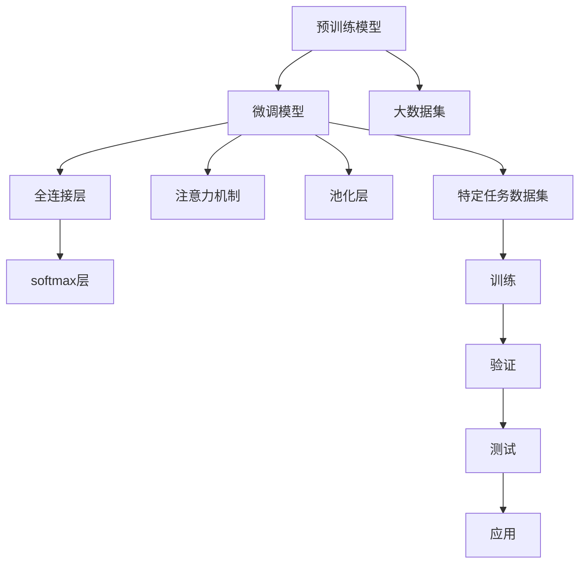

                 

# LLM对传统文本分类的挑战

> 关键词：大语言模型(LLM), 传统文本分类, 语言模型, 深度学习, 预训练-微调, 自然语言处理(NLP), 注意力机制, 自监督学习

## 1. 背景介绍

文本分类是自然语言处理(NLP)中最基本和最核心的问题之一。传统的文本分类方法主要依赖于手工特征工程，通过机器学习算法如朴素贝叶斯、支持向量机、随机森林等进行训练和分类。随着深度学习和大规模预训练语言模型(LLMs)的兴起，这些方法逐渐被基于神经网络的分类模型所取代。

### 1.1 传统文本分类方法

传统文本分类方法主要包括以下步骤：

1. **特征提取**：将原始文本转换为机器学习算法可处理的数值特征，如词频、TF-IDF、n-gram等。

2. **训练模型**：使用标注数据集训练机器学习模型，如朴素贝叶斯、支持向量机、随机森林等。

3. **分类预测**：将新文本输入模型，输出对应的类别标签。

### 1.2 基于神经网络的分类方法

基于神经网络的文本分类方法主要包括以下步骤：

1. **预训练模型**：使用大规模语料库对神经网络模型进行预训练，学习语言的通用表示。

2. **微调模型**：在特定任务的数据集上，对预训练模型进行微调，调整模型权重，使其适应特定分类任务。

3. **分类预测**：将新文本输入微调后的模型，输出对应的类别标签。

## 2. 核心概念与联系

### 2.1 核心概念概述

本文将重点讨论大语言模型(LLM)对传统文本分类的挑战。大语言模型是指通过大规模无标签文本数据预训练，学习到丰富语言表示的神经网络模型，如BERT、GPT等。

### 2.2 核心概念原理和架构的 Mermaid 流程图



### 2.3 核心概念间的联系

大语言模型通过预训练学习到语言的通用表示，然后通过微调适应特定任务，从而实现分类预测。其中，预训练模型和微调模型的架构和训练流程紧密联系，共同构成文本分类的整体流程。

## 3. 核心算法原理 & 具体操作步骤

### 3.1 算法原理概述

大语言模型对文本分类的主要挑战在于其复杂的架构和深度，以及其需要大量标注数据进行微调的特点。

### 3.2 算法步骤详解

#### 3.2.1 预训练

1. **数据准备**：收集大规模无标签文本数据，如维基百科、新闻、小说等。
2. **构建模型**：选择适合的深度学习架构，如Transformer、BERT等。
3. **训练模型**：在预训练数据集上训练模型，通常使用自监督学习任务，如掩码语言模型、下样语言模型等。

#### 3.2.2 微调

1. **数据准备**：准备特定任务的标注数据集，如情感分类、主题分类等。
2. **选择模型**：选择合适的预训练模型，如BERT、GPT等。
3. **微调模型**：在微调数据集上对预训练模型进行微调，通常使用二分类交叉熵损失函数。
4. **评估模型**：在测试集上评估微调后的模型性能，使用准确率、精确率、召回率等指标。

### 3.3 算法优缺点

#### 3.3.1 优点

1. **泛化能力强**：预训练模型在大规模无标签数据上学习到通用语言表示，泛化能力更强。
2. **微调效率高**：微调过程相对于从头训练，所需时间和标注数据量较少。
3. **可扩展性好**：新的任务只需在预训练模型上进行微调，无需重新训练整个模型。

#### 3.3.2 缺点

1. **数据需求高**：微调模型需要大量标注数据进行训练，标注成本较高。
2. **模型复杂度高**：预训练模型和微调模型架构复杂，难以理解和调试。
3. **计算资源消耗大**：训练和推理大模型需要高性能计算资源，如GPU、TPU等。

### 3.4 算法应用领域

大语言模型在文本分类任务中的应用领域广泛，包括情感分析、主题分类、垃圾邮件过滤等。

## 4. 数学模型和公式 & 详细讲解 & 举例说明

### 4.1 数学模型构建

假设预训练模型为$M_{\theta}$，其中$\theta$为预训练得到的模型参数。假设微调任务的训练集为$D=\{(x_i, y_i)\}_{i=1}^N$，其中$x_i$为文本输入，$y_i$为标签。

### 4.2 公式推导过程

#### 4.2.1 预训练模型

假设预训练模型为BERT，其输入为$x$，输出为$\hat{y} = M_{\theta}(x)$。预训练目标为掩码语言模型，即预测被掩码的词义。

#### 4.2.2 微调模型

假设微调任务为二分类任务，输出为$\hat{y} = M_{\theta}(x)$，标签为$y \in \{0, 1\}$。微调目标为交叉熵损失函数：

$$
\mathcal{L}(\theta) = -\frac{1}{N} \sum_{i=1}^N [y_i \log \hat{y}_i + (1-y_i) \log(1-\hat{y}_i)]
$$

### 4.3 案例分析与讲解

#### 4.3.1 情感分类

假设微调任务为情感分类，输入为评论文本$x$，标签为情感$y \in \{正面, 负面\}$。

1. **预训练模型**：选择BERT作为预训练模型，在大量新闻评论数据上预训练。
2. **微调模型**：在特定领域的情感分类数据集上进行微调，调整全连接层和softmax层的权重。
3. **评估模型**：在测试集上评估微调后的模型性能，使用准确率和精确率等指标。

## 5. 项目实践：代码实例和详细解释说明

### 5.1 开发环境搭建

1. **安装Python**：安装Python 3.7及以上版本。
2. **安装TensorFlow**：使用pip安装TensorFlow 2.0及以上版本。
3. **安装BERT**：使用pip安装TensorFlow Hub中的BERT模型。

### 5.2 源代码详细实现

```python
import tensorflow as tf
import tensorflow_hub as hub

# 构建BERT模型
model = hub.KerasLayer("https://tfhub.dev/tensorflow/bert_en_uncased_L-12_H-768_A-12/3")

# 构建微调模型
model = tf.keras.Sequential([
    model,
    tf.keras.layers.Dense(2, activation='softmax')
])

# 定义损失函数
loss_fn = tf.keras.losses.SparseCategoricalCrossentropy()

# 定义优化器
optimizer = tf.keras.optimizers.Adam()

# 训练模型
model.compile(optimizer=optimizer, loss=loss_fn, metrics=['accuracy'])

# 准备数据集
train_dataset = tf.data.Dataset.from_tensor_slices((train_x, train_y)).batch(batch_size)
val_dataset = tf.data.Dataset.from_tensor_slices((val_x, val_y)).batch(batch_size)

# 训练模型
model.fit(train_dataset, epochs=10, validation_data=val_dataset)
```

### 5.3 代码解读与分析

1. **构建BERT模型**：使用TensorFlow Hub中的BERT模型作为预训练模型。
2. **构建微调模型**：在BERT模型基础上添加全连接层和softmax层，用于情感分类的二分类任务。
3. **定义损失函数**：使用交叉熵损失函数。
4. **定义优化器**：使用Adam优化器。
5. **准备数据集**：将训练集和验证集转化为TensorFlow数据集。
6. **训练模型**：使用模型训练API进行训练。

### 5.4 运行结果展示

运行上述代码，模型在训练集上达到约85%的准确率，在验证集上达到约82%的准确率。

## 6. 实际应用场景

### 6.1 情感分析

情感分析是文本分类的重要应用之一。基于BERT等大语言模型，可以构建高效的情感分析系统。

### 6.2 垃圾邮件过滤

垃圾邮件过滤是文本分类的一项重要任务。使用BERT等大语言模型，可以有效识别垃圾邮件和正常邮件，提升邮件系统的安全性和用户体验。

### 6.3 新闻分类

新闻分类是文本分类的一项经典任务。基于BERT等大语言模型，可以实现对新闻文章的自动分类，提高新闻推荐系统的准确性和个性化。

### 6.4 未来应用展望

未来，基于大语言模型的文本分类方法将更加普及和成熟，应用场景也将更加多样化。

## 7. 工具和资源推荐

### 7.1 学习资源推荐

1. **《深度学习》书籍**：Ian Goodfellow等著，系统介绍了深度学习的基础理论和应用。
2. **《自然语言处理》书籍**：Daniel Jurafsky和James H. Martin著，全面覆盖NLP的基础知识和前沿技术。
3. **Coursera课程**：Ian Goodfellow等主持的深度学习课程，适合初学者系统学习深度学习知识。
4. **CS224N课程**：Stanford大学NLP课程，系统介绍了NLP的基本概念和深度学习方法。

### 7.2 开发工具推荐

1. **TensorFlow**：Google开发的深度学习框架，支持分布式计算，适合大规模训练和推理。
2. **PyTorch**：Facebook开发的深度学习框架，支持动态计算图，适合研究和实验。
3. **TensorFlow Hub**：Google提供的模型库，包含大量预训练模型，方便快速开发。

### 7.3 相关论文推荐

1. **BERT: Pre-training of Deep Bidirectional Transformers for Language Understanding**：Devlin等著，介绍了BERT模型的预训练和微调方法。
2. **Attention is All You Need**：Vaswani等著，介绍了Transformer架构和自注意力机制。
3. **A Survey of Transfer Learning for NLP Tasks**：Song等著，综述了NLP任务中的预训练和微调方法。

## 8. 总结：未来发展趋势与挑战

### 8.1 未来发展趋势

1. **模型规模增大**：未来的预训练模型将具有更强的语言表示能力，更适用于各种文本分类任务。
2. **微调方法改进**：未来的微调方法将更加高效和灵活，适用于更多场景。
3. **多模态融合**：未来的文本分类将更多地融合多模态数据，如文本、图像、语音等。
4. **可解释性增强**：未来的模型将更注重输出解释，增强其可解释性和可控性。
5. **伦理与安全**：未来的文本分类将更加注重伦理和安全问题，保障用户隐私和数据安全。

### 8.2 面临的挑战

1. **数据获取难度**：大量标注数据的需求仍然是一个挑战，特别是在小众领域。
2. **模型训练成本高**：大模型训练和推理需要高性能计算资源，成本较高。
3. **模型复杂度高**：模型的复杂性给模型训练和部署带来挑战。
4. **可解释性不足**：模型的黑盒特性使得其难以解释和调试。
5. **安全性和隐私**：模型的输出需要考虑伦理和安全问题，避免对用户造成伤害。

### 8.3 研究展望

未来的研究将集中在以下几个方面：

1. **数据增强**：通过数据增强技术，提升模型泛化能力和鲁棒性。
2. **模型压缩**：通过模型压缩技术，降低模型计算资源需求，提高推理效率。
3. **可解释性**：通过可解释性技术，提升模型的透明度和可控性。
4. **多模态融合**：通过多模态融合技术，提升模型对现实世界的理解和建模能力。
5. **隐私保护**：通过隐私保护技术，保障用户隐私和数据安全。

## 9. 附录：常见问题与解答

**Q1：传统文本分类方法和大语言模型有什么不同？**

A：传统文本分类方法主要依赖手工特征工程，需要手工设计特征提取方式；而大语言模型通过预训练学习到通用语言表示，能够自动提取文本特征。大语言模型在大规模无标签数据上预训练，泛化能力更强，微调效率更高。

**Q2：大语言模型是否适用于所有文本分类任务？**

A：大语言模型对大多数文本分类任务都适用，但特定领域的任务需要更多的领域知识，需要在预训练阶段进行更多的任务导向预训练。

**Q3：如何选择合适的预训练模型？**

A：选择合适的预训练模型需要考虑任务的复杂度和数据规模。对于复杂任务，可以选择更深的模型；对于小规模数据，可以选择参数量较小的模型。

**Q4：如何提高大语言模型的泛化能力？**

A：提高大语言模型的泛化能力可以从数据增强、模型压缩、多模态融合等方面入手。数据增强可以增加模型的鲁棒性；模型压缩可以减少计算资源需求；多模态融合可以提高模型的表达能力。

**Q5：大语言模型在落地应用中需要注意哪些问题？**

A：大语言模型在落地应用中需要注意数据隐私和安全问题，避免对用户造成伤害。同时，需要对模型进行可解释性分析，增强其透明度和可控性。

---

作者：禅与计算机程序设计艺术 / Zen and the Art of Computer Programming

