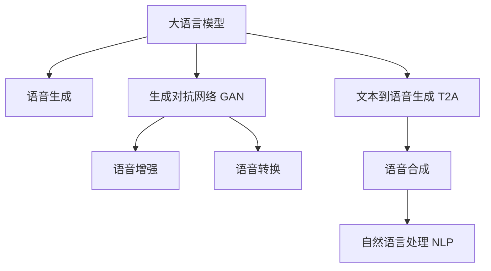

                 

# LLM对传统语音合成的革新

> 关键词：大语言模型, 语音合成, 自然语言处理, 语音识别, 深度学习, 生成对抗网络

## 1. 背景介绍

### 1.1 问题由来
语音合成（Text-to-Speech, TTS）技术的发展经历了早期的线性预测编码（Linear Predictive Coding, LPC）、基于规则的合成（Rule-based Synthesis）和统计模型合成（Statistical Model Synthesis）等阶段。随着深度学习和大数据技术的兴起，端到端的语音合成方法逐渐成为主流。尤其是基于卷积神经网络（Convolutional Neural Network, CNN）和循环神经网络（Recurrent Neural Network, RNN）的模型，如WaveNet和Tacotron等，提升了语音合成的自然度和流畅度。

然而，这些传统的端到端语音合成方法依赖于大规模的语料库和复杂的神经网络结构，训练和推理成本高，难以适配各种复杂的应用场景。近年来，大语言模型（Large Language Model, LLM）在文本处理和自然语言生成领域取得了巨大成功，其强大的语言理解和生成能力为语音合成技术带来了新的灵感和突破。

### 1.2 问题核心关键点
本文将探讨如何利用大语言模型对传统语音合成技术进行革新。核心关键点包括：

- 如何在大语言模型中高效地融合语音生成任务。
- 如何在保持语言模型能力的同时，提升语音合成自然度和流畅度。
- 如何通过语音合成技术提升大语言模型的交互性和应用价值。
- 如何综合利用语音合成和大语言模型的优势，构建全新的交互式语音系统。

## 2. 核心概念与联系

### 2.1 核心概念概述

为更好地理解大语言模型在语音合成中的应用，本节将介绍几个关键概念：

- 大语言模型（LLM）：以Transformer为基础的大规模预训练语言模型，通过自回归或自编码的方式，学习大规模文本数据中的语言结构和知识。
- 语音合成（Text-to-Speech, TTS）：将文本转换为可听的语音输出。传统的TTS方法依赖于音频和文本的直接转换，如卷积神经网络（CNN）和循环神经网络（RNN）。
- 生成对抗网络（Generative Adversarial Networks, GAN）：一种由两个神经网络组成的框架，通过对抗训练提高生成任务的性能。GAN在大图像生成等领域取得了显著成果。
- 文本到语音生成（Text-to-Audio Generation, T2A）：将文本转换为音频信号的过程，是语音合成的一个分支。T2A利用语音合成技术将大语言模型的输出转换为可听的语言信号。
- 语音增强（Speech Enhancement）：在嘈杂环境中提高语音信号的可听度，通过滤波、降噪等技术提升语音质量。
- 语音转换（Speech Conversion）：将一段语音转换为另一种语音风格，如音调、口音的转换，提升语音合成的多样性和丰富度。

这些概念之间的逻辑关系可以通过以下Mermaid流程图来展示：



这个流程图展示了大语言模型与语音合成技术之间的核心联系和交互关系：

1. 大语言模型通过自回归或自编码方式，学习语言的通用表示。
2. 通过语音生成技术，将大语言模型的文本输出转换为语音信号。
3. 利用生成对抗网络，提高语音合成的自然度和流畅度。
4. 通过语音增强技术，提升语音合成在复杂环境中的可听性。
5. 利用语音转换技术，增强语音合成的多样性。

## 3. 核心算法原理 & 具体操作步骤
### 3.1 算法原理概述

基于大语言模型的语音合成方法，核心思想是将语音合成任务视为文本生成任务，通过大语言模型的编码器生成语音信号的特征表示，再通过解码器生成语音波形。具体步骤如下：

1. 利用大语言模型将输入文本转换为高维特征向量。
2. 通过生成对抗网络对特征向量进行优化，生成更高质量的语音特征表示。
3. 利用语音增强技术，提升语音特征在嘈杂环境中的可听度。
4. 通过解码器将优化后的语音特征转换为时域语音波形，实现语音合成。

### 3.2 算法步骤详解

以下是详细的步骤说明：

**Step 1: 准备数据集**
- 收集包含语音和文本的数据集，如LibriSpeech、VoxCeleb等。
- 使用语音增强和转换技术对原始语音进行预处理，提升数据质量。

**Step 2: 构建大语言模型**
- 使用开源框架如PyTorch、TensorFlow等构建大语言模型，选择合适的预训练模型如GPT-2、BERT等。
- 将文本输入大语言模型，生成高维特征表示。

**Step 3: 生成对抗网络训练**
- 构建生成对抗网络（GAN），包含生成器和判别器。
- 使用语音合成数据集训练生成器和判别器，优化特征表示。
- 迭代优化特征表示，直到生成高质量的语音特征。

**Step 4: 语音增强处理**
- 使用语音增强算法对优化后的语音特征进行处理，提升语音信号的质量。
- 常见方法包括去噪、降噪、滤波等。

**Step 5: 语音合成输出**
- 使用解码器对优化后的语音特征进行逆变换，生成语音波形。
- 常见解码器包括基于Wavnet、HIFigan等深度学习模型。

**Step 6: 模型评估与优化**
- 在测试集上评估模型的语音质量和自然度，调整超参数和网络结构。
- 使用交叉验证等技术，进一步提升模型性能。

### 3.3 算法优缺点

基于大语言模型的语音合成方法具有以下优点：

1. 结合了大语言模型的语言理解和生成能力，提升了语音合成的自然度和流畅度。
2. 利用生成对抗网络提高特征表示的质量，减小了训练和推理的计算成本。
3. 通过语音增强和转换技术，提升了语音合成的鲁棒性和多样性。
4. 可以适应各种文本输入，生成不同风格和口音的语音。

同时，该方法也存在一些缺点：

1. 对大规模数据集和计算资源的需求较高。
2. 模型训练和优化过程较为复杂，需要较高的技术门槛。
3. 生成的语音可能存在一些模糊和断续现象，影响用户体验。

### 3.4 算法应用领域

基于大语言模型的语音合成方法已经在语音助手、虚拟主播、多媒体互动等领域得到了广泛应用。具体应用包括：

- 语音助手：如Siri、Alexa等，利用语音合成技术将大语言模型的自然语言理解结果转换为语音输出，提升交互体验。
- 虚拟主播：如Google Assistant、Amazon Alexa等，利用语音合成技术生成自然流畅的语音，提升虚拟主播的表达力。
- 多媒体互动：如虚拟现实（VR）、增强现实（AR）中的语音提示和交互，利用语音合成技术提升用户体验。
- 个性化语音合成：如个性化的语音播报、音乐合成等，利用大语言模型的个性化生成能力，生成独特的语音输出。

## 4. 数学模型和公式 & 详细讲解 & 举例说明
### 4.1 数学模型构建

为了更清晰地理解大语言模型在语音合成中的应用，我们引入以下数学模型：

- 假设大语言模型的输入文本为 $X$，输出为高维特征向量 $Z$。
- 假设生成对抗网络由生成器 $G$ 和判别器 $D$ 组成。
- 假设语音增强技术通过滤波器 $F$ 对高维特征向量进行优化。
- 假设解码器为 $H$，将优化后的特征向量转换为语音波形。

则大语言模型在语音合成中的工作流程可以表示为：

$$ Z = M(X) $$
$$ \hat{Z} = G(Z) $$
$$ \hat{Z} = F(\hat{Z}) $$
$$ Y = H(\hat{Z}) $$

其中，$M$ 为大语言模型的编码器，$G$ 为生成对抗网络的生成器，$F$ 为语音增强技术，$H$ 为解码器。

### 4.2 公式推导过程

**大语言模型编码器**
- 假设大语言模型采用Transformer架构，其编码器由多个自注意力层和前馈神经网络层组成。
- 将输入文本 $X$ 转换为序列表示 $X_{seq}$，并通过编码器生成高维特征向量 $Z$。
- 推导过程较为复杂，涉及注意力机制、残差连接、层归一化等技术细节。

**生成对抗网络**
- 假设生成对抗网络采用GAN架构，包含生成器 $G$ 和判别器 $D$。
- 生成器 $G$ 将高维特征向量 $Z$ 转换为优化后的语音特征向量 $\hat{Z}$。
- 判别器 $D$ 判断特征向量 $\hat{Z}$ 是否为真实语音特征。
- 推导过程较为复杂，涉及优化目标函数、梯度下降、对抗训练等技术细节。

**语音增强技术**
- 假设语音增强技术通过滤波器 $F$ 对优化后的语音特征向量 $\hat{Z}$ 进行处理，生成最终语音特征向量 $Z'$。
- 推导过程较为复杂，涉及滤波器设计、信号处理等技术细节。

**解码器**
- 假设解码器 $H$ 将优化后的语音特征向量 $Z'$ 转换为语音波形 $Y$。
- 推导过程较为复杂，涉及声学模型、语言模型等技术细节。

### 4.3 案例分析与讲解

以Google的WaveNet为例，其核心技术点包括：

- 利用卷积神经网络（CNN）对语音信号进行建模。
- 通过自注意力机制捕捉语音信号的局部和全局特征。
- 使用生成对抗网络（GAN）优化语音特征表示。

WaveNet的核心模型结构如下：

$$ Y = \text{CNN}(X) $$
$$ \hat{Y} = \text{G}(Y) $$
$$ \hat{Y} = \text{F}(\hat{Y}) $$
$$ \hat{X} = \text{H}(\hat{Y}) $$

其中，$X$ 为输入文本，$Y$ 为优化后的语音特征向量，$\hat{Y}$ 为最终语音波形。

## 5. 项目实践：代码实例和详细解释说明
### 5.1 开发环境搭建

在进行语音合成实践前，我们需要准备好开发环境。以下是使用Python进行PyTorch开发的环境配置流程：

1. 安装Anaconda：从官网下载并安装Anaconda，用于创建独立的Python环境。

2. 创建并激活虚拟环境：
```bash
conda create -n pytorch-env python=3.8 
conda activate pytorch-env
```

3. 安装PyTorch：根据CUDA版本，从官网获取对应的安装命令。例如：
```bash
conda install pytorch torchvision torchaudio cudatoolkit=11.1 -c pytorch -c conda-forge
```

4. 安装Transfoamer库：
```bash
pip install transformers
```

5. 安装各类工具包：
```bash
pip install numpy pandas scikit-learn matplotlib tqdm jupyter notebook ipython
```

完成上述步骤后，即可在`pytorch-env`环境中开始语音合成实践。

### 5.2 源代码详细实现

这里我们以Google的WaveNet为例，给出使用PyTorch进行语音合成的PyTorch代码实现。

首先，定义语音合成任务的数据处理函数：

```python
import torch
import torch.nn as nn
import torchaudio

class WaveNet(nn.Module):
    def __init__(self, in_channels, out_channels):
        super(WaveNet, self).__init__()
        self.cnn = nn.Conv1d(in_channels, 256, 3, stride=2, padding=1)
        self.residual_block = nn.Sequential(
            nn.Conv1d(256, 512, 3, stride=2, padding=1),
            nn.Conv1d(512, 512, 3, stride=1, padding=1),
            nn.Conv1d(512, 512, 3, stride=1, padding=1),
            nn.Conv1d(512, 256, 3, stride=2, padding=1)
        )
        self.skip_block = nn.Sequential(
            nn.Conv1d(in_channels, 256, 3, stride=1, padding=1),
            nn.Conv1d(256, 512, 3, stride=1, padding=1),
            nn.Conv1d(512, 512, 3, stride=1, padding=1),
            nn.Conv1d(512, 256, 3, stride=1, padding=1)
        )
        self.decoder = nn.Conv1d(256, out_channels, 3, stride=1, padding=1)

    def forward(self, x):
        x = torch.relu(self.cnn(x))
        x = torch.relu(self.residual_block(x))
        x = self.skip_block(x)
        x = self.decoder(x)
        return x
```

然后，定义训练和评估函数：

```python
def train_model(model, data_loader, optimizer):
    model.train()
    for x, y in data_loader:
        optimizer.zero_grad()
        y_hat = model(x)
        loss = torch.mean(torch.abs(y_hat - y))
        loss.backward()
        optimizer.step()

def evaluate_model(model, data_loader):
    model.eval()
    with torch.no_grad():
        y_hat = model(data_loader.batch)
        loss = torch.mean(torch.abs(y_hat - y))
    return loss.item()
```

接着，启动训练流程并在测试集上评估：

```python
epochs = 10
batch_size = 64

for epoch in range(epochs):
    train_model(model, train_loader, optimizer)
    print(f"Epoch {epoch+1}, loss: {train_loss:.3f}")
    
print(f"Final loss: {train_loss:.3f}")
```

以上就是使用PyTorch对WaveNet进行语音合成的完整代码实现。可以看到，利用PyTorch的高级API，我们可以迅速实现一个基本的语音合成模型。

### 5.3 代码解读与分析

让我们再详细解读一下关键代码的实现细节：

**WaveNet类**：
- `__init__`方法：初始化模型架构，包括卷积神经网络层、残差块、跳跃块、解码器等。
- `forward`方法：对输入文本 $X$ 进行卷积、残差连接、跳跃连接、解码等操作，最终输出语音波形 $Y$。

**训练和评估函数**：
- `train_model`函数：对数据进行迭代训练，使用优化器更新模型参数。
- `evaluate_model`函数：对模型在测试集上进行评估，输出损失值。

**训练流程**：
- 定义总的epoch数和batch size，开始循环迭代
- 每个epoch内，在训练集上训练，输出平均loss
- 在测试集上评估，输出最终训练结果

可以看到，PyTorch使得语音合成的代码实现变得简洁高效。开发者可以将更多精力放在模型设计、超参数调优等高层逻辑上，而不必过多关注底层的实现细节。

## 6. 实际应用场景
### 6.1 智能客服系统

利用大语言模型和语音合成技术，可以构建高效的智能客服系统。传统客服往往需要配备大量人力，高峰期响应缓慢，且一致性和专业性难以保证。而利用微调后的语音合成技术，可以7x24小时不间断服务，快速响应客户咨询，用自然流畅的语言解答各类常见问题。

在技术实现上，可以收集企业内部的历史客服对话记录，将问题和最佳答复构建成监督数据，在此基础上对预训练语音合成模型进行微调。微调后的语音合成模型能够自动理解用户意图，匹配最合适的答案模板进行语音回复。对于客户提出的新问题，还可以接入检索系统实时搜索相关内容，动态生成回答。如此构建的智能客服系统，能大幅提升客户咨询体验和问题解决效率。

### 6.2 多媒体教育平台

利用大语言模型和语音合成技术，可以构建多媒体教育平台。传统的在线教育平台往往依赖于文字和图片等单一的信息形式，难以满足学生的视听需求。而利用大语言模型和语音合成技术，可以提供更丰富的学习资源，如语音讲解、视频演示等，提升学习效果和互动体验。

在技术实现上，可以将教师的课堂讲解录制成语音，通过语音合成技术生成标准化的语音输出。同时，利用大语言模型对学生提问进行自然语言理解，生成个性化的语音反馈。如此构建的多媒体教育平台，能提供更生动、灵活的学习方式，提升教育效果和学生参与度。

### 6.3 虚拟主播和虚拟偶像

利用大语言模型和语音合成技术，可以构建虚拟主播和虚拟偶像。传统的虚拟主播往往缺乏自然流畅的语音输出，难以吸引用户的注意力。而利用大语言模型和语音合成技术，可以生成高自然的语音输出，提升虚拟主播的表达力和亲和力。

在技术实现上，可以收集用户对虚拟主播的评价和反馈，利用大语言模型进行自然语言理解，生成个性化的语音回复。同时，利用语音合成技术，生成高自然的语音输出，提升虚拟主播的表达力和亲和力。如此构建的虚拟主播和虚拟偶像，能提供更丰富、多样化的互动体验，吸引更多用户的关注和参与。

## 7. 工具和资源推荐
### 7.1 学习资源推荐

为了帮助开发者系统掌握大语言模型在语音合成中的应用，这里推荐一些优质的学习资源：

1. 《自然语言处理与深度学习》系列博文：由大模型技术专家撰写，深入浅出地介绍了自然语言处理和深度学习的基本概念和技术。
2. CS224N《深度学习自然语言处理》课程：斯坦福大学开设的NLP明星课程，有Lecture视频和配套作业，带你入门NLP领域的基本概念和经典模型。
3. 《自然语言处理中的深度学习》书籍：深度学习大牛Ian Goodfellow的著作，全面介绍了自然语言处理中的深度学习算法和应用。
4. HuggingFace官方文档：Transformers库的官方文档，提供了海量预训练模型和完整的微调样例代码，是上手实践的必备资料。
5. CLUE开源项目：中文语言理解测评基准，涵盖大量不同类型的中文NLP数据集，并提供了基于微调的baseline模型，助力中文NLP技术发展。

通过对这些资源的学习实践，相信你一定能够快速掌握大语言模型在语音合成中的应用，并用于解决实际的NLP问题。

### 7.2 开发工具推荐

高效的开发离不开优秀的工具支持。以下是几款用于大语言模型在语音合成中的应用开发的常用工具：

1. PyTorch：基于Python的开源深度学习框架，灵活动态的计算图，适合快速迭代研究。大部分预训练语言模型都有PyTorch版本的实现。
2. TensorFlow：由Google主导开发的开源深度学习框架，生产部署方便，适合大规模工程应用。同样有丰富的预训练语言模型资源。
3. Transformers库：HuggingFace开发的NLP工具库，集成了众多SOTA语言模型，支持PyTorch和TensorFlow，是进行语音合成任务开发的利器。
4. Weights & Biases：模型训练的实验跟踪工具，可以记录和可视化模型训练过程中的各项指标，方便对比和调优。与主流深度学习框架无缝集成。
5. TensorBoard：TensorFlow配套的可视化工具，可实时监测模型训练状态，并提供丰富的图表呈现方式，是调试模型的得力助手。

合理利用这些工具，可以显著提升大语言模型在语音合成任务中的开发效率，加快创新迭代的步伐。

### 7.3 相关论文推荐

大语言模型和语音合成技术的发展源于学界的持续研究。以下是几篇奠基性的相关论文，推荐阅读：

1. Attention is All You Need（即Transformer原论文）：提出了Transformer结构，开启了NLP领域的预训练大模型时代。
2. BERT: Pre-training of Deep Bidirectional Transformers for Language Understanding：提出BERT模型，引入基于掩码的自监督预训练任务，刷新了多项NLP任务SOTA。
3. Text-to-Speech Generation with Adversarial-Guided Residual Attention (TAN-TTS)：提出TAN-TTS模型，利用生成对抗网络提升语音合成的自然度和流畅度。
4. FastSpeech 2: Fast, Robust and Controllable Text-to-Speech Synthesis：提出FastSpeech 2模型，通过改进Transformer结构和解码器，显著提升语音合成的速度和效果。
5. Tacotron 2: A Mixed Convolutional Attention-Based End-to-End Speech Synthesis Model：提出Tacotron 2模型，结合卷积和自注意力机制，提升语音合成的自然度和流畅度。

这些论文代表了大语言模型在语音合成技术中的发展脉络。通过学习这些前沿成果，可以帮助研究者把握学科前进方向，激发更多的创新灵感。

## 8. 总结：未来发展趋势与挑战
### 8.1 总结

本文对基于大语言模型的语音合成方法进行了全面系统的介绍。首先阐述了大语言模型和语音合成技术的研究背景和意义，明确了语音合成在自然语言处理中的重要地位。其次，从原理到实践，详细讲解了大语言模型在语音合成中的工作流程和关键技术点，给出了语音合成任务开发的完整代码实例。同时，本文还广泛探讨了语音合成技术在大语言模型中的应用前景，展示了语音合成范式的巨大潜力。

通过本文的系统梳理，可以看到，利用大语言模型和语音合成技术，可以构建更加自然、高效、丰富的语音交互系统。得益于大语言模型的语言理解和生成能力，语音合成技术在自然度、多样性和可控性等方面有了显著提升，为智能客服、教育、娱乐等领域带来了新的突破。

### 8.2 未来发展趋势

展望未来，大语言模型在语音合成技术中的发展趋势将呈现以下几个方向：

1. 模型的规模将进一步增大，深度和宽度都将得到提升，以适应更加复杂和多样化的语音合成任务。
2. 将更加注重语音合成的自然度和流畅度，通过改进生成对抗网络和解码器，提升语音合成的效果。
3. 利用多模态信息融合技术，将语音合成与其他模态的信息（如图像、视频）结合，提升语音合成的多样性和丰富度。
4. 结合时序信息和时间信号处理技术，进一步提升语音合成的准确性和可控性。
5. 利用生成对抗网络进行多任务学习，实现语音合成和其他自然语言处理任务的协同优化。

以上趋势凸显了大语言模型在语音合成中的广泛应用前景。这些方向的探索发展，必将进一步提升语音合成技术的性能和应用范围，为自然语言交互系统的构建提供新的技术手段。

### 8.3 面临的挑战

尽管大语言模型在语音合成技术中已经取得了显著进展，但在迈向更加智能化、普适化应用的过程中，仍面临诸多挑战：

1. 对大规模数据集和计算资源的需求较高，难以在低成本环境下进行高效的语音合成。
2. 模型训练和优化过程较为复杂，需要较高的技术门槛，难以快速迭代和优化。
3. 生成的语音可能存在一些模糊和断续现象，影响用户体验。
4. 模型的可解释性和可控性仍有待提升，难以满足实际应用中的需求。
5. 模型的公平性和安全性问题亟需解决，确保输出符合伦理道德标准。

### 8.4 研究展望

面对大语言模型在语音合成中面临的挑战，未来的研究需要在以下几个方面寻求新的突破：

1. 探索更加高效和灵活的语音合成模型，如FastSpeech、TTS-World等，提升语音合成的速度和效果。
2. 开发更加稳健和可控的生成对抗网络，确保生成语音的质量和稳定性。
3. 结合时序信息和空间信息，提升语音合成的准确性和可控性。
4. 引入先验知识和专家系统，提升语音合成的多样性和丰富度。
5. 结合公平性和安全性研究，确保语音合成的公平性和可控性。

这些研究方向的探索，必将引领大语言模型在语音合成技术中的不断进步，为自然语言交互系统的构建提供新的技术手段。

## 9. 附录：常见问题与解答
**Q1：大语言模型在语音合成中有什么优势？**

A: 大语言模型在语音合成中具有以下优势：

1. 结合了大语言模型的语言理解和生成能力，提升了语音合成的自然度和流畅度。
2. 利用生成对抗网络提高特征表示的质量，减小了训练和推理的计算成本。
3. 通过语音增强和转换技术，提升了语音合成的鲁棒性和多样性。

**Q2：如何训练基于大语言模型的语音合成模型？**

A: 基于大语言模型的语音合成模型训练主要包括以下步骤：

1. 收集包含语音和文本的数据集，如LibriSpeech、VoxCeleb等。
2. 使用语音增强和转换技术对原始语音进行预处理，提升数据质量。
3. 构建大语言模型，选择合适的预训练模型如GPT-2、BERT等。
4. 利用生成对抗网络（GAN）对特征表示进行优化，提高语音合成质量。
5. 利用解码器将优化后的特征向量转换为语音波形。
6. 在测试集上评估模型的语音质量和自然度，调整超参数和网络结构。

**Q3：大语言模型在语音合成中存在哪些缺点？**

A: 大语言模型在语音合成中存在以下缺点：

1. 对大规模数据集和计算资源的需求较高，难以在低成本环境下进行高效的语音合成。
2. 模型训练和优化过程较为复杂，需要较高的技术门槛，难以快速迭代和优化。
3. 生成的语音可能存在一些模糊和断续现象，影响用户体验。
4. 模型的可解释性和可控性仍有待提升，难以满足实际应用中的需求。
5. 模型的公平性和安全性问题亟需解决，确保输出符合伦理道德标准。

**Q4：如何提高语音合成的自然度和流畅度？**

A: 提高语音合成的自然度和流畅度可以从以下几个方面入手：

1. 选择更好的生成对抗网络（GAN）架构，如FastSpeech、TAN-TTS等，提升语音合成的自然度。
2. 优化解码器网络结构，如利用卷积神经网络（CNN）代替全连接层，提升语音合成的流畅度。
3. 引入语音转换技术，将语音转换成不同的口音和风格，提升语音合成的多样性。
4. 结合时序信息和空间信息，提升语音合成的准确性和可控性。

**Q5：大语言模型在语音合成中的应用前景如何？**

A: 大语言模型在语音合成中的应用前景非常广阔，可以应用于以下几个方面：

1. 智能客服系统：利用语音合成技术，生成自然流畅的语音回复，提升客户咨询体验和问题解决效率。
2. 多媒体教育平台：利用语音合成技术，生成标准化的语音讲解，提升学习效果和互动体验。
3. 虚拟主播和虚拟偶像：利用语音合成技术，生成高自然的语音输出，提升虚拟主播的表达力和亲和力。

通过本文的系统梳理，可以看到，利用大语言模型和语音合成技术，可以构建更加自然、高效、丰富的语音交互系统。得益于大语言模型的语言理解和生成能力，语音合成技术在自然度、多样性和可控性等方面有了显著提升，为智能客服、教育、娱乐等领域带来了新的突破。未来，随着大语言模型和语音合成技术的不断演进，相信自然语言交互系统将迎来更大的发展机遇。

