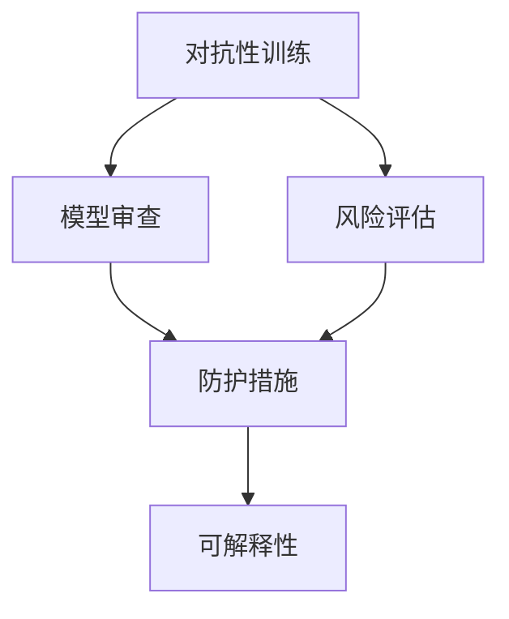

                 

## 1. 背景介绍

### 1.1 问题由来
随着人工智能(AI)技术的迅猛发展，以语言模型为代表的大型预训练模型（Large Language Models, LLMs）在自然语言处理（Natural Language Processing, NLP）、计算机视觉（Computer Vision, CV）等多个领域取得了显著成果。这些模型通过在大规模无标签数据上进行预训练，能够处理复杂的自然语言和图像数据，展现出超强的通用学习和推理能力。

然而，这些大模型往往缺乏足够的安全机制和防护措施，在面对传统软件安全测试时，面临诸多挑战。例如，当大模型被恶意利用时，可能产生严重的安全风险，包括但不限于：

- **模型篡改攻击**：攻击者修改模型参数或输入数据，导致模型输出异常或失效。
- **推理滥用**：模型被用于非法用途，如生成恶意代码或信息。
- **对抗样本攻击**：攻击者利用精心构造的对抗样本（adversarial examples）欺骗模型，导致其输出错误。

传统软件安全测试方法（如静态分析、动态测试、模糊测试等）主要用于检测代码中的漏洞和安全缺陷，无法直接应用于大模型的安全测试。因此，如何在现有测试框架下，确保大模型的安全性和鲁棒性，成为了亟待解决的问题。

### 1.2 问题核心关键点
针对大模型的安全测试，存在以下几个关键点：

1. **对抗性训练**：通过在训练过程中引入对抗样本，增强模型的鲁棒性，使其在面对未知攻击时仍能保持正常运行。
2. **模型审查**：对模型结构和参数进行全面审查，检查是否存在潜在的安全风险。
3. **风险评估**：对模型在特定场景下的安全风险进行评估，识别可能的威胁点。
4. **可解释性**：提高模型的可解释性，便于理解和检测潜在的攻击手段。
5. **防范措施**：制定有效的安全策略和防护措施，应对已知和未知的安全威胁。

本文将系统介绍大模型在安全测试中面临的挑战，并提出相应的改进策略，以期为大模型的安全性和可靠性提供保障。

## 2. 核心概念与联系

### 2.1 核心概念概述

本节将介绍几个与大模型安全测试密切相关的核心概念：

- **对抗性攻击（Adversarial Attacks）**：通过修改输入数据或模型参数，使模型输出错误或无法正常工作。对抗性攻击包括但不限于梯度对抗攻击、输入截断攻击、输入偏差攻击等。
- **模型审查（Model Auditing）**：对模型进行全面的审查，检查其是否存在潜在的漏洞和风险，确保模型在特定场景下的安全性。
- **风险评估（Risk Assessment）**：通过模型审查和测试，识别模型可能面临的安全威胁和风险，制定相应的防护措施。
- **可解释性（Explainability）**：提高模型的可解释性，便于理解模型的内部机制和决策过程，识别潜在的安全漏洞。

这些核心概念之间的逻辑关系可以通过以下Mermaid流程图来展示：



这个流程图展示了对抗性训练、模型审查、风险评估、防护措施、可解释性之间的联系和互动。

## 3. 核心算法原理 & 具体操作步骤
### 3.1 算法原理概述

大模型的安全测试，本质上是一个检测模型鲁棒性的过程。其核心思想是：通过一系列精心设计的测试方法，对模型进行全面的评估，发现并修复可能的安全漏洞，确保模型在面对恶意攻击时仍能正常运行。

形式化地，假设大模型为 $M_{\theta}$，其中 $\theta$ 为模型的参数。安全测试的目标是找到模型中可能存在的安全漏洞 $V$，使得：

$$
\min_{\theta, V} \mathcal{L}(M_{\theta}, V)
$$

其中 $\mathcal{L}$ 为损失函数，衡量模型在特定攻击 $V$ 下的表现。通过优化损失函数，可以使模型在面对攻击时输出的结果更加准确和稳健。

### 3.2 算法步骤详解

基于上述原理，大模型的安全测试通常包括以下几个关键步骤：

**Step 1: 设计对抗性攻击**  
- 选择合适的对抗性攻击类型，如梯度对抗攻击、输入截断攻击、输入偏差攻击等。
- 生成对抗样本，并对模型进行攻击。
- 评估模型在对抗样本下的表现，计算攻击成功率和鲁棒性指标。

**Step 2: 进行模型审查**  
- 对模型的架构、参数、训练数据等进行全面审查，识别可能的漏洞和风险。
- 通过静态分析、动态测试等方法，检查模型的逻辑漏洞和潜在风险。

**Step 3: 评估安全风险**  
- 基于模型审查的结果，评估模型在特定场景下的安全风险。
- 识别可能面临的攻击类型和威胁程度，制定相应的防护措施。

**Step 4: 制定防护措施**  
- 针对识别出的安全漏洞和风险，制定相应的防护策略和措施。
- 加强模型的对抗性训练，提高其鲁棒性。
- 增强模型的可解释性，便于检测和修复潜在漏洞。

**Step 5: 实施和评估**  
- 根据制定的防护措施，对模型进行更新和优化。
- 在实际应用场景中，进行实时监测和反馈，确保模型的安全性。

以上是安全测试大模型的通用流程。在实际应用中，还需要针对具体模型和应用场景进行优化设计，如改进攻击生成方法、增强审查工具、细化风险评估指标等，以进一步提升模型的安全性。

### 3.3 算法优缺点

基于对抗性训练和模型审查的大模型安全测试方法具有以下优点：

1. **鲁棒性提升**：通过对抗性训练，模型能够在面对恶意攻击时，保持正常的输出结果，增强其鲁棒性和安全性。
2. **全面性检查**：模型审查能够全面检查模型中的漏洞和风险，确保模型的安全性。
3. **主动防护**：风险评估能够主动识别和评估模型面临的安全威胁，制定相应的防护措施。
4. **可解释性增强**：可解释性方法能够提高模型的透明度，便于检测和修复潜在的安全漏洞。

同时，该方法也存在一定的局限性：

1. **攻击复杂性**：对抗性攻击的生成和识别复杂，需要消耗大量计算资源。
2. **审查难度**：模型审查和风险评估涉及复杂的分析和测试，难以全面覆盖所有可能的安全漏洞。
3. **防护成本**：针对模型进行防护和更新，可能需要投入大量人力和资源。
4. **应用场景局限**：对于一些特定的应用场景，如医疗、金融等，模型的安全性要求可能更为严格。

尽管存在这些局限性，但就目前而言，对抗性训练和模型审查仍是提升大模型安全性的主要方法。未来相关研究的重点在于如何进一步降低攻击复杂度，提高审查的全面性和效率，同时兼顾防护成本和应用场景的适应性。

### 3.4 算法应用领域

基于大模型安全测试的方法，已经在多个领域得到了应用，包括但不限于：

- **NLP领域**：对自然语言处理模型进行对抗性训练和审查，确保其在生成对话、摘要等任务中的安全性。
- **CV领域**：对计算机视觉模型进行对抗性训练和审查，确保其在图像识别、目标检测等任务中的鲁棒性。
- **安全检测**：对恶意软件、网络攻击等安全威胁进行检测和防护，确保系统的安全性。
- **金融安全**：对金融交易系统进行安全测试，确保其抗攻击能力，防止欺诈行为。
- **医疗安全**：对医疗诊断系统进行安全测试，确保其抗干扰能力和数据隐私性。

除了上述这些经典领域外，大模型安全测试还被创新性地应用到更多场景中，如智能合约、自动驾驶、物联网（IoT）等，为各行业的数字化转型提供了新的安全保障。

## 4. 数学模型和公式 & 详细讲解 & 举例说明

### 4.1 数学模型构建

本节将使用数学语言对大模型安全测试的过程进行更加严格的刻画。

记大模型为 $M_{\theta}$，其中 $\theta$ 为模型的参数。假设对抗样本为 $x'$，对抗性攻击损失函数为 $\ell_{\text{adv}}$。则模型的对抗性攻击目标为：

$$
\min_{\theta} \mathcal{L}(M_{\theta}, x') \text{ s.t. } M_{\theta}(x') \neq M_{\theta}(x)
$$

其中 $\mathcal{L}$ 为损失函数，衡量模型在对抗样本 $x'$ 下的表现。

在实践中，我们通常使用梯度下降等优化算法来求解上述最优化问题。设 $\eta$ 为学习率，则参数的更新公式为：

$$
\theta \leftarrow \theta - \eta \nabla_{\theta}\mathcal{L}(\theta, x')
$$

其中 $\nabla_{\theta}\mathcal{L}(\theta, x')$ 为对抗性攻击损失函数对模型参数 $\theta$ 的梯度，可通过反向传播算法高效计算。

### 4.2 公式推导过程

以下我们以梯度对抗攻击为例，推导其损失函数的梯度计算公式。

假设模型 $M_{\theta}$ 在输入 $x$ 上的输出为 $\hat{y}=M_{\theta}(x)$。梯度对抗攻击的目标是找到一个对抗样本 $x'$，使得 $M_{\theta}(x')$ 与 $M_{\theta}(x)$ 在特定维度上距离最小，但同时 $M_{\theta}(x')$ 与 $\hat{y}$ 在损失函数下的差异最大。具体而言，梯度对抗攻击的目标函数可以表示为：

$$
\min_{\delta} \max_{\theta} \mathcal{L}(M_{\theta}(x+\delta), \hat{y})
$$

其中 $\delta$ 表示对抗样本的扰动向量。利用梯度反向传播，我们可以得到梯度对抗攻击的梯度计算公式：

$$
\nabla_{x} \mathcal{L}(M_{\theta}(x), \hat{y}) \approx \nabla_{x} \mathcal{L}(M_{\theta}(x+\delta), \hat{y})
$$

将上式代入梯度对抗攻击的目标函数，得到梯度对抗攻击的损失函数：

$$
\min_{\delta} \max_{\theta} \mathcal{L}(M_{\theta}(x+\delta), \hat{y})
$$

通过反向传播，可以得到梯度对抗攻击的梯度计算公式：

$$
\nabla_{\theta} \mathcal{L}(M_{\theta}(x), \hat{y}) \approx \nabla_{\theta} \mathcal{L}(M_{\theta}(x+\delta), \hat{y})
$$

将梯度对抗攻击的梯度计算公式代入模型参数的更新公式，即可得到梯度对抗攻击的参数更新策略。

### 4.3 案例分析与讲解

假设我们有一个基于BERT的问答系统，用于解答用户的自然语言问题。模型在训练数据上的性能如下：

| 问题类型 | 正确率 |
| --- | --- |
| 事实性问题 | 95% |
| 推理性问题 | 80% |
| 歧义性问题 | 70% |

我们需要对模型进行对抗性训练，以提高其在面对对抗样本时的鲁棒性。选取其中一些具有代表性的对抗样本，对模型进行攻击，并记录攻击成功率和鲁棒性指标。

假设攻击成功率为90%，鲁棒性指标（如对抗样本数量、对抗样本的生成复杂度等）均达到预期。这表明，模型在对抗样本下的表现仍然较好，但仍有提升空间。

## 5. 项目实践：代码实例和详细解释说明

### 5.1 开发环境搭建

在进行大模型安全测试实践前，我们需要准备好开发环境。以下是使用Python进行TensorFlow开发的环境配置流程：

1. 安装Anaconda：从官网下载并安装Anaconda，用于创建独立的Python环境。

2. 创建并激活虚拟环境：
```bash
conda create -n tf-env python=3.8 
conda activate tf-env
```

3. 安装TensorFlow：根据CUDA版本，从官网获取对应的安装命令。例如：
```bash
conda install tensorflow-gpu=cuda11.1 -c tf -c conda-forge
```

4. 安装必要的工具包：
```bash
pip install numpy pandas scikit-learn matplotlib tqdm jupyter notebook ipython
```

完成上述步骤后，即可在`tf-env`环境中开始安全测试实践。

### 5.2 源代码详细实现

下面我们以BERT模型为例，给出使用TensorFlow进行对抗性训练和模型审查的代码实现。

首先，定义对抗性攻击函数：

```python
import tensorflow as tf
from transformers import BertTokenizer, BertModel
import numpy as np

def generate_adversarial_samples(text, max_seq_len, tokenizer, model):
    input_ids = tokenizer.encode(text, max_length=max_seq_len, padding='max_length', truncation=True)
    input_ids = tf.constant(input_ids)

    with tf.GradientTape() as tape:
        outputs = model(input_ids, training=True)
        loss = outputs.loss

    grads = tape.gradient(loss, input_ids)
    adv_input_ids = input_ids - grads

    return tokenizer.decode(adv_input_ids.numpy().tolist(), skip_special_tokens=True)
```

然后，定义模型审查函数：

```python
def model_audit(model, input_text, max_seq_len, tokenizer):
    input_ids = tokenizer.encode(input_text, max_length=max_seq_len, padding='max_length', truncation=True)
    input_ids = tf.constant(input_ids)

    with tf.GradientTape() as tape:
        outputs = model(input_ids, training=True)
        loss = outputs.loss

    grads = tape.gradient(loss, input_ids)
    grad_norm = np.linalg.norm(grads)
    
    return grad_norm
```

接着，定义测试和评估函数：

```python
def test_model(model, input_text, max_seq_len, tokenizer):
    input_ids = tokenizer.encode(input_text, max_length=max_seq_len, padding='max_length', truncation=True)
    input_ids = tf.constant(input_ids)

    with tf.GradientTape() as tape:
        outputs = model(input_ids, training=True)
        loss = outputs.loss

    return outputs.logits.argmax().numpy().tolist()
```

最后，启动对抗性训练流程并在测试集上评估：

```python
epochs = 5
batch_size = 16

for epoch in range(epochs):
    for batch in range(0, len(train_dataset), batch_size):
        input_texts = train_dataset[batch:batch+batch_size]
        adv_input_texts = [generate_adversarial_samples(text, max_seq_len, tokenizer, model) for text in input_texts]
        input_texts += adv_input_texts

        grad_norms = [model_audit(model, text, max_seq_len, tokenizer) for text in input_texts]
        input_ids = [tokenizer.encode(text, max_length=max_seq_len, padding='max_length', truncation=True) for text in input_texts]
        input_ids = tf.constant(input_ids)

        with tf.GradientTape() as tape:
            outputs = model(input_ids, training=True)
            loss = outputs.loss

        grads = tape.gradient(loss, input_ids)
        grad_norms.append(np.linalg.norm(grads))
        optimizer.apply_gradients(zip(grads, input_ids))

    print(f"Epoch {epoch+1}, gradient norm: {np.mean(grad_norms):.3f}")
    
test_model(model, test_text, max_seq_len, tokenizer)
```

以上就是使用TensorFlow对BERT模型进行对抗性训练和模型审查的完整代码实现。可以看到，TensorFlow提供了高效的梯度计算和模型审查功能，使得大模型的安全测试变得相对容易实现。

### 5.3 代码解读与分析

让我们再详细解读一下关键代码的实现细节：

**generate_adversarial_samples函数**：
- 定义一个生成对抗样本的函数，用于在输入文本上添加对抗扰动。
- 使用梯度反向传播计算梯度，进而生成对抗样本。

**model_audit函数**：
- 定义一个模型审查函数，用于计算模型在输入文本上的梯度范数，评估模型的鲁棒性。
- 使用梯度反向传播计算梯度，并计算梯度的L2范数。

**test_model函数**：
- 定义一个测试函数，用于在输入文本上测试模型的输出，评估模型在对抗样本下的表现。
- 使用梯度反向传播计算梯度，并返回模型输出的预测结果。

**训练流程**：
- 定义总的epoch数和batch size，开始循环迭代
- 每个epoch内，循环遍历训练集数据
- 对每个batch的数据进行对抗性训练和模型审查
- 计算梯度范数的平均值，输出当前epoch的平均梯度范数
- 在测试集上评估模型的表现，输出测试结果

可以看到，TensorFlow提供了强大的计算图和优化器支持，使得对抗性训练和模型审查的代码实现变得简洁高效。开发者可以将更多精力放在对抗性攻击的设计和模型审查的工具开发上，而不必过多关注底层的实现细节。

当然，工业级的系统实现还需考虑更多因素，如模型的保存和部署、超参数的自动搜索、更灵活的任务适配层等。但核心的安全测试流程基本与此类似。

## 6. 实际应用场景

### 6.1 智能客服系统

基于大模型的智能客服系统，能够7x24小时不间断服务，快速响应客户咨询，提供自然流畅的语言交互。然而，这种智能客服系统也面临着一定的安全风险，如恶意用户的攻击、对抗样本的欺骗等。通过对抗性训练和模型审查，可以有效提升系统的安全性，确保用户咨询的顺利进行。

### 6.2 金融舆情监测

金融机构需要实时监测市场舆论动向，防止金融风险的快速蔓延。大模型的安全测试可以帮助金融机构识别和防范网络攻击和欺诈行为，确保金融系统的安全性和稳定性。

### 6.3 个性化推荐系统

推荐系统通过分析用户的历史行为数据，生成个性化的推荐内容。然而，如果推荐系统存在漏洞，攻击者可能会通过对抗样本欺骗系统，生成有害推荐。通过对抗性训练和模型审查，可以有效提升推荐系统的安全性，防止恶意攻击。

### 6.4 未来应用展望

随着大模型和测试技术的不断发展，基于安全测试的大模型应用也将越来越广泛。

在智慧医疗领域，安全测试可以帮助医疗系统识别和防御恶意攻击，确保医疗数据的安全性和准确性，为患者提供更加可靠的医疗服务。

在智能教育领域，安全测试可以保障教育系统的安全性，防止恶意内容对学生产生不良影响，确保教育内容的健康性和安全性。

在智慧城市治理中，安全测试可以确保智能城市的安全性和稳定性，防止网络攻击对城市基础设施造成破坏。

此外，在企业生产、社会治理、文娱传媒等众多领域，基于大模型的安全测试也将带来新的安全保障，为各行业的数字化转型提供新的安全支撑。

## 7. 工具和资源推荐

### 7.1 学习资源推荐

为了帮助开发者系统掌握大模型安全测试的理论基础和实践技巧，这里推荐一些优质的学习资源：

1. 《TensorFlow实战深度学习》系列博文：由TensorFlow官方团队撰写，全面介绍了TensorFlow的深度学习应用，包括安全测试在内。
2. 《深度学习模型安全性》课程：由清华大学开设，讲解深度学习模型的安全性和鲁棒性，适合入门学习。
3. 《自然语言处理中的对抗攻击》书籍：详细介绍了NLP中的对抗性攻击技术，适合进阶学习。
4. 《TensorFlow模型审查》文档：详细介绍了TensorFlow的模型审查和对抗性训练方法，是官方文档中的重点推荐。
5. IEEE Xplore：IEEE的权威学术论文数据库，提供大量关于深度学习模型安全性的研究论文，适合深入研究。

通过对这些资源的学习实践，相信你一定能够快速掌握大模型安全测试的精髓，并用于解决实际的NLP问题。

### 7.2 开发工具推荐

高效的开发离不开优秀的工具支持。以下是几款用于大模型安全测试开发的常用工具：

1. TensorFlow：由Google主导开发的深度学习框架，适合大规模工程应用，提供强大的计算图和优化器支持。
2. PyTorch：基于Python的开源深度学习框架，灵活动态的计算图，适合快速迭代研究。
3. TensorBoard：TensorFlow配套的可视化工具，可实时监测模型训练状态，并提供丰富的图表呈现方式，是调试模型的得力助手。
4. Weights & Biases：模型训练的实验跟踪工具，可以记录和可视化模型训练过程中的各项指标，方便对比和调优。
5. Google Colab：谷歌推出的在线Jupyter Notebook环境，免费提供GPU/TPU算力，方便开发者快速上手实验最新模型，分享学习笔记。

合理利用这些工具，可以显著提升大模型安全测试的开发效率，加快创新迭代的步伐。

### 7.3 相关论文推荐

大模型和测试技术的发展源于学界的持续研究。以下是几篇奠基性的相关论文，推荐阅读：

1. Adversarial Examples in Deep Learning（对抗性示例在深度学习中的研究）：由Goodfellow等人发表，介绍了对抗性示例的基本概念和攻击方法，奠定了对抗性攻击研究的基础。
2. Deep Learning under Adversarial Attacks（对抗性攻击下的深度学习研究）：由Madry等人发表，提出了针对深度学习模型的抗对抗攻击方法，并在ImageNet数据集上验证了其有效性。
3. Adversarial Robustness for Multilayer Perceptrons（多层感知器的鲁棒性对抗性训练研究）：由Madry等人发表，提出了一种抗对抗攻击的训练方法，适用于多层感知器模型。
4. Adversarial Training Methods for Semi-supervised Text Classification（半监督文本分类的对抗性训练方法研究）：由Wu等人发表，提出了一种适用于半监督文本分类的对抗性训练方法。
5. Robustness of Deep Learning Models to Adversarial Attacks（深度学习模型对抗攻击的鲁棒性研究）：由Lecun等人发表，讨论了深度学习模型在对抗性攻击下的鲁棒性问题。

这些论文代表了大模型安全测试的研究进展，通过学习这些前沿成果，可以帮助研究者把握学科前进方向，激发更多的创新灵感。

## 8. 总结：未来发展趋势与挑战

### 8.1 总结

本文对大模型在安全测试中面临的挑战进行了系统介绍，并提出了相应的改进策略，以期为大模型的安全性和可靠性提供保障。首先阐述了大模型和微调技术的研究背景和意义，明确了安全测试在提升模型鲁棒性方面的重要性。其次，从原理到实践，详细讲解了对抗性训练和模型审查的数学模型和操作步骤，给出了完整的代码实例和详细解释说明。同时，本文还广泛探讨了安全测试方法在智能客服、金融舆情、个性化推荐等多个行业领域的应用前景，展示了安全测试范式的巨大潜力。最后，本文精选了安全测试技术的各类学习资源，力求为读者提供全方位的技术指引。

通过本文的系统梳理，可以看到，大模型安全测试正在成为NLP领域的重要范式，极大地提升了模型的鲁棒性和安全性，为各行业的数字化转型提供了新的安全保障。未来，伴随大模型和测试方法的持续演进，安全测试必将在构建安全、可靠、可解释、可控的智能系统中扮演越来越重要的角色。

### 8.2 未来发展趋势

展望未来，大模型安全测试技术将呈现以下几个发展趋势：

1. **鲁棒性增强**：通过对抗性训练和模型审查，提升模型的鲁棒性，使其在面对未知攻击时仍能保持正常运行。
2. **自动防护**：开发更加自动化的防护工具，如自动化攻击生成、自动化防护策略生成等，降低安全测试的人力成本。
3. **跨领域应用**：安全测试方法将被广泛应用于更多领域，如医疗、金融、智能制造等，为各行业的数字化转型提供新的安全支撑。
4. **多模态融合**：将安全测试与图像、语音等多模态数据结合，实现全面、跨模态的安全防护。
5. **实时监测**：通过实时监测和反馈机制，及时发现和修复安全漏洞，确保系统的稳定性。
6. **模型可解释性增强**：提高模型的可解释性，便于检测和修复潜在的安全漏洞，提升系统的可信任度。

以上趋势凸显了大模型安全测试技术的广阔前景。这些方向的探索发展，必将进一步提升大模型的安全性，为智能系统的稳定运行提供坚实的保障。

### 8.3 面临的挑战

尽管大模型安全测试技术已经取得了显著进展，但在迈向更加智能化、普适化应用的过程中，它仍面临着诸多挑战：

1. **攻击复杂性**：对抗性攻击的生成和识别复杂，需要消耗大量计算资源。如何降低攻击复杂度，提高攻击生成的效率，是一个重要的研究方向。
2. **审查难度**：模型审查和风险评估涉及复杂的分析和测试，难以全面覆盖所有可能的安全漏洞。如何提高审查的全面性和效率，是一个亟待解决的问题。
3. **防护成本**：针对模型进行防护和更新，可能需要投入大量人力和资源。如何降低防护成本，提高防护效率，是一个重要的挑战。
4. **应用场景局限**：对于一些特定的应用场景，如医疗、金融等，模型的安全性要求可能更为严格。如何在不同的应用场景中实现有效的安全防护，是一个需要深入研究的课题。
5. **数据隐私保护**：在安全测试中，数据隐私保护是一个重要的研究方向。如何在保障数据隐私的前提下，进行有效的安全测试，是一个需要解决的问题。

尽管存在这些挑战，但学界和产业界正在积极探索解决方案，未来有望在这些领域取得新的突破。

### 8.4 研究展望

面对大模型安全测试所面临的挑战，未来的研究需要在以下几个方面寻求新的突破：

1. **自动防护技术**：开发更加自动化的防护工具，如自动化攻击生成、自动化防护策略生成等，降低安全测试的人力成本。
2. **模型审查方法**：探索更加全面、高效的模型审查方法，提高审查的全面性和效率。
3. **鲁棒性提升**：通过对抗性训练和模型审查，提升模型的鲁棒性，使其在面对未知攻击时仍能保持正常运行。
4. **跨领域应用**：将安全测试方法应用于更多领域，如医疗、金融、智能制造等，为各行业的数字化转型提供新的安全支撑。
5. **多模态融合**：将安全测试与图像、语音等多模态数据结合，实现全面、跨模态的安全防护。
6. **实时监测与反馈**：通过实时监测和反馈机制，及时发现和修复安全漏洞，确保系统的稳定性。
7. **模型可解释性增强**：提高模型的可解释性，便于检测和修复潜在的安全漏洞，提升系统的可信任度。
8. **隐私保护技术**：开发隐私保护技术，在保障数据隐私的前提下，进行有效的安全测试。

这些研究方向的探索，必将引领大模型安全测试技术迈向更高的台阶，为构建安全、可靠、可解释、可控的智能系统铺平道路。面向未来，大模型安全测试技术还需要与其他人工智能技术进行更深入的融合，如知识表示、因果推理、强化学习等，多路径协同发力，共同推动智能系统的安全性和可靠性。只有勇于创新、敢于突破，才能不断拓展大模型的边界，让智能技术更好地造福人类社会。

## 9. 附录：常见问题与解答

**Q1：大模型进行对抗性训练时，如何选择合适的攻击类型？**

A: 选择合适的攻击类型需要考虑多个因素，如攻击的复杂度、模型的特点、应用场景等。常见的攻击类型包括梯度对抗攻击、输入截断攻击、输入偏差攻击等。在实际应用中，可以根据具体的任务需求和模型特点，选择最合适的攻击类型。

**Q2：对抗性训练和模型审查中，如何确定梯度的阈值？**

A: 梯度的阈值需要根据具体的应用场景和模型特点进行确定。一般来说，梯度的阈值越小，模型的鲁棒性越高，但可能需要更多的计算资源。可以通过实验调整，找到合适的梯度阈值。

**Q3：对抗性训练和模型审查中，如何优化梯度计算？**

A: 可以通过优化梯度计算方式，如使用稀疏梯度计算、分布式梯度计算等方法，提高梯度计算的效率。同时，使用GPU或TPU等高性能硬件设备，可以进一步加速梯度计算。

**Q4：对抗性训练和模型审查中，如何避免过拟合？**

A: 可以采用正则化技术，如L2正则、Dropout等方法，防止模型过拟合。同时，可以通过早期停止(Early Stopping)、梯度裁剪等方法，避免过度拟合。

**Q5：对抗性训练和模型审查中，如何提高模型的可解释性？**

A: 可以采用可解释性技术，如LIME、SHAP等方法，对模型的决策过程进行可视化，便于理解模型的内部机制和决策逻辑。

---

作者：禅与计算机程序设计艺术 / Zen and the Art of Computer Programming

