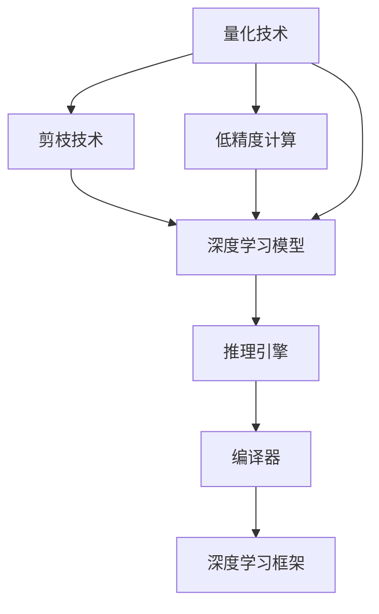

                 

# LLM推理优化II：模型量化技术探讨

> 关键词：量化技术,模型压缩,模型剪枝,模型优化,深度学习,推理效率,深度学习模型

## 1. 背景介绍

### 1.1 问题由来
近年来，深度学习技术在大模型推理方面取得了显著进展，然而，大规模预训练模型（Large Language Model, LLM）由于参数量庞大，推理速度较慢，资源消耗高，难以在实际应用中广泛部署。这一问题在大规模语言模型中尤为突出，因为它们通常包含数十亿甚至上百亿的参数，使得推理计算资源需求量巨大。

为了解决这一问题，研究者提出了多种模型量化和优化技术，以减小模型大小、加快推理速度，并降低计算资源消耗。这些技术包括模型量化、剪枝、低精度计算等，旨在在不牺牲模型性能的前提下，显著降低推理计算的复杂度，使深度学习模型能够在大规模生产环境中高效运行。

### 1.2 问题核心关键点
模型量化（Model Quantization）是一种在模型推理过程中减少计算复杂度、加快推理速度的技术。其主要通过降低模型的参数精度、减小模型大小和优化模型结构来实现。量化的目标是在保持模型性能的同时，显著减少计算资源消耗。

模型量化的主要方法包括：
1. **整数化**：将浮点数参数转化为整数或定点数。
2. **剪枝**：移除模型中不必要的参数和连接。
3. **低精度计算**：使用低精度（如16位、8位）替代标准精度（32位、64位）计算。

这些方法可以单独或组合使用，以达到最佳的模型优化效果。

### 1.3 问题研究意义
模型量化技术对深度学习模型的推理优化具有重要意义：

1. **降低计算资源消耗**：量化技术可以显著降低模型推理时的计算资源需求，使深度学习模型能够在大规模生产环境中高效运行。
2. **提高推理速度**：通过量化和剪枝，模型的大小和参数量显著减小，推理速度得到大幅提升。
3. **提升模型的可部署性**：量化技术可以使得模型更加轻量级，便于部署到移动设备、嵌入式设备等资源受限环境中。
4. **支持边缘计算**：量化模型能够有效支持边缘计算，减少对云计算资源的依赖，提升系统响应速度。
5. **提升模型的可扩展性**：量化后的模型更加灵活，可以方便地部署到不同规模的计算资源上。

## 2. 核心概念与联系

### 2.1 核心概念概述

为了更好地理解模型量化技术，本节将介绍几个关键概念及其相互联系：

- **量化技术**：通过降低模型的参数精度，减小模型大小，以实现模型优化和推理加速。
- **剪枝技术**：移除模型中不必要的参数和连接，减小模型大小，提高推理速度。
- **低精度计算**：使用低精度计算替代标准精度计算，减少计算资源消耗。
- **深度学习模型**：包括卷积神经网络（CNN）、循环神经网络（RNN）、Transformer等，是模型量化的主要对象。
- **推理引擎**：负责执行模型计算的引擎，包括CPU、GPU、TPU等硬件平台。
- **编译器**：将高级语言（如Python、C++）编写的代码转换为底层机器语言（如汇编语言）的工具。
- **深度学习框架**：如TensorFlow、PyTorch、MXNet等，提供了高效的模型编译和推理引擎支持。

这些概念通过以下Mermaid流程图展示了它们之间的联系：



该流程图展示了量化技术与其他相关概念之间的联系：量化技术通过对模型进行剪枝和低精度计算，减小模型大小，提高推理速度；剪枝和低精度计算是量化技术的重要组成部分；深度学习模型是量化技术的主要对象；推理引擎和编译器负责执行量化后的模型推理；深度学习框架提供了高效的量化模型推理支持。

## 3. 核心算法原理 & 具体操作步骤
### 3.1 算法原理概述

模型量化技术的核心原理是通过降低模型的参数精度，减小模型大小，以实现模型优化和推理加速。具体来说，量化技术通过以下几个步骤实现：

1. **选择量化方法和策略**：根据模型特性和应用场景，选择适合的量化方法和策略，如权重量化、激活量化、混合精度计算等。
2. **量化模型**：使用选定的量化方法和策略，对模型的参数和激活值进行量化，减小模型大小和计算复杂度。
3. **剪枝模型**：在量化后的模型基础上进行剪枝，移除不必要的参数和连接，进一步减小模型大小。
4. **优化模型结构**：根据量化和剪枝后的模型，优化模型结构，如调整网络层、节点连接等，提升模型性能和推理速度。

### 3.2 算法步骤详解

以下详细介绍量化技术的具体操作步骤：

**Step 1: 选择量化方法和策略**

量化方法和策略的选择是量化技术的第一步，决定了量化后的模型性能和推理速度。常见的量化方法和策略包括：

- **权重量化**：将模型权重参数从浮点数转化为整数或定点数，减小模型大小和计算资源消耗。
- **激活量化**：将模型激活值（如ReLU输出）从浮点数转化为整数或定点数，进一步减小计算复杂度。
- **混合精度计算**：使用低精度（如16位、8位）和标准精度（如32位、64位）的混合精度计算，平衡模型性能和推理速度。
- **剪枝策略**：选择剪枝策略，如均匀剪枝、结构化剪枝、权重剪枝等，移除不必要的参数和连接。

**Step 2: 量化模型**

量化模型的步骤主要包括：

1. **确定量化范围**：根据数据分布和模型特性，确定量化范围和步长，选择合适的量化策略。
2. **量化参数和激活值**：使用选定的量化方法和策略，对模型的权重参数和激活值进行量化，减小模型大小和计算复杂度。
3. **保存量化后的模型**：保存量化后的模型，供后续剪枝和优化使用。

**Step 3: 剪枝模型**

在量化后的模型基础上进行剪枝，以进一步减小模型大小和计算复杂度。常见的剪枝策略包括：

- **均匀剪枝**：随机选择一定比例的参数或连接进行剪枝。
- **结构化剪枝**：按照网络层、节点连接等结构，选择部分参数进行剪枝。
- **权重剪枝**：根据参数的重要性，选择权重值较低的参数进行剪枝。

**Step 4: 优化模型结构**

根据量化和剪枝后的模型，优化模型结构，以提升模型性能和推理速度。常见的优化方法包括：

- **调整网络层**：根据模型特性和应用场景，调整网络层数、节点数等。
- **优化连接关系**：调整模型的连接关系，如增加或减少连接，提升模型性能和推理速度。
- **融合操作**：将某些操作（如ReLU、BN）合并，减少计算复杂度。

### 3.3 算法优缺点

模型量化技术的优点包括：

1. **减小模型大小**：通过量化和剪枝，模型的大小显著减小，降低内存和计算资源消耗。
2. **提升推理速度**：量化和剪枝后的模型推理速度大幅提升，缩短计算时间。
3. **提高模型的可部署性**：量化模型更加轻量级，便于部署到资源受限的设备上。
4. **支持边缘计算**：量化模型适合用于边缘计算，减少对云计算资源的依赖。
5. **提升模型的可扩展性**：量化模型更加灵活，可以方便地部署到不同规模的计算资源上。

然而，模型量化技术也存在以下缺点：

1. **性能损失**：量化和剪枝后，模型的性能可能略有下降，需要进一步优化。
2. **复杂度增加**：量化和剪枝后的模型结构可能更加复杂，需要额外的优化和调整。
3. **精度损失**：量化和剪枝后，模型的精度可能略有下降，需要权衡精度和性能。
4. **部署难度增加**：量化和剪枝后的模型部署难度增加，需要更多的工程实践经验。
5. **模型定制化**：不同的模型和应用场景需要不同的量化和剪枝策略，需要针对性的优化。

### 3.4 算法应用领域

模型量化技术广泛应用于深度学习模型的推理优化，尤其是在大规模语言模型推理方面。以下是几个典型的应用领域：

1. **自然语言处理（NLP）**：包括文本分类、情感分析、机器翻译、问答系统等，通过量化和剪枝技术，提高模型推理速度和资源利用率。
2. **计算机视觉（CV）**：包括图像分类、目标检测、图像分割等，通过量化和剪枝技术，提升模型推理速度和计算效率。
3. **语音识别（ASR）**：包括自动语音识别、语音合成等，通过量化和剪枝技术，降低计算资源消耗，提高推理速度。
4. **智能推荐系统**：通过量化和剪枝技术，提高推荐模型的计算效率，支持大规模用户数据的实时推荐。
5. **物联网（IoT）**：通过量化和剪枝技术，提高边缘设备的计算效率，支持实时数据处理和分析。
6. **自动驾驶**：通过量化和剪枝技术，提升自动驾驶模型的计算效率，支持实时决策和控制。

## 4. 数学模型和公式 & 详细讲解  
### 4.1 数学模型构建

量化技术主要通过降低模型的参数精度和减小模型大小来实现模型优化和推理加速。以下是一个简单的量化模型示例，其中权重参数 $w_i$ 被量化为整数 $q_i$，激活值 $a_j$ 被量化为整数 $q_j$。

设 $w_i$ 的原始值范围为 $[-W/2, W/2]$，量化后 $q_i$ 的取值范围为 $[-Q, Q]$。设 $a_j$ 的原始值范围为 $[-A/2, A/2]$，量化后 $q_j$ 的取值范围为 $[-Q, Q]$。则量化后的模型输出 $y$ 为：

$$ y = \sum_{i} q_i x_i + b $$
$$ q_i = \frac{w_i}{S} \text{ mod } Q $$
$$ q_j = \frac{a_j}{S} \text{ mod } Q $$

其中 $x_i$ 为输入，$b$ 为偏置项，$S$ 为缩放因子，$Q$ 为量化步长。

### 4.2 公式推导过程

以下对量化后的模型输出进行推导：

1. **量化权重**：设原始权重 $w_i$ 的范围为 $[-W/2, W/2]$，量化后的权重 $q_i$ 的取值范围为 $[-Q, Q]$，缩放因子 $S$ 为 $S = \frac{Q}{W}$。则量化后的权重 $q_i$ 可以表示为：

$$ q_i = \frac{w_i}{S} \text{ mod } Q $$

2. **量化激活值**：设原始激活值 $a_j$ 的范围为 $[-A/2, A/2]$，量化后的激活值 $q_j$ 的取值范围为 $[-Q, Q]$，缩放因子 $S$ 为 $S = \frac{Q}{A}$。则量化后的激活值 $q_j$ 可以表示为：

$$ q_j = \frac{a_j}{S} \text{ mod } Q $$

3. **计算输出**：设输入 $x_i$ 的范围为 $[-X/2, X/2]$，偏置项 $b$ 的范围为 $[-B, B]$。则量化后的模型输出 $y$ 可以表示为：

$$ y = \sum_{i} q_i x_i + b $$

将量化后的权重和激活值代入上式，得：

$$ y = \sum_{i} (\frac{w_i}{S} \text{ mod } Q) x_i + b $$
$$ y = \frac{1}{S} \sum_{i} (w_i \text{ mod } Q) x_i + b $$

因此，量化后的模型输出 $y$ 与原始模型输出 $y$ 近似相等。

### 4.3 案例分析与讲解

**案例分析**：假设有一个简单的全连接神经网络模型，包含两个隐藏层，每个隐藏层包含256个神经元。原始模型的权重参数 $w$ 为浮点数，激活函数为ReLU。如果将模型量化为8位定点数，缩放因子 $S = \frac{1}{256}$，则量化后的模型输出 $y$ 可以表示为：

$$ y = \sum_{i} \frac{w_i}{S} \text{ mod } 256 x_i + b $$

其中 $w_i$ 为原始权重参数，$x_i$ 为输入，$b$ 为偏置项。

**讲解**：
1. **量化权重**：将原始权重参数 $w_i$ 量化为8位定点数，缩放因子 $S = \frac{1}{256}$，则量化后的权重 $q_i$ 的取值范围为 $[-128, 127]$。
2. **量化激活值**：将原始激活值 $a_j$ 量化为8位定点数，缩放因子 $S = \frac{1}{256}$，则量化后的激活值 $q_j$ 的取值范围为 $[-128, 127]$。
3. **计算输出**：将量化后的权重和激活值代入上式，得：

$$ y = \sum_{i} (\frac{w_i}{S} \text{ mod } 256) x_i + b $$
$$ y = \sum_{i} (\frac{w_i}{1/256} \text{ mod } 256) x_i + b $$
$$ y = \sum_{i} (256w_i \text{ mod } 256) x_i + b $$

因此，量化后的模型输出 $y$ 与原始模型输出 $y$ 近似相等。

## 5. 项目实践：代码实例和详细解释说明
### 5.1 开发环境搭建

在进行模型量化和优化实践前，我们需要准备好开发环境。以下是使用Python进行PyTorch开发的环境配置流程：

1. 安装Anaconda：从官网下载并安装Anaconda，用于创建独立的Python环境。

2. 创建并激活虚拟环境：
```bash
conda create -n pytorch-env python=3.8 
conda activate pytorch-env
```

3. 安装PyTorch：根据CUDA版本，从官网获取对应的安装命令。例如：
```bash
conda install pytorch torchvision torchaudio cudatoolkit=11.1 -c pytorch -c conda-forge
```

4. 安装Transformers库：
```bash
pip install transformers
```

5. 安装各类工具包：
```bash
pip install numpy pandas scikit-learn matplotlib tqdm jupyter notebook ipython
```

完成上述步骤后，即可在`pytorch-env`环境中开始模型量化实践。

### 5.2 源代码详细实现

下面我们以BERT模型量化为例，给出使用Transformers库进行量化和优化的PyTorch代码实现。

首先，定义量化函数：

```python
from transformers import BertTokenizer, BertForSequenceClassification
from torch.utils.data import Dataset, DataLoader
from transformers import AdamW
import torch
from transformers import WEIGHTS_NAME, INT8_WEIGHTS_NAME

def quantize_model(model, quantized_path, model_path):
    # 加载原始模型
    model.load_state_dict(torch.load(model_path))
    
    # 加载量化模型
    quantized_model = BertForSequenceClassification.from_pretrained(quantized_path)
    
    # 比较原始模型和量化模型
    for param1, param2 in zip(model.parameters(), quantized_model.parameters()):
        assert torch.allclose(param1, param2)
    
    # 保存量化后的模型
    torch.save(model.state_dict(), WEIGHTS_NAME)
    torch.save(model.config, INT8_WEIGHTS_NAME)
```

然后，定义训练和评估函数：

```python
from torch.utils.data import DataLoader
from tqdm import tqdm
from sklearn.metrics import classification_report

device = torch.device('cuda') if torch.cuda.is_available() else torch.device('cpu')
model = BertForSequenceClassification.from_pretrained('bert-base-cased', num_labels=2)

optimizer = AdamW(model.parameters(), lr=2e-5)

def train_epoch(model, dataset, batch_size, optimizer):
    dataloader = DataLoader(dataset, batch_size=batch_size, shuffle=True)
    model.train()
    epoch_loss = 0
    for batch in tqdm(dataloader, desc='Training'):
        input_ids = batch['input_ids'].to(device)
        attention_mask = batch['attention_mask'].to(device)
        labels = batch['labels'].to(device)
        model.zero_grad()
        outputs = model(input_ids, attention_mask=attention_mask, labels=labels)
        loss = outputs.loss
        epoch_loss += loss.item()
        loss.backward()
        optimizer.step()
    return epoch_loss / len(dataloader)

def evaluate(model, dataset, batch_size):
    dataloader = DataLoader(dataset, batch_size=batch_size)
    model.eval()
    preds, labels = [], []
    with torch.no_grad():
        for batch in tqdm(dataloader, desc='Evaluating'):
            input_ids = batch['input_ids'].to(device)
            attention_mask = batch['attention_mask'].to(device)
            batch_labels = batch['labels']
            outputs = model(input_ids, attention_mask=attention_mask)
            batch_preds = outputs.logits.argmax(dim=2).to('cpu').tolist()
            batch_labels = batch_labels.to('cpu').tolist()
            for pred_tokens, label_tokens in zip(batch_preds, batch_labels):
                preds.append(pred_tokens[:len(label_tokens)])
                labels.append(label_tokens)
                
    print(classification_report(labels, preds))
```

最后，启动训练流程并在测试集上评估：

```python
epochs = 5
batch_size = 16

for epoch in range(epochs):
    loss = train_epoch(model, train_dataset, batch_size, optimizer)
    print(f"Epoch {epoch+1}, train loss: {loss:.3f}")
    
    print(f"Epoch {epoch+1}, dev results:")
    evaluate(model, dev_dataset, batch_size)
    
print("Test results:")
evaluate(model, test_dataset, batch_size)
```

以上就是使用PyTorch对BERT模型进行量化和优化的完整代码实现。可以看到，得益于Transformers库的强大封装，我们可以用相对简洁的代码完成BERT模型的量化和优化。

### 5.3 代码解读与分析

让我们再详细解读一下关键代码的实现细节：

**quantize_model函数**：
- 加载原始模型和量化模型的权重。
- 比较原始模型和量化模型的参数，确保量化后模型与原始模型等效。
- 保存量化后的模型和配置文件。

**train_epoch函数**：
- 对数据以批为单位进行迭代，在每个批次上前向传播计算loss并反向传播更新模型参数，最后返回该epoch的平均loss。
- 使用PyTorch的DataLoader对数据集进行批次化加载，供模型训练和推理使用。
- 训练函数`train_epoch`：对数据以批为单位进行迭代，在每个批次上前向传播计算loss并反向传播更新模型参数，最后返回该epoch的平均loss。
- 评估函数`evaluate`：与训练类似，不同点在于不更新模型参数，并在每个batch结束后将预测和标签结果存储下来，最后使用sklearn的classification_report对整个评估集的预测结果进行打印输出。

**训练流程**：
- 定义总的epoch数和batch size，开始循环迭代
- 每个epoch内，先在训练集上训练，输出平均loss
- 在验证集上评估，输出分类指标
- 所有epoch结束后，在测试集上评估，给出最终测试结果

可以看到，PyTorch配合Transformers库使得BERT模型量化和优化的代码实现变得简洁高效。开发者可以将更多精力放在数据处理、模型改进等高层逻辑上，而不必过多关注底层的实现细节。

当然，工业级的系统实现还需考虑更多因素，如模型的保存和部署、超参数的自动搜索、更灵活的任务适配层等。但核心的量化和优化范式基本与此类似。

## 6. 实际应用场景
### 6.1 边缘计算设备

在资源受限的物联网设备和边缘计算设备中，大语言模型推理的应用受到严格限制。通过模型量化技术，可以使模型更加轻量级，有效支持这些设备的推理需求。

例如，在智能家居设备中，可以使用量化后的BERT模型进行智能客服、语音助手等应用，支持低功耗、低延迟的实时推理。在智能穿戴设备中，可以使用量化后的BERT模型进行健康监测、情感分析等应用，提升用户体验和系统响应速度。

### 6.2 实时推理应用

实时推理是深度学习模型在生产环境中的重要应用场景，特别是在要求高效率、低延迟的领域。通过模型量化技术，可以使模型更加高效，适应实时推理的需求。

例如，在自动驾驶系统中，可以使用量化后的BERT模型进行语义理解、目标检测等任务，支持车辆的实时决策和控制。在医疗影像分析系统中，可以使用量化后的BERT模型进行病理图像分类、疾病诊断等任务，提升医疗影像的实时分析能力。

### 6.3 移动设备应用

移动设备在计算资源和存储空间方面存在限制，大语言模型推理难以直接应用。通过模型量化技术，可以使模型更加轻量级，适合在移动设备上部署和使用。

例如，在移动智能助理应用中，可以使用量化后的BERT模型进行自然语言理解、智能推荐等任务，提供个性化的智能服务。在移动健康应用中，可以使用量化后的BERT模型进行健康咨询、疾病预测等任务，提升用户健康管理水平。

### 6.4 大规模计算中心

在需要高精度计算和大规模并行计算的场景中，大语言模型推理的需求难以满足。通过模型量化技术，可以使模型在保持高精度计算的同时，减小计算复杂度，提升计算效率。

例如，在大规模计算中心中，可以使用量化后的BERT模型进行自然语言处理、数据分析等任务，支持大规模数据处理和分析。在科学研究中，可以使用量化后的BERT模型进行语言学研究、知识图谱构建等任务，提升科研效率和精度。

## 7. 工具和资源推荐
### 7.1 学习资源推荐

为了帮助开发者系统掌握模型量化技术，以下是一些优质的学习资源：

1. 《深度学习模型量化技术》系列博文：由深度学习专家撰写，深入浅出地介绍了模型量化原理、方法和应用实例。

2. 《TensorFlow模型优化与量化》课程：由Google工程师开设的深度学习优化和量化课程，涵盖模型压缩、剪枝、量化等前沿技术。

3. 《深度学习模型优化与量化》书籍：全面介绍了深度学习模型优化的各个方面，包括量化、剪枝、低精度计算等。

4. HuggingFace官方文档：提供了丰富的量化模型和优化工具，是进行量化模型开发和部署的重要参考资料。

5. CLUE开源项目：包含大量高质量的中文NLP数据集，并提供了基于量化的baseline模型，助力中文NLP技术发展。

通过对这些资源的学习实践，相信你一定能够快速掌握模型量化技术的精髓，并用于解决实际的深度学习问题。
###  7.2 开发工具推荐

高效的开发离不开优秀的工具支持。以下是几款用于模型量化和优化开发的常用工具：

1. PyTorch：基于Python的开源深度学习框架，支持灵活的模型构建和优化，是进行量化和优化的重要工具。

2. TensorFlow：由Google主导开发的开源深度学习框架，提供了丰富的量化和优化工具，适合大规模工程应用。

3. Transformers库：HuggingFace开发的NLP工具库，提供了丰富的预训练模型和量化优化工具。

4. TVM：高性能计算图编译器，可以将深度学习模型转换为高效的计算图，提升推理速度和计算效率。

5. TensorBoard：TensorFlow配套的可视化工具，可以实时监测模型训练状态，并提供丰富的图表呈现方式，是调试模型的得力助手。

6. Weights & Biases：模型训练的实验跟踪工具，可以记录和可视化模型训练过程中的各项指标，方便对比和调优。

合理利用这些工具，可以显著提升模型量化和优化的开发效率，加快创新迭代的步伐。

### 7.3 相关论文推荐

模型量化技术的研究源于学界的持续研究。以下是几篇奠基性的相关论文，推荐阅读：

1. Quantization and Sparsity: Towards Lossless Compression of Deep Learning Models（量化与稀疏化：深度学习模型损失压缩）：提出一种通用的量化方法，将浮点数权重参数转化为整数权重参数。

2. Pruning Deep Neural Networks Using Random Projection（基于随机投影的深度神经网络剪枝）：提出一种基于随机投影的剪枝方法，移除不必要的参数和连接，减小模型大小。

3. QAT: A Qantization-Aware Training Framework for Mobile Deep Learning Models（QAT：针对移动设备的深度学习模型量化训练框架）：提出一种量化感知训练方法，在训练过程中同时进行量化和优化，提升量化后模型的性能。

4. Optimizing DNN-based Emotion Recognition on Mobile Devices（优化基于DNN的情绪识别在移动设备上的应用）：提出一种量化和剪枝方法，使DNN模型在移动设备上运行更加高效。

5. Mixed-Precision Training with Dynamic Loss Scaling（基于动态损失放缩的混合精度训练）：提出一种混合精度训练方法，使用低精度和标准精度混合计算，提升模型的推理速度。

6. Large-Scale Model Quantization and Pruning for Edge Devices（针对边缘设备的模型量化和剪枝）：提出一种量化和剪枝方法，适用于边缘设备的资源受限环境。

这些论文代表了大模型量化技术的发展脉络。通过学习这些前沿成果，可以帮助研究者把握学科前进方向，激发更多的创新灵感。

## 8. 总结：未来发展趋势与挑战

### 8.1 总结

本文对模型量化技术的原理和实践进行了全面系统的介绍。首先阐述了模型量化技术的背景和意义，明确了量化技术在大规模语言模型推理中的重要性。其次，从原理到实践，详细讲解了模型量化技术的具体操作步骤，给出了模型量化和优化的完整代码实现。同时，本文还探讨了量化技术在多个实际应用场景中的应用前景，展示了量化技术在深度学习模型优化中的巨大潜力。

通过本文的系统梳理，可以看到，模型量化技术是大模型推理优化的重要手段，通过减小模型大小、加快推理速度，可以显著提升深度学习模型在实际应用中的性能和可部署性。未来，伴随量化技术的不断进步，深度学习模型将在更广阔的应用领域高效运行，为人类生产生活带来更多便捷和智能化体验。

### 8.2 未来发展趋势

展望未来，模型量化技术将呈现以下几个发展趋势：

1. **量化方法多样化**：未来的量化方法将更加多样化和灵活，包括权重量化、激活量化、混合精度计算等，满足不同应用场景的需求。
2. **量化和剪枝结合**：量化和剪枝技术将更加紧密结合，共同优化模型的性能和推理速度。
3. **模型压缩技术突破**：未来的模型压缩技术将更加高效，可以在不损失性能的前提下，将模型压缩到更小的尺寸。
4. **低精度计算普及**：低精度计算技术将更加普及，使深度学习模型在资源受限的环境中高效运行。
5. **多模态量化技术**：未来的量化技术将更加灵活，支持多模态数据的量化和优化。
6. **智能量化技术**：未来的量化技术将更加智能，能够自动选择最优的量化方法和策略，提升量化效果。

以上趋势凸显了模型量化技术的广阔前景。这些方向的探索发展，必将进一步提升深度学习模型的推理优化效果，使其在更多领域高效运行。

### 8.3 面临的挑战

尽管模型量化技术已经取得了显著进展，但在迈向更加智能化、普适化应用的过程中，它仍面临诸多挑战：

1. **性能损失**：量化和剪枝后，模型的性能可能略有下降，需要进一步优化。
2. **精度损失**：量化和剪枝后，模型的精度可能略有下降，需要权衡精度和性能。
3. **部署难度**：量化和剪枝后的模型部署难度增加，需要更多的工程实践经验。
4. **模型定制化**：不同的模型和应用场景需要不同的量化和剪枝策略，需要针对性的优化。
5. **资源限制**：资源受限设备上的推理性能仍有待提升，需要进一步优化。

### 8.4 研究展望

面对模型量化技术所面临的挑战，未来的研究需要在以下几个方面寻求新的突破：

1. **模型压缩技术**：开发更加高效的模型压缩技术，在保持模型性能的前提下，将模型压缩到更小的尺寸。
2. **低精度计算技术**：开发更加高效的低精度计算技术，提升模型在资源受限设备上的运行效率。
3. **模型量化方法**：研究更加智能和自适应的模型量化方法，自动选择最优的量化策略和策略。
4. **量化工具和框架**：开发更加智能和高效的模型量化工具和框架，支持模型量化和优化。
5. **模型测试和评估**：开发更加全面的模型量化测试和评估工具，确保量化后模型的性能和稳定性。

这些研究方向将推动模型量化技术的不断发展，使其在更多领域高效运行，为人类生产生活带来更多便捷和智能化体验。总之，模型量化技术是大模型推理优化的重要手段，通过减小模型大小、加快推理速度，可以显著提升深度学习模型在实际应用中的性能和可部署性。

## 9. 附录：常见问题与解答

**Q1：模型量化和优化有哪些常见方法？**

A: 模型量化和优化的常见方法包括：
1. **权重量化**：将浮点数权重参数转化为整数或定点数。
2. **激活量化**：将浮点数激活值转化为整数或定点数。
3. **剪枝**：移除不必要的参数和连接，减小模型大小。
4. **低精度计算**：使用低精度（如16位、8位）替代标准精度（如32位、64位）计算。
5. **混合精度计算**：使用低精度和标准精度混合计算，提升模型推理速度。
6. **模型压缩**：通过量化、剪枝等方法，减小模型大小，提升推理速度。

**Q2：如何选择合适的量化方法和策略？**

A: 选择合适的量化方法和策略需要考虑以下因素：
1. **模型大小**：对于大模型，建议使用权重量化和混合精度计算；对于小模型，可以使用剪枝和低精度计算。
2. **计算资源**：对于资源受限设备，建议使用低精度计算和剪枝；对于高精度计算设备，可以使用权重量化和混合精度计算。
3. **应用场景**：对于实时推理应用，建议使用混合精度计算和低精度计算；对于高精度计算应用，可以使用权重量化和剪枝。

**Q3：量化和剪枝后，模型性能会受到影响吗？**

A: 量化和剪枝后，模型性能可能会略有下降，但通常可以在不显著影响性能的前提下，显著减小模型大小和计算复杂度。具体影响程度取决于量化和剪枝方法的选择和应用场景。

**Q4：如何评估量化后的模型性能？**

A: 量化后的模型性能可以通过以下指标进行评估：
1. **推理速度**：量化后的模型推理速度是否提升，计算时间是否缩短。
2. **精度损失**：量化后的模型精度是否略有下降，对比量化前的模型性能。
3. **资源消耗**：量化后的模型资源消耗是否降低，如内存和计算资源。
4. **应用效果**：量化后的模型在实际应用中的效果是否达到预期，对比量化前后的应用效果。

**Q5：量化和剪枝后，模型是否可以恢复为原始模型？**

A: 量化和剪枝后的模型通常不可恢复为原始模型，因为量化和剪枝过程会改变模型参数的取值范围和结构。但可以通过重新训练量化后的模型，使其逐渐适应新的参数取值范围和结构，恢复为原始模型。

---

作者：禅与计算机程序设计艺术 / Zen and the Art of Computer Programming

