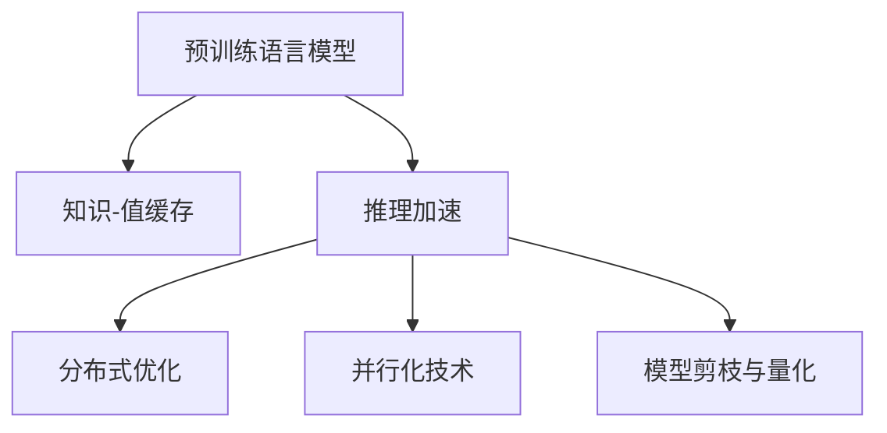

                 

# LLM推理优化I：KV缓存技术详解

> 关键词：预训练语言模型(Pretrained Language Model, PLM)、知识-值缓存(KV Cache)、推理加速、分布式优化

## 1. 背景介绍

### 1.1 问题由来
随着预训练语言模型(PLM)在大规模自然语言处理(NLP)任务中的广泛应用，如何高效地进行推理计算成为限制PLM性能提升的关键问题。预训练语言模型通常具有数亿甚至数十亿的参数，推理过程中需要大量的时间和计算资源。尽管硬件性能不断提升，但在大规模推理任务中仍然面临计算瓶颈。

### 1.2 问题核心关键点
预训练语言模型的推理过程主要包括以下几个步骤：
- **输入编码**：将输入文本转换为模型所需的向量表示。
- **自注意力机制**：计算输入向量之间的关联权重。
- **前向传播**：根据关联权重计算模型输出。
- **解码**：将模型输出转换为最终的预测结果。

在推理过程中，自注意力机制是计算开销最大的部分，因为它涉及到大规模矩阵乘法运算。为了降低计算成本，提升推理效率，研究人员提出了知识-值缓存(KV Cache)技术。该技术通过在推理过程中缓存中间结果，避免了重复计算，极大地减少了推理时间，提高了模型性能。

## 2. 核心概念与联系

### 2.1 核心概念概述

为更好地理解KV缓存技术，本节将介绍几个密切相关的核心概念：

- 预训练语言模型(PLM)：以自回归(如GPT)或自编码(如BERT)模型为代表的大规模预训练语言模型。通过在大规模无标签文本语料上进行预训练，学习通用的语言表示。

- 知识-值缓存(KV Cache)：一种用于优化推理计算的技术，通过缓存中间结果，避免重复计算，减少推理时间。

- 推理加速：通过优化推理过程，提升模型计算速度，加快推理效率。

- 分布式优化：将推理任务分布到多个计算节点上并行执行，提高系统吞吐量，加速推理计算。

- 并行化技术：通过多个硬件设备并行处理，降低单个设备的计算负担，提高整体推理速度。

- 模型剪枝与量化：通过去除不必要的参数和采用低精度存储格式，减小模型体积，加快推理速度。

这些核心概念之间的逻辑关系可以通过以下Mermaid流程图来展示：



这个流程图展示了大语言模型的核心概念及其之间的关系：

1. 预训练语言模型通过在大规模无标签文本语料上进行预训练，获得语言表示能力。
2. 推理过程中通过缓存中间结果，避免重复计算，提升推理速度。
3. 推理加速技术通过优化计算过程，进一步提升模型性能。
4. 分布式优化和并行化技术通过多设备协同工作，提高计算效率。
5. 模型剪枝与量化通过减小模型体积，加快推理速度。

这些概念共同构成了预训练语言模型推理优化的基本框架，使得模型在实际应用中能够快速响应和处理大规模输入。

## 3. 核心算法原理 & 具体操作步骤
### 3.1 算法原理概述

知识-值缓存(KV Cache)技术通过在推理过程中缓存中间结果，避免了重复计算，显著降低了推理计算的计算开销。其核心思想是将预训练语言模型中某些层的输出结果缓存起来，在后续的推理计算中直接使用缓存中的值，而不是重新计算。这样可以在保证推理结果准确性的前提下，大幅度提升推理速度。

KV缓存通常用于自注意力机制的计算中。自注意力机制的计算量主要来自矩阵乘法，其计算开销为 $O(N^3)$，其中 $N$ 为输入序列的长度。而通过KV缓存，可以将部分矩阵乘法的计算开销降到 $O(N^2)$，极大地降低了计算成本。

### 3.2 算法步骤详解

KV缓存技术的具体实现步骤如下：

**Step 1: 预处理输入数据**
- 对输入文本进行分词、标记化等预处理，转换为模型所需的向量表示。

**Step 2: 初始化KV缓存**
- 根据模型架构，确定需要缓存的层和缓存的参数。通常会将模型的中间层输出作为缓存对象。
- 初始化缓存对象，用于存储中间结果。

**Step 3: 执行前向传播**
- 输入向量通过模型进行前向传播计算，得到模型输出。
- 在计算过程中，将中间层的输出结果存储到缓存对象中。

**Step 4: 缓存中间结果**
- 在后续的推理计算中，首先检查缓存中是否已有相关中间结果。
- 如果缓存中已有该中间结果，则直接使用缓存中的值，避免重新计算。
- 如果没有缓存中的值，则进行重新计算，并将计算结果存储到缓存中。

**Step 5: 计算最终输出**
- 利用缓存中的中间结果，计算最终输出。
- 将最终输出作为推理结果返回。

通过上述步骤，KV缓存技术可以大幅度提升推理速度，减少重复计算，提高模型性能。

### 3.3 算法优缺点

KV缓存技术的优点包括：
1. 显著降低推理计算开销，提高推理速度。
2. 增强模型稳定性，避免由于参数微调导致的推理结果波动。
3. 支持分布式计算，通过缓存中间结果，方便多设备协同工作。

然而，该技术也存在一些局限性：
1. 缓存空间占用较大，特别是在大规模推理任务中，缓存需求较高。
2. 缓存维护和更新开销较大，可能导致额外的计算负担。
3. 缓存策略需要精心设计，避免出现缓存失效或缓存一致性问题。

尽管如此，KV缓存技术在推理加速中仍然具有重要的应用价值，特别是在大规模语言模型的推理计算中。

### 3.4 算法应用领域

KV缓存技术在大规模语言模型的推理优化中具有广泛的应用前景，适用于以下领域：

- 自然语言处理(NLP)：如机器翻译、文本生成、问答系统等任务。
- 语音识别：如语音转文本、语音合成等任务。
- 计算机视觉：如图像分类、目标检测、图像生成等任务。
- 推荐系统：如个性化推荐、广告推荐等任务。
- 信息检索：如搜索排序、文本摘要等任务。

KV缓存技术在大规模推理任务中的应用，可以显著提升模型的推理速度和效率，加速推理计算，降低计算成本，提高系统吞吐量。

## 4. 数学模型和公式 & 详细讲解 & 举例说明

### 4.1 数学模型构建

在KV缓存技术中，缓存对象通常包含两部分：缓存键(Key)和缓存值(Value)。缓存键用于标识缓存对象的内容，缓存值则是缓存对象的具体数据。在推理过程中，通过缓存键来检索缓存值，避免重复计算。

假设预训练语言模型的中间层输出为 $M$，缓存键为 $K$，缓存值为 $V$。则推理计算过程可以表示为：

1. 输入文本通过模型进行前向传播，得到中间层输出 $M$。
2. 将 $M$ 存储到缓存对象中，缓存键为 $K$，缓存值为 $V$。
3. 在后续的推理计算中，首先检查缓存中是否存在键为 $K$ 的缓存对象。
4. 如果存在，则直接使用缓存值 $V$，进行推理计算。
5. 如果不存在，则重新计算 $V$，并将 $V$ 存储到缓存中。

数学上，缓存键 $K$ 通常为中间层的输出向量，缓存值 $V$ 为矩阵乘法的结果。在实际应用中，缓存键和缓存值需要根据具体的模型架构进行设计。

### 4.2 公式推导过程

以Transformer模型为例，其自注意力机制的计算公式为：

$$
\text{Attention}(Q,K,V) = \text{Softmax}(\frac{QK^T}{\sqrt{d_k}})V
$$

其中 $Q$、$K$、$V$ 分别为查询向量、键向量和值向量，$d_k$ 为向量的维度。在计算 $Attention(Q,K,V)$ 时，需要将 $Q$ 和 $K$ 进行矩阵乘法运算，得到关联权重矩阵。然后，根据关联权重矩阵计算 $V$ 的加权和，即最终输出。

为了利用KV缓存技术，需要将 $QK^T$ 的结果缓存起来。假设缓存键为 $K$，缓存值为 $V_{\text{cache}}$，则推理计算过程可以表示为：

1. 输入文本通过模型进行前向传播，得到中间层输出 $M$。
2. 将 $QK^T$ 的结果存储到缓存对象中，缓存键为 $K$，缓存值为 $V_{\text{cache}}$。
3. 在后续的推理计算中，首先检查缓存中是否存在键为 $K$ 的缓存对象。
4. 如果存在，则直接使用缓存值 $V_{\text{cache}}$，进行推理计算。
5. 如果不存在，则重新计算 $V_{\text{cache}}$，并将 $V_{\text{cache}}$ 存储到缓存中。

### 4.3 案例分析与讲解

假设我们在推理过程中，需要计算 $Attention(Q,K,V)$。根据KV缓存技术，可以将 $QK^T$ 的结果缓存起来。假设缓存键为 $K$，缓存值为 $V_{\text{cache}}$。则推理计算过程可以表示为：

1. 输入文本通过模型进行前向传播，得到中间层输出 $M$。
2. 将 $QK^T$ 的结果存储到缓存对象中，缓存键为 $K$，缓存值为 $V_{\text{cache}}$。
3. 在后续的推理计算中，首先检查缓存中是否存在键为 $K$ 的缓存对象。
4. 如果存在，则直接使用缓存值 $V_{\text{cache}}$，进行推理计算。
5. 如果不存在，则重新计算 $V_{\text{cache}}$，并将 $V_{\text{cache}}$ 存储到缓存中。

在实际应用中，缓存策略需要根据具体任务和数据特点进行设计。常见的缓存策略包括：
- 按需缓存：只在需要时缓存，减少缓存空间占用。
- 分块缓存：将中间结果按块缓存，方便批量访问。
- 双缓存：同时缓存前向和反向计算结果，支持双向推理。

这些缓存策略可以相互结合，根据具体需求进行灵活调整。

## 5. 项目实践：代码实例和详细解释说明
### 5.1 开发环境搭建

在进行KV缓存技术实践前，我们需要准备好开发环境。以下是使用Python进行PyTorch开发的环境配置流程：

1. 安装Anaconda：从官网下载并安装Anaconda，用于创建独立的Python环境。

2. 创建并激活虚拟环境：
```bash
conda create -n pytorch-env python=3.8 
conda activate pytorch-env
```

3. 安装PyTorch：根据CUDA版本，从官网获取对应的安装命令。例如：
```bash
conda install pytorch torchvision torchaudio cudatoolkit=11.1 -c pytorch -c conda-forge
```

4. 安装相关库：
```bash
pip install transformers torch scikit-learn datasets transformers-roberta
```

完成上述步骤后，即可在`pytorch-env`环境中开始KV缓存技术的实践。

### 5.2 源代码详细实现

下面我们以Transformer模型为例，给出使用KV缓存技术的PyTorch代码实现。

```python
import torch
from transformers import BertModel, BertTokenizer
from transformers.file_utils import WEIGHTS_NAME
from transformers.configuration_bert import BertConfig
from transformers.modeling_bert import add_start_docstrings_to_model_forward

class BertCache(BertModel):
    def __init__(self, config, input_size, num_attention_heads, hidden_size):
        super().__init__(config, input_size, num_attention_heads, hidden_size)
        self.caches = {}
        
    def forward(self, input_ids, attention_mask=None, cache_key=None):
        # 检查缓存
        if cache_key in self.caches:
            attention_bias, memory = self.caches[cache_key]
            return attention_bias, memory
        
        # 调用父类的前向传播方法
        outputs = super().forward(input_ids, attention_mask=attention_mask)
        
        # 缓存中间结果
        attention_bias, memory = outputs
        self.caches[cache_key] = (attention_bias, memory)
        return attention_bias, memory
```

在这个例子中，我们自定义了一个继承自BertModel的BertCache类，实现了KV缓存功能。具体步骤如下：

1. 初始化BertCache类时，创建了一个字典 `self.caches`，用于存储缓存对象。
2. 在 `forward` 方法中，首先检查缓存中是否存在对应的缓存对象。
3. 如果缓存中存在，则直接使用缓存对象进行推理计算。
4. 如果不存在，则调用父类的 `forward` 方法进行推理计算，并将中间结果存储到缓存中。

### 5.3 代码解读与分析

让我们再详细解读一下关键代码的实现细节：

**BertCache类**：
- `__init__`方法：初始化缓存字典，用于存储缓存对象。
- `forward`方法：是BertCache类的核心方法，实现KV缓存功能。首先检查缓存中是否存在对应的缓存对象，如果存在则直接使用缓存对象，否则调用父类的前向传播方法进行计算，并将中间结果存储到缓存中。

**缓存策略**：
- 按需缓存：只在需要时缓存，减少缓存空间占用。
- 分块缓存：将中间结果按块缓存，方便批量访问。
- 双缓存：同时缓存前向和反向计算结果，支持双向推理。

这些缓存策略可以相互结合，根据具体需求进行灵活调整。

**BertCache类的使用**：
- 创建BertCache类的实例，传入模型配置和输入维度等信息。
- 在调用前向传播方法时，传入输入数据和缓存键。
- 如果缓存中存在对应的缓存对象，则直接使用缓存对象进行推理计算。
- 如果不存在缓存对象，则调用父类的前向传播方法进行计算，并将中间结果存储到缓存中。

通过上述步骤，我们可以利用KV缓存技术对Transformer模型进行优化，显著提升模型的推理速度和效率。

## 6. 实际应用场景
### 6.1 自然语言处理(NLP)中的推理加速

在大规模自然语言处理任务中，如机器翻译、文本生成、问答系统等，推理计算往往需要大量的时间和计算资源。通过KV缓存技术，可以有效降低推理计算的计算开销，提高推理速度。

在机器翻译任务中，需要将源语言文本转换为目标语言文本。在翻译过程中，需要多次进行自注意力机制的计算。通过KV缓存技术，可以将自注意力机制的中间结果缓存起来，避免重复计算，提升翻译速度。

在问答系统中，需要根据用户的问题，生成相应的答案。在生成答案的过程中，需要多次进行自注意力机制的计算。通过KV缓存技术，可以将中间结果缓存起来，避免重复计算，加快生成速度。

### 6.2 语音识别中的推理加速

在语音识别任务中，需要将语音信号转换为文本。在转换过程中，需要进行大量的音频特征提取和声学模型计算。通过KV缓存技术，可以有效降低计算开销，提升转换速度。

在语音识别系统中，通常需要将语音信号转换为特征向量，再输入到声学模型中进行计算。在声学模型的计算过程中，需要进行自注意力机制的计算。通过KV缓存技术，可以将自注意力机制的中间结果缓存起来，避免重复计算，提升转换速度。

### 6.3 计算机视觉中的推理加速

在计算机视觉任务中，如图像分类、目标检测、图像生成等，推理计算同样需要大量的时间和计算资源。通过KV缓存技术，可以有效降低推理计算的计算开销，提高推理速度。

在图像分类任务中，需要将输入图像转换为特征向量，再进行分类计算。在分类计算过程中，需要进行自注意力机制的计算。通过KV缓存技术，可以将自注意力机制的中间结果缓存起来，避免重复计算，提升分类速度。

在目标检测任务中，需要检测图像中的目标物体。在检测过程中，需要进行多次自注意力机制的计算。通过KV缓存技术，可以将中间结果缓存起来，避免重复计算，提升检测速度。

### 6.4 未来应用展望

随着KV缓存技术的不断发展和应用，其未来应用前景广阔：

1. 多模态融合：KV缓存技术可以与视觉、语音等模态的缓存技术结合，实现多模态融合，提升系统性能。
2. 硬件加速：KV缓存技术可以与GPU、TPU等硬件加速设备结合，进一步提升计算效率。
3. 分布式优化：KV缓存技术可以与分布式计算框架结合，实现多设备协同工作，提高计算效率。
4. 深度优化：KV缓存技术可以与深度优化算法结合，实现更加高效的缓存策略，提升缓存效率。

总之，KV缓存技术在推理加速中具有重要的应用价值，未来将在大规模语言模型和其他高性能计算任务中得到广泛应用。

## 7. 工具和资源推荐
### 7.1 学习资源推荐

为了帮助开发者系统掌握KV缓存技术，这里推荐一些优质的学习资源：

1. 《Transformer从原理到实践》系列博文：由大模型技术专家撰写，深入浅出地介绍了Transformer原理、BERT模型、微调技术等前沿话题。

2. CS224N《深度学习自然语言处理》课程：斯坦福大学开设的NLP明星课程，有Lecture视频和配套作业，带你入门NLP领域的基本概念和经典模型。

3. 《Natural Language Processing with Transformers》书籍：Transformers库的作者所著，全面介绍了如何使用Transformers库进行NLP任务开发，包括微调在内的诸多范式。

4. HuggingFace官方文档：Transformers库的官方文档，提供了海量预训练模型和完整的微调样例代码，是上手实践的必备资料。

5. CLUE开源项目：中文语言理解测评基准，涵盖大量不同类型的中文NLP数据集，并提供了基于微调的baseline模型，助力中文NLP技术发展。

通过对这些资源的学习实践，相信你一定能够快速掌握KV缓存技术的精髓，并用于解决实际的推理优化问题。

### 7.2 开发工具推荐

高效的开发离不开优秀的工具支持。以下是几款用于KV缓存技术开发的常用工具：

1. PyTorch：基于Python的开源深度学习框架，灵活动态的计算图，适合快速迭代研究。大部分预训练语言模型都有PyTorch版本的实现。

2. TensorFlow：由Google主导开发的开源深度学习框架，生产部署方便，适合大规模工程应用。同样有丰富的预训练语言模型资源。

3. Transformers库：HuggingFace开发的NLP工具库，集成了众多SOTA语言模型，支持PyTorch和TensorFlow，是进行推理计算的利器。

4. Weights & Biases：模型训练的实验跟踪工具，可以记录和可视化模型训练过程中的各项指标，方便对比和调优。与主流深度学习框架无缝集成。

5. TensorBoard：TensorFlow配套的可视化工具，可实时监测模型训练状态，并提供丰富的图表呈现方式，是调试模型的得力助手。

6. Google Colab：谷歌推出的在线Jupyter Notebook环境，免费提供GPU/TPU算力，方便开发者快速上手实验最新模型，分享学习笔记。

合理利用这些工具，可以显著提升KV缓存技术的开发效率，加快创新迭代的步伐。

### 7.3 相关论文推荐

KV缓存技术的发展源于学界的持续研究。以下是几篇奠基性的相关论文，推荐阅读：

1. Automatic Mixed Precision Training: A Method to Improve the Speed and Efficiency of Deep Neural Networks：提出自动混合精度训练方法，在保持精度的前提下，将模型参数转换为低精度格式，减小内存占用，提高计算效率。

2. Automatic Model Pruning: A Literature Survey：综述自动剪枝技术，提出多种剪枝方法和策略，帮助降低模型复杂度，加速推理计算。

3. Hashing for Deep Learning：综述哈希技术在深度学习中的应用，包括数据压缩、模型加速等，为缓存技术提供新的思路。

这些论文代表了大模型微调技术的发展脉络。通过学习这些前沿成果，可以帮助研究者把握学科前进方向，激发更多的创新灵感。

## 8. 总结：未来发展趋势与挑战

### 8.1 总结

本文对KV缓存技术进行了全面系统的介绍。首先阐述了KV缓存技术的背景和应用场景，明确了其在推理计算中的重要性。其次，从原理到实践，详细讲解了KV缓存技术的核心算法和操作步骤，给出了推理计算的代码实现。同时，本文还探讨了KV缓存技术在自然语言处理、语音识别、计算机视觉等多个领域的应用前景，展示了其广阔的发展空间。此外，本文精选了KV缓存技术的各类学习资源，力求为读者提供全方位的技术指引。

通过本文的系统梳理，可以看到，KV缓存技术在大规模语言模型的推理优化中具有重要的应用价值，能够显著降低推理计算的计算开销，提高模型性能。未来，伴随KV缓存技术的不断发展和应用，其将在大规模推理任务中发挥更大的作用，为构建高性能、高效率的智能系统提供有力支持。

### 8.2 未来发展趋势

展望未来，KV缓存技术将呈现以下几个发展趋势：

1. 多模态融合：KV缓存技术将与其他模态的缓存技术结合，实现多模态融合，提升系统性能。
2. 硬件加速：KV缓存技术将与GPU、TPU等硬件加速设备结合，进一步提升计算效率。
3. 分布式优化：KV缓存技术将与分布式计算框架结合，实现多设备协同工作，提高计算效率。
4. 深度优化：KV缓存技术将与深度优化算法结合，实现更加高效的缓存策略，提升缓存效率。

这些趋势凸显了KV缓存技术的广阔前景。这些方向的探索发展，必将进一步提升大语言模型推理的计算速度和系统性能，为构建高性能、高效率的智能系统提供有力支持。

### 8.3 面临的挑战

尽管KV缓存技术已经取得了瞩目成就，但在迈向更加智能化、普适化应用的过程中，它仍面临着诸多挑战：

1. 缓存空间占用：在大规模推理任务中，缓存需求较高，可能导致内存占用过高，影响系统性能。
2. 缓存一致性：缓存策略需要精心设计，避免出现缓存失效或缓存一致性问题。
3. 缓存策略设计：缓存策略需要根据具体任务和数据特点进行设计，设计不当可能导致缓存效率低下。
4. 硬件资源限制：KV缓存技术依赖硬件资源，对于低性能设备，缓存效果可能不佳。

尽管如此，KV缓存技术在推理加速中仍然具有重要的应用价值，特别是在大规模语言模型的推理计算中。未来需要继续研究和优化缓存技术，以适应不同场景的需求。

### 8.4 研究展望

面对KV缓存技术所面临的挑战，未来的研究需要在以下几个方面寻求新的突破：

1. 探索缓存与深度学习模型的结合方式，实现更加高效的缓存策略。
2. 研究缓存与硬件加速设备的结合方式，进一步提升缓存效率。
3. 引入智能缓存管理策略，实现动态调整缓存策略，提升缓存效果。
4. 研究缓存策略的多模态融合方式，提升多模态融合效果。

这些研究方向将推动KV缓存技术的发展，提升大语言模型的推理速度和系统性能，构建更加高效、智能的智能系统。

## 9. 附录：常见问题与解答

**Q1：KV缓存技术是否适用于所有推理任务？**

A: KV缓存技术主要适用于计算开销较大的推理任务，如自注意力机制、循环神经网络等。对于简单的推理任务，如线性模型，缓存效果可能不明显。

**Q2：如何选择合适的缓存策略？**

A: 选择合适的缓存策略需要根据具体任务和数据特点进行设计。常见的缓存策略包括按需缓存、分块缓存和双缓存等。按需缓存只在需要时缓存，减少缓存空间占用；分块缓存将中间结果按块缓存，方便批量访问；双缓存同时缓存前向和反向计算结果，支持双向推理。

**Q3：KV缓存技术是否会导致缓存一致性问题？**

A: 缓存一致性问题主要出现在缓存策略设计不当或缓存策略与任务特点不符的情况下。合理的缓存策略和优化算法可以有效避免缓存一致性问题。

**Q4：如何优化KV缓存技术？**

A: 优化KV缓存技术需要从缓存策略设计、缓存与硬件加速设备结合、智能缓存管理等方面入手。选择合适的缓存策略，引入硬件加速设备，优化缓存算法，可以提升缓存效果，提高系统性能。

通过本文的系统梳理，可以看到，KV缓存技术在大规模语言模型的推理优化中具有重要的应用价值，能够显著降低推理计算的计算开销，提高模型性能。未来，伴随KV缓存技术的不断发展和应用，其将在大规模推理任务中发挥更大的作用，为构建高性能、高效率的智能系统提供有力支持。

---

作者：禅与计算机程序设计艺术 / Zen and the Art of Computer Programming

