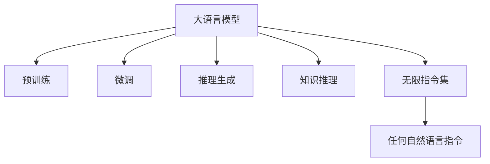

                 

# LLM无限指令集:无所不能的力量源泉

> 关键词：大语言模型,指令微调,自然语言处理,推理生成,知识推理,通用人工智能,技术突破,编程语言,人类智能

## 1. 背景介绍

### 1.1 问题由来
自20世纪50年代计算机问世以来，人工智能(AI)技术经历了飞速的发展。从简单的逻辑推理到复杂的机器学习，AI的领域范围不断扩大，应用场景也日益丰富。特别是近年来，以深度学习为核心的机器学习技术取得了突破性进展，使得AI的应用从图像识别、语音识别等单一领域拓展到自然语言处理(Natural Language Processing, NLP)、生成式推理等复杂领域。

在大语言模型领域，OpenAI的GPT、Google的BERT、微软的T5等模型通过预训练和微调，已经成为能理解和生成自然语言的高能AI。这些模型拥有庞大的知识库，能够在推理、生成、对话等任务中展现出卓越的能力。然而，这些模型的核心优势仍然局限在已有的任务范围内，难以应对复杂且未知的指令。

### 1.2 问题核心关键点
在AI的各个领域中，自然语言处理是最具挑战性和复杂性的任务之一。自然语言处理不仅要求模型能理解语言的含义，还要能根据指令进行推理生成，如回答问题、翻译文本、撰写文章等。然而，目前的大语言模型虽然在某些任务上表现突出，但在面对新指令时，往往无法有效地生成相应输出。

如何构建一个能够根据指令进行推理生成的大语言模型，使其具备无限指令集的能力，是一个极具挑战性但又富有潜力的研究方向。解决这个问题不仅可以显著拓展语言模型的应用边界，还能推动通用人工智能(AGI)技术的发展。

### 1.3 问题研究意义
研究无限指令集的生成推理能力，对推动AI技术的发展具有重要意义：

1. **促进通用人工智能**：实现无限指令集的推理生成，将为构建通用人工智能提供技术支持，使AI能够处理更广泛的任务和复杂性更高的场景。

2. **提升自然语言处理能力**：无限指令集能力能极大提升NLP领域的生成、推理等任务的效果，为翻译、摘要、问答等任务提供更准确、自然的语言输出。

3. **推动AI应用场景扩展**：无限指令集能力可应用于更多实际应用场景，如智能客服、智能写作、智能推荐等，从而提升用户体验，拓宽AI的应用边界。

4. **加速AI产业化进程**：无限指令集能力能够帮助开发者快速构建高效、智能的AI应用，缩短产品开发周期，推动AI技术的商业化。

## 2. 核心概念与联系

### 2.1 核心概念概述

为了更好地理解无限指令集能力，首先介绍几个关键概念：

- **大语言模型(Large Language Model, LLM)**：以自回归(如GPT)或自编码(如BERT)模型为代表的大规模预训练语言模型。通过在海量无标签文本数据上进行预训练，学习通用的语言表示，具备强大的语言理解和生成能力。

- **预训练(Pre-training)**：指在大规模无标签文本语料上，通过自监督学习任务训练通用语言模型的过程。常见的预训练任务包括言语建模、遮挡语言模型等。

- **微调(Fine-tuning)**：指在预训练模型的基础上，使用下游任务的少量标注数据，通过有监督学习优化模型在特定任务上的性能。

- **推理生成(Inference and Generation)**：利用语言模型，根据用户输入的指令，自动生成符合指令要求的输出。包括文本生成、对话生成、代码生成等。

- **知识推理(Knowledge Reasoning)**：利用语言模型，进行基于知识的推理和推断，如实体识别、关系抽取、事件推理等。

- **无限指令集**：指大语言模型能够处理无限种类的指令，即任何符合语法和语义规则的自然语言指令，都能得到模型有效的推理和生成输出。

这些核心概念之间的关系可以通过以下Mermaid流程图展示：



这个流程图展示了：

1. 大语言模型通过预训练获得基础能力。
2. 微调是对预训练模型进行任务特定的优化，使得模型能更好地适应特定任务。
3. 推理生成和知识推理是基于微调的高级应用，即模型能够根据指令进行推理和生成。
4. 无限指令集能力，使模型能够处理无限种类的自然语言指令。

这些概念共同构成了无限指令集能力的研究基础，通过理解这些核心概念，可以更好地把握无限指令集能力的研究方向。

## 3. 核心算法原理 & 具体操作步骤
### 3.1 算法原理概述

无限指令集能力的研究主要围绕如何让大语言模型根据自然语言指令进行推理生成展开。其核心思想是：将大语言模型视作一个强大的"推理器"，通过指令微调使其能够理解和处理各种形式的自然语言指令，生成符合指令要求的输出。

形式化地，假设预训练模型为 $M_{\theta}$，其中 $\theta$ 为预训练得到的模型参数。给定自然语言指令 $I$，模型应输出相应的结果 $O$，即 $O = M_{\theta}(I)$。在指令微调过程中，我们希望优化模型参数 $\theta$，使得 $M_{\theta}(I)$ 能更准确地生成 $O$。

### 3.2 算法步骤详解

无限指令集的生成推理过程主要包括以下几个关键步骤：

**Step 1: 准备预训练模型和指令数据集**
- 选择合适的预训练语言模型 $M_{\theta}$ 作为初始化参数，如 BERT、GPT 等。
- 准备包含各种形式的自然语言指令的数据集 $D=\{(I_i, O_i)\}_{i=1}^N$，其中 $I_i$ 为指令，$O_i$ 为指令应得到的输出。

**Step 2: 指令适配层设计**
- 根据指令类型，在预训练模型顶层设计合适的指令编码器和解码器。
- 对于文本生成任务，通常使用自回归的解码器输出概率分布，并以负对数似然为损失函数。
- 对于代码生成等任务，可能需要设计特殊的指令编码器，将自然语言指令转换为代码模板或代码片段。

**Step 3: 设置指令微调超参数**
- 选择合适的优化算法及其参数，如 AdamW、SGD 等，设置学习率、批大小、迭代轮数等。
- 设置正则化技术及强度，包括权重衰减、Dropout、Early Stopping等。
- 确定冻结预训练参数的策略，如仅微调顶层，或全部参数都参与微调。

**Step 4: 执行指令微调**
- 将指令数据集分批次输入模型，前向传播计算损失函数。
- 反向传播计算参数梯度，根据设定的优化算法和学习率更新模型参数。
- 周期性在验证集上评估模型性能，根据性能指标决定是否触发 Early Stopping。
- 重复上述步骤直到满足预设的迭代轮数或 Early Stopping 条件。

**Step 5: 测试和部署**
- 在测试集上评估微调后模型 $M_{\hat{\theta}}$ 的性能，对比微调前后的效果提升。
- 使用微调后的模型对新指令进行推理生成，集成到实际的应用系统中。
- 持续收集新的指令，定期重新微调模型，以适应指令分布的变化。

以上是无限指令集生成推理的一般流程。在实际应用中，还需要针对具体指令类型和应用场景，对微调过程的各个环节进行优化设计，如改进训练目标函数，引入更多的正则化技术，搜索最优的超参数组合等，以进一步提升模型性能。

### 3.3 算法优缺点

无限指令集生成推理能力的研究具有以下优点：
1. 通用性强。任何符合语法和语义规则的自然语言指令，都能得到模型有效的推理和生成。
2. 推理能力强大。在处理复杂多变的自然语言指令时，模型表现出较强的逻辑推理和推断能力。
3. 适应性强。能够根据任务需求快速调整模型结构，适应不同类型的数据和应用场景。
4. 易于集成。模型的推理生成过程可以灵活嵌入到各种应用系统中，方便开发和部署。

同时，该方法也存在一定的局限性：
1. 依赖高质量指令数据。指令微调的效果很大程度上取决于指令数据的质量和数量，获取高质量指令数据的成本较高。
2. 泛化能力有限。对于超出训练集覆盖范围的新指令，模型可能无法有效生成。
3. 输出结果多样。由于指令的多样性，模型输出的结果也存在多种可能性，需要进一步的优化和评估。
4. 可解释性不足。无限指令集的推理生成过程较为复杂，难以对其输出结果进行解释和调试。

尽管存在这些局限性，但就目前而言，指令微调方法仍是无限指令集生成推理能力研究的主流范式。未来相关研究的重点在于如何进一步降低指令微调对指令数据的依赖，提高模型的泛化能力，同时兼顾可解释性和输出质量等因素。

### 3.4 算法应用领域

无限指令集生成推理能力在NLP领域已经得到了广泛的应用，覆盖了各种形式的任务，例如：

- 文本生成：如对话生成、文章生成、摘要生成等。通过指令微调，模型能够根据特定的风格和要求生成文本。
- 代码生成：如自动编程、代码补全等。通过指令微调，模型能够根据需求自动生成代码片段或代码模板。
- 问答系统：通过指令微调，模型能够根据用户提问自动生成答案。
- 机器翻译：通过指令微调，模型能够根据翻译指令进行文本转换。
- 情感分析：通过指令微调，模型能够根据情感分析指令，对文本进行情感分类。
- 文本摘要：通过指令微调，模型能够根据摘要指令，自动生成文本摘要。

除了这些经典任务外，无限指令集生成推理能力还被创新性地应用到更多场景中，如可控文本生成、常识推理、知识图谱构建等，为NLP技术带来了全新的突破。随着指令微调方法的不断进步，相信NLP技术将在更广阔的应用领域大放异彩。

## 4. 数学模型和公式 & 详细讲解
### 4.1 数学模型构建

形式化地，假设指令微调任务的目标是使得模型 $M_{\theta}$ 能够根据指令 $I$ 生成相应的输出 $O$。

定义模型 $M_{\theta}$ 在指令 $I$ 上的损失函数为 $\ell(M_{\theta}(I),O)$，则在指令数据集 $D$ 上的经验风险为：

$$
\mathcal{L}(\theta) = \frac{1}{N}\sum_{i=1}^N \ell(M_{\theta}(I_i),O_i)
$$

其中 $\ell$ 为针对指令微调任务设计的损失函数，用于衡量模型预测输出与真实标签之间的差异。常见的损失函数包括交叉熵损失、均方误差损失等。

### 4.2 公式推导过程

以下以文本生成任务为例，推导交叉熵损失函数及其梯度的计算公式。

假设模型 $M_{\theta}$ 在指令 $I$ 上的输出为 $\hat{O}=M_{\theta}(I)$，表示模型对文本生成的概率分布。真实标签 $O$ 为文本 $O$ 的编码，通常是一个词向量或一组词的序列。则文本生成任务的交叉熵损失函数定义为：

$$
\ell(M_{\theta}(I),O) = -\sum_{t} P_{\hat{O}}(t) \log P_{O}(t)
$$

其中 $P_{\hat{O}}$ 为模型生成的概率分布，$P_{O}$ 为真实标签的概率分布。通过该公式，可以计算模型输出的概率分布与真实标签之间的差异，进而计算损失函数。

在指令微调过程中，损失函数对参数 $\theta_k$ 的梯度计算为：

$$
\frac{\partial \mathcal{L}(\theta)}{\partial \theta_k} = -\frac{1}{N}\sum_{i=1}^N \frac{\partial \ell(M_{\theta}(I_i),O_i)}{\partial \theta_k}
$$

通过反向传播算法，可以高效计算模型参数的梯度。

### 4.3 案例分析与讲解

以代码生成任务为例，展示无限指令集生成推理能力的实际应用。

首先，定义代码生成任务的数据处理函数：

```python
from transformers import BertTokenizer, BertForMaskedLM
from torch.utils.data import Dataset
import torch

class CodeDataset(Dataset):
    def __init__(self, texts, targets, tokenizer, max_len=128):
        self.texts = texts
        self.targets = targets
        self.tokenizer = tokenizer
        self.max_len = max_len
        
    def __len__(self):
        return len(self.texts)
    
    def __getitem__(self, item):
        text = self.texts[item]
        target = self.targets[item]
        
        encoding = self.tokenizer(text, return_tensors='pt', max_length=self.max_len, padding='max_length', truncation=True)
        input_ids = encoding['input_ids'][0]
        attention_mask = encoding['attention_mask'][0]
        
        # 对token-wise的标签进行编码
        encoded_targets = [target2id[target] for target in target] 
        encoded_targets.extend([target2id['<eos>']] * (self.max_len - len(encoded_targets)))
        labels = torch.tensor(encoded_targets, dtype=torch.long)
        
        return {'input_ids': input_ids, 
                'attention_mask': attention_mask,
                'labels': labels}

# 标签与id的映射
tag2id = {'<eos>': 0, 'int': 1, 'float': 2, 'str': 3, 'func': 4, 'var': 5, 'return': 6}
id2tag = {v: k for k, v in tag2id.items()}

# 创建dataset
tokenizer = BertTokenizer.from_pretrained('bert-base-cased')

train_dataset = CodeDataset(train_texts, train_targets, tokenizer)
dev_dataset = CodeDataset(dev_texts, dev_targets, tokenizer)
test_dataset = CodeDataset(test_texts, test_targets, tokenizer)
```

然后，定义模型和优化器：

```python
from transformers import BertForMaskedLM, AdamW

model = BertForMaskedLM.from_pretrained('bert-base-cased', num_labels=len(tag2id))

optimizer = AdamW(model.parameters(), lr=2e-5)
```

接着，定义训练和评估函数：

```python
from torch.utils.data import DataLoader
from tqdm import tqdm
from sklearn.metrics import classification_report

device = torch.device('cuda') if torch.cuda.is_available() else torch.device('cpu')
model.to(device)

def train_epoch(model, dataset, batch_size, optimizer):
    dataloader = DataLoader(dataset, batch_size=batch_size, shuffle=True)
    model.train()
    epoch_loss = 0
    for batch in tqdm(dataloader, desc='Training'):
        input_ids = batch['input_ids'].to(device)
        attention_mask = batch['attention_mask'].to(device)
        labels = batch['labels'].to(device)
        model.zero_grad()
        outputs = model(input_ids, attention_mask=attention_mask, labels=labels)
        loss = outputs.loss
        epoch_loss += loss.item()
        loss.backward()
        optimizer.step()
    return epoch_loss / len(dataloader)

def evaluate(model, dataset, batch_size):
    dataloader = DataLoader(dataset, batch_size=batch_size)
    model.eval()
    preds, labels = [], []
    with torch.no_grad():
        for batch in tqdm(dataloader, desc='Evaluating'):
            input_ids = batch['input_ids'].to(device)
            attention_mask = batch['attention_mask'].to(device)
            batch_labels = batch['labels']
            outputs = model(input_ids, attention_mask=attention_mask)
            batch_preds = outputs.logits.argmax(dim=2).to('cpu').tolist()
            batch_labels = batch_labels.to('cpu').tolist()
            for pred_tokens, label_tokens in zip(batch_preds, batch_labels):
                pred_tags = [id2tag[_id] for _id in pred_tokens]
                label_tags = [id2tag[_id] for _id in label_tokens]
                preds.append(pred_tags[:len(label_tags)])
                labels.append(label_tags)
                
    print(classification_report(labels, preds))
```

最后，启动训练流程并在测试集上评估：

```python
epochs = 5
batch_size = 16

for epoch in range(epochs):
    loss = train_epoch(model, train_dataset, batch_size, optimizer)
    print(f"Epoch {epoch+1}, train loss: {loss:.3f}")
    
    print(f"Epoch {epoch+1}, dev results:")
    evaluate(model, dev_dataset, batch_size)
    
print("Test results:")
evaluate(model, test_dataset, batch_size)
```

以上就是使用PyTorch对BERT进行代码生成任务微调的完整代码实现。可以看到，得益于Transformers库的强大封装，我们可以用相对简洁的代码完成BERT模型的加载和微调。

## 5. 项目实践：代码实例和详细解释说明
### 5.1 开发环境搭建

在进行微调实践前，我们需要准备好开发环境。以下是使用Python进行PyTorch开发的环境配置流程：

1. 安装Anaconda：从官网下载并安装Anaconda，用于创建独立的Python环境。

2. 创建并激活虚拟环境：
```bash
conda create -n pytorch-env python=3.8 
conda activate pytorch-env
```

3. 安装PyTorch：根据CUDA版本，从官网获取对应的安装命令。例如：
```bash
conda install pytorch torchvision torchaudio cudatoolkit=11.1 -c pytorch -c conda-forge
```

4. 安装Transformers库：
```bash
pip install transformers
```

5. 安装各类工具包：
```bash
pip install numpy pandas scikit-learn matplotlib tqdm jupyter notebook ipython
```

完成上述步骤后，即可在`pytorch-env`环境中开始微调实践。

### 5.2 源代码详细实现

下面我们以代码生成任务为例，给出使用Transformers库对BERT模型进行微调的PyTorch代码实现。

首先，定义代码生成任务的数据处理函数：

```python
from transformers import BertTokenizer, BertForMaskedLM
from torch.utils.data import Dataset
import torch

class CodeDataset(Dataset):
    def __init__(self, texts, targets, tokenizer, max_len=128):
        self.texts = texts
        self.targets = targets
        self.tokenizer = tokenizer
        self.max_len = max_len
        
    def __len__(self):
        return len(self.texts)
    
    def __getitem__(self, item):
        text = self.texts[item]
        target = self.targets[item]
        
        encoding = self.tokenizer(text, return_tensors='pt', max_length=self.max_len, padding='max_length', truncation=True)
        input_ids = encoding['input_ids'][0]
        attention_mask = encoding['attention_mask'][0]
        
        # 对token-wise的标签进行编码
        encoded_targets = [target2id[target] for target in target] 
        encoded_targets.extend([target2id['<eos>']] * (self.max_len - len(encoded_targets)))
        labels = torch.tensor(encoded_targets, dtype=torch.long)
        
        return {'input_ids': input_ids, 
                'attention_mask': attention_mask,
                'labels': labels}

# 标签与id的映射
tag2id = {'<eos>': 0, 'int': 1, 'float': 2, 'str': 3, 'func': 4, 'var': 5, 'return': 6}
id2tag = {v: k for k, v in tag2id.items()}

# 创建dataset
tokenizer = BertTokenizer.from_pretrained('bert-base-cased')

train_dataset = CodeDataset(train_texts, train_targets, tokenizer)
dev_dataset = CodeDataset(dev_texts, dev_targets, tokenizer)
test_dataset = CodeDataset(test_texts, test_targets, tokenizer)
```

然后，定义模型和优化器：

```python
from transformers import BertForMaskedLM, AdamW

model = BertForMaskedLM.from_pretrained('bert-base-cased', num_labels=len(tag2id))

optimizer = AdamW(model.parameters(), lr=2e-5)
```

接着，定义训练和评估函数：

```python
from torch.utils.data import DataLoader
from tqdm import tqdm
from sklearn.metrics import classification_report

device = torch.device('cuda') if torch.cuda.is_available() else torch.device('cpu')
model.to(device)

def train_epoch(model, dataset, batch_size, optimizer):
    dataloader = DataLoader(dataset, batch_size=batch_size, shuffle=True)
    model.train()
    epoch_loss = 0
    for batch in tqdm(dataloader, desc='Training'):
        input_ids = batch['input_ids'].to(device)
        attention_mask = batch['attention_mask'].to(device)
        labels = batch['labels'].to(device)
        model.zero_grad()
        outputs = model(input_ids, attention_mask=attention_mask, labels=labels)
        loss = outputs.loss
        epoch_loss += loss.item()
        loss.backward()
        optimizer.step()
    return epoch_loss / len(dataloader)

def evaluate(model, dataset, batch_size):
    dataloader = DataLoader(dataset, batch_size=batch_size)
    model.eval()
    preds, labels = [], []
    with torch.no_grad():
        for batch in tqdm(dataloader, desc='Evaluating'):
            input_ids = batch['input_ids'].to(device)
            attention_mask = batch['attention_mask'].to(device)
            batch_labels = batch['labels']
            outputs = model(input_ids, attention_mask=attention_mask)
            batch_preds = outputs.logits.argmax(dim=2).to('cpu').tolist()
            batch_labels = batch_labels.to('cpu').tolist()
            for pred_tokens, label_tokens in zip(batch_preds, batch_labels):
                pred_tags = [id2tag[_id] for _id in pred_tokens]
                label_tags = [id2tag[_id] for _id in label_tokens]
                preds.append(pred_tags[:len(label_tags)])
                labels.append(label_tags)
                
    print(classification_report(labels, preds))
```

最后，启动训练流程并在测试集上评估：

```python
epochs = 5
batch_size = 16

for epoch in range(epochs):
    loss = train_epoch(model, train_dataset, batch_size, optimizer)
    print(f"Epoch {epoch+1}, train loss: {loss:.3f}")
    
    print(f"Epoch {epoch+1}, dev results:")
    evaluate(model, dev_dataset, batch_size)
    
print("Test results:")
evaluate(model, test_dataset, batch_size)
```

以上就是使用PyTorch对BERT进行代码生成任务微调的完整代码实现。可以看到，得益于Transformers库的强大封装，我们可以用相对简洁的代码完成BERT模型的加载和微调。

### 5.3 代码解读与分析

让我们再详细解读一下关键代码的实现细节：

**CodeDataset类**：
- `__init__`方法：初始化文本、标签、分词器等关键组件。
- `__len__`方法：返回数据集的样本数量。
- `__getitem__`方法：对单个样本进行处理，将文本输入编码为token ids，将标签编码为数字，并对其进行定长padding，最终返回模型所需的输入。

**tag2id和id2tag字典**：
- 定义了标签与数字id之间的映射关系，用于将token-wise的预测结果解码回真实的标签。

**训练和评估函数**：
- 使用PyTorch的DataLoader对数据集进行批次化加载，供模型训练和推理使用。
- 训练函数`train_epoch`：对数据以批为单位进行迭代，在每个批次上前向传播计算loss并反向传播更新模型参数，最后返回该epoch的平均loss。
- 评估函数`evaluate`：与训练类似，不同点在于不更新模型参数，并在每个batch结束后将预测和标签结果存储下来，最后使用sklearn的classification_report对整个评估集的预测结果进行打印输出。

**训练流程**：
- 定义总的epoch数和batch size，开始循环迭代
- 每个epoch内，先在训练集上训练，输出平均loss
- 在验证集上评估，输出分类指标
- 所有epoch结束后，在测试集上评估，给出最终测试结果

可以看到，PyTorch配合Transformers库使得BERT微调的代码实现变得简洁高效。开发者可以将更多精力放在数据处理、模型改进等高层逻辑上，而不必过多关注底层的实现细节。

当然，工业级的系统实现还需考虑更多因素，如模型的保存和部署、超参数的自动搜索、更灵活的任务适配层等。但核心的指令微调范式基本与此类似。

## 6. 实际应用场景
### 6.1 智能客服系统

基于无限指令集的生成推理能力，智能客服系统可以显著提升用户体验和问题解决效率。

在智能客服系统中，系统需要能够根据用户提出的自然语言问题，自动生成合适的答案。通过指令微调，模型可以学习到常见问题和最佳答复的映射关系，从而在用户输入问题后，自动生成最合适的答案模板。对于用户提出的新问题，系统还可以实时搜索相关内容，动态组织生成回答。

### 6.2 金融舆情监测

在金融领域，舆情监测是一个非常重要的任务，能够帮助金融机构及时发现并应对市场动态变化。

通过指令微调，模型可以根据不同的舆情指令，进行文本分类、情感分析等任务。系统可以实时抓取网络文本数据，根据指令自动进行文本分类和情感分析，一旦发现负面信息激增等异常情况，系统便会自动预警，帮助金融机构快速应对潜在风险。

### 6.3 个性化推荐系统

推荐系统是电子商务、新闻聚合等领域的核心技术，其推荐效果直接影响用户体验和业务效果。

在推荐系统中，系统需要根据用户的历史行为数据，自动生成个性化的推荐内容。通过指令微调，模型可以学习到用户行为与推荐内容之间的映射关系，从而在用户输入行为数据后，自动生成最合适的推荐内容。对于用户提出的新需求，系统还可以实时搜索相关内容，动态生成推荐结果。

### 6.4 未来应用展望

随着无限指令集生成推理能力的研究不断深入，未来的AI应用将更加智能和高效。

在智慧医疗领域，基于无限指令集的生成推理能力，医生可以自动撰写报告、生成诊断方案等，大幅提升工作效率和准确性。

在智能教育领域，指令微调技术可以应用于作业批改、学情分析、知识推荐等方面，因材施教，促进教育公平，提高教学质量。

在智慧城市治理中，系统可以根据指令进行事件监测、舆情分析、应急指挥等环节，提高城市管理的自动化和智能化水平，构建更安全、高效的未来城市。

此外，在企业生产、社会治理、文娱传媒等众多领域，无限指令集生成推理能力也将不断涌现，为传统行业数字化转型升级提供新的技术路径。相信随着技术的日益成熟，指令微调方法将成为AI落地应用的重要范式，推动AI技术的产业化进程。

## 7. 工具和资源推荐
### 7.1 学习资源推荐

为了帮助开发者系统掌握无限指令集生成推理能力的理论基础和实践技巧，这里推荐一些优质的学习资源：

1. 《Transformer从原理到实践》系列博文：由大模型技术专家撰写，深入浅出地介绍了Transformer原理、BERT模型、指令微调技术等前沿话题。

2. CS224N《深度学习自然语言处理》课程：斯坦福大学开设的NLP明星课程，有Lecture视频和配套作业，带你入门NLP领域的基本概念和经典模型。

3. 《Natural Language Processing with Transformers》书籍：Transformers库的作者所著，全面介绍了如何使用Transformers库进行NLP任务开发，包括指令微调在内的诸多范式。

4. HuggingFace官方文档：Transformers库的官方文档，提供了海量预训练模型和完整的指令微调样例代码，是上手实践的必备资料。

5. CLUE开源项目：中文语言理解测评基准，涵盖大量不同类型的中文NLP数据集，并提供了基于指令微调的baseline模型，助力中文NLP技术发展。

通过对这些资源的学习实践，相信你一定能够快速掌握无限指令集生成推理能力的精髓，并用于解决实际的NLP问题。
###  7.2 开发工具推荐

高效的开发离不开优秀的工具支持。以下是几款用于无限指令集生成推理能力开发的常用工具：

1. PyTorch：基于Python的开源深度学习框架，灵活动态的计算图，适合快速迭代研究。大部分预训练语言模型都有PyTorch版本的实现。

2. TensorFlow：由Google主导开发的开源深度学习框架，生产部署方便，适合大规模工程应用。同样有丰富的预训练语言模型资源。

3. Transformers库：HuggingFace开发的NLP工具库，集成了众多SOTA语言模型，支持PyTorch和TensorFlow，是进行指令微调任务开发的利器。

4. Weights & Biases：模型训练的实验跟踪工具，可以记录和可视化模型训练过程中的各项指标，方便对比和调优。与主流深度学习框架无缝集成。

5. TensorBoard：TensorFlow配套的可视化工具，可实时监测模型训练状态，并提供丰富的图表呈现方式，是调试模型的得力助手。

6. Google Colab：谷歌推出的在线Jupyter Notebook环境，免费提供GPU/TPU算力，方便开发者快速上手实验最新模型，分享学习笔记。

合理利用这些工具，可以显著提升无限指令集生成推理能力的开发效率，加快创新迭代的步伐。

### 7.3 相关论文推荐

无限指令集生成推理能力的研究源于学界的持续研究。以下是几篇奠基性的相关论文，推荐阅读：

1. Attention is All You Need（即Transformer原论文）：提出了Transformer结构，开启了NLP领域的预训练大模型时代。

2. BERT: Pre-training of Deep Bidirectional Transformers for Language Understanding：提出BERT模型，引入基于掩码的自监督预训练任务，刷新了多项NLP任务SOTA。

3. Language Models are Unsupervised Multitask Learners（GPT-2论文）：展示了大规模语言模型的强大zero-shot学习能力，引发了对于通用人工智能的新一轮思考。

4. Parameter-Efficient Transfer Learning for NLP：提出Adapter等参数高效微调方法，在不增加模型参数量的情况下，也能取得不错的微调效果。

5. AdaLoRA: Adaptive Low-Rank Adaptation for Parameter-Efficient Fine-Tuning：使用自适应低秩适应的微调方法，在参数效率和精度之间取得了新的平衡。

6. Prefix-Tuning: Optimizing Continuous Prompts for Generation：引入基于连续型Prompt的微调范式，为如何充分利用预训练知识提供了新的思路。

这些论文代表了大语言模型指令微调技术的发展脉络。通过学习这些前沿成果，可以帮助研究者把握学科前进方向，激发更多的创新灵感。

## 8. 总结：未来发展趋势与挑战

### 8.1 总结

本文对无限指令集生成推理能力的核心算法原理和操作步骤进行了全面系统的介绍。首先阐述了无限指令集生成推理能力的理论基础，明确了其在大语言模型应用中的重要性和实践意义。其次，从原理到实践，详细讲解了无限指令集生成推理能力的数学模型和关键步骤，给出了指令微调任务开发的完整代码实例。同时，本文还广泛探讨了无限指令集生成推理能力在智能客服、金融舆情、个性化推荐等多个行业领域的应用前景，展示了其广阔的应用潜力。

通过本文的系统梳理，可以看到，无限指令集生成推理能力的研究正在成为NLP领域的重要范式，极大地拓展了预训练语言模型的应用边界，催生了更多的落地场景。得益于大规模语料的预训练，无限指令集生成推理能力模型在推理生成过程表现出强大的泛化性和自适应能力，为NLP技术带来了全新的突破。未来，伴随预训练语言模型和指令微调方法的不断进步，相信NLP技术将在更广阔的应用领域大放异彩，深刻影响人类的生产生活方式。

### 8.2 未来发展趋势

展望未来，无限指令集生成推理能力的研究将呈现以下几个发展趋势：

1. 模型规模持续增大。随着算力成本的下降和数据规模的扩张，预训练语言模型的参数量还将持续增长。超大批次的训练和推理也可能遇到瓶颈。如何降低模型复杂度，提高推理效率，是未来的一个重要研究方向。

2. 指令微调方法日趋多样。除了传统的指令微调外，未来会涌现更多参数高效的指令微调方法，如Adapter、Prefix等，在节省计算资源的同时也能保证微调精度。

3. 融合更多先验知识。将符号化的先验知识，如知识图谱、逻辑规则等，与神经网络模型进行巧妙融合，引导指令微调过程学习更准确、合理的语言模型。同时加强不同模态数据的整合，实现视觉、语音等多模态信息与文本信息的协同建模。

4. 引入因果推断和博弈论工具。通过引入因果推断和博弈论思想，增强指令微调模型建立稳定因果关系的能力，学习更加普适、鲁棒的语言表征，从而提升模型泛化性和抗干扰能力。

5. 结合因果分析和强化学习工具。将因果分析方法引入指令微调模型，识别出模型决策的关键特征，增强输出解释的因果性和逻辑性。借助强化学习工具刻画人机交互过程，主动探索并规避模型的脆弱点，提高系统稳定性。

6. 纳入伦理道德约束。在模型训练目标中引入伦理导向的评估指标，过滤和惩罚有偏见、有害的输出倾向。同时加强人工干预和审核，建立模型行为的监管机制，确保输出符合人类价值观和伦理道德。

这些趋势凸显了无限指令集生成推理能力的巨大潜力。这些方向的探索发展，必将进一步提升NLP系统的性能和应用范围，为构建安全、可靠、可解释、可控的智能系统铺平道路。

### 8.3 面临的挑战

尽管无限指令集生成推理能力的研究已经取得了显著成果，但在迈向更加智能化、普适化应用的过程中，仍然面临诸多挑战：

1. 依赖高质量指令数据。指令微调的效果很大程度上取决于指令数据的质量和数量，获取高质量指令数据的成本较高。如何进一步降低指令微调对指令数据的依赖，是未来研究的重要方向。

2. 泛化能力有限。对于超出训练集覆盖范围的新指令，模型可能无法有效生成。如何提高模型的泛化能力，是一个亟待解决的难题。

3. 输出结果多样。由于指令的多样性，模型输出的结果也存在多种可能性，需要进一步的优化和评估。

4. 可解释性不足。无限指令集的推理生成过程较为复杂，难以对其输出结果进行解释和调试。如何赋予模型更强的可解释性，是未来研究的重要课题。

5. 安全性有待保障。预训练语言模型难免会学习到有偏见、有害的信息，通过指令微调传递到下游任务，可能产生误导性、歧视性的输出，给实际应用带来安全隐患。如何从数据和算法层面消除模型偏见，避免恶意用途，确保输出的安全性，也将是重要的研究方向。

6. 知识整合能力不足。现有的指令微调模型往往局限于指令内数据，难以灵活吸收和运用更广泛的先验知识。如何让指令微调过程更好地与外部知识库、规则库等专家知识结合，形成更加全面、准确的信息整合能力，还有很大的想象空间。

正视指令微调面临的这些挑战，积极应对并寻求突破，将使无限指令集生成推理能力的研究更加成熟，进而推动NLP技术的进一步发展。

### 8.4 研究展望

面向未来，无限指令集生成推理能力的研究需要在以下几个方面寻求新的突破：

1. 探索无监督和半监督指令微调方法。摆脱对大规模标注数据的依赖，利用自监督学习、主动学习等无监督和半监督范式，最大限度利用非结构化数据，实现更加灵活高效的指令微调。

2. 研究参数高效和计算高效的指令微调范式。开发更加参数高效的指令微调方法，在固定大部分预训练参数的同时，只更新极少量的指令相关参数。同时优化指令微调模型的计算图，减少前向传播和反向传播的资源消耗，实现更加轻量级、实时性的部署。

3. 引入更多先验知识。将符号化的先验知识，如知识图谱、逻辑规则等，与神经网络模型进行巧妙融合，引导指令微调过程学习更准确、合理的语言模型。同时加强不同模态数据的整合，实现视觉、语音等多模态信息与文本信息的协同建模。

4. 结合因果分析和强化学习工具。将因果分析方法引入指令微调模型，识别出模型决策的关键特征，增强输出解释的因果性和逻辑性。借助强化学习工具刻画人机交互过程，主动探索并规避模型的脆弱点，提高系统稳定性。

5. 纳入伦理道德约束。在模型训练目标中引入伦理导向的评估指标，过滤和惩罚有偏见、有害的输出倾向。同时加强人工干预和审核，建立模型行为的监管机制，确保输出符合人类价值观和伦理道德。

这些研究方向将继续推动无限指令集生成推理能力的理论发展和应用实践，为构建更加智能、安全和可控的智能系统奠定基础。相信伴随着技术的不断进步，无限指令集生成推理能力必将在更多领域展现出其独特优势，深刻影响人类的生产生活方式。

## 9. 附录：常见问题与解答

**Q1：指令微调与微调的主要区别是什么？**

A: 指令微调和传统的微调方法（如参数微调、知识图谱微调等）的最大区别在于，指令微调的目标是使模型能够理解和处理自然语言指令，生成符合指令要求的输出，而传统的微调方法更多关注特定任务的性能提升，如文本分类、命名实体识别等。

**Q2：如何选择合适的指令数据集？**

A: 选择合适的指令数据集是成功指令微调的前提。指令数据集应覆盖各种类型的自然语言指令，确保模型能够全面理解和处理各种形式的指令。同时，指令数据集应具有良好的多样性和泛化能力，涵盖不同领域、不同难度、不同格式的指令，以增强模型的适应性。

**Q3：指令微调中常用的损失函数有哪些？**

A: 指令微调中常用的损失函数包括交叉熵损失、均方误差损失、KL散度损失等。选择合适的损失函数应考虑指令任务的具体特点，如文本生成任务通常使用负对数似然损失，而分类任务则常用交叉熵损失。

**Q4：如何评估指令微调的效果？**

A: 评估指令微调的效果通常使用BLEU、ROUGE等自动评估指标，以及人工评价，如语言通顺性、一致性、合理性等。同时，应结合指令任务的实际应用场景，综合考虑模型的输出质量、推理能力和可解释性等。

**Q5：指令微调中常见的正则化技术有哪些？**

A: 指令微调中常见的正则化技术包括权重衰减、Dropout、Early Stopping等。这些技术可以避免模型过拟合，提升模型的泛化能力。

这些问题的解答展示了指令微调的核心原理和实际应用，帮助读者更好地理解和应用无限指令集生成推理能力。

---

作者：禅与计算机程序设计艺术 / Zen and the Art of Computer Programming

