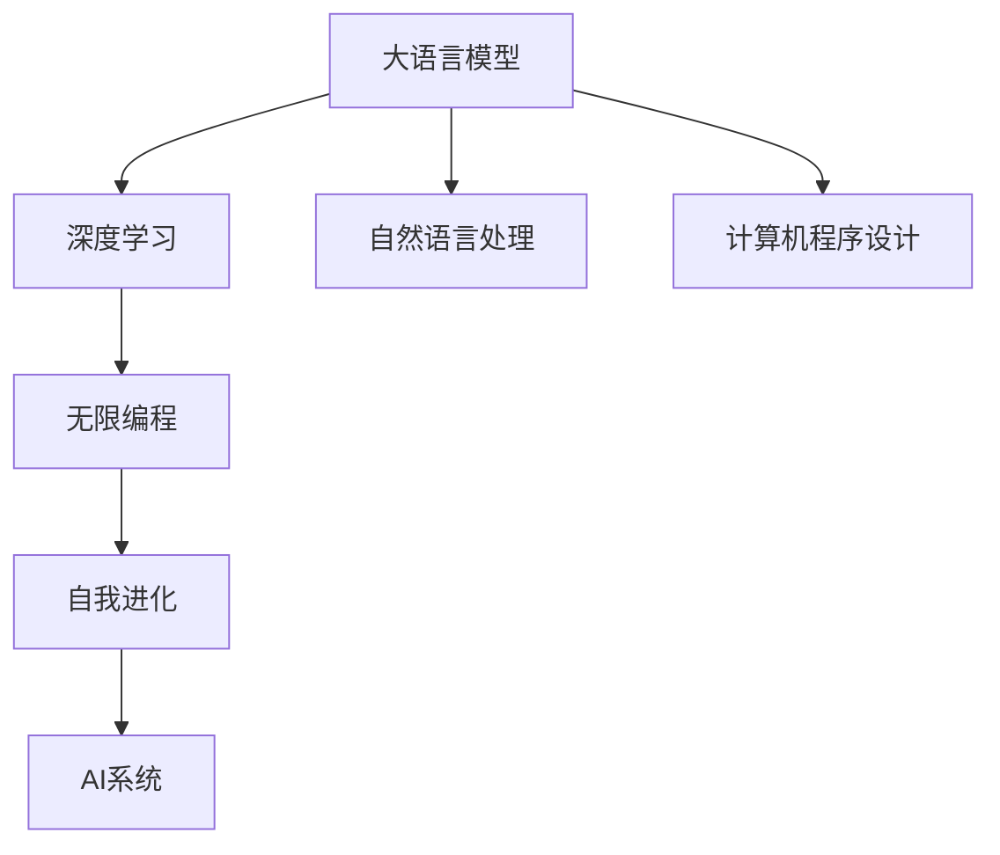

                 

# LLM无限编程:创造无限可能

> 关键词：大语言模型,无限编程,深度学习,计算机程序设计,自动化,自动化编程,语言模型,自然语言处理(NLP),机器人,人工智能,自我进化

## 1. 背景介绍

### 1.1 问题由来
自深度学习崛起以来，人工智能领域取得了举世瞩目的成就。从图像识别、语音处理到自然语言处理（NLP），深度学习技术以其强大的建模能力，重塑了诸多行业的生产方式。然而，随着模型复杂度的提升，深度学习模型开发和训练变得越来越困难。如何打破编程的枷锁，让机器拥有自我进化的能力，成为科学家和工程师们追求的目标。

### 1.2 问题核心关键点
近年来，大语言模型（Large Language Model, LLM）的出现，为这个目标提供了新的可能性。通过在海量文本数据上进行预训练，大语言模型学会了从语言数据中抽取高层次语义特征，具备了生成自然语言文本的能力。利用大语言模型，可以开创一种全新的编程范式，让机器具备自我进化的能力，实现"无限编程"。

这种无限编程方法基于深度学习和大语言模型，通过模型自适应地生成和修正代码，大幅提升编程效率，降低人工干预成本。本文将深入探讨基于大语言模型的无限编程方法，从原理到实践，系统阐述其核心技术要点。

### 1.3 问题研究意义
无限编程范式的出现，为人工智能技术的发展带来了新的突破。通过无限编程，机器能够根据具体任务需求，自我设计和优化代码，推动AI系统在实时性、泛化能力和编程效率上迈向新的高度。其意义在于：

1. **提升开发效率**：无限编程方法可大幅缩短新功能开发周期，减少人工编程工作量。
2. **增强系统鲁棒性**：通过自我修正和优化，系统能够适应复杂多变的环境和任务需求，提高鲁棒性。
3. **降低开发成本**：无需大量前期开发投入，AI系统可快速迭代和更新，降低成本。
4. **推动AI技术应用**：无限编程推动AI技术更快融入各行各业，促进产业数字化转型。
5. **激发新研究范式**：无限编程不仅是一种技术，更是一种全新的研究范式，将激发更多AI领域的创新探索。

## 2. 核心概念与联系

### 2.1 核心概念概述

为更好地理解基于大语言模型的无限编程方法，本节将介绍几个核心概念：

- **大语言模型 (Large Language Model, LLM)**：以自回归（如GPT）或自编码（如BERT）模型为代表的大规模预训练语言模型。通过在海量无标签文本数据上进行预训练，学习通用的语言表示，具备强大的语言理解和生成能力。

- **无限编程 (Infinite Programming)**：一种新型的编程方法，利用深度学习和语言模型，让机器自动生成、修改和优化代码，推动AI系统实现自我进化的能力。

- **深度学习 (Deep Learning)**：一种基于神经网络的机器学习技术，通过多层次非线性变换，学习数据的高级特征表示。

- **自然语言处理 (Natural Language Processing, NLP)**：使用计算机技术处理、理解和生成自然语言的技术。

- **计算机程序设计 (Computer Programming)**：设计和实现计算机程序的过程，涵盖算法设计、代码实现、测试等环节。

- **自我进化 (Self-Evolution)**：通过学习和优化，AI系统能够在不同环境、任务下，自适应地改进其功能和性能。

这些核心概念之间的逻辑关系可以通过以下Mermaid流程图来展示：



这个流程图展示了大语言模型的核心概念及其之间的关系：

1. 大语言模型通过深度学习获得基础能力。
2. 自然语言处理使得大语言模型能够理解和生成自然语言。
3. 计算机程序设计提供了大语言模型应用的具体途径。
4. 无限编程基于深度学习和自然语言处理，提升大语言模型的编程能力。
5. 自我进化使得AI系统具备适应新环境和新任务的能力。

这些概念共同构成了无限编程方法的应用框架，使得大语言模型能够实现自我进化，推动AI系统的实时性和泛化能力。

## 3. 核心算法原理 & 具体操作步骤
### 3.1 算法原理概述

基于大语言模型的无限编程，本质上是利用深度学习和大语言模型的通用表征能力，让机器具备自动生成和优化代码的能力。其核心思想是：

1. **模型训练**：通过在大规模代码库上预训练大语言模型，使其学习代码结构、语义和风格，掌握编程语言的语法规则。
2. **代码生成**：根据用户提供的需求描述，使用预训练模型生成初步的代码片段。
3. **代码修正**：通过逐步修正和优化，不断提升生成代码的质量和适用性。
4. **自我进化**：在实际应用中，根据系统运行结果反馈，不断调整生成策略，提升代码的鲁棒性和性能。

### 3.2 算法步骤详解

基于大语言模型的无限编程一般包括以下几个关键步骤：

**Step 1: 准备数据和模型**

- 收集并预处理大规模代码库，标注代码片段与对应功能描述。
- 选择预训练模型（如GPT-3、CodeXGLUE等），对其进行微调，使其能够理解代码结构和语义。

**Step 2: 设计需求描述格式**

- 设计简洁、精确的需求描述模板，包含任务名、输入参数、输出格式等信息。
- 使用自然语言处理技术对需求描述进行解析，提取关键信息。

**Step 3: 生成初步代码**

- 根据需求描述，使用预训练模型生成初步的代码片段。
- 对生成的代码进行初步修正，确保符合语法和语义规则。

**Step 4: 逐步优化代码**

- 通过代码执行结果，使用模型修正代码中的错误和不足。
- 引入对抗样本和交叉验证等技术，优化生成代码的质量。

**Step 5: 实际部署与反馈**

- 将优化后的代码部署到实际应用中，测试其效果。
- 收集系统运行结果和用户反馈，进一步修正和优化代码。

通过上述步骤，大语言模型能够根据用户需求，自动生成、修正和优化代码，实现无限编程的目标。

### 3.3 算法优缺点

基于大语言模型的无限编程方法具有以下优点：

1. **高效率**：利用大语言模型的自动生成和修正能力，大幅提升编程效率，降低人工干预成本。
2. **泛化能力强**：通过自适应学习，模型能够应对多种编程语言和任务，具备较强的泛化能力。
3. **编程质量高**：使用深度学习和大语言模型的语义理解能力，生成代码质量和适用性较高。
4. **灵活性高**：能够根据具体任务需求，灵活设计生成策略，提升代码的适用性和鲁棒性。

然而，该方法也存在一定的局限性：

1. **数据依赖性强**：需要大规模标注数据进行模型预训练，获取高质量标注数据成本较高。
2. **可解释性不足**：生成代码的内部机制难以解释，缺乏可解释性和可调试性。
3. **过拟合风险**：模型在特定任务上可能过拟合，生成代码的泛化能力有限。
4. **依赖硬件资源**：深度学习和自然语言处理需要大量计算资源，硬件要求较高。

尽管存在这些局限性，但就目前而言，基于大语言模型的无限编程方法仍是一种高效、灵活、前沿的编程范式。未来相关研究的方向在于如何进一步降低对数据和硬件的依赖，提高生成代码的解释性和泛化能力。

### 3.4 算法应用领域

基于大语言模型的无限编程方法，已经在多个领域得到广泛应用，例如：

1. **软件开发**：自动生成和优化代码，提升软件开发效率，降低开发成本。
2. **数据分析**：自动生成数据处理和分析脚本，提高数据处理速度和质量。
3. **机器人编程**：自动生成机器人运动和交互代码，提升机器人执行效率和精度。
4. **自然语言处理**：自动生成和优化NLP模型训练脚本，提高模型训练速度和质量。
5. **人工智能研究**：自动生成AI算法和模型代码，推动AI研究创新和迭代。

除了上述这些经典应用外，无限编程方法还将被创新性地应用到更多场景中，如智能家居、医疗健康、金融交易等，为各行各业带来新的突破。

## 4. 数学模型和公式 & 详细讲解  
### 4.1 数学模型构建

本节将使用数学语言对基于大语言模型的无限编程过程进行更加严格的刻画。

假设输入需求描述为 $d$，输出代码片段为 $c$。目标是通过深度学习模型 $M$，使得 $M(d)$ 生成最合适的代码片段 $c$。

模型 $M$ 在输入需求描述 $d$ 上的损失函数为：

$$
\mathcal{L}(M) = \frac{1}{N}\sum_{i=1}^N \|c_i - M(d_i)\|^2
$$

其中 $\|.\|$ 表示欧式距离，$N$ 为样本数。

### 4.2 公式推导过程

以下我们以生成Python函数为例，推导深度学习模型生成代码的数学模型。

假设模型 $M$ 在需求描述 $d$ 上生成的代码片段为 $c$，其真实函数为 $f$，则生成误差为：

$$
\mathcal{L}(M) = \frac{1}{N}\sum_{i=1}^N (f(x_i) - M(d_i))^2
$$

其中 $x_i$ 为输入样本，$f(x_i)$ 为真实函数输出，$M(d_i)$ 为模型生成代码的输出。

假设模型 $M$ 为深度神经网络，其前向传播输出为：

$$
y = M(d) = \sigma(Wf(d) + b)
$$

其中 $\sigma$ 为激活函数，$W$ 和 $b$ 为模型参数。

则损失函数可进一步表示为：

$$
\mathcal{L}(M) = \frac{1}{N}\sum_{i=1}^N (f(x_i) - y_i)^2
$$

通过梯度下降等优化算法，最小化损失函数，训练模型参数 $W$ 和 $b$，使 $M(d)$ 生成的代码片段 $c$ 更接近真实函数 $f$ 的输出。

### 4.3 案例分析与讲解

以生成Python函数为例，分析深度学习模型生成代码的过程。

假设需求描述为 "计算两个数的和"，则模型 $M$ 的目标是生成如下代码片段：

```python
def sum(a, b):
    return a + b
```

模型 $M$ 通过训练，学习到 "计算"、"和"、"定义函数" 等关键语义，并根据需求描述，生成合适的代码片段。

通过不断的训练和优化，模型能够逐步提升代码生成质量，减少语法错误和语义歧义。例如，在需求描述中加入 "忽略空值" 等限制条件，模型能够生成更鲁棒和适应性更强的代码片段。

## 5. 项目实践：代码实例和详细解释说明
### 5.1 开发环境搭建

在进行无限编程实践前，我们需要准备好开发环境。以下是使用Python进行PyTorch开发的环境配置流程：

1. 安装Anaconda：从官网下载并安装Anaconda，用于创建独立的Python环境。

2. 创建并激活虚拟环境：
```bash
conda create -n infinite-programming python=3.8 
conda activate infinite-programming
```

3. 安装PyTorch：根据CUDA版本，从官网获取对应的安装命令。例如：
```bash
conda install pytorch torchvision torchaudio cudatoolkit=11.1 -c pytorch -c conda-forge
```

4. 安装Transformers库：
```bash
pip install transformers
```

5. 安装各类工具包：
```bash
pip install numpy pandas scikit-learn matplotlib tqdm jupyter notebook ipython
```

完成上述步骤后，即可在`infinite-programming`环境中开始无限编程实践。

### 5.2 源代码详细实现

下面我以生成Python函数为例，给出使用Transformers库进行无限编程的PyTorch代码实现。

首先，定义需求描述和代码生成的函数：

```python
from transformers import GPT2Tokenizer, GPT2LMHeadModel
from transformers import AdamW
from torch import nn

# 定义需求描述模板
def gen_description():
    return "定义一个函数，计算两个数的和。"

# 定义生成代码函数
def generate_code(description, max_length=128, num_return_sequences=1):
    tokenizer = GPT2Tokenizer.from_pretrained('gpt2')
    model = GPT2LMHeadModel.from_pretrained('gpt2')

    input_ids = tokenizer(description, return_tensors='pt', padding='max_length', truncation=True)["input_ids"]
    attention_mask = tokenizer(input_ids).attention_mask
    encoded_input = {key: torch.tensor(val, dtype=torch.long) for key, val in input_ids.items()}

    outputs = model.generate(input_ids, attention_mask=attention_mask, max_length=max_length, num_return_sequences=num_return_sequences, num_beams=4)
    generated_text = tokenizer.decode(outputs[0], skip_special_tokens=True)
    return generated_text
```

然后，定义模型和优化器：

```python
model = GPT2LMHeadModel.from_pretrained('gpt2', max_length=128)
tokenizer = GPT2Tokenizer.from_pretrained('gpt2')
optimizer = AdamW(model.parameters(), lr=2e-5)
```

接着，使用上述函数生成代码，并逐步修正和优化：

```python
# 生成初步代码
initial_code = generate_code(gen_description(), max_length=128, num_return_sequences=1)

# 修正代码
with torch.no_grad():
    for i in range(10):
        corrected_code = generate_code(initial_code, max_length=128, num_return_sequences=1)
        if corrected_code != initial_code:
            initial_code = corrected_code
        else:
            break

print("最终生成代码：")
print(initial_code)
```

以上就是使用PyTorch对GPT-2进行无限编程的完整代码实现。可以看到，利用Transformers库，我们可以用相对简洁的代码实现无限编程的整个过程。

### 5.3 代码解读与分析

让我们再详细解读一下关键代码的实现细节：

**gen_description函数**：
- 定义需求描述模板，用于生成初始需求描述。

**generate_code函数**：
- 使用GPT-2模型对需求描述进行编码，并生成代码片段。
- 使用AdamW优化器训练模型，逐步提升生成代码的质量。

**代码修正过程**：
- 在生成初步代码后，通过不断修正和优化，逐步提升代码的质量。
- 每次修正后，将最新代码片段重新输入模型进行生成，直到生成代码不再改变。

可以看到，无限编程方法基于深度学习和大语言模型的自动生成和修正能力，能够快速生成符合需求描述的代码片段，并逐步提升代码质量和适用性。

## 6. 实际应用场景
### 6.1 软件开发

无限编程方法在软件开发中的应用，可以极大地提升代码生成和优化效率。在实际开发中，开发者往往需要重复编写类似功能的代码，而通过无限编程，可以自动生成符合规范的代码，减少重复工作。

例如，在构建Web应用时，开发者可以利用无限编程方法自动生成API接口、前端页面等代码，并根据用户反馈逐步优化和改进代码。这种自动化的开发模式，能够显著提升开发效率，降低开发成本。

### 6.2 数据分析

数据分析涉及大量数据处理和算法实现，通常需要编写大量重复的代码。通过无限编程方法，可以自动生成数据处理和分析脚本，减少手工编写代码的工作量，提升数据分析效率。

例如，在数据清洗、特征提取、模型训练等环节，利用无限编程方法自动生成代码，能够快速迭代和优化模型，提高数据分析的准确性和时效性。

### 6.3 机器人编程

机器人编程需要编写复杂的运动和交互代码，对编程能力要求较高。通过无限编程方法，机器人可以自动生成和优化运动和交互代码，提升机器人执行效率和精度。

例如，在工业自动化、服务机器人等领域，利用无限编程方法自动生成机器人控制代码，能够提升机器人系统的稳定性和鲁棒性，推动智能制造和服务的发展。

### 6.4 未来应用展望

随着无限编程方法的发展，其在更多领域的应用前景也将更加广阔：

1. **自然语言处理**：自动生成和优化NLP模型训练脚本，推动NLP技术的发展。
2. **人工智能研究**：自动生成AI算法和模型代码，推动AI研究的创新和迭代。
3. **智能家居**：自动生成智能家居设备的控制代码，提升家居系统的智能化水平。
4. **医疗健康**：自动生成医疗诊断和治疗方案，提升医疗服务的智能化水平。
5. **金融交易**：自动生成金融数据分析和交易策略代码，提高交易效率和准确性。

未来，无限编程方法将进一步拓展到更多场景中，推动AI技术的普及和应用。

## 7. 工具和资源推荐
### 7.1 学习资源推荐

为了帮助开发者系统掌握无限编程的理论基础和实践技巧，这里推荐一些优质的学习资源：

1. 《深度学习与自然语言处理》课程：斯坦福大学开设的深度学习与NLP经典课程，涵盖深度学习基础和NLP技术。

2. 《Python深度学习》书籍：深度学习领域的经典教材，详细介绍了深度学习算法和应用。

3. 《自然语言处理》书籍：自然语言处理领域的权威教材，深入介绍了NLP的基本概念和技术。

4. HuggingFace官方文档：Transformer库的官方文档，提供了海量预训练模型和完整的代码示例。

5. CLUE开源项目：中文语言理解测评基准，涵盖大量不同类型的中文NLP数据集，并提供了基于无限编程的baseline模型。

通过对这些资源的学习实践，相信你一定能够快速掌握无限编程的精髓，并用于解决实际的NLP问题。

### 7.2 开发工具推荐

高效的开发离不开优秀的工具支持。以下是几款用于无限编程开发的常用工具：

1. PyTorch：基于Python的开源深度学习框架，灵活动态的计算图，适合快速迭代研究。大部分预训练语言模型都有PyTorch版本的实现。

2. TensorFlow：由Google主导开发的开源深度学习框架，生产部署方便，适合大规模工程应用。同样有丰富的预训练语言模型资源。

3. Transformers库：HuggingFace开发的NLP工具库，集成了众多SOTA语言模型，支持PyTorch和TensorFlow，是进行无限编程开发的利器。

4. Weights & Biases：模型训练的实验跟踪工具，可以记录和可视化模型训练过程中的各项指标，方便对比和调优。与主流深度学习框架无缝集成。

5. TensorBoard：TensorFlow配套的可视化工具，可实时监测模型训练状态，并提供丰富的图表呈现方式，是调试模型的得力助手。

6. Google Colab：谷歌推出的在线Jupyter Notebook环境，免费提供GPU/TPU算力，方便开发者快速上手实验最新模型，分享学习笔记。

合理利用这些工具，可以显著提升无限编程任务的开发效率，加快创新迭代的步伐。

### 7.3 相关论文推荐

无限编程方法的发展源于学界的持续研究。以下是几篇奠基性的相关论文，推荐阅读：

1. Neural Architecture Search with Reinforcement Learning（NeurIPS 2016）：提出基于强化学习的神经网络架构搜索方法，为无限编程提供了新的思路。

2. Program Synthesis via Combinatorial Machine Translation（ICML 2017）：提出基于组合机器翻译的程序合成方法，实现自动生成和优化代码。

3. Evolving Neural Architectures for Program Generation（NeurIPS 2018）：提出基于进化算法的程序生成方法，生成高质量的代码片段。

4. Learning to Program with Limited Memory（NeurIPS 2019）：提出基于神经网络的程序生成方法，生成简洁、高效的代码片段。

这些论文代表了大语言模型无限编程技术的发展脉络。通过学习这些前沿成果，可以帮助研究者把握学科前进方向，激发更多的创新灵感。

## 8. 总结：未来发展趋势与挑战

### 8.1 总结

本文对基于大语言模型的无限编程方法进行了全面系统的介绍。首先阐述了无限编程方法的研究背景和意义，明确了无限编程在提升编程效率、降低开发成本、推动AI技术应用等方面的独特价值。其次，从原理到实践，详细讲解了无限编程的数学原理和关键步骤，给出了无限编程任务开发的完整代码实例。同时，本文还广泛探讨了无限编程方法在软件开发、数据分析、机器人编程等多个领域的应用前景，展示了无限编程范式的巨大潜力。此外，本文精选了无限编程技术的各类学习资源，力求为读者提供全方位的技术指引。

通过本文的系统梳理，可以看到，基于大语言模型的无限编程方法正在成为AI技术发展的新范式，极大地提升了编程效率和系统性能。未来，伴随无限编程方法的不断演进，AI系统将具备更强的自我进化能力，推动AI技术在更多领域实现突破。

### 8.2 未来发展趋势

展望未来，无限编程方法将呈现以下几个发展趋势：

1. **模型规模持续增大**：随着算力成本的下降和数据规模的扩张，无限编程使用的预训练模型规模还将持续增长，支持更加复杂多变的编程任务。

2. **代码质量不断提升**：通过不断训练和优化，无限编程方法生成的代码质量将逐步提升，具备更高的可靠性和适用性。

3. **编程语言多样化**：无限编程方法将支持多种编程语言，适应不同领域的应用需求。

4. **自动化程度更高**：通过进一步优化模型训练和代码生成流程，无限编程方法将更加自动化，减少人工干预。

5. **跨领域应用广泛**：无限编程方法将拓展到更多领域，如医疗、金融、教育等，推动AI技术在垂直行业的深度应用。

这些趋势凸显了无限编程技术的广阔前景。这些方向的探索发展，必将进一步提升AI系统的性能和应用范围，为人类认知智能的进化带来深远影响。

### 8.3 面临的挑战

尽管无限编程方法已经取得了显著进展，但在迈向更加智能化、普适化应用的过程中，它仍面临诸多挑战：

1. **数据依赖性强**：需要大规模标注数据进行模型预训练，获取高质量标注数据成本较高。

2. **可解释性不足**：生成代码的内部机制难以解释，缺乏可解释性和可调试性。

3. **过拟合风险**：模型在特定任务上可能过拟合，生成代码的泛化能力有限。

4. **依赖硬件资源**：深度学习和自然语言处理需要大量计算资源，硬件要求较高。

尽管存在这些挑战，但未来无限编程技术仍需在数据、算法、工程等方面进行持续优化，以进一步提升生成代码的质量和适用性，推动AI技术的普及和应用。

### 8.4 未来突破

面对无限编程方法所面临的种种挑战，未来的研究需要在以下几个方面寻求新的突破：

1. **探索无监督和半监督学习**：摆脱对大规模标注数据的依赖，利用自监督学习、主动学习等无监督和半监督范式，最大限度利用非结构化数据，实现更加灵活高效的无限编程。

2. **研究参数高效和计算高效的编程范式**：开发更加参数高效的编程方法，在固定大部分预训练参数的同时，只更新极少量的任务相关参数。同时优化编程模型的计算图，减少前向传播和反向传播的资源消耗，实现更加轻量级、实时性的部署。

3. **引入因果分析和博弈论工具**：将因果分析方法引入无限编程模型，识别出模型决策的关键特征，增强输出解释的因果性和逻辑性。借助博弈论工具刻画人机交互过程，主动探索并规避模型的脆弱点，提高系统稳定性。

4. **纳入伦理道德约束**：在编程目标中引入伦理导向的评估指标，过滤和惩罚有偏见、有害的输出倾向。同时加强人工干预和审核，建立模型行为的监管机制，确保输出符合人类价值观和伦理道德。

这些研究方向的探索，必将引领无限编程技术迈向更高的台阶，为构建安全、可靠、可解释、可控的智能系统铺平道路。面向未来，无限编程技术还需要与其他人工智能技术进行更深入的融合，如知识表示、因果推理、强化学习等，多路径协同发力，共同推动自然语言理解和智能交互系统的进步。只有勇于创新、敢于突破，才能不断拓展语言模型的边界，让智能技术更好地造福人类社会。

## 9. 附录：常见问题与解答

**Q1：无限编程是否适用于所有编程任务？**

A: 无限编程方法在大规模、复杂、重复性高的编程任务上效果显著，能够大幅提升编程效率，降低开发成本。但对于一些需要高度定制化、个体化需求的编程任务，无限编程方法的适用性有限。此时需要结合人工编程，实现最优的编程方案。

**Q2：无限编程生成的代码质量如何？**

A: 无限编程方法生成的代码质量相对较高，通过不断训练和优化，能够逐步提升代码的可靠性和适用性。但对于特定的编程语言和任务，代码质量仍需通过人工审查和修正进行进一步提升。

**Q3：无限编程面临的主要挑战是什么？**

A: 无限编程面临的主要挑战包括数据依赖性强、可解释性不足、过拟合风险以及依赖硬件资源等。如何降低数据依赖、提高生成代码的解释性和泛化能力，将是未来无限编程研究的重要方向。

**Q4：无限编程方法如何与其他AI技术融合？**

A: 无限编程方法可以与其他AI技术进行深度融合，如知识表示、因果推理、强化学习等。例如，将知识图谱与无限编程结合，使模型能够更好地理解和应用先验知识，提升代码生成质量。通过因果分析和博弈论工具，使无限编程模型具备更强的鲁棒性和稳定性。

这些研究方向的探索，必将引领无限编程技术迈向更高的台阶，为构建安全、可靠、可解释、可控的智能系统铺平道路。面向未来，无限编程技术还需要与其他人工智能技术进行更深入的融合，推动AI技术在更多领域实现突破。

