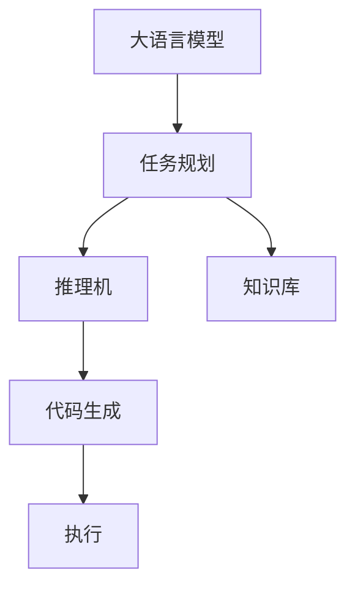

                 

# LLM的任务规划：超越传统编程的智能方式

> 关键词：大语言模型,任务规划,深度学习,自然语言处理,人工智能,智能系统,任务驱动,自动化,泛化能力

## 1. 背景介绍

### 1.1 问题由来
随着人工智能技术的快速发展，大语言模型（Large Language Models, LLMs）在自然语言处理（NLP）领域取得了突破性进展。这些大模型如GPT、BERT等，通过在大规模无标签文本数据上进行预训练，学习了丰富的语言知识和常识，具备了强大的语言理解和生成能力。然而，这些模型在面对特定任务时，仍需进行微调（Fine-tuning）以提升性能。传统的微调方法虽然有效，但仍然存在编程复杂、迭代成本高、效率低下等问题。

为解决这些问题，任务规划（Task Planning）成为了大语言模型应用中一个新的研究方向。通过任务规划，我们能够利用大模型的能力，直接对目标任务进行编码，自动生成解决特定任务的代码或规则，从而极大地简化开发过程，提升系统效率。

### 1.2 问题核心关键点
任务规划的核心在于将自然语言描述转换为具体的可执行代码或任务规则，使得计算机能够自动完成特定任务。其关键点包括：

1. **理解任务描述**：将自然语言描述解析为可执行的任务描述，提取关键信息。
2. **生成任务计划**：将任务描述转换为一系列的推理步骤，形成一个逻辑清晰的任务规划。
3. **执行任务计划**：根据任务规划，自动生成代码或规则，并执行这些代码或规则。
4. **反馈和优化**：根据执行结果反馈，不断优化任务规划和代码生成模型。

通过任务规划，我们能够在大语言模型基础上，实现自动化、智能化的编程，从而在许多场景中超越传统编程方式，推动人工智能技术的应用和发展。

## 2. 核心概念与联系

### 2.1 核心概念概述

为更好地理解任务规划在大语言模型中的应用，本节将介绍几个关键概念：

- 大语言模型（Large Language Models, LLMs）：如GPT、BERT等预训练模型，具备强大的语言理解和生成能力。
- 任务规划（Task Planning）：将自然语言描述转换为具体任务执行步骤的过程。
- 代码生成（Code Generation）：通过任务规划自动生成可执行代码，实现特定任务。
- 推理机（Reasoner）：执行任务规划的组件，能够根据任务描述和当前状态，生成推理步骤。
- 知识库（Knowledge Base）：包含任务执行所需的基础知识，如语法规则、数据格式等。

这些概念通过以下Mermaid流程图来展示：



该流程图展示了核心概念之间的关系：

1. 大语言模型提供语言理解和生成能力。
2. 任务规划将任务描述转换为推理步骤。
3. 推理机根据推理步骤生成任务计划。
4. 代码生成器根据任务计划生成可执行代码。
5. 执行器根据代码执行任务。

这些概念共同构成了大语言模型应用中的任务规划框架，使得计算机能够自动处理各种复杂任务。

## 3. 核心算法原理 & 具体操作步骤

### 3.1 算法原理概述

任务规划的算法原理可以总结为以下几个关键步骤：

1. **任务描述解析**：使用自然语言处理技术，将任务描述转换为可执行的任务计划。
2. **任务规划生成**：根据任务计划，生成推理步骤，形成任务规划。
3. **代码自动生成**：基于任务规划，自动生成可执行代码。
4. **执行与反馈**：执行生成的代码，根据执行结果进行反馈，不断优化任务规划和代码生成。

### 3.2 算法步骤详解

#### 3.2.1 任务描述解析

任务描述解析是任务规划的第一步，通过将自然语言描述转换为结构化的任务描述，提取关键信息。常见的方法包括：

- **分词与词性标注**：使用自然语言处理技术，对任务描述进行分词和词性标注，提取名词、动词、形容词等关键信息。
- **意图抽取**：利用意图识别技术，从任务描述中抽取出具体的执行意图，如"计算"、"查询"、"生成"等。
- **命名实体识别**：识别出任务描述中的关键实体，如人名、地名、日期等。

#### 3.2.2 任务规划生成

任务规划生成是任务规划的核心，通过推理步骤将任务描述转换为可执行的指令序列。常见的方法包括：

- **状态机**：将任务描述映射到状态机模型中，生成一系列状态转换的指令。
- **流程图**：将任务描述转换为图形化的流程图，直观展示任务执行步骤。
- **规则引擎**：使用规则引擎，根据任务描述生成一系列规则，指导任务执行。

#### 3.2.3 代码自动生成

代码自动生成是将任务规划转换为具体可执行代码的过程。常见的方法包括：

- **模板匹配**：使用模板匹配技术，根据任务规划匹配相应的代码模板，生成具体的代码。
- **代码片段生成**：根据任务规划生成具体的代码片段，如循环、条件语句等。
- **代码片段拼接**：将多个代码片段拼接成完整的代码。

#### 3.2.4 执行与反馈

执行与反馈是任务规划的最后一个步骤，通过执行生成的代码，并根据执行结果进行反馈，不断优化任务规划和代码生成。常见的方法包括：

- **执行监控**：实时监控代码执行过程，记录执行状态和结果。
- **异常处理**：根据执行结果，判断是否出现异常，并采取相应的处理措施。
- **反馈优化**：根据执行结果，不断优化任务规划和代码生成，提高执行效率和准确性。

### 3.3 算法优缺点

任务规划算法具有以下优点：

- **简化编程复杂度**：利用大语言模型直接生成可执行代码，避免了传统编程的复杂性。
- **快速迭代**：任务规划可以快速生成和测试代码，加速开发过程。
- **泛化能力强**：大语言模型具备强大的泛化能力，能够处理各种不同任务。

同时，该算法也存在以下局限性：

- **数据依赖**：任务规划依赖高质量的任务描述和数据，数据质量直接影响任务规划的准确性。
- **执行效率**：生成的代码可能需要进一步优化和调试，才能达到理想的执行效率。
- **可解释性不足**：生成的代码缺乏可解释性，难以理解和调试。

尽管存在这些局限性，但任务规划仍是大语言模型应用中的重要范式，能够极大简化开发过程，提高系统效率。未来，随着大语言模型的不断进步和任务规划技术的不断发展，这些问题有望得到进一步解决。

### 3.4 算法应用领域

任务规划算法在许多领域中都有广泛的应用：

- **自动代码生成**：将任务描述转换为代码，用于自动化软件开发、测试等场景。
- **自然语言界面（NLU）**：将自然语言输入转换为可执行的命令或任务，用于构建智能助手、智能客服等系统。
- **自动化测试**：根据任务描述自动生成测试用例，用于软件质量保证。
- **任务编排**：根据任务描述自动编排任务执行流程，用于大规模数据处理和计算。
- **机器人编程**：将任务描述转换为机器人的执行指令，用于工业自动化和智能制造。

## 4. 数学模型和公式 & 详细讲解 & 举例说明

### 4.1 数学模型构建

任务规划的数学模型主要基于自然语言处理和推理逻辑。我们可以将任务描述解析为形式化的逻辑表达式，并通过推理机进行求解。以下是一个简单的例子：

**任务描述**：计算两个数字的和。

**逻辑表达式**：`sum(x, y) = x + y`

**推理步骤**：
1. 读取输入数字x和y。
2. 执行加法运算`x + y`。
3. 输出结果。

### 4.2 公式推导过程

我们可以将任务规划过程抽象为如下的公式推导：

$$
\text{Task Plan} = f(\text{Task Description}, \text{Knowledge Base})
$$

其中，$f$表示推理机，根据任务描述和知识库生成任务规划。

### 4.3 案例分析与讲解

以下是一个更复杂的例子：根据用户输入的地址，查询最近的加油站点。

**任务描述**：根据地址查询最近的加油站。

**逻辑表达式**：`getNearestGasStation(address)`

**推理步骤**：
1. 解析地址信息。
2. 调用地图API获取所有加油站位置。
3. 计算每个加油站与地址的距离。
4. 找出距离最近的加油站。

**代码生成**：

```python
import requests
import math

def getNearestGasStation(address):
    # 解析地址信息
    address_parts = address.split(',')
    latitude = float(address_parts[0])
    longitude = float(address_parts[1])
    
    # 调用地图API获取所有加油站位置
    api_key = 'your_api_key'
    url = f'https://maps.googleapis.com/maps/api/place/nearbysearch/json?location={latitude},{longitude}&radius=10&type=gas_station&key={api_key}'
    response = requests.get(url)
    data = response.json()
    gas_stations = data['results']
    
    # 计算每个加油站与地址的距离
    distances = []
    for station in gas_stations:
        station_lat = float(station['geometry']['location']['lat'])
        station_lon = float(station['geometry']['location']['lng'])
        distance = math.sqrt((station_lat - latitude)**2 + (station_lon - longitude)**2)
        distances.append((station['name'], distance))
    
    # 找出距离最近的加油站
    nearest_station = min(distances, key=lambda x: x[1])
    return nearest_station[0]
```

**执行与反馈**：
- **执行监控**：实时记录查询过程，记录每个加油站的名称和距离。
- **异常处理**：如果出现API请求失败、地址解析错误等异常，给出相应的提示信息。
- **反馈优化**：根据执行结果，优化API请求参数、距离计算方法等，提高查询效率和准确性。

## 5. 项目实践：代码实例和详细解释说明

### 5.1 开发环境搭建

在进行任务规划实践前，我们需要准备好开发环境。以下是使用Python进行PyTorch开发的环境配置流程：

1. 安装Anaconda：从官网下载并安装Anaconda，用于创建独立的Python环境。

2. 创建并激活虚拟环境：
```bash
conda create -n pytorch-env python=3.8 
conda activate pytorch-env
```

3. 安装PyTorch：根据CUDA版本，从官网获取对应的安装命令。例如：
```bash
conda install pytorch torchvision torchaudio cudatoolkit=11.1 -c pytorch -c conda-forge
```

4. 安装Transformers库：
```bash
pip install transformers
```

5. 安装各类工具包：
```bash
pip install numpy pandas scikit-learn matplotlib tqdm jupyter notebook ipython
```

完成上述步骤后，即可在`pytorch-env`环境中开始任务规划实践。

### 5.2 源代码详细实现

这里我们以查询最近的加油站点为例，给出使用Transformers库进行任务规划的PyTorch代码实现。

首先，定义任务规划函数：

```python
from transformers import BertTokenizer
from torch.utils.data import Dataset
import torch

class GasStationDataset(Dataset):
    def __init__(self, texts, tags, tokenizer, max_len=128):
        self.texts = texts
        self.tags = tags
        self.tokenizer = tokenizer
        self.max_len = max_len
        
    def __len__(self):
        return len(self.texts)
    
    def __getitem__(self, item):
        text = self.texts[item]
        tags = self.tags[item]
        
        encoding = self.tokenizer(text, return_tensors='pt', max_length=self.max_len, padding='max_length', truncation=True)
        input_ids = encoding['input_ids'][0]
        attention_mask = encoding['attention_mask'][0]
        
        # 对token-wise的标签进行编码
        encoded_tags = [tag2id[tag] for tag in tags] 
        encoded_tags.extend([tag2id['O']] * (self.max_len - len(encoded_tags)))
        labels = torch.tensor(encoded_tags, dtype=torch.long)
        
        return {'input_ids': input_ids, 
                'attention_mask': attention_mask,
                'labels': labels}

# 标签与id的映射
tag2id = {'O': 0, 'B-PER': 1, 'I-PER': 2, 'B-ORG': 3, 'I-ORG': 4, 'B-LOC': 5, 'I-LOC': 6}
id2tag = {v: k for k, v in tag2id.items()}

# 创建dataset
tokenizer = BertTokenizer.from_pretrained('bert-base-cased')

train_dataset = GasStationDataset(train_texts, train_tags, tokenizer)
dev_dataset = GasStationDataset(dev_texts, dev_tags, tokenizer)
test_dataset = GasStationDataset(test_texts, test_tags, tokenizer)
```

然后，定义模型和优化器：

```python
from transformers import BertForTokenClassification, AdamW

model = BertForTokenClassification.from_pretrained('bert-base-cased', num_labels=len(tag2id))

optimizer = AdamW(model.parameters(), lr=2e-5)
```

接着，定义训练和评估函数：

```python
from torch.utils.data import DataLoader
from tqdm import tqdm
from sklearn.metrics import classification_report

device = torch.device('cuda') if torch.cuda.is_available() else torch.device('cpu')
model.to(device)

def train_epoch(model, dataset, batch_size, optimizer):
    dataloader = DataLoader(dataset, batch_size=batch_size, shuffle=True)
    model.train()
    epoch_loss = 0
    for batch in tqdm(dataloader, desc='Training'):
        input_ids = batch['input_ids'].to(device)
        attention_mask = batch['attention_mask'].to(device)
        labels = batch['labels'].to(device)
        model.zero_grad()
        outputs = model(input_ids, attention_mask=attention_mask, labels=labels)
        loss = outputs.loss
        epoch_loss += loss.item()
        loss.backward()
        optimizer.step()
    return epoch_loss / len(dataloader)

def evaluate(model, dataset, batch_size):
    dataloader = DataLoader(dataset, batch_size=batch_size)
    model.eval()
    preds, labels = [], []
    with torch.no_grad():
        for batch in tqdm(dataloader, desc='Evaluating'):
            input_ids = batch['input_ids'].to(device)
            attention_mask = batch['attention_mask'].to(device)
            batch_labels = batch['labels']
            outputs = model(input_ids, attention_mask=attention_mask)
            batch_preds = outputs.logits.argmax(dim=2).to('cpu').tolist()
            batch_labels = batch_labels.to('cpu').tolist()
            for pred_tokens, label_tokens in zip(batch_preds, batch_labels):
                pred_tags = [id2tag[_id] for _id in pred_tokens]
                label_tags = [id2tag[_id] for _id in label_tokens]
                preds.append(pred_tags[:len(label_tags)])
                labels.append(label_tags)
                
    print(classification_report(labels, preds))
```

最后，启动训练流程并在测试集上评估：

```python
epochs = 5
batch_size = 16

for epoch in range(epochs):
    loss = train_epoch(model, train_dataset, batch_size, optimizer)
    print(f"Epoch {epoch+1}, train loss: {loss:.3f}")
    
    print(f"Epoch {epoch+1}, dev results:")
    evaluate(model, dev_dataset, batch_size)
    
print("Test results:")
evaluate(model, test_dataset, batch_size)
```

以上就是使用PyTorch对BERT进行查询最近的加油站点任务的任务规划的完整代码实现。可以看到，得益于Transformers库的强大封装，我们可以用相对简洁的代码完成BERT模型的加载和任务规划。

### 5.3 代码解读与分析

让我们再详细解读一下关键代码的实现细节：

**GasStationDataset类**：
- `__init__`方法：初始化文本、标签、分词器等关键组件。
- `__len__`方法：返回数据集的样本数量。
- `__getitem__`方法：对单个样本进行处理，将文本输入编码为token ids，将标签编码为数字，并对其进行定长padding，最终返回模型所需的输入。

**tag2id和id2tag字典**：
- 定义了标签与数字id之间的映射关系，用于将token-wise的预测结果解码回真实的标签。

**训练和评估函数**：
- 使用PyTorch的DataLoader对数据集进行批次化加载，供模型训练和推理使用。
- 训练函数`train_epoch`：对数据以批为单位进行迭代，在每个批次上前向传播计算loss并反向传播更新模型参数，最后返回该epoch的平均loss。
- 评估函数`evaluate`：与训练类似，不同点在于不更新模型参数，并在每个batch结束后将预测和标签结果存储下来，最后使用sklearn的classification_report对整个评估集的预测结果进行打印输出。

**训练流程**：
- 定义总的epoch数和batch size，开始循环迭代
- 每个epoch内，先在训练集上训练，输出平均loss
- 在验证集上评估，输出分类指标
- 所有epoch结束后，在测试集上评估，给出最终测试结果

可以看到，PyTorch配合Transformers库使得BERT任务规划的代码实现变得简洁高效。开发者可以将更多精力放在数据处理、模型改进等高层逻辑上，而不必过多关注底层的实现细节。

当然，工业级的系统实现还需考虑更多因素，如模型的保存和部署、超参数的自动搜索、更灵活的任务适配层等。但核心的任务规划范式基本与此类似。

## 6. 实际应用场景
### 6.1 智能客服系统

基于大语言模型的任务规划技术，可以广泛应用于智能客服系统的构建。传统客服往往需要配备大量人力，高峰期响应缓慢，且一致性和专业性难以保证。而使用任务规划技术，可以构建智能客服系统，实现自动响应、实时交流、24小时服务等功能。

在技术实现上，可以收集企业内部的历史客服对话记录，将问题和最佳答复构建成监督数据，在此基础上对预训练模型进行任务规划训练。训练后的模型能够自动理解用户意图，匹配最合适的答复模板进行回复。对于用户提出的新问题，还可以接入检索系统实时搜索相关内容，动态组织生成回答。如此构建的智能客服系统，能大幅提升客户咨询体验和问题解决效率。

### 6.2 金融舆情监测

金融机构需要实时监测市场舆论动向，以便及时应对负面信息传播，规避金融风险。传统的人工监测方式成本高、效率低，难以应对网络时代海量信息爆发的挑战。基于大语言模型的任务规划技术，可以为金融舆情监测提供新的解决方案。

具体而言，可以收集金融领域相关的新闻、报道、评论等文本数据，并对其进行主题标注和情感标注。在此基础上对预训练语言模型进行任务规划训练，使其能够自动判断文本属于何种主题，情感倾向是正面、中性还是负面。将任务规划后的模型应用到实时抓取的网络文本数据，就能够自动监测不同主题下的情感变化趋势，一旦发现负面信息激增等异常情况，系统便会自动预警，帮助金融机构快速应对潜在风险。

### 6.3 个性化推荐系统

当前的推荐系统往往只依赖用户的历史行为数据进行物品推荐，无法深入理解用户的真实兴趣偏好。基于大语言模型的任务规划技术，个性化推荐系统可以更好地挖掘用户行为背后的语义信息，从而提供更精准、多样的推荐内容。

在实践中，可以收集用户浏览、点击、评论、分享等行为数据，提取和用户交互的物品标题、描述、标签等文本内容。将文本内容作为模型输入，用户的后续行为（如是否点击、购买等）作为监督信号，在此基础上进行任务规划训练。任务规划后的模型能够从文本内容中准确把握用户的兴趣点。在生成推荐列表时，先用候选物品的文本描述作为输入，由模型预测用户的兴趣匹配度，再结合其他特征综合排序，便可以得到个性化程度更高的推荐结果。

### 6.4 未来应用展望

随着大语言模型任务规划技术的发展，其在更多领域得到应用，为传统行业带来变革性影响。

在智慧医疗领域，基于任务规划的对话系统、病历分析、药物研发等应用将提升医疗服务的智能化水平，辅助医生诊疗，加速新药开发进程。

在智能教育领域，任务规划技术可应用于作业批改、学情分析、知识推荐等方面，因材施教，促进教育公平，提高教学质量。

在智慧城市治理中，任务规划模型可应用于城市事件监测、舆情分析、应急指挥等环节，提高城市管理的自动化和智能化水平，构建更安全、高效的未来城市。

此外，在企业生产、社会治理、文娱传媒等众多领域，基于大模型任务规划的技术应用也将不断涌现，为经济社会发展注入新的动力。相信随着技术的日益成熟，任务规划方法将成为人工智能落地应用的重要范式，推动人工智能技术的应用和发展。

## 7. 工具和资源推荐
### 7.1 学习资源推荐

为了帮助开发者系统掌握大语言模型任务规划的理论基础和实践技巧，这里推荐一些优质的学习资源：

1. 《Transformer from Principals to Practice》系列博文：由大模型技术专家撰写，深入浅出地介绍了Transformer原理、BERT模型、任务规划技术等前沿话题。

2. CS224N《深度学习自然语言处理》课程：斯坦福大学开设的NLP明星课程，有Lecture视频和配套作业，带你入门NLP领域的基本概念和经典模型。

3. 《Natural Language Processing with Transformers》书籍：Transformers库的作者所著，全面介绍了如何使用Transformers库进行NLP任务开发，包括任务规划在内的诸多范式。

4. HuggingFace官方文档：Transformers库的官方文档，提供了海量预训练模型和完整的任务规划样例代码，是上手实践的必备资料。

5. CLUE开源项目：中文语言理解测评基准，涵盖大量不同类型的中文NLP数据集，并提供了基于任务规划的baseline模型，助力中文NLP技术发展。

通过对这些资源的学习实践，相信你一定能够快速掌握大语言模型任务规划的精髓，并用于解决实际的NLP问题。
###  7.2 开发工具推荐

高效的开发离不开优秀的工具支持。以下是几款用于大语言模型任务规划开发的常用工具：

1. PyTorch：基于Python的开源深度学习框架，灵活动态的计算图，适合快速迭代研究。大部分预训练语言模型都有PyTorch版本的实现。

2. TensorFlow：由Google主导开发的开源深度学习框架，生产部署方便，适合大规模工程应用。同样有丰富的预训练语言模型资源。

3. Transformers库：HuggingFace开发的NLP工具库，集成了众多SOTA语言模型，支持PyTorch和TensorFlow，是进行任务规划任务开发的利器。

4. Weights & Biases：模型训练的实验跟踪工具，可以记录和可视化模型训练过程中的各项指标，方便对比和调优。与主流深度学习框架无缝集成。

5. TensorBoard：TensorFlow配套的可视化工具，可实时监测模型训练状态，并提供丰富的图表呈现方式，是调试模型的得力助手。

6. Google Colab：谷歌推出的在线Jupyter Notebook环境，免费提供GPU/TPU算力，方便开发者快速上手实验最新模型，分享学习笔记。

合理利用这些工具，可以显著提升大语言模型任务规划任务的开发效率，加快创新迭代的步伐。

### 7.3 相关论文推荐

大语言模型任务规划技术的发展源于学界的持续研究。以下是几篇奠基性的相关论文，推荐阅读：

1. Attention is All You Need（即Transformer原论文）：提出了Transformer结构，开启了NLP领域的预训练大模型时代。

2. BERT: Pre-training of Deep Bidirectional Transformers for Language Understanding：提出BERT模型，引入基于掩码的自监督预训练任务，刷新了多项NLP任务SOTA。

3. Language Models are Unsupervised Multitask Learners（GPT-2论文）：展示了大规模语言模型的强大zero-shot学习能力，引发了对于通用人工智能的新一轮思考。

4. Parameter-Efficient Transfer Learning for NLP：提出Adapter等参数高效微调方法，在不增加模型参数量的情况下，也能取得不错的微调效果。

5. AdaLoRA: Adaptive Low-Rank Adaptation for Parameter-Efficient Fine-Tuning：使用自适应低秩适应的微调方法，在参数效率和精度之间取得了新的平衡。

6. Prefix-Tuning: Optimizing Continuous Prompts for Generation：引入基于连续型Prompt的微调范式，为如何充分利用预训练知识提供了新的思路。

这些论文代表了大语言模型任务规划技术的发展脉络。通过学习这些前沿成果，可以帮助研究者把握学科前进方向，激发更多的创新灵感。

## 8. 总结：未来发展趋势与挑战

### 8.1 总结

本文对基于大语言模型的任务规划方法进行了全面系统的介绍。首先阐述了大语言模型和任务规划技术的研究背景和意义，明确了任务规划在拓展预训练模型应用、提升下游任务性能方面的独特价值。其次，从原理到实践，详细讲解了任务规划的数学原理和关键步骤，给出了任务规划任务开发的完整代码实例。同时，本文还广泛探讨了任务规划方法在智能客服、金融舆情、个性化推荐等多个领域的应用前景，展示了任务规划范式的巨大潜力。此外，本文精选了任务规划技术的各类学习资源，力求为读者提供全方位的技术指引。

通过本文的系统梳理，可以看到，基于大语言模型的任务规划方法正在成为NLP领域的重要范式，极大地简化开发过程，提升系统效率。未来，随着大语言模型和任务规划技术的不断发展，这些方法将在更多领域得到应用，为传统行业带来变革性影响。

### 8.2 未来发展趋势

展望未来，大语言模型任务规划技术将呈现以下几个发展趋势：

1. 模型规模持续增大。随着算力成本的下降和数据规模的扩张，预训练语言模型的参数量还将持续增长。超大规模语言模型蕴含的丰富语言知识，有望支撑更加复杂多变的任务规划。

2. 任务规划范式多样化。除了传统的任务规划外，未来会涌现更多参数高效的微调方法，如Prefix-Tuning、LoRA等，在节省计算资源的同时也能保证任务规划精度。

3. 持续学习成为常态。随着数据分布的不断变化，任务规划模型也需要持续学习新知识以保持性能。如何在不遗忘原有知识的同时，高效吸收新样本信息，将成为重要的研究课题。

4. 标注样本需求降低。受启发于提示学习(Prompt-based Learning)的思路，未来的任务规划方法将更好地利用大模型的语言理解能力，通过更加巧妙的任务描述，在更少的标注样本上也能实现理想的任务规划效果。

5. 多模态任务规划崛起。当前的规划主要聚焦于纯文本数据，未来会进一步拓展到图像、视频、语音等多模态数据规划。多模态信息的融合，将显著提升语言模型对现实世界的理解和建模能力。

6. 任务规划与自动化开发工具的结合。未来，任务规划技术将与自动化开发工具深度结合，实现自动生成、自动调试、自动部署的一站式开发流程，大幅提升开发效率。

以上趋势凸显了大语言模型任务规划技术的广阔前景。这些方向的探索发展，必将进一步提升任务规划的智能化和自动化水平，为人工智能技术的应用和发展提供坚实的基础。

### 8.3 面临的挑战

尽管大语言模型任务规划技术已经取得了瞩目成就，但在迈向更加智能化、普适化应用的过程中，它仍面临着诸多挑战：

1. 数据依赖。任务规划依赖高质量的任务描述和数据，数据质量直接影响任务规划的准确性。如何获取和处理大规模、高质量的任务描述数据，仍是重要难题。

2. 执行效率。生成的任务规划可能复杂度较高，执行效率低下。如何优化任务规划和代码生成，提升执行速度和稳定性，是亟需解决的问题。

3. 可解释性不足。生成的任务规划和代码缺乏可解释性，难以理解和调试。对于医疗、金融等高风险应用，算法的可解释性和可审计性尤为重要。

4. 安全性有待保障。任务规划可能引入新的安全风险，如注入恶意代码等。如何加强代码生成和执行的鲁棒性，保障系统的安全性，也将是重要的研究方向。

5. 知识库的构建。任务规划需要依赖知识库，但知识库的构建和维护成本较高。如何构建一个全面、灵活、易于维护的知识库，将是大规模任务规划的重要前提。

6. 任务描述的多样性。自然语言任务描述多样化，如何统一表示、解析和生成，将是一个重要的研究课题。

正视任务规划面临的这些挑战，积极应对并寻求突破，将是大语言模型任务规划技术走向成熟的必由之路。相信随着学界和产业界的共同努力，这些问题终将一一被克服，任务规划方法将成为人工智能技术应用的重要范式。

### 8.4 研究展望

面对大语言模型任务规划所面临的种种挑战，未来的研究需要在以下几个方面寻求新的突破：

1. 探索无监督和半监督任务规划方法。摆脱对大规模标注数据的依赖，利用自监督学习、主动学习等无监督和半监督范式，最大限度利用非结构化数据，实现更加灵活高效的任务规划。

2. 研究参数高效和计算高效的微调范式。开发更加参数高效的微调方法，在固定大部分预训练参数的同时，只更新极少量的任务相关参数。同时优化任务规划模型的计算图，减少前向传播和反向传播的资源消耗，实现更加轻量级、实时性的部署。

3. 引入更多先验知识。将符号化的先验知识，如知识图谱、逻辑规则等，与神经网络模型进行巧妙融合，引导任务规划过程学习更准确、合理的语言模型。同时加强不同模态数据的整合，实现视觉、语音等多模态信息与文本信息的协同建模。

4. 结合因果分析和博弈论工具。将因果分析方法引入任务规划模型，识别出模型决策的关键特征，增强输出解释的因果性和逻辑性。借助博弈论工具刻画人机交互过程，主动探索并规避模型的脆弱点，提高系统稳定性。

5. 纳入伦理道德约束。在任务规划的目标中引入伦理导向的评估指标，过滤和惩罚有偏见、有害的输出倾向。同时加强人工干预和审核，建立模型行为的监管机制，确保输出符合人类价值观和伦理道德。

这些研究方向的探索，必将引领大语言模型任务规划技术迈向更高的台阶，为构建安全、可靠、可解释、可控的智能系统铺平道路。面向未来，大语言模型任务规划技术还需要与其他人工智能技术进行更深入的融合，如知识表示、因果推理、强化学习等，多路径协同发力，共同推动自然语言理解和智能交互系统的进步。只有勇于创新、敢于突破，才能不断拓展语言模型的边界，让智能技术更好地造福人类社会。

## 9. 附录：常见问题与解答

**Q1：大语言模型任务规划是否适用于所有NLP任务？**

A: 大语言模型任务规划在大多数NLP任务上都能取得不错的效果，特别是对于数据量较小的任务。但对于一些特定领域的任务，如医学、法律等，仅仅依靠通用语料预训练的模型可能难以很好地适应。此时需要在特定领域语料上进一步预训练，再进行任务规划，才能获得理想效果。此外，对于一些需要时效性、个性化很强的任务，如对话、推荐等，任务规划方法也需要针对性的改进优化。

**Q2：任务规划过程中如何选择合适的学习率？**

A: 任务规划的学习率一般要比预训练时小1-2个数量级，如果使用过大的学习率，容易破坏预训练权重，导致过拟合。一般建议从1e-5开始调参，逐步减小学习率，直至收敛。也可以使用warmup策略，在开始阶段使用较小的学习率，再逐渐过渡到预设值。需要注意的是，不同的优化器(如AdamW、Adafactor等)以及不同的学习率调度策略，可能需要设置不同的学习率阈值。

**Q3：采用大模型任务规划时会面临哪些资源瓶颈？**

A: 目前主流的预训练大模型动辄以亿计的参数规模，对算力、内存、存储都提出了很高的要求。GPU/TPU等高性能设备是必不可少的，但即便如此，超大批次的训练和推理也可能遇到显存不足的问题。因此需要采用一些资源优化技术，如梯度积累、混合精度训练、模型并行等，来突破硬件瓶颈。同时，模型的存储和读取也可能占用大量时间和空间，需要采用模型压缩、稀疏化存储等方法进行优化。

**Q4：如何缓解任务规划过程中的过拟合问题？**

A: 过拟合是任务规划面临的主要挑战，尤其是在标注数据不足的情况下。常见的缓解策略包括：
1. 数据增强：通过回译、近义替换等方式扩充训练集
2. 正则化：使用L2正则、Dropout、Early Stopping等避免过拟合
3. 对抗训练：引入对抗样本，提高模型鲁棒性
4. 参数高效微调：只调整少量参数(如Adapter、Prefix等)，减小过拟合风险
5. 多模型集成：训练多个任务规划模型，取平均输出，抑制过拟合

这些策略往往需要根据具体任务和数据特点进行灵活组合。只有在数据、模型、训练、推理等各环节进行全面优化，才能最大限度地发挥大模型任务规划的威力。

**Q5：任务规划模型在落地部署时需要注意哪些问题？**

A: 将任务规划模型转化为实际应用，还需要考虑以下因素：
1. 模型裁剪：去除不必要的层和参数，减小模型尺寸，加快推理速度
2. 量化加速：将浮点模型转为定点模型，压缩存储空间，提高计算效率
3. 服务化封装：将模型封装为标准化服务接口，便于集成调用
4. 弹性伸缩：根据请求流量动态调整资源配置，平衡服务质量和成本
5. 监控告警：实时采集系统指标，设置异常告警阈值，确保服务稳定性
6. 安全防护：采用访问鉴权、数据脱敏等措施，保障数据和模型安全

大语言模型任务规划为NLP应用开启了广阔的想象空间，但如何将强大的性能转化为稳定、高效、安全的业务价值，还需要工程实践的不断打磨。唯有从数据、算法、工程、业务等多个维度协同发力，才能真正实现人工智能技术在垂直行业的规模化落地。总之，任务规划需要开发者根据具体任务，不断迭代和优化模型、数据和算法，方能得到理想的效果。

---

作者：禅与计算机程序设计艺术 / Zen and the Art of Computer Programming

