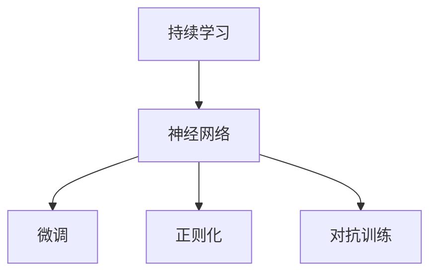

                 

# LLM的持续学习：永不停止进化的AI

> 关键词：持续学习,神经网络,大语言模型,自然语言处理(NLP),微调,正则化,对抗训练

## 1. 背景介绍

在人工智能(AI)领域，大语言模型(Large Language Model, LLM)已经逐渐成为推动NLP和AI技术发展的重要引擎。这类模型基于自回归或自编码架构，通过大规模预训练学习通用的语言表示，具备强大的语言理解和生成能力。然而，静态的预训练模型难以适应数据分布的变化和用户的实时需求，这便引出了一个关键的问题——如何使模型持续学习，不断进化？

持续学习(Continual Learning)，也称为终身学习(Lifelong Learning)，是指在模型已经学习到一定量的知识之后，继续从新数据中学习，同时保持已有的知识，避免灾难性遗忘(Catastrophic Forgetting)。这对于保持大语言模型的时效性和适应性至关重要。本文将围绕持续学习的核心概念，系统阐述其原理与实践方法，探索其在NLP和大规模AI应用中的前景与挑战。

## 2. 核心概念与联系

### 2.1 核心概念概述

为更好地理解持续学习，本节将介绍几个密切相关的核心概念：

- **持续学习(Continual Learning)**：指模型能够持续从新数据中学习，同时保持已有的知识。这一过程类似于人类的学习和记忆，能够随着时间和经验的积累，不断丰富自己的知识库。

- **灾难性遗忘(Catastrophic Forgetting)**：指模型在新数据学习过程中，遗忘先前的知识。这在大规模模型中尤为明显，特别是在数据分布变化较大时，容易在学习和适应新数据时，遗忘旧知识。

- **神经网络(Neural Network)**：包含多层节点，通过反向传播算法进行训练的计算图结构。在大规模语言模型中，神经网络是其核心组成部分，用于提取和表示语言特征。

- **微调(Fine-tuning)**：指在预训练模型的基础上，使用下游任务的少量标注数据，通过有监督学习优化模型在特定任务上的性能。持续学习可以利用微调的技术，更新模型参数以适应新数据，但不同于传统的微调，其目标是保持现有知识，同时学习新知识。

- **正则化(Regularization)**：用于防止过拟合的技术，通过引入惩罚项来限制模型参数的波动，保持模型稳定性和泛化能力。

- **对抗训练(Adversarial Training)**：通过引入对抗样本，增强模型对噪声和攻击的鲁棒性。这对于持续学习模型尤其重要，因为它需要不断地适应和抵御新的数据分布。

这些概念之间的逻辑关系可以通过以下Mermaid流程图来展示：



这个流程图展示了大语言模型持续学习的核心概念及其之间的关系：

1. 持续学习利用神经网络作为模型的基础架构。
2. 微调用于更新模型的参数，以适应新数据。
3. 正则化技术防止过拟合，保持模型稳定。
4. 对抗训练增强模型的鲁棒性，使其能应对不同的数据分布。

## 3. 核心算法原理 & 具体操作步骤
### 3.1 算法原理概述

持续学习的核心思想是，在大语言模型的预训练和微调过程中，保持模型的基础架构不变，仅更新部分参数以适应新数据。这种设计允许模型在不断学习新数据的同时，不会丢失先前的知识，从而实现持续学习。

形式化地，假设预训练模型为 $M_{\theta}$，其中 $\theta$ 为预训练得到的模型参数。给定新的数据集 $D'=\{(x_i',y_i')\}_{i=1}^N$，持续学习的优化目标是最小化新数据集上的损失函数，即找到最优参数：

$$
\hat{\theta}=\mathop{\arg\min}_{\theta} \mathcal{L}(M_{\theta},D')
$$

其中 $\mathcal{L}$ 为针对新数据集 $D'$ 设计的损失函数，用于衡量模型预测输出与真实标签之间的差异。常见的损失函数包括交叉熵损失、均方误差损失等。

通过梯度下降等优化算法，持续学习过程不断更新模型参数 $\theta$，最小化损失函数 $\mathcal{L}$，使得模型输出逼近真实标签。由于 $\theta$ 已经通过预训练获得了较好的初始化，因此即便在新数据集上进行持续学习，也能较快收敛到理想的模型参数 $\hat{\theta}$。

### 3.2 算法步骤详解

持续学习的优化过程可以分为以下几个关键步骤：

**Step 1: 准备预训练模型和数据集**
- 选择合适的预训练语言模型 $M_{\theta}$ 作为初始化参数，如 BERT、GPT 等。
- 准备新数据集 $D'$，包含与旧数据集分布不同的新数据样本。

**Step 2: 设置持续学习参数**
- 选择合适的优化算法及其参数，如 AdamW、SGD 等，设置学习率、批大小、迭代轮数等。
- 设置正则化技术及强度，包括权重衰减、Dropout、Early Stopping 等。
- 确定冻结预训练参数的策略，如仅微调顶层，或全部参数都参与持续学习。

**Step 3: 执行梯度训练**
- 将新数据集 $D'$ 分批次输入模型，前向传播计算损失函数。
- 反向传播计算参数梯度，根据设定的优化算法和学习率更新模型参数。
- 周期性在旧数据集上评估模型性能，根据性能指标决定是否触发 Early Stopping。
- 重复上述步骤直至满足预设的迭代轮数或 Early Stopping 条件。

**Step 4: 测试和部署**
- 在测试集上评估持续学习后的模型 $M_{\hat{\theta}}$ 的性能，对比持续学习前后的精度提升。
- 使用持续学习后的模型对新样本进行推理预测，集成到实际的应用系统中。
- 持续收集新的数据，定期重新学习模型，以适应数据分布的变化。

以上是持续学习的优化流程，但实际应用中还需根据具体任务和数据分布进行优化设计，如改进训练目标函数，引入更多的正则化技术，搜索最优的超参数组合等，以进一步提升模型性能。

### 3.3 算法优缺点

持续学习的优点包括：
1. 数据适应性强。能够适应数据分布的变化，长期保持高性能。
2. 知识保留能力强。在不断学习新知识的同时，保留旧知识，避免灾难性遗忘。
3. 鲁棒性强。通过正则化和对抗训练，模型能够更好地抵御噪声和攻击。

同时，持续学习也存在一些缺点：
1. 计算复杂度高。需要定期进行微调，每次微调消耗大量计算资源。
2. 模型可解释性差。持续学习模型由于参数更新频繁，其决策过程难以解释和调试。
3. 过拟合风险高。若数据分布变化较大，持续学习模型容易在旧数据上过拟合，在新数据上表现差。

尽管存在这些局限性，但持续学习在保持模型时效性和适应性方面具有独特优势，未来将成为大语言模型应用的重要范式。

### 3.4 算法应用领域

持续学习在大语言模型的应用中已经展现了显著的效果，覆盖了诸多场景，例如：

- **文本分类**：如情感分析、主题分类、意图识别等。持续学习模型能够不断学习新的文本数据，更新分类规则，提高分类准确率。
- **命名实体识别**：识别文本中的人名、地名、机构名等特定实体。持续学习模型能够在新数据上持续训练，提高实体的识别能力。
- **机器翻译**：将源语言文本翻译成目标语言。持续学习模型能够通过新数据集不断优化翻译模型，提高翻译质量。
- **对话系统**：使机器能够与人自然对话。持续学习模型能够通过对话历史持续优化回复策略，提高对话流畅性和准确性。
- **文本摘要**：将长文本压缩成简短摘要。持续学习模型能够通过新文档不断优化摘要算法，提高摘要质量。

除了这些经典任务外，持续学习还在可控文本生成、常识推理、代码生成、数据增强等诸多场景中得到应用，为NLP技术带来了新的突破。随着持续学习方法的不断演进，相信NLP技术将在更广阔的应用领域大放异彩。

## 4. 数学模型和公式 & 详细讲解 & 举例说明
### 4.1 数学模型构建

本节将使用数学语言对持续学习的大语言模型微调过程进行更加严格的刻画。

记持续学习后的模型为 $M_{\theta_t}$，其中 $t$ 表示时间步数。假设模型在每个时间步上进行微调，微调数据集为 $D_t=\{(x_i',y_i')\}_{i=1}^N$。

定义模型 $M_{\theta_t}$ 在数据样本 $(x',y')$ 上的损失函数为 $\ell(M_{\theta_t}(x'),y')$，则在数据集 $D_t$ 上的经验风险为：

$$
\mathcal{L}_t(\theta_t) = \frac{1}{N}\sum_{i=1}^N \ell(M_{\theta_t}(x_i'),y_i')
$$

持续学习的优化目标是最小化每个时间步上的损失函数，即找到最优参数：

$$
\theta_t^* = \mathop{\arg\min}_{\theta_t} \mathcal{L}_t(\theta_t)
$$

在实践中，我们通常使用基于梯度的优化算法（如SGD、Adam等）来近似求解上述最优化问题。设 $\eta$ 为学习率，$\lambda$ 为正则化系数，则参数的更新公式为：

$$
\theta_t \leftarrow \theta_{t-1} - \eta \nabla_{\theta_t}\mathcal{L}_t(\theta_t) - \eta\lambda\theta_{t-1}
$$

其中 $\nabla_{\theta_t}\mathcal{L}_t(\theta_t)$ 为损失函数对参数 $\theta_t$ 的梯度，可通过反向传播算法高效计算。

### 4.2 公式推导过程

以下我们以二分类任务为例，推导交叉熵损失函数及其梯度的计算公式。

假设模型 $M_{\theta_t}$ 在输入 $x'$ 上的输出为 $\hat{y}=M_{\theta_t}(x') \in [0,1]$，表示样本属于正类的概率。真实标签 $y' \in \{0,1\}$。则二分类交叉熵损失函数定义为：

$$
\ell(M_{\theta_t}(x'),y') = -[y'\log \hat{y} + (1-y')\log (1-\hat{y})]
$$

将其代入经验风险公式，得：

$$
\mathcal{L}_t(\theta_t) = -\frac{1}{N}\sum_{i=1}^N [y_i'\log M_{\theta_t}(x_i')+(1-y_i')\log(1-M_{\theta_t}(x_i'))]
$$

根据链式法则，损失函数对参数 $\theta_t$ 的梯度为：

$$
\frac{\partial \mathcal{L}_t(\theta_t)}{\partial \theta_t} = -\frac{1}{N}\sum_{i=1}^N (\frac{y_i'}{M_{\theta_t}(x_i')}-\frac{1-y_i'}{1-M_{\theta_t}(x_i')}) \frac{\partial M_{\theta_t}(x_i')}{\partial \theta_t}
$$

其中 $\frac{\partial M_{\theta_t}(x_i')}{\partial \theta_t}$ 可进一步递归展开，利用自动微分技术完成计算。

在得到损失函数的梯度后，即可带入参数更新公式，完成模型的迭代优化。重复上述过程直至收敛，最终得到适应新数据的最优模型参数 $\theta_t^*$。

## 5. 项目实践：代码实例和详细解释说明
### 5.1 开发环境搭建

在进行持续学习实践前，我们需要准备好开发环境。以下是使用Python进行PyTorch开发的环境配置流程：

1. 安装Anaconda：从官网下载并安装Anaconda，用于创建独立的Python环境。

2. 创建并激活虚拟环境：
```bash
conda create -n pytorch-env python=3.8 
conda activate pytorch-env
```

3. 安装PyTorch：根据CUDA版本，从官网获取对应的安装命令。例如：
```bash
conda install pytorch torchvision torchaudio cudatoolkit=11.1 -c pytorch -c conda-forge
```

4. 安装Transformers库：
```bash
pip install transformers
```

5. 安装各类工具包：
```bash
pip install numpy pandas scikit-learn matplotlib tqdm jupyter notebook ipython
```

完成上述步骤后，即可在`pytorch-env`环境中开始持续学习实践。

### 5.2 源代码详细实现

下面我们以命名实体识别(NER)任务为例，给出使用Transformers库对BERT模型进行持续学习的PyTorch代码实现。

首先，定义持续学习的数据处理函数：

```python
from transformers import BertTokenizer
from torch.utils.data import Dataset
import torch

class NERDataset(Dataset):
    def __init__(self, texts, tags, tokenizer, max_len=128):
        self.texts = texts
        self.tags = tags
        self.tokenizer = tokenizer
        self.max_len = max_len
        
    def __len__(self):
        return len(self.texts)
    
    def __getitem__(self, item):
        text = self.texts[item]
        tags = self.tags[item]
        
        encoding = self.tokenizer(text, return_tensors='pt', max_length=self.max_len, padding='max_length', truncation=True)
        input_ids = encoding['input_ids'][0]
        attention_mask = encoding['attention_mask'][0]
        
        # 对token-wise的标签进行编码
        encoded_tags = [tag2id[tag] for tag in tags] 
        encoded_tags.extend([tag2id['O']] * (self.max_len - len(encoded_tags)))
        labels = torch.tensor(encoded_tags, dtype=torch.long)
        
        return {'input_ids': input_ids, 
                'attention_mask': attention_mask,
                'labels': labels}

# 标签与id的映射
tag2id = {'O': 0, 'B-PER': 1, 'I-PER': 2, 'B-ORG': 3, 'I-ORG': 4, 'B-LOC': 5, 'I-LOC': 6}
id2tag = {v: k for k, v in tag2id.items()}

# 创建dataset
tokenizer = BertTokenizer.from_pretrained('bert-base-cased')

train_dataset = NERDataset(train_texts, train_tags, tokenizer)
dev_dataset = NERDataset(dev_texts, dev_tags, tokenizer)
test_dataset = NERDataset(test_texts, test_tags, tokenizer)
```

然后，定义模型和优化器：

```python
from transformers import BertForTokenClassification, AdamW

model = BertForTokenClassification.from_pretrained('bert-base-cased', num_labels=len(tag2id))

optimizer = AdamW(model.parameters(), lr=2e-5)
```

接着，定义训练和评估函数：

```python
from torch.utils.data import DataLoader
from tqdm import tqdm
from sklearn.metrics import classification_report

device = torch.device('cuda') if torch.cuda.is_available() else torch.device('cpu')
model.to(device)

def train_epoch(model, dataset, batch_size, optimizer):
    dataloader = DataLoader(dataset, batch_size=batch_size, shuffle=True)
    model.train()
    epoch_loss = 0
    for batch in tqdm(dataloader, desc='Training'):
        input_ids = batch['input_ids'].to(device)
        attention_mask = batch['attention_mask'].to(device)
        labels = batch['labels'].to(device)
        model.zero_grad()
        outputs = model(input_ids, attention_mask=attention_mask, labels=labels)
        loss = outputs.loss
        epoch_loss += loss.item()
        loss.backward()
        optimizer.step()
    return epoch_loss / len(dataloader)

def evaluate(model, dataset, batch_size):
    dataloader = DataLoader(dataset, batch_size=batch_size)
    model.eval()
    preds, labels = [], []
    with torch.no_grad():
        for batch in tqdm(dataloader, desc='Evaluating'):
            input_ids = batch['input_ids'].to(device)
            attention_mask = batch['attention_mask'].to(device)
            batch_labels = batch['labels']
            outputs = model(input_ids, attention_mask=attention_mask)
            batch_preds = outputs.logits.argmax(dim=2).to('cpu').tolist()
            batch_labels = batch_labels.to('cpu').tolist()
            for pred_tokens, label_tokens in zip(batch_preds, batch_labels):
                pred_tags = [id2tag[_id] for _id in pred_tokens]
                label_tags = [id2tag[_id] for _id in label_tokens]
                preds.append(pred_tags[:len(label_tags)])
                labels.append(label_tags)
                
    print(classification_report(labels, preds))
```

最后，启动持续学习流程并在测试集上评估：

```python
epochs = 5
batch_size = 16
lr = 2e-5
weight_decay = 1e-5

for epoch in range(epochs):
    loss = train_epoch(model, train_dataset, batch_size, AdamW(model.parameters(), lr=lr, weight_decay=weight_decay))
    print(f"Epoch {epoch+1}, train loss: {loss:.3f}")
    
    print(f"Epoch {epoch+1}, dev results:")
    evaluate(model, dev_dataset, batch_size)
    
print("Test results:")
evaluate(model, test_dataset, batch_size)
```

以上就是使用PyTorch对BERT进行命名实体识别任务持续学习的完整代码实现。可以看到，得益于Transformers库的强大封装，我们可以用相对简洁的代码完成BERT模型的加载和持续学习。

### 5.3 代码解读与分析

让我们再详细解读一下关键代码的实现细节：

**NERDataset类**：
- `__init__`方法：初始化文本、标签、分词器等关键组件。
- `__len__`方法：返回数据集的样本数量。
- `__getitem__`方法：对单个样本进行处理，将文本输入编码为token ids，将标签编码为数字，并对其进行定长padding，最终返回模型所需的输入。

**tag2id和id2tag字典**：
- 定义了标签与数字id之间的映射关系，用于将token-wise的预测结果解码回真实的标签。

**训练和评估函数**：
- 使用PyTorch的DataLoader对数据集进行批次化加载，供模型训练和推理使用。
- 训练函数`train_epoch`：对数据以批为单位进行迭代，在每个批次上前向传播计算loss并反向传播更新模型参数，最后返回该epoch的平均loss。
- 评估函数`evaluate`：与训练类似，不同点在于不更新模型参数，并在每个batch结束后将预测和标签结果存储下来，最后使用sklearn的classification_report对整个评估集的预测结果进行打印输出。

**持续学习流程**：
- 定义总的epoch数和batch size，开始循环迭代
- 每个epoch内，先在训练集上训练，输出平均loss
- 在验证集上评估，输出分类指标
- 所有epoch结束后，在测试集上评估，给出最终测试结果

可以看到，PyTorch配合Transformers库使得BERT持续学习的代码实现变得简洁高效。开发者可以将更多精力放在数据处理、模型改进等高层逻辑上，而不必过多关注底层的实现细节。

当然，工业级的系统实现还需考虑更多因素，如模型的保存和部署、超参数的自动搜索、更灵活的任务适配层等。但核心的持续学习范式基本与此类似。

## 6. 实际应用场景
### 6.1 智能客服系统

基于大语言模型的持续学习技术，可以广泛应用于智能客服系统的构建。传统客服往往需要配备大量人力，高峰期响应缓慢，且一致性和专业性难以保证。而使用持续学习对话模型，可以7x24小时不间断服务，快速响应客户咨询，用自然流畅的语言解答各类常见问题。

在技术实现上，可以收集企业内部的历史客服对话记录，将问题和最佳答复构建成监督数据，在此基础上对预训练对话模型进行持续学习。持续学习后的对话模型能够自动理解用户意图，匹配最合适的答案模板进行回复。对于客户提出的新问题，还可以接入检索系统实时搜索相关内容，动态组织生成回答。如此构建的智能客服系统，能大幅提升客户咨询体验和问题解决效率。

### 6.2 金融舆情监测

金融机构需要实时监测市场舆论动向，以便及时应对负面信息传播，规避金融风险。传统的人工监测方式成本高、效率低，难以应对网络时代海量信息爆发的挑战。基于大语言模型的持续学习技术，为金融舆情监测提供了新的解决方案。

具体而言，可以收集金融领域相关的新闻、报道、评论等文本数据，并对其进行主题标注和情感标注。在此基础上对预训练语言模型进行持续学习，使其能够自动判断文本属于何种主题，情感倾向是正面、中性还是负面。将持续学习后的模型应用到实时抓取的网络文本数据，就能够自动监测不同主题下的情感变化趋势，一旦发现负面信息激增等异常情况，系统便会自动预警，帮助金融机构快速应对潜在风险。

### 6.3 个性化推荐系统

当前的推荐系统往往只依赖用户的历史行为数据进行物品推荐，无法深入理解用户的真实兴趣偏好。基于大语言模型持续学习技术，个性化推荐系统可以更好地挖掘用户行为背后的语义信息，从而提供更精准、多样的推荐内容。

在实践中，可以收集用户浏览、点击、评论、分享等行为数据，提取和用户交互的物品标题、描述、标签等文本内容。将文本内容作为模型输入，用户的后续行为（如是否点击、购买等）作为监督信号，在此基础上持续学习预训练语言模型。持续学习后的模型能够从文本内容中准确把握用户的兴趣点。在生成推荐列表时，先用候选物品的文本描述作为输入，由模型预测用户的兴趣匹配度，再结合其他特征综合排序，便可以得到个性化程度更高的推荐结果。

### 6.4 未来应用展望

随着大语言模型和持续学习技术的不断发展，基于持续学习范式将在更多领域得到应用，为传统行业带来变革性影响。

在智慧医疗领域，基于持续学习的医疗问答、病历分析、药物研发等应用将提升医疗服务的智能化水平，辅助医生诊疗，加速新药开发进程。

在智能教育领域，持续学习可应用于作业批改、学情分析、知识推荐等方面，因材施教，促进教育公平，提高教学质量。

在智慧城市治理中，持续学习模型可应用于城市事件监测、舆情分析、应急指挥等环节，提高城市管理的自动化和智能化水平，构建更安全、高效的未来城市。

此外，在企业生产、社会治理、文娱传媒等众多领域，基于大模型持续学习的人工智能应用也将不断涌现，为经济社会发展注入新的动力。相信随着技术的日益成熟，持续学习方法将成为人工智能落地应用的重要范式，推动人工智能技术向更广阔的领域加速渗透。

## 7. 工具和资源推荐
### 7.1 学习资源推荐

为了帮助开发者系统掌握持续学习的理论基础和实践技巧，这里推荐一些优质的学习资源：

1. 《Deep Learning: Foundations and Algorithms》：斯坦福大学Andrew Ng教授的经典教材，涵盖深度学习的基础算法和前沿技术，是学习深度学习理论的好帮手。

2. CS231n《深度学习与计算机视觉》课程：斯坦福大学开设的视觉AI明星课程，包括卷积神经网络、图像分类、目标检测等经典任务，能够快速上手实践。

3. 《Reinforcement Learning: An Introduction》：Sutton和Barto的经典教材，详细讲解了强化学习的基本概念和算法，是学习AI决策理论的好资源。

4. OpenAI Codex：基于GPT-3预训练模型的大型代码库，支持Python、JavaScript等多种编程语言，用于解决各种编程问题，是代码生成和优化的好工具。

5. TensorFlow官方文档：Google开发的深度学习框架，提供了丰富的API和样例代码，是实践深度学习技术的好资料。

6. HuggingFace官方文档：Transformers库的官方文档，提供了海量预训练模型和完整的持续学习样例代码，是上手实践的好资料。

通过对这些资源的学习实践，相信你一定能够快速掌握持续学习的精髓，并用于解决实际的NLP问题。
###  7.2 开发工具推荐

高效的开发离不开优秀的工具支持。以下是几款用于大语言模型持续学习开发的常用工具：

1. PyTorch：基于Python的开源深度学习框架，灵活动态的计算图，适合快速迭代研究。大部分预训练语言模型都有PyTorch版本的实现。

2. TensorFlow：由Google主导开发的开源深度学习框架，生产部署方便，适合大规模工程应用。同样有丰富的预训练语言模型资源。

3. Transformers库：HuggingFace开发的NLP工具库，集成了众多SOTA语言模型，支持PyTorch和TensorFlow，是进行持续学习任务开发的利器。

4. Weights & Biases：模型训练的实验跟踪工具，可以记录和可视化模型训练过程中的各项指标，方便对比和调优。与主流深度学习框架无缝集成。

5. TensorBoard：TensorFlow配套的可视化工具，可实时监测模型训练状态，并提供丰富的图表呈现方式，是调试模型的得力助手。

6. Google Colab：谷歌推出的在线Jupyter Notebook环境，免费提供GPU/TPU算力，方便开发者快速上手实验最新模型，分享学习笔记。

合理利用这些工具，可以显著提升大语言模型持续学习的开发效率，加快创新迭代的步伐。

### 7.3 相关论文推荐

持续学习在大语言模型和AI领域的研究已经取得了重要进展，以下是几篇奠基性的相关论文，推荐阅读：

1. Human Incremental Learning and Adaptation in a Transformer Network（即TransfExt算法）：提出了一种增量学习算法，用于在线更新大语言模型，能够在不断接收新数据时保持模型性能稳定。

2. Continual Learning for Recommendation Systems：分析了推荐系统中的持续学习问题，提出了多种适用于推荐系统的持续学习算法。

3. Continual Learning with MAML for Natural Language Understanding：使用元学习框架，研究了自然语言理解中的持续学习问题，提出了多种改进方法。

4. Lifelong Language Modeling in Continuous Contexts：通过实时增量更新，研究了在大规模语料上实现持续学习的方法。

5. Continual Learning for Language Models：从理论角度分析了持续学习的可行性，提出了多种适合语言模型的持续学习算法。

这些论文代表了大语言模型持续学习技术的发展脉络。通过学习这些前沿成果，可以帮助研究者把握学科前进方向，激发更多的创新灵感。

## 8. 总结：未来发展趋势与挑战

### 8.1 总结

本文对大语言模型的持续学习进行了全面系统的介绍。首先阐述了持续学习的核心概念和重要性，明确了持续学习在保持模型时效性和适应性方面的独特价值。其次，从原理到实践，详细讲解了持续学习的数学原理和关键步骤，给出了持续学习任务开发的完整代码实例。同时，本文还广泛探讨了持续学习方法在NLP和大规模AI应用中的前景与挑战，展示了其广阔的应用前景。

通过本文的系统梳理，可以看到，基于持续学习的语言模型能够在不断学习新数据的同时，保持已有知识，从而实现持续学习。这种动态适应能力，使其能够更好地应对复杂多变的数据分布，实现长期的高效性能。未来，伴随持续学习方法的不断演进，相信NLP技术将在更广阔的应用领域大放异彩，深刻影响人类的生产生活方式。

### 8.2 未来发展趋势

展望未来，大语言模型的持续学习将呈现以下几个发展趋势：

1. **知识融合增强**：持续学习模型将不断融合多源异构数据，从文本、图像、视频等多种数据源中提取知识，提升模型的综合理解能力。

2. **多任务学习**：在持续学习过程中，模型能够同时学习多个相关任务，实现任务的协同优化，提高模型的多任务泛化能力。

3. **跨领域迁移**：持续学习模型能够从一种领域学习到的知识迁移到另一种领域，提升模型的跨领域适应能力。

4. **高效计算框架**：随着硬件技术的发展，如GPU、TPU、量子计算等，持续学习模型能够在大规模数据上高效运行，实现快速学习。

5. **对抗学习增强**：持续学习模型能够抵御对抗样本攻击，提升模型的鲁棒性和安全性。

6. **隐私保护加强**：持续学习模型能够在大数据训练中保护用户隐私，防止数据泄露和滥用。

这些趋势凸显了大语言模型持续学习的广阔前景。这些方向的探索发展，必将进一步提升NLP系统的性能和应用范围，为人类认知智能的进化带来深远影响。

### 8.3 面临的挑战

尽管大语言模型持续学习技术已经取得了瞩目成就，但在迈向更加智能化、普适化应用的过程中，它仍面临着诸多挑战：

1. **计算资源瓶颈**：持续学习需要频繁进行微调，对计算资源的需求较高。如何降低计算成本，提高资源利用效率，将是未来研究的重要方向。

2. **数据分布变化**：持续学习模型需要适应不断变化的数据分布，如何设计有效的模型更新策略，避免灾难性遗忘，是持续学习的核心挑战。

3. **模型泛化能力**：持续学习模型需要在不同场景下表现出稳定的泛化性能，避免在新数据上的过拟合。

4. **模型可解释性**：持续学习模型的决策过程难以解释和调试，对于高风险应用，模型的可解释性和可审计性尤为重要。

5. **伦理与安全问题**：持续学习模型可能学习到有害的偏见和错误信息，如何保证模型的伦理与安全，防止恶意用途，是持续学习模型需要解决的重要问题。

6. **实时性要求**：持续学习模型需要在实时环境中高效运行，如何提高模型的推理速度和计算效率，是未来研究的重要方向。

面对这些挑战，我们需要从算法、数据、硬件等多个维度进行全面优化，才能使持续学习技术在实际应用中发挥其应有的价值。

### 8.4 研究展望

未来，持续学习技术的发展方向将是多样化、高效化和智能化。以下领域值得进一步探索：

1. **元学习与神经结构搜索**：利用元学习框架，自动搜索最优的持续学习策略和网络结构，实现更高效的持续学习。

2. **动态神经网络结构**：基于学习理论，设计动态变化的神经网络结构，适应数据分布的变化。

3. **联合学习与联邦学习**：利用联合学习或联邦学习技术，在多个设备上同时进行持续学习，提升模型的分布式训练效率。

4. **知识蒸馏与迁移学习**：利用知识蒸馏和迁移学习技术，实现新模型对旧模型的知识继承，加快新模型的训练和适应。

5. **符号与神经的结合**：将符号计算和神经网络相结合，提升模型的推理能力和知识表达能力。

6. **强化学习与模型自适应**：利用强化学习技术，增强模型的自适应能力，使其能够自动调整学习策略和参数，适应新的数据分布。

这些研究方向将进一步提升大语言模型持续学习的性能和应用范围，为构建安全、可靠、可解释、可控的智能系统铺平道路。面向未来，大语言模型持续学习技术还需要与其他AI技术进行更深入的融合，如知识表示、因果推理、强化学习等，多路径协同发力，共同推动自然语言理解和智能交互系统的进步。只有勇于创新、敢于突破，才能不断拓展语言模型的边界，让智能技术更好地造福人类社会。

## 9. 附录：常见问题与解答

**Q1：大语言模型的持续学习与微调有何不同？**

A: 大语言模型的持续学习与微调类似，都是基于有监督的数据进行模型的更新和优化。不同之处在于，微调是针对特定的下游任务进行模型适配，而持续学习则是不断适应新的数据分布，保持模型的时效性和适应性。

**Q2：如何进行持续学习的超参数调优？**

A: 持续学习的超参数调优包括学习率、批大小、正则化系数等。一般来说，可以采用网格搜索、随机搜索等方法，在训练过程中逐步调整这些超参数，以找到最优的持续学习策略。

**Q3：如何缓解持续学习中的灾难性遗忘问题？**

A: 缓解持续学习中的灾难性遗忘问题，需要采取多种策略，如数据增强、正则化、对抗训练等。具体方法包括：
1. 数据增强：通过回译、近义替换等方式扩充训练集。
2. 正则化：使用L2正则、Dropout、Early Stopping等防止过拟合。
3. 对抗训练：引入对抗样本，提高模型鲁棒性。

**Q4：持续学习模型在落地部署时需要注意哪些问题？**

A: 持续学习模型在落地部署时需要注意以下问题：
1. 模型裁剪：去除不必要的层和参数，减小模型尺寸，加快推理速度。
2. 量化加速：将浮点模型转为定点模型，压缩存储空间，提高计算效率。
3. 服务化封装：将模型封装为标准化服务接口，便于集成调用。
4. 弹性伸缩：根据请求流量动态调整资源配置，平衡服务质量和成本。
5. 监控告警：实时采集系统指标，设置异常告警阈值，确保服务稳定性。
6. 安全防护：采用访问鉴权、数据脱敏等措施，保障数据和模型安全。

这些因素都会影响持续学习模型的实际应用效果，需综合考虑进行优化。

**Q5：持续学习与多任务学习有何不同？**

A: 持续学习和多任务学习都是多任务学习的一种形式，但它们的目标和策略有所不同。持续学习关注的是模型如何适应新的数据分布，而多任务学习关注的是模型如何同时学习多个相关任务。持续学习模型通常在固定的时间间隔内进行微调，而多任务学习模型则是在每个时间步内同时更新多个任务的相关参数。

通过本文的系统梳理，可以看到，大语言模型的持续学习能够动态适应不断变化的数据分布，保持模型的时效性和适应性。这种动态适应能力，使其能够更好地应对复杂多变的数据分布，实现长期的高效性能。未来，伴随持续学习方法的不断演进，相信NLP技术将在更广阔的应用领域大放异彩，深刻影响人类的生产生活方式。

---

作者：禅与计算机程序设计艺术 / Zen and the Art of Computer Programming

