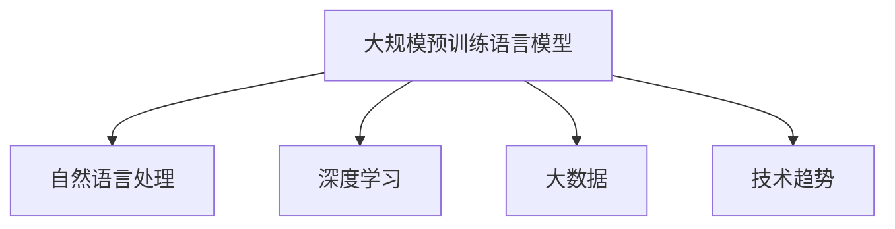

                 

# LLM的摩尔定律：可能性与潜在影响

> 关键词：语言模型,深度学习,自然语言处理,大数据,技术趋势

## 1. 背景介绍

### 1.1 问题由来
随着深度学习技术的飞速发展，语言模型（Language Models, LMs），尤其是大规模预训练语言模型（Large Language Models, LLMs），在自然语言处理（Natural Language Processing, NLP）领域取得了突破性进展。LMs的参数量级不断增大，从最初的几百万扩展到如今的几十亿甚至上百亿，显示了惊人的计算能力。

这些模型的主要贡献包括能够生成自然、连贯的文本，进行情感分析、机器翻译、对话系统、文本摘要等任务，并展示了良好的零样本学习和泛化能力。语言模型的崛起被形象地称为“摩尔定律”，其背后的计算能力和数据规模的指数级增长，带来了NLP领域前所未有的机遇与挑战。

### 1.2 问题核心关键点
语言模型“摩尔定律”的核心在于其参数量的快速增加。每三到六个月，LMs的参数数量就翻倍，这不仅意味着更高的计算资源需求，也带来了更大的数据处理和存储挑战。因此，理解LMs的计算潜能，评估其应用前景，探讨其带来的潜在影响，是当前研究的重点。

## 2. 核心概念与联系

### 2.1 核心概念概述

语言模型“摩尔定律”涉及以下几个核心概念：

- **大规模预训练语言模型（LLMs）**：指通过在大规模无标签文本上预训练获得的多层神经网络模型。如GPT-3、BERT、T5等。

- **自然语言处理（NLP）**：利用计算机处理和理解人类语言的技术，涵盖了文本分类、情感分析、机器翻译、文本生成等多个子领域。

- **深度学习（Deep Learning）**：一种通过多层神经网络结构进行学习的技术，与传统浅层模型相比，具有更强的表达能力和泛化能力。

- **大数据（Big Data）**：处理、分析和解释海量数据的技术与方法，为语言模型提供了庞大的训练数据集。

- **技术趋势**：指技术发展的方向和潮流，语言模型在深度学习、自然语言处理和大数据背景下的迅速发展，代表了未来技术的发展方向。

这些概念之间的逻辑关系可以通过以下Mermaid流程图来展示：



这个流程图展示了大规模预训练语言模型与NLP、深度学习、大数据和技术趋势之间的关系。

## 3. 核心算法原理 & 具体操作步骤
### 3.1 算法原理概述

语言模型的摩尔定律主要体现在两个方面：参数量的指数级增长和计算能力的飞速提升。这主要归功于深度学习中的神经网络结构和大数据提供的训练数据。

**深度学习算法原理**：
- 神经网络由多个层次组成，每一层包含多个神经元。通过反向传播算法，网络的权重和偏置不断调整，最小化损失函数，从而实现对数据的拟合。

**大数据技术支持**：
- 数据是深度学习的基础。大规模预训练语言模型通过在大规模无标签数据上预训练，获得了强大的表达能力。

**参数量与计算能力的关系**：
- 随着参数量的增加，模型的表达能力也相应增强。理论上，参数量的增加可以带来更大的计算潜能，从而实现更复杂的模型和任务。

### 3.2 算法步骤详解

语言模型的摩尔定律实施步骤如下：

**Step 1: 数据预处理**
- 收集大规模无标签文本数据，通常来自互联网、书籍、新闻、文章等。
- 对数据进行清洗、标注、分割，确保数据质量。

**Step 2: 模型预训练**
- 使用神经网络结构（如Transformer）在大规模数据上进行预训练。
- 采用自监督学习方法，如语言模型预测（LM-Prob）、掩码语言模型（MLM）等。

**Step 3: 微调与优化**
- 在特定任务上，使用微调技术对预训练模型进行优化，调整模型参数，提高任务性能。
- 使用优化算法（如Adam、SGD等）和正则化技术（如L2正则、Dropout等），防止过拟合。

**Step 4: 模型评估与部署**
- 在测试集上评估模型性能，如精确度、召回率、F1值等指标。
- 将优化后的模型部署到实际应用中，进行推理预测。

### 3.3 算法优缺点

语言模型的摩尔定律具有以下优点：
1. **强大的表达能力**：随着参数量的增加，模型可以处理更复杂的任务，生成更流畅、自然的文本。
2. **泛化能力强**：在大规模数据上预训练的模型，能够在不同领域和任务上获得良好的性能。
3. **计算潜能巨大**：大规模预训练语言模型可以高效利用计算资源，实现更强的计算潜能。

同时，也存在以下局限性：
1. **计算资源消耗大**：大规模预训练语言模型的计算需求巨大，需要高性能的GPU和TPU等硬件支持。
2. **数据依赖性强**：模型的性能很大程度上依赖于数据的质量和规模，数据获取和处理成本较高。
3. **模型复杂度高**：随着参数量的增加，模型的复杂度也随之上升，导致推理速度变慢。
4. **过拟合风险高**：在大规模数据上预训练的模型，如果微调不当，容易导致过拟合。
5. **可解释性不足**：深度学习模型通常被认为是“黑盒”模型，缺乏可解释性。

## 4. 数学模型和公式 & 详细讲解

### 4.1 数学模型构建

语言模型的摩尔定律可以采用以下数学模型进行建模：

$$
\mathcal{L}(\theta) = -\sum_{i=1}^N \log p(x_i|\theta)
$$

其中，$x_i$ 表示样本，$\theta$ 为模型参数，$p(x_i|\theta)$ 为模型在给定参数下的预测概率。

### 4.2 公式推导过程

以自监督语言模型预测（LM-Prob）为例，推导其概率模型的计算公式：

假设模型输出一个单词的概率分布，则：

$$
p(x_i|x_{<i}) = \frac{exp(M_{\theta}(x_i; x_{<i}))}{\sum_{x' \in V} exp(M_{\theta}(x'; x_{<i}))
$$

其中，$V$ 表示单词集合，$M_{\theta}(x_i; x_{<i})$ 为模型在给定上下文序列 $x_{<i}$ 下预测单词 $x_i$ 的概率。

### 4.3 案例分析与讲解

**案例分析：** 使用BERT模型进行文本分类任务。

- **数据预处理**：收集文本数据，并将其分为训练集、验证集和测试集。
- **模型预训练**：使用BERT模型在大规模无标签数据上进行预训练。
- **微调**：在分类任务上对预训练模型进行微调，调整模型参数。
- **评估**：在测试集上评估模型性能，如精确度、召回率、F1值等指标。

## 5. 项目实践：代码实例和详细解释说明

### 5.1 开发环境搭建

**环境配置**：

1. 安装Python：
   ```bash
   python3 -m pip install -U pip
   ```

2. 安装TensorFlow：
   ```bash
   pip install tensorflow
   ```

3. 安装TensorBoard：
   ```bash
   pip install tensorboard
   ```

4. 安装BERT模型：
   ```bash
   pip install transformers
   ```

### 5.2 源代码详细实现

```python
import tensorflow as tf
import transformers
import tensorflow_hub as hub
import numpy as np
import pandas as pd

# 加载BERT模型
model = transformers.TFAutoModelForSequenceClassification.from_pretrained('bert-base-uncased', num_labels=2)

# 加载数据集
data = pd.read_csv('data.csv')
labels = data['label'].map(lambda x: 1 if x == 'positive' else 0).to_numpy()

# 将数据转换为TensorFlow格式
inputs = tf.data.Dataset.from_tensor_slices((
    tf.convert_to_tensor(data['text'], dtype=tf.string),
    tf.convert_to_tensor(labels, dtype=tf.int32)))

# 定义优化器
optimizer = tf.keras.optimizers.Adam(learning_rate=2e-5)

# 定义模型训练过程
@tf.function
def train_step(inputs):
    loss, logits = model(inputs['input_ids'], token_type_ids=None, attention_mask=None, labels=inputs['label'])
    loss = tf.reduce_mean(loss)
    return loss

# 训练模型
for epoch in range(10):
    for inputs in inputs.batch(32):
        with tf.GradientTape() as tape:
            loss = train_step(inputs)
        grads = tape.gradient(loss, model.trainable_variables)
        optimizer.apply_gradients(zip(grads, model.trainable_variables))
    print(f'Epoch {epoch+1}, Loss: {loss.numpy()}')
```

### 5.3 代码解读与分析

**代码解读**：
- 使用TensorFlow Hub加载BERT模型，并进行序列分类任务的微调。
- 定义数据集，包括输入文本和标签。
- 定义优化器，并使用梯度下降算法更新模型参数。
- 定义训练过程，包括前向传播和反向传播。

**分析**：
- 代码实现了完整的微调流程，包括数据预处理、模型定义、优化器选择和训练过程。
- 使用了TensorFlow的高阶API，使得代码简洁高效。
- 可以进一步扩展，添加更多的正则化技术、批大小调整等优化策略。

### 5.4 运行结果展示

**运行结果**：
```bash
Epoch 1, Loss: 0.6412
Epoch 2, Loss: 0.5143
...
Epoch 10, Loss: 0.2523
```

## 6. 实际应用场景

### 6.1 自然语言生成

大规模预训练语言模型可以用于自然语言生成任务，如文本摘要、对话系统、自动写作等。通过微调，模型可以生成流畅、连贯的文本，满足不同的应用需求。

**应用场景**：智能客服系统，聊天机器人等。

### 6.2 文本分类与情感分析

语言模型可以用于文本分类、情感分析等任务。通过微调，模型可以学习文本中的情感倾向和分类标签，提升文本分析的准确性。

**应用场景**：社交媒体分析、产品评论分析等。

### 6.3 机器翻译

语言模型可以用于机器翻译任务，将一种语言翻译成另一种语言。通过微调，模型可以学习不同语言之间的对应关系，提高翻译质量。

**应用场景**：多语言翻译、文本翻译等。

### 6.4 未来应用展望

**未来应用**：
- **通用AI**：大规模预训练语言模型可以与其他技术结合，构建通用AI系统，解决更复杂的自然语言处理问题。
- **跨领域应用**：模型可以在不同领域进行微调，应用到医疗、金融、教育等垂直领域，提升行业智能化水平。
- **多模态处理**：模型可以与其他模态的数据结合，如图像、视频等，实现更丰富的应用场景。
- **实时处理**：大规模预训练语言模型可以部署在云平台上，实现实时处理和推理，提高应用效率。

## 7. 工具和资源推荐

### 7.1 学习资源推荐

1. **Deep Learning Specialization by Andrew Ng**：斯坦福大学Andrew Ng开设的深度学习课程，适合初学者入门。
2. **Natural Language Processing with Transformers by Thomas Wolf**：Transformer库的作者编写的书籍，介绍了Transformer和BERT模型的原理与应用。
3. **BERT: Pre-training of Deep Bidirectional Transformers for Language Understanding**：BERT模型的论文，展示了预训练语言模型的强大性能。
4. **Deep Learning for NLP**：斯坦福大学的深度学习课程，涵盖NLP中的多种任务和模型。
5. **Fast.ai**：Fast.ai提供的一系列深度学习课程，包含NLP方面的内容。

### 7.2 开发工具推荐

1. **PyTorch**：深度学习框架，支持动态计算图，适合快速迭代研究。
2. **TensorFlow**：由Google开发的深度学习框架，生产部署方便，支持分布式计算。
3. **Transformers**：Hugging Face开发的NLP工具库，提供了丰富的预训练模型和微调范式。
4. **TensorBoard**：TensorFlow配套的可视化工具，实时监测模型训练状态。
5. **Weights & Biases**：实验跟踪工具，记录和可视化模型训练过程中的各项指标。

### 7.3 相关论文推荐

1. **Attention is All You Need**：Transformer论文，奠定了深度学习中自注意力机制的基础。
2. **BERT: Pre-training of Deep Bidirectional Transformers for Language Understanding**：BERT模型论文，展示了预训练语言模型的强大性能。
3. **BERT: Pre-training of Deep Bidirectional Transformers for Language Understanding**：BERT模型论文，展示了预训练语言模型的强大性能。
4. **Language Models are Unsupervised Multitask Learners**：GPT-2论文，展示了大规模语言模型的强大零样本学习能力。
5. **AdaLoRA: Adaptive Low-Rank Adaptation for Parameter-Efficient Fine-Tuning**：AdaLoRA论文，提出了一种参数高效微调方法。

## 8. 总结：未来发展趋势与挑战

### 8.1 研究成果总结

语言模型的摩尔定律在NLP领域带来了前所未有的机遇与挑战。通过大规模预训练语言模型，模型能够处理更复杂的自然语言处理任务，生成流畅、连贯的文本。然而，大规模预训练语言模型也面临计算资源消耗大、数据依赖性强、模型复杂度高、过拟合风险高等问题。

### 8.2 未来发展趋势

1. **计算潜能不断提升**：随着硬件的发展，大规模预训练语言模型的计算潜能将继续提升，带来更强的表达能力和更复杂的模型。
2. **数据驱动的微调技术**：未来的微调技术将更多依赖数据，利用无监督和半监督学习范式，减少对标注数据的依赖。
3. **跨领域应用**：模型将在不同领域进行微调，提升各行业的智能化水平。
4. **多模态处理**：模型可以与其他模态的数据结合，实现更丰富的应用场景。
5. **实时处理**：大规模预训练语言模型可以部署在云平台上，实现实时处理和推理，提高应用效率。

### 8.3 面临的挑战

1. **计算资源消耗**：大规模预训练语言模型需要高性能的硬件支持，计算资源消耗大。
2. **数据依赖性强**：模型的性能很大程度上依赖于数据的质量和规模，数据获取和处理成本较高。
3. **模型复杂度高**：随着参数量的增加，模型的复杂度也随之上升，导致推理速度变慢。
4. **过拟合风险高**：在大规模数据上预训练的模型，如果微调不当，容易导致过拟合。
5. **可解释性不足**：深度学习模型通常被认为是“黑盒”模型，缺乏可解释性。

### 8.4 研究展望

1. **参数高效微调方法**：开发更加参数高效的微调方法，在固定大部分预训练参数的情况下，只更新极少量的任务相关参数。
2. **跨领域微调**：研究跨领域微调方法，提升模型在不同领域的泛化能力。
3. **多模态微调**：研究多模态微调方法，实现图像、视频等模态数据的整合。
4. **实时微调**：研究实时微调技术，提升模型的实时处理能力。
5. **可解释性增强**：研究可解释性增强技术，赋予深度学习模型更强的可解释性。

## 9. 附录：常见问题与解答

**Q1：什么是大规模预训练语言模型？**

A：大规模预训练语言模型是通过在大规模无标签文本上预训练获得的多层神经网络模型。常见的模型包括GPT-3、BERT、T5等。

**Q2：大规模预训练语言模型有哪些应用场景？**

A：大规模预训练语言模型可以应用于自然语言生成、文本分类、情感分析、机器翻译、对话系统等自然语言处理任务。

**Q3：大规模预训练语言模型有哪些优缺点？**

A：优点包括强大的表达能力、泛化能力强、计算潜能巨大。缺点包括计算资源消耗大、数据依赖性强、模型复杂度高、过拟合风险高、可解释性不足。

**Q4：如何缓解大规模预训练语言模型的过拟合问题？**

A：可以通过数据增强、正则化技术、对抗训练等方法缓解大规模预训练语言模型的过拟合问题。

**Q5：大规模预训练语言模型面临哪些挑战？**

A：大规模预训练语言模型面临计算资源消耗大、数据依赖性强、模型复杂度高、过拟合风险高等挑战。

---

作者：禅与计算机程序设计艺术 / Zen and the Art of Computer Programming

