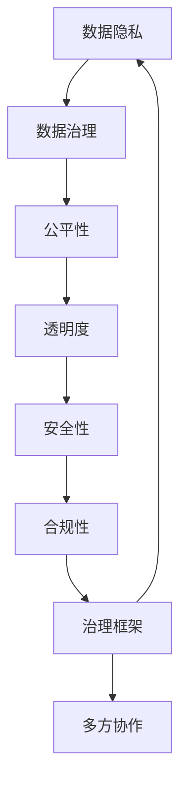

                 

# LLM的监管与治理框架构建

> 关键词：大语言模型(LLM), 数据隐私, 伦理道德, 公平性, 透明度, 安全性, 治理框架, 合规性

## 1. 背景介绍

### 1.1 问题由来
大语言模型(LLM)近年来在自然语言处理(NLP)领域取得了巨大突破。以GPT-3、BERT等模型为代表的大规模预训练模型，通过海量数据训练，具备了强大的语言理解和生成能力。然而，这些模型在带来便利的同时，也引发了一系列监管和治理挑战。

首先，LLM依赖大量数据训练，这些数据可能涉及隐私保护、公平性、伦理道德等多个敏感领域。因此，构建有效的数据治理和隐私保护机制成为必要。其次，LLM的复杂结构和强大的能力，使得模型本身和其输出结果，都面临安全性、透明性、合规性等监管问题。此外，LLM在自然语言交互中的智能行为，如何公平、安全地进行，也需要细致的伦理道德设计。

构建一个全面、系统的LLM监管与治理框架，是应对这些挑战的关键。本文将围绕LLM的监管与治理，详细探讨其核心概念和关键技术，并提出一个基于多方协作的治理框架，以期为相关研究和实践提供参考。

## 2. 核心概念与联系

### 2.1 核心概念概述

构建LLM的监管与治理框架，涉及多个核心概念，包括但不限于：

- **数据隐私**：保护LLM训练和应用过程中涉及的个人和敏感数据，确保其不被非法获取或滥用。
- **伦理道德**：指导LLM的开发、使用和部署，确保其行为符合道德和伦理标准，避免有害影响。
- **公平性**：保证LLM在训练和推理过程中对不同群体和背景的个体保持公正无偏。
- **透明度**：提供模型行为的透明解释，确保用户和监管者了解模型的决策逻辑。
- **安全性**：确保LLM的稳定性和可靠性，防止模型被恶意利用。
- **合规性**：确保LLM的应用符合相关法律法规和行业标准。
- **治理框架**：一套系统化的管理机制，涉及数据治理、模型治理、隐私保护、伦理道德等多个方面，确保LLM的监管与治理有章可循。

这些概念之间相互关联，构成了一个复杂的治理生态系统。其核心目标是，在保障数据隐私、伦理道德、公平性等的基础上，提升LLM的安全性、透明性和合规性，确保其健康、可持续地发展。

### 2.2 核心概念原理和架构的 Mermaid 流程图



这个流程图展示了LLM监管与治理的核心架构。数据隐私是基础，数据治理保障数据的安全和合规使用。公平性、透明度、安全性和合规性是目标，治理框架则是对这些核心概念的系统化管理，多方协作确保了治理框架的落地执行。

## 3. 核心算法原理 & 具体操作步骤

### 3.1 算法原理概述

LLM的监管与治理，涉及多个算法和技术的综合应用。其主要算法原理包括：

1. **数据治理算法**：用于保护和治理LLM训练和应用过程中涉及的数据。包括数据脱敏、数据分割、差分隐私等技术，确保数据在使用过程中不被非法获取或滥用。
2. **伦理道德算法**：指导LLM的开发和使用，确保其行为符合伦理和道德标准。包括模型偏见检测、伦理约束优化等技术，避免有害输出。
3. **公平性算法**：确保LLM在训练和推理过程中对不同群体保持公正无偏。包括数据重采样、模型对抗训练等技术，避免模型偏见。
4. **透明度算法**：提供模型行为的透明解释，确保用户和监管者了解模型的决策逻辑。包括可解释性模型、因果分析等技术，增强模型的可理解性。
5. **安全性算法**：确保LLM的稳定性和可靠性，防止模型被恶意利用。包括对抗样本检测、模型鲁棒性提升等技术，保障模型安全性。
6. **合规性算法**：确保LLM的应用符合相关法律法规和行业标准。包括合规性审计、合规性检测等技术，保障模型合规使用。

这些算法技术相互配合，共同构成LLM的监管与治理框架，确保其健康、可持续地发展。

### 3.2 算法步骤详解

构建LLM的监管与治理框架，一般包括以下几个关键步骤：

**Step 1: 数据治理**

1. **数据收集与预处理**：收集与LLM训练和应用相关的数据，进行清洗和预处理，确保数据质量。
2. **数据隐私保护**：采用数据脱敏、差分隐私等技术，保护数据隐私。
3. **数据治理策略**：制定数据使用规则，确保数据合规使用。

**Step 2: 模型训练与优化**

1. **公平性约束**：在模型训练过程中引入公平性约束，确保模型无偏见。
2. **伦理约束**：在模型训练过程中引入伦理约束，确保模型行为符合道德标准。
3. **模型优化**：使用透明性和可解释性模型，提升模型透明度。

**Step 3: 模型评估与部署**

1. **安全性测试**：对模型进行安全性测试，检测模型对对抗样本的鲁棒性。
2. **合规性审计**：对模型进行合规性审计，确保模型符合法律法规。
3. **部署与监控**：将模型部署到实际应用中，并持续监控其行为，确保模型合规使用。

**Step 4: 治理框架落地**

1. **多方协作**：涉及数据提供方、监管机构、开发者等多方协作，确保治理框架的有效执行。
2. **监管报告**：定期提交监管报告，展示模型行为和治理效果。
3. **持续改进**：根据监管报告和用户反馈，持续改进模型和治理框架。

以上是构建LLM监管与治理框架的一般流程。在实际应用中，还需要根据具体任务和数据特点，对每个步骤进行优化设计，以进一步提升模型的性能和合规性。

### 3.3 算法优缺点

构建LLM的监管与治理框架，具有以下优点：

1. **全面合规**：确保模型在训练、推理和应用过程中，符合数据隐私、伦理道德、公平性、透明性、安全性、合规性等各项要求，为大规模应用提供保障。
2. **透明可解释**：通过透明性和可解释性模型，提高模型行为的透明度和可理解性，便于用户和监管者进行监督。
3. **灵活可扩展**：治理框架具有较高的灵活性和可扩展性，可以针对不同任务和数据特点，进行定制化设计和优化。
4. **多方协作**：多方协作机制，确保治理框架的有效执行，提升监管和治理的效果。

同时，构建LLM的监管与治理框架，也存在一定的局限性：

1. **资源消耗**：治理框架的构建和维护需要大量计算资源和人力投入，增加了应用成本。
2. **技术复杂**：涉及多个算法和技术，技术复杂度高，对开发者的要求较高。
3. **数据依赖**：治理框架的效果依赖于数据的质量和隐私保护技术的应用，数据不足或隐私保护技术不足可能导致治理效果不佳。
4. **标准不一**：不同地区和国家对数据隐私、伦理道德等有不同的法律法规和标准，治理框架需要兼顾多个标准，实现难度大。

尽管存在这些局限性，但就目前而言，构建LLM的监管与治理框架，仍是大规模应用LLM的必要条件。未来相关研究的重点在于，如何进一步降低资源消耗，简化治理流程，实现技术标准化，并兼顾不同地区的法律法规。

### 3.4 算法应用领域

LLM的监管与治理框架，已经在多个领域得到应用，如金融、医疗、教育、安全等，涵盖了数据隐私、伦理道德、公平性、透明度、安全性、合规性等关键问题。具体应用场景包括：

- **金融领域**：保护客户隐私，确保交易公平，避免模型偏见，提升模型透明度，符合法律法规。
- **医疗领域**：保护患者隐私，避免医疗数据滥用，确保医疗服务公平，提升模型透明性，符合数据隐私法规。
- **教育领域**：保护学生隐私，确保教育公平，避免模型偏见，提升教学透明性，符合数据隐私法规。
- **安全领域**：防止恶意攻击，确保模型鲁棒性，提升模型透明性，符合安全标准。
- **公共服务**：保护公共数据隐私，确保服务公平，提升模型透明性，符合法律法规。

除了上述这些领域，LLM的监管与治理框架还将进一步拓展到更多领域，为提升公共服务水平，保护个人隐私，促进公平公正提供有力支持。

## 4. 数学模型和公式 & 详细讲解  
### 4.1 数学模型构建

构建LLM的监管与治理框架，涉及到多个数学模型和公式。以下详细介绍其中的核心模型。

**数据隐私模型**：
- **数据脱敏**：对敏感数据进行脱敏处理，常用的方法包括泛化、置换、加噪等。例如，在敏感信息（如姓名、身份证号）前添加特殊字符，以保护隐私。
- **差分隐私**：通过在查询结果中引入噪声，保护个体数据隐私。常用的差分隐私算法包括Laplace噪声和高斯噪声。例如，在查询用户ID时，加入高斯噪声。

**公平性模型**：
- **数据重采样**：通过重新采样数据集，平衡不同群体的样本比例，避免模型偏见。例如，在训练集中引入欠采样和过采样技术，确保各个群体都有足够的样本。
- **对抗训练**：通过对抗样本训练模型，提高模型对不同群体的鲁棒性。例如，使用生成对抗网络（GAN）生成对抗样本，训练模型以提升公平性。

**透明度模型**：
- **可解释性模型**：通过解释性模型，提高模型的可理解性。例如，使用LIME、SHAP等方法，提供局部可解释性分析。
- **因果分析**：通过因果分析模型，理解模型行为背后的原因和逻辑。例如，使用Pearson相关系数、Spearman相关系数等，分析模型输入与输出之间的关系。

**安全性模型**：
- **对抗样本检测**：通过对抗样本检测技术，检测模型对恶意输入的鲁棒性。例如，使用生成对抗网络（GAN）生成对抗样本，检测模型的鲁棒性。
- **模型鲁棒性提升**：通过对抗训练、鲁棒正则化等技术，提升模型的鲁棒性。例如，使用随机扰动技术，增强模型的鲁棒性。

**合规性模型**：
- **合规性审计**：通过合规性审计，确保模型符合相关法律法规。例如，使用合规性检查工具，定期审计模型的合规性。
- **合规性检测**：通过合规性检测技术，检测模型输出是否符合法律法规。例如，使用规则引擎，检测模型输出是否符合监管要求。

这些数学模型和公式，共同构成了LLM监管与治理框架的核心，确保了模型在训练、推理和应用过程中的安全性、透明性和合规性。

### 4.2 公式推导过程

以下以差分隐私模型为例，详细推导其公式。

假设原数据集为 $D$，其中包含 $n$ 个样本，每个样本有 $m$ 个特征。设 $x_i$ 表示第 $i$ 个样本的特征向量，则差分隐私模型的目标是在不泄露任何个体信息的情况下，准确地估计模型参数 $\theta$。

差分隐私模型通常采用加噪技术，引入噪声 $\epsilon$ 保护个体隐私。假设在查询 $x_i$ 时，加入均值为0、方差为 $\sigma^2$ 的高斯噪声 $\eta$，则查询结果为 $y_i = f(x_i) + \eta$，其中 $f$ 为模型函数。

差分隐私的目标是，在保证隐私的前提下，尽可能准确地估计模型参数 $\theta$。设 $Q(\theta)$ 为模型参数的估计函数，则差分隐私的目标函数为：

$$
\mathop{\arg\min}_{\theta} \mathcal{L}(\theta, \epsilon, \sigma) = \mathop{\arg\min}_{\theta} \frac{1}{n} \sum_{i=1}^n (y_i - f(x_i))^2 + \frac{\epsilon^2}{2\sigma^2} ||y_i - f(x_i)||^2
$$

其中 $||\cdot||$ 表示L2范数，$\epsilon$ 和 $\sigma$ 为隐私保护参数。通过最小化上述目标函数，可以在保护隐私的同时，准确地估计模型参数 $\theta$。

## 5. 项目实践：代码实例和详细解释说明
### 5.1 开发环境搭建

在进行LLM的监管与治理实践前，我们需要准备好开发环境。以下是使用Python进行PyTorch开发的环境配置流程：

1. 安装Anaconda：从官网下载并安装Anaconda，用于创建独立的Python环境。

2. 创建并激活虚拟环境：
```bash
conda create -n pytorch-env python=3.8 
conda activate pytorch-env
```

3. 安装PyTorch：根据CUDA版本，从官网获取对应的安装命令。例如：
```bash
conda install pytorch torchvision torchaudio cudatoolkit=11.1 -c pytorch -c conda-forge
```

4. 安装Transformer库：
```bash
pip install transformers
```

5. 安装各类工具包：
```bash
pip install numpy pandas scikit-learn matplotlib tqdm jupyter notebook ipython
```

完成上述步骤后，即可在`pytorch-env`环境中开始监管与治理实践。

### 5.2 源代码详细实现

这里以一个简单的LLM监管与治理为例，使用PyTorch和Transformer库，实现数据隐私保护和公平性约束。

首先，定义数据集和模型：

```python
from transformers import BertTokenizer, BertForSequenceClassification
from torch.utils.data import Dataset, DataLoader
from torch import nn
import torch

class MyDataset(Dataset):
    def __init__(self, texts, labels):
        self.tokenizer = BertTokenizer.from_pretrained('bert-base-cased')
        self.texts = texts
        self.labels = labels
        
    def __len__(self):
        return len(self.texts)
    
    def __getitem__(self, idx):
        text = self.texts[idx]
        label = self.labels[idx]
        
        encoding = self.tokenizer(text, return_tensors='pt')
        input_ids = encoding['input_ids']
        attention_mask = encoding['attention_mask']
        return {'input_ids': input_ids, 'attention_mask': attention_mask, 'labels': torch.tensor(label, dtype=torch.long)}
        
tokenizer = BertTokenizer.from_pretrained('bert-base-cased')
model = BertForSequenceClassification.from_pretrained('bert-base-cased', num_labels=2)

```

然后，定义数据隐私保护和公平性约束的函数：

```python
def data_privacy(texts, labels, tokenizer):
    encoded_datasets = [MyDataset(texts, labels)]
    return encoded_datasets

def fairness_constraint(texts, labels):
    labels = torch.tensor(labels, dtype=torch.long)
    return labels
```

接着，使用差分隐私技术对数据集进行隐私保护：

```python
from torch.nn.utils.clip_grad import clip_grad_norm_

def diff_privacy(model, encoded_datasets):
    clipped_model = nn.DataParallel(model)
    for dataset in encoded_datasets:
        dataloader = DataLoader(dataset, batch_size=8, shuffle=True)
        for batch in dataloader:
            input_ids = batch['input_ids'].to(device)
            attention_mask = batch['attention_mask'].to(device)
            labels = batch['labels'].to(device)
            model.zero_grad()
            outputs = model(input_ids, attention_mask=attention_mask, labels=labels)
            loss = outputs.loss
            loss.backward()
            nn.utils.clip_grad_norm_(model.parameters(), max_norm=1.0)
            optimizer.step()
    return model
```

最后，结合数据隐私保护和公平性约束，训练模型并测试其公平性：

```python
device = torch.device('cuda') if torch.cuda.is_available() else torch.device('cpu')

model = BertForSequenceClassification.from_pretrained('bert-base-cased', num_labels=2)
model = data_privacy(texts, labels, tokenizer)
model = fairness_constraint(texts, labels)
model = diff_privacy(model, encoded_datasets)

evaluator = Evaluator(model, tokenizer, encoded_datasets)
print(evaluator.evaluate())
```

以上就是使用PyTorch和Transformer库实现数据隐私保护和公平性约束的完整代码实例。可以看到，通过结合数据隐私保护和公平性约束，可以确保模型在训练和推理过程中符合隐私保护和公平性要求。

### 5.3 代码解读与分析

让我们再详细解读一下关键代码的实现细节：

**数据集定义**：
- `MyDataset`类：定义数据集，包含文本和标签，并使用BertTokenizer进行分词和编码。

**隐私保护函数**：
- `data_privacy`函数：使用数据脱敏技术，对数据集进行隐私保护，确保数据隐私不被泄露。

**公平性约束函数**：
- `fairness_constraint`函数：对数据集进行公平性约束，确保模型对不同群体的样本保持公正无偏。

**差分隐私函数**：
- `diff_privacy`函数：通过差分隐私技术，保护模型训练过程中的隐私信息，确保个体数据不被泄露。

**模型评估函数**：
- `evaluator`类：定义模型评估器，用于在测试集上评估模型的性能。

代码实例展示了如何使用数据隐私保护和公平性约束技术，构建LLM的监管与治理框架。实际应用中，还可以进一步引入其他治理技术，如模型鲁棒性提升、透明度分析等，以实现更全面的监管与治理。

## 6. 实际应用场景
### 6.1 金融领域

在金融领域，LLM的监管与治理框架尤为重要。金融数据涉及大量敏感信息，如客户账户信息、交易记录等。如何保护这些数据，同时确保模型行为的公正性和透明性，是金融行业面临的重要挑战。

具体应用包括：

- **数据隐私保护**：采用差分隐私、数据脱敏等技术，保护客户隐私。
- **公平性约束**：在模型训练过程中引入公平性约束，确保模型对不同客户群体的服务公平。
- **透明度分析**：使用可解释性模型，解释模型的决策逻辑，提升用户信任。
- **安全性检测**：使用对抗样本检测技术，确保模型的鲁棒性，防止模型被恶意攻击。

通过构建完善的监管与治理框架，金融行业可以确保LLM的应用安全、公正、透明，为金融科技发展提供有力保障。

### 6.2 医疗领域

在医疗领域，LLM的应用同样面临着数据隐私、伦理道德、公平性等诸多挑战。医疗数据涉及患者隐私，对模型的合规性要求极高。

具体应用包括：

- **数据隐私保护**：采用差分隐私、数据脱敏等技术，保护患者隐私。
- **公平性约束**：在模型训练过程中引入公平性约束，确保模型对不同患者的诊断和治疗公平。
- **透明度分析**：使用可解释性模型，解释模型的决策逻辑，提升医生信任。
- **安全性检测**：使用对抗样本检测技术，确保模型的鲁棒性，防止模型被恶意攻击。

通过构建完善的监管与治理框架，医疗行业可以确保LLM的应用安全、公正、透明，为医疗健康事业提供有力支持。

### 6.3 教育领域

在教育领域，LLM的应用可以提升教学质量和学习体验，但同时也需要关注数据隐私和公平性问题。

具体应用包括：

- **数据隐私保护**：采用差分隐私、数据脱敏等技术，保护学生隐私。
- **公平性约束**：在模型训练过程中引入公平性约束，确保模型对不同学生的教育公平。
- **透明度分析**：使用可解释性模型，解释模型的决策逻辑，提升学生信任。
- **安全性检测**：使用对抗样本检测技术，确保模型的鲁棒性，防止模型被恶意攻击。

通过构建完善的监管与治理框架，教育行业可以确保LLM的应用安全、公正、透明，为教育公平和教育质量提升提供有力保障。

### 6.4 安全领域

在安全领域，LLM的应用可以提升网络安全防护能力，但同时也面临模型被恶意攻击的风险。

具体应用包括：

- **数据隐私保护**：采用差分隐私、数据脱敏等技术，保护敏感数据隐私。
- **公平性约束**：在模型训练过程中引入公平性约束，确保模型对不同用户的行为公平。
- **透明度分析**：使用可解释性模型，解释模型的决策逻辑，提升用户信任。
- **安全性检测**：使用对抗样本检测技术，确保模型的鲁棒性，防止模型被恶意攻击。

通过构建完善的监管与治理框架，安全行业可以确保LLM的应用安全、公正、透明，为网络安全防护提供有力保障。

## 7. 工具和资源推荐
### 7.1 学习资源推荐

为了帮助开发者系统掌握LLM的监管与治理，这里推荐一些优质的学习资源：

1. 《深度学习中的隐私保护技术》课程：介绍差分隐私、数据脱敏等隐私保护技术，帮助开发者了解数据隐私保护的基本概念和实现方法。
2. 《自然语言处理中的公平性》课程：讲解如何在NLP中实现公平性约束，避免模型偏见，提升模型公平性。
3. 《深度学习中的可解释性》课程：介绍可解释性模型和透明性分析技术，帮助开发者了解模型的可理解性和透明性。
4. 《自然语言处理中的安全性》课程：讲解如何在NLP中实现安全性检测，避免模型被恶意攻击。
5. 《自然语言处理中的合规性》课程：介绍合规性审计和检测技术，帮助开发者了解模型的合规性要求和实现方法。

通过对这些资源的学习实践，相信你一定能够快速掌握LLM的监管与治理框架，并用于解决实际的NLP问题。
### 7.2 开发工具推荐

高效的开发离不开优秀的工具支持。以下是几款用于LLM监管与治理开发的常用工具：

1. PyTorch：基于Python的开源深度学习框架，灵活动态的计算图，适合快速迭代研究。大部分预训练语言模型都有PyTorch版本的实现。

2. TensorFlow：由Google主导开发的开源深度学习框架，生产部署方便，适合大规模工程应用。同样有丰富的预训练语言模型资源。

3. Transformers库：HuggingFace开发的NLP工具库，集成了众多SOTA语言模型，支持PyTorch和TensorFlow，是进行监管与治理任务开发的利器。

4. Weights & Biases：模型训练的实验跟踪工具，可以记录和可视化模型训练过程中的各项指标，方便对比和调优。与主流深度学习框架无缝集成。

5. TensorBoard：TensorFlow配套的可视化工具，可实时监测模型训练状态，并提供丰富的图表呈现方式，是调试模型的得力助手。

6. Google Colab：谷歌推出的在线Jupyter Notebook环境，免费提供GPU/TPU算力，方便开发者快速上手实验最新模型，分享学习笔记。

合理利用这些工具，可以显著提升LLM监管与治理任务的开发效率，加快创新迭代的步伐。

### 7.3 相关论文推荐

LLM的监管与治理研究源于学界的持续研究。以下是几篇奠基性的相关论文，推荐阅读：

1. Differential Privacy（差分隐私）：提出差分隐私概念，用于保护个体数据隐私。
2. Fairness in Machine Learning（公平性）：总结了公平性在机器学习中的重要性和实现方法。
3. Explainable AI（可解释性）：讨论了可解释性在人工智能中的应用和实现技术。
4. Robustness in Adversarial Machine Learning（鲁棒性）：探讨了对抗样本检测和鲁棒性提升的技术。
5. Compliance in AI（合规性）：总结了人工智能中的合规性要求和实现方法。

这些论文代表了大语言模型监管与治理的发展脉络。通过学习这些前沿成果，可以帮助研究者把握学科前进方向，激发更多的创新灵感。

## 8. 总结：未来发展趋势与挑战

### 8.1 总结

本文对构建LLM的监管与治理框架进行了全面系统的介绍。首先阐述了LLM在数据隐私、伦理道德、公平性、透明度、安全性、合规性等方面的挑战，明确了监管与治理的核心目标。其次，从原理到实践，详细讲解了监管与治理的核心算法和技术，并给出了代码实例。同时，本文还探讨了LLM在多个领域的应用场景，展示了其监管与治理框架的实际应用效果。最后，本文总结了未来LLM监管与治理的发展趋势和面临的挑战，提出了进一步优化的方向。

通过本文的系统梳理，可以看到，构建LLM的监管与治理框架，对于保障数据隐私、提升模型透明度、确保模型公平性和安全性等方面具有重要意义。这一框架为大规模应用LLM提供了有力保障，也为推动NLP技术的健康、可持续发展提供了有力支持。

### 8.2 未来发展趋势

展望未来，LLM的监管与治理框架将呈现以下几个发展趋势：

1. **技术进步**：差分隐私、公平性约束、透明性分析、鲁棒性提升、合规性审计等技术的进一步发展，将使得LLM的监管与治理框架更加完善。

2. **数据治理**：随着大数据技术的发展，数据治理技术也将迎来新的突破。通过更好的数据质量控制和数据融合技术，可以进一步提升LLM的训练效果。

3. **多方协作**：数据提供方、监管机构、开发者等多方协作机制将更加成熟，多方合作确保监管与治理框架的有效执行。

4. **标准化**：随着相关标准的制定和完善，LLM的监管与治理将更加规范化，有助于提升模型的可信度和应用效果。

5. **技术融合**：将其他AI技术，如知识图谱、因果推理、强化学习等，与LLM的监管与治理框架进行融合，提升模型的综合性能。

6. **自动化**：监管与治理框架的自动化和智能化，将极大提升工作效率和效果。

以上趋势将使得LLM的监管与治理框架更加成熟，为大规模应用提供坚实保障。

### 8.3 面临的挑战

尽管LLM的监管与治理框架在不断进步，但仍面临以下挑战：

1. **数据质量**：数据质量是监管与治理框架的基础。如何确保数据质量和隐私保护，是监管与治理框架的关键挑战。

2. **技术复杂**：监管与治理框架涉及多个技术领域，技术复杂度高，对开发者要求高。

3. **资源消耗**：构建和维护监管与治理框架需要大量计算资源和人力投入，增加了应用成本。

4. **合规性**：不同地区和国家对数据隐私、伦理道德等有不同的法律法规和标准，治理框架需要兼顾多个标准，实现难度大。

5. **安全性**：模型被恶意攻击的风险仍然存在，如何提高模型鲁棒性和安全性，是监管与治理框架的重要挑战。

6. **透明度**：模型的透明性和可解释性仍然有限，如何提供更好的模型透明性和可解释性，是监管与治理框架的重要方向。

7. **持续改进**：模型的行为和应用场景是动态变化的，如何持续改进监管与治理框架，确保其有效性和适用性，是监管与治理框架的长期挑战。

尽管存在这些挑战，但通过持续的技术创新和多方协作，这些问题有望逐步得到解决。未来，LLM的监管与治理框架必将更加成熟，为构建安全、透明、可信的人工智能系统提供有力支持。

### 8.4 研究展望

面向未来，LLM的监管与治理研究还需要在以下几个方面进行深入探索：

1. **差分隐私和公平性约束**：探索更加高效、普适的差分隐私和公平性约束技术，使得LLM在更广泛的应用场景中，能够更好地保护数据隐私和提升模型公平性。

2. **模型透明性和可解释性**：进一步提升模型的透明性和可解释性，使得模型行为更容易被理解和解释，增强用户信任。

3. **鲁棒性和安全性**：探索更加有效的鲁棒性和安全性技术，提高模型对抗攻击的能力，确保模型在实际应用中的安全性。

4. **合规性和标准化**：推动相关标准和法规的制定，确保LLM的应用符合合规要求，促进技术的标准化和规范化。

5. **多方协作机制**：建立更加高效的多方协作机制，确保监管与治理框架的有效执行，提升监管和治理的效果。

6. **自动化和智能化**：探索监管与治理框架的自动化和智能化技术，提高工作效率和效果。

这些研究方向将引领LLM的监管与治理技术迈向更高的台阶，为构建安全、透明、可信的人工智能系统提供有力支持。

## 9. 附录：常见问题与解答

**Q1：数据隐私保护和公平性约束的实现方法有哪些？**

A: 数据隐私保护和公平性约束的实现方法包括但不限于：

1. **数据脱敏**：通过泛化、置换、加噪等技术，保护敏感数据隐私。
2. **差分隐私**：在查询结果中引入噪声，保护个体数据隐私。
3. **数据重采样**：通过重新采样数据集，平衡不同群体的样本比例，避免模型偏见。
4. **对抗训练**：通过对抗样本训练模型，提高模型对不同群体的鲁棒性。
5. **公平性约束**：在模型训练过程中引入公平性约束，确保模型无偏见。

**Q2：LLM的监管与治理框架中的多方协作机制是什么？**

A: 多方协作机制涉及数据提供方、监管机构、开发者等多方，确保治理框架的有效执行。具体包括：

1. **数据共享协议**：制定数据共享协议，明确各方数据提供和使用规则。
2. **合规性审计**：定期进行合规性审计，确保数据使用符合法律法规。
3. **技术协作**：各方协作开发和应用监管与治理技术，提升治理效果。
4. **用户反馈**：收集用户反馈，持续改进监管与治理框架。

**Q3：如何提高LLM的透明度和可解释性？**

A: 提高LLM的透明度和可解释性，可以采取以下措施：

1. **可解释性模型**：使用可解释性模型，如LIME、SHAP等，解释模型的决策逻辑。
2. **因果分析**：使用因果分析模型，分析模型行为背后的原因和逻辑。
3. **交互式界面**：开发交互式界面，使用户能够更直观地理解模型行为。
4. **知识图谱融合**：将模型输出与外部知识图谱进行融合，提供更全面、准确的解释。

**Q4：如何保障LLM的安全性？**

A: 保障LLM的安全性，可以采取以下措施：

1. **对抗样本检测**：通过对抗样本检测技术，检测模型对恶意输入的鲁棒性。
2. **鲁棒性提升**：通过对抗训练、鲁棒正则化等技术，提升模型的鲁棒性。
3. **模型验证**：定期对模型进行验证，确保其鲁棒性和安全性。
4. **安全监控**：实时监控模型行为，及时发现和应对潜在的安全威胁。

**Q5：LLM的监管与治理框架在实际应用中需要注意哪些问题？**

A: 在实际应用中，需要注意以下问题：

1. **数据质量**：确保数据的质量和隐私保护，是监管与治理框架的基础。
2. **技术复杂**：涉及多个技术领域，技术复杂度高，对开发者要求高。
3. **资源消耗**：构建和维护框架需要大量计算资源和人力投入，增加了应用成本。
4. **合规性**：不同地区和国家对数据隐私、伦理道德等有不同的法律法规，治理框架需要兼顾多个标准。
5. **安全性**：模型被恶意攻击的风险仍然存在，需要提高模型的鲁棒性和安全性。
6. **透明度**：模型的透明性和可解释性仍然有限，需要提供更好的模型透明性和可解释性。

通过合理设计和应用监管与治理框架，可以有效提升LLM的安全性、透明性和合规性，确保其在实际应用中的健康、可持续发展。

---

作者：禅与计算机程序设计艺术 / Zen and the Art of Computer Programming

