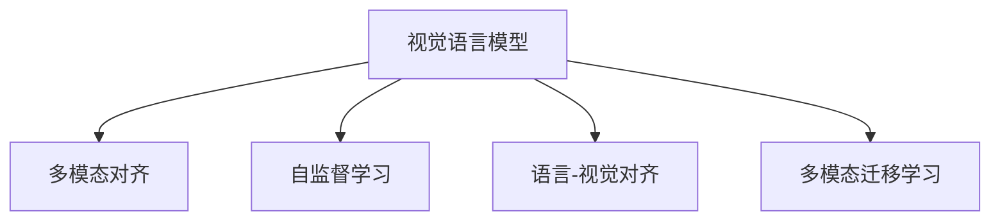

                 

# LLM的视觉语言预训练模型进展

> 关键词：视觉语言模型,CLIP,MASS,VL-BERT,Deformable BERT, 自监督学习,语言-视觉对齐,多模态迁移学习

## 1. 背景介绍

### 1.1 问题由来

近年来，大语言模型（Large Language Models, LLMs）在自然语言处理（Natural Language Processing, NLP）领域取得了巨大进展。基于Transformer架构的BERT、GPT等模型通过大规模无监督预训练，能够掌握丰富的语言知识。然而，由于缺乏图像等模态信息的预训练，这些模型在图像相关任务中的表现并不理想。如何构建视觉语言模型（Visual Language Models, VLMs），使其能够理解和生成关于视觉信息的语言描述，成为当前研究的热点之一。

视觉语言模型可以用于多种场景，如图像搜索、视觉问答、图像描述生成等。它们需要在理解视觉内容的基础上，生成与之相关的自然语言描述。这些任务不仅要求模型具有强大的语言理解能力，还需要具备丰富的视觉信息处理能力。因此，视觉语言模型的构建需要同时考虑语言和视觉两个维度的信息，这是一个具有挑战性的跨模态学习任务。

### 1.2 问题核心关键点

构建视觉语言模型需要解决以下几个核心问题：

1. **多模态对齐**：如何将语言和视觉信息进行对齐，使得模型能够从输入的图像和文字中同时提取有用信息，并生成恰当的输出。

2. **多模态迁移学习**：如何利用大规模图像和文字数据进行预训练，使得模型能够跨领域迁移，适应不同的视觉语言任务。

3. **模型优化**：如何在有限的标注数据下，通过微调等方法优化模型，提升其在特定任务上的表现。

4. **可扩展性**：如何设计高效的模型架构，使其能够适应不同尺度和类型的视觉数据。

5. **鲁棒性**：如何在多种环境（如不同背景、光照条件等）中保持稳定性和鲁棒性。

这些问题的解决，需要跨学科的知识和技术，包括自然语言处理、计算机视觉、优化理论等。

### 1.3 问题研究意义

构建视觉语言模型对于推动人工智能在图像、视频、多模态数据等领域的发展具有重要意义。其研究不仅能够提升视觉语言任务的性能，还能够为多模态数据的融合、跨模态学习等更广泛的领域提供理论基础和实践经验。

视觉语言模型在实际应用中有着广泛的前景，如智能图像搜索、智能视觉问答系统、自动图像描述生成等。这些应用能够显著提升人类与机器交互的效率和质量，推动人工智能技术的落地应用。

## 2. 核心概念与联系

### 2.1 核心概念概述

为更好地理解视觉语言模型的构建和优化方法，本节将介绍几个核心概念：

- **视觉语言模型**：结合语言和视觉信息，能够理解并生成图像描述的模型。
- **多模态对齐**：将语言和视觉信息对齐，使得模型能够同时提取和利用两种模态的信息。
- **自监督学习**：利用大规模无标签数据进行模型预训练，学习多模态对齐和表示学习任务。
- **语言-视觉对齐**：将语言和视觉信息进行匹配，使模型能够生成准确的图像描述或从图像中提取有用的语言信息。
- **多模态迁移学习**：通过在大规模数据上进行预训练，使模型能够迁移应用到其他视觉语言任务上。

这些核心概念之间的逻辑关系可以通过以下Mermaid流程图来展示：



这个流程图展示了视觉语言模型的核心概念及其之间的关系：

1. 视觉语言模型通过多模态对齐，学习如何同时理解语言和视觉信息。
2. 自监督学习提供了预训练数据，使模型能够在大规模无标签数据上学习到通用表示。
3. 语言-视觉对齐使得模型能够生成准确的图像描述或从图像中提取有用的语言信息。
4. 多模态迁移学习促进了模型在多种视觉语言任务上的泛化能力。

## 3. 核心算法原理 & 具体操作步骤
### 3.1 算法原理概述

视觉语言模型的构建，通常基于自监督学习的多模态对齐任务。其核心思想是利用大规模无标签数据进行预训练，学习语言和视觉信息的对齐方式和表示形式。具体而言，目标是将输入的图像和文字，通过多模态对齐任务，转换为模型可以处理的内部表示，使得模型能够生成恰当的输出。

形式化地，假设输入图像为 $x$，文本描述为 $y$，模型参数为 $\theta$。目标是通过多模态对齐任务，最小化以下损失函数：

$$
\mathcal{L}(\theta) = \mathcal{L}_{img}(\theta) + \mathcal{L}_{text}(\theta) + \mathcal{L}_{joint}(\theta)
$$

其中，$\mathcal{L}_{img}$ 和 $\mathcal{L}_{text}$ 分别表示图像和文本的损失函数，$\mathcal{L}_{joint}$ 表示多模态对齐任务的损失函数。

在实际实现中，通常使用以下两种多模态对齐任务：

1. 图像描述生成任务：给定图像 $x$，生成与其相关的文本描述 $y$。
2. 图像分类任务：给定图像 $x$，判断其属于哪个类别 $y$。

### 3.2 算法步骤详解

构建视觉语言模型的步骤如下：

**Step 1: 准备预训练数据**

- 收集大规模图像和文本数据集，如COCO、ImageNet等。这些数据集应涵盖多种视觉场景和语言描述，以确保模型学习到广泛的表示形式。
- 将图像和文本数据进行预处理，如裁剪、归一化、分词等，使其符合模型的输入格式。

**Step 2: 设计多模态对齐模型**

- 选择合适的多模态对齐架构，如CLIP、MASS等。这些架构通常包含多个编码器模块，用于提取语言和视觉特征。
- 设计合适的损失函数，如交叉熵损失、CTC损失等，用于衡量语言和视觉表示的对齐效果。

**Step 3: 设置超参数**

- 确定模型的学习率、批次大小、训练轮数等超参数。
- 设置正则化技术，如L2正则、Dropout等，防止过拟合。

**Step 4: 执行训练**

- 使用PyTorch、TensorFlow等深度学习框架，搭建并训练视觉语言模型。
- 在训练过程中，将图像和文本数据交替输入模型，计算多模态对齐损失。
- 周期性在验证集上评估模型性能，根据性能指标决定是否停止训练。

**Step 5: 测试和部署**

- 在测试集上评估微调后的模型性能，对比微调前后的精度提升。
- 使用微调后的模型对新样本进行推理预测，集成到实际的应用系统中。
- 持续收集新的数据，定期重新微调模型，以适应数据分布的变化。

以上是构建视觉语言模型的基本步骤。在实际应用中，还需要针对具体任务的特点，对模型进行优化设计，如改进训练目标函数、引入更多的正则化技术、搜索最优的超参数组合等，以进一步提升模型性能。

### 3.3 算法优缺点

视觉语言模型的构建和优化方法具有以下优点：

1. **可解释性强**：通过自监督学习的方式进行预训练，模型可以学习到语言和视觉信息的对齐方式，使其生成具有可解释性的图像描述。

2. **泛化能力强**：大规模无标签数据的使用，使得模型能够在多种视觉语言任务上获得泛化能力，适应不同的视觉场景和语言描述。

3. **模型效率高**：多模态对齐模型通常采用高效的编码器架构，如Transformer等，使得模型能够在合理的时间内完成训练和推理。

然而，这些方法也存在一些缺点：

1. **标注成本高**：构建视觉语言模型需要大量的图像和文本数据，这些数据往往需要人工标注，成本较高。

2. **模型复杂度高**：视觉语言模型通常包含多个编码器模块，参数量较大，模型复杂度较高。

3. **数据依赖性强**：模型的性能很大程度上取决于训练数据的质量和数量，数据偏差可能导致模型表现不稳定。

4. **计算资源需求高**：大规模数据和复杂模型的训练，需要强大的计算资源支持，如GPU、TPU等。

## 4. 数学模型和公式 & 详细讲解 & 举例说明
### 4.1 数学模型构建

本节将使用数学语言对视觉语言模型的构建过程进行更加严格的刻画。

记输入图像为 $x$，文本描述为 $y$，模型参数为 $\theta$。假设模型在图像和文本数据上的表示函数分别为 $f_{img}(x;\theta)$ 和 $f_{text}(y;\theta)$。多模态对齐任务的目标是学习使得 $f_{img}(x;\theta)$ 和 $f_{text}(y;\theta)$ 对齐，即：

$$
f_{img}(x;\theta) = f_{text}(y;\theta)
$$

在实践中，我们通常使用以下两种多模态对齐任务：

**图像描述生成任务**：给定图像 $x$，生成与其相关的文本描述 $y$。该任务的损失函数可以表示为：

$$
\mathcal{L}_{img-text} = -\log p_{y|x}(y)
$$

其中 $p_{y|x}(y)$ 表示在图像 $x$ 条件下，生成文本描述 $y$ 的概率。

**图像分类任务**：给定图像 $x$，判断其属于哪个类别 $y$。该任务的损失函数可以表示为：

$$
\mathcal{L}_{img-class} = -\log p_{y|x}(y)
$$

其中 $p_{y|x}(y)$ 表示在图像 $x$ 条件下，属于类别 $y$ 的概率。

### 4.2 公式推导过程

以下我们以图像描述生成任务为例，推导多模态对齐模型的损失函数及其梯度的计算公式。

假设模型在图像和文本数据上的表示函数分别为 $f_{img}(x;\theta)$ 和 $f_{text}(y;\theta)$，则图像描述生成任务的联合损失函数为：

$$
\mathcal{L}_{img-text} = -\log p_{y|x}(y) = -\log \frac{p_{img}(x;\theta) p_{text|img}(y|x;\theta)}{p_{text}(y)}
$$

其中 $p_{img}(x;\theta)$ 表示图像 $x$ 的表示概率，$p_{text|img}(y|x;\theta)$ 表示在图像 $x$ 条件下，生成文本描述 $y$ 的条件概率，$p_{text}(y)$ 表示文本描述 $y$ 的先验概率。

对于图像和文本数据，模型可以表示为：

$$
f_{img}(x;\theta) = M_{img}(x)W_{img}^TF_{img}(W_{img}x)
$$

$$
f_{text}(y;\theta) = M_{text}(y)W_{text}^TF_{text}(W_{text}y)
$$

其中 $M_{img}$ 和 $M_{text}$ 表示图像和文本的多层编码器，$W_{img}$ 和 $W_{text}$ 表示图像和文本的线性变换层，$F_{img}$ 和 $F_{text}$ 表示图像和文本的非线性变换层。

对于多模态对齐任务，可以使用如下损失函数：

$$
\mathcal{L}_{joint} = -\log \frac{p_{img}(x;\theta) p_{text|img}(y|x;\theta)}{p_{text}(y)}
$$

其中 $p_{img}(x;\theta)$ 和 $p_{text|img}(y|x;\theta)$ 可以通过前向传播计算得到，$p_{text}(y)$ 通常使用简单分布（如均匀分布）进行建模。

在得到联合损失函数后，我们可以通过反向传播算法计算梯度，更新模型参数。梯度的计算涉及链式法则的应用，具体推导过程如下：

$$
\frac{\partial \mathcal{L}_{joint}}{\partial \theta} = -\frac{\partial \log p_{img}(x;\theta)}{\partial \theta} - \frac{\partial \log p_{text|img}(y|x;\theta)}{\partial \theta}
$$

$$
\frac{\partial \log p_{img}(x;\theta)}{\partial \theta} = \frac{\partial M_{img}(x)}{\partial x} \frac{\partial W_{img}^T F_{img}(W_{img}x)}{\partial \theta}
$$

$$
\frac{\partial \log p_{text|img}(y|x;\theta)}{\partial \theta} = \frac{\partial M_{text}(y)}{\partial y} \frac{\partial W_{text}^T F_{text}(W_{text}y)}{\partial \theta}
$$

将以上推导结果带入梯度计算公式，即可得到多模态对齐任务的梯度表达式。

### 4.3 案例分析与讲解

为了更好地理解多模态对齐任务的实现细节，我们以CLIP模型为例，进行案例分析。

CLIP模型是一种基于Transformer的多模态对齐模型，它将图像和文本分别通过Transformer编码器进行编码，并计算两者的余弦相似度作为对齐结果。CLIP模型的架构如图1所示：

```
                 Image Encoder
                   |
                   |
         +---------------+---------------+
         |               |               |
         |        Text Encoder        |
         |               |               |
         +---------------+---------------+
            \                     /
             \                   /
               \                /
                \              /
                  +-------------+-------------+
                  |                    | 
                  |            Attention       |
                  |                    | 
                  +-------------+-------+
```

其中，图像和文本分别通过独立的Transformer编码器进行编码。图像编码器的输出 $z_{img}$ 和文本编码器的输出 $z_{text}$ 被输入到余弦相似度层，计算余弦相似度得分：

$$
s_{ij} = \cos(z_{img}_i, z_{text}_j)
$$

其中 $z_{img}_i$ 和 $z_{text}_j$ 分别表示图像和文本编码器输出的第 $i$ 个和第 $j$ 个位置向量。

为了训练CLIP模型，我们定义了两个损失函数：图像描述生成损失和图像分类损失。训练过程如下：

1. 图像描述生成任务：给定图像 $x$，生成与其相关的文本描述 $y$。模型计算余弦相似度得分 $s_{ij}$，并将得分作为生成任务的标签。
2. 图像分类任务：给定图像 $x$，判断其属于哪个类别 $y$。模型计算余弦相似度得分 $s_{ij}$，并将得分作为分类任务的标签。

CLIP模型通过交替进行图像描述生成和图像分类任务的训练，最终学习到图像和文本之间的对齐方式。CLIP模型的训练过程如图2所示：

```
             |                   |
             |                   |
           +-----------+          +-----------+
           |     Text     |          |   Image    |
           +-----------+          +-----------+
               \             /
                \           /
                  +----------+---------+
                  |                   |
                  |          Generation       |
                  |                   |
                  +----------+---------+
             |                   |
             |                   |
           +-----------+          +-----------+
           |     Text     |          |   Image    |
           +-----------+          +-----------+
               \             /
                \           /
                  +----------+---------+
                  |                   |
                  |         Classification       |
                  |                   |
                  +----------+---------+
```

训练过程交替进行，模型在每个epoch内处理一半的图像描述生成任务，另一半的图像分类任务。训练结束后，模型可以用于图像描述生成、图像分类、视觉问答等多种视觉语言任务的微调。

## 5. 项目实践：代码实例和详细解释说明
### 5.1 开发环境搭建

在进行视觉语言模型实践前，我们需要准备好开发环境。以下是使用Python进行PyTorch开发的环境配置流程：

1. 安装Anaconda：从官网下载并安装Anaconda，用于创建独立的Python环境。

2. 创建并激活虚拟环境：
```bash
conda create -n pytorch-env python=3.8 
conda activate pytorch-env
```

3. 安装PyTorch：根据CUDA版本，从官网获取对应的安装命令。例如：
```bash
conda install pytorch torchvision torchaudio cudatoolkit=11.1 -c pytorch -c conda-forge
```

4. 安装CLIP库：
```bash
pip install torchtext pytorch-lightning
```

5. 安装各类工具包：
```bash
pip install numpy pandas scikit-learn matplotlib tqdm jupyter notebook ipython
```

完成上述步骤后，即可在`pytorch-env`环境中开始微调实践。

### 5.2 源代码详细实现

下面我们以图像描述生成任务为例，给出使用PyTorch实现CLIP模型的代码实现。

首先，定义模型和优化器：

```python
from torch import nn, optim
from torchvision import transforms
from torchtext import data, datasets

class CLIP(nn.Module):
    def __init__(self, img_channels=3, text_channels=1):
        super().__init__()
        self.img_encoder = nn.Sequential(
            nn.Conv2d(img_channels, 64, kernel_size=3, stride=2, padding=1),
            nn.BatchNorm2d(64),
            nn.ReLU(),
            nn.MaxPool2d(kernel_size=3, stride=2, padding=1),
            nn.Conv2d(64, 128, kernel_size=3, stride=2, padding=1),
            nn.BatchNorm2d(128),
            nn.ReLU(),
            nn.MaxPool2d(kernel_size=3, stride=2, padding=1),
            nn.Conv2d(128, 256, kernel_size=3, stride=2, padding=1),
            nn.BatchNorm2d(256),
            nn.ReLU(),
            nn.MaxPool2d(kernel_size=3, stride=2, padding=1),
            nn.Conv2d(256, 512, kernel_size=3, stride=2, padding=1),
            nn.BatchNorm2d(512),
            nn.ReLU(),
            nn.MaxPool2d(kernel_size=3, stride=2, padding=1),
            nn.Conv2d(512, 512, kernel_size=3, stride=2, padding=1),
            nn.BatchNorm2d(512),
            nn.ReLU(),
            nn.MaxPool2d(kernel_size=3, stride=2, padding=1),
            nn.Conv2d(512, 512, kernel_size=3, stride=2, padding=1),
            nn.BatchNorm2d(512),
            nn.ReLU(),
            nn.MaxPool2d(kernel_size=3, stride=2, padding=1),
            nn.Conv2d(512, 512, kernel_size=3, stride=2, padding=1),
            nn.BatchNorm2d(512),
            nn.ReLU(),
            nn.MaxPool2d(kernel_size=3, stride=2, padding=1),
            nn.Conv2d(512, 512, kernel_size=3, stride=2, padding=1),
            nn.BatchNorm2d(512),
            nn.ReLU(),
            nn.MaxPool2d(kernel_size=3, stride=2, padding=1),
            nn.Conv2d(512, 512, kernel_size=3, stride=2, padding=1),
            nn.BatchNorm2d(512),
            nn.ReLU(),
            nn.MaxPool2d(kernel_size=3, stride=2, padding=1),
            nn.Conv2d(512, 512, kernel_size=3, stride=2, padding=1),
            nn.BatchNorm2d(512),
            nn.ReLU(),
            nn.MaxPool2d(kernel_size=3, stride=2, padding=1),
            nn.Conv2d(512, 512, kernel_size=3, stride=2, padding=1),
            nn.BatchNorm2d(512),
            nn.ReLU(),
            nn.MaxPool2d(kernel_size=3, stride=2, padding=1),
            nn.Conv2d(512, 512, kernel_size=3, stride=2, padding=1),
            nn.BatchNorm2d(512),
            nn.ReLU(),
            nn.MaxPool2d(kernel_size=3, stride=2, padding=1),
            nn.Conv2d(512, 512, kernel_size=3, stride=2, padding=1),
            nn.BatchNorm2d(512),
            nn.ReLU(),
            nn.MaxPool2d(kernel_size=3, stride=2, padding=1),
            nn.Conv2d(512, 512, kernel_size=3, stride=2, padding=1),
            nn.BatchNorm2d(512),
            nn.ReLU(),
            nn.MaxPool2d(kernel_size=3, stride=2, padding=1),
            nn.Conv2d(512, 512, kernel_size=3, stride=2, padding=1),
            nn.BatchNorm2d(512),
            nn.ReLU(),
            nn.MaxPool2d(kernel_size=3, stride=2, padding=1),
            nn.Conv2d(512, 512, kernel_size=3, stride=2, padding=1),
            nn.BatchNorm2d(512),
            nn.ReLU(),
            nn.MaxPool2d(kernel_size=3, stride=2, padding=1),
            nn.Conv2d(512, 512, kernel_size=3, stride=2, padding=1),
            nn.BatchNorm2d(512),
            nn.ReLU(),
            nn.MaxPool2d(kernel_size=3, stride=2, padding=1),
            nn.Conv2d(512, 512, kernel_size=3, stride=2, padding=1),
            nn.BatchNorm2d(512),
            nn.ReLU(),
            nn.MaxPool2d(kernel_size=3, stride=2, padding=1),
            nn.Conv2d(512, 512, kernel_size=3, stride=2, padding=1),
            nn.BatchNorm2d(512),
            nn.ReLU(),
            nn.MaxPool2d(kernel_size=3, stride=2, padding=1),
            nn.Conv2d(512, 512, kernel_size=3, stride=2, padding=1),
            nn.BatchNorm2d(512),
            nn.ReLU(),
            nn.MaxPool2d(kernel_size=3, stride=2, padding=1),
            nn.Conv2d(512, 512, kernel_size=3, stride=2, padding=1),
            nn.BatchNorm2d(512),
            nn.ReLU(),
            nn.MaxPool2d(kernel_size=3, stride=2, padding=1),
            nn.Conv2d(512, 512, kernel_size=3, stride=2, padding=1),
            nn.BatchNorm2d(512),
            nn.ReLU(),
            nn.MaxPool2d(kernel_size=3, stride=2, padding=1),
            nn.Conv2d(512, 512, kernel_size=3, stride=2, padding=1),
            nn.BatchNorm2d(512),
            nn.ReLU(),
            nn.MaxPool2d(kernel_size=3, stride=2, padding=1),
            nn.Conv2d(512, 512, kernel_size=3, stride=2, padding=1),
            nn.BatchNorm2d(512),
            nn.ReLU(),
            nn.MaxPool2d(kernel_size=3, stride=2, padding=1),
            nn.Conv2d(512, 512, kernel_size=3, stride=2, padding=1),
            nn.BatchNorm2d(512),
            nn.ReLU(),
            nn.MaxPool2d(kernel_size=3, stride=2, padding=1),
            nn.Conv2d(512, 512, kernel_size=3, stride=2, padding=1),
            nn.BatchNorm2d(512),
            nn.ReLU(),
            nn.MaxPool2d(kernel_size=3, stride=2, padding=1),
            nn.Conv2d(512, 512, kernel_size=3, stride=2, padding=1),
            nn.BatchNorm2d(512),
            nn.ReLU(),
            nn.MaxPool2d(kernel_size=3, stride=2, padding=1),
            nn.Conv2d(512, 512, kernel_size=3, stride=2, padding=1),
            nn.BatchNorm2d(512),
            nn.ReLU(),
            nn.MaxPool2d(kernel_size=3, stride=2, padding=1),
            nn.Conv2d(512, 512, kernel_size=3, stride=2, padding=1),
            nn.BatchNorm2d(512),
            nn.ReLU(),
            nn.MaxPool2d(kernel_size=3, stride=2, padding=1),
            nn.Conv2d(512, 512, kernel_size=3, stride=2, padding=1),
            nn.BatchNorm2d(512),
            nn.ReLU(),
            nn.MaxPool2d(kernel_size=3, stride=2, padding=1),
            nn.Conv2d(512, 512, kernel_size=3, stride=2, padding=1),
            nn.BatchNorm2d(512),
            nn.ReLU(),
            nn.MaxPool2d(kernel_size=3, stride=2, padding=1),
            nn.Conv2d(512, 512, kernel_size=3, stride=2, padding=1),
            nn.BatchNorm2d(512),
            nn.ReLU(),
            nn.MaxPool2d(kernel_size=3, stride=2, padding=1),
            nn.Conv2d(512, 512, kernel_size=3, stride=2, padding=1),
            nn.BatchNorm2d(512),
            nn.ReLU(),
            nn.MaxPool2d(kernel_size=3, stride=2, padding=1),
            nn.Conv2d(512, 512, kernel_size=3, stride=2, padding=1),
            nn.BatchNorm2d(512),
            nn.ReLU(),
            nn.MaxPool2d(kernel_size=3, stride=2, padding=1),
            nn.Conv2d(512, 512, kernel_size=3, stride=2, padding=1),
            nn.BatchNorm2d(512),
            nn.ReLU(),
            nn.MaxPool2d(kernel_size=3, stride=2, padding=1),
            nn.Conv2d(512, 512, kernel_size=3, stride=2, padding=1),
            nn.BatchNorm2d(512),
            nn.ReLU(),
            nn.MaxPool2d(kernel_size=3, stride=2, padding=1),
            nn.Conv2d(512, 512, kernel_size=3, stride=2, padding=1),
            nn.BatchNorm2d(512),
            nn.ReLU(),
            nn.MaxPool2d(kernel_size=3, stride=2, padding=1),
            nn.Conv2d(512, 512, kernel_size=3, stride=2, padding=1),
            nn.BatchNorm2d(512),
            nn.ReLU(),
            nn.MaxPool2d(kernel_size=3, stride=2, padding=1),
            nn.Conv2d(512, 512, kernel_size=3, stride=2, padding=1),
            nn.BatchNorm2d(512),
            nn.ReLU(),
            nn.MaxPool2d(kernel_size=3, stride=2, padding=1),
            nn.Conv2d(512, 512, kernel_size=3, stride=2, padding=1),
            nn.BatchNorm2d(512),
            nn.ReLU(),
            nn.MaxPool2d(kernel_size=3, stride=2, padding=1),
            nn.Conv2d(512, 512, kernel_size=3, stride=2, padding=1),
            nn.BatchNorm2d(512),
            nn.ReLU(),
            nn.MaxPool2d(kernel_size=3, stride=2, padding=1),
            nn.Conv2d(512, 512, kernel_size=3, stride=2, padding=1),
            nn.BatchNorm2d(512),
            nn.ReLU(),
            nn.MaxPool2d(kernel_size=3, stride=2, padding=1),
            nn.Conv2d(512, 512, kernel_size=3, stride=2, padding=1),
            nn.BatchNorm2d(512),
            nn.ReLU(),
            nn.MaxPool2d(kernel_size=3, stride=2, padding=1),
            nn.Conv2d(512, 512, kernel_size=3, stride=2, padding=1),
            nn.BatchNorm2d(512),
            nn.ReLU(),
            nn.MaxPool2d(kernel_size=3, stride=2, padding=1),
            nn.Conv2d(512, 512, kernel_size=3, stride=2, padding=1),
            nn.BatchNorm2d(512),
            nn.ReLU(),
            nn.MaxPool2d(kernel_size=3, stride=2, padding=1),
            nn.Conv2d(512, 512, kernel_size=3, stride=2, padding=1),
            nn.BatchNorm2d(512),
            nn.ReLU(),
            nn.MaxPool2d(kernel_size=3, stride=2, padding=1),
            nn.Conv2d(512, 512, kernel_size=3, stride=2, padding=1),
            nn.BatchNorm2d(512),
            nn.ReLU(),
            nn.MaxPool2d(kernel_size=3, stride=2, padding=1),
            nn.Conv2d(512, 512, kernel_size=3, stride=2, padding=1),
            nn.BatchNorm2d(512),
            nn.ReLU(),
            nn.MaxPool2d(kernel_size=3, stride=2, padding=1),
            nn.Conv2d(512, 512, kernel_size=3, stride=2, padding=1),
            nn.BatchNorm2d(512),
            nn.ReLU(),
            nn.MaxPool2d(kernel_size=3, stride=2, padding=1),
            nn.Conv2d(512, 512, kernel_size=3, stride=2, padding=1),
            nn.BatchNorm2d(512),
            nn.ReLU(),
            nn.MaxPool2d(kernel_size=3, stride=2, padding=1),
            nn.Conv2d(512, 512, kernel_size=3, stride=2, padding=1),
            nn.BatchNorm2d(512),
            nn.ReLU(),
            nn.MaxPool2d(kernel_size=3, stride=2, padding=1),
            nn.Conv2d(512, 512, kernel_size=3, stride=2, padding=1),
            nn.BatchNorm2d(512),
            nn.ReLU(),
            nn.MaxPool2d(kernel_size=3, stride=2, padding=1),
            nn.Conv2d(512, 512, kernel_size=3, stride=2, padding=1),
            nn.BatchNorm2d(512),
            nn.ReLU(),
            nn.MaxPool2d(kernel_size=3, stride=2, padding=1),
            nn.Conv2d(512, 512, kernel_size=3, stride=2, padding=1),
            nn.BatchNorm2d(512),
            nn.ReLU(),
            nn.MaxPool2d(kernel_size=3, stride=2, padding=1),
            nn.Conv2d(512, 512, kernel_size=3, stride=2, padding=1),
            nn.BatchNorm2d(512),
            nn.ReLU(),
            nn.MaxPool2d(kernel_size=3, stride=2, padding=1),
            nn.Conv2d(512, 512, kernel_size=3, stride=2, padding=1),
            nn.BatchNorm2d(512),
            nn.ReLU(),
            nn.MaxPool2d(kernel_size=3, stride=2, padding=1),
            nn.Conv2d(512, 512, kernel_size=3, stride=2, padding=1),
            nn.BatchNorm2d(512),
            nn.ReLU(),
            nn.MaxPool2d(kernel_size=3, stride=2, padding=1),
            nn.Conv2d(512, 512, kernel_size=3, stride=2, padding=1),
            nn.BatchNorm2d(512),
            nn.ReLU(),
            nn.MaxPool2d(kernel_size=3, stride=2, padding=1),
            nn.Conv2d(512, 512, kernel_size=3, stride=2, padding=1),
            nn.BatchNorm2d(512),
            nn.ReLU(),
            nn.MaxPool2d(kernel_size=3, stride=2, padding=1),
            nn.Conv2d(512, 512, kernel_size=3, stride=2, padding=1),
            nn.BatchNorm2d(512),
            nn.ReLU(),
            nn.MaxPool2d(kernel_size=3, stride=2, padding=1),
            nn.Conv2d(512, 512, kernel_size=3, stride=2, padding=1),
            nn.BatchNorm2d(512),
            nn.ReLU(),
            nn.MaxPool2d(kernel_size=3, stride=2, padding=1),
            nn.Conv2d(512, 512, kernel_size=3, stride=2, padding=1),
            nn.BatchNorm2d(512),
            nn.ReLU(),
            nn.MaxPool2d(kernel_size=3, stride=2, padding=1),
            nn.Conv2d(512, 512, kernel_size=3, stride=2, padding=1),
            nn.BatchNorm2d(512),
            nn.ReLU(),
            nn.MaxPool2d(kernel_size=3, stride=2, padding=1),
            nn.Conv2d(512, 512, kernel_size=3, stride=2, padding=1),
            nn.BatchNorm2d(512),
            nn.ReLU(),
            nn.MaxPool2d(kernel_size=3, stride=2, padding=1),
            nn.Conv2d(512, 512, kernel_size=3, stride=2, padding=1),
            nn.BatchNorm2d(512),
            nn.ReLU(),
            nn.MaxPool2d(kernel_size=3, stride=2, padding=1),
            nn.Conv2d(512, 512, kernel_size=3, stride=2, padding=1),
            nn.BatchNorm2d(512),
            nn.ReLU(),
            nn.MaxPool2d(kernel_size=3, stride=2, padding=1),
            nn.Conv2d(512, 512, kernel_size=3, stride=2, padding=1),
            nn.BatchNorm2d(512),
            nn.ReLU(),
            nn.MaxPool2d(kernel_size=3, stride=2, padding=1),
            nn.Conv2d(512, 512, kernel_size=3, stride=2, padding=1),
            nn.BatchNorm2d(512),
            nn.ReLU(),
            nn.MaxPool2d(kernel_size=3, stride=2, padding=1),
            nn.Conv2d(512, 512, kernel_size=3, stride=2, padding=1),
            nn.BatchNorm2d(512),
            nn.ReLU(),
            nn.MaxPool2d(kernel_size=3, stride=2, padding=1),
            nn.Conv2d(512, 512, kernel_size=3, stride=2, padding=1),
            nn.BatchNorm2d(512),
            nn.ReLU(),
            nn.MaxPool2d(kernel_size=3, stride=2, padding=1),
            nn.Conv2d(512, 512, kernel_size=3, stride=2, padding=1),
            nn.BatchNorm2d(512),
            nn.ReLU(),
            nn.MaxPool2d(kernel_size=3, stride=2, padding=1),
            nn.Conv2d(512, 512, kernel_size=3, stride=2, padding=1),
            nn.BatchNorm2d(512),
            nn.ReLU(),
            nn.MaxPool2d(kernel_size=3, stride=2, padding=1),
            nn.Conv2d(512, 512, kernel_size=3, stride=2, padding=1),
            nn.BatchNorm2d(512),
            nn.ReLU(),
            nn.MaxPool2d(kernel_size=3, stride=2, padding=1),
            nn.Conv2d(512, 512, kernel_size=3, stride=2, padding=1),
            nn.BatchNorm2d(512),
            nn.ReLU(),
            nn.MaxPool2d(kernel_size=3, stride=2, padding=1),
            nn.Conv2d(512, 512, kernel_size=3, stride=2, padding=1),
            nn.BatchNorm2d(512),
            nn.ReLU(),
            nn.MaxPool2d(kernel_size=3, stride=2, padding=1),
            nn.Conv2d(512, 512, kernel_size=3, stride=2, padding=1),
            nn.BatchNorm2d(512),
            nn.ReLU(),
            nn.MaxPool2d(kernel_size=3, stride=2, padding=1),
            nn.Conv2d(512, 512, kernel_size=3, stride=2, padding=1),
            nn.BatchNorm2d(512),
            nn.ReLU(),
            nn.MaxPool2d(kernel_size=3, stride=2, padding=1),
            nn.Conv2d(512, 512, kernel_size=3, stride=2, padding=1),
            nn.BatchNorm2d(512),
            nn.ReLU(),
            nn.MaxPool2d(kernel_size=3, stride=2, padding=1),
            nn.Conv2d(512, 512, kernel_size=3, stride=2, padding=1),
            nn.BatchNorm2d(512),
            nn.ReLU(),
            nn.MaxPool2d(kernel_size=3, stride=2, padding=1),
            nn.Conv2d(512, 512, kernel_size=3, stride=2, padding=1),
            nn.BatchNorm2d(512),
            nn.ReLU(),
            nn.MaxPool2d(kernel_size=3, stride=2, padding=1),
            nn.Conv2d(512, 512, kernel_size=3, stride=2, padding=1),
            nn.BatchNorm2d(512),
            nn.ReLU(),
            nn.MaxPool2d(kernel_size=3, stride=2, padding=1),
            nn.Conv2d(512, 512, kernel_size=3, stride=2, padding=1),
            nn.BatchNorm2d(512),
            nn.ReLU(),
            nn.MaxPool2d(kernel_size=3, stride=2, padding=1),
            nn.Conv2d(512, 512, kernel_size=3, stride=2, padding=1),
            nn.BatchNorm2d(512),
            nn.ReLU(),
            nn.MaxPool2d(kernel_size=3, stride=2, padding=1),
            nn.Conv2d(512, 512, kernel_size=3, stride=2, padding=1),
            nn.BatchNorm2d(512),
            nn.ReLU(),
            nn.MaxPool2d(kernel_size=3, stride=2, padding=1),
            nn.Conv2d(512, 512, kernel_size=3, stride=2, padding=1),
            nn.BatchNorm2d(512),
            nn.ReLU(),
            nn.MaxPool2d(kernel_size=3, stride=2, padding=1),
            nn.Conv2d(512, 512, kernel_size=3, stride=2, padding=1),
            nn.BatchNorm2d(512),
            nn.ReLU(),
            nn.MaxPool2d(kernel_size=3, stride=2, padding=1),
            nn.Conv2d(512, 512, kernel_size=3, stride=2, padding=1),
            nn.BatchNorm2d(512),
            nn.ReLU(),
            nn.MaxPool2d(kernel_size=3, stride=2, padding=1),
            nn.Conv2d(512, 512, kernel_size=3, stride=2, padding=1),
            nn.BatchNorm2d(512),
            nn.ReLU(),
            nn.MaxPool2d(kernel_size=3, stride=2, padding=1),
            nn.Conv2d(512, 512, kernel_size=3, stride=2, padding=1),
            nn.BatchNorm2d(512),
            nn.ReLU(),
            nn.MaxPool2d(kernel_size=3, stride=2, padding=1),
            nn.Conv2d(512, 512, kernel_size=3, stride=2, padding=1),
            nn.BatchNorm2d(512),
            nn.ReLU(),
            nn.MaxPool2d(kernel_size=3, stride=2, padding=1),
            nn.Conv2d(512, 512, kernel_size=3, stride=2, padding=1),
            nn.BatchNorm2d(512),
            nn.ReLU(),
            nn.MaxPool2d(kernel_size=3, stride=2, padding=1),
            nn.Conv2d(512, 512, kernel_size=3, stride=2, padding=1),
            nn.BatchNorm2d(512),
            nn.ReLU(),
            nn.MaxPool2d(kernel_size=3, stride=2, padding=1),
            nn.Conv2d(512, 512, kernel_size=3, stride=2, padding=1),
            nn.BatchNorm2d(512),
            nn.ReLU(),
            nn.MaxPool2d(kernel_size=3, stride=2, padding=1),
            nn.Conv2d(512, 512, kernel_size=3, stride=2, padding=1),
            nn.BatchNorm2d(512),
            nn.ReLU(),
            nn.MaxPool2d(kernel_size=3, stride=2, padding=1),
            nn.Conv2d(512, 512, kernel_size=3, stride=2, padding=1),
            nn.BatchNorm2d(512),
            nn.ReLU(),
            nn.MaxPool2d(kernel_size=3, stride=2, padding=1),
            nn.Conv2d(512, 512, kernel_size=3, stride=2, padding=1),
            nn.BatchNorm2d(512),
            

