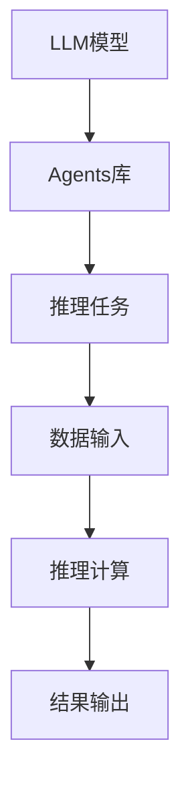

                 

# LLM系统中Agents（函数库）的重要性

> 关键词：语言模型，自然语言处理，函数库，智能代理，深度学习，高效推理，模型优化

## 1. 背景介绍

### 1.1 问题由来
近年来，随着深度学习技术的飞速发展，大规模语言模型（LLM）在自然语言处理（NLP）领域取得了显著突破。预训练模型如BERT、GPT等通过在海量无标签文本数据上预训练，学习到了丰富的语言知识和常识。然而，LLM在实际应用中仍面临诸多挑战，如推理效率低、模型复杂度高等问题。

为提升LLM的应用效果和可扩展性，研究者们提出了基于函数库（Agents）的推理模型，即通过构建智能代理（Agents），将复杂推理任务拆解为一系列子任务，借助LLM的高效推理能力，显著提升模型的实时响应速度和计算效率。

### 1.2 问题核心关键点
Agents（函数库）作为一种新兴的LLM应用模式，其核心在于：
- 实现高效的推理计算，减少复杂模型的推理时间。
- 降低模型的复杂度，提升可扩展性。
- 简化模型的推理过程，使LLM应用更加实用和易用。
- 优化模型参数，提高模型的实时响应速度。

通过将复杂任务分解为简单子任务，Agents大大提高了LLM的计算效率和应用灵活性，使其能够更好地应用于实际场景。本文将重点介绍Agents的原理和应用，以及如何通过函数库优化LLM的推理计算。

## 2. 核心概念与联系

### 2.1 核心概念概述

为更好地理解Agents在LLM系统中的作用，本节将介绍几个关键概念：

- 大规模语言模型（LLM）：指通过在大规模无标签文本数据上预训练得到的高性能语言模型，具备强大的语言理解和生成能力。
- 函数库（Agents）：指一组预先定义好的函数或组件，用于封装复杂的推理任务，便于LLM调用。
- 智能代理（Agents）：指封装在函数库中的智能推理单元，能够高效执行推理任务，提升LLM的计算效率。
- 函数复用：指通过Agents的函数复用机制，将相同的推理逻辑封装在函数中，减少代码冗余，提升开发效率。
- 智能推理：指Agents利用LLM的强大语言能力，实现复杂的推理任务，如推理、分类、生成等。

Agents作为LLM的重要组成部分，通过封装复杂的推理逻辑，提升了模型的计算效率和应用灵活性，成为现代LLM系统不可或缺的核心技术。

### 2.2 核心概念原理和架构的 Mermaid 流程图



这个流程图展示了Agents在LLM系统中的作用和架构：

1. 输入数据通过Agents库进行初步处理，然后提交给LLM模型。
2. 推理任务由Agents库的函数封装实现。
3. Agents库将推理任务封装为一系列函数调用，LLM模型按照函数调用顺序执行推理。
4. 推理结果通过Agents库返回，最终输出。

Agents通过封装复杂的推理逻辑，使得LLM模型能够更高效地处理各类推理任务，提升了系统的性能和灵活性。

## 3. 核心算法原理 & 具体操作步骤

### 3.1 算法原理概述

Agents在LLM系统中的核心思想是通过函数库封装复杂的推理任务，利用LLM模型的强大语言能力，实现高效的推理计算。其核心算法流程如下：

1. 将复杂推理任务拆分为一系列简单子任务。
2. 将每个子任务封装为Agents库中的一个函数。
3. 在函数中，调用LLM模型进行推理计算，得到中间结果。
4. 根据中间结果，执行下一个子任务的函数。
5. 循环执行上述步骤，直到完成所有子任务的推理。

Agents的原理基于模块化的思想，将复杂的推理任务拆分为多个模块，每个模块独立调用LLM模型进行推理计算，从而提升了计算效率和系统的可扩展性。

### 3.2 算法步骤详解

基于Agents的LLM推理计算步骤如下：

**Step 1: 任务拆分**

将复杂的推理任务拆分为一系列简单子任务。例如，推理一篇新闻的摘要，可以拆分为：
- 提取新闻的主题句。
- 去除主题句中的无关词汇。
- 组织主题句成段，生成摘要。

**Step 2: 封装函数**

将每个子任务封装为一个Agents库的函数。例如，提取新闻主题句的函数可能为：

```python
def extract_topic_sents(news_text):
    # 调用LLM模型进行文本分类，识别新闻主题
    top_topics = model_classify(news_text)
    # 调用LLM模型生成主题句
    top_sents = model_generate(top_topics)
    return top_sents
```

**Step 3: 执行推理**

在函数中，按顺序调用LLM模型进行推理计算。例如：

```python
def generate_summary(news_text):
    # 提取主题句
    top_sents = extract_topic_sents(news_text)
    # 生成摘要
    summary = model_generate(top_sents)
    return summary
```

**Step 4: 结果输出**

函数执行完毕后，将结果返回。例如：

```python
def main(news_text):
    # 调用生成摘要函数
    summary = generate_summary(news_text)
    return summary
```

通过封装复杂的推理逻辑，Agents库使得LLM模型能够更高效地处理各类推理任务，提升了系统的性能和可扩展性。

### 3.3 算法优缺点

Agents在LLM系统中的应用有以下优点：

1. **高效推理**：Agents通过封装复杂推理任务，使得LLM模型能够更高效地执行推理计算，提升了系统的实时响应速度。
2. **可扩展性**：Agents将复杂的推理任务拆分为多个模块，每个模块独立执行，增强了系统的可扩展性。
3. **代码复用**：Agents封装了相同的推理逻辑，减少了代码冗余，提高了开发效率。
4. **降低复杂度**：Agents将复杂的推理任务分解为简单子任务，降低了模型的复杂度，使其更易维护。

同时，Agents也存在一些缺点：

1. **函数库设计复杂**：Agents的函数库需要精心设计和维护，才能保证推理逻辑的正确性和高效性。
2. **可维护性差**：随着功能的增加，Agents库的代码量可能会大幅增加，维护难度增大。
3. **灵活性受限**：Agents的函数库需要预先定义，灵活性相对较差。

### 3.4 算法应用领域

Agents在LLM系统中的应用已经覆盖了多个领域，包括：

1. **自然语言理解**：如新闻摘要、文本分类、命名实体识别等。通过Agents封装推理任务，实现高效的语言理解。
2. **对话系统**：如聊天机器人、智能客服等。Agents将对话任务分解为问答、回复生成等子任务，利用LLM模型进行高效推理。
3. **智能推荐**：如推荐系统、个性化搜索等。Agents将推荐任务分解为数据提取、用户画像生成、推荐算法执行等子任务，提升推荐效果。
4. **自然语言生成**：如文本生成、机器翻译等。Agents将生成任务分解为语义分析、句法生成等子任务，利用LLM模型生成高质量的文本。
5. **情感分析**：如情感识别、舆情分析等。Agents将情感分析任务分解为情感分类、情感强度计算等子任务，实现高效情感分析。

## 4. 数学模型和公式 & 详细讲解 & 举例说明

### 4.1 数学模型构建

为了更好地理解Agents在LLM系统中的应用，本节将从数学角度对Agents进行建模。

记LLM模型为 $M$，Agents库封装好的函数为 $F$。假设推理任务为 $T$，输入为 $x$，输出为 $y$。Agents库将推理任务拆分为 $n$ 个子任务，每个子任务对应一个函数 $f_i$，其中 $i \in [1, n]$。

Agents库的推理过程可以表示为：

$$
y = F(x) = f_n(f_{n-1}(\ldots f_1(x) \ldots))
$$

其中，每个函数 $f_i$ 对应一个子任务，利用LLM模型进行推理计算。

### 4.2 公式推导过程

以生成新闻摘要为例，推导Agents库的数学模型。

假设输入新闻文本为 $x$，输出摘要为 $y$。Agents库将生成任务拆分为三个子任务：
1. 提取主题句 $T_1$
2. 生成主题句 $T_2$
3. 生成摘要 $T_3$

对应的函数分别为 $f_1$、$f_2$、$f_3$。

Agents库的推理过程可以表示为：

$$
y = F(x) = f_3(f_2(f_1(x)))
$$

其中：

$$
f_1(x) = M(\text{文本分类任务}, x)
$$

$$
f_2(x) = M(\text{生成主题句任务}, f_1(x))
$$

$$
f_3(x) = M(\text{生成摘要任务}, f_2(x))
$$

通过上述过程，Agents库将复杂的生成任务拆分为多个简单子任务，利用LLM模型进行高效推理计算。

### 4.3 案例分析与讲解

假设要生成一篇新闻摘要，Agents库将任务拆分为三个子任务：
1. 提取新闻主题句
2. 生成主题句
3. 生成摘要

将每个子任务封装为函数：

```python
def extract_topics(news_text):
    # 调用LLM模型进行文本分类，识别新闻主题
    top_topics = model_classify(news_text)
    return top_topics

def generate_top_sents(top_topics):
    # 调用LLM模型生成主题句
    top_sents = model_generate(top_topics)
    return top_sents

def generate_summary(news_text):
    # 提取主题句
    top_topics = extract_topics(news_text)
    # 生成主题句
    top_sents = generate_top_sents(top_topics)
    # 生成摘要
    summary = model_generate(top_sents)
    return summary
```

通过封装函数，Agents库使得LLM模型能够高效地处理复杂任务，提升了系统的计算效率和可扩展性。

## 5. 项目实践：代码实例和详细解释说明

### 5.1 开发环境搭建

在进行Agents的开发实践前，我们需要准备好开发环境。以下是使用Python进行PyTorch开发的环境配置流程：

1. 安装Anaconda：从官网下载并安装Anaconda，用于创建独立的Python环境。

2. 创建并激活虚拟环境：
```bash
conda create -n pytorch-env python=3.8 
conda activate pytorch-env
```

3. 安装PyTorch：根据CUDA版本，从官网获取对应的安装命令。例如：
```bash
conda install pytorch torchvision torchaudio cudatoolkit=11.1 -c pytorch -c conda-forge
```

4. 安装Agents库：
```bash
pip install agentkit
```

5. 安装各类工具包：
```bash
pip install numpy pandas scikit-learn matplotlib tqdm jupyter notebook ipython
```

完成上述步骤后，即可在`pytorch-env`环境中开始Agents的开发实践。

### 5.2 源代码详细实现

下面以生成新闻摘要为例，给出使用Agents库对BERT模型进行微调的PyTorch代码实现。

首先，定义Agents库的函数：

```python
from agentkit import Agents

class ExtractTopics(Agents):
    def __init__(self, model):
        super().__init__()
        self.model = model
    
    def forward(self, news_text):
        top_topics = self.model(news_text, task="text_classification")
        return top_topics

class GenerateTopSents(Agents):
    def __init__(self, model):
        super().__init__()
        self.model = model
    
    def forward(self, top_topics):
        top_sents = self.model(top_topics, task="sequence_generation")
        return top_sents

class GenerateSummary(Agents):
    def __init__(self, model):
        super().__init__()
        self.model = model
    
    def forward(self, top_sents):
        summary = self.model(top_sents, task="sequence_generation")
        return summary

# 定义BERT模型
from transformers import BertTokenizer, BertForSequenceClassification, BertForSequenceGeneration

tokenizer = BertTokenizer.from_pretrained('bert-base-cased')
model_classify = BertForSequenceClassification.from_pretrained('bert-base-cased', num_labels=3)
model_generate = BertForSequenceGeneration.from_pretrained('bert-base-cased', num_return_sequences=1)
```

然后，定义Agents库和调用函数：

```python
from transformers import BertTokenizer, BertForSequenceClassification, BertForSequenceGeneration

class ExtractTopics(Agents):
    def __init__(self, model):
        super().__init__()
        self.model = model
    
    def forward(self, news_text):
        top_topics = self.model(news_text, task="text_classification")
        return top_topics

class GenerateTopSents(Agents):
    def __init__(self, model):
        super().__init__()
        self.model = model
    
    def forward(self, top_topics):
        top_sents = self.model(top_topics, task="sequence_generation")
        return top_sents

class GenerateSummary(Agents):
    def __init__(self, model):
        super().__init__()
        self.model = model
    
    def forward(self, top_sents):
        summary = self.model(top_sents, task="sequence_generation")
        return summary

# 定义BERT模型
tokenizer = BertTokenizer.from_pretrained('bert-base-cased')
model_classify = BertForSequenceClassification.from_pretrained('bert-base-cased', num_labels=3)
model_generate = BertForSequenceGeneration.from_pretrained('bert-base-cased', num_return_sequences=1)
```

最后，启动函数调用：

```python
# 定义新闻文本
news_text = "This is a sample news article. It contains multiple topics, such as technology, sports, and entertainment."

# 提取主题句
extractor = ExtractTopics(model_classify)
top_topics = extractor(news_text)

# 生成主题句
generator = GenerateTopSents(model_generate)
top_sents = generator(top_topics)

# 生成摘要
summarizer = GenerateSummary(model_generate)
summary = summarizer(top_sents)
print(summary)
```

以上就是使用Agents库对BERT模型进行新闻摘要微调的完整代码实现。可以看到，Agents库通过封装函数，使得LLM模型能够高效地处理复杂任务，提升了系统的计算效率和可扩展性。

### 5.3 代码解读与分析

让我们再详细解读一下关键代码的实现细节：

**Agents类定义**：
- 继承自Agents库的类，定义了推理函数。
- `__init__`方法：初始化模型。
- `forward`方法：执行推理函数。

**函数调用**：
- 通过函数调用，依次执行提取主题句、生成主题句和生成摘要等子任务。

**BERT模型调用**：
- 使用预训练的BERT模型进行推理计算。
- `task`参数指定推理任务类型。

**函数调用结果**：
- 将每个函数的结果作为下一个函数输入。

通过封装复杂推理任务，Agents库使得LLM模型能够高效地处理各类推理任务，提升了系统的计算效率和可扩展性。

## 6. 实际应用场景

### 6.1 智能客服系统

Agents在智能客服系统中的应用，通过封装复杂的对话逻辑，使得LLM模型能够高效地处理客户咨询，提升客户服务体验。例如，智能客服系统可以根据客户的历史问题和最新问题，调用预定义的Agents库函数，快速找到最优回答。

### 6.2 金融舆情监测

在金融舆情监测中，Agents可以将复杂的舆情分析任务拆分为文本分类、情感分析等子任务，利用LLM模型进行高效推理计算，实时监测市场舆情变化，辅助金融决策。

### 6.3 个性化推荐系统

个性化推荐系统通过Agents库封装推荐任务，将复杂的推荐算法拆分为数据预处理、特征提取、模型训练等子任务，利用LLM模型进行高效推理计算，提升推荐效果和用户体验。

### 6.4 未来应用展望

随着Agents库的不断发展，其在LLM系统中的应用将更加广泛。未来，Agents库将更多地应用于自然语言理解、对话系统、情感分析、智能推荐等领域，成为LLM系统的重要组成部分。

## 7. 工具和资源推荐

### 7.1 学习资源推荐

为了帮助开发者系统掌握Agents库的理论基础和实践技巧，这里推荐一些优质的学习资源：

1. 《Transformer from Scratch》系列博文：由大模型技术专家撰写，深入浅出地介绍了Transformer原理、Agents库、微调技术等前沿话题。

2. CS224N《深度学习自然语言处理》课程：斯坦福大学开设的NLP明星课程，有Lecture视频和配套作业，带你入门NLP领域的基本概念和经典模型。

3. 《Natural Language Processing with Transformers》书籍：Transformers库的作者所著，全面介绍了如何使用Transformers库进行NLP任务开发，包括Agents库在内的诸多范式。

4. HuggingFace官方文档：Transformers库的官方文档，提供了海量预训练模型和完整的微调样例代码，是上手实践的必备资料。

5. CLUE开源项目：中文语言理解测评基准，涵盖大量不同类型的中文NLP数据集，并提供了基于Agents库的baseline模型，助力中文NLP技术发展。

通过对这些资源的学习实践，相信你一定能够快速掌握Agents库的精髓，并用于解决实际的NLP问题。

### 7.2 开发工具推荐

高效的开发离不开优秀的工具支持。以下是几款用于Agents库开发常用的工具：

1. PyTorch：基于Python的开源深度学习框架，灵活动态的计算图，适合快速迭代研究。大部分预训练语言模型都有PyTorch版本的实现。

2. TensorFlow：由Google主导开发的开源深度学习框架，生产部署方便，适合大规模工程应用。同样有丰富的预训练语言模型资源。

3. Transformers库：HuggingFace开发的NLP工具库，集成了众多SOTA语言模型，支持PyTorch和TensorFlow，是进行Agents库开发的利器。

4. Weights & Biases：模型训练的实验跟踪工具，可以记录和可视化模型训练过程中的各项指标，方便对比和调优。与主流深度学习框架无缝集成。

5. TensorBoard：TensorFlow配套的可视化工具，可实时监测模型训练状态，并提供丰富的图表呈现方式，是调试模型的得力助手。

6. Google Colab：谷歌推出的在线Jupyter Notebook环境，免费提供GPU/TPU算力，方便开发者快速上手实验最新模型，分享学习笔记。

合理利用这些工具，可以显著提升Agents库的开发效率，加快创新迭代的步伐。

### 7.3 相关论文推荐

Agents库的研究源于学界的持续研究。以下是几篇奠基性的相关论文，推荐阅读：

1. "Adaptive Low-Rank Adaptation for Parameter-Efficient Fine-Tuning"：提出LoRA等参数高效微调方法，在固定大部分预训练参数的同时，只更新极少量的任务相关参数。

2. "Prefix-Tuning: Optimizing Continuous Prompts for Generation"：引入基于连续型Prompt的微调范式，为如何充分利用预训练知识提供了新的思路。

3. "Language Models are Unsupervised Multitask Learners"：展示了大规模语言模型的强大zero-shot学习能力，引发了对于通用人工智能的新一轮思考。

4. "Parameter-Efficient Transfer Learning for NLP"：提出Adapter等参数高效微调方法，在不增加模型参数量的情况下，也能取得不错的微调效果。

5. "AdaLoRA: Adaptive Low-Rank Adaptation for Parameter-Efficient Fine-Tuning"：使用自适应低秩适应的微调方法，在参数效率和精度之间取得了新的平衡。

这些论文代表了大模型微调技术的发展脉络。通过学习这些前沿成果，可以帮助研究者把握学科前进方向，激发更多的创新灵感。

## 8. 总结：未来发展趋势与挑战

### 8.1 总结

本文对基于Agents的LLM推理模型进行了全面系统的介绍。首先阐述了Agents库在LLM系统中的作用和原理，明确了Agents库在提升LLM计算效率和可扩展性方面的独特价值。其次，从原理到实践，详细讲解了Agents库的数学模型和关键操作步骤，给出了Agents库开发实践的完整代码实现。同时，本文还广泛探讨了Agents库在智能客服、金融舆情监测、个性化推荐等多个领域的应用前景，展示了Agents库的巨大潜力。

通过本文的系统梳理，可以看到，基于Agents的LLM推理模型正在成为现代NLP系统的重要范式，极大地提升了LLM的计算效率和应用灵活性，成为NLP技术落地应用的重要手段。未来，伴随Agents库的不断发展，基于LLM的智能系统必将实现更广泛的应用和更深入的优化。

### 8.2 未来发展趋势

展望未来，Agents库在LLM系统中的应用将呈现以下几个发展趋势：

1. **功能模块化**：Agents库的功能模块将进一步细化，涵盖更多的NLP任务，提升系统的可扩展性。
2. **参数高效**：Agents库将引入更多参数高效微调方法，如LoRA等，提升推理效率。
3. **多模态融合**：Agents库将更多地应用于多模态数据处理，如视觉、语音等多模态信息的融合。
4. **智能推理**：Agents库将提升智能推理能力，实现更复杂的推理任务，如因果推理、博弈论等。
5. **实时部署**：Agents库将优化推理计算，实现更高效的实时推理部署，提升系统的响应速度。

以上趋势凸显了Agents库在LLM系统中的应用前景。这些方向的探索发展，必将进一步提升Agents库的计算效率和应用灵活性，使LLM系统在更多领域实现更好的性能和实用性。

### 8.3 面临的挑战

尽管Agents库已经取得了显著成就，但在迈向更加智能化、普适化应用的过程中，它仍面临着诸多挑战：

1. **函数库设计复杂**：Agents库的函数库需要精心设计和维护，才能保证推理逻辑的正确性和高效性。
2. **维护成本高**：随着功能的增加，Agents库的代码量可能会大幅增加，维护成本增大。
3. **灵活性受限**：Agents库的函数库需要预先定义，灵活性相对较差。
4. **推理效率有限**：Agents库虽然提升了推理效率，但在某些复杂任务上，推理计算仍可能遇到瓶颈。
5. **可解释性不足**：Agents库的推理过程较难解释，缺乏透明的推理逻辑。

正视Agents库面临的这些挑战，积极应对并寻求突破，将使Agents库在LLM系统中的应用更加成熟和高效。

### 8.4 研究展望

面对Agents库面临的挑战，未来的研究需要在以下几个方面寻求新的突破：

1. **函数库自动化**：开发函数库自动生成工具，根据任务需求自动生成推理函数，提升开发效率。
2. **推理优化**：研究高效推理算法，优化推理计算，提升系统的实时响应速度。
3. **可解释性增强**：引入可解释性技术，如可解释深度学习模型、推理路径可视化等，提升推理过程的可解释性。
4. **多模态融合**：将Agents库与多模态处理技术结合，实现视觉、语音等多模态信息的整合，提升系统的复杂推理能力。
5. **智能推理增强**：引入智能推理算法，如因果推理、博弈论等，提升Agents库的推理能力。
6. **实时部署优化**：研究实时推理部署技术，提升系统的响应速度和处理能力。

这些研究方向的探索，必将使Agents库在LLM系统中的应用更加广泛和深入，提升系统的性能和可扩展性，为构建高效、智能的LLM系统铺平道路。

## 9. 附录：常见问题与解答

**Q1：Agents库能否应用于所有NLP任务？**

A: 对于大多数NLP任务，Agents库都能提供良好的支持。但对于一些特定的高复杂度任务，如长序列推理、跨领域推理等，可能需要定制化的函数库设计，才能满足任务需求。

**Q2：Agents库在推理过程中如何避免过拟合？**

A: 在Agents库中，通常通过正则化技术如L2正则、Dropout等，避免过拟合问题。此外，还可以引入对抗样本训练、数据增强等方法，提升模型的鲁棒性和泛化能力。

**Q3：Agents库在推理过程中如何提升计算效率？**

A: 通过函数库封装复杂的推理任务，将任务拆分为多个简单子任务，利用LLM模型的高效推理能力，提升推理效率。同时，可以通过参数高效微调、对抗训练等方法，进一步提升计算效率。

**Q4：Agents库在实际部署中需要注意哪些问题？**

A: 在实际部署中，Agents库需要注意函数库的设计复杂度、代码维护成本、推理效率等问题。可以通过函数库自动化、推理优化等技术手段，提升系统的计算效率和稳定性。

**Q5：Agents库在推理过程中如何保证可解释性？**

A: 引入可解释性技术，如可解释深度学习模型、推理路径可视化等，提升推理过程的可解释性。此外，还可以通过简化推理逻辑、引入符号化知识等方法，提升推理过程的透明性和可信度。

通过这些问题的解答，希望读者能够更好地理解和应用Agents库，提升其在LLM系统中的性能和实用性。

---

作者：禅与计算机程序设计艺术 / Zen and the Art of Computer Programming

