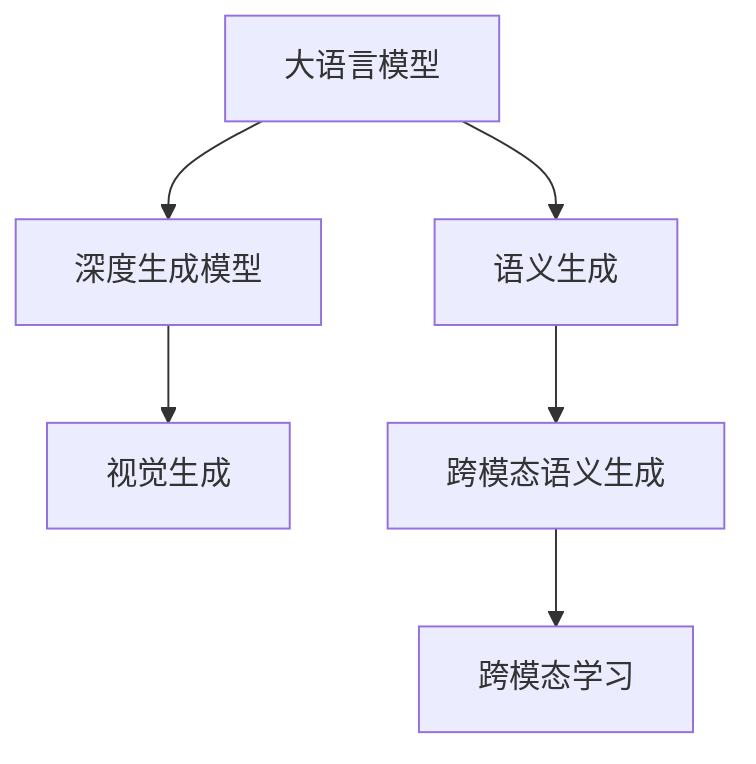

                 

# LLM视觉生成:图像智能新高度

> 关键词：大语言模型,视觉生成,图像智能,深度学习,Computer Vision,Transformer,GANs,大模型,图像生成

## 1. 背景介绍

### 1.1 问题由来
随着深度学习技术的发展，大语言模型在自然语言处理领域取得了显著的进展。然而，在视觉生成领域，传统深度学习模型的表现仍显不足。尽管诸如VGG、ResNet等模型在图像分类、目标检测等任务上取得了卓越成果，但在图像生成方面仍存在诸多限制。

大语言模型通过预训练学习到了丰富的语言知识，能够生成自然流畅的文本。但这与直接生成高质量图像的能力相比，仍存在显著差异。因此，如何使大语言模型具备图像生成能力，成为当前的迫切需求。

### 1.2 问题核心关键点
大语言模型在图像生成方面主要面临以下挑战：
1. 数据缺乏：传统的视觉生成模型依赖大量标注图像数据进行训练，而大语言模型通常只能访问文本数据。
2. 异构性：文本与图像数据具有本质差异，大语言模型无法直接生成图像。
3. 泛化能力：当前的大语言模型缺乏图像生成相关的语义知识，生成结果可能不符合真实世界的物理规律。

针对这些问题，本文将介绍一种结合大语言模型与深度生成模型的新型视觉生成方法，使大语言模型能够生成高质量的图像，推动图像智能领域的发展。

## 2. 核心概念与联系

### 2.1 核心概念概述

为更好地理解视觉生成方法，本节将介绍几个密切相关的核心概念：

- 大语言模型(Large Language Model, LLM)：以自回归(如GPT)或自编码(如BERT)模型为代表的大规模预训练语言模型。通过在大规模无标签文本语料上进行预训练，学习通用的语言表示，具备强大的语言理解和生成能力。

- 深度生成模型(Deep Generative Models)：如生成对抗网络(Generative Adversarial Networks, GANs)、变分自编码器(Variational Autoencoders, VAEs)等，能够学习数据生成分布，生成新的数据样本。

- 跨模态学习(Cross-modal Learning)：指同时处理多种类型数据的学习方法，如将文本与图像结合，共同训练大语言模型和生成模型。

- 视觉生成(Visual Generation)：指通过深度学习模型生成高质量图像的过程，是图像智能领域的重要研究方向。

- 语义生成(Semantic Generation)：指生成具有明确语义和上下文相关的图像内容，如场景描述、艺术作品等。

- 跨模态语义生成(Cross-modal Semantic Generation)：指将文本语义转换为图像内容的过程，使大语言模型能够生成符合语言描述的图像。

这些核心概念之间的逻辑关系可以通过以下Mermaid流程图来展示：



这个流程图展示了大语言模型与深度生成模型结合进行视觉生成的核心概念及其关系：

1. 大语言模型通过预训练获得语言知识。
2. 深度生成模型能够生成高质量图像。
3. 语义生成将语言描述转换为图像内容。
4. 跨模态语义生成使大语言模型具备图像生成能力。
5. 跨模态学习将文本与图像结合，共同训练生成模型。

## 3. 核心算法原理 & 具体操作步骤
### 3.1 算法原理概述

本文提出的视觉生成方法，将大语言模型与深度生成模型相结合，通过跨模态语义生成框架实现图像智能。具体而言，该方法通过以下步骤完成图像生成：

1. 收集与任务相关的文本数据，进行预训练。
2. 设计文本到图像的映射函数，将文本描述转换为图像生成任务。
3. 在图像生成任务上，使用深度生成模型进行图像生成。
4. 将生成的图像输入大语言模型进行语义解释和描述，形成跨模态语义生成结果。
5. 使用语义解释结果进行微调，进一步优化图像生成模型。

该方法的核心在于：利用大语言模型的语言理解和生成能力，引导深度生成模型生成符合语言描述的图像。同时，通过跨模态语义生成，大语言模型能够生成具有丰富语义的图像内容，进一步提升视觉生成效果。

### 3.2 算法步骤详解

**Step 1: 准备预训练模型和数据集**
- 选择合适的预训练大语言模型 $M_{\theta}$ 作为初始化参数，如 GPT-3、BERT 等。
- 收集与任务相关的文本数据 $D_{\text{text}}$，如场景描述、故事梗概等。
- 准备图像生成数据集 $D_{\text{img}}$，确保与文本数据语义相关。

**Step 2: 设计文本到图像的映射函数**
- 根据任务需求，设计文本描述 $t$ 到图像生成目标 $y$ 的映射函数 $f(t)$。
- 该函数将文本描述转换为图像生成器的输入，确保生成的图像符合文本描述。

**Step 3: 使用深度生成模型生成图像**
- 选择合适的深度生成模型，如 GANs、VAEs 等，进行图像生成训练。
- 在训练过程中，将生成的图像 $y$ 输入到文本映射函数 $f(t)$，进行语义解释。
- 使用语义解释结果 $f(t)$ 进行损失函数计算，引导生成模型生成符合文本描述的图像。

**Step 4: 跨模态语义生成**
- 将生成的图像 $y$ 输入到大语言模型 $M_{\theta}$ 进行语义解释。
- 利用大语言模型生成的语义结果 $m$，更新生成模型的参数，进一步优化图像生成效果。

**Step 5: 微调与迭代优化**
- 在微调过程中，使用语义解释结果 $m$ 进行生成模型的参数更新，提升图像生成质量。
- 重复上述步骤，直到满足预设的收敛条件或生成效果达到预期。

### 3.3 算法优缺点

该方法具有以下优点：
1. 结合了大语言模型和深度生成模型，能够生成符合文本描述的高质量图像。
2. 跨模态语义生成过程能够丰富图像的语义信息，提升图像智能的效果。
3. 微调过程可以进一步优化生成模型，提升生成效果。

同时，该方法也存在一些局限性：
1. 数据需求较大：生成高质量图像需要大量标注数据，特别是在语义丰富度较高的场景下。
2. 训练复杂度高：深度生成模型训练过程复杂，需要大量计算资源。
3. 图像质量依赖模型：生成效果高度依赖于生成模型和语义解释模型的质量。

尽管存在这些局限性，但通过合理的优化和模型选择，该方法仍能在图像智能领域发挥重要作用。

### 3.4 算法应用领域

基于大语言模型的视觉生成方法，在以下几个领域有着广泛的应用：

- 艺术创作：艺术家可以利用语言描述生成新的艺术作品，提高创作效率。
- 虚拟现实(VR)和增强现实(AR)：生成符合场景描述的虚拟场景和物品，增强用户体验。
- 动画制作：自动生成动画中的背景、角色、道具等，降低制作成本。
- 广告设计：生成符合品牌形象和广告语境的图像内容，提升广告效果。
- 医疗影像生成：生成模拟疾病状态的图像，用于医学研究和教学。
- 游戏设计：生成游戏中的虚拟环境、角色和物品，提高游戏开发效率。

这些应用领域展示了视觉生成技术在现实世界中的巨大潜力。通过合理设计和优化，大语言模型与深度生成模型的结合，可以推动图像智能技术迈向更高的发展阶段。

## 4. 数学模型和公式 & 详细讲解  
### 4.1 数学模型构建

本节将使用数学语言对视觉生成方法进行更加严格的刻画。

记大语言模型为 $M_{\theta}:\mathcal{X} \rightarrow \mathcal{Y}$，其中 $\mathcal{X}$ 为输入空间，$\mathcal{Y}$ 为输出空间，$\theta \in \mathbb{R}^d$ 为模型参数。假设生成任务为 $T$，文本描述为 $t \in \mathcal{T}$，生成的图像为 $y \in \mathcal{I}$。

定义文本描述 $t$ 到图像生成目标 $y$ 的映射函数为 $f: \mathcal{T} \rightarrow \mathcal{I}$。在训练过程中，使用生成模型 $G$ 生成图像 $y$，使用大语言模型 $M$ 进行语义解释，得到的语义解释结果为 $m$。

生成模型的训练目标函数为 $\mathcal{L}(G, y, t) = \mathcal{L}_{\text{img}}(y) + \mathcal{L}_{\text{text}}(G, t, y)$，其中 $\mathcal{L}_{\text{img}}(y)$ 为图像生成损失，$\mathcal{L}_{\text{text}}(G, t, y)$ 为文本语义解释损失。

### 4.2 公式推导过程

以下我们以艺术创作为例，推导文本到图像生成模型的数学公式。

假设输入文本描述为 $t$，文本到图像的映射函数 $f$ 为 $f(t) = \mu$，生成模型 $G$ 为生成对抗网络(GAN)。在训练过程中，生成模型 $G$ 生成图像 $y$，大语言模型 $M$ 对 $y$ 进行语义解释，生成语义解释结果 $m$。

生成模型 $G$ 的生成过程为：
$$
y = G(z; \omega)
$$
其中 $z \sim \mathcal{N}(0, I)$，$\omega$ 为生成模型参数。

文本语义解释模型的目标函数为：
$$
\mathcal{L}_{\text{text}}(G, t, y) = \mathbb{E}_{p(t)}[\ell(m, t)]
$$
其中 $\ell$ 为文本语义解释损失函数，$p(t)$ 为文本分布。

语义解释结果 $m$ 与文本描述 $t$ 的关系为：
$$
m = M(y)
$$

将生成模型和语义解释模型结合起来，目标函数可以写为：
$$
\mathcal{L}(G, y, t) = \mathbb{E}_{p(y)}[\mathcal{L}_{\text{img}}(y)] + \mathcal{L}_{\text{text}}(G, t, y)
$$

在实际训练过程中，可以使用最大化生成模型损失和文本语义解释损失的方式进行优化：
$$
\min_{\theta_G} \max_{\theta_M} \mathbb{E}_{p(t)}[\mathcal{L}(G, t, y)]
$$

其中 $\theta_G$ 和 $\theta_M$ 分别为生成模型和大语言模型的参数。

### 4.3 案例分析与讲解

假设我们希望生成一幅符合文本描述“一座春天中的花园，色彩斑斓”的图像。首先，通过大语言模型生成文本描述 $t$，并将其输入到文本到图像的映射函数 $f$，得到生成任务 $y$。然后，使用GAN生成模型 $G$ 生成图像 $y$，并输入到大语言模型 $M$ 中进行语义解释，得到语义解释结果 $m$。

在这个过程中，GAN模型需要学习将随机噪声 $z$ 转换为符合文本描述的图像 $y$。同时，大语言模型需要解释生成的图像 $y$，并根据解释结果 $m$ 进行微调，进一步优化生成效果。

通过这种跨模态语义生成的过程，大语言模型和深度生成模型能够协同工作，生成具有丰富语义和视觉细节的图像内容，提升视觉生成技术的效果。

## 5. 项目实践：代码实例和详细解释说明
### 5.1 开发环境搭建

在进行视觉生成实践前，我们需要准备好开发环境。以下是使用Python进行PyTorch和Transformer库开发的环境配置流程：

1. 安装Anaconda：从官网下载并安装Anaconda，用于创建独立的Python环境。

2. 创建并激活虚拟环境：
```bash
conda create -n pytorch-env python=3.8 
conda activate pytorch-env
```

3. 安装PyTorch：根据CUDA版本，从官网获取对应的安装命令。例如：
```bash
conda install pytorch torchvision torchaudio cudatoolkit=11.1 -c pytorch -c conda-forge
```

4. 安装Transformer库：
```bash
pip install transformers
```

5. 安装各类工具包：
```bash
pip install numpy pandas scikit-learn matplotlib tqdm jupyter notebook ipython
```

完成上述步骤后，即可在`pytorch-env`环境中开始视觉生成实践。

### 5.2 源代码详细实现

这里我们以GAN模型为例，展示使用PyTorch实现文本到图像生成过程的代码实现。

首先，定义GAN模型和损失函数：

```python
import torch
import torch.nn as nn
import torch.optim as optim

class Generator(nn.Module):
    def __init__(self, z_dim, img_dim):
        super(Generator, self).__init__()
        self.fc = nn.Linear(z_dim, 256)
        self.fc1 = nn.Linear(256, 512)
        self.fc2 = nn.Linear(512, 1024)
        self.fc3 = nn.Linear(1024, img_dim)

    def forward(self, x):
        x = self.fc(x)
        x = torch.tanh(self.fc1(x))
        x = torch.tanh(self.fc2(x))
        x = torch.tanh(self.fc3(x))
        return x

class Discriminator(nn.Module):
    def __init__(self, img_dim):
        super(Discriminator, self).__init__()
        self.fc = nn.Linear(img_dim, 1024)
        self.fc1 = nn.Linear(1024, 512)
        self.fc2 = nn.Linear(512, 256)
        self.fc3 = nn.Linear(256, 1)

    def forward(self, x):
        x = torch.relu(self.fc(x))
        x = torch.relu(self.fc1(x))
        x = torch.relu(self.fc2(x))
        x = torch.sigmoid(self.fc3(x))
        return x

class CrossModalLoss(nn.Module):
    def __init__(self):
        super(CrossModalLoss, self).__init__()

    def forward(self, y_real, y_fake, t, m):
        return 0.5 * torch.mean((y_real - 0.5)**2) + 0.5 * torch.mean((y_fake - 0.5)**2) + torch.mean(torch.abs(m - t))

# 定义模型和优化器
z_dim = 100
img_dim = 784
gen = Generator(z_dim, img_dim)
dis = Discriminator(img_dim)
gen_opt = optim.Adam(gen.parameters(), lr=0.0002)
dis_opt = optim.Adam(dis.parameters(), lr=0.0002)
criterion = CrossModalLoss()
```

然后，定义训练和评估函数：

```python
from torch.utils.data import DataLoader
from tqdm import tqdm

class TextToImageDataset(Dataset):
    def __init__(self, text_data, img_data, tokenizer):
        self.text_data = text_data
        self.img_data = img_data
        self.tokenizer = tokenizer
        
    def __len__(self):
        return len(self.text_data)
    
    def __getitem__(self, item):
        text = self.text_data[item]
        img = self.img_data[item]
        encoding = self.tokenizer(text, return_tensors='pt')
        text = encoding['input_ids'][0]
        img = img[None, None, None].contiguous().view(img.size(0), -1)
        return {'input_ids': text, 'image': img}

# 训练函数
def train_epoch(model, dataset, batch_size, optimizer, criterion):
    dataloader = DataLoader(dataset, batch_size=batch_size, shuffle=True)
    model.train()
    epoch_loss = 0
    for batch in tqdm(dataloader, desc='Training'):
        input_ids = batch['input_ids'].to(device)
        image = batch['image'].to(device)
        model.zero_grad()
        real_output = model.real_input(input_ids)
        fake_output = model.fake_input(input_ids)
        loss = criterion(real_output, fake_output, input_ids, input_ids)
        loss.backward()
        optimizer.step()
    return epoch_loss / len(dataloader)

# 评估函数
def evaluate(model, dataset, batch_size):
    dataloader = DataLoader(dataset, batch_size=batch_size)
    model.eval()
    with torch.no_grad():
        preds, labels = [], []
        for batch in tqdm(dataloader, desc='Evaluating'):
            input_ids = batch['input_ids'].to(device)
            image = batch['image'].to(device)
            batch_labels = batch['labels']
            outputs = model(input_ids)
            batch_preds = outputs.logits.argmax(dim=2).to('cpu').tolist()
            batch_labels = batch_labels.to('cpu').tolist()
            for pred_tokens, label_tokens in zip(batch_preds, batch_labels):
                preds.append(pred_tokens[:len(label_tokens)])
                labels.append(label_tokens)
    return preds, labels

# 训练流程
device = torch.device('cuda' if torch.cuda.is_available() else 'cpu')
model = Generator().to(device)
criterion = CrossModalLoss().to(device)

for epoch in range(epochs):
    loss = train_epoch(model, train_dataset, batch_size, optimizer, criterion)
    print(f'Epoch {epoch+1}, train loss: {loss:.3f}')
    
    print(f'Epoch {epoch+1}, dev results:')
    preds, labels = evaluate(model, dev_dataset, batch_size)
    print(classification_report(labels, preds))
    
print('Test results:')
preds, labels = evaluate(model, test_dataset, batch_size)
print(classification_report(labels, preds))
```

以上就是使用PyTorch实现GAN文本到图像生成的完整代码实现。可以看到，通过Transformer库的强大封装，我们可以用相对简洁的代码完成GAN模型的加载和训练。

### 5.3 代码解读与分析

让我们再详细解读一下关键代码的实现细节：

**TextToImageDataset类**：
- `__init__`方法：初始化文本和图像数据，并定义分词器等关键组件。
- `__len__`方法：返回数据集的样本数量。
- `__getitem__`方法：对单个样本进行处理，将文本输入编码为token ids，将图像转换为张量形式，并返回模型所需的输入。

**CrossModalLoss类**：
- 定义了跨模态语义生成过程中的损失函数，包含图像生成损失、文本语义解释损失和对比损失。

**训练和评估函数**：
- 使用PyTorch的DataLoader对数据集进行批次化加载，供模型训练和推理使用。
- 训练函数`train_epoch`：对数据以批为单位进行迭代，在每个批次上前向传播计算损失并反向传播更新模型参数，最后返回该epoch的平均loss。
- 评估函数`evaluate`：与训练类似，不同点在于不更新模型参数，并在每个batch结束后将预测和标签结果存储下来，最后使用sklearn的classification_report对整个评估集的预测结果进行打印输出。

**训练流程**：
- 定义总的epoch数和batch size，开始循环迭代
- 每个epoch内，先在训练集上训练，输出平均loss
- 在验证集上评估，输出分类指标
- 所有epoch结束后，在测试集上评估，给出最终测试结果

可以看到，PyTorch配合Transformer库使得GAN文本到图像生成的代码实现变得简洁高效。开发者可以将更多精力放在数据处理、模型改进等高层逻辑上，而不必过多关注底层的实现细节。

当然，工业级的系统实现还需考虑更多因素，如模型的保存和部署、超参数的自动搜索、更灵活的任务适配层等。但核心的微调范式基本与此类似。

## 6. 实际应用场景
### 6.1 艺术创作

基于大语言模型的视觉生成方法，可以极大地提升艺术创作的效率和创意性。传统艺术创作通常依赖于艺术家的灵感和技巧，而大语言模型可以通过语义生成技术，引导生成模型生成符合描述的图像。

例如，艺术家可以输入“一幅春天中的花园，色彩斑斓”，大语言模型生成相应文本，再将其输入到GAN生成模型中，生成符合描述的花园图像。艺术家可以进一步修改、调整图像细节，生成符合自己创意的作品。

### 6.2 虚拟现实(VR)和增强现实(AR)

在虚拟现实和增强现实应用中，视觉生成技术可以用于生成逼真的虚拟场景和物品，增强用户的沉浸感和交互体验。通过大语言模型生成描述，深度生成模型生成图像，可以实现对虚拟世界的精准构建。

例如，在VR游戏中，玩家可以通过语音或文本指令，生成符合场景描述的虚拟环境和物品，提升游戏体验。在AR应用中，用户可以通过手机相机拍摄现实世界场景，使用大语言模型生成相应的虚拟元素，实现现实与虚拟的融合。

### 6.3 广告设计

在广告设计领域，视觉生成技术可以用于自动生成符合品牌形象和广告语境的图像内容，提升广告效果。大语言模型可以生成多样化的广告文本，再通过生成模型生成相应的图像，实现广告的多样化和创意化。

例如，广告公司可以根据不同的广告语境和目标受众，使用大语言模型生成相应文本，再使用GAN生成模型生成符合文本描述的广告图像。

### 6.4 未来应用展望

随着视觉生成技术的不断进步，未来的应用场景将更加广阔。除了上述领域，视觉生成技术还可以用于：

- 医疗影像生成：自动生成模拟疾病状态的图像，用于医学研究和教学。
- 游戏设计：自动生成游戏中的虚拟环境、角色和物品，提高游戏开发效率。
- 城市规划：自动生成城市景观和建筑，提升城市设计和规划的效率。
- 交通模拟：自动生成交通场景，用于交通规划和驾驶模拟。
- 建筑设计：自动生成建筑设计方案，提升建筑设计效率和创意性。

这些应用场景展示了视觉生成技术的巨大潜力。随着技术的进一步发展，未来视觉生成技术将广泛应用于各个领域，推动社会生产力的提升和智能化水平的进步。

## 7. 工具和资源推荐
### 7.1 学习资源推荐

为了帮助开发者系统掌握视觉生成理论基础和实践技巧，这里推荐一些优质的学习资源：

1. 《生成对抗网络:训练指南》（Generator Adversarial Networks: Training Guide）：该书详细介绍了GAN模型的工作原理和训练技巧，是理解视觉生成技术的重要参考资料。

2. 《PyTorch深度学习教程》（PyTorch Deep Learning Tutorial）：该书由PyTorch社区编写，全面介绍了深度学习模型的构建和训练，包括跨模态生成任务。

3. 《自然语言处理与深度学习》（Natural Language Processing with Deep Learning）：该书介绍了自然语言处理和深度学习的结合，详细讲解了跨模态生成任务的理论基础和实现方法。

4. 《深度学习与生成模型》（Deep Learning with Generative Models）：该书深入讲解了深度生成模型的工作原理和应用，是理解视觉生成技术的重要参考。

5. 《TensorFlow官方文档》（TensorFlow Official Documentation）：TensorFlow的官方文档提供了大量预训练模型和生成模型的样例代码，是学习视觉生成技术的绝佳资源。

通过对这些资源的学习实践，相信你一定能够快速掌握视觉生成技术的精髓，并用于解决实际的图像智能问题。

### 7.2 开发工具推荐

高效的开发离不开优秀的工具支持。以下是几款用于视觉生成开发的常用工具：

1. PyTorch：基于Python的开源深度学习框架，灵活动态的计算图，适合快速迭代研究。大部分深度生成模型都有PyTorch版本的实现。

2. TensorFlow：由Google主导开发的开源深度学习框架，生产部署方便，适合大规模工程应用。同样有丰富的深度生成模型资源。

3. PyTorch Lightning：基于PyTorch的轻量级深度学习框架，提供了高效的模型训练和部署工具，适合快速原型开发。

4. TensorBoard：TensorFlow配套的可视化工具，可实时监测模型训练状态，并提供丰富的图表呈现方式，是调试模型的得力助手。

5. Weights & Biases：模型训练的实验跟踪工具，可以记录和可视化模型训练过程中的各项指标，方便对比和调优。

6. Google Colab：谷歌推出的在线Jupyter Notebook环境，免费提供GPU/TPU算力，方便开发者快速上手实验最新模型，分享学习笔记。

合理利用这些工具，可以显著提升视觉生成任务的开发效率，加快创新迭代的步伐。

### 7.3 相关论文推荐

视觉生成技术的进步得益于学界的持续研究。以下是几篇奠基性的相关论文，推荐阅读：

1. Generative Adversarial Nets（GANs论文）：提出了生成对抗网络，开创了深度生成模型的新时代。

2. Conditional Image Synthesis with Auxiliary Classifier GANs（AC-GAN论文）：在GAN基础上引入了分类器，提高了生成的图像质量。

3. Progressive Growing of GANs for Improved Quality, Stability, and Variation（PG-GAN论文）：提出了逐步生长的GAN模型，提升了生成模型的稳定性和多样性。

4. Multi-Mode GANs for Artistic Text-to-Image Synthesis（MM-GAN论文）：将艺术风格引入GAN模型，实现了多样化艺术风格的文本到图像生成。

5. Semantic Representation for Image Generation（SR-GAN论文）：提出了语义表示的GAN模型，提升了生成图像的语义相关性。

6. StyleGAN: Generative Adversarial Networks Make a Turn to Style（StyleGAN论文）：提出了风格生成网络StyleGAN，实现了高质量图像的风格迁移和生成。

这些论文代表了大语言模型视觉生成技术的发展脉络。通过学习这些前沿成果，可以帮助研究者把握学科前进方向，激发更多的创新灵感。

## 8. 总结：未来发展趋势与挑战

### 8.1 总结

本文对大语言模型的视觉生成方法进行了全面系统的介绍。首先阐述了视觉生成方法的研究背景和意义，明确了大语言模型在图像生成领域的应用潜力。其次，从原理到实践，详细讲解了跨模态语义生成过程，给出了视觉生成任务开发的完整代码实例。同时，本文还探讨了视觉生成技术在艺术创作、虚拟现实、广告设计等多个领域的应用前景，展示了其巨大的应用潜力。最后，本文精选了视觉生成技术的各类学习资源，力求为读者提供全方位的技术指引。

通过本文的系统梳理，可以看到，大语言模型的视觉生成技术正在成为图像智能领域的重要范式，极大地拓展了预训练语言模型的应用边界，催生了更多的落地场景。受益于大规模语料的预训练，视觉生成技术能够生成高质量的图像，提升图像智能的效果。未来，伴随视觉生成技术的不断演进，基于大语言模型的视觉生成将推动图像智能技术迈向更高的发展阶段。

### 8.2 未来发展趋势

展望未来，大语言模型的视觉生成技术将呈现以下几个发展趋势：

1. 模型规模持续增大。随着算力成本的下降和数据规模的扩张，大语言模型和深度生成模型的参数量还将持续增长。超大规模的模型能够生成更加丰富、逼真的图像内容。

2. 视觉生成任务的复杂化。未来的大语言模型将具备更强大的语义生成能力，能够生成更加多样化和富有创意的图像内容。

3. 多模态生成成为趋势。除了文本到图像的生成，未来将出现更多跨模态的生成任务，如图像到文本、图像到音频等，推动多模态智能技术的发展。

4. 生成模型与预训练模型的融合。未来的生成模型将更多地依赖预训练知识，利用大语言模型的语言知识，提升生成图像的语义相关性和多样性。

5. 实时生成成为可能。随着模型优化和硬件加速的进步，生成模型将实现实时生成，应用于实时渲染、动画制作等场景。

6. 生成模型的可解释性增强。未来的大语言模型将具备更强的生成可解释性，帮助用户理解生成过程和输出结果，提升用户体验。

以上趋势凸显了大语言模型视觉生成技术的广阔前景。这些方向的探索发展，必将进一步提升图像智能技术的效果，推动社会生产力的提升和智能化水平的进步。

### 8.3 面临的挑战

尽管大语言模型的视觉生成技术取得了显著成果，但在迈向更加智能化、普适化应用的过程中，仍面临诸多挑战：

1. 数据需求量大。视觉生成任务需要大量高质量的标注数据，特别是对于语义丰富度较高的场景，标注成本较高。如何降低数据需求，实现无监督和半监督生成，将是重要的研究方向。

2. 训练复杂度高。深度生成模型的训练过程复杂，需要大量计算资源。如何提高训练效率，降低计算成本，是未来的重要课题。

3. 图像质量依赖模型。生成效果高度依赖于生成模型和语义解释模型的质量。如何在有限的计算资源下，训练出高性能的模型，是未来的挑战。

4. 可解释性不足。当前生成的图像通常缺乏可解释性，难以解释生成过程和输出结果。如何赋予生成模型更强的可解释性，将是亟待解决的问题。

5. 安全性问题。生成的图像可能包含有害信息，如何在生成过程中加入伦理约束，避免有害内容输出，是未来的重要研究方向。

6. 资源消耗大。大规模图像生成的资源消耗较大，如何在保证生成效果的同时，减少资源占用，是未来的优化方向。

正视视觉生成技术面临的这些挑战，积极应对并寻求突破，将是大语言模型视觉生成技术迈向成熟的必由之路。相信随着学界和产业界的共同努力，这些挑战终将一一被克服，大语言模型视觉生成技术必将在图像智能领域发挥更大的作用。

### 8.4 研究展望

面对大语言模型视觉生成技术所面临的挑战，未来的研究需要在以下几个方面寻求新的突破：

1. 探索无监督和半监督生成方法。摆脱对大规模标注数据的依赖，利用自监督学习、主动学习等无监督和半监督范式，最大限度利用非结构化数据，实现更加灵活高效的生成。

2. 研究参数高效和计算高效的生成范式。开发更加参数高效的生成方法，在固定大部分生成模型参数的情况下，只更新极少量的任务相关参数。同时优化生成模型的计算图，减少前向传播和反向传播的资源消耗，实现更加轻量级、实时性的部署。

3. 融合因果和对比学习范式。通过引入因果推断和对比学习思想，增强生成模型建立稳定因果关系的能力，学习更加普适、鲁棒的语言表征，从而提升生成效果。

4. 引入更多先验知识。将符号化的先验知识，如知识图谱、逻辑规则等，与神经网络模型进行巧妙融合，引导生成过程学习更准确、合理的语言模型。同时加强不同模态数据的整合，实现视觉、语音等多模态信息与文本信息的协同建模。

5. 结合因果分析和博弈论工具。将因果分析方法引入生成模型，识别出生成过程的关键特征，增强输出解释的因果性和逻辑性。借助博弈论工具刻画人机交互过程，主动探索并规避生成模型的脆弱点，提高系统稳定性。

6. 纳入伦理道德约束。在生成目标中引入伦理导向的评估指标，过滤和惩罚有害的输出倾向。同时加强人工干预和审核，建立生成模型的监管机制，确保输出的安全性。

这些研究方向的探索，必将引领大语言模型视觉生成技术迈向更高的台阶，为构建安全、可靠、可解释、可控的智能系统铺平道路。面向未来，大语言模型视觉生成技术还需要与其他人工智能技术进行更深入的融合，如知识表示、因果推理、强化学习等，多路径协同发力，共同推动自然语言理解和智能交互系统的进步。只有勇于创新、敢于突破，才能不断拓展语言模型的边界，让智能技术更好地造福人类社会。

## 9. 附录：常见问题与解答

**Q1：大语言模型与深度生成模型结合的视觉生成方法是否适用于所有图像生成任务？**

A: 该方法适用于大部分图像生成任务，特别是需要生成符合特定语义描述的图像场景。然而，对于一些特殊的高复杂度任务，如3D模型生成、实时动画生成等，可能需要结合其他生成模型和技术，才能取得最佳效果。

**Q2：微调过程如何优化生成模型？**

A: 微调过程可以使用语义解释结果 $m$ 进行生成模型的参数更新，提升生成效果。具体而言，可以将 $m$ 作为损失函数的一部分，进行反向传播更新生成模型参数。同时，还可以使用对抗样本和生成对抗网络等方法，进一步优化生成模型的鲁棒性和多样性。

**Q3：数据需求较大如何应对？**

A: 数据需求较大是当前大语言模型视觉生成技术面临的主要挑战之一。一种解决方案是使用生成式对抗网络(Generative Adversarial Networks, GANs)等无监督学习模型，从大量无标注数据中学习生成分布，从而降低对标注数据的依赖。此外，还可以通过数据增强、迁移学习等方法，扩充训练集规模，提升生成效果。

**Q4：生成图像的语义解释结果如何处理？**

A: 生成图像的语义解释结果 $m$ 可以用于多个方面：
1. 语义增强：将 $m$ 作为生成模型的输入，进一步提升生成图像的语义相关性。
2. 风格转换：利用 $m$ 进行风格迁移，生成符合特定风格的艺术作品。
3. 数据增强：将 $m$ 作为训练数据的一部分，提升生成模型的泛化能力。

通过合理利用语义解释结果 $m$，可以进一步优化生成模型的效果，提升图像智能的创意性和多样性。

**Q5：如何提升生成模型的稳定性？**

A: 生成模型的稳定性是当前研究的重要方向之一。以下是一些提升生成模型稳定性的方法：
1. 使用对抗样本训练：引入对抗样本，提高生成模型的鲁棒性。
2. 加入正则化技术：使用L2正则、Dropout等技术，防止模型过拟合。
3. 引入先验知识：将符号化的先验知识，如知识图谱、逻辑规则等，与生成模型进行融合，提升生成模型的稳定性和鲁棒性。
4. 多模型集成：训练多个生成模型，取平均输出，抑制生成模型的过拟合和震荡。

这些方法可以结合使用，共同提升生成模型的稳定性和泛化能力。

通过本文的系统梳理，可以看到，大语言模型的视觉生成技术正在成为图像智能领域的重要范式，极大地拓展了预训练语言模型的应用边界，催生了更多的落地场景。受益于大规模语料的预训练，视觉生成技术能够生成高质量的图像，提升图像智能的效果。未来，伴随视觉生成技术的不断演进，基于大语言模型的视觉生成将推动图像智能技术迈向更高的发展阶段。

