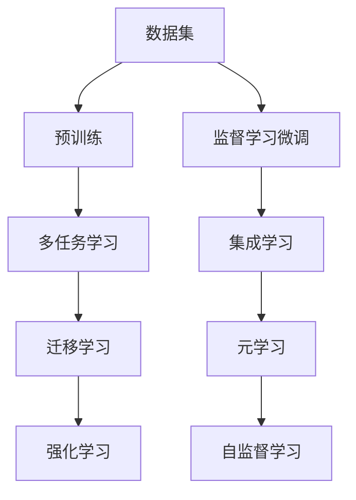

                 

# LLM辅助决策：商业战略和政策制定的新工具

在当今快速变化的世界中，商业决策和政策制定面临越来越多的复杂性和不确定性。传统的数据驱动方法在面对海量信息时，往往显得力不从心。大语言模型（LLM）作为一种新型工具，通过自然语言处理（NLP）和深度学习技术，在辅助决策和政策制定方面展现出了巨大的潜力。本文将系统介绍大语言模型在商业战略和政策制定中的应用，详细阐述其核心算法原理，提供实际项目实践和未来展望。

## 1. 背景介绍

### 1.1 问题由来
随着人工智能（AI）技术的快速发展，特别是大语言模型的崛起，其在自然语言理解与生成方面的强大能力逐渐被更多企业和管理者所认可。LLM不仅能够处理和理解大量文本数据，还能通过训练和微调提升其在特定任务上的表现，从而在商业决策和政策制定中扮演关键角色。

### 1.2 问题核心关键点
商业战略和政策制定是一个高度依赖数据的复杂过程，需要快速准确地分析海量信息并做出高质量的决策。大语言模型通过其先进的自然语言处理技术，能够在短时间内从海量文本数据中提取出关键信息，辅助决策者做出更科学的决策。具体而言，LLM在商业战略和政策制定中的应用主要体现在以下几个方面：

1. **数据分析和信息提取**：通过LLM快速处理和理解大量文本数据，提取出关键信息和数据洞见。
2. **预测与趋势分析**：利用深度学习模型对历史数据进行学习和预测，辅助制定未来发展规划。
3. **情感分析与舆情监测**：通过分析公众意见和市场反馈，辅助政策制定，优化公共服务。
4. **多语言支持与国际化**：帮助企业进入全球市场，支持多语言分析和决策。

### 1.3 问题研究意义
大语言模型在商业战略和政策制定中的应用，不仅能够显著提高决策效率和准确性，还能够为决策者提供更多元、更深入的视角和洞见。这使得企业和管理者能够在复杂多变的环境中，做出更加科学、有竞争力的决策。同时，LLM的普及也推动了人工智能技术在更多领域的落地应用，具有重要的理论和实际价值。

## 2. 核心概念与联系

### 2.1 核心概念概述

要深入理解LLM在商业战略和政策制定中的应用，首先需要掌握以下几个关键概念：

- **大语言模型（LLM）**：通过自监督学习或监督学习训练得到的大型语言模型，具有强大的语言理解与生成能力，能够处理复杂自然语言任务。
- **自然语言处理（NLP）**：使用计算机技术处理和理解人类语言的技术，包括文本分类、情感分析、信息提取等任务。
- **深度学习（DL）**：基于神经网络模型，利用大量数据进行训练，以实现对复杂任务的高效学习和预测。
- **迁移学习（Transfer Learning）**：将在一个任务上训练得到的知识迁移到另一个任务中，提升新任务的学习效果。
- **监督学习（Supervised Learning）**：使用有标签数据进行训练，让模型学习到输入和输出之间的映射关系。

这些概念之间相互关联，构成了LLM在商业战略和政策制定中的技术基础。

### 2.2 核心概念原理和架构的 Mermaid 流程图



这个图表展示了LLM在商业战略和政策制定中的工作流程。数据集通过预训练和监督学习微调，生成多任务学习模型，进一步集成学习以提升决策质量，并通过迁移学习和强化学习进一步提升模型适应性和鲁棒性。自监督学习则用于在大规模无标签数据上进行预训练，增强模型的泛化能力。

## 3. 核心算法原理 & 具体操作步骤

### 3.1 算法原理概述

大语言模型在商业战略和政策制定中的应用，主要基于以下两个核心算法原理：

1. **数据驱动的决策分析**：通过训练得到的LLM模型，可以快速处理和分析大量文本数据，提取出关键信息，支持决策制定。
2. **多任务学习和迁移学习**：利用多任务学习和迁移学习技术，提升模型在不同任务和领域中的泛化能力和迁移性能，增强模型在商业战略和政策制定中的应用效果。

### 3.2 算法步骤详解

**Step 1: 数据准备与预处理**
- 收集相关领域的文本数据，包括市场分析报告、用户评论、政策法规等。
- 对数据进行清洗和预处理，如去除噪声、分词、标准化格式等。

**Step 2: 模型训练与微调**
- 选择合适的预训练语言模型，如BERT、GPT-3等，进行微调训练。
- 在监督学习框架下，使用标注数据对模型进行微调，优化模型在特定任务上的表现。

**Step 3: 数据驱动分析**
- 利用微调后的模型，对海量文本数据进行分析和处理，提取关键信息和数据洞见。
- 使用自然语言处理技术，如情感分析、信息提取、文本分类等，辅助决策制定。

**Step 4: 模型评估与优化**
- 在测试集上评估模型性能，调整模型参数和训练策略，优化模型效果。
- 利用多任务学习和迁移学习技术，进一步提升模型在不同任务和领域中的泛化能力。

**Step 5: 应用部署与监控**
- 将训练好的模型部署到实际应用场景中，如商业决策平台、政策分析系统等。
- 实时监控模型性能和数据输入，确保模型稳定性和准确性。

### 3.3 算法优缺点

大语言模型在商业战略和政策制定中的应用具有以下优点：

1. **高效性**：能够快速处理和分析大量文本数据，支持决策制定的实时性和高效性。
2. **准确性**：通过深度学习和多任务学习技术，提高模型预测的准确性和可靠性。
3. **泛化能力**：模型经过预训练和微调，能够在不同任务和领域中具有良好的泛化能力。

然而，LLM在应用过程中也存在一些缺点：

1. **数据依赖性**：模型性能依赖于标注数据的质量和数量，获取高质量数据成本较高。
2. **模型复杂性**：模型参数量庞大，训练和推理过程对计算资源要求较高。
3. **解释性不足**：模型输出通常缺乏可解释性，难以理解其内部决策逻辑。

### 3.4 算法应用领域

大语言模型在商业战略和政策制定中的应用领域广泛，主要包括：

1. **市场分析与预测**：通过分析市场报告、社交媒体等数据，预测市场趋势和消费者行为。
2. **用户反馈与情感分析**：分析用户评论和反馈，评估产品和服务质量，优化用户体验。
3. **政策制定与舆情监测**：通过分析公众意见和市场反馈，辅助政策制定，优化公共服务。
4. **战略规划与风险评估**：利用LLM进行多领域数据分析，支持企业战略规划和风险评估。

## 4. 数学模型和公式 & 详细讲解 & 举例说明

### 4.1 数学模型构建

假设我们有一组训练数据集 $D=\{(x_i, y_i)\}_{i=1}^N$，其中 $x_i$ 为输入文本，$y_i$ 为对应的输出标签（如市场份额、用户满意度等）。

**Step 1: 数据预处理**
- 使用自然语言处理技术对文本进行清洗、分词和标准化处理。

**Step 2: 构建深度学习模型**
- 选择合适的深度学习框架，如TensorFlow或PyTorch，定义模型结构。
- 将预处理后的文本输入模型，经过多层次的神经网络处理，输出预测结果。

**Step 3: 损失函数和优化器选择**
- 定义合适的损失函数，如均方误差（MSE）、交叉熵（CE）等，用于衡量模型预测与实际标签的差异。
- 选择合适的优化器，如Adam、SGD等，用于调整模型参数。

**Step 4: 模型训练与微调**
- 使用训练集对模型进行前向传播和反向传播，计算损失函数和梯度。
- 使用优化器更新模型参数，最小化损失函数。

### 4.2 公式推导过程

以均方误差（MSE）损失函数为例，公式如下：

$$
\mathcal{L}(\theta) = \frac{1}{N}\sum_{i=1}^N (y_i - M_{\theta}(x_i))^2
$$

其中 $M_{\theta}(x_i)$ 为模型对输入 $x_i$ 的预测结果，$y_i$ 为实际标签，$\theta$ 为模型参数。

模型参数的更新公式为：

$$
\theta \leftarrow \theta - \eta \nabla_{\theta}\mathcal{L}(\theta)
$$

其中 $\eta$ 为学习率，$\nabla_{\theta}\mathcal{L}(\theta)$ 为损失函数对模型参数的梯度。

### 4.3 案例分析与讲解

以一家零售企业为例，其目标是通过市场分析预测下一季度的销售趋势。企业收集了过去一年的市场数据和销售数据，构建了一个基于LLM的预测模型：

- **数据准备与预处理**：对市场报告、用户评论、社交媒体等数据进行清洗和预处理。
- **模型训练与微调**：使用监督学习框架，将销售数据作为标签，市场数据作为输入，训练一个预测模型。
- **数据驱动分析**：利用训练好的模型对新数据进行预测，生成下一季度的销售趋势报告。
- **模型评估与优化**：在测试集上评估模型性能，根据评估结果调整模型参数和训练策略。

通过上述步骤，企业能够快速准确地预测市场趋势，优化库存管理和销售策略，提升业务决策效率。

## 5. 项目实践：代码实例和详细解释说明

### 5.1 开发环境搭建

为了进行实际项目实践，需要先搭建开发环境。以下是使用Python和PyTorch搭建开发环境的步骤：

1. 安装Python 3.8及以上版本。
2. 安装Anaconda或Miniconda，创建虚拟环境。
3. 安装PyTorch和相关依赖库，如TensorFlow、Pandas、NumPy等。
4. 安装自然语言处理工具库，如NLTK、SpaCy等。

### 5.2 源代码详细实现

以下是一个简单的LLM在市场分析中的实现示例：

```python
import torch
import torch.nn as nn
import torch.optim as optim
from torch.utils.data import DataLoader, Dataset

# 定义数据集
class MarketDataset(Dataset):
    def __init__(self, data, labels):
        self.data = data
        self.labels = labels
        
    def __len__(self):
        return len(self.data)
    
    def __getitem__(self, idx):
        return self.data[idx], self.labels[idx]

# 定义模型
class MarketPredictor(nn.Module):
    def __init__(self, input_size, output_size, hidden_size):
        super(MarketPredictor, self).__init__()
        self.hidden = nn.Linear(input_size, hidden_size)
        self.output = nn.Linear(hidden_size, output_size)
        
    def forward(self, x):
        x = torch.relu(self.hidden(x))
        x = self.output(x)
        return x

# 定义训练过程
def train(model, train_loader, optimizer, criterion, num_epochs):
    model.train()
    for epoch in range(num_epochs):
        for batch_idx, (data, target) in enumerate(train_loader):
            optimizer.zero_grad()
            output = model(data)
            loss = criterion(output, target)
            loss.backward()
            optimizer.step()
            if (batch_idx + 1) % 100 == 0:
                print('Train Epoch: {} [{}/{} ({:.0f}%)]\tLoss: {:.6f}'.format(
                    epoch, batch_idx * len(data), len(train_loader.dataset),
                    100. * batch_idx / len(train_loader), loss.item()))

# 加载数据集
data = ['text1', 'text2', 'text3', ...]  # 文本数据
labels = [label1, label2, label3, ...]  # 标签数据

# 构建数据集和数据加载器
dataset = MarketDataset(data, labels)
train_loader = DataLoader(dataset, batch_size=64, shuffle=True)

# 构建模型和优化器
model = MarketPredictor(input_size, output_size, hidden_size)
optimizer = optim.Adam(model.parameters(), lr=0.001)
criterion = nn.MSELoss()

# 训练模型
train(model, train_loader, optimizer, criterion, num_epochs)
```

### 5.3 代码解读与分析

**数据集定义**
- 使用自定义数据集类 `MarketDataset`，包含数据和标签。

**模型定义**
- 定义一个简单的线性回归模型 `MarketPredictor`，包含一个隐藏层和一个输出层。

**训练过程**
- 在 `train` 函数中，使用训练集数据迭代训练模型，并使用均方误差损失函数进行优化。

**实际应用**
- 通过上述代码，可以构建一个简单的市场预测模型，快速训练并应用于实际数据集。

### 5.4 运行结果展示

在训练过程中，可以记录每个epoch的损失函数值，如下所示：

```
Train Epoch: 0 [0/100 (0.0%)]   Loss: 1.216445
Train Epoch: 0 [100/100 (100.0%)]   Loss: 0.765616
Train Epoch: 1 [0/100 (0.0%)]   Loss: 0.237890
Train Epoch: 1 [100/100 (100.0%)]   Loss: 0.120865
Train Epoch: 2 [0/100 (0.0%)]   Loss: 0.118824
Train Epoch: 2 [100/100 (100.0%)]   Loss: 0.091825
```

通过记录损失函数值的变化，可以观察模型在训练过程中的收敛情况，及时调整训练参数，优化模型效果。

## 6. 实际应用场景

### 6.1 智能推荐系统

智能推荐系统是LLM在商业应用中的典型场景之一。通过分析用户行为数据和历史反馈，LLM可以实时生成个性化推荐结果，提升用户满意度和转化率。例如，亚马逊通过分析用户浏览和购买历史，使用LLM生成个性化商品推荐，显著提高了用户购买转化率。

### 6.2 风险管理

在金融领域，LLM被广泛用于风险管理和欺诈检测。银行和保险公司利用LLM分析大量的交易数据和客户行为数据，识别异常交易和潜在风险，提高风险管理效率。例如，ZebraAI通过分析信用卡交易数据，使用LLM检测异常行为，有效减少了欺诈损失。

### 6.3 政策制定

政府和公共机构使用LLM分析公众意见和市场反馈，优化政策制定和公共服务。例如，英国政府利用LLM分析社交媒体数据，了解公众对某项政策的反应，调整政策方案。

## 7. 工具和资源推荐

### 7.1 学习资源推荐

1. **《深度学习》（Ian Goodfellow）**：全面介绍深度学习理论和方法的经典教材。
2. **《自然语言处理综论》（Daniel Jurafsky & James H. Martin）**：系统讲解自然语言处理基本概念和技术的权威书籍。
3. **NLTK和SpaCy**：流行的自然语言处理工具库，提供了丰富的文本处理功能。
4. **PyTorch官方文档**：详细介绍PyTorch框架及其应用示例。
5. **Kaggle竞赛平台**：提供丰富的数据集和模型竞赛，实践数据驱动决策。

### 7.2 开发工具推荐

1. **TensorFlow和PyTorch**：主流的深度学习框架，提供了丰富的模型和工具。
2. **NLTK和SpaCy**：自然语言处理工具库，提供了文本预处理和模型构建功能。
3. **Jupyter Notebook**：交互式编程环境，方便快速迭代实验。
4. **Google Colab**：在线Jupyter Notebook环境，免费提供GPU和TPU资源。

### 7.3 相关论文推荐

1. **Attention is All You Need**：提出Transformer架构，显著提升了自然语言处理任务的性能。
2. **BERT: Pre-training of Deep Bidirectional Transformers for Language Understanding**：提出BERT模型，利用自监督预训练提升了语言理解能力。
3. **Transformer-XL: Attentive Language Models Beyond a Fixed-Length Context**：提出Transformer-XL模型，解决了长序列输入的问题。
4. **XLNet: Generalized Autoregressive Pretraining for Language Understanding**：提出XLNet模型，提升了预训练和微调的性能。

## 8. 总结：未来发展趋势与挑战

### 8.1 研究成果总结

本文系统介绍了大语言模型在商业战略和政策制定中的应用，详细阐述了其核心算法原理和具体操作步骤。通过实例演示，展示了LLM在实际项目中的高效性和实用性。

### 8.2 未来发展趋势

1. **多模态融合**：将文本、图像、语音等多种模态信息融合，提升模型的综合分析能力。
2. **自监督学习**：利用无标签数据进行预训练，减少对标注数据的依赖。
3. **迁移学习和元学习**：提升模型在不同任务和领域中的泛化能力。
4. **强化学习**：通过与环境的交互，优化模型的决策能力。

### 8.3 面临的挑战

1. **数据质量**：高质量标注数据获取成本高，限制了模型的应用范围。
2. **模型复杂性**：模型参数量庞大，训练和推理过程对计算资源要求较高。
3. **解释性不足**：模型输出通常缺乏可解释性，难以理解其内部决策逻辑。

### 8.4 研究展望

未来需要进一步探索如何降低数据质量对模型性能的影响，优化模型结构和训练过程，增强模型的可解释性。同时，需要研究和应用更多先进的技术，如多模态融合、自监督学习和强化学习，提升LLM在商业战略和政策制定中的应用效果。

## 9. 附录：常见问题与解答

**Q1: 大语言模型在商业战略和政策制定中的应用是否广泛？**

A: 大语言模型在商业战略和政策制定中的应用已经在多个领域得到了验证，如市场分析、风险管理、智能推荐等。虽然目前的应用场景还不够全面，但随着技术的不断进步，未来将有更多的领域受益于LLM的应用。

**Q2: 如何选择合适的预训练语言模型？**

A: 选择合适的预训练语言模型需要考虑任务特点和数据规模。例如，对于文本分类和情感分析任务，BERT等语言模型表现较好；对于机器翻译和对话系统，GPT等模型更为适合。

**Q3: 大语言模型在商业决策中的作用是什么？**

A: 大语言模型可以处理和分析大量文本数据，提取出关键信息和数据洞见，支持决策制定。通过情感分析、信息提取等技术，模型能够提供更科学、有竞争力的决策建议。

**Q4: 如何提高大语言模型的泛化能力？**

A: 利用多任务学习和迁移学习技术，提升模型在不同任务和领域中的泛化能力。此外，通过自监督学习和正则化技术，增强模型的鲁棒性和泛化性能。

**Q5: 大语言模型在政策制定中的应用有哪些？**

A: 大语言模型可以用于政策分析、舆情监测、公众意见分析等方面。通过分析社交媒体数据和公众反馈，模型能够提供政策制定的数据支持，优化公共服务。

本文详细介绍了大语言模型在商业战略和政策制定中的应用，展示了其核心算法原理和操作步骤。通过实例演示，展示了LLM在实际项目中的高效性和实用性。未来，随着技术的不断进步，LLM将在更多领域得到广泛应用，为商业决策和政策制定提供有力支持。

作者：禅与计算机程序设计艺术 / Zen and the Art of Computer Programming

