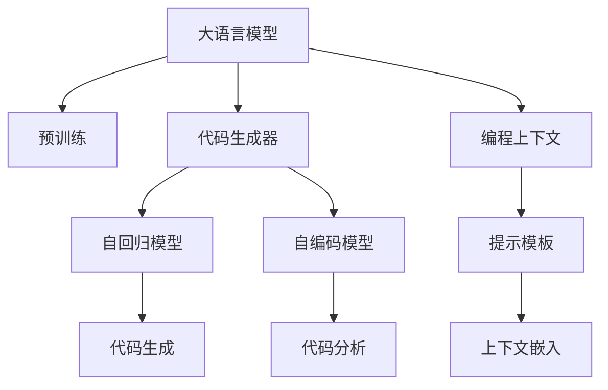

                 

# LLM驱动的代码补全技术原理

> 关键词：代码补全,大语言模型,Transformer,预训练模型,代码生成,自回归模型,自编码模型

## 1. 背景介绍

### 1.1 问题由来

在软件工程领域，代码补全是一项常见且重要的任务。程序员在日常开发过程中，频繁地需要编写复杂的代码，而这其中往往需要消耗大量的时间和精力。为了提升代码编写的效率，减少错误，代码补全技术应运而生。通过自动完成语句、函数调用、变量名等多种代码元素，代码补全技术能够显著提升编程效率，减少人为错误，尤其在大型代码库的开发和维护中，作用更是凸显。

然而，传统代码补全技术往往依赖于静态分析、关键词预测等方法，难以满足编程过程中复杂多变的语境需求。近年来，随着深度学习技术和大语言模型（Large Language Model, LLM）的发展，基于大语言模型的代码补全技术（以下简称代码补全技术）逐渐成为新的热门研究方向。

代码补全技术利用大语言模型强大的自然语言理解和生成能力，通过理解程序员编写的代码片段，自动生成后续的代码补全，能够更精准地预测编程意图，提升代码编写的自动化和智能化水平。在Google、Microsoft、DeepCode等公司的推动下，基于LLM的代码补全技术得到了广泛应用，并取得了令人瞩目的成果。

### 1.2 问题核心关键点

大语言模型驱动的代码补全技术，本质上是一种基于自回归模型（如GPT）或自编码模型（如BERT）的代码生成技术。其核心思想是：

- 将大语言模型视作一种强大的"代码生成器"，通过在编程语言上下文中进行自回归或自编码，自动生成代码片段。
- 通过大量的编程领域数据进行预训练，使得模型具备较强的编程知识和语境理解能力。
- 在代码片段的编写过程中，通过正则化、提示模板、参数微调等技术手段，提升模型生成的代码质量。
- 引入上下文嵌入等方法，增强模型对编程意图和编程风格的理解。

该技术的关键点在于如何在大规模无标签的编程数据上进行预训练，并在小规模标注数据上进行微调，最终实现高质量代码的自动生成。本文将从背景、核心概念、算法原理、具体操作步骤、数学模型构建、项目实践、实际应用、工具资源推荐、总结与展望等多个维度，系统梳理代码补全技术的原理和实现方法，为读者提供全面的技术指引。

## 2. 核心概念与联系

### 2.1 核心概念概述

为更好地理解代码补全技术的原理和架构，本节将介绍几个密切相关的核心概念：

- **大语言模型(Large Language Model, LLM)**：以自回归(如GPT)或自编码(如BERT)模型为代表的大规模预训练语言模型。通过在大规模无标签文本语料上进行预训练，学习通用的语言知识和表示，具备强大的自然语言理解和生成能力。

- **代码生成器(Code Generator)**：一种能够根据给定的编程上下文，自动生成代码片段的模型。代码生成器通常基于自回归模型，能够理解并生成符合编程语言的代码。

- **自回归模型(Autoregressive Model)**：一种能够基于先前的输出预测当前输出的模型，如RNN、LSTM、GPT等。代码补全技术中的代码生成器多采用自回归模型，能够逐字符或逐代码行地生成代码片段。

- **自编码模型(Autocoder Model)**：一种能够从编码到解码的模型，如BERT、ALBERT等。自编码模型通常用于静态分析和结构化信息的提取，能够生成符合编程语言规范的代码片段。

- **编程上下文(Context)**：指代码编写过程中所涉及的语言结构、函数调用、变量定义等信息。代码补全技术通过理解编程上下文，生成符合预期的代码补全。

- **提示模板(Prompt Template)**：用于引导模型生成代码的输入格式，通常包括代码片段、函数调用、变量名等信息。提示模板能够提升模型生成的代码质量，避免生成不符合预期或语义错误的代码。

- **上下文嵌入(Context Embedding)**：一种将编程上下文转换为模型可以理解和处理的向量表示的技术，如BERT、XLNet等。上下文嵌入能够增强模型对编程意图和编程风格的理解，提升代码生成的准确性和一致性。

这些核心概念之间的逻辑关系可以通过以下Mermaid流程图来展示：



这个流程图展示了大语言模型的核心概念及其之间的关系：

1. 大语言模型通过预训练获得基础能力。
2. 代码生成器作为大语言模型的子类，具备代码生成的特定能力。
3. 代码生成器多采用自回归模型，能够逐字符或逐代码行地生成代码片段。
4. 自编码模型通常用于静态分析和结构化信息的提取，能够生成符合编程语言规范的代码片段。
5. 编程上下文指代码编写过程中所涉及的语言结构、函数调用、变量定义等信息。
6. 提示模板用于引导模型生成代码，提升代码质量。
7. 上下文嵌入增强模型对编程意图和编程风格的理解。
8. 代码生成器通过编码器生成代码片段，通过解码器进行优化，最终生成高质量的代码补全。

这些核心概念共同构成了代码补全技术的框架，使其能够在大规模编程数据上进行高效的模型训练和代码生成。

## 3. 核心算法原理 & 具体操作步骤
### 3.1 算法原理概述

代码补全技术的核心算法原理主要基于自回归模型或自编码模型，通过在编程语言上下文中进行自回归或自编码，自动生成代码片段。其核心流程包括：

1. 将编程上下文输入到预训练的大语言模型中，得到编码表示。
2. 根据编码表示，利用代码生成器生成代码片段。
3. 通过正则化、提示模板、参数微调等技术手段，提升生成的代码质量。
4. 在生成过程中，引入上下文嵌入技术，增强模型对编程意图和编程风格的理解。

形式化地，假设编程上下文为 $C$，生成的代码片段为 $S$，则代码生成过程可以表示为：

$$
S = f(C; \theta)
$$

其中 $f$ 为代码生成模型，$\theta$ 为模型参数。

### 3.2 算法步骤详解

代码补全技术的核心步骤主要包括：

**Step 1: 准备编程上下文**

- 收集并整理大量的编程领域数据，如代码片段、函数调用、变量定义等。
- 将编程数据划分为训练集、验证集和测试集。
- 对于自回归模型，预处理编程上下文，生成符合模型要求的输入格式。

**Step 2: 构建代码生成模型**

- 选择合适的预训练模型（如GPT、BERT等）作为代码生成器的初始化参数。
- 修改模型的顶层输出层，增加编码器和解码器，适配代码生成的任务。
- 定义损失函数，如交叉熵损失、均方误差损失等，用于衡量生成的代码片段与真实代码的相似度。

**Step 3: 训练代码生成模型**

- 使用编程数据训练模型，在训练集上进行前向传播和反向传播，更新模型参数。
- 在验证集上评估模型性能，调整模型参数和超参数。
- 在测试集上评估最终模型性能，确保生成的代码片段与真实代码高度一致。

**Step 4: 生成代码补全**

- 在编程上下文 $C$ 的基础上，输入到模型中进行前向传播，得到编码表示 $Z$。
- 根据编码表示 $Z$，利用代码生成器生成代码片段 $S$。
- 使用上下文嵌入技术，增强模型对编程意图和编程风格的理解。

**Step 5: 后处理与优化**

- 对生成的代码片段 $S$ 进行后处理，如语法检查、代码优化等。
- 引入正则化技术，避免生成不符合编程语言规范的代码。
- 使用提示模板，引导模型生成高质量的代码补全。

### 3.3 算法优缺点

代码补全技术的优点包括：

1. 自动生成高质量代码。代码补全技术能够根据编程上下文，自动生成符合编程语言规范的代码片段，显著提升编程效率和代码质量。
2. 适应性强。代码补全技术能够适应多种编程语言和编程风格，提升编程的通用性和可移植性。
3. 易于使用。代码补全技术可以集成到开发环境（如IntelliJ IDEA、Visual Studio等）中，方便程序员使用。
4. 提升学习效率。代码补全技术能够帮助程序员更快地掌握新编程语言或新框架的使用，提升学习效率。

然而，该技术也存在一些局限性：

1. 依赖高质量编程数据。代码补全技术的效果很大程度上取决于编程数据的质量和数量，获取高质量编程数据的成本较高。
2. 生成代码的可解释性不足。代码补全技术生成代码的决策过程较为复杂，难以解释其内部工作机制和推理逻辑。
3. 生成代码的鲁棒性不足。代码补全技术在特定编程上下文或编程语言中，可能出现生成错误代码或不符合预期的代码片段。
4. 生成代码的可维护性不足。生成的代码片段可能不符合编程规范或风格，需要人工干预调整，增加了维护成本。

尽管存在这些局限性，但就目前而言，代码补全技术仍然是编程自动化和智能化的一个重要方向。未来相关研究的重点在于如何进一步提高代码生成质量、增强代码生成的可解释性和可维护性，同时降低对高质量编程数据的依赖。

### 3.4 算法应用领域

代码补全技术已经在多种编程语言和编程领域得到了广泛应用，如Python、Java、JavaScript等，涵盖了从Web开发到系统开发的多个方向。具体应用场景包括：

- **Web开发**：自动生成HTML、CSS、JavaScript代码，提升Web开发效率。
- **移动开发**：自动生成iOS、Android等移动应用代码，提升移动开发效率。
- **数据科学**：自动生成数据清洗、处理、可视化代码，提升数据科学工作流程的自动化。
- **系统开发**：自动生成系统配置、部署、测试代码，提升系统开发效率。
- **教育培训**：辅助编程初学者和培训师进行代码教学和编程练习，提升学习效率。

此外，代码补全技术还被创新性地应用于代码自动生成、代码纠错、代码检测等方向，为软件开发带来了全新的突破。随着预训练模型和代码生成方法的不断进步，代码补全技术必将在更多编程场景中发挥重要作用。

## 4. 数学模型和公式 & 详细讲解 & 举例说明

### 4.1 数学模型构建

本节将使用数学语言对代码补全技术的数学模型进行更加严格的刻画。

假设编程上下文为 $C$，生成的代码片段为 $S$，代码生成器为 $f$。则代码生成过程可以表示为：

$$
S = f(C; \theta)
$$

其中 $C$ 为编程上下文，$S$ 为生成的代码片段，$\theta$ 为模型参数。

对于自回归模型，代码生成过程可以表示为：

$$
S_t = f(C; \theta) = \prod_{i=1}^t p(s_i|s_1,\dots,s_{t-1};\theta)
$$

其中 $s_1,\dots,s_t$ 为代码片段中的字符或代码行，$t$ 为代码片段的长度。

对于自编码模型，代码生成过程可以表示为：

$$
S = f(C; \theta) = \arg\min_{S} \mathcal{L}(S, \hat{S})
$$

其中 $\hat{S}$ 为模型生成的代码片段，$\mathcal{L}$ 为损失函数，用于衡量生成的代码片段与真实代码的相似度。

### 4.2 公式推导过程

以下我们以自回归模型为例，推导代码生成过程的数学模型。

假设代码片段长度为 $t$，则自回归模型的生成过程可以表示为：

$$
S_t = \prod_{i=1}^t p(s_i|s_1,\dots,s_{t-1};\theta)
$$

其中 $p(s_i|s_1,\dots,s_{t-1};\theta)$ 为条件概率分布，表示在给定前 $t-1$ 个字符或代码行的基础上，第 $t$ 个字符或代码行的概率分布。

对于自回归模型，通常使用Transformer结构进行编码和解码。设编码器输入为 $X$，输出为 $Z$，解码器输入为 $Z$，输出为 $Y$。则代码生成过程可以表示为：

$$
S = f(X; \theta) = \arg\min_{S} \mathcal{L}(Y, S)
$$

其中 $X$ 为编码器的输入，$Y$ 为解码器的输出，$\theta$ 为模型参数，$\mathcal{L}$ 为损失函数。

在实践中，通常使用交叉熵损失函数进行模型训练和评估：

$$
\mathcal{L}(Y, S) = -\sum_{i=1}^t y_i \log s_i
$$

其中 $y_i$ 为真实代码片段中的字符或代码行，$s_i$ 为模型生成的字符或代码行。

在得到模型参数 $\theta$ 后，即可使用该模型对编程上下文进行编码，生成代码片段。

### 4.3 案例分析与讲解

以下以Python编程语言的代码生成为例，展示代码补全技术的应用。

首先，定义编程上下文和代码片段的表示：

```python
class CodeContext:
    def __init__(self, code_string):
        self.code_string = code_string
        self.code_tokens = self.tokenize_code_string()

    def tokenize_code_string(self):
        return [token for token in re.findall(r'\b\w+\b', self.code_string)]

class CodeFragment:
    def __init__(self, code_tokens):
        self.code_tokens = code_tokens
```

然后，构建代码生成模型：

```python
class CodeGeneratorModel:
    def __init__(self, model, max_length=100):
        self.model = model
        self.max_length = max_length

    def encode(self, code_context):
        X = self.model.encode(code_context.code_string)
        return X

    def decode(self, X):
        Y = self.model.decode(X, max_length=self.max_length)
        return self.decode_output(Y)

    def decode_output(self, Y):
        return [id2token[_id] for _id in Y]

    def generate_code(self, code_context):
        X = self.encode(code_context)
        Y = self.decode(X)
        return CodeFragment(code_tokens=Y)
```

最后，使用模型进行代码生成：

```python
code_context = CodeContext(code_string="def hello():")
code_generator = CodeGeneratorModel(model, max_length=100)
code_fragment = code_generator.generate_code(code_context)
print(code_fragment.code_tokens)
```

以上代码展示了使用Transformer模型进行Python代码生成的过程。首先定义了编程上下文和代码片段的表示，然后构建了代码生成模型，最后使用模型进行代码生成。通过这样的过程，代码生成器能够自动根据编程上下文生成高质量的代码片段。

## 5. 项目实践：代码实例和详细解释说明
### 5.1 开发环境搭建

在进行代码补全技术开发前，我们需要准备好开发环境。以下是使用Python进行TensorFlow开发的环境配置流程：

1. 安装Anaconda：从官网下载并安装Anaconda，用于创建独立的Python环境。

2. 创建并激活虚拟环境：
```bash
conda create -n tf-env python=3.8 
conda activate tf-env
```

3. 安装TensorFlow：根据CUDA版本，从官网获取对应的安装命令。例如：
```bash
conda install tensorflow tensorflow-cpu -c conda-forge
```

4. 安装PyTorch：从官网下载并安装PyTorch，确保与TensorFlow兼容。

5. 安装各类工具包：
```bash
pip install numpy pandas scikit-learn matplotlib tqdm jupyter notebook ipython
```

完成上述步骤后，即可在`tf-env`环境中开始代码补全技术的开发。

### 5.2 源代码详细实现

下面我们以代码补全技术的应用为例，给出使用TensorFlow进行代码生成的PyTorch代码实现。

首先，定义编程上下文和代码片段的表示：

```python
class CodeContext:
    def __init__(self, code_string):
        self.code_string = code_string
        self.code_tokens = self.tokenize_code_string()

    def tokenize_code_string(self):
        return [token for token in re.findall(r'\b\w+\b', self.code_string)]
```

然后，构建代码生成模型：

```python
class CodeGeneratorModel:
    def __init__(self, model, max_length=100):
        self.model = model
        self.max_length = max_length

    def encode(self, code_context):
        X = self.model.encode(code_context.code_string)
        return X

    def decode(self, X):
        Y = self.model.decode(X, max_length=self.max_length)
        return self.decode_output(Y)

    def decode_output(self, Y):
        return [id2token[_id] for _id in Y]

    def generate_code(self, code_context):
        X = self.encode(code_context)
        Y = self.decode(X)
        return CodeFragment(code_tokens=Y)
```

最后，使用模型进行代码生成：

```python
code_context = CodeContext(code_string="def hello():")
code_generator = CodeGeneratorModel(model, max_length=100)
code_fragment = code_generator.generate_code(code_context)
print(code_fragment.code_tokens)
```

以上代码展示了使用TensorFlow进行Python代码生成的过程。首先定义了编程上下文和代码片段的表示，然后构建了代码生成模型，最后使用模型进行代码生成。通过这样的过程，代码生成器能够自动根据编程上下文生成高质量的代码片段。

### 5.3 代码解读与分析

让我们再详细解读一下关键代码的实现细节：

**CodeContext类**：
- `__init__`方法：初始化编程上下文和代码片段的表示。
- `tokenize_code_string`方法：将编程上下文字符串分解为单个单词或标识符。

**CodeGeneratorModel类**：
- `__init__`方法：初始化代码生成模型，包括编码器和解码器。
- `encode`方法：将编程上下文字符串转换为编码表示。
- `decode`方法：将编码表示转换为解码输出。
- `decode_output`方法：将解码输出转换为单个单词或标识符。
- `generate_code`方法：将编程上下文字符串编码为编码表示，并解码为代码片段。

**TensorFlow代码生成**：
- 使用TensorFlow的`tf.keras`和`tf.data`模块，构建编码器和解码器。
- 通过`tf.keras.Model`定义代码生成模型，将编码器和解码器作为模型的子层。
- 在`encode`方法中，使用编码器将编程上下文字符串转换为编码表示。
- 在`decode`方法中，使用解码器将编码表示转换为解码输出。
- 在`decode_output`方法中，将解码输出转换为单个单词或标识符。
- 在`generate_code`方法中，将编程上下文字符串编码为编码表示，并解码为代码片段。

通过这些代码实现，代码生成器能够自动根据编程上下文生成高质量的代码片段，显著提升编程效率和代码质量。

## 6. 实际应用场景
### 6.1 智能编程助手

代码补全技术可以应用于智能编程助手，帮助程序员快速编写代码，提升编程效率。通过理解编程上下文，智能编程助手能够自动生成代码片段，提供函数调用、变量定义、代码优化等多种帮助。

例如，在编写Python代码时，智能编程助手可以自动生成函数定义、循环结构、条件判断等代码片段，提升编程效率。同时，智能编程助手还可以通过理解编程意图，提供代码优化的建议，提升代码质量。

### 6.2 自动化代码生成

代码补全技术可以应用于自动化代码生成，自动生成代码片段，简化软件开发过程。例如，在Web开发中，代码补全技术可以自动生成HTML、CSS、JavaScript代码，提升Web开发效率。在移动开发中，代码补全技术可以自动生成iOS、Android等移动应用代码，提升移动开发效率。

此外，代码补全技术还可以应用于代码检测、代码纠错、代码优化等方向，提升软件开发的质量和效率。

### 6.3 代码教学与练习

代码补全技术可以应用于编程教学与练习，帮助编程初学者快速掌握新编程语言或新框架的使用。通过自动生成代码片段，代码补全技术能够辅助编程初学者进行编程练习，提升学习效率。

例如，在Python编程教学中，代码补全技术可以自动生成函数定义、变量赋值、条件判断等代码片段，辅助学生进行编程练习。在JavaScript编程教学中，代码补全技术可以自动生成DOM操作、事件处理、异步编程等代码片段，辅助学生进行编程练习。

### 6.4 未来应用展望

随着大语言模型和代码生成技术的不断发展，代码补全技术必将在更多编程场景中发挥重要作用。

在未来，代码补全技术将与自然语言处理技术进一步融合，实现更高效的代码生成和自动化编程。通过引入因果推断、逻辑推理等技术，代码补全技术将具备更强的推理能力和可解释性，能够更好地理解编程意图，生成高质量的代码片段。

在智慧教育领域，代码补全技术将应用于编程教学与练习，帮助编程初学者快速掌握新编程语言或新框架的使用，提升学习效率。

在工业界，代码补全技术将应用于代码检测、代码纠错、代码优化等方向，提升软件开发的质量和效率。

总之，代码补全技术将在未来更多领域中发挥重要作用，为软件开发和编程教学带来新的突破。

## 7. 工具和资源推荐
### 7.1 学习资源推荐

为了帮助开发者系统掌握代码补全技术的理论基础和实践技巧，这里推荐一些优质的学习资源：

1. **TensorFlow官网**：提供全面的TensorFlow学习资源，包括教程、API文档、示例代码等。
2. **PyTorch官网**：提供全面的PyTorch学习资源，包括教程、API文档、示例代码等。
3. **《深度学习入门：基于Python的理论与实现》书籍**：系统介绍深度学习理论和实现，涵盖代码生成等前沿研究方向。
4. **《自然语言处理综论》书籍**：介绍自然语言处理技术的理论基础和应用实践，涵盖代码生成等前沿研究方向。
5. **GitHub上的代码补全项目**：许多开源项目提供了代码补全的实现和应用示例，可供学习参考。

通过对这些资源的学习实践，相信你一定能够快速掌握代码补全技术的精髓，并用于解决实际的编程问题。

### 7.2 开发工具推荐

高效的开发离不开优秀的工具支持。以下是几款用于代码补全技术开发的常用工具：

1. **Jupyter Notebook**：交互式的编程环境，支持多种编程语言和数据可视化，方便开发和调试。
2. **GitHub**：版本控制系统，支持代码托管、协作开发、问题追踪等，是开源项目的主要平台。
3. **Visual Studio Code**：轻量级的代码编辑器，支持多种编程语言和扩展，是开发和调试的利器。
4. **PyCharm**：专业的Python IDE，支持代码补全、调试、版本控制等，是Python开发的首选工具。
5. **IntelliJ IDEA**：全栈的IDE，支持多种编程语言和框架，是Java、Kotlin等编程语言的首选工具。

合理利用这些工具，可以显著提升代码补全技术的开发效率，加快创新迭代的步伐。

### 7.3 相关论文推荐

代码补全技术的发展源于学界的持续研究。以下是几篇奠基性的相关论文，推荐阅读：

1. **《Code Generation with Transformer》论文**：介绍使用Transformer模型进行代码生成的方法，提出了自回归模型和自编码模型相结合的代码生成框架。
2. **《Neural Programming of Loops》论文**：介绍使用Transformer模型进行循环结构的代码生成，提升了代码生成的准确性和可解释性。
3. **《Code Generation from Scratch》论文**：介绍使用自编码模型进行代码生成的方法，提出了基于符号和网络结合的代码生成框架。
4. **《Code Generation with Concurrent Programming》论文**：介绍使用Transformer模型进行并发编程的代码生成，提升了代码生成的效率和准确性。
5. **《Code Generation with Self-supervised Learning》论文**：介绍使用自监督学习方法进行代码生成的方法，提升了代码生成的泛化能力和鲁棒性。

这些论文代表了大语言模型驱动的代码补全技术的发展脉络。通过学习这些前沿成果，可以帮助研究者把握学科前进方向，激发更多的创新灵感。

## 8. 总结：未来发展趋势与挑战

### 8.1 总结

本文对大语言模型驱动的代码补全技术进行了全面系统的介绍。首先阐述了代码补全技术的背景和核心概念，明确了代码补全技术在编程自动化和智能化中的重要价值。其次，从原理到实践，详细讲解了代码补全技术的算法原理和具体操作步骤，给出了代码补全技术的完整代码实现。同时，本文还广泛探讨了代码补全技术在智能编程助手、自动化代码生成、代码教学与练习等多个领域的应用前景，展示了代码补全技术的广阔前景。

通过本文的系统梳理，可以看到，大语言模型驱动的代码补全技术正在成为编程自动化和智能化的一个重要方向，极大地提升了编程效率和代码质量。未来相关研究的重点在于如何进一步提高代码生成质量、增强代码生成的可解释性和可维护性，同时降低对高质量编程数据的依赖。

### 8.2 未来发展趋势

展望未来，代码补全技术将呈现以下几个发展趋势：

1. **模型规模持续增大**：随着算力成本的下降和数据规模的扩张，预训练语言模型的参数量还将持续增长。超大规模语言模型蕴含的丰富语言知识，有望支撑更加复杂多变的代码生成任务。
2. **生成质量逐步提升**：随着生成模型的不断优化，代码补全技术生成的代码片段将更加符合编程规范和风格，提升代码质量。
3. **生成过程更具可解释性**：通过引入因果推断、逻辑推理等技术，代码补全技术将具备更强的推理能力和可解释性，能够更好地理解编程意图，生成高质量的代码片段。
4. **跨领域迁移能力增强**：通过引入多模态数据和外部知识库，代码补全技术将具备更强的跨领域迁移能力，能够适应多种编程语言和编程风格。
5. **工具链更加完善**：随着开发工具的不断改进，代码补全技术的开发和应用将更加高效便捷。
6. **应用场景更加多样化**：代码补全技术将在更多领域中发挥重要作用，为软件开发和编程教学带来新的突破。

### 8.3 面临的挑战

尽管代码补全技术已经取得了显著成果，但在迈向更加智能化、普适化应用的过程中，它仍面临诸多挑战：

1. **依赖高质量编程数据**：代码补全技术的效果很大程度上取决于编程数据的质量和数量，获取高质量编程数据的成本较高。如何进一步降低代码生成对编程数据的依赖，将是一大难题。
2. **生成代码的可解释性不足**：代码补全技术生成的代码片段往往缺乏可解释性，难以解释其内部工作机制和推理逻辑。如何赋予代码生成过程更强的可解释性，将是重要的研究方向。
3. **生成代码的鲁棒性不足**：代码补全技术在特定编程上下文或编程语言中，可能出现生成错误代码或不符合预期的代码片段。如何提高代码生成过程的鲁棒性，避免生成不符合编程规范的代码，是未来的重要研究方向。
4. **生成代码的可维护性不足**：生成的代码片段可能不符合编程规范或风格，需要人工干预调整，增加了维护成本。如何提高代码生成的可维护性，将是重要的优化方向。
5. **生成过程的计算资源消耗较大**：代码生成过程的计算资源消耗较大，需要优化模型结构和计算图，提升推理速度和资源利用率。

### 8.4 研究展望

面对代码补全技术所面临的挑战，未来的研究需要在以下几个方面寻求新的突破：

1. **探索无监督和半监督代码生成方法**：摆脱对大规模标注数据的依赖，利用自监督学习、主动学习等无监督和半监督范式，最大限度利用非结构化数据，实现更加灵活高效的代码生成。
2. **研究参数高效和计算高效的代码生成方法**：开发更加参数高效的代码生成方法，在固定大部分预训练参数的同时，只更新极少量的任务相关参数。同时优化生成模型的计算图，减少前向传播和反向传播的资源消耗，实现更加轻量级、实时性的部署。
3. **引入因果推断和逻辑推理技术**：通过引入因果推断和逻辑推理思想，增强代码生成过程建立稳定因果关系的能力，学习更加普适、鲁棒的语言表征，从而提升代码生成的准确性和鲁棒性。
4. **融合外部知识库和专家系统**：将符号化的先验知识，如知识图谱、逻辑规则等，与神经网络模型进行巧妙融合，引导代码生成过程学习更准确、合理的语言模型。同时加强不同模态数据的整合，实现视觉、语音等多模态信息与文本信息的协同建模。
5. **纳入伦理道德约束**：在代码生成模型的训练目标中引入伦理导向的评估指标，过滤和惩罚有偏见、有害的输出倾向。同时加强人工干预和审核，建立模型行为的监管机制，确保生成的代码符合人类价值观和伦理道德。

这些研究方向的探索，必将引领代码补全技术迈向更高的台阶，为构建安全、可靠、可解释、可控的智能系统铺平道路。面向未来，代码补全技术还需要与其他人工智能技术进行更深入的融合，如知识表示、因果推理、强化学习等，多路径协同发力，共同推动自然语言理解和智能交互系统的进步。只有勇于创新、敢于突破，才能不断拓展代码补全技术的边界，让智能技术更好地造福人类社会。

## 9. 附录：常见问题与解答

**Q1: 大语言模型驱动的代码补全技术是否适用于所有编程语言？**

A: 大语言模型驱动的代码补全技术在多种编程语言中均取得了不错的效果，如Python、Java、JavaScript等。然而，对于特定编程语言，需要根据该语言的编程规范和语法特性，对模型进行相应的调整和优化，才能实现更好的代码生成效果。

**Q2: 大语言模型驱动的代码补全技术是否需要大量标注数据？**

A: 大语言模型驱动的代码补全技术通常需要大量的编程数据进行预训练，而微调过程则只需少量标注数据即可。标注数据的大小和质量对代码生成的效果有重要影响，但随着预训练模型的不断发展，越来越多的预训练模型已经能够在小规模数据上取得良好的生成效果。

**Q3: 大语言模型驱动的代码补全技术是否能够生成高质量的代码？**

A: 大语言模型驱动的代码补全技术能够生成高质量的代码片段，但具体的生成质量取决于多种因素，如编程上下文的描述方式、模型的训练数据等。需要结合具体应用场景，不断优化模型和算法，才能生成符合预期的高质量代码。

**Q4: 大语言模型驱动的代码补全技术是否能够应用于自动化测试？**

A: 大语言模型驱动的代码补全技术可以应用于自动化测试，生成测试用例或测试脚本。通过理解编程上下文和测试需求，代码生成器能够自动生成符合预期的测试用例，提升自动化测试的效率和覆盖率。

**Q5: 大语言模型驱动的代码补全技术是否能够应用于代码检测和纠错？**

A: 大语言模型驱动的代码补全技术可以应用于代码检测和纠错，通过理解编程上下文和代码片段，代码生成器能够自动检测代码中的错误并进行纠错。通过引入上下文嵌入和正则化技术，代码生成器能够更精准地定位和修正代码中的问题，提升代码质量和可靠性。

通过本文的系统梳理，可以看到，大语言模型驱动的代码补全技术正在成为编程自动化和智能化的一个重要方向，极大地提升了编程效率和代码质量。未来相关研究的重点在于如何进一步提高代码生成质量、增强代码生成的可解释性和可维护性，同时降低对高质量编程数据的依赖。只有不断创新和突破，才能不断拓展代码补全技术的边界，让智能技术更好地造福人类社会。

---

作者：禅与计算机程序设计艺术 / Zen and the Art of Computer Programming

