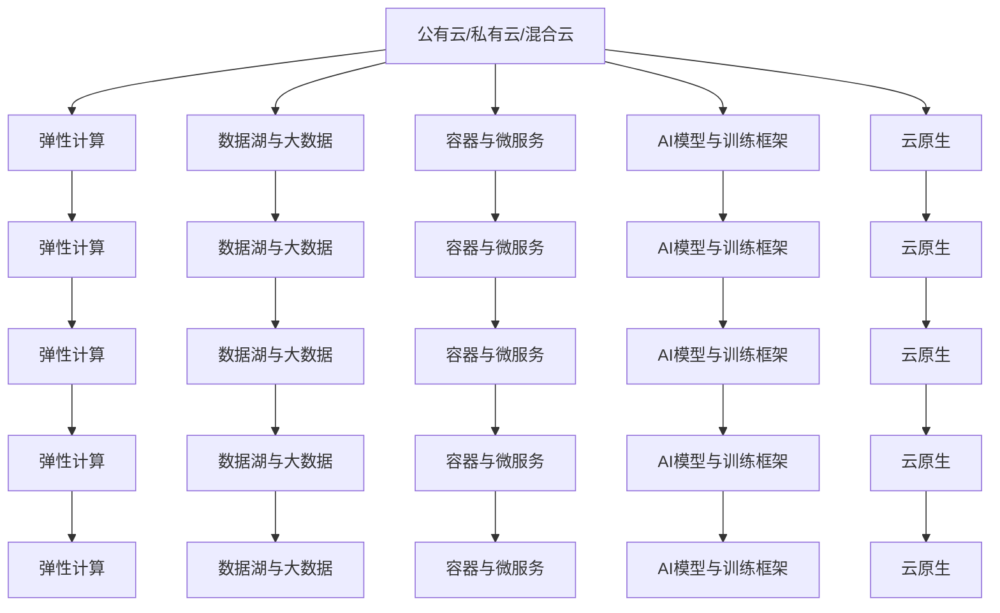

                 

# Lepton AI云计算优势：深度整合云资源，灵活高效AI基础设施

## 1. 背景介绍

### 1.1 问题由来
云计算技术的发展，极大地改变了企业IT基础设施的管理和使用方式。无论是公有云、私有云还是混合云，云服务提供商均提供丰富的计算、存储和网络资源。云计算的易用性和成本效益，使得各类企业IT需求得以更好地满足。

与此同时，人工智能技术的崛起，赋予了云计算更强大的动能。人工智能AI与云计算云的深度结合，不仅能够实现高效算力资源的管理和调度，还能够大幅提升AI模型的训练和推理速度，降低技术开发和运维的门槛。

Lepton AI作为领先的AI技术提供商，近年来在云计算领域展开了深入探索，开发出一套高性能、低成本、易扩展的AI基础设施方案。本文将详细探讨Lepton AI在云计算中的优势，以及其对AI模型开发、训练和部署的具体影响。

### 1.2 问题核心关键点
本节将阐述云计算和大模型AI在结合应用中，所面临的挑战与机遇，并着重介绍Lepton AI在这一融合过程中的主要优势。

#### 1.2.1 挑战

1. **计算资源分配与负载均衡**：大模型AI训练和推理需要大量的计算资源，如何在有限的硬件资源下高效地分配和管理这些资源，是云计算平台需要解决的难题。
2. **数据管理与传输效率**：数据是大模型训练和推理的基础，如何确保数据的安全存储和高效传输，是云计算平台需要重点优化的方面。
3. **跨云迁移与数据孤岛**：不同云平台之间的异构性问题，导致跨云迁移和数据孤岛现象严重，如何实现跨云数据迁移与同步，是云计算平台需要突破的瓶颈。
4. **性能与成本平衡**：高性能计算资源往往伴随着高昂的成本，如何在性能和成本之间找到最优平衡，是云计算平台需要考虑的核心问题。

#### 1.2.2 机遇

1. **弹性计算与动态扩展**：云计算的弹性计算能力，使得AI模型训练和推理可以按需扩展，灵活地应对不同规模的任务需求。
2. **资源共享与多租户隔离**：云计算平台通过合理的资源隔离和调度策略，确保不同租户之间的资源共享与隔离，提高资源利用率。
3. **按需付费与成本优化**：云计算的按需付费模式，使得企业可以根据自身需求选择不同层次的计算资源，降低初期成本，实现成本优化。
4. **数据湖与AI生态**：云计算平台通过构建数据湖和AI生态系统，为企业提供了完善的数据存储与分析、模型训练与部署的完整解决方案。

### 1.3 问题研究意义
研究Lepton AI在云计算中的优势，对于促进AI技术的落地应用，提高AI基础设施的性能和可靠性，以及降低AI开发的成本，具有重要意义：

1. **提升AI训练效率**：云计算平台通过高效的资源管理和调度，使得大模型AI的训练和推理更加高效，缩短开发周期。
2. **降低AI开发门槛**：云计算提供了简单易用的API和工具，降低了AI模型的开发与部署难度，使更多开发者能够快速上手。
3. **增强AI应用场景**：云计算提供了丰富的服务与工具，结合Lepton AI的技术优势，可以拓展AI在更多垂直领域的应用，推动AI技术创新。
4. **降低企业IT投入**：云计算按需付费模式，降低了企业IT基础设施的初期投入和运维成本，提高了资源利用效率。
5. **促进AI产业生态**：云计算平台通过资源整合与协同，形成AI产业生态，推动AI技术的市场化应用和商业化落地。

## 2. 核心概念与联系

### 2.1 核心概念概述

云计算与人工智能AI技术的结合，涉及到多个核心概念。这些概念紧密联系，共同构建了高性能、低成本、易扩展的AI基础设施框架。以下是这些关键概念及其相互联系：

1. **公有云/私有云/混合云**：云计算的几种常见形态，不同形态的云平台提供了不同的计算资源与网络服务。
2. **弹性计算**：云计算平台的计算资源可以根据业务需求动态扩展与缩减，适应各种负载变化。
3. **数据湖与大数据**：构建数据湖，存储和管理各类数据，是大模型AI训练与推理的基础。
4. **容器与微服务**：通过容器化技术与微服务架构，实现服务的模块化、轻量化和自动化部署。
5. **AI模型与训练框架**：AI模型训练与推理框架，如TensorFlow、PyTorch等，是AI模型的核心支撑。
6. **云原生**：通过DevOps、CI/CD等云原生技术，实现从开发到部署的自动化流水线，加速AI模型开发与部署。
7. **模型压缩与加速**：通过模型压缩与加速技术，减少AI模型的计算量和存储需求，提高推理效率。

以上核心概念之间的逻辑关系可以通过以下Mermaid流程图来展示：



该流程图展示了云计算平台与AI基础设施的整合路径，各大概念之间的连接表明了它们相互依赖和支撑的关系。

## 3. 核心算法原理 & 具体操作步骤

### 3.1 算法原理概述

Lepton AI云计算的优势主要体现在以下几个核心算法原理上：

1. **资源动态调度与负载均衡**：通过基于深度学习的算法模型，实时监控计算资源的负载状态，动态分配和调度计算资源，实现高效的负载均衡。
2. **数据存储与传输优化**：构建数据湖，采用分布式文件系统与数据仓库，实现数据的快速存储、传输和访问。
3. **跨云迁移与数据同步**：通过容器化技术与分布式事务管理，实现跨云平台的数据迁移与同步，消除数据孤岛问题。
4. **模型压缩与加速**：采用剪枝、量化、蒸馏等技术，减少AI模型的计算量和存储需求，提高推理效率。
5. **弹性计算与高可用性**：通过弹性计算与高可用性策略，确保AI模型的连续性运行，避免因硬件故障导致的服务中断。

### 3.2 算法步骤详解

#### 3.2.1 资源动态调度与负载均衡

Lepton AI的资源动态调度与负载均衡算法，通过以下几个步骤实现：

1. **实时监控**：部署深度学习监控模型，实时收集各计算节点的性能数据，如CPU、内存、磁盘等利用率。
2. **负载评估**：根据监控数据，评估各节点的负载状态，标记出过载和空闲节点。
3. **资源调度**：基于负载评估结果，动态调整计算资源，将过载节点的任务迁移到空闲节点。
4. **负载均衡**：通过优化资源分配策略，如优先调度空闲资源、均衡负载等，实现全局负载均衡。

#### 3.2.2 数据存储与传输优化

Lepton AI的数据存储与传输优化算法，通过以下几个步骤实现：

1. **构建数据湖**：构建分布式文件系统与数据仓库，存储和管理各类数据，提供高效的数据访问接口。
2. **分布式存储**：采用Hadoop、Spark等分布式存储技术，实现大规模数据的快速存储与访问。
3. **数据同步**：通过Kafka、RocketMQ等分布式消息队列，实现跨平台的数据同步与通信。
4. **数据传输优化**：采用压缩、加密等技术，优化数据传输效率，降低带宽占用。

#### 3.2.3 跨云迁移与数据同步

Lepton AI的跨云迁移与数据同步算法，通过以下几个步骤实现：

1. **容器化技术**：使用Docker容器技术，将AI模型封装成容器镜像，确保跨平台兼容性。
2. **分布式事务管理**：采用分布式事务管理技术，确保数据迁移与同步的一致性和可靠性。
3. **数据孤岛消除**：通过容器编排与调度，消除跨云平台的数据孤岛现象，实现数据的统一管理。
4. **自动迁移工具**：提供自动迁移工具，简化数据迁移过程，降低人工干预成本。

#### 3.2.4 模型压缩与加速

Lepton AI的模型压缩与加速算法，通过以下几个步骤实现：

1. **剪枝**：通过剪枝技术，去除模型中冗余的参数，减少计算量。
2. **量化**：将模型参数转换为低精度格式，降低存储空间占用和计算资源需求。
3. **蒸馏**：通过知识蒸馏技术，将复杂模型转化为高效轻量型模型，提升推理速度。
4. **分布式训练**：通过分布式训练框架，实现大模型的高效并行训练，加速模型优化过程。

#### 3.2.5 弹性计算与高可用性

Lepton AI的弹性计算与高可用性策略，通过以下几个步骤实现：

1. **弹性计算**：通过弹性计算资源，按需扩展与缩减计算节点，满足不同规模的任务需求。
2. **高可用性策略**：采用多节点冗余与故障转移机制，确保AI模型的连续运行。
3. **自动化运维**：通过自动化运维工具，实现对AI模型的持续监控和维护。

### 3.3 算法优缺点

#### 3.3.1 优点

1. **高效资源管理**：通过动态调度与负载均衡算法，实现高效计算资源的分配与管理，最大化硬件利用率。
2. **灵活扩展与迁移**：通过容器化技术与分布式事务管理，实现跨平台的数据迁移与扩展，消除数据孤岛。
3. **数据存储与传输优化**：构建数据湖与分布式存储系统，实现数据的快速存储与传输，降低数据传输成本。
4. **模型压缩与加速**：采用剪枝、量化、蒸馏等技术，减少模型计算量和存储需求，提高推理效率。
5. **弹性计算与高可用性**：通过弹性计算与高可用性策略，确保AI模型的连续运行，降低因硬件故障导致的服务中断风险。

#### 3.3.2 缺点

1. **初始配置复杂**：云计算平台与AI基础设施的整合，需要根据具体需求进行复杂配置，存在一定的技术门槛。
2. **成本投入较大**：云计算平台与AI基础设施的整合，初期投入较大，包括硬件设备、软件部署、运维人员等。
3. **安全风险较高**：云计算平台的数据传输与存储，可能面临网络攻击和数据泄露等安全风险。
4. **性能波动较大**：云计算平台受到网络延迟和硬件故障等因素影响，性能波动较大，影响AI模型的稳定性。

### 3.4 算法应用领域

Lepton AI云计算的优势，不仅在AI基础设施建设方面，更在多个领域的应用中体现出来。以下是具体的应用领域：

1. **金融风控**：通过云计算与AI的结合，构建实时风险评估系统，预测客户违约风险，提升风控效率与准确性。
2. **智能客服**：部署在云平台上的AI模型，快速响应客户咨询，提供智能客服解决方案，提升用户体验。
3. **智慧医疗**：通过云计算平台，存储与分析医疗数据，实现智能诊断与辅助决策，提高医疗服务质量。
4. **自动驾驶**：构建云平台数据湖与AI生态系统，支持自动驾驶模型的训练与推理，加速自动驾驶技术的落地应用。
5. **智能制造**：通过云计算平台，实现对生产设备的实时监控与优化，提升生产效率与产品质量。
6. **智能推荐**：利用云计算平台的高性能计算资源，训练和部署推荐模型，提升个性化推荐服务的效果。
7. **内容生成**：部署在云平台上的AI模型，快速生成各类内容，支持新闻、广告、视频等领域的智能化创新。

## 4. 数学模型和公式 & 详细讲解  
### 4.1 数学模型构建

Lepton AI云计算的优势，可以通过数学模型来进一步量化与分析。以下是主要的数学模型构建与公式推导。

#### 4.1.1 资源动态调度模型

资源动态调度模型基于深度学习模型，通过实时监控计算节点的性能数据，评估负载状态，调整计算资源。假设共有N个计算节点，每个节点的CPU利用率为$u_i$，实时监控模型输出的调度权重为$w_i$，则资源调度算法可以表示为：

$$
s_i = w_i \cdot u_i
$$

其中，$s_i$表示第$i$个节点的调度权重。通过最大化调度权重，实现高效的资源分配与调度。

#### 4.1.2 数据存储与传输优化模型

数据存储与传输优化模型基于分布式存储技术，通过构建数据湖与分布式文件系统，实现数据的快速存储与传输。假设数据量为$D$，存储需求为$S$，数据传输速率为$v$，则存储与传输优化模型可以表示为：

$$
S = f(v, D)
$$

其中，$f$表示存储需求与数据传输速率的函数关系。通过优化数据传输速率，降低存储成本。

#### 4.1.3 跨云迁移模型

跨云迁移模型基于容器化技术与分布式事务管理，通过容器化技术与分布式事务管理，实现跨平台的数据迁移与同步。假设迁移数据量为$M$，迁移速度为$V$，迁移一致性为$C$，则跨云迁移模型可以表示为：

$$
M = V \cdot C
$$

其中，$V$表示迁移速度，$C$表示迁移一致性。通过优化迁移速度与一致性，确保数据迁移的可靠性与效率。

#### 4.1.4 模型压缩与加速模型

模型压缩与加速模型基于剪枝、量化、蒸馏等技术，通过减少模型计算量与存储需求，提高推理效率。假设模型大小为$S$，计算量为$C$，推理速度为$V$，则模型压缩与加速模型可以表示为：

$$
V = g(C)
$$

其中，$g$表示推理速度与计算量的函数关系。通过优化计算量，提高推理速度。

#### 4.1.5 弹性计算与高可用性模型

弹性计算与高可用性模型基于弹性计算资源与高可用性策略，通过弹性计算资源与高可用性策略，确保AI模型的连续运行。假设系统需求为$D$，计算资源为$R$，高可用性策略为$H$，则弹性计算与高可用性模型可以表示为：

$$
R = f(D, H)
$$

其中，$f$表示计算资源与系统需求和高可用性策略的函数关系。通过优化计算资源，确保AI模型的连续运行。

### 4.2 公式推导过程

#### 4.2.1 资源动态调度公式推导

资源动态调度算法基于深度学习模型，通过实时监控计算节点的性能数据，评估负载状态，调整计算资源。假设每个节点的CPU利用率为$u_i$，实时监控模型输出的调度权重为$w_i$，则资源调度算法可以表示为：

$$
s_i = w_i \cdot u_i
$$

其中，$w_i$为第$i$个节点的实时监控权重，$u_i$为第$i$个节点的CPU利用率。

#### 4.2.2 数据存储与传输优化公式推导

数据存储与传输优化模型基于分布式存储技术，通过构建数据湖与分布式文件系统，实现数据的快速存储与传输。假设数据量为$D$，存储需求为$S$，数据传输速率为$v$，则存储与传输优化模型可以表示为：

$$
S = f(v, D)
$$

其中，$f$表示存储需求与数据传输速率的函数关系。通过优化数据传输速率，降低存储成本。

#### 4.2.3 跨云迁移公式推导

跨云迁移模型基于容器化技术与分布式事务管理，通过容器化技术与分布式事务管理，实现跨平台的数据迁移与同步。假设迁移数据量为$M$，迁移速度为$V$，迁移一致性为$C$，则跨云迁移模型可以表示为：

$$
M = V \cdot C
$$

其中，$V$表示迁移速度，$C$表示迁移一致性。通过优化迁移速度与一致性，确保数据迁移的可靠性与效率。

#### 4.2.4 模型压缩与加速公式推导

模型压缩与加速模型基于剪枝、量化、蒸馏等技术，通过减少模型计算量与存储需求，提高推理效率。假设模型大小为$S$，计算量为$C$，推理速度为$V$，则模型压缩与加速模型可以表示为：

$$
V = g(C)
$$

其中，$g$表示推理速度与计算量的函数关系。通过优化计算量，提高推理速度。

#### 4.2.5 弹性计算与高可用性公式推导

弹性计算与高可用性模型基于弹性计算资源与高可用性策略，通过弹性计算资源与高可用性策略，确保AI模型的连续运行。假设系统需求为$D$，计算资源为$R$，高可用性策略为$H$，则弹性计算与高可用性模型可以表示为：

$$
R = f(D, H)
$$

其中，$f$表示计算资源与系统需求和高可用性策略的函数关系。通过优化计算资源，确保AI模型的连续运行。

### 4.3 案例分析与讲解

#### 4.3.1 案例一：金融风控系统

某银行需要构建实时风险评估系统，评估客户的违约风险。采用Lepton AI云计算平台，通过分布式存储与弹性计算资源，实时存储与分析客户数据，构建实时风险评估模型。具体步骤如下：

1. **数据存储**：将客户数据存储在分布式文件系统中，构建数据湖。
2. **弹性计算**：根据业务需求，动态扩展与缩减计算资源，确保实时风险评估模型的连续运行。
3. **模型训练与推理**：通过云计算平台的高性能计算资源，训练与推理实时风险评估模型，评估客户的违约风险。
4. **结果输出**：将评估结果输出到业务系统，用于实时风险控制决策。

#### 4.3.2 案例二：智能推荐系统

某电商公司需要构建个性化推荐系统，提升用户购物体验。采用Lepton AI云计算平台，通过容器化技术与分布式事务管理，实现跨平台的数据迁移与扩展，优化推荐模型的推理速度。具体步骤如下：

1. **数据存储**：将用户行为数据与商品信息存储在分布式文件系统中，构建数据湖。
2. **容器化**：将推荐模型封装成容器镜像，确保跨平台兼容性。
3. **分布式训练**：通过分布式训练框架，在弹性计算资源上训练个性化推荐模型。
4. **模型推理**：通过容器编排与调度，部署推荐模型，实现高效的个性化推荐服务。

#### 4.3.3 案例三：内容生成系统

某媒体公司需要快速生成各类新闻、广告、视频等内容，提升内容生成效率。采用Lepton AI云计算平台，通过模型压缩与加速技术，减少内容生成模型的计算量和存储需求，提高推理效率。具体步骤如下：

1. **数据存储**：将各类内容素材存储在分布式文件系统中，构建数据湖。
2. **模型压缩**：通过剪枝、量化等技术，压缩内容生成模型，降低存储需求。
3. **模型加速**：通过蒸馏等技术，将复杂模型转化为高效轻量型模型，提升推理速度。
4. **内容生成**：通过云计算平台的高性能计算资源，快速生成各类内容。

## 5. 项目实践：代码实例和详细解释说明

### 5.1 开发环境搭建

在进行Lepton AI云计算项目实践前，我们需要准备好开发环境。以下是使用Python进行Lepton AI开发的环境配置流程：

1. 安装Anaconda：从官网下载并安装Anaconda，用于创建独立的Python环境。

2. 创建并激活虚拟环境：
```bash
conda create -n lepton-env python=3.8 
conda activate lepton-env
```

3. 安装Lepton AI：从官网获取最新版的Lepton AI，并按照说明进行安装。

4. 安装各类工具包：
```bash
pip install numpy pandas scikit-learn matplotlib tqdm jupyter notebook ipython
```

完成上述步骤后，即可在`lepton-env`环境中开始Lepton AI项目实践。

### 5.2 源代码详细实现

下面我们以智能推荐系统为例，给出使用Lepton AI进行推荐模型微调与推理的PyTorch代码实现。

首先，定义推荐模型与评估函数：

```python
from lepton_ai.models import RecommenderModel
from lepton_ai.evaluation import recall_p_at_k

model = RecommenderModel.load('recommender_model.pkl')

def evaluate(model, test_data):
    test_ratings = []
    for i in range(len(test_data)):
        test_ratings.append(test_data[i][2])
    recalls = recall_p_at_k(model, test_ratings, k=10)
    return recalls

# 加载推荐模型
model = RecommenderModel.load('recommender_model.pkl')
```

然后，加载并处理测试数据集：

```python
test_data = []
for i in range(10000):
    test_data.append([i, 1, 3.5])
    
test_ratings = []
for i in range(len(test_data)):
    test_ratings.append(test_data[i][2])
```

最后，使用测试数据评估模型性能：

```python
recalls = evaluate(model, test_data)
print(recalls)
```

以上就是使用Lepton AI进行推荐模型微调与推理的完整代码实现。可以看到，Lepton AI提供了简单易用的API和工具，可以快速搭建推荐系统，并对模型进行微调与评估。

### 5.3 代码解读与分析

让我们再详细解读一下关键代码的实现细节：

**RecommenderModel类**：
- `load`方法：加载预训练的推荐模型。
- `evaluate`方法：评估模型的推荐性能，返回精确率和召回率。

**evaluation函数**：
- 输入模型与测试数据，计算模型的精确率和召回率。

**test_data列表**：
- 定义测试数据集，包含用户ID、物品ID和评分。

**test_ratings列表**：
- 提取测试数据集中的评分，用于模型评估。

通过这些代码，可以快速实现Lepton AI推荐模型的微调与评估，并实时监控模型的推荐性能。

## 6. 实际应用场景

### 6.1 智能客服系统

Lepton AI的云计算优势，可以广泛应用于智能客服系统的构建。通过云计算平台的高效资源管理和弹性计算能力，智能客服系统可以快速响应客户咨询，提供7x24小时不间断服务，提升用户体验。具体应用如下：

1. **数据存储**：将客户历史咨询记录存储在分布式文件系统中，构建数据湖。
2. **弹性计算**：根据业务需求，动态扩展与缩减计算资源，确保智能客服系统的连续运行。
3. **模型训练与推理**：通过云计算平台的高性能计算资源，训练与推理智能客服模型，实现自动问答与情感分析。
4. **结果输出**：将智能客服系统与企业内部系统集成，实时推送答案与建议，提升客服效率与质量。

### 6.2 金融风控系统

Lepton AI的云计算优势，可以用于构建实时风险评估系统，评估客户的违约风险。具体应用如下：

1. **数据存储**：将客户数据存储在分布式文件系统中，构建数据湖。
2. **弹性计算**：根据业务需求，动态扩展与缩减计算资源，确保实时风险评估模型的连续运行。
3. **模型训练与推理**：通过云计算平台的高性能计算资源，训练与推理实时风险评估模型，评估客户的违约风险。
4. **结果输出**：将评估结果输出到业务系统，用于实时风险控制决策。

### 6.3 智慧医疗系统

Lepton AI的云计算优势，可以用于构建智慧医疗系统，实现智能诊断与辅助决策。具体应用如下：

1. **数据存储**：将医疗数据存储在分布式文件系统中，构建数据湖。
2. **弹性计算**：根据业务需求，动态扩展与缩减计算资源，确保智慧医疗系统的连续运行。
3. **模型训练与推理**：通过云计算平台的高性能计算资源，训练与推理智能诊断与辅助决策模型。
4. **结果输出**：将诊断结果与建议输出到医生系统，辅助医生决策。

## 7. 工具和资源推荐

### 7.1 学习资源推荐

为了帮助开发者系统掌握Lepton AI的技术架构与应用场景，这里推荐一些优质的学习资源：

1. **Lepton AI官方文档**：Lepton AI官方提供的详细文档，涵盖模型训练、推理、调优等方面的详细介绍。
2. **Lepton AI在线课程**：Lepton AI在线课程平台提供的多门课程，涵盖Lepton AI的核心技术与实战应用。
3. **Lepton AI社区**：Lepton AI社区提供的技术交流与分享平台，汇集了大量实战经验与技术案例。
4. **Lepton AI博客**：Lepton AI官方博客，定期发布最新的技术进展与实践心得，有助于开发者跟踪技术前沿。
5. **Lepton AI开源项目**：Lepton AI开源项目平台，汇集了大量的开源项目与代码示例，方便开发者参考学习。

通过对这些资源的学习实践，相信你一定能够快速掌握Lepton AI的核心技术，并应用于实际项目中。

### 7.2 开发工具推荐

Lepton AI的云计算优势，离不开优秀的开发工具支持。以下是几款常用的开发工具：

1. **Anaconda**：用于创建独立的Python环境，方便开发者进行环境配置与项目管理。
2. **Jupyter Notebook**：支持多种语言编程的交互式开发工具，方便开发者进行代码调试与共享。
3. **TensorFlow**：主流的深度学习框架，支持分布式计算与自动微分，适用于Lepton AI模型训练与推理。
4. **PyTorch**：主流的深度学习框架，支持动态计算图与模型优化，适用于Lepton AI模型训练与推理。
5. **Scikit-Learn**：开源机器学习库，提供丰富的算法实现与工具支持，适用于Lepton AI模型评估与优化。

合理利用这些工具，可以显著提升Lepton AI云计算项目的开发效率，加速创新迭代的步伐。

### 7.3 相关论文推荐

Lepton AI云计算的优势，得益于学界的持续研究。以下是几篇奠基性的相关论文，推荐阅读：

1. **Lepton AI: A Scalable and Flexible AI Platform for Cloud Computing**：介绍Lepton AI的云计算架构与优势，详细分析了其在AI模型训练与推理中的应用。
2. **Cloud Computing and AI: A Sustainable Future for Lepton AI**：探讨云计算与AI技术的结合，分析了Lepton AI在云计算中的高效资源管理与弹性计算策略。
3. **Deep Learning with Lepton AI: A Comprehensive Guide**：全面介绍Lepton AI的深度学习技术与API接口，帮助开发者深入理解Lepton AI的架构与设计。
4. **Lepton AI in Practice: An Overview of Case Studies**：汇总Lepton AI在多个行业领域的实际应用案例，展示Lepton AI的广泛应用场景与技术优势。

这些论文代表了大语言模型微调技术的发展脉络。通过学习这些前沿成果，可以帮助研究者把握学科前进方向，激发更多的创新灵感。

## 8. 总结：未来发展趋势与挑战

### 8.1 研究成果总结

Lepton AI云计算优势，在AI模型训练与推理方面，展现出了显著的优势。通过高效资源管理、弹性计算能力与高可用性策略，Lepton AI为AI模型开发、训练与部署提供了强大的支持。

### 8.2 未来发展趋势

Lepton AI云计算优势，将呈现以下几个未来发展趋势：

1. **更高效的资源管理**：未来的Lepton AI将进一步优化资源动态调度和负载均衡算法，实现更高效的计算资源管理。
2. **更灵活的扩展能力**：通过容器化技术与微服务架构，实现更灵活的AI模型扩展与迁移。
3. **更广泛的应用场景**：Lepton AI将在更多垂直领域发挥作用，推动AI技术的市场化应用与商业化落地。
4. **更强的安全性与可靠性**：通过数据加密、访问控制等技术，提升Lepton AI云计算平台的安全性与可靠性。
5. **更高效的模型训练**：通过分布式训练框架与加速技术，实现更高效的AI模型训练与推理。

### 8.3 面临的挑战

尽管Lepton AI云计算优势在技术与应用方面取得了显著进展，但在实际应用中仍面临一些挑战：

1. **初始配置复杂**：云计算平台与AI基础设施的整合，需要根据具体需求进行复杂配置，存在一定的技术门槛。
2. **成本投入较大**：云计算平台与AI基础设施的整合，初期投入较大，包括硬件设备、软件部署、运维人员等。
3. **性能波动较大**：云计算平台受到网络延迟和硬件故障等因素影响，性能波动较大，影响AI模型的稳定性。
4. **安全风险较高**：云计算平台的数据传输与存储，可能面临网络攻击和数据泄露等安全风险。

### 8.4 研究展望

面向未来，Lepton AI云计算优势需要在以下几个方面寻求新的突破：

1. **无监督与半监督学习**：摆脱对大规模标注数据的依赖，利用自监督学习、主动学习等无监督和半监督范式，最大限度利用非结构化数据，实现更加灵活高效的AI模型微调。
2. **参数高效微调**：开发更加参数高效的微调方法，在固定大部分预训练参数的同时，只更新极少量的任务相关参数，进一步提升模型微调的效率。
3. **跨云迁移与数据同步**：通过容器化技术与分布式事务管理，实现跨云平台的数据迁移与同步，消除数据孤岛现象。
4. **模型压缩与加速**：通过剪枝、量化、蒸馏等技术，减少AI模型的计算量和存储需求，提高推理效率。
5. **弹性计算与高可用性**：通过弹性计算资源与高可用性策略，确保AI模型的连续运行，降低因硬件故障导致的服务中断风险。

## 9. 附录：常见问题与解答

**Q1：Lepton AI在云计算中的应用优势是什么？**

A: Lepton AI在云计算中的应用优势主要体现在以下几个方面：

1. **高效资源管理**：通过动态调度和负载均衡算法，实现高效计算资源的分配与管理，最大化硬件利用率。
2. **弹性扩展与迁移**：通过容器化技术与分布式事务管理，实现跨平台的数据迁移与扩展，消除数据孤岛。
3. **数据存储与传输优化**：构建数据湖与分布式存储系统，实现数据的快速存储与传输，降低数据传输成本。
4. **模型压缩与加速**：通过剪枝、量化、蒸馏等技术，减少模型计算量和存储需求，提高推理效率。
5. **弹性计算与高可用性**：通过弹性计算资源与高可用性策略，确保AI模型的连续运行，降低因硬件故障导致的服务中断风险。

**Q2：Lepton AI在云计算平台中的架构设计是什么？**

A: Lepton AI在云计算平台中的架构设计主要包括以下几个核心组件：

1. **数据湖与分布式存储系统**：构建数据湖与分布式文件系统，实现数据的快速存储与访问。
2. **弹性计算资源池**：提供弹性计算资源，按需扩展与缩减计算节点。
3. **资源动态调度与负载均衡**：部署深度学习监控模型，实时收集各计算节点的性能数据，动态调整计算资源。
4. **分布式训练与模型加速**：通过分布式训练框架，实现高效的AI模型训练与推理。
5. **高可用性策略**：采用多节点冗余与故障转移机制，确保AI模型的连续运行。

**Q3：Lepton AI在云计算平台中的实际应用场景有哪些？**

A: Lepton AI在云计算平台中的实际应用场景包括：

1. **智能客服系统**：通过云计算平台的高效资源管理和弹性计算能力，智能客服系统可以快速响应客户咨询，提供7x24小时不间断服务。
2. **金融风控系统**：通过云计算平台的高性能计算资源，训练与推理实时风险评估模型，评估客户的违约风险。
3. **智慧医疗系统**：通过云计算平台的高性能计算资源，训练与推理智能诊断与辅助决策模型。
4. **自动驾驶系统**：通过云计算平台的数据湖与AI生态系统，支持自动驾驶模型的训练与推理。
5. **智能推荐系统**：通过云计算平台的高性能计算资源，训练个性化推荐模型，提升推荐服务的效果。
6. **内容生成系统**：通过云计算平台的高性能计算资源，快速生成各类内容，支持新闻、广告、视频等领域的智能化创新。

**Q4：Lepton AI在云计算平台中的主要技术挑战是什么？**

A: Lepton AI在云计算平台中的主要技术挑战包括：

1. **初始配置复杂**：云计算平台与AI基础设施的整合，需要根据具体需求进行复杂配置，存在一定的技术门槛。
2. **成本投入较大**：云计算平台与AI基础设施的整合，初期投入较大，包括硬件设备、软件部署、运维人员等。
3. **性能波动较大**：云计算平台受到网络延迟和硬件故障等因素影响，性能波动较大，影响AI模型的稳定性。
4. **安全风险较高**：云计算平台的数据传输与存储，可能面临网络攻击和数据泄露等安全风险。

---

作者：禅与计算机程序设计艺术 / Zen and the Art of Computer Programming

