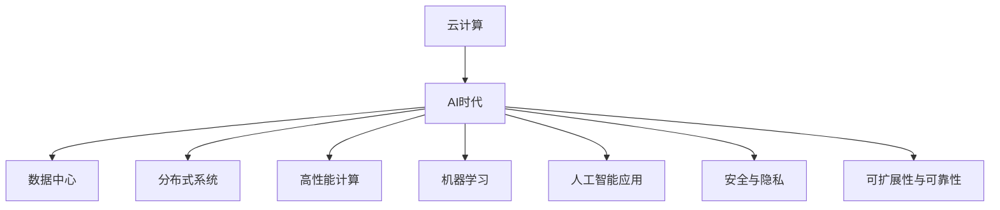

                 

# Lepton AI：打造AI时代的第一朵云

> 关键词：云计算, AI, AI时代, 数据中心, 分布式系统, 高性能计算, 机器学习, 人工智能应用, 安全, 隐私, 可扩展性, 可靠性

## 1. 背景介绍

### 1.1 问题由来
随着人工智能(AI)技术的发展，AI系统对计算资源的需求也呈现出爆炸式增长。如何构建能够支持AI大规模训练、推理和应用的基础设施，成为了当前科技产业的重要课题。在此背景下，“云计算”作为一种新兴的计算范式，以其按需计费、弹性扩展、高效利用资源等特性，成为AI时代的主要数据中心基础设施。

### 1.2 问题核心关键点
云计算的核心在于通过网络将计算资源虚拟化，按需提供给用户使用，实现资源的共享和高效利用。而AI时代的云计算，则需要在传统的计算资源基础上，加入大规模数据处理、分布式训练、智能算法优化等技术，构建一个能高效支持AI应用的计算平台。

### 1.3 问题研究意义
构建一个能够高效支持AI应用的云计算平台，对于提升AI技术落地应用的效率和效果，推动AI技术的普及和创新，具有重要意义：

1. **资源共享**：云计算使得AI开发者能够共享大规模计算资源，降低了技术应用的门槛。
2. **按需计费**：按需计费模式使得开发者可以根据实际需求灵活调整计算资源，避免资源浪费。
3. **弹性扩展**：云计算具备弹性扩展能力，能够快速应对AI算法的计算需求变化，保证系统的稳定性和高效性。
4. **成本降低**：通过共享资源和弹性扩展，云计算平台大大降低了AI应用的成本，使得更多中小企业也能使用AI技术。
5. **智能算法**：云计算平台可以整合多种AI算法，提供一站式的AI应用开发环境，加速AI技术创新。

## 2. 核心概念与联系

### 2.1 核心概念概述

云计算和AI时代是紧密相关的两个概念，共同构成了现代信息基础设施的基石。以下是几个关键核心概念：

- **云计算**：基于网络，通过虚拟化技术，将计算资源池化，按需提供给用户的计算模式。
- **AI时代**：指人工智能技术在各个行业领域的广泛应用，包括数据挖掘、智能决策、自动化、机器人等。
- **数据中心**：承担大规模数据存储和计算任务的物理设施，是云计算平台的核心组成部分。
- **分布式系统**：将计算资源分散部署在多个节点上，通过网络协同工作，实现高性能计算的系统。
- **高性能计算**：通过优化硬件和软件架构，实现高效的并行计算。
- **机器学习**：通过数据驱动的方式，让计算机自动学习、优化，从而提升决策能力的技术。
- **人工智能应用**：将AI技术应用于具体业务场景，如自然语言处理、计算机视觉、推荐系统等。
- **安全与隐私**：在AI应用中，确保数据和模型安全，保护用户隐私是重要一环。
- **可扩展性与可靠性**：保证云计算平台能够应对高并发和故障，确保系统的稳定性和连续性。

这些核心概念之间的逻辑关系可以通过以下Mermaid流程图来展示：



这个流程图展示了云计算和AI时代之间的关联及其核心组成部分：

1. 云计算为AI时代提供基础设施。
2. 数据中心、分布式系统、高性能计算、机器学习等技术，构成云计算平台的核心能力。
3. 人工智能应用是云计算技术应用的典型场景。
4. 安全与隐私、可扩展性与可靠性，是云计算平台成功运行的关键保障。

## 3. 核心算法原理 & 具体操作步骤
### 3.1 算法原理概述

在AI时代，云计算平台的核心算法主要围绕以下几个方面：

- **分布式训练算法**：通过在多个节点上并行训练模型，加速模型的收敛和优化。
- **模型压缩与量化**：通过算法优化，减小模型的大小和计算复杂度，实现高效推理。
- **智能调度与优化**：根据任务需求，动态调整计算资源，实现性能和成本的平衡。
- **安全与隐私保护**：采用数据加密、访问控制等技术，保护数据和模型的安全。
- **高性能计算技术**：包括GPU加速、混合精度计算等，提升计算效率和效果。

### 3.2 算法步骤详解

云计算平台的核心算法主要包括以下几个步骤：

**Step 1: 数据中心建设**
- 选择合适的地理位置，构建数据中心的基础设施。
- 采购高性能服务器、存储设备、网络设备等硬件资源。
- 部署分布式操作系统，搭建集群管理系统。

**Step 2: 分布式系统部署**
- 在数据中心内，构建多个计算节点，并通过网络连通。
- 部署分布式存储系统，确保数据的高可用性和一致性。
- 实现分布式任务调度、负载均衡、容错机制。

**Step 3: 高性能计算优化**
- 选择合适的GPU、TPU等硬件设备，提升计算速度。
- 优化算法和编程模型，实现高效的并行计算。
- 使用混合精度计算、算法加速等技术，降低计算资源消耗。

**Step 4: 机器学习算法训练**
- 在分布式集群上，对大规模数据进行预处理和特征工程。
- 选择合适的优化器，并应用分布式训练算法进行模型训练。
- 对训练好的模型进行压缩和量化，提升推理效率。

**Step 5: AI应用部署与优化**
- 将训练好的模型部署到生产环境。
- 对模型进行性能调优，确保其在实际应用中的高效运行。
- 提供API接口，方便用户进行模型调用和数据交互。

### 3.3 算法优缺点

云计算平台的核心算法具有以下优点：

1. **高性能**：通过分布式计算、高性能硬件、算法优化等手段，实现高效的计算。
2. **可扩展性**：能够动态调整计算资源，实现系统规模的无限扩展。
3. **弹性调度**：根据任务需求，灵活分配计算资源，实现成本和性能的平衡。
4. **数据安全**：采用数据加密、访问控制等技术，确保数据和模型的安全。
5. **可靠性高**：通过分布式系统、冗余机制、故障恢复等手段，确保系统的连续性和可靠性。

然而，云计算平台也存在一些局限性：

1. **延迟和带宽限制**：远程访问时可能存在延迟和带宽瓶颈。
2. **资源消耗高**：大规模计算任务对硬件资源消耗较大，成本较高。
3. **算法复杂**：分布式训练、模型压缩等技术实现复杂，对开发者要求较高。
4. **隐私风险**：数据和模型在云平台中存储，可能面临隐私泄露的风险。
5. **标准不一**：不同的云平台和生态系统可能存在标准不一，导致迁移困难。

### 3.4 算法应用领域

云计算平台的算法主要应用于以下领域：

- **大数据处理**：处理海量数据，进行数据挖掘、分析、可视化等。
- **分布式训练**：在大规模数据集上训练深度学习模型，如自然语言处理、计算机视觉等。
- **模型优化**：对训练好的模型进行压缩、量化、剪枝等优化，提升推理效率。
- **智能调度**：根据任务需求，动态调整计算资源，实现高效利用。
- **安全与隐私**：保护数据和模型，防止泄露和篡改。

云计算平台已经广泛应用于金融、医疗、制造、教育等多个领域，成为推动数字化转型的重要工具。

## 4. 数学模型和公式 & 详细讲解 & 举例说明
### 4.1 数学模型构建

在本节中，我们将从数学角度介绍云计算平台的核心算法模型。

以深度学习模型的分布式训练为例，假设模型的参数为 $\theta$，优化目标为损失函数 $L(\theta)$，分布式训练的算法框架为 $A$。模型的训练过程可以表示为：

$$
\min_{\theta} L(\theta) \text{ s.t. } \theta_{i} = A(\theta_{i-1})
$$

其中 $\theta_{i}$ 表示第 $i$ 轮迭代后的模型参数，$A$ 表示分布式训练的算法框架。

### 4.2 公式推导过程

以反向传播算法为例，其核心思想是通过链式法则，将损失函数对模型参数的梯度反向传播，更新模型参数。假设 $f(\theta)$ 为模型的前向传播，$y$ 为样本的真实标签，$\hat{y}$ 为模型的预测输出，则模型的损失函数可以表示为：

$$
L(\theta) = \frac{1}{N}\sum_{i=1}^N \mathcal{L}(\hat{y}_i, y_i)
$$

其中 $\mathcal{L}$ 为损失函数，如交叉熵损失、均方误差损失等。

在反向传播过程中，损失函数对模型参数的梯度可以表示为：

$$
\frac{\partial L(\theta)}{\partial \theta_k} = \frac{1}{N}\sum_{i=1}^N \frac{\partial \mathcal{L}}{\partial \hat{y}_i} \frac{\partial \hat{y}_i}{\partial \theta_k}
$$

其中 $\frac{\partial \hat{y}_i}{\partial \theta_k}$ 为链式法则的传播过程。

### 4.3 案例分析与讲解

以分布式训练为例，假设模型在多个节点上并行训练，每个节点更新部分模型参数，其更新公式为：

$$
\theta_k^{(i)} = \theta_k^{(i-1)} - \eta \frac{\partial L(\theta)}{\partial \theta_k} 
$$

其中 $\eta$ 为学习率，$\theta_k^{(i)}$ 表示第 $i$ 轮迭代后的模型参数。

通过在多个节点上并行更新模型参数，分布式训练可以显著提升模型的训练效率和效果。同时，为了实现高性能计算，还需要对数据进行分片处理，确保每个节点能够高效利用计算资源。

## 5. 项目实践：代码实例和详细解释说明
### 5.1 开发环境搭建

在进行云计算平台开发时，需要搭建一个完整的开发环境。以下是使用Python和TensorFlow搭建云计算平台开发环境的示例：

1. 安装Anaconda：从官网下载并安装Anaconda，用于创建独立的Python环境。

```bash
conda create -n cloud-env python=3.8
conda activate cloud-env
```

2. 安装TensorFlow：根据CUDA版本，从官网获取对应的安装命令。例如：

```bash
conda install tensorflow
```

3. 安装TensorBoard：TensorFlow配套的可视化工具，可以实时监测模型训练状态。

```bash
conda install tensorboard
```

4. 安装Flask：用于搭建Web服务，方便模型部署和调用。

```bash
pip install flask
```

5. 安装gunicorn：用于运行Flask Web服务。

```bash
pip install gunicorn
```

完成上述步骤后，即可在`cloud-env`环境中开始云计算平台开发。

### 5.2 源代码详细实现

下面我们以分布式训练为例，给出使用TensorFlow和Flask搭建云计算平台的全过程代码实现。

首先，定义分布式训练的函数：

```python
import tensorflow as tf

def distributed_train(model, data, num_workers=4):
    with tf.distribute.Strategy('TPUStrategy', num_replicas=num_workers) as strategy:
        with strategy.scope():
            # 加载模型
            model = load_model(model_path)
            # 定义优化器
            optimizer = tf.keras.optimizers.Adam()
            # 定义损失函数
            loss_fn = tf.keras.losses.SparseCategoricalCrossentropy(from_logits=True)
            # 定义评价指标
            acc = tf.keras.metrics.SparseCategoricalAccuracy()
            
            # 并行训练
            with strategy.scope():
                for epoch in range(num_epochs):
                    for batch in data:
                        input_data = batch[0]
                        label_data = batch[1]
                        with tf.GradientTape() as tape:
                            logits = model(input_data)
                            loss = loss_fn(labels=label_data, logits=logits)
                        gradients = tape.gradient(loss, model.trainable_variables)
                        optimizer.apply_gradients(zip(gradients, model.trainable_variables))
                        acc.update_state(labels=label_data, logits=logits)
        
        return acc.result()
```

然后，搭建Flask Web服务，提供API接口供用户调用：

```python
from flask import Flask, request, jsonify

app = Flask(__name__)

@app.route('/train', methods=['POST'])
def train():
    data = request.get_json()
    model_name = data['model_name']
    data_path = data['data_path']
    num_epochs = data['num_epochs']
    num_workers = data['num_workers']
    
    # 调用分布式训练函数
    accuracy = distributed_train(model_name, data_path, num_workers=num_workers)
    
    # 返回结果
    return jsonify({'accuracy': accuracy})

if __name__ == '__main__':
    app.run(host='0.0.0.0', port=5000)
```

最后，启动Flask服务，等待用户请求：

```bash
gunicorn -w 4 cloud_flask:app
```

在上述代码中，我们定义了一个简单的API接口，接受用户输入的模型名称、数据路径、训练轮数、节点数量等参数，调用分布式训练函数进行模型训练，并返回训练结果。这只是一个示例，实际的云计算平台开发需要更复杂的算法和更完善的用户界面。

### 5.3 代码解读与分析

让我们再详细解读一下关键代码的实现细节：

**distributed_train函数**：
- 使用TensorFlow的分布式策略，指定使用的TPU节点数量。
- 在策略作用域下加载模型，定义优化器、损失函数和评价指标。
- 遍历数据集，对每个批次进行前向传播、计算损失、反向传播和模型更新。
- 在每轮训练结束后，计算评价指标并返回。

**Flask服务**：
- 使用Flask框架搭建Web服务，定义一个POST接口。
- 通过Flask的request对象获取用户输入的请求参数。
- 调用分布式训练函数进行模型训练，并将结果转换为JSON格式返回。
- 启动Flask服务，监听指定端口。

## 6. 实际应用场景
### 6.1 智能客服系统

云计算平台可以为智能客服系统提供强大的计算资源和灵活的部署方式。传统客服系统依赖人工客服，响应速度慢且成本高。通过云计算平台，可以构建一个高效的智能客服系统，实现24小时在线服务，快速响应客户咨询。

具体实现时，可以将历史客服记录和常见问题作为训练数据，训练一个基于深度学习的客服模型。模型可以自动理解用户意图，匹配最合适的答案模板进行回复。对于客户提出的新问题，系统可以通过检索系统实时搜索相关内容，动态组织生成回答。

### 6.2 金融舆情监测

金融机构需要实时监测市场舆论动向，以便及时应对负面信息传播，规避金融风险。通过云计算平台，可以实现对大规模数据的实时分析和处理，提供金融舆情监测的解决方案。

具体实现时，可以采集金融领域的各类文本数据，并对其进行主题标注和情感标注。利用云计算平台强大的计算能力，快速处理海量数据，训练一个情感分析模型。模型能够自动判断文本属于何种主题，情感倾向是正面、中性还是负面。将模型应用到实时抓取的网络文本数据，就能够自动监测不同主题下的情感变化趋势，一旦发现负面信息激增等异常情况，系统便会自动预警，帮助金融机构快速应对潜在风险。

### 6.3 个性化推荐系统

当前的推荐系统往往只依赖用户的历史行为数据进行物品推荐，无法深入理解用户的真实兴趣偏好。通过云计算平台，可以构建一个个性化推荐系统，更好地挖掘用户行为背后的语义信息，从而提供更精准、多样的推荐内容。

具体实现时，可以收集用户浏览、点击、评论、分享等行为数据，提取和用户交互的物品标题、描述、标签等文本内容。利用云计算平台的大规模计算能力，训练一个基于深度学习的推荐模型。模型能够从文本内容中准确把握用户的兴趣点。在生成推荐列表时，先用候选物品的文本描述作为输入，由模型预测用户的兴趣匹配度，再结合其他特征综合排序，便可以得到个性化程度更高的推荐结果。

### 6.4 未来应用展望

随着云计算平台和AI技术的发展，未来的智能应用将更加广泛和深入。云计算平台不仅可以提供高效的计算资源和灵活的部署方式，还可以整合更多AI技术，如自然语言处理、计算机视觉、智能决策等，为各行各业提供强大的智能支持。

在智慧医疗领域，云计算平台可以构建一个高度集成的医疗数据中心，整合医疗记录、患者信息、科研数据等，支持医疗决策、疾病预测、远程诊断等应用。

在智能教育领域，云计算平台可以构建一个开放的教育资源平台，提供丰富的教学资源和学习工具，支持个性化学习和智能辅导。

在智慧城市治理中，云计算平台可以构建一个集成的城市管理平台，支持交通管理、环境监测、应急响应等应用，提高城市管理的智能化水平。

除此之外，云计算平台还将推动更多领域的数字化转型，如制造、物流、金融、零售等，为各行各业提供高效、智能、安全的解决方案。

## 7. 工具和资源推荐
### 7.1 学习资源推荐

为了帮助开发者掌握云计算平台的核心技术，这里推荐一些优质的学习资源：

1. **《云计算》（英文名：Cloud Computing）**：由Cloud Computing专家撰写的经典书籍，全面介绍了云计算的基本概念、架构、技术和应用。
2. **《分布式系统》（英文名：Distributed Systems）**：由分布式系统专家撰写的经典书籍，深入讲解了分布式系统的设计原则和实现技术。
3. **《深度学习》（英文名：Deep Learning）**：由深度学习专家撰写的经典书籍，全面介绍了深度学习的基本原理、算法和应用。
4. **TensorFlow官方文档**：TensorFlow的官方文档，提供了完整的API接口、使用示例和性能优化技巧，是学习TensorFlow的最佳资料。
5. **AWS、Google Cloud、Microsoft Azure等云平台官方文档**：各大云平台的官方文档，提供了丰富的学习资源和实用指南，帮助开发者快速上手。
6. **Coursera、edX等在线教育平台**：提供了众多云计算、深度学习、分布式系统的在线课程，方便开发者系统学习。

### 7.2 开发工具推荐

云计算平台的开发需要多种工具的协同工作。以下是几款常用的开发工具：

1. **Anaconda**：用于创建和管理Python环境，方便开发者进行依赖管理和代码共享。
2. **TensorFlow**：由Google开发的深度学习框架，支持大规模分布式训练和推理。
3. **Flask**：用于搭建Web服务，方便模型部署和调用。
4. **TensorBoard**：TensorFlow配套的可视化工具，实时监测模型训练状态。
5. **Jupyter Notebook**：用于编写和调试代码，支持动态交互和代码展示。
6. **gunicorn**：用于运行Flask Web服务，支持多进程和负载均衡。

合理利用这些工具，可以显著提升云计算平台的开发效率，加快创新迭代的步伐。

### 7.3 相关论文推荐

云计算平台的研究和应用涉及多个领域，以下是几篇代表性的论文，推荐阅读：

1. **分布式深度学习框架：TensorFlow**：由TensorFlow团队撰写的论文，介绍了TensorFlow的分布式训练机制和优化技术。
2. **深度学习加速器：TPU**：由Google撰写的论文，介绍了TPU的硬件架构和软件优化技术。
3. **云计算基础设施：AWS**：由AWS团队撰写的论文，介绍了AWS的云计算基础设施和安全性保障。
4. **分布式系统设计与实现**：由分布式系统专家撰写的经典论文，深入讲解了分布式系统的设计和实现方法。
5. **深度学习模型压缩与优化**：由深度学习专家撰写的经典论文，介绍了模型压缩、量化、剪枝等技术，提升推理效率。

这些论文代表了云计算平台的发展方向，帮助开发者了解前沿技术，开拓创新思路。

## 8. 总结：未来发展趋势与挑战
### 8.1 研究成果总结

云计算平台和大语言模型是未来AI时代的基础设施和核心技术。云计算平台为AI应用提供了强大的计算资源和灵活的部署方式，极大地推动了AI技术的落地应用。大语言模型则在自然语言处理、智能决策、自动化等领域展示了强大的能力，推动了人工智能技术的发展和普及。

### 8.2 未来发展趋势

展望未来，云计算平台和大语言模型将呈现以下几个发展趋势：

1. **云平台的标准化**：各大云平台将逐步统一API接口和服务标准，方便开发者进行跨平台开发。
2. **云平台的安全性**：随着数据和模型的日益复杂，云平台的安全性和隐私保护将更加重要，需要采用更加严格的加密和访问控制技术。
3. **云平台的智能化**：未来的云平台将整合更多的AI技术，如自然语言处理、计算机视觉、智能决策等，提供更全面、更智能的解决方案。
4. **云平台的应用多样化**：云计算平台将拓展到更多行业，如医疗、教育、制造、金融等，推动各行各业的数字化转型。
5. **云平台的可扩展性**：云平台将具备更高的可扩展性和弹性，能够适应更多变的计算需求和数据规模。

### 8.3 面临的挑战

尽管云计算平台和大语言模型技术已经取得了显著进展，但在应用过程中仍然面临诸多挑战：

1. **数据隐私和安全**：在云平台中存储和处理大量敏感数据，可能面临隐私泄露和安全风险。
2. **资源消耗高**：大规模计算任务对硬件资源消耗较大，成本较高。
3. **算法复杂**：分布式训练、模型压缩等技术实现复杂，对开发者要求较高。
4. **兼容性问题**：不同的云平台和生态系统可能存在兼容性问题，导致迁移困难。
5. **标准不一**：各大云平台的API接口和服务标准不统一，增加了开发和维护的复杂度。

### 8.4 研究展望

未来的研究需要在以下几个方面寻求新的突破：

1. **云平台的安全性和隐私保护**：采用更加严格的加密和访问控制技术，确保数据和模型的安全。
2. **云平台的可扩展性和性能优化**：优化计算资源和算法实现，提高云平台的可扩展性和计算效率。
3. **云平台的标准化和互操作性**：推动云平台的标准化和互操作性，降低开发和迁移成本。
4. **云平台的智能化和自动化**：整合更多AI技术，提升云平台的智能化水平，减少人工干预。
5. **云平台的可持续性和可持续发展**：采用绿色计算和可持续设计，降低云平台的能耗和环境影响。

这些研究方向将推动云计算平台和大语言模型技术的不断进步，为AI时代的基础设施建设提供有力支持。

## 9. 附录：常见问题与解答

**Q1：云计算平台和大语言模型如何结合？**

A: 云计算平台和大语言模型是互补的两种技术，可以结合使用，提供更强大的智能服务。云计算平台提供高效的计算资源和灵活的部署方式，大语言模型则提供强大的自然语言理解和生成能力。两者结合，可以实现更广泛、更深入的AI应用。

**Q2：如何选择云平台？**

A: 选择云平台时，需要考虑以下几个因素：
1. 稳定性：选择技术成熟、可靠性高的云平台。
2. 可扩展性：选择能够满足业务需求，具备良好扩展性的云平台。
3. 安全性：选择具有严格安全措施，能够保护数据和模型的云平台。
4. 成本：选择价格合理、性价比高的云平台。
5. 社区支持：选择具有活跃社区和丰富文档的云平台。

**Q3：云计算平台如何优化模型的推理效率？**

A: 优化模型的推理效率可以从以下几个方面入手：
1. 模型压缩：通过剪枝、量化、参数共享等技术，减小模型大小，提升推理速度。
2. 硬件加速：使用GPU、TPU等高性能硬件设备，加速推理计算。
3. 算法优化：优化推理算法，减少计算量，提升效率。
4. 内存优化：使用内存优化技术，减少内存占用，提升推理速度。
5. 模型选择：选择适合特定场景的模型，避免复杂计算。

**Q4：云计算平台如何保障数据安全？**

A: 保障云计算平台的数据安全，可以从以下几个方面入手：
1. 数据加密：使用加密技术，保护数据在传输和存储过程中的安全。
2. 访问控制：采用严格的访问控制机制，限制数据的访问权限。
3. 数据备份：定期备份数据，防止数据丢失和损坏。
4. 监控告警：实时监控数据访问和使用情况，及时发现和应对异常。
5. 合规性检查：确保数据处理符合相关法律法规和行业标准。

**Q5：云计算平台如何支持多语言模型？**

A: 云计算平台可以支持多语言模型，提供多种API接口和部署方式。具体实现时，需要考虑以下几个因素：
1. 模型兼容性：选择兼容不同语言模型的云平台。
2. 语言支持：选择支持多种语言，能够处理不同语言模型的云平台。
3. 分布式训练：采用分布式训练技术，处理多语言模型的计算需求。
4. 多语言推理：提供多语言推理支持，能够处理不同语言模型的推理请求。
5. 多语言数据：选择支持多语言数据存储和处理的云平台。

通过合理利用云计算平台，可以高效支持多语言模型的开发和部署，推动多语言AI技术的普及和应用。

---

作者：禅与计算机程序设计艺术 / Zen and the Art of Computer Programming

