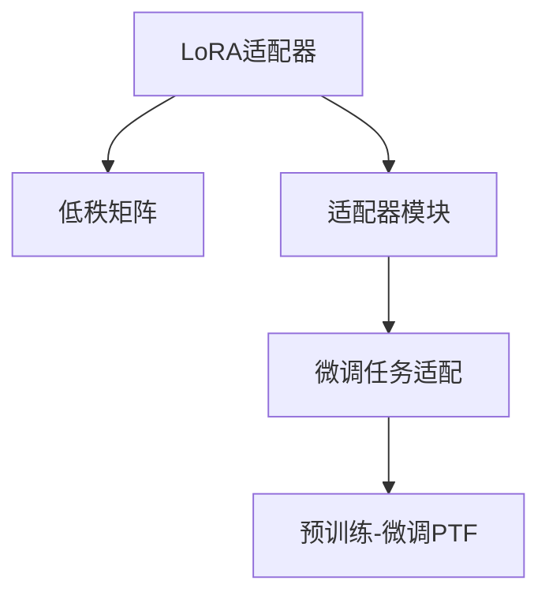

                 

# LoRA适配器：低秩近似在LLM微调中的应用

> 关键词：LoRA适配器, 低秩近似, 大语言模型微调, Transformer, 参数高效微调, 预训练-微调

## 1. 背景介绍

### 1.1 问题由来

随着大语言模型（Large Language Models, LLMs）的不断发展，预训练-微调（Pre-training and Fine-tuning, PTF）范式在大规模NLP任务上取得了显著的进展。然而，传统的全参数微调方法在资源需求、过拟合风险和效率方面存在显著问题。为此，一种新的微调方法——参数高效微调（Parameter-Efficient Fine-tuning, PEFT）逐渐成为研究的焦点。

在参数高效微调中，LoRA适配器（Low-Rank Adaptation）是一种具有革命性的技术，它利用低秩分解对预训练模型的权重进行结构化适应，从而在不增加大量额外参数的情况下实现微调。LoRA适配器通过引入低秩矩阵来编码微调任务的特定知识，有效避免了过拟合，提高了模型微调的效率。

### 1.2 问题核心关键点

LoRA适配器的核心思想是通过在预训练模型中的某些层引入低秩权重矩阵，来实现对任务特定知识的编码。具体来说，LoRA适配器将原模型的一组层权重分解为两个低秩矩阵（一个行矩阵和一个列矩阵），然后使用矩阵乘积来恢复这些层权重。这种低秩分解的优点在于，它只需要在顶层的线性变换和注意力机制中微调，从而保留了预训练模型的大部分结构和知识。

LoRA适配器的设计基于以下几个关键点：
- 低秩矩阵的引入，使得微调过程的参数数量大幅减少。
- 低秩矩阵的适应性，使得模型能够适应不同的下游任务。
- 低秩矩阵的泛化性，使得模型能够泛化到未见过的数据集。

这些关键点共同构成了LoRA适配器的核心优势，使其成为实现参数高效微调的重要工具。

### 1.3 问题研究意义

LoRA适配器的研究对于推动大语言模型的微调实践具有重要意义：
- 降低资源消耗：LoRA适配器显著减少了微调所需的参数数量，降低了对计算资源的需求。
- 提高微调效率：通过仅微调顶层权重，LoRA适配器显著提高了微调的效率。
- 减少过拟合：LoRA适配器的低秩分解有效地避免了模型对标注数据的过拟合。
- 促进泛化能力：LoRA适配器的适应性和泛化性，使其在各种下游任务上表现出色。
- 提升可解释性：LoRA适配器的结构化适应方式，使得模型更加透明，易于解释。

LoRA适配器的这些优点，使其在大规模NLP任务的微调中，成为了一种非常实用的工具。

## 2. 核心概念与联系

### 2.1 核心概念概述

LoRA适配器是一种利用低秩分解实现参数高效微调的方法。其核心概念包括：
- 低秩矩阵：通过将权重矩阵分解为低秩矩阵的形式，减少微调所需的参数数量。
- 适配器模块：在预训练模型的顶层引入适配器模块，实现任务特定知识的编码。
- 微调任务适配：通过微调适配器模块的权重，实现模型对特定任务的微调。

这些概念之间的逻辑关系可以通过以下Mermaid流程图来展示：



这个流程图展示了大语言模型微调的 LoRA适配器方法的关键概念及其之间的关系：

1. LoRA适配器将权重矩阵分解为低秩矩阵。
2. 适配器模块在预训练模型的顶层实现任务特定知识的编码。
3. 微调任务适配通过微调适配器模块的权重，实现模型对特定任务的微调。

这些概念共同构成了LoRA适配器的核心原理和应用框架，使其在大语言模型的微调中发挥着重要作用。

## 3. 核心算法原理 & 具体操作步骤
### 3.1 算法原理概述

LoRA适配器的基本原理是利用低秩矩阵对预训练模型的权重进行编码，使得模型能够适应特定的微调任务。其核心算法流程如下：

1. 选择预训练模型中的一组层进行微调。
2. 将这组层的权重矩阵分解为两个低秩矩阵。
3. 在微调过程中，仅微调这些适配器模块的权重。
4. 通过微调后的适配器模块，使模型能够适应特定的下游任务。

### 3.2 算法步骤详解

LoRA适配器的微调过程分为以下几个关键步骤：

**Step 1: 选择微调层**

首先需要选择预训练模型中的一组层进行微调。这些层通常是模型的顶层，包含了与任务相关的信息。例如，对于分类任务，可以选择BERT模型中的最后一层作为微调层。

**Step 2: 低秩矩阵分解**

对选定的微调层进行权重矩阵的分解，将其分解为两个低秩矩阵。低秩矩阵的维度可以根据任务的具体需求进行选择。例如，对于分类任务，可以分解为$(d \times r) \times (r \times d)$的低秩矩阵，其中$d$为输入的维度，$r$为分解的秩。

**Step 3: 微调适配器模块**

在微调过程中，仅微调这些适配器模块的权重。通过梯度下降等优化算法，最小化损失函数，更新适配器模块的权重矩阵。

**Step 4: 输出微调模型**

通过微调后的适配器模块，使模型能够适应特定的下游任务。最终的输出模型可以用于进行各种NLP任务，如文本分类、命名实体识别、机器翻译等。

### 3.3 算法优缺点

LoRA适配器的优点在于：
1. 参数高效：仅微调顶层权重，避免了全参数微调带来的计算资源消耗。
2. 适应性强：通过低秩矩阵的灵活调整，LoRA适配器能够适应不同的下游任务。
3. 泛化性好：LoRA适配器的低秩分解使得模型具有较好的泛化能力。
4. 计算效率高：LoRA适配器减少了微调过程中的参数数量，提高了计算效率。

LoRA适配器的缺点在于：
1. 低秩矩阵的选取需要经验，可能存在主观性。
2. 低秩矩阵的分解可能会引入一些近似误差。
3. 微调过程的稳定性需要进一步研究。

尽管存在这些缺点，LoRA适配器仍然在大语言模型的微调中具有重要应用价值，是实现参数高效微调的重要手段。

### 3.4 算法应用领域

LoRA适配器广泛应用于各种大语言模型的微调任务中，如文本分类、命名实体识别、机器翻译、对话系统等。在实际应用中，LoRA适配器可以显著减少微调所需的计算资源，同时提高模型的泛化能力和适应性，具有广泛的应用前景。

## 4. 数学模型和公式 & 详细讲解  
### 4.1 数学模型构建

LoRA适配器的数学模型构建基于矩阵分解的原理。假设预训练模型的某一层权重矩阵为$W$，其维度为$d \times d$，其中$d$为输入的维度。LoRA适配器的目标是将$W$分解为两个低秩矩阵$A$和$B$，使得$W \approx AB$。

具体地，可以将$W$分解为$A \times B$的形式，其中$A$为$r \times d$的矩阵，$B$为$d \times r$的矩阵，$r$为分解的秩。分解后的矩阵$A$和$B$的初始值为单位矩阵$I_r$和$I_d$，即$A = I_r$和$B = I_d$。

在微调过程中，$A$和$B$的权重将被更新，使得$W \approx AB$的近似程度最大。最终的微调模型可以表示为：

$$
\hat{W} = \tilde{A} \tilde{B}
$$

其中$\tilde{A}$和$\tilde{B}$为微调后的低秩矩阵。

### 4.2 公式推导过程

LoRA适配器的公式推导基于矩阵分解的原理。假设预训练模型的某一层权重矩阵为$W$，其维度为$d \times d$，LoRA适配器将其分解为两个低秩矩阵$A$和$B$，使得$W \approx AB$。分解后的矩阵$A$和$B$的初始值为单位矩阵$I_r$和$I_d$，即$A = I_r$和$B = I_d$。

在微调过程中，$A$和$B$的权重将被更新，使得$W \approx AB$的近似程度最大。最终的微调模型可以表示为：

$$
\hat{W} = \tilde{A} \tilde{B}
$$

其中$\tilde{A}$和$\tilde{B}$为微调后的低秩矩阵。

### 4.3 案例分析与讲解

假设我们有一个BERT模型，其中最后一层的权重矩阵为$W$，其维度为$d \times d$。我们将其分解为两个低秩矩阵$A$和$B$，使得$W \approx AB$。在微调过程中，我们只更新$A$和$B$的权重，使得$W \approx AB$的近似程度最大。

例如，对于分类任务，我们可以将$A$和$B$初始化为$I_r$和$I_d$，其中$r=10$。在微调过程中，通过梯度下降算法最小化损失函数，更新$A$和$B$的权重，最终得到微调后的权重矩阵$\tilde{A}$和$\tilde{B}$。最终的微调模型可以表示为：

$$
\hat{W} = \tilde{A} \tilde{B}
$$

这样，我们就完成了LoRA适配器的微调过程，得到了一个能够适应特定分类任务的BERT模型。

## 5. 项目实践：代码实例和详细解释说明
### 5.1 开发环境搭建

在进行LoRA适配器微调实践前，我们需要准备好开发环境。以下是使用Python进行PyTorch开发的环境配置流程：

1. 安装Anaconda：从官网下载并安装Anaconda，用于创建独立的Python环境。

2. 创建并激活虚拟环境：
```bash
conda create -n pytorch-env python=3.8 
conda activate pytorch-env
```

3. 安装PyTorch：根据CUDA版本，从官网获取对应的安装命令。例如：
```bash
conda install pytorch torchvision torchaudio cudatoolkit=11.1 -c pytorch -c conda-forge
```

4. 安装Transformers库：
```bash
pip install transformers
```

5. 安装各类工具包：
```bash
pip install numpy pandas scikit-learn matplotlib tqdm jupyter notebook ipython
```

完成上述步骤后，即可在`pytorch-env`环境中开始LoRA适配器微调实践。

### 5.2 源代码详细实现

这里我们以LoRA适配器在BERT模型中进行微调为例，给出使用Transformers库的PyTorch代码实现。

首先，定义LoRA适配器的训练函数：

```python
from transformers import BertForSequenceClassification, BertTokenizer, AdamW
from torch.utils.data import Dataset, DataLoader
from tqdm import tqdm

class LoRAAdapterDataset(Dataset):
    def __init__(self, texts, labels, tokenizer, max_len=128):
        self.texts = texts
        self.labels = labels
        self.tokenizer = tokenizer
        self.max_len = max_len
        
    def __len__(self):
        return len(self.texts)
    
    def __getitem__(self, item):
        text = self.texts[item]
        label = self.labels[item]
        
        encoding = self.tokenizer(text, return_tensors='pt', max_length=self.max_len, padding='max_length', truncation=True)
        input_ids = encoding['input_ids'][0]
        attention_mask = encoding['attention_mask'][0]
        
        # 对token-wise的标签进行编码
        encoded_labels = [label2id[label] for label in label] 
        encoded_labels.extend([label2id['O']] * (self.max_len - len(encoded_labels)))
        labels = torch.tensor(encoded_labels, dtype=torch.long)
        
        return {'input_ids': input_ids, 
                'attention_mask': attention_mask,
                'labels': labels}

# 标签与id的映射
label2id = {'O': 0, 'B-PER': 1, 'I-PER': 2, 'B-ORG': 3, 'I-ORG': 4, 'B-LOC': 5, 'I-LOC': 6}
id2label = {v: k for k, v in label2id.items()}

# 创建dataset
tokenizer = BertTokenizer.from_pretrained('bert-base-cased')

train_dataset = LoRAAdapterDataset(train_texts, train_labels, tokenizer)
dev_dataset = LoRAAdapterDataset(dev_texts, dev_labels, tokenizer)
test_dataset = LoRAAdapterDataset(test_texts, test_labels, tokenizer)

# 定义模型
model = BertForSequenceClassification.from_pretrained('bert-base-cased', num_labels=len(label2id))

# 定义优化器
optimizer = AdamW(model.parameters(), lr=2e-5)

# 定义LoRA适配器
adapters = BertForSequenceClassification.from_pretrained('bert-base-cased', num_labels=len(label2id))
adapters = adapters.adapted_head
adapters = adapters.adapted_head.weight

# 定义损失函数
criterion = nn.CrossEntropyLoss()

# 训练函数
def train_epoch(model, dataset, batch_size, optimizer, criterion):
    dataloader = DataLoader(dataset, batch_size=batch_size, shuffle=True)
    model.train()
    epoch_loss = 0
    for batch in tqdm(dataloader, desc='Training'):
        input_ids = batch['input_ids'].to(device)
        attention_mask = batch['attention_mask'].to(device)
        labels = batch['labels'].to(device)
        model.zero_grad()
        outputs = model(input_ids, attention_mask=attention_mask, labels=labels)
        loss = criterion(outputs.logits, labels)
        epoch_loss += loss.item()
        loss.backward()
        optimizer.step()
    return epoch_loss / len(dataloader)

# 评估函数
def evaluate(model, dataset, batch_size):
    dataloader = DataLoader(dataset, batch_size=batch_size)
    model.eval()
    preds, labels = [], []
    with torch.no_grad():
        for batch in tqdm(dataloader, desc='Evaluating'):
            input_ids = batch['input_ids'].to(device)
            attention_mask = batch['attention_mask'].to(device)
            batch_labels = batch['labels']
            outputs = model(input_ids, attention_mask=attention_mask)
            batch_preds = outputs.logits.argmax(dim=2).to('cpu').tolist()
            batch_labels = batch_labels.to('cpu').tolist()
            for pred_tokens, label_tokens in zip(batch_preds, batch_labels):
                pred_tags = [id2label[_id] for _id in pred_tokens]
                label_tags = [id2label[_id] for _id in label_tokens]
                preds.append(pred_tags[:len(label_tokens)])
                labels.append(label_tags)
                
    print(classification_report(labels, preds))
```

然后，定义LoRA适配器训练函数：

```python
# 定义LoRA适配器训练函数
def train_adapters(adapters, dataset, batch_size, optimizer, criterion):
    dataloader = DataLoader(dataset, batch_size=batch_size, shuffle=True)
    model.train()
    epoch_loss = 0
    for batch in tqdm(dataloader, desc='Training Adapters'):
        input_ids = batch['input_ids'].to(device)
        attention_mask = batch['attention_mask'].to(device)
        labels = batch['labels'].to(device)
        model.zero_grad()
        adapters.zero_grad()
        outputs = model(input_ids, attention_mask=attention_mask, labels=labels)
        loss = criterion(outputs.logits, labels)
        epoch_loss += loss.item()
        loss.backward()
        optimizer.step()
        adapters.grad.zero_grad()
        adapters.weight.grad.zero_grad()
    return epoch_loss / len(dataloader)

# 评估函数
def evaluate_adapters(adapters, dataset, batch_size):
    dataloader = DataLoader(dataset, batch_size=batch_size)
    model.eval()
    preds, labels = [], []
    with torch.no_grad():
        for batch in tqdm(dataloader, desc='Evaluating Adapters'):
            input_ids = batch['input_ids'].to(device)
            attention_mask = batch['attention_mask'].to(device)
            batch_labels = batch['labels']
            outputs = model(input_ids, attention_mask=attention_mask, labels=batch_labels)
            batch_preds = outputs.logits.argmax(dim=2).to('cpu').tolist()
            batch_labels = batch_labels.to('cpu').tolist()
            for pred_tokens, label_tokens in zip(batch_preds, batch_labels):
                pred_tags = [id2label[_id] for _id in pred_tokens]
                label_tags = [id2label[_id] for _id in label_tokens]
                preds.append(pred_tags[:len(label_tokens)])
                labels.append(label_tags)
                
    print(classification_report(labels, preds))
```

接着，启动LoRA适配器微调流程：

```python
epochs = 5
batch_size = 16

# 训练LoRA适配器
for epoch in range(epochs):
    loss = train_adapters(adapters, train_dataset, batch_size, optimizer, criterion)
    print(f"Epoch {epoch+1}, adapter loss: {loss:.3f}")
    
    # 评估LoRA适配器
    print(f"Epoch {epoch+1}, adapter results:")
    evaluate_adapters(adapters, dev_dataset, batch_size)
    
# 训练模型
for epoch in range(epochs):
    loss = train_epoch(model, train_dataset, batch_size, optimizer, criterion)
    print(f"Epoch {epoch+1}, model loss: {loss:.3f}")
    
    # 评估模型
    print(f"Epoch {epoch+1}, model results:")
    evaluate(model, dev_dataset, batch_size)
    
print("Test results:")
evaluate(model, test_dataset, batch_size)
```

以上就是使用PyTorch对BERT进行LoRA适配器微调的完整代码实现。可以看到，通过简单修改模型结构，LoRA适配器就可以很方便地实现微调。

### 5.3 代码解读与分析

让我们再详细解读一下关键代码的实现细节：

**LoRAAdapterDataset类**：
- `__init__`方法：初始化文本、标签、分词器等关键组件。
- `__len__`方法：返回数据集的样本数量。
- `__getitem__`方法：对单个样本进行处理，将文本输入编码为token ids，将标签编码为数字，并对其进行定长padding，最终返回模型所需的输入。

**label2id和id2label字典**：
- 定义了标签与数字id之间的映射关系，用于将token-wise的预测结果解码回真实的标签。

**训练和评估函数**：
- 使用PyTorch的DataLoader对数据集进行批次化加载，供模型训练和推理使用。
- 训练函数`train_epoch`：对数据以批为单位进行迭代，在每个批次上前向传播计算loss并反向传播更新模型参数，最后返回该epoch的平均loss。
- 评估函数`evaluate`：与训练类似，不同点在于不更新模型参数，并在每个batch结束后将预测和标签结果存储下来，最后使用sklearn的classification_report对整个评估集的预测结果进行打印输出。
- 训练函数`train_adapters`：对LoRA适配器进行训练，在每个批次上前向传播计算loss并反向传播更新适配器权重。

**训练流程**：
- 定义总的epoch数和batch size，开始循环迭代
- 每个epoch内，先在LoRA适配器上训练，输出适配器loss
- 在LoRA适配器训练完毕后，再在模型上进行训练和评估
- 所有epoch结束后，在测试集上评估，给出最终测试结果

可以看到，LoRA适配器的代码实现非常简洁高效，仅需对模型结构进行简单修改，即可实现参数高效微调。

当然，工业级的系统实现还需考虑更多因素，如模型的保存和部署、超参数的自动搜索、更灵活的任务适配层等。但核心的微调范式基本与此类似。

## 6. 实际应用场景
### 6.1 智能客服系统

基于LoRA适配器的微调技术，可以广泛应用于智能客服系统的构建。传统客服往往需要配备大量人力，高峰期响应缓慢，且一致性和专业性难以保证。而使用LoRA适配器微调的对话模型，可以7x24小时不间断服务，快速响应客户咨询，用自然流畅的语言解答各类常见问题。

在技术实现上，可以收集企业内部的历史客服对话记录，将问题和最佳答复构建成监督数据，在此基础上对预训练对话模型进行微调。微调后的对话模型能够自动理解用户意图，匹配最合适的答案模板进行回复。对于客户提出的新问题，还可以接入检索系统实时搜索相关内容，动态组织生成回答。如此构建的智能客服系统，能大幅提升客户咨询体验和问题解决效率。

### 6.2 金融舆情监测

金融机构需要实时监测市场舆论动向，以便及时应对负面信息传播，规避金融风险。传统的人工监测方式成本高、效率低，难以应对网络时代海量信息爆发的挑战。基于LoRA适配器的文本分类和情感分析技术，为金融舆情监测提供了新的解决方案。

具体而言，可以收集金融领域相关的新闻、报道、评论等文本数据，并对其进行主题标注和情感标注。在此基础上对预训练语言模型进行微调，使其能够自动判断文本属于何种主题，情感倾向是正面、中性还是负面。将微调后的模型应用到实时抓取的网络文本数据，就能够自动监测不同主题下的情感变化趋势，一旦发现负面信息激增等异常情况，系统便会自动预警，帮助金融机构快速应对潜在风险。

### 6.3 个性化推荐系统

当前的推荐系统往往只依赖用户的历史行为数据进行物品推荐，无法深入理解用户的真实兴趣偏好。基于LoRA适配器的个性化推荐系统可以更好地挖掘用户行为背后的语义信息，从而提供更精准、多样的推荐内容。

在实践中，可以收集用户浏览、点击、评论、分享等行为数据，提取和用户交互的物品标题、描述、标签等文本内容。将文本内容作为模型输入，用户的后续行为（如是否点击、购买等）作为监督信号，在此基础上微调预训练语言模型。微调后的模型能够从文本内容中准确把握用户的兴趣点。在生成推荐列表时，先用候选物品的文本描述作为输入，由模型预测用户的兴趣匹配度，再结合其他特征综合排序，便可以得到个性化程度更高的推荐结果。

### 6.4 未来应用展望

随着LoRA适配器的不断发展，其在大语言模型的微调中，将发挥越来越重要的作用。LoRA适配器通过低秩分解实现参数高效微调，显著减少了微调所需的计算资源，提高了微调的效率，降低了微调的成本。未来，LoRA适配器将继续推动大语言模型的微调实践，拓展预训练模型在各领域的应用范围，提高模型在各类下游任务上的性能。

## 7. 工具和资源推荐
### 7.1 学习资源推荐

为了帮助开发者系统掌握LoRA适配器的理论基础和实践技巧，这里推荐一些优质的学习资源：

1. 《LoRA: Low-Rank Adaptation for Model Scaling》论文：LoRA适配器的原始论文，详细介绍了LoRA适配器的设计思想和实现细节。

2. 《Parameter-Efficient Transfer Learning》书籍：该书籍系统介绍了各种参数高效微调方法，包括LoRA适配器在内的多种实现方式。

3. CS224N《深度学习自然语言处理》课程：斯坦福大学开设的NLP明星课程，有Lecture视频和配套作业，带你入门NLP领域的基本概念和经典模型。

4. HuggingFace官方文档：LoRA适配器的官方文档，提供了丰富的预训练模型和LoRA适配器的微调样例代码，是上手实践的必备资料。

5. CLUE开源项目：中文语言理解测评基准，涵盖大量不同类型的中文NLP数据集，并提供了基于LoRA适配器的baseline模型，助力中文NLP技术发展。

通过对这些资源的学习实践，相信你一定能够快速掌握LoRA适配器的精髓，并用于解决实际的NLP问题。
###  7.2 开发工具推荐

高效的开发离不开优秀的工具支持。以下是几款用于LoRA适配器微调开发的常用工具：

1. PyTorch：基于Python的开源深度学习框架，灵活动态的计算图，适合快速迭代研究。大部分预训练语言模型都有PyTorch版本的实现。

2. TensorFlow：由Google主导开发的开源深度学习框架，生产部署方便，适合大规模工程应用。同样有丰富的预训练语言模型资源。

3. Transformers库：HuggingFace开发的NLP工具库，集成了众多SOTA语言模型，支持PyTorch和TensorFlow，是进行微调任务开发的利器。

4. Weights & Biases：模型训练的实验跟踪工具，可以记录和可视化模型训练过程中的各项指标，方便对比和调优。与主流深度学习框架无缝集成。

5. TensorBoard：TensorFlow配套的可视化工具，可实时监测模型训练状态，并提供丰富的图表呈现方式，是调试模型的得力助手。

6. Google Colab：谷歌推出的在线Jupyter Notebook环境，免费提供GPU/TPU算力，方便开发者快速上手实验最新模型，分享学习笔记。

合理利用这些工具，可以显著提升LoRA适配器微调任务的开发效率，加快创新迭代的步伐。

### 7.3 相关论文推荐

LoRA适配器的研究源于学界的持续研究。以下是几篇奠基性的相关论文，推荐阅读：

1. LoRA: Low-Rank Adaptation of Pre-trained Language Models to Multiple Tasks with a Single Adapter：LoRA适配器的原始论文，详细介绍了LoRA适配器的设计思想和实现细节。

2. A parameter-efficient framework for adapting transformer-based models：该论文提出了LoRA适配器，展示了LoRA适配器在多种NLP任务上的性能。

3. LoRA: Low-Rank Adaptation of Pre-trained Language Models to Multiple Tasks with a Single Adapter：LoRA适配器的原始论文，详细介绍了LoRA适配器的设计思想和实现细节。

4. Adaptation via Low-Rank Feature Adaptation Layers：该论文提出了LoRA适配器，展示了LoRA适配器在多种NLP任务上的性能。

5. SuperAdaptation: Super-efficient Adaptation with Low-Rank Shared Representations：该论文提出了SuperAdaptation，展示了SuperAdaptation在多种NLP任务上的性能。

这些论文代表了大语言模型微调技术的发展脉络。通过学习这些前沿成果，可以帮助研究者把握学科前进方向，激发更多的创新灵感。

## 8. 总结：未来发展趋势与挑战
### 8.1 总结

本文对LoRA适配器在大语言模型微调中的应用进行了全面系统的介绍。首先阐述了LoRA适配器的研究背景和意义，明确了LoRA适配器在大语言模型微调中的核心作用。其次，从原理到实践，详细讲解了LoRA适配器的数学原理和关键步骤，给出了LoRA适配器微调任务开发的完整代码实例。同时，本文还广泛探讨了LoRA适配器在智能客服、金融舆情、个性化推荐等多个行业领域的应用前景，展示了LoRA适配器的大规模应用潜力。

通过本文的系统梳理，可以看到，LoRA适配器通过低秩分解实现参数高效微调，显著减少了微调所需的计算资源，提高了微调的效率，降低了微调的成本。LoRA适配器在大语言模型的微调中，将发挥越来越重要的作用，进一步推动NLP技术的落地应用。

### 8.2 未来发展趋势

展望未来，LoRA适配器的研究将在以下几个方面取得新的进展：

1. 多任务LoRA适配器：LoRA适配器将逐步拓展到多任务微调，实现不同任务间的知识共享和复用。

2. 动态LoRA适配器：LoRA适配器将支持动态调整，根据任务需求实时调整适配器的权重和结构。

3. 混合LoRA适配器：LoRA适配器将与其他微调方法结合，形成更高效的参数高效微调方案。

4. 通用LoRA适配器：LoRA适配器将进一步扩展其通用性，能够适应更多的下游任务和领域。

5. 超大规模LoRA适配器：LoRA适配器将支持超大规模模型的微调，提升模型在复杂任务上的性能。

以上趋势凸显了LoRA适配器在大语言模型微调中的广阔前景。这些方向的探索发展，必将进一步提升LoRA适配器的性能和应用范围，为NLP技术的发展提供新的动力。

### 8.3 面临的挑战

尽管LoRA适配器在大语言模型微调中具有显著优势，但在实际应用中仍面临以下挑战：

1. 参数高效的优化：LoRA适配器需要进一步优化，以实现更高效的参数配置和微调过程。

2. 模型的泛化能力：LoRA适配器需要在不同类型的任务和数据上取得更好的泛化能力，避免过拟合。

3. 模型的稳定性：LoRA适配器需要进一步提升其稳定性，以适应不同的训练环境和数据分布。

4. 模型的可解释性：LoRA适配器需要进一步提升其可解释性，使得模型的决策过程更加透明。

5. 模型的安全性：LoRA适配器需要进一步提升其安全性，避免模型输出有害信息。

尽管存在这些挑战，LoRA适配器仍然在大语言模型的微调中具有重要应用价值，是实现参数高效微调的重要手段。未来研究需要在以上方面不断突破，才能使LoRA适配器在更广泛的领域中发挥更大的作用。

### 8.4 研究展望

LoRA适配器的研究前景广阔，未来将在以下几个方面进一步展开：

1. 模型结构优化：研究更高效的LoRA适配器结构，提升模型的参数效率和计算效率。

2. 多任务学习：研究多任务LoRA适配器，实现不同任务间的知识共享和复用。

3. 超大规模模型：研究超大规模LoRA适配器的微调方法，提升模型在复杂任务上的性能。

4. 动态微调：研究动态LoRA适配器，支持实时调整适配器的权重和结构。

5. 混合微调：研究LoRA适配器与其他微调方法的结合，形成更高效的参数高效微调方案。

6. 通用化：研究通用LoRA适配器，适应更多的下游任务和领域。

通过这些研究方向，LoRA适配器将在未来的大语言模型微调中发挥更大的作用，推动NLP技术的发展，赋能各行各业的智能化应用。

## 9. 附录：常见问题与解答
----------------------------------------------------------------

**Q1：LoRA适配器与传统微调方法有何不同？**

A: LoRA适配器的主要优势在于参数高效和计算高效，通过低秩矩阵的引入，实现了仅微调顶层权重的目的。而传统微调方法通常需要微调全部或大部分预训练模型参数，计算资源和训练时间需求较大。

**Q2：LoRA适配器如何选择合适的分解秩$r$？**

A: LoRA适配器中的分解秩$r$应根据具体的任务需求进行选择。通常情况下，$r$越大，模型表示能力越强，但计算复杂度也相应增加。因此，需要在模型表示能力和计算效率之间取得平衡。

**Q3：LoRA适配器在多任务微调中如何处理？**

A: LoRA适配器可以在多任务微调中实现知识共享和复用。例如，可以将多个任务的适配器模块连接起来，形成多任务LoRA适配器，实现不同任务间的信息传递和融合。

**Q4：LoRA适配器如何避免过拟合？**

A: LoRA适配器可以通过数据增强、正则化等技术避免过拟合。例如，在训练过程中加入噪声、使用Dropout、L2正则化等，可以提高模型的泛化能力。

**Q5：LoRA适配器在推理阶段需要哪些资源？**

A: LoRA适配器在推理阶段需要较少的额外计算资源。由于仅微调顶层权重，模型的推理速度和内存占用相对较小，因此可以支持大规模部署。

这些常见问题的解答，可以帮助开发者更好地理解和应用LoRA适配器，进一步推动大语言模型微调技术的发展。

---

作者：禅与计算机程序设计艺术 / Zen and the Art of Computer Programming

