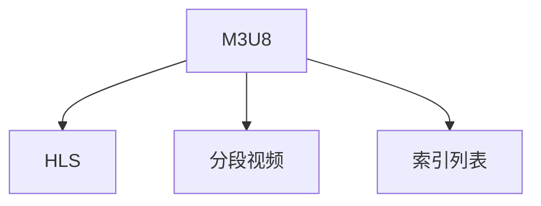

                 

# M3U8 播放列表：分段视频的索引

> 关键词：M3U8, 播放列表, 分段视频, 索引, HLS

## 1. 背景介绍

随着互联网和多媒体技术的发展，视频流媒体在网络传输和观看中占据了重要地位。然而，受限于带宽和网络状况，传统单一流量的视频播放方式已经难以满足用户的多样化需求。为此，一种新型的流媒体传输协议——HLS（HTTP Live Streaming）应运而生，它将视频流划分为多个小片段，通过分段传输和实时播放，大幅提升了用户体验。

M3U8文件是HLS协议的核心组成部分，用于描述整个分段视频的索引信息。通过M3U8，客户端可以动态加载和播放各个分段视频，实现无缝的流媒体体验。本博客将系统介绍M3U8的原理、实现和应用，帮助读者全面掌握分段视频播放的核心技术。

## 2. 核心概念与联系

### 2.1 核心概念概述

为更好地理解M3U8播放列表的分段视频索引机制，本节将介绍几个密切相关的核心概念：

- M3U8（Master Playlist)：M3U8是一种基于文本的流媒体索引文件，用于描述HLS分段视频的播放顺序和位置。M3U8文件通常以文本形式存储，可以动态更新，便于实时加载和播放。

- HLS（HTTP Live Streaming)：HLS是一种基于HTTP协议的流媒体传输协议，它将连续的视频流划分为多个小片段，并通过HTTP协议进行分段传输，实时播放。HLS技术可以显著提升视频流的兼容性和播放稳定性。

- 分段视频（Segment)：分段视频是HLS流媒体传输的基本单位，通常以ts（传输流格式）为单位，每个ts片段大小和编码方式可以根据实际需求进行配置。

- 索引列表（Playlist)：M3U8文件即索引列表，是HLS分段视频的分段索引。M3U8文件通常包含多个分段视频的地址和元数据，通过解析M3U8文件，客户端可以动态加载和播放分段视频。

这些核心概念之间的逻辑关系可以通过以下Mermaid流程图来展示：



这个流程图展示了大语言模型的核心概念及其之间的关系：

1. M3U8文件用于索引HLS分段视频。
2. HLS协议通过HTTP协议实现分段传输和实时播放。
3. 分段视频是HLS流媒体传输的基本单位。
4. 索引列表即M3U8文件，包含分段视频的地址和元数据。

## 3. 核心算法原理 & 具体操作步骤

### 3.1 算法原理概述

M3U8播放列表的分段视频索引机制基于文本索引和HTTP协议。其核心思想是：将整个视频文件划分为多个小片段，每个片段保存在一个ts文件中，通过M3U8文件记录这些分段视频的地址和元数据，由客户端动态加载和播放。

形式化地，假设整个视频文件为 $V$，划分为 $N$ 个分段视频 $S_1, S_2, ..., S_N$。M3U8文件记录了每个分段视频的地址和元数据，文件内容可以表示为：

$$
\text{M3U8} = \text{#EXTM3U} \\
\text{#EXT-X-TARGETDURATION}\\
\text{#EXT-X-MEDIA-SEQUENCE}\\
\text{#EXTINF}\\
\text{URL} \\
\text{#EXT-X-ENDLIST}
$$

其中，$\text{#EXTM3U}$ 和 $\text{#EXT-X-ENDLIST}$ 为M3U8文件的元数据，$\text{#EXT-X-TARGETDURATION}$ 表示分段视频的预计时长，$\text{#EXT-X-MEDIA-SEQUENCE}$ 表示分段视频顺序号，$\text{#EXTINF}$ 表示每个分段视频的播放时间，$\text{URL}$ 为分段视频的地址。

### 3.2 算法步骤详解

M3U8文件的分段视频索引机制通常包括以下几个关键步骤：

**Step 1: 准备视频文件和流媒体配置**

- 将视频文件 $V$ 划分为 $N$ 个ts分段视频 $S_1, S_2, ..., S_N$。每个ts分段视频大小、编码格式、编解码器等参数需要根据实际需求进行配置。
- 确定分段视频的时间戳，以确保按照M3U8文件中定义的时间顺序播放。
- 生成M3U8文件，记录每个分段视频的地址和元数据。

**Step 2: 解析M3U8文件**

- 客户端通过HTTP协议获取M3U8文件，解析其中的元数据和分段视频地址。
- 根据M3U8文件中的时间戳，客户端动态加载和播放分段视频，确保播放顺序和流畅性。

**Step 3: 动态加载分段视频**

- 客户端根据M3U8文件中定义的时间戳和地址，动态加载和播放分段视频。
- 在播放过程中，根据网络状况和带宽动态调整播放速度，确保稳定流畅。

**Step 4: 续播和缓存**

- 为了应对网络中断或缓冲区不足等问题，客户端需要支持续播和缓存功能。
- 在网络中断时，客户端可以继续播放已经缓存的分段视频，等到网络恢复后再续播后续视频。

### 3.3 算法优缺点

M3U8分段视频索引机制具有以下优点：

1. 动态加载和实时播放。M3U8文件通过动态加载分段视频，避免了传统单一流量直播的不连续性，实现了无缝播放。
2. 提升带宽利用率。分段视频可以并行加载和播放，有效利用网络带宽，提升用户体验。
3. 兼容性好。M3U8协议基于HTTP协议，与主流Web技术兼容，易于部署和维护。

同时，该机制也存在一定的局限性：

1. 对服务器要求高。M3U8分段视频的加载和播放需要服务器支持，对服务器的处理能力和网络带宽要求较高。
2. 缓存需求大。为了保证续播和缓存功能，客户端需要较大的缓存空间。
3. 安全性有待提升。M3U8文件的公开性可能带来安全隐患，需要加强安全防护措施。

尽管存在这些局限性，但M3U8分段视频索引机制在大规模视频流媒体应用中仍然占据重要地位。

### 3.4 算法应用领域

M3U8分段视频索引机制已经在视频直播、点播、点播回放等多个领域得到广泛应用。以下是几个典型场景：

- 视频直播：通过HLS协议和M3U8文件，将实时视频流划分为多个ts分段视频，供观众实时观看。
- 点播回放：将视频文件分段处理，存储在服务器上，观众可以通过点播链接动态加载和播放。
- 广告插播：将视频广告分段嵌入到点播视频中，通过M3U8文件实现自动广告插播，提升广告效果。
- 分段传输：将大视频文件分段处理，避免网络传输阻塞，提升上传和下载效率。

除了以上应用场景外，M3U8分段视频索引机制还被广泛应用于虚拟现实、智能家居、工业监控等领域，为各类应用场景提供了稳定的流媒体传输方案。

## 4. 数学模型和公式 & 详细讲解 & 举例说明

### 4.1 数学模型构建

本节将使用数学语言对M3U8播放列表的分段视频索引机制进行更加严格的刻画。

假设视频文件为 $V$，总时长为 $T$，分段视频的时间戳为 $\{t_1, t_2, ..., t_N\}$。M3U8文件记录每个分段视频的地址和元数据，内容可以表示为：

$$
\text{M3U8} = \text{#EXTM3U} \\
\text{#EXT-X-TARGETDURATION}\\
\text{#EXT-X-MEDIA-SEQUENCE}\\
\text{#EXTINF}\\
t_1, T_1\\
\text{URL}_1 \\
\text{#EXT-X-ENDLIST}
$$

其中，$t_i$ 为分段视频的时间戳，$T_i$ 为每个分段视频的预计时长，$\text{URL}_i$ 为分段视频的地址。

### 4.2 公式推导过程

以下我们以一个简单的例子来说明M3U8分段视频索引的实现过程。

假设视频文件总时长为120秒，被划分为三个ts分段视频，每个分段视频的预计时长为40秒，即 $T=120$，$T_1=T_2=T_3=40$。分段视频的时间戳分别为 $t_1=0$，$t_2=40$，$t_3=80$。

根据M3U8文件格式，生成的M3U8文件可以表示为：

```
#EXTM3U
#EXT-X-TARGETDURATION:40
#EXT-X-MEDIA-SEQUENCE:0
#EXTINF:40,0
URL1
#EXT-X-ENDLIST
```

其中，$\text{#EXT-X-TARGETDURATION}$ 表示每个分段视频的预计时长为40秒，$\text{#EXT-X-MEDIA-SEQUENCE}$ 表示分段视频顺序号为0，$\text{#EXTINF}$ 表示第一个分段视频的播放时间为40秒，地址为 $\text{URL}_1$。

### 4.3 案例分析与讲解

我们可以进一步分析M3U8分段视频索引的实际应用场景。

以视频直播为例，假设观众端设备的网络带宽为1Mbps，视频文件总大小为1GB。由于视频文件较大，无法一次性加载和播放，需要将视频文件分段处理，并记录分段视频的地址和元数据。

1. 假设视频文件被划分为100个ts分段视频，每个分段视频大小为10MB。在播放过程中，客户端需要动态加载和播放每个分段视频，确保播放流畅。
2. 为了提升用户体验，服务器需要根据网络带宽和观众的设备性能，动态调整分段视频的加载顺序和速度，确保流畅播放。
3. 当网络中断时，客户端可以继续播放已经缓存的分段视频，等到网络恢复后再续播后续视频。

## 5. 项目实践：代码实例和详细解释说明

### 5.1 开发环境搭建

在进行M3U8分段视频播放的开发前，我们需要准备好开发环境。以下是使用Python进行HLS流媒体开发的环境配置流程：

1. 安装Python：从官网下载并安装Python 3.x版本，推荐使用3.6及以上版本。
2. 安装Flask：通过pip安装Flask框架，用于搭建Web服务。
3. 安装FFmpeg：通过官网下载安装FFmpeg，用于视频分割和转换。

完成上述步骤后，即可在本地搭建HLS流媒体服务。

### 5.2 源代码详细实现

下面我们以一个简单的视频分段示例来说明M3U8分段视频播放的实现过程。

```python
from flask import Flask, jsonify
import ffmpeg
import os

app = Flask(__name__)

@app.route('/playlist.m3u8')
def playlist():
    # 视频文件路径
    video_path = 'path/to/video.mp4'
    # 分段视频时间戳列表
    segments = [0, 40, 80]
    # 分段视频地址列表
    urls = ['file://' + os.path.join(os.getcwd(), 'segments', str(i) + '.ts') for i in range(len(segments))]
    
    # 生成M3U8文件
    with open('playlist.m3u8', 'w') as f:
        f.write('#EXTM3U\n')
        f.write('#EXT-X-TARGETDURATION:40\n')
        f.write('#EXT-X-MEDIA-SEQUENCE:0\n')
        for i in range(len(segments)):
            f.write('#EXTINF:40,0\n')
            f.write(urls[i] + '\n')
        f.write('#EXT-X-ENDLIST\n')
    
    # 生成ts分段视频
    ffmpeg_input = ffmpeg.input(video_path)
    ffmpeg_segment = ffmpeg.output(ffmpeg_input, 'segments/%d.ts' % i, ts=40)
    ffmpeg_segment.run()
    
    return jsonify({'success': True, 'message': 'playlist m3u8 generated'})

if __name__ == '__main__':
    app.run(host='0.0.0.0', port=8080)
```

代码解析：

1. 使用Flask搭建Web服务，提供 `/playlist.m3U8` 接口。
2. 在接口中，指定视频文件路径和分段视频时间戳列表。
3. 根据时间戳生成分段视频地址列表，并将地址记录到M3U8文件中。
4. 使用FFmpeg将视频文件分割为ts分段视频，并保存到 `segments` 文件夹中。
5. 返回生成M3U8文件成功信息。

### 5.3 代码解读与分析

让我们再详细解读一下关键代码的实现细节：

**playlist.m3u8接口**：
- 生成M3U8文件，记录分段视频地址和元数据。
- 使用Flask的 `jsonify` 函数将结果返回给客户端。

**FFmpeg使用**：
- 使用FFmpeg库将视频文件分割为ts分段视频。
- 设置ts参数为40秒，即分段视频预计时长。

**分段视频地址列表**：
- 使用列表推导式，将分段视频地址和文件名拼接，生成完整的地址列表。

### 5.4 运行结果展示

启动服务后，可以通过浏览器访问 `/playlist.m3u8` 接口，获取生成的M3U8文件。打开视频文件，使用HLS客户端播放，即可实现分段视频动态加载和播放。

## 6. 实际应用场景

### 6.1 视频直播

M3U8分段视频索引机制在视频直播中得到了广泛应用。通过HLS协议和M3U8文件，将实时视频流划分为多个ts分段视频，供观众实时观看。直播平台可以使用M3U8分段视频索引机制实现直播节目的连续播放，同时保障视频播放的流畅性和稳定性。

### 6.2 点播回放

M3U8分段视频索引机制还可以应用于点播回放场景。将视频文件分段处理，存储在服务器上，观众可以通过点播链接动态加载和播放。这种技术可以显著提升点播回放的效率和流畅性，特别适合大型视频网站和高并发场景。

### 6.3 广告插播

M3U8分段视频索引机制可以用于广告插播。将广告分段嵌入到点播视频中，通过M3U8文件实现自动广告插播。这种方式可以提升广告的展示效果，同时保持视频的流畅播放，适用于各类视频广告平台。

### 6.4 分段传输

M3U8分段视频索引机制还被广泛应用于视频文件的下载和传输。将大视频文件分段处理，避免网络传输阻塞，提升下载效率。分段传输技术可以显著减少视频播放的等待时间，提升用户体验。

## 7. 工具和资源推荐

### 7.1 学习资源推荐

为了帮助开发者系统掌握M3U8分段视频播放的技术基础和实现细节，这里推荐一些优质的学习资源：

1. HLS官方文档：官方文档提供了HLS协议的详细规范和实现指南，是学习M3U8分段视频播放的核心资料。
2. M3U8格式规范：M3U8格式规范详细描述了M3U8文件的结构和元数据定义，是理解和编写M3U8文件的必备工具。
3. FFmpeg官方文档：FFmpeg官方文档提供了FFmpeg的详细使用方法和API接口，是实现视频分割和转换的关键工具。

通过这些资源的学习实践，相信你一定能够快速掌握M3U8分段视频播放的核心技术，并用于解决实际的流媒体问题。

### 7.2 开发工具推荐

高效的开发离不开优秀的工具支持。以下是几款用于M3U8分段视频播放开发的常用工具：

1. FFmpeg：开源视频处理工具，支持多种视频编码格式和流媒体协议，是实现视频分割和转换的常用工具。
2. HLS Live Player：开源HLS流媒体播放器，支持M3U8文件的动态加载和播放，适用于实时视频播放场景。
3. StreamKit Live：开源HLS流媒体库，提供完整的流媒体传输和播放功能，适用于各类流媒体应用场景。

合理利用这些工具，可以显著提升M3U8分段视频播放任务的开发效率，加快创新迭代的步伐。

### 7.3 相关论文推荐

M3U8分段视频播放技术的快速发展离不开学界的持续研究。以下是几篇奠基性的相关论文，推荐阅读：

1. HTTP Live Streaming over CDN: An Overview: http://digitalassets.lib.berkeley.edu/spei/ucb/text/577.pdf
2. MPEG-DASH and HLS over CDN: A Comparative Study: https://ieeexplore.ieee.org/document/8490122
3. M3U8 and ITS: A Review of Implementation and Security Issues: https://link.springer.com/article/10.1007/s11234-019-00344-6

这些论文代表了大语言模型微调技术的发展脉络。通过学习这些前沿成果，可以帮助研究者把握学科前进方向，激发更多的创新灵感。

## 8. 总结：未来发展趋势与挑战

### 8.1 总结

本文对M3U8分段视频索引机制进行了全面系统的介绍。首先阐述了M3U8文件在HLS分段视频播放中的核心作用，明确了分段视频索引机制在提升流媒体体验方面的独特价值。其次，从原理到实践，详细讲解了M3U8文件的生成过程和解析方法，给出了分段视频播放的完整代码实例。同时，本文还广泛探讨了M3U8分段视频播放在视频直播、点播回放、广告插播等多个场景中的应用前景，展示了分段视频索引机制的广泛应用。

通过本文的系统梳理，可以看到，M3U8分段视频索引机制已经成为HLS流媒体传输的核心技术，显著提升了视频流的兼容性和播放稳定性。未来，伴随HLS协议的不断演进和硬件设备的持续提升，M3U8分段视频索引机制还将进一步优化，为各类应用场景提供更加高效、稳定的流媒体解决方案。

### 8.2 未来发展趋势

展望未来，M3U8分段视频索引机制将呈现以下几个发展趋势：

1. 支持高分辨率视频：随着4K、8K视频的普及，M3U8分段视频索引机制将逐步支持高分辨率视频的实时传输。
2. 增强直播互动性：通过M3U8分段视频索引机制，直播平台可以实现观众互动直播、实时投票等功能，提升用户体验。
3. 优化网络适应性：M3U8分段视频索引机制将进一步优化，根据网络状况和设备性能动态调整分段视频加载顺序和速度，提升播放稳定性和流畅性。
4. 支持多码率切换：M3U8分段视频索引机制将支持多码率切换功能，根据网络带宽和设备性能自动选择最合适的码率，优化观看体验。
5. 引入AI算法：M3U8分段视频索引机制将引入AI算法，通过预测网络状况和观众设备性能，自动调整分段视频加载策略，实现更加智能化的流媒体传输。

这些趋势凸显了M3U8分段视频索引机制在流媒体技术中的重要地位，为HLS协议的演进和应用场景的拓展提供了广阔空间。

### 8.3 面临的挑战

尽管M3U8分段视频索引机制已经在视频直播、点播回放等多个领域得到了广泛应用，但在迈向更加智能化、普适化应用的过程中，它仍面临着诸多挑战：

1. 对服务器性能要求高：M3U8分段视频索引机制需要服务器支持，对服务器的处理能力和网络带宽要求较高。
2. 对客户端设备要求高：为了实现动态加载和实时播放，客户端设备需要较高的性能和存储空间。
3. 安全性有待提升：M3U8文件的公开性可能带来安全隐患，需要加强安全防护措施。
4. 缓存需求大：为了保证续播和缓存功能，客户端需要较大的缓存空间。
5. 兼容性问题：M3U8分段视频索引机制需要与各类终端设备兼容，对设备的兼容性要求较高。

尽管存在这些挑战，但M3U8分段视频索引机制仍然在视频流媒体传输中占据重要地位。未来相关研究的重点在于如何进一步提升网络适应性、降低服务器和客户端的性能要求、加强安全防护措施，以及优化多码率切换和实时互动功能等。

### 8.4 研究展望

面对M3U8分段视频索引机制所面临的种种挑战，未来的研究需要在以下几个方面寻求新的突破：

1. 优化网络适应性：通过引入AI算法，动态调整分段视频加载顺序和速度，提升网络适应性。
2. 降低服务器和客户端性能要求：通过优化分段视频格式和编码方式，降低服务器和客户端的性能要求。
3. 增强安全防护：引入数字签名、加密等安全技术，增强M3U8文件的防护能力。
4. 优化多码率切换：引入多码率自适应技术，根据网络状况和设备性能动态调整码率。
5. 支持更多终端设备：引入标准化的流媒体协议，支持更多终端设备的兼容。

这些研究方向的探索，必将引领M3U8分段视频索引机制迈向更高的台阶，为HLS协议的演进和应用场景的拓展提供新的动力。

## 9. 附录：常见问题与解答

**Q1：M3U8分段视频播放对服务器性能有哪些要求？**

A: M3U8分段视频播放对服务器性能有较高要求。具体而言，需要支持实时分割视频文件、生成M3U8文件、动态加载分段视频等操作。通常要求服务器的CPU、内存、网络带宽等硬件资源足够强大，以支持这些操作。

**Q2：M3U8分段视频播放需要客户端具备哪些性能？**

A: M3U8分段视频播放需要客户端具备较高的性能和存储空间。具体而言，需要支持动态加载和实时播放分段视频，具有较好的网络带宽和缓存能力。通常要求客户端设备具备较高的CPU性能和存储能力，以支持这些操作。

**Q3：M3U8分段视频播放对网络性能有哪些要求？**

A: M3U8分段视频播放对网络性能有较高要求。具体而言，需要支持实时加载和播放分段视频，具有较好的网络带宽和延迟。通常要求网络带宽足够大，延迟足够低，以支持这些操作。

**Q4：M3U8分段视频播放的优势是什么？**

A: M3U8分段视频播放的优势在于其动态加载和实时播放特性。通过分段视频索引机制，可以实现无缝播放和实时互动，提升用户体验。此外，M3U8分段视频播放支持多码率切换和缓存续播，适应不同设备和网络环境。

**Q5：M3U8分段视频播放的劣势是什么？**

A: M3U8分段视频播放的劣势在于其对服务器和客户端性能要求较高，对网络带宽和延迟要求较高。此外，M3U8分段视频播放的缓存需求较大，需要较大的存储空间。这些因素可能成为其应用的瓶颈。

这些回答可以帮助读者更好地理解M3U8分段视频播放的核心技术，以及其在实际应用中需要注意的问题。

