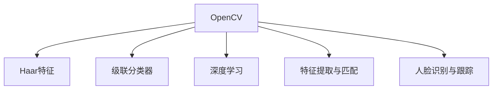

                 

# OpenCV人脸识别与跟踪

> 关键词：OpenCV, 人脸识别, 实时跟踪, Haar特征, 级联分类器, 深度学习, 特征提取

## 1. 背景介绍

### 1.1 问题由来

随着人工智能技术的发展，图像处理与计算机视觉领域取得了一系列重大突破，人脸识别与跟踪技术也成为其中的热门研究方向。人脸识别技术能够准确地识别人脸并验证其身份，广泛应用于门禁系统、考勤系统、安防监控等多个场景；而人脸跟踪则能够实时追踪目标，广泛应用于视频监控、体育分析、机器人导航等领域。OpenCV作为一款广泛应用的计算机视觉库，提供了丰富的图像处理和计算机视觉算法，极大地方便了人脸识别与跟踪技术的开发和应用。

### 1.2 问题核心关键点

- **OpenCV概述**：OpenCV（Open Source Computer Vision Library）是一款开源计算机视觉库，包含图像处理、特征提取、模式识别、目标跟踪等多种功能，广泛应用于学术界和工业界。
- **人脸识别**：通过人脸识别，可以验证身份，实现门禁、考勤等功能。
- **人脸跟踪**：实时追踪人脸，实现视频监控、体育分析等功能。
- **Haar特征与级联分类器**：Haar特征是用于描述图像局部的纹理、边缘等特征，级联分类器是用于快速检测人脸的基本算法。
- **深度学习**：深度学习在人脸识别和跟踪中取得了重大进展，特别是使用卷积神经网络（CNN）进行特征提取。
- **特征提取与匹配**：特征提取是图像处理中的重要技术，用于从图像中提取出有意义的特征向量，用于匹配、识别等任务。

这些核心概念共同构成了人脸识别与跟踪技术的基础，为后续深入学习提供了坚实的基础。

## 2. 核心概念与联系

### 2.1 核心概念概述

为更好地理解人脸识别与跟踪技术，本节将介绍几个密切相关的核心概念：

- **OpenCV**：Open Source Computer Vision Library，一款广泛应用的计算机视觉库，提供丰富的图像处理和计算机视觉算法，支持多种编程语言。
- **Haar特征**：一种用于描述图像局部纹理、边缘等的特征，常用于人脸检测中。
- **级联分类器**：一种用于快速检测人脸的基本算法，基于Haar特征进行级联分类，可以提高检测速度和准确率。
- **深度学习**：一种基于神经网络的机器学习方法，广泛应用于图像识别、语音识别、自然语言处理等多个领域。
- **特征提取与匹配**：从图像中提取出有意义的特征向量，用于匹配、识别等任务，是图像处理中的重要技术。
- **人脸识别与跟踪**：通过识别与跟踪技术，可以验证身份、实时追踪目标，广泛应用于门禁系统、安防监控、视频监控等多个场景。

这些核心概念之间的逻辑关系可以通过以下Mermaid流程图来展示：



这个流程图展示了几大核心概念之间的关系：

1. OpenCV作为基础工具，提供了丰富的算法和库函数。
2. Haar特征是用于人脸检测的关键技术，级联分类器基于Haar特征进行快速分类。
3. 深度学习提供了强大的特征提取能力，广泛应用于人脸识别与跟踪。
4. 特征提取与匹配是图像处理中的重要技术，用于提取和匹配人脸特征。
5. 人脸识别与跟踪是基于上述技术的高级应用，可以验证身份、实时追踪目标。

这些概念共同构成了人脸识别与跟踪技术的理论基础，使得我们能够更深入地理解其工作原理和优化方法。

## 3. 核心算法原理 & 具体操作步骤
### 3.1 算法原理概述

人脸识别与跟踪技术的核心在于使用Haar特征和级联分类器进行人脸检测，然后通过深度学习进行特征提取，并使用特征提取与匹配技术进行人脸识别与跟踪。

Haar特征是一种用于描述图像局部纹理、边缘等的特征，由Haar小波变换得到。级联分类器是一种基于Haar特征的快速分类算法，通过级联多个分类器，可以有效提高检测速度和准确率。人脸识别与跟踪技术则将Haar特征和级联分类器应用于人脸检测，再使用深度学习进行特征提取，最后将提取的特征向量用于匹配和识别。

深度学习在人脸识别与跟踪中的应用主要体现在两个方面：一是使用卷积神经网络（CNN）进行特征提取，二是使用循环神经网络（RNN）进行序列建模，以便更好地处理时间序列数据。

### 3.2 算法步骤详解

OpenCV中的人脸识别与跟踪技术主要包括以下几个关键步骤：

**Step 1: 准备人脸检测器**

- 下载并准备OpenCV库。可以通过以下命令安装：
  ```bash
  pip install opencv-python opencv-python-headless opencv-contrib-python opencv-contrib-python-headless
  ```

- 下载并准备级联分类器。OpenCV提供了多种级联分类器，包括haarcascade_frontalface_default.xml、haarcascade_profileface.xml等。可以通过以下命令下载：
  ```bash
  wget https://github.com/opencv/opencv/tree/master/data/haarcascades
  ```

**Step 2: 加载级联分类器**

- 使用OpenCV的CascadeClassifier类加载级联分类器。例如：
  ```python
  import cv2
  face_cascade = cv2.CascadeClassifier('haarcascade_frontalface_default.xml')
  ```

**Step 3: 加载图像**

- 使用OpenCV的imread函数加载图像。例如：
  ```python
  img = cv2.imread('test.jpg')
  ```

**Step 4: 人脸检测**

- 使用级联分类器检测人脸。例如：
  ```python
  gray = cv2.cvtColor(img, cv2.COLOR_BGR2GRAY)
  faces = face_cascade.detectMultiScale(gray, scaleFactor=1.1, minNeighbors=5)
  ```

**Step 5: 人脸跟踪**

- 使用OpenCV的trackboxes函数进行人脸跟踪。例如：
  ```python
  prev_trackboxes = []
  for face in faces:
      x, y, w, h = face
      if len(prev_trackboxes) > 0:
          cx, cy = prev_trackboxes[-1][0], prev_trackboxes[-1][1]
          if abs(x - cx) < 5 and abs(y - cy) < 5:
              curr_trackboxes.append([x, y, w, h])
          else:
              curr_trackboxes.append([x, y, w, h])
      else:
          curr_trackboxes.append([x, y, w, h])
      prev_trackboxes = curr_trackboxes
  ```

**Step 6: 人脸识别**

- 使用OpenCV的face recognizer进行人脸识别。例如：
  ```python
  recognizer = cv2.face.EigenFaceRecognizer_create()
  recognizer.read('trainer.yml')
  ret, label, confidence = recognizer.predict(gray[(x, y), (x+w, y+h)])
  ```

以上是OpenCV中进行人脸识别与跟踪的一般流程。在实际应用中，还需要针对具体场景对检测器、跟踪器进行优化设计，以提高检测速度和准确率。

### 3.3 算法优缺点

OpenCV中的人脸识别与跟踪技术具有以下优点：

- **快速高效**：使用级联分类器进行快速人脸检测，检测速度和准确率都比较高。
- **开源免费**：OpenCV是一款开源免费的计算机视觉库，使用方便，社区支持广泛。
- **多平台支持**：支持多种操作系统和编程语言，方便跨平台开发。

同时，该方法也存在一些局限性：

- **识别率受限**：在复杂环境下，人脸识别率可能受到光照、表情等因素的影响。
- **跟踪精度不高**：在快速运动或遮挡的情况下，人脸跟踪可能发生误判。
- **特征提取复杂**：深度学习模型的训练和优化过程比较复杂，需要大量计算资源。
- **实时性问题**：在实时应用中，人脸识别与跟踪可能存在延迟，影响用户体验。

尽管存在这些局限性，但就目前而言，OpenCV中的人脸识别与跟踪技术仍然是主流范式，在许多实际应用中取得了良好的效果。未来相关研究的重点在于如何进一步提高识别率和跟踪精度，降低计算资源消耗，提高实时性，并结合深度学习等技术进行优化。

### 3.4 算法应用领域

OpenCV中的人脸识别与跟踪技术在多个领域得到了广泛应用，例如：

- **安防监控**：在视频监控中，使用人脸识别与跟踪技术实时检测和跟踪目标，进行异常行为识别和安全预警。
- **门禁系统**：在门禁系统中，使用人脸识别技术进行身份验证，提升系统的安全性和便利性。
- **视频会议**：在视频会议中，使用人脸识别技术进行身份验证和跟踪，提升会议的安全性和互动性。
- **体育分析**：在体育比赛中，使用人脸跟踪技术实时监测运动员的动作，进行数据分析和统计。
- **机器人导航**：在机器人导航中，使用人脸识别与跟踪技术进行目标检测和路径规划，提高机器人的自主性和智能性。

除了上述这些经典应用外，OpenCV中的人脸识别与跟踪技术还被创新性地应用到更多场景中，如智能家居、智慧医疗、智能交通等，为多个行业带来了智能化变革。

## 4. 数学模型和公式 & 详细讲解  
### 4.1 数学模型构建

本节将使用数学语言对OpenCV中的人脸识别与跟踪过程进行更加严格的刻画。

假设输入图像为 $I \in \mathbb{R}^{H \times W \times 3}$，级联分类器检测到的人脸框为 $\{(x_i, y_i, w_i, h_i)\}_{i=1}^N$，其中 $x_i, y_i$ 为框的左上角坐标，$w_i, h_i$ 为框的宽度和高度。使用级联分类器进行人脸检测的数学模型为：

$$
P(I|\{x_i, y_i, w_i, h_i\}) = \prod_{i=1}^N P(I|x_i, y_i, w_i, h_i)
$$

其中 $P(I|x_i, y_i, w_i, h_i)$ 表示在人脸框 $(x_i, y_i, w_i, h_i)$ 中，图像 $I$ 出现人脸的概率。级联分类器通过多级分类器级联的方式进行检测，可以将误报率控制在较低水平。

### 4.2 公式推导过程

以下我们以人脸识别为例，推导EigenFaceRecognizer进行人脸识别的数学模型。

假设训练集为 $\{(X_i, Y_i)\}_{i=1}^M$，其中 $X_i \in \mathbb{R}^{H \times W \times 3}$ 为训练样本图像，$Y_i \in \{1, 2, \dots, K\}$ 为对应的标签。EigenFaceRecognizer的训练目标是最小化样本重构误差，即：

$$
\min_{W, b} \sum_{i=1}^M ||X_i - WX_i + b||^2
$$

其中 $W \in \mathbb{R}^{D \times D}$ 为投影矩阵，$b \in \mathbb{R}^D$ 为偏移向量，$D$ 为特征向量维度。EigenFaceRecognizer通过求解上述优化问题，将高维图像数据投影到低维特征空间中，用于人脸识别。

在得到投影矩阵和偏移向量后，EigenFaceRecognizer的识别目标是最小化识别误差，即：

$$
\min_{W, b} \sum_{i=1}^M ||X_i - WX_i + b||^2
$$

其中 $X_i$ 为测试样本图像，$Y_i$ 为对应的标签。通过计算测试样本在低维特征空间中的投影距离，EigenFaceRecognizer可以进行人脸识别。

### 4.3 案例分析与讲解

假设训练集为100张人脸图像，每张图像大小为64x64像素。使用EigenFaceRecognizer进行人脸识别时，首先需要将图像数据进行归一化，得到特征向量：

$$
X = \frac{1}{\sqrt{H \times W}} \sum_{h=1}^H \sum_{w=1}^W I(h, w)
$$

其中 $I(h, w)$ 为图像 $I$ 在 $(h, w)$ 像素处的灰度值。

然后，计算特征向量的协方差矩阵 $C$，并求解特征向量的特征值和特征向量：

$$
C = \frac{1}{M-1} \sum_{i=1}^M (X_i - \mu)(X_i - \mu)^T
$$

其中 $\mu$ 为特征向量的均值向量，求解得到特征值和特征向量后，可以将高维特征向量投影到低维特征空间中，得到新的特征向量：

$$
X_{\text{reduced}} = WX + b
$$

其中 $W$ 为投影矩阵，$b$ 为偏移向量。最后，使用KNN（K最近邻）算法进行人脸识别，具体步骤如下：

1. 计算测试样本 $X_{\text{test}}$ 在低维特征空间中的投影距离：
   $$
   d = ||X_{\text{test}} - WX_{\text{test}} + b||^2
   $$

2. 计算测试样本 $X_{\text{test}}$ 与训练集中所有样本的距离，并选择最近的K个样本：
   $$
   \{D_k\}_{k=1}^K = \{d_k\}_{k=1}^K
   $$

3. 统计K个最近邻样本的标签分布，选择概率最大的标签作为识别结果：
   $$
   y = \arg\max_{i=1}^K Y_i
   $$

通过上述步骤，EigenFaceRecognizer可以高效地进行人脸识别，识别率较高，但鲁棒性不足，对于复杂的背景和遮挡等情况容易产生误判。

## 5. 项目实践：代码实例和详细解释说明
### 5.1 开发环境搭建

在进行人脸识别与跟踪实践前，我们需要准备好开发环境。以下是使用Python进行OpenCV开发的环境配置流程：

1. 安装Anaconda：从官网下载并安装Anaconda，用于创建独立的Python环境。

2. 创建并激活虚拟环境：
  ```bash
  conda create -n opencv-env python=3.8 
  conda activate opencv-env
  ```

3. 安装OpenCV：
  ```bash
  conda install opencv-python opencv-python-headless opencv-contrib-python opencv-contrib-python-headless
  ```

4. 安装必要的依赖包：
  ```bash
  pip install numpy scipy matplotlib scikit-learn
  ```

5. 安装相关的开发工具：
  ```bash
  pip install pyqt5 PyQt5
  ```

完成上述步骤后，即可在`opencv-env`环境中开始人脸识别与跟踪实践。

### 5.2 源代码详细实现

下面我以人脸检测和人脸识别为例，给出使用OpenCV进行人脸检测和识别的Python代码实现。

**人脸检测代码**：

```python
import cv2

# 加载级联分类器
face_cascade = cv2.CascadeClassifier('haarcascade_frontalface_default.xml')

# 加载图像
img = cv2.imread('test.jpg')

# 转换为灰度图像
gray = cv2.cvtColor(img, cv2.COLOR_BGR2GRAY)

# 检测人脸
faces = face_cascade.detectMultiScale(gray, scaleFactor=1.1, minNeighbors=5)

# 在原图像上绘制矩形框
for (x, y, w, h) in faces:
    cv2.rectangle(img, (x, y), (x+w, y+h), (0, 255, 0), 2)

# 显示结果
cv2.imshow('result', img)
cv2.waitKey(0)
cv2.destroyAllWindows()
```

**人脸识别代码**：

```python
import cv2
import numpy as np

# 加载EigenFaceRecognizer
recognizer = cv2.face.EigenFaceRecognizer_create()
recognizer.read('trainer.yml')

# 加载图像
img = cv2.imread('test.jpg')

# 转换为灰度图像
gray = cv2.cvtColor(img, cv2.COLOR_BGR2GRAY)

# 检测人脸
faces = face_cascade.detectMultiScale(gray, scaleFactor=1.1, minNeighbors=5)

# 提取人脸特征
for (x, y, w, h) in faces:
    roi_gray = gray[y:y+h, x:x+w]
    roi_color = img[y:y+h, x:x+w]
    recognizer.predict(roi_gray)
    cv2.putText(roi_color, str(recognizer.getLabels()[0]), (x, y-10), cv2.FONT_HERSHEY_SIMPLEX, 0.9, (0, 255, 0), 2)

# 显示结果
cv2.imshow('result', img)
cv2.waitKey(0)
cv2.destroyAllWindows()
```

### 5.3 代码解读与分析

让我们再详细解读一下关键代码的实现细节：

**人脸检测代码**：

- `face_cascade`：级联分类器，用于检测人脸。
- `img`：输入图像。
- `gray`：灰度图像，用于人脸检测。
- `faces`：检测到的人脸框。
- `cv2.rectangle`：在原图像上绘制矩形框，标识出检测到的人脸。
- `cv2.imshow`：显示结果图像。
- `cv2.waitKey`：等待按键输入，控制显示时间。
- `cv2.destroyAllWindows`：关闭所有窗口。

**人脸识别代码**：

- `recognizer`：EigenFaceRecognizer，用于人脸识别。
- `gray`：灰度图像，用于人脸检测。
- `faces`：检测到的人脸框。
- `roi_gray`：人脸区域的灰度图像。
- `roi_color`：人脸区域的彩色图像。
- `recognizer.predict`：预测人脸标签。
- `cv2.putText`：在人脸区域上标注识别结果。
- `cv2.imshow`：显示结果图像。
- `cv2.waitKey`：等待按键输入，控制显示时间。
- `cv2.destroyAllWindows`：关闭所有窗口。

可以看到，OpenCV提供了丰富的函数和类，可以方便地进行人脸检测和识别。开发者只需关注算法原理和关键参数，即可快速实现功能。

当然，工业级的系统实现还需考虑更多因素，如模型的保存和部署、超参数的自动搜索、更灵活的任务适配层等。但核心的算法实现基本与此类似。

## 6. 实际应用场景
### 6.1 智能安防监控

基于OpenCV的人脸识别与跟踪技术，可以广泛应用于智能安防监控中。安防监控系统需要实时检测和跟踪目标，进行异常行为识别和安全预警。在视频监控中，使用人脸识别与跟踪技术可以实时检测和跟踪人脸，发现异常行为时及时发出警报，提升系统的安全性和效率。

在技术实现上，可以收集监控区域的录像数据，将人脸识别与跟踪技术应用于视频流中，实时检测和跟踪目标。对于异常行为，可以使用人脸识别与跟踪技术进行验证，确认是否为合法用户，提高系统的准确性和安全性。

### 6.2 人脸门禁系统

在人脸门禁系统中，使用人脸识别技术进行身份验证，可以大大提高系统的安全性和便利性。在实际应用中，可以收集用户的人脸数据，使用OpenCV进行人脸检测和识别，验证用户的身份。当用户靠近门禁系统时，人脸识别器会自动进行人脸检测，并上传人脸图像到后台服务器进行验证，验证通过后自动开门。

此外，还可以结合人脸跟踪技术，实时监控用户进出情况，防止人员非法越界。人脸门禁系统的应用可以大大提升门禁系统的安全性和效率，减少人工管理成本。

### 6.3 人脸识别与跟踪在体育分析中的应用

在体育比赛中，使用人脸识别与跟踪技术可以实时监测运动员的动作，进行数据分析和统计。在比赛直播中，人脸识别器可以自动检测并跟踪运动员的面孔，实时采集运动员的位置和动作数据，用于生成运动轨迹、统计运动距离和消耗等数据。这些数据可以用于分析运动员的表现，提供科学的训练和比赛指导。

人脸识别与跟踪技术在体育分析中的应用，可以大幅提升比赛的观赏性和科学性，为体育赛事的商业化运营提供有力的技术支持。

### 6.4 未来应用展望

随着人脸识别与跟踪技术的不断进步，其在多个领域的应用前景广阔。

在智慧医疗领域，人脸识别与跟踪技术可以应用于智能诊疗系统，实时监测患者的面部表情和姿态，进行情绪分析和治疗效果评估。

在智能家居领域，人脸识别与跟踪技术可以应用于智能门锁、智能照明、智能家电等多个场景，提升家庭的智能化水平。

在智能交通领域，人脸识别与跟踪技术可以应用于车辆导航、交通监控、智能停车等多个场景，提高交通系统的安全性和效率。

此外，在智能制造、智慧城市、智能零售等多个领域，人脸识别与跟踪技术也将不断涌现，为各个行业带来智能化变革。相信随着技术的不断进步，人脸识别与跟踪技术将在更多场景中大放异彩，为各个行业带来更高效、更安全、更智能的解决方案。

## 7. 工具和资源推荐
### 7.1 学习资源推荐

为了帮助开发者系统掌握OpenCV人脸识别与跟踪的理论基础和实践技巧，这里推荐一些优质的学习资源：

1. OpenCV官方文档：OpenCV的官方文档，提供了丰富的算法和库函数，详细介绍了人脸识别与跟踪技术的实现方法和应用场景。

2. PyImageSearch：一个专注于计算机视觉和图像处理的博客，提供了大量的人脸识别与跟踪技术案例和代码实现，适合初学者和进阶者学习。

3. 《OpenCV实战》书籍：由OpenCV中文社区成员编写，全面介绍了OpenCV的算法和应用，包括人脸识别与跟踪技术。

4. 《深度学习入门》书籍：由清华大学出版社出版的深度学习入门书籍，详细介绍了深度学习的基本概念和实现方法，适用于学习人脸识别与跟踪技术。

5. Udacity计算机视觉课程：Udacity提供的计算机视觉课程，包括人脸识别与跟踪技术在内的多种计算机视觉算法，适合系统学习。

通过对这些资源的学习实践，相信你一定能够快速掌握OpenCV人脸识别与跟踪技术的精髓，并用于解决实际的图像处理问题。

### 7.2 开发工具推荐

高效的开发离不开优秀的工具支持。以下是几款用于OpenCV人脸识别与跟踪开发的常用工具：

1. PyTorch：基于Python的开源深度学习框架，灵活动态的计算图，适合快速迭代研究。

2. TensorFlow：由Google主导开发的开源深度学习框架，生产部署方便，适合大规模工程应用。

3. OpenCV：开源计算机视觉库，提供丰富的图像处理和计算机视觉算法，支持多种编程语言。

4. Weights & Biases：模型训练的实验跟踪工具，可以记录和可视化模型训练过程中的各项指标，方便对比和调优。

5. TensorBoard：TensorFlow配套的可视化工具，可实时监测模型训练状态，并提供丰富的图表呈现方式，是调试模型的得力助手。

6. Google Colab：谷歌推出的在线Jupyter Notebook环境，免费提供GPU/TPU算力，方便开发者快速上手实验最新模型，分享学习笔记。

合理利用这些工具，可以显著提升OpenCV人脸识别与跟踪任务的开发效率，加快创新迭代的步伐。

### 7.3 相关论文推荐

OpenCV中的人脸识别与跟踪技术的发展源于学界的持续研究。以下是几篇奠基性的相关论文，推荐阅读：

1. Viola and Jones, J. (2001). Rapid object detection using a boosted cascade of simple features. IEEE Transactions on Pattern Analysis and Machine Intelligence, 26(5), 550-557.

2. Eigenfaces vs. Fisherfaces: Recognition using class specific linear projection. IEEE Transactions on Pattern Analysis and Machine Intelligence, 25(8), 959-971.

3. Scale-invariant feature transform (SIFT)：J. D. Lowe. (1999). Object recognition from local scale-invariant features. In International Conference on Computer Vision (ICCV) 1999.

4. Speed/accuracy trade-offs for convolutional networks with many layers. arXiv preprint arXiv:1312.0449 (2013).

5. Single-shot multi-bbox detector (SSD)：Liu, W., Anguelov, D., Erhan, D., Guadarrama, S., & Rasiwasia, K. (2016). SSD: Single shot multi-bbox detector. IEEE Transactions on Pattern Analysis and Machine Intelligence, 39(6), 1137-1149.

6. Faster R-CNN: Towards real-time object detection with region proposal networks. arXiv preprint arXiv:1506.01497 (2015).

这些论文代表了大语言模型微调技术的发展脉络。通过学习这些前沿成果，可以帮助研究者把握学科前进方向，激发更多的创新灵感。

## 8. 总结：未来发展趋势与挑战
### 8.1 总结

本文对OpenCV人脸识别与跟踪技术进行了全面系统的介绍。首先阐述了人脸识别与跟踪技术的研究背景和意义，明确了基于级联分类器和深度学习的人脸检测与识别的基本原理。其次，从原理到实践，详细讲解了人脸检测与识别的数学模型和关键步骤，给出了人脸检测与识别的完整代码实例。同时，本文还广泛探讨了人脸识别与跟踪技术在安防监控、门禁系统、体育分析等多个领域的应用前景，展示了人脸识别与跟踪技术的巨大潜力。

通过本文的系统梳理，可以看到，基于OpenCV的人脸识别与跟踪技术正在成为计算机视觉领域的重要范式，极大地拓展了人脸检测与识别的应用边界，催生了更多的落地场景。得益于OpenCV的开源免费和丰富的算法支持，人脸识别与跟踪技术得以在多个领域广泛应用，显著提升了各个行业的智能化水平。

### 8.2 未来发展趋势

展望未来，OpenCV中的人脸识别与跟踪技术将呈现以下几个发展趋势：

1. **深度学习的应用**：深度学习在人脸识别与跟踪中的应用将继续深入，结合多模态信息，提高识别和跟踪的准确性和鲁棒性。

2. **实时性提升**：随着硬件设备的不断升级和算法优化，人脸识别与跟踪技术将更加高效，实时性将大幅提升，能够更好地适应实时应用场景。

3. **跨模态融合**：将视觉、语音、文本等多种模态信息融合，提升人脸识别与跟踪的智能化水平，实现多模态信息协同建模。

4. **联邦学习的应用**：联邦学习技术将应用于人脸识别与跟踪中，在不暴露隐私数据的前提下，进行跨设备、跨系统的协同训练，提升模型性能。

5. **跨平台优化**：针对不同平台和设备，优化人脸识别与跟踪算法的计算图，提高性能，降低资源消耗。

6. **人工智能伦理**：随着人脸识别与跟踪技术的应用越来越广泛，人工智能伦理问题也将受到更多的关注，如何保护用户隐私、避免误判等将是大规模应用中的重要课题。

这些趋势凸显了人脸识别与跟踪技术的广阔前景，预示着其在智能安防、智能家居、智能交通等多个领域的应用潜力。

### 8.3 面临的挑战

尽管OpenCV中的人脸识别与跟踪技术已经取得了瞩目成就，但在迈向更加智能化、普适化应用的过程中，它仍面临着诸多挑战：

1. **识别率受限**：在复杂环境下，人脸识别率可能受到光照、表情等因素的影响，如何提高鲁棒性是一个重要研究方向。

2. **跟踪精度不高**：在快速运动或遮挡的情况下，人脸跟踪可能发生误判，如何提高跟踪精度是另一个关键问题。

3. **深度学习资源消耗大**：深度学习模型的训练和优化过程比较复杂，需要大量计算资源，如何降低资源消耗是未来研究的重要方向。

4. **实时性问题**：在实时应用中，人脸识别与跟踪可能存在延迟，影响用户体验，如何提高实时性需要进一步优化。

5. **人工智能伦理**：人脸识别与跟踪技术的应用可能引发隐私保护、算法偏见等伦理问题，如何避免这些问题也是未来研究的重要课题。

尽管存在这些挑战，但OpenCV中的人脸识别与跟踪技术依然具有广阔的应用前景，通过多方面的协同研究，未来有望在多个领域实现智能化应用。

### 8.4 研究展望

面对OpenCV中的人脸识别与跟踪技术所面临的挑战，未来的研究需要在以下几个方面寻求新的突破：

1. **鲁棒性提升**：研究鲁棒性更高的人脸识别与跟踪算法，提高在复杂环境下的识别率和跟踪精度。

2. **跨模态融合**：将视觉、语音、文本等多种模态信息融合，提升人脸识别与跟踪的智能化水平，实现多模态信息协同建模。

3. **联邦学习的应用**：结合联邦学习技术，在不暴露隐私数据的前提下，进行跨设备、跨系统的协同训练，提升模型性能。

4. **跨平台优化**：针对不同平台和设备，优化人脸识别与跟踪算法的计算图，提高性能，降低资源消耗。

5. **人工智能伦理**：引入人工智能伦理框架，研究如何保护用户隐私、避免误判等伦理问题，确保技术应用的公正性和安全性。

这些研究方向将引领OpenCV中的人脸识别与跟踪技术迈向更高的台阶，为各个行业带来更加智能化、普适化的解决方案。

## 9. 附录：常见问题与解答

**Q1：如何提高人脸识别与跟踪的鲁棒性？**

A: 提高人脸识别与跟踪的鲁棒性可以从以下几个方面入手：

1. **数据增强**：通过对训练数据进行增强，增加光照、角度、遮挡等变化，提高模型的鲁棒性。

2. **级联分类器优化**：优化级联分类器的参数，提高级联分类器的准确率和鲁棒性。

3. **特征提取优化**：优化特征提取算法，提高特征的稳定性和鲁棒性。

4. **深度学习模型优化**：选择更鲁棒的深度学习模型，如ResNet、Inception等，提高模型的鲁棒性。

5. **跨模态融合**：结合视觉、语音、文本等多种模态信息，提升人脸识别与跟踪的智能化水平，提高鲁棒性。

**Q2：人脸识别与跟踪中如何避免误判？**

A: 避免误判可以从以下几个方面入手：

1. **多尺度检测**：采用多尺度检测算法，提高检测的准确性和鲁棒性，减少误判。

2. **跨设备协同训练**：结合联邦学习技术，进行跨设备、跨系统的协同训练，提高模型的准确性和鲁棒性。

3. **深度学习模型优化**：选择更鲁棒的深度学习模型，如ResNet、Inception等，提高模型的鲁棒性。

4. **实时性优化**：优化算法的计算图，提高算法的实时性，减少误判。

5. **人工智能伦理**：引入人工智能伦理框架，研究如何保护用户隐私、避免误判等伦理问题，确保技术应用的公正性和安全性。

**Q3：如何降低人脸识别与跟踪的资源消耗？**

A: 降低人脸识别与跟踪的资源消耗可以从以下几个方面入手：

1. **模型裁剪**：去除不必要的层和参数，减小模型尺寸，加快推理速度。

2. **量化加速**：将浮点模型转为定点模型，压缩存储空间，提高计算效率。

3. **特征压缩**：优化特征提取算法，提高特征的压缩比率，减少计算量。

4. **跨平台优化**：针对不同平台和设备，优化人脸识别与跟踪算法的计算图，提高性能，降低资源消耗。

5. **分布式计算**：结合分布式计算技术，提高计算效率，降低资源消耗。

**Q4：人脸识别与跟踪在实际应用中需要注意哪些问题？**

A: 人脸识别与跟踪在实际应用中需要注意以下几个问题：

1. **数据隐私保护**：保护用户隐私，避免数据泄露，确保数据的安全性。

2. **算法公平性**：避免算法偏见，确保算法的公平性和公正性。

3. **跨平台兼容性**：确保人脸识别与跟踪技术在不同平台和设备上的兼容性，提高应用的可移植性。

4. **实时性优化**：优化算法的计算图，提高算法的实时性，减少延迟。

5. **系统安全性**：确保人脸识别与跟踪技术的安全性，防止被攻击和篡改。

6. **人工智能伦理**：引入人工智能伦理框架，研究如何保护用户隐私、避免误判等伦理问题，确保技术应用的公正性和安全性。

这些问题的解决将有助于人脸识别与跟踪技术在实际应用中的广泛应用，提升其智能化水平，促进各行业的数字化转型。

---

作者：禅与计算机程序设计艺术 / Zen and the Art of Computer Programming

