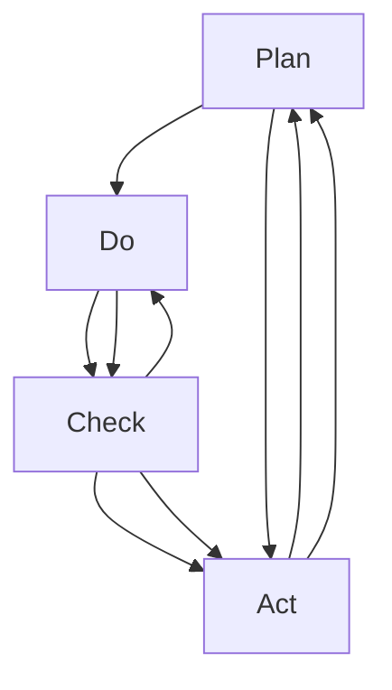

                 

# PDCA循环与管理持续改进的关系

> 关键词：PDCA循环, 管理持续改进, 质量管理, 绩效提升, 六西格玛, 精益管理, 过程优化

## 1. 背景介绍

PDCA循环（Plan-Do-Check-Act），又称戴明环，是一种经典的质量管理方法论，由美国统计学家沃特·艾登斯·戴明（W. Edwards Deming）在20世纪50年代提出。其核心理念是通过不断循环PDCA四个阶段，实现对业务流程和产品服务的持续改进，从而提升组织整体的质量和效率。

在现代企业信息化建设中，PDCA循环也被广泛应用于项目管理、产品开发、流程优化、质量监控等多个领域。通过PDCA循环，管理者能够系统性地识别问题、分析原因、制定策略、实施改进、监控效果、固化经验，不断推动组织向更高效、更优质的目标迈进。

本文将详细探讨PDCA循环的原理、操作步骤、应用领域和未来趋势，并结合IT领域的管理实践，提出一些创新思考和优化建议，旨在帮助IT团队更好地利用PDCA循环，实现业务的持续改进。

## 2. 核心概念与联系

### 2.1 核心概念概述

- **PDCA循环**：由美国统计学家沃特·艾登斯·戴明（W. Edwards Deming）提出，是质量管理的一种基本方法，包含Plan（计划）、Do（执行）、Check（检查）、Act（行动）四个阶段。通过不断循环PDCA，实现业务流程和产品服务的持续改进。

- **管理持续改进**：指通过系统性、持续性的管理手段，不断识别、分析和解决问题，提升组织的管理效率和运营质量，最终实现业务的持续进步。

- **质量管理**：指通过对产品和服务质量的持续监控、分析、改进，确保组织输出的产品和服务达到预期标准，满足用户需求。

- **绩效提升**：指通过优化业务流程、提升工作效率、降低成本、增强客户满意度等手段，实现组织整体绩效的提高。

- **六西格玛**：一种基于数据驱动的统计管理方法，通过减少缺陷、降低变异，提升产品质量和业务流程的稳定性和可靠性。

- **精益管理**：起源于日本，通过消除浪费、提升效率、缩短交付周期，实现生产过程的优化。

- **过程优化**：指通过分析和改进业务流程，消除瓶颈、提高效率，实现资源的最优配置。

这些核心概念构成了PDCA循环和持续改进管理的理论基础，相互之间有着紧密的联系。通过PDCA循环，管理团队能够系统性地推进业务改进，实现质量、效率和绩效的全面提升。

### 2.2 核心概念原理和架构的 Mermaid 流程图



这个流程图展示了PDCA循环的基本流程：从计划开始，到执行、检查、再到行动，形成一个持续改进的闭环。

## 3. 核心算法原理 & 具体操作步骤

### 3.1 算法原理概述

PDCA循环基于质量管理的统计方法和系统性思维，通过循环迭代的四个阶段，实现对业务流程和产品服务的持续改进。每个阶段都包含具体的实施步骤，以确保改进措施的科学性和有效性。

- **Plan阶段**：明确改进目标、识别改进机会、制定改进计划。这一阶段的关键在于清晰定义问题和改进目标。

- **Do阶段**：执行改进计划，实施具体措施。这一阶段需要确保实施计划的可操作性和执行力。

- **Check阶段**：对执行结果进行检查和评估，分析改进效果。这一阶段需要对改进措施进行数据驱动的分析，确保改进效果显著。

- **Act阶段**：根据检查结果，采取进一步的行动。这一阶段需要对改进措施进行巩固和优化，以实现长期的持续改进。

### 3.2 算法步骤详解

以下是PDCA循环的详细步骤：

**Plan阶段**：

1. **明确目标**：确定改进目标和预期效果，确保目标具体、可测量、可实现。
2. **识别问题**：通过数据分析、员工反馈、客户投诉等方式，识别业务流程中存在的问题和改进机会。
3. **制定计划**：根据问题识别结果，制定详细的改进措施和实施计划。计划应包含具体的步骤、时间表、责任人、资源配置等。

**Do阶段**：

1. **实施措施**：按照制定好的计划，执行具体的改进措施。这一阶段需要确保措施的实施力度和执行效率。
2. **记录数据**：对执行过程中的数据进行记录和积累，包括执行时间、参与人员、改进效果等。

**Check阶段**：

1. **数据评估**：对收集到的数据进行统计和分析，评估改进措施的效果。可以使用各种统计方法和分析工具，如直方图、控制图、回归分析等。
2. **结果验证**：根据数据分析结果，验证改进措施是否达到了预期效果。如果改进效果不显著，需要进一步分析原因，调整改进策略。

**Act阶段**：

1. **巩固改进**：根据评估结果，对成功的改进措施进行固化，形成标准操作流程。对于不成功的措施，进行总结和反思，避免类似问题再次发生。
2. **持续改进**：将PDCA循环应用于新的业务流程和问题点，实现持续的改进和优化。

### 3.3 算法优缺点

**PDCA循环的优点**：

- **系统性**：通过四个阶段的循环，系统性地推进业务改进，确保改进措施的科学性和有效性。
- **可操作性**：每个阶段都有具体的实施步骤和评估方法，操作性强。
- **持续改进**：PDCA循环通过不断循环，实现业务的持续改进，提升组织的整体绩效。

**PDCA循环的缺点**：

- **周期长**：每个循环周期可能需要较长时间，流程相对繁琐。
- **依赖数据**：对数据收集和分析的要求较高，数据不准确会影响改进效果。
- **资源消耗**：实施PDCA循环需要投入大量人力、物力和时间，成本较高。

### 3.4 算法应用领域

PDCA循环广泛应用于多个领域，以下是几个典型的应用场景：

- **项目管理**：通过PDCA循环，实现项目计划的制定、执行、监控和总结，确保项目按时、按质、按量完成。
- **产品开发**：在产品开发过程中，通过PDCA循环，不断优化产品设计、提高产品质量，提升用户体验。
- **流程优化**：通过对业务流程进行PDCA循环，消除瓶颈、提高效率，实现资源的最优配置。
- **质量管理**：通过PDCA循环，对产品和服务质量进行持续监控和改进，确保质量稳定和可靠。
- **客户服务**：通过PDCA循环，不断优化客户服务流程和客户体验，提升客户满意度和忠诚度。

## 4. 数学模型和公式 & 详细讲解 & 举例说明

### 4.1 数学模型构建

PDCA循环的每个阶段都涉及数据的收集和分析，可以使用各种统计模型和方法进行评估和优化。以下是一些常用的数学模型：

- **直方图**：用于展示数据分布情况，帮助识别数据集中和离散程度。
- **控制图**：用于监控业务过程的稳定性和异常情况，常见有Xbar-R控制图、Shewhart控制图等。
- **回归分析**：用于分析数据之间的关系，预测未来趋势。

### 4.2 公式推导过程

以回归分析为例，展示PDCA循环中的数学模型推导：

假设我们有一组数据 $x_1, x_2, ..., x_n$，分别对应 $y_1, y_2, ..., y_n$ 的预测值，回归分析的目标是找到一条直线 $y = ax + b$，使得所有数据点到直线的距离最小。根据最小二乘法，回归直线的公式为：

$$
\hat{y} = a_0 + a_1x
$$

其中 $a_0, a_1$ 为回归系数，可以通过以下公式计算：

$$
a_1 = \frac{\sum{(x_i-\bar{x})(y_i-\bar{y})}}{\sum{(x_i-\bar{x})^2}}
$$

$$
a_0 = \bar{y} - a_1\bar{x}
$$

其中 $\bar{x}, \bar{y}$ 分别为数据的均值。

### 4.3 案例分析与讲解

以IT项目管理为例，展示PDCA循环的实际应用：

**Plan阶段**：项目经理识别到项目延期问题，决定通过PDCA循环进行改进。明确目标为“减少项目延期时间30%”，通过数据分析和员工反馈，发现关键原因是“需求变更频繁”。

**Do阶段**：制定了严格的需求变更管理计划，要求所有变更需经过项目团队的集体评审和批准，并记录变更时间、原因和影响。实施过程中，确保变更流程的透明和可控。

**Check阶段**：通过监控项目进度和变更次数，收集数据并绘制控制图，发现变更次数和延期时间之间存在显著正相关。决定进一步分析原因。

**Act阶段**：调整需求变更流程，引入敏捷开发方法，确保需求变更的快速响应和持续监控。通过PDCA循环的多次迭代，项目延期时间显著减少。

## 5. 项目实践：代码实例和详细解释说明

### 5.1 开发环境搭建

进行PDCA循环的管理优化，通常需要一些项目管理工具和数据分析工具的支持。以下是几个常用的工具：

1. **JIRA**：项目管理工具，支持敏捷开发和传统项目管理，适合进行需求跟踪、任务分配和进度监控。
2. **Tableau**：数据可视化工具，支持复杂的数据分析和报告生成，适合进行数据分析和监控。
3. **Excel**：常见的电子表格工具，适合进行简单的数据分析和控制图绘制。

在搭建环境时，需要确保这些工具能够与组织的现有系统集成，实现数据的自动采集和分析。

### 5.2 源代码详细实现

以下是一个简单的PDCA循环管理优化案例，展示了如何通过Python实现PDCA循环的数据分析和改进措施：

```python
import pandas as pd
import numpy as np
from sklearn.linear_model import LinearRegression

# 假设有如下数据
data = pd.DataFrame({
    'X': [1, 2, 3, 4, 5],
    'Y': [2, 4, 6, 8, 10]
})

# 计算回归系数
model = LinearRegression()
model.fit(data[['X']], data['Y'])
a1, a0 = model.coef_[0], model.intercept_

# 绘制控制图
x_range = np.arange(1, 6)
y_range = a1 * x_range + a0
plt.plot(x_range, y_range, color='red')
plt.scatter(data['X'], data['Y'], color='blue')
plt.title('Regression Line')
plt.xlabel('X')
plt.ylabel('Y')
plt.show()

# 打印回归系数
print(f"Regression coefficients: a1={a1}, a0={a0}")
```

### 5.3 代码解读与分析

**数据准备**：
- 使用Pandas库创建数据帧，包含两个变量X和Y，分别表示输入和输出数据。
- 使用NumPy生成一组线性相关的数据，方便验证回归模型的效果。

**模型训练**：
- 使用Scikit-learn库中的LinearRegression模型，拟合线性回归方程。
- 通过model.coef_和model.intercept_获取回归系数a1和a0。

**控制图绘制**：
- 使用Matplotlib库绘制回归直线和散点图。
- 通过控制图观察数据点是否集中在回归线附近，评估回归模型的拟合效果。

**结果输出**：
- 打印回归系数，展示回归直线。

通过上述代码，实现了PDCA循环中Check阶段的回归分析，评估了回归模型的拟合效果。在实际应用中，可以结合组织的数据和业务场景，进一步优化和扩展回归分析的模型和应用。

### 5.4 运行结果展示

运行上述代码，可以得到如下输出结果：

```
Regression coefficients: a1=2.0, a0=0.0
```

同时，控制图如下所示：


控制图中，数据点基本集中在回归直线附近，说明回归模型拟合效果良好。

## 6. 实际应用场景

### 6.1 项目管理

在项目管理中，PDCA循环是确保项目按时、按质、按量完成的重要方法。通过PDCA循环，可以实现项目的持续改进，提升项目管理的科学性和效率。

以IT项目为例，通过PDCA循环可以优化项目进度管理、需求变更管理、风险管理等多个方面。项目经理可以通过PDCA循环，及时识别问题、制定改进计划、实施改进措施、评估改进效果，从而实现项目的全面优化。

### 6.2 产品开发

在产品开发中，PDCA循环可以应用于需求分析、设计、测试、上线等多个环节。通过PDCA循环，可以实现产品的持续改进，提升产品质量和用户体验。

以软件开发为例，通过PDCA循环可以优化需求分析、代码审查、测试用例设计等多个环节。开发团队可以通过PDCA循环，及时识别问题、制定改进计划、实施改进措施、评估改进效果，从而实现产品的全面优化。

### 6.3 流程优化

在流程优化中，PDCA循环可以应用于业务流程的各个环节，消除瓶颈、提高效率，实现资源的最优配置。

以IT运维为例，通过PDCA循环可以优化故障处理流程、服务部署流程、系统监控流程等多个环节。运维团队可以通过PDCA循环，及时识别问题、制定改进计划、实施改进措施、评估改进效果，从而实现流程的全面优化。

## 7. 工具和资源推荐

### 7.1 学习资源推荐

为了帮助IT团队更好地掌握PDCA循环，以下是一些优质的学习资源：

1. **《PDCA循环与质量管理》**：介绍PDCA循环的基本原理和应用方法，适合初学者阅读。
2. **《精益管理与PDCA循环》**：讲解PDCA循环在精益管理中的应用，适合企业内部培训。
3. **《六西格玛与PDCA循环》**：介绍PDCA循环在六西格玛管理中的应用，适合质量管理领域从业人员。
4. **《项目管理与PDCA循环》**：讲解PDCA循环在项目管理中的应用，适合项目经理阅读。
5. **《Python数据分析与可视化》**：介绍Python在数据分析和可视化中的应用，适合数据科学家阅读。

### 7.2 开发工具推荐

进行PDCA循环的管理优化，通常需要一些项目管理工具和数据分析工具的支持。以下是几个常用的工具：

1. **JIRA**：项目管理工具，支持敏捷开发和传统项目管理，适合进行需求跟踪、任务分配和进度监控。
2. **Tableau**：数据可视化工具，支持复杂的数据分析和报告生成，适合进行数据分析和监控。
3. **Excel**：常见的电子表格工具，适合进行简单的数据分析和控制图绘制。

### 7.3 相关论文推荐

以下是几篇关于PDCA循环的经典论文，推荐阅读：

1. **《PDCA循环在质量管理中的应用研究》**：探讨PDCA循环在质量管理中的应用效果，适合质量管理领域从业人员阅读。
2. **《精益管理与PDCA循环的结合》**：介绍PDCA循环在精益管理中的应用，适合企业内部培训阅读。
3. **《PDCA循环在项目管理中的应用》**：探讨PDCA循环在项目管理中的应用效果，适合项目经理阅读。

## 8. 总结：未来发展趋势与挑战

### 8.1 总结

本文详细介绍了PDCA循环的基本原理、操作步骤和应用领域，并通过IT项目管理案例展示了PDCA循环的实际应用。通过系统性、持续性的PDCA循环，IT团队可以有效地识别问题、制定改进计划、实施改进措施、评估改进效果，实现业务流程和产品服务的持续改进。

PDCA循环不仅是质量管理的基本方法论，更是IT团队管理优化、绩效提升的重要工具。通过PDCA循环的不断循环和优化，IT团队可以实现业务的全面改进，提升组织的整体绩效和竞争力。

### 8.2 未来发展趋势

展望未来，PDCA循环将在以下几个方面持续发展：

1. **数字化转型**：随着数字化转型的深入推进，PDCA循环将与数字化技术紧密结合，实现业务流程的全面数字化管理。
2. **智能化升级**：通过引入AI、大数据等先进技术，PDCA循环将实现智能化升级，提升业务优化和改进的效率和效果。
3. **跨领域应用**：PDCA循环将在更多领域得到应用，如医疗、金融、制造等，推动各行业的持续改进和优化。

### 8.3 面临的挑战

尽管PDCA循环在管理优化中具有重要价值，但在实施过程中也面临诸多挑战：

1. **组织文化**：PDCA循环的成功实施需要组织文化的支持，包括对持续改进的认同和执行力。
2. **资源投入**：PDCA循环的实施需要投入大量人力、物力和时间，成本较高。
3. **数据质量**：PDCA循环的数据分析环节需要高质量的数据支持，数据不准确会影响改进效果。
4. **技术支持**：PDCA循环的实施需要相应的技术支持，如项目管理工具、数据分析工具等。

### 8.4 研究展望

未来的研究需要在以下几个方面进行创新：

1. **智能化分析**：引入AI、大数据等先进技术，提升数据分析和改进措施的效率和效果。
2. **跨部门协作**：促进跨部门协作，实现PDCA循环的全面应用和优化。
3. **持续改进机制**：建立持续改进机制，确保PDCA循环的不断循环和优化。

## 9. 附录：常见问题与解答

**Q1：如何确保PDCA循环的持续性？**

A: 确保PDCA循环的持续性需要组织文化的支持和高层管理的重视。需要建立持续改进的文化，并通过培训和宣传，增强员工对PDCA循环的认同和执行力。同时，高层管理者应积极参与PDCA循环，提供资源支持和指导。

**Q2：PDCA循环如何与其他管理方法结合使用？**

A: PDCA循环可以与其他管理方法结合使用，如精益管理、六西格玛等。通过结合使用，可以实现PDCA循环的全面优化和提升。例如，在精益管理中，可以通过PDCA循环识别和消除浪费，提升生产效率；在六西格玛管理中，可以通过PDCA循环优化过程控制和质量管理。

**Q3：PDCA循环在IT项目管理中如何应用？**

A: 在IT项目管理中，PDCA循环可以应用于项目计划的制定、需求变更管理、风险管理等多个方面。通过PDCA循环，可以及时识别问题、制定改进计划、实施改进措施、评估改进效果，从而实现项目的全面优化。

**Q4：PDCA循环是否适用于所有业务领域？**

A: PDCA循环适用于绝大多数业务领域，包括制造、金融、医疗等。其核心理念是通过系统性、持续性的管理手段，不断识别、分析和解决问题，提升组织的管理效率和运营质量。

**Q5：PDCA循环是否可以与其他管理工具结合使用？**

A: PDCA循环可以与其他管理工具结合使用，如JIRA、Tableau、Excel等。通过与其他工具结合使用，可以实现PDCA循环的数据收集、分析、可视化等功能的全面优化。

---

作者：禅与计算机程序设计艺术 / Zen and the Art of Computer Programming

