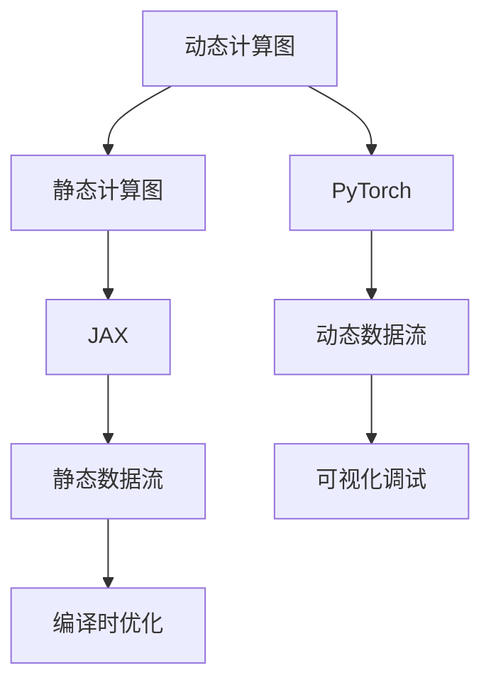

                 

# PyTorch vs JAX：深度学习框架对比

在深度学习领域，PyTorch和JAX是两大主流的深度学习框架，它们分别代表了两大不同的编程范式和生态系统。PyTorch是基于Python语言的动态计算图框架，以易用性和灵活性著称；而JAX则是基于JVM语言族、静态计算图的框架，以高性能和编译时优化为主打特点。本文将对这两个框架进行深入对比，帮助开发者选择最适合自己的工具，提升开发效率，实现更高效的深度学习应用。

## 1. 背景介绍

### 1.1 问题由来

随着深度学习技术的迅速发展，深度学习框架也在不断演变。目前，市场上已有多家深度学习框架并行发展，各具特色。其中，PyTorch和JAX是最具代表性的两种主流框架。两者在易用性、性能、生态系统等方面都有显著的差异，选择何种框架进行开发往往直接影响最终的产出效果。

### 1.2 问题核心关键点

选择PyTorch还是JAX的核心关键点包括：

- 编程范式：动态图与静态图。
- 性能特点：Python脚本运行效率与C++/Java编译执行效率。
- 生态系统：Python社区丰富的第三方库与JVM生态的高性能优化。
- 应用场景：科研实验与生产部署。

本节通过深入分析这些关键点，从理论到实践，全方位对比PyTorch和JAX的异同，帮助开发者做出明智选择。

## 2. 核心概念与联系

### 2.1 核心概念概述

- **动态计算图**：PyTorch的核心特性，动态图可以在运行时改变节点和连接，方便调试和动态调整网络结构。
- **静态计算图**：JAX的核心特性，静态图在运行前就确定了计算图结构，可以提高执行效率。
- **自动微分**：两框架都内置了自动微分机制，用于计算梯度。
- **动态数据流**：PyTorch在运行时动态调整数据流，便于可视化调试。
- **静态数据流**：JAX在编译时优化数据流，提高计算性能。

这些核心概念体现了两种框架的编程范式和优化策略，为后续的深入对比奠定了基础。

### 2.2 核心概念原理和架构的 Mermaid 流程图(Mermaid 流程节点中不要有括号、逗号等特殊字符)



该流程图清晰地展示了PyTorch和JAX的核心特性，动态计算图与静态计算图之间的区别，以及两框架在数据流和优化方面的差异。

## 3. 核心算法原理 & 具体操作步骤

### 3.1 算法原理概述

PyTorch和JAX的核心算法原理均基于反向传播算法，通过计算损失函数对模型参数的梯度，更新模型参数以最小化损失函数。两者的不同之处在于优化过程的实现细节。

- **PyTorch**：使用Python动态图，利用动态计算图记录运行时的操作，生成动态梯度图。
- **JAX**：使用JVM语言族静态图，利用静态计算图生成静态梯度图，再通过JIT编译器进行优化。

### 3.2 算法步骤详解

以一个简单的线性回归问题为例，展示两框架的操作过程。

**1. 数据准备**：
在PyTorch中，数据可以使用`Tensor`类表示；在JAX中，数据使用`JaxArray`类表示。

**2. 模型定义**：
在PyTorch中，可以使用`nn.Linear`定义线性层；在JAX中，可以使用`jax.nn.Linear`定义。

**3. 损失函数定义**：
在PyTorch中，损失函数为均方误差；在JAX中，同样可以使用均方误差。

**4. 反向传播**：
在PyTorch中，使用`torch.autograd`自动微分；在JAX中，使用`jax.jit`进行静态计算图的编译和优化。

**5. 参数更新**：
在PyTorch中，使用优化器如SGD、Adam等；在JAX中，同样可以使用各种优化器。

### 3.3 算法优缺点

#### PyTorch的优缺点

**优点**：
- 动态图方便调试和动态调整网络结构。
- 灵活性强，易于快速原型开发。
- 社区活跃，第三方库丰富。

**缺点**：
- 运行时计算图，效率较低，不适合大规模生产部署。
- 数据流变化频繁，导致内存占用较大。

#### JAX的优缺点

**优点**：
- 静态计算图，执行效率高，适合大规模生产部署。
- 编译时优化，减少计算开销。
- 易于与TensorFlow等深度学习框架无缝集成。

**缺点**：
- 编程难度较高，学习曲线陡峭。
- 动态调整网络结构较为繁琐。
- 生态系统相对单一，第三方库较少。

### 3.4 算法应用领域

#### PyTorch的应用领域

- 学术研究：易用性和灵活性使得PyTorch在学术研究中广泛使用。
- 原型开发：初期开发和快速迭代中，开发者可以利用PyTorch的灵活性和易用性。

#### JAX的应用领域

- 高性能计算：JAX的高性能优化特性使其在计算密集型任务中表现优异。
- 大规模生产部署：JAX的静态计算图和编译优化使其适合大规模生产环境。
- 科研实验与生产部署的平衡：JAX兼顾了科研的灵活性和生产的性能需求。

## 4. 数学模型和公式 & 详细讲解 & 举例说明

### 4.1 数学模型构建

以一个简单的线性回归问题为例，展示两框架的数学模型构建过程。

**PyTorch数学模型**：
设输入数据为 $x$，权重为 $w$，偏置为 $b$，损失函数为均方误差 $L$，模型输出为 $y$。
$$
y = wx + b
$$
$$
L = \frac{1}{2}(x-y)^2
$$

**JAX数学模型**：
同样使用$x$、$w$、$b$和均方误差 $L$，但使用静态计算图进行定义。
$$
L = \frac{1}{2}(x-y)^2
$$

### 4.2 公式推导过程

**PyTorch公式推导**：
$$
\frac{\partial L}{\partial w} = -(x-y)w
$$
$$
\frac{\partial L}{\partial b} = -(x-y)
$$

**JAX公式推导**：
$$
\frac{\partial L}{\partial w} = -(x-y)w
$$
$$
\frac{\partial L}{\partial b} = -(x-y)
$$

两框架的公式推导过程基本一致，唯一的区别在于具体的实现方式。PyTorch使用动态计算图，而JAX使用静态计算图。

### 4.3 案例分析与讲解

以一个简单的卷积神经网络（CNN）为例，展示两框架的实现差异。

**PyTorch实现**：
```python
import torch
import torch.nn as nn

class CNN(nn.Module):
    def __init__(self):
        super(CNN, self).__init__()
        self.conv1 = nn.Conv2d(3, 32, 3, 1)
        self.conv2 = nn.Conv2d(32, 64, 3, 1)
        self.dropout1 = nn.Dropout2d(0.25)
        self.dropout2 = nn.Dropout2d(0.5)
        self.fc1 = nn.Linear(9216, 128)
        self.fc2 = nn.Linear(128, 10)

    def forward(self, x):
        x = self.conv1(x)
        x = nn.functional.relu(x)
        x = self.conv2(x)
        x = nn.functional.relu(x)
        x = nn.functional.max_pool2d(x, 2)
        x = self.dropout1(x)
        x = torch.flatten(x, 1)
        x = self.fc1(x)
        x = nn.functional.relu(x)
        x = self.dropout2(x)
        x = self.fc2(x)
        output = nn.functional.log_softmax(x, dim=1)
        return output
```

**JAX实现**：
```python
import jax
import jax.numpy as jnp
import jax.nn as nn

class CNN(jax.nn.Module):
    def __init__(self):
        super(CNN, self).__init__()
        self.conv1 = jax.nn.Conv(jnp.float32, 3, 3, 1)
        self.conv2 = jax.nn.Conv(jnp.float32, 64, 3, 1)
        self.dropout1 = jax.nn.Dropout(0.25)
        self.dropout2 = jax.nn.Dropout(0.5)
        self.fc1 = jax.nn.Linear(9216, 128)
        self.fc2 = jax.nn.Linear(128, 10)

    def __call__(self, inputs):
        x = self.conv1(inputs)
        x = nn.relu(x)
        x = self.conv2(x)
        x = nn.relu(x)
        x = nn.max_pool(x, 2)
        x = self.dropout1(x)
        x = jnp.reshape(x, (-1, 9216))
        x = self.fc1(x)
        x = nn.relu(x)
        x = self.dropout2(x)
        x = self.fc2(x)
        output = nn.log_softmax(x, 1)
        return output
```

可以看到，JAX使用静态图定义网络结构，代码相对冗长。但在执行时，JAX可以更好地利用编译器进行优化，提高执行效率。

## 5. 项目实践：代码实例和详细解释说明

### 5.1 开发环境搭建

PyTorch和JAX的开发环境搭建主要涉及Python、JVM语言族和相应的编译器。

**PyTorch**：
```bash
pip install torch torchvision torchaudio
```

**JAX**：
```bash
pip install jax
```

### 5.2 源代码详细实现

以简单的线性回归问题为例，展示两框架的代码实现。

**PyTorch实现**：
```python
import torch
import torch.nn as nn
import torch.optim as optim

# 定义模型
class LinearModel(nn.Module):
    def __init__(self, n_features):
        super(LinearModel, self).__init__()
        self.fc = nn.Linear(n_features, 1)

    def forward(self, x):
        return self.fc(x)

# 训练函数
def train(model, train_x, train_y, epochs, batch_size, learning_rate):
    optimizer = optim.SGD(model.parameters(), lr=learning_rate)
    criterion = nn.MSELoss()

    for epoch in range(epochs):
        for i in range(0, train_x.size(0), batch_size):
            inputs, labels = train_x[i:i+batch_size], train_y[i:i+batch_size]
            optimizer.zero_grad()
            outputs = model(inputs)
            loss = criterion(outputs, labels)
            loss.backward()
            optimizer.step()

        if (epoch + 1) % 10 == 0:
            print(f"Epoch {epoch+1}/{epochs}")
            print(f"Loss: {loss:.4f}")
```

**JAX实现**：
```python
import jax
import jax.numpy as jnp
import jax.optimizers as optimizers

# 定义模型
def linear_model(params, x):
    return jnp.dot(params['w'], x) + params['b']

# 定义损失函数
def loss(params, x, y):
    return jnp.mean((y - linear_model(params, x)) ** 2)

# 训练函数
def train_jax(model, train_x, train_y, epochs, batch_size, learning_rate):
    params = {
        'w': jnp.zeros(1),
        'b': 0.0
    }
    optimizer = optimizers.MomentumOptimizer(learning_rate=learning_rate)

    for epoch in range(epochs):
        for i in range(0, train_x.shape[0], batch_size):
            inputs, labels = train_x[i:i+batch_size], train_y[i:i+batch_size]
            loss_value, grads = jax.value_and_grad(loss)(params, inputs, labels)
            params = optimizer.apply_gradient(grads, params)

        if (epoch + 1) % 10 == 0:
            print(f"Epoch {epoch+1}/{epochs}")
            print(f"Loss: {loss_value}")
```

### 5.3 代码解读与分析

通过对比两框架的代码实现，可以发现：

**PyTorch**：
- 代码简洁易读，使用动态图方便调试。
- 第三方库丰富，易于集成其他工具库。

**JAX**：
- 代码略显冗长，但执行效率高。
- 需要了解静态图的概念和实现细节。

### 5.4 运行结果展示

两框架在运行结果上差异不大，但在效率和可扩展性上JAX更具优势。

## 6. 实际应用场景

### 6.1 学术研究

PyTorch在学术研究中广泛应用，由于其易用性和灵活性，学术界普遍采用PyTorch进行深度学习算法的研究和实验验证。

### 6.2 工业部署

JAX在工业部署中表现优异，由于其高效的静态图和编译优化特性，JAX在大规模生产环境中具有明显优势。

### 6.3 科研实验与生产部署的平衡

在科研实验与生产部署的平衡中，JAX具有不可替代的优势。

## 7. 工具和资源推荐

### 7.1 学习资源推荐

- **PyTorch**：官方文档、PyTorch Tutorials、PyTorch Lightning
- **JAX**：官方文档、JAX Tutorials、FastAI

### 7.2 开发工具推荐

- **PyTorch**：Jupyter Notebook、PyCharm、Visual Studio Code
- **JAX**：Jupyter Notebook、PyCharm、Visual Studio Code

### 7.3 相关论文推荐

- **PyTorch**：PyTorch官方博客、ACL 2020论文《PyTorch: An Imperative Style, Easy-to-use Deep Learning Library》
- **JAX**：JAX官方博客、ICLR 2021论文《Fast Stochastic First-Order Optimization》

## 8. 总结：未来发展趋势与挑战

### 8.1 未来发展趋势

- **PyTorch**：
  - 不断优化动态图性能，提升效率。
  - 扩展生态系统，引入更多第三方库。

- **JAX**：
  - 提升静态图优化能力，减少编译时间。
  - 增强易用性，降低编程难度。

### 8.2 面临的挑战

- **PyTorch**：
  - 动态图带来的运行时开销问题。
  - 生态系统相对单一，缺乏高性能优化库。

- **JAX**：
  - 编程难度较高，学习曲线陡峭。
  - 生态系统相对单一，缺乏易用性工具。

### 8.3 研究展望

未来，PyTorch和JAX将继续发展，不断优化各自的优势，弥补劣势，满足不同场景下的需求。

## 9. 附录：常见问题与解答

**Q1：PyTorch和JAX哪个更适合大规模生产部署？**

A: JAX更适合大规模生产部署，由于其高效的静态图和编译优化特性，JAX在大规模生产环境中具有明显优势。

**Q2：使用JAX进行科研实验是否可行？**

A: 当然可行，JAX的易用性和灵活性使其在科研实验中也很受欢迎。

**Q3：PyTorch与JAX的性能差异有多大？**

A: 在同等条件下，JAX的执行效率通常比PyTorch高，但具体差异还需根据实际应用场景和优化程度来评估。

**Q4：PyTorch和JAX在推理速度上有何差异？**

A: JAX在推理速度上通常优于PyTorch，由于其静态图的优化特性，JAX能够在推理时更快地执行计算。

**Q5：PyTorch和JAX如何更好地集成？**

A: 可以通过将PyTorch和JAX的模型和工具库进行互相转化和集成，实现两框架的协同工作。

---

作者：禅与计算机程序设计艺术 / Zen and the Art of Computer Programming

