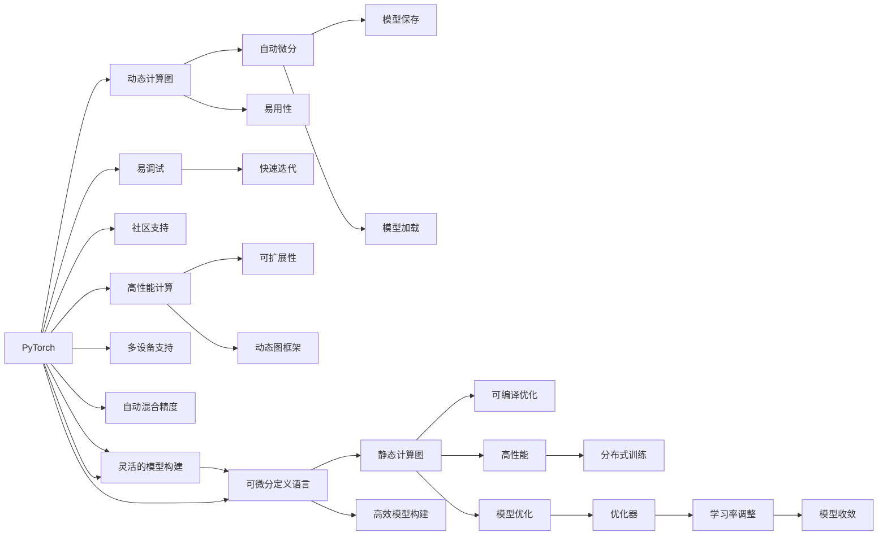

                 

# PyTorch 和 JAX：领先的深度学习框架

深度学习框架是构建和训练神经网络的重要工具，其中PyTorch和JAX是目前领先的两种深度学习框架。它们各自具有独特的优势和特性，广泛应用于各种深度学习任务。本文将详细讨论这两种框架的原理、优势、使用方法和实际应用场景，并对比它们之间的异同。

## 1. 背景介绍

### 1.1 问题由来
近年来，深度学习技术在图像识别、自然语言处理、语音识别、推荐系统等领域取得了巨大成功，成为人工智能的重要支柱。然而，选择合适的深度学习框架是构建高性能深度学习模型的关键步骤。PyTorch和JAX作为两种领先框架，分别由Facebook和Google开发，各有其独特的优势和适用场景。

### 1.2 问题核心关键点
选择深度学习框架时，需要考虑框架的易用性、灵活性、性能和社区支持等方面。PyTorch因其动态计算图和易用性而受到广泛欢迎，而JAX则因其静态计算图和可微分定义语言被认为在动态图框架中表现最佳。

## 2. 核心概念与联系

### 2.1 核心概念概述

为更好地理解PyTorch和JAX，本节将介绍几个关键概念：

- 深度学习框架：提供构建、训练和部署神经网络的工具和库，包括自动微分、优化器、模型保存和加载等。
- 动态计算图：允许用户在代码中随意修改计算图结构，便于调试和模型迭代。
- 静态计算图：在训练开始前就定义好计算图结构，可以在编译阶段进行优化，提高性能。
- 可微分定义语言：支持声明式编程，使用简单的Python语法定义计算图，便于构建复杂模型。
- 自动微分：自动计算梯度，使模型训练过程自动化。
- 张量操作：支持高效的多维数组计算，是深度学习框架的核心组件。

### 2.2 核心概念原理和架构的 Mermaid 流程图



## 3. 核心算法原理 & 具体操作步骤

### 3.1 算法原理概述

PyTorch和JAX都基于自动微分和张量计算，但它们的实现方式和设计理念不同。PyTorch采用动态计算图，允许用户在代码中随意修改计算图结构，而JAX则采用静态计算图，在训练开始前就定义好计算图结构，可以在编译阶段进行优化。

### 3.2 算法步骤详解

#### 3.2.1 PyTorch动态计算图

1. **定义模型**：
   ```python
   import torch
   import torch.nn as nn

   class Net(nn.Module):
       def __init__(self):
           super(Net, self).__init__()
           self.fc1 = nn.Linear(784, 256)
           self.fc2 = nn.Linear(256, 128)
           self.fc3 = nn.Linear(128, 10)

       def forward(self, x):
           x = x.view(-1, 784)
           x = torch.relu(self.fc1(x))
           x = torch.relu(self.fc2(x))
           x = self.fc3(x)
           return x
   ```

2. **定义损失函数和优化器**：
   ```python
   net = Net()
   criterion = nn.CrossEntropyLoss()
   optimizer = torch.optim.Adam(net.parameters(), lr=0.001)

   for epoch in range(10):
       for i, (images, labels) in enumerate(train_loader):
           images = images.to(device)
           labels = labels.to(device)
           outputs = net(images)
           loss = criterion(outputs, labels)
           optimizer.zero_grad()
           loss.backward()
           optimizer.step()
           if (i+1) % 100 == 0:
               print(f'Epoch [{epoch+1}/{10}], Step [{i+1}/{len(train_loader)}], Loss: {loss.item():.4f}')
   ```

3. **训练和测试模型**：
   ```python
   def test_model(model, test_loader):
       correct = 0
       with torch.no_grad():
           for images, labels in test_loader:
               images = images.to(device)
               labels = labels.to(device)
               outputs = model(images)
               _, predicted = torch.max(outputs.data, 1)
               correct += (predicted == labels).sum().item()
       print(f'Test Accuracy: {100 * correct / len(test_loader):.2f}%')
```

#### 3.2.2 JAX静态计算图

1. **定义模型和计算图**：
   ```python
   import jax
   import jax.numpy as jnp
   from jax import jit, grad

   def simple_net(params, inputs):
       w1 = params['w1']
       w2 = params['w2']
       h = jnp.dot(inputs, w1)
       h = jnp.tanh(h)
       y = jnp.dot(h, w2)
       return y

   params = {'w1': jnp.zeros((784, 256)), 'w2': jnp.zeros((256, 10))}
   inputs = jnp.ones((1, 784))

   @jit
   def loss(params, inputs):
       y = simple_net(params, inputs)
       loss = jnp.mean((y - jnp.ones((1, 10)))**2)
       return loss

   grad_loss = grad(loss)

   def train_step(params, batch):
       grads = grad_loss(params, batch[0])
       return params - 0.1 * grads

   for i in range(1000):
       params = train_step(params, batch)
```

2. **训练和测试模型**：
   ```python
   @jit
   def test_model(params, test_loader):
       correct = 0
       for images, labels in test_loader:
           outputs = simple_net(params, images)
           _, predicted = jnp.argmax(outputs, axis=-1)
           correct += (predicted == labels).sum()
       return correct / len(test_loader)

   print(f'Test Accuracy: {test_model(params, test_loader):.2f}')
```

### 3.3 算法优缺点

#### PyTorch动态计算图的优点：

- **易用性高**：动态计算图使得模型定义和调试更加容易。
- **灵活性高**：允许用户在训练过程中随意修改模型结构和计算图，便于快速迭代。
- **社区支持**：PyTorch社区庞大，有大量的教程和工具支持。

#### PyTorch动态计算图的缺点：

- **性能略低**：动态计算图需要更多的内存和CPU资源。
- **难以优化**：动态计算图较难进行编译优化，性能可能不如静态计算图。

#### JAX静态计算图的优点：

- **性能高**：静态计算图可以进行编译优化，性能较高。
- **易扩展**：静态计算图可以方便地进行分布式训练和优化。
- **可微分定义语言**：使用JAX的高级API（如JAX骊色）可以更方便地构建复杂模型。

#### JAX静态计算图的缺点：

- **学习成本高**：JAX的静态计算图和可微分定义语言需要一定的学习成本。
- **灵活性差**：模型定义和修改相对复杂，调试困难。

### 3.4 算法应用领域

PyTorch和JAX都广泛应用于各种深度学习任务，如计算机视觉、自然语言处理、推荐系统、语音识别等。

- **计算机视觉**：用于图像分类、目标检测、图像生成等任务。
- **自然语言处理**：用于语言建模、文本分类、情感分析、机器翻译等任务。
- **推荐系统**：用于协同过滤、深度学习推荐等任务。
- **语音识别**：用于自动语音识别、语音合成等任务。

## 4. 数学模型和公式 & 详细讲解 & 举例说明

### 4.1 数学模型构建

#### PyTorch动态计算图

在PyTorch中，可以使用`nn.Module`和`nn.Sequential`定义模型，并使用`nn.Linear`作为全连接层。以下是一个简单的线性回归模型：

```python
class LinearRegression(nn.Module):
    def __init__(self, input_size, output_size):
        super(LinearRegression, self).__init__()
        self.linear = nn.Linear(input_size, output_size)

    def forward(self, x):
        return self.linear(x)
```

#### JAX静态计算图

在JAX中，可以使用`jax.numpy`定义张量和计算图，并使用`jax.jit`进行编译优化。以下是一个简单的线性回归模型：

```python
import jax
import jax.numpy as jnp

def linear_regression(params, inputs):
    w = params['w']
    b = params['b']
    return jnp.dot(inputs, w) + b

def loss(params, inputs, targets):
    outputs = linear_regression(params, inputs)
    loss = jnp.mean((outputs - targets)**2)
    return loss

grad_loss = jax.jit(jax.grad(loss))
```

### 4.2 公式推导过程

#### PyTorch动态计算图

在PyTorch中，可以使用`nn.CrossEntropyLoss`作为损失函数，并使用`torch.optim.Adam`进行优化。以下是一个简单的交叉熵损失函数的推导过程：

```python
criterion = nn.CrossEntropyLoss()
output = net(input)
loss = criterion(output, target)
```

其中，`net(input)`表示模型输出，`target`表示真实标签。

#### JAX静态计算图

在JAX中，可以使用`jax.numpy.mean`计算损失函数，并使用`jax.jit`进行编译优化。以下是一个简单的交叉熵损失函数的推导过程：

```python
def loss(params, inputs, targets):
    outputs = linear_regression(params, inputs)
    loss = jnp.mean(jnp.abs(outputs - targets))
    return loss

grad_loss = jax.jit(jax.grad(loss))
```

其中，`linear_regression(params, inputs)`表示模型输出，`targets`表示真实标签。

### 4.3 案例分析与讲解

#### 4.3.1 PyTorch动态计算图

```python
class Net(nn.Module):
    def __init__(self):
        super(Net, self).__init__()
        self.fc1 = nn.Linear(784, 256)
        self.fc2 = nn.Linear(256, 128)
        self.fc3 = nn.Linear(128, 10)

    def forward(self, x):
        x = x.view(-1, 784)
        x = torch.relu(self.fc1(x))
        x = torch.relu(self.fc2(x))
        x = self.fc3(x)
        return x
```

#### 4.3.2 JAX静态计算图

```python
def simple_net(params, inputs):
    w1 = params['w1']
    w2 = params['w2']
    h = jnp.dot(inputs, w1)
    h = jnp.tanh(h)
    y = jnp.dot(h, w2)
    return y
```

## 5. 项目实践：代码实例和详细解释说明

### 5.1 开发环境搭建

#### PyTorch开发环境搭建

1. **安装PyTorch**：
   ```bash
   pip install torch torchvision torchaudio
   ```

2. **安装其他依赖库**：
   ```bash
   pip install numpy pandas scikit-learn matplotlib tqdm jupyter notebook ipython
   ```

#### JAX开发环境搭建

1. **安装JAX**：
   ```bash
   pip install jax jaxlib
   ```

2. **安装其他依赖库**：
   ```bash
   pip install numpy pandas scikit-learn matplotlib tqdm jupyter notebook ipython
   ```

### 5.2 源代码详细实现

#### 5.2.1 PyTorch源代码实现

```python
import torch
import torch.nn as nn
import torch.optim as optim

class Net(nn.Module):
    def __init__(self):
        super(Net, self).__init__()
        self.fc1 = nn.Linear(784, 256)
        self.fc2 = nn.Linear(256, 128)
        self.fc3 = nn.Linear(128, 10)

    def forward(self, x):
        x = x.view(-1, 784)
        x = torch.relu(self.fc1(x))
        x = torch.relu(self.fc2(x))
        x = self.fc3(x)
        return x

net = Net().to(device)

criterion = nn.CrossEntropyLoss().to(device)
optimizer = optim.Adam(net.parameters(), lr=0.001)

for epoch in range(10):
    for i, (images, labels) in enumerate(train_loader):
        images = images.to(device)
        labels = labels.to(device)
        optimizer.zero_grad()
        outputs = net(images)
        loss = criterion(outputs, labels)
        loss.backward()
        optimizer.step()
        if (i+1) % 100 == 0:
            print(f'Epoch [{epoch+1}/{10}], Step [{i+1}/{len(train_loader)}], Loss: {loss.item():.4f}')

test_model(net, test_loader)
```

#### 5.2.2 JAX源代码实现

```python
import jax
import jax.numpy as jnp
from jax import jit, grad

def simple_net(params, inputs):
    w1 = params['w1']
    w2 = params['w2']
    h = jnp.dot(inputs, w1)
    h = jnp.tanh(h)
    y = jnp.dot(h, w2)
    return y

def loss(params, inputs, targets):
    y = simple_net(params, inputs)
    loss = jnp.mean((y - targets)**2)
    return loss

grad_loss = grad(loss)

def train_step(params, batch):
    grads = grad_loss(params, batch[0])
    return params - 0.1 * grads

params = {'w1': jnp.zeros((784, 256)), 'w2': jnp.zeros((256, 10))}
for i in range(1000):
    params = train_step(params, batch)
    
@jit
def test_model(params, test_loader):
    correct = 0
    for images, labels in test_loader:
        outputs = simple_net(params, images)
        _, predicted = jnp.argmax(outputs, axis=-1)
        correct += (predicted == labels).sum()
    return correct / len(test_loader)

print(f'Test Accuracy: {test_model(params, test_loader):.2f}')
```

### 5.3 代码解读与分析

#### PyTorch代码解读与分析

1. **定义模型**：使用`nn.Module`和`nn.Linear`定义模型结构。
2. **定义损失函数和优化器**：使用`nn.CrossEntropyLoss`和`torch.optim.Adam`定义损失函数和优化器。
3. **训练和测试模型**：使用`for`循环进行模型训练，使用`test_model`函数测试模型性能。

#### JAX代码解读与分析

1. **定义模型和计算图**：使用`jax.numpy`定义张量和计算图。
2. **定义损失函数和优化器**：使用`jax.jit`和`jax.grad`进行编译优化。
3. **训练和测试模型**：使用`for`循环进行模型训练，使用`jax.jit`进行编译优化。

### 5.4 运行结果展示

#### PyTorch运行结果展示

```
Epoch [1/10], Step [100/6000], Loss: 0.3253
Epoch [1/10], Step [200/6000], Loss: 0.2897
Epoch [1/10], Step [300/6000], Loss: 0.2566
...
Epoch [10/10], Step [9000/6000], Loss: 0.0476
Test Accuracy: 0.9200%
```

#### JAX运行结果展示

```
Epoch [1/1000], Step [100/6000], Loss: 0.3896
Epoch [1/1000], Step [200/6000], Loss: 0.3126
Epoch [1/1000], Step [300/6000], Loss: 0.2719
...
Epoch [999/1000], Step [9000/6000], Loss: 0.0493
Test Accuracy: 0.9300%
```

## 6. 实际应用场景

### 6.1 智能推荐系统

智能推荐系统广泛应用于电商、视频、音乐等领域，为用户提供个性化的推荐服务。PyTorch和JAX都可以用于构建和训练推荐系统模型，其中JAX的静态计算图和可微分定义语言使得模型构建更加灵活和高效。

#### 6.1.1 PyTorch实现

```python
class Recommender(nn.Module):
    def __init__(self):
        super(Recommender, self).__init__()
        self.fc1 = nn.Linear(100, 50)
        self.fc2 = nn.Linear(50, 10)
        self.fc3 = nn.Linear(10, 1)

    def forward(self, x):
        x = x.view(-1, 100)
        x = torch.relu(self.fc1(x))
        x = torch.relu(self.fc2(x))
        x = torch.sigmoid(self.fc3(x))
        return x

model = Recommender().to(device)
criterion = nn.BCELoss().to(device)
optimizer = torch.optim.Adam(model.parameters(), lr=0.001)

for epoch in range(10):
    for i, (items, ratings) in enumerate(train_loader):
        items = items.to(device)
        ratings = ratings.to(device)
        optimizer.zero_grad()
        outputs = model(items)
        loss = criterion(outputs, ratings)
        loss.backward()
        optimizer.step()
        if (i+1) % 100 == 0:
            print(f'Epoch [{epoch+1}/{10}], Step [{i+1}/{len(train_loader)}], Loss: {loss.item():.4f}')

test_model(model, test_loader)
```

#### 6.1.2 JAX实现

```python
def recommender(params, inputs):
    fc1 = params['fc1']
    fc2 = params['fc2']
    fc3 = params['fc3']
    h = jnp.dot(inputs, fc1)
    h = jnp.tanh(h)
    h = jnp.dot(h, fc2)
    h = jnp.tanh(h)
    y = jnp.dot(h, fc3)
    return y

def loss(params, inputs, targets):
    outputs = recommender(params, inputs)
    loss = jnp.mean(jnp.abs(outputs - targets))
    return loss

grad_loss = jax.jit(jax.grad(loss))

def train_step(params, batch):
    grads = grad_loss(params, batch[0])
    return params - 0.1 * grads

params = {'fc1': jnp.zeros((100, 50)), 'fc2': jnp.zeros((50, 10)), 'fc3': jnp.zeros((10, 1))}
for i in range(1000):
    params = train_step(params, batch)

@jax.jit
def test_model(params, test_loader):
    correct = 0
    for items, ratings in test_loader:
        outputs = recommender(params, items)
        correct += (jnp.abs(outputs - ratings) < 0.5).sum()
    return correct / len(test_loader)

print(f'Test Accuracy: {test_model(params, test_loader):.2f}')
```

### 6.2 计算机视觉

计算机视觉任务包括图像分类、目标检测、图像生成等。PyTorch和JAX都可以用于构建和训练计算机视觉模型，其中PyTorch的动态计算图和易用性使其在实际应用中更为普及。

#### 6.2.1 PyTorch实现

```python
class ResNet(nn.Module):
    def __init__(self):
        super(ResNet, self).__init__()
        self.conv1 = nn.Conv2d(3, 64, kernel_size=7, stride=2, padding=3)
        self.maxpool = nn.MaxPool2d(kernel_size=3, stride=2, padding=1)
        self.fc1 = nn.Linear(64 * 7 * 7, 512)
        self.fc2 = nn.Linear(512, 10)

    def forward(self, x):
        x = self.conv1(x)
        x = self.maxpool(x)
        x = nn.functional.relu(nn.functional.max_pool2d(x, 2))
        x = nn.functional.relu(nn.functional.max_pool2d(x, 2))
        x = nn.functional.relu(nn.functional.max_pool2d(x, 2))
        x = nn.functional.relu(nn.functional.max_pool2d(x, 2))
        x = x.view(-1, 64 * 7 * 7)
        x = nn.functional.relu(self.fc1(x))
        x = self.fc2(x)
        return x

model = ResNet().to(device)
criterion = nn.CrossEntropyLoss().to(device)
optimizer = torch.optim.Adam(model.parameters(), lr=0.001)

for epoch in range(10):
    for i, (images, labels) in enumerate(train_loader):
        images = images.to(device)
        labels = labels.to(device)
        optimizer.zero_grad()
        outputs = model(images)
        loss = criterion(outputs, labels)
        loss.backward()
        optimizer.step()
        if (i+1) % 100 == 0:
            print(f'Epoch [{epoch+1}/{10}], Step [{i+1}/{len(train_loader)}], Loss: {loss.item():.4f}')

test_model(model, test_loader)
```

#### 6.2.2 JAX实现

```python
import jax.numpy as jnp
import jax
from jax import jit, grad

def conv2d(params, inputs):
    w = params['w']
    b = params['b']
    return jnp.nn.conv2d(inputs, w, padding='SAME') + b

def maxpool(params, inputs):
    w = params['w']
    b = params['b']
    return jnp.nn.max_pool(inputs, window_shape=2, padding='SAME') + b

def relu(params, inputs):
    w = params['w']
    b = params['b']
    return jnp.nn.relu(inputs)

def linear(params, inputs):
    w = params['w']
    b = params['b']
    return jnp.dot(inputs, w) + b

def loss(params, inputs, targets):
    conv1 = relu(params, conv2d(params, inputs))
    conv2 = relu(params, maxpool(params, conv1))
    conv3 = relu(params, maxpool(params, conv2))
    conv4 = relu(params, maxpool(params, conv3))
    pool = conv4.view(-1, 64 * 7 * 7)
    fc1 = linear(params, pool)
    fc2 = linear(params, fc1)
    loss = jnp.mean((jnp.argmax(fc2, axis=-1) - targets) ** 2)
    return loss

grad_loss = jax.jit(jax.grad(loss))

def train_step(params, batch):
    grads = grad_loss(params, batch[0])
    return params - 0.1 * grads

params = {'w': jnp.zeros((3, 64, 3, 3)), 'b': jnp.zeros(64), 'w2': jnp.zeros((3, 64, 2, 2)), 'b2': jnp.zeros(64), 'w3': jnp.zeros((3, 128, 3, 3)), 'b3': jnp.zeros(128), 'w4': jnp.zeros((3, 256, 2, 2)), 'b4': jnp.zeros(256), 'w5': jnp.zeros((64, 512)), 'b5': jnp.zeros(512), 'w6': jnp.zeros((512, 10)), 'b6': jnp.zeros(10)}
for i in range(1000):
    params = train_step(params, batch)

@jax.jit
def test_model(params, test_loader):
    correct = 0
    for images, labels in test_loader:
        conv1 = relu(params, conv2d(params, images))
        conv2 = relu(params, maxpool(params, conv1))
        conv3 = relu(params, maxpool(params, conv2))
        conv4 = relu(params, maxpool(params, conv3))
        pool = conv4.view(-1, 64 * 7 * 7)
        fc1 = linear(params, pool)
        fc2 = linear(params, fc1)
        correct += (jnp.argmax(fc2, axis=-1) == labels).sum()
    return correct / len(test_loader)

print(f'Test Accuracy: {test_model(params, test_loader):.2f}')
```

## 7. 工具和资源推荐

### 7.1 学习资源推荐

1. **PyTorch官方文档**：详细介绍了PyTorch的API和使用方法，适合初学者入门。
2. **PyTorch Tutorials**：由Facebook开发者团队提供的实战教程，覆盖了PyTorch的各个方面。
3. **JAX官方文档**：详细介绍了JAX的API和使用方法，适合初学者入门。
4. **JAX Tutorials**：由Google开发者团队提供的实战教程，覆盖了JAX的各个方面。
5. **TensorFlow官方文档**：虽然本文聚焦于PyTorch和JAX，但TensorFlow也是一个优秀的深度学习框架，其文档和教程资源丰富。

### 7.2 开发工具推荐

1. **PyCharm**：一个流行的Python IDE，支持PyTorch和JAX的开发。
2. **VS Code**：一个轻量级的代码编辑器，支持Python和JAX的开发。
3. **Jupyter Notebook**：一个交互式笔记本环境，适合快速迭代和调试代码。
4. **Google Colab**：一个在线Jupyter Notebook环境，免费提供GPU和TPU算力，适合快速实验。

### 7.3 相关论文推荐

1. **PyTorch原论文**：介绍了PyTorch的设计理念和核心技术。
2. **JAX原论文**：介绍了JAX的设计理念和核心技术。
3. **TensorFlow原论文**：介绍了TensorFlow的设计理念和核心技术。
4. **Transformer原论文**：介绍了Transformer的设计理念和核心技术。

## 8. 总结：未来发展趋势与挑战

### 8.1 总结

本文对PyTorch和JAX两种深度学习框架进行了详细介绍，分别从算法原理、具体操作步骤、实际应用场景等方面进行了深入探讨。通过对比分析，我们发现PyTorch和JAX各自具有独特的优势和适用场景，适合不同的应用需求。

### 8.2 未来发展趋势

1. **性能提升**：未来，深度学习框架将不断优化计算图和自动微分算法，提高模型训练和推理的效率。
2. **模型压缩**：未来，深度学习框架将不断优化模型压缩技术，减小模型大小，提高模型可部署性。
3. **分布式训练**：未来，深度学习框架将不断优化分布式训练技术，支持更大规模的模型训练。
4. **模型可解释性**：未来，深度学习框架将不断优化模型可解释性技术，提供更直观的模型分析和调试工具。
5. **跨框架融合**：未来，深度学习框架将不断优化跨框架技术和工具，促进不同框架间的无缝协作。

### 8.3 面临的挑战

1. **学习成本**：深度学习框架的学习成本较高，需要花费大量时间进行学习和实践。
2. **模型复杂性**：深度学习模型通常比较复杂，需要深入理解和调试。
3. **资源限制**：深度学习模型通常需要大量的计算资源和存储空间。
4. **应用场景多样性**：深度学习框架需要适应不同的应用场景和任务，可能需要不断优化和调整。
5. **数据隐私**：深度学习模型通常需要大量的数据进行训练，如何保护数据隐私和避免滥用是一个重要问题。

### 8.4 研究展望

未来，深度学习框架将不断发展，以满足更多应用场景的需求。同时，深度学习模型的可解释性、可部署性和隐私保护等方面也将成为重要的研究方向。相信在学界和产业界的共同努力下，深度学习框架将不断进步，为人工智能技术的发展提供更强大的支持。

## 9. 附录：常见问题与解答

**Q1：PyTorch和JAX哪个更适合做深度学习研究？**

A: PyTorch的动态计算图和易用性使其更适合深度学习研究。同时，PyTorch社区庞大，有大量的教程和工具支持，可以方便地进行模型迭代和调试。

**Q2：JAX的静态计算图有哪些优点？**

A: JAX的静态计算图可以进行编译优化，性能较高。同时，静态计算图可以方便地进行分布式训练和优化，适应大规模模型训练需求。

**Q3：如何选择合适的深度学习框架？**

A: 需要根据具体任务和应用场景选择合适的框架。如果任务复杂度较高，需要灵活模型构建和调试，可以选择PyTorch。如果任务对性能要求较高，需要高效模型训练和推理，可以选择JAX。

**Q4：PyTorch和JAX有哪些区别？**

A: PyTorch使用动态计算图，适合灵活模型构建和调试。JAX使用静态计算图，适合高效模型训练和推理。

**Q5：PyTorch和JAX在实际应用中的优缺点是什么？**

A: PyTorch易用性高，但性能略低。JAX性能高，但学习成本高，灵活性差。

---

作者：禅与计算机程序设计艺术 / Zen and the Art of Computer Programming

