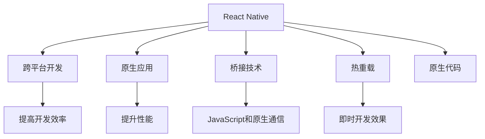
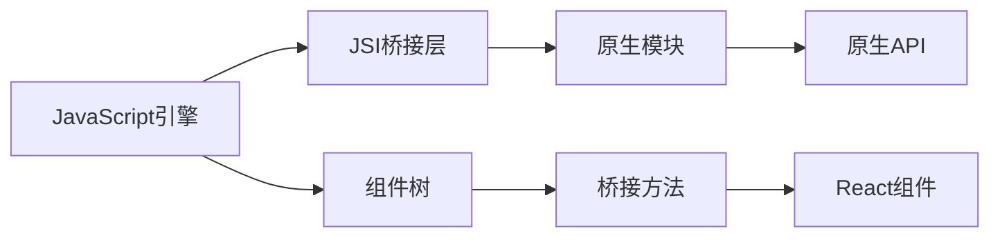

                 

## 1. 背景介绍

在当前的移动互联网开发领域，跨平台开发已经成为一个无法忽视的趋势。它不仅可以帮助开发团队更高效地构建跨平台应用，还能降低开发和维护成本，提升应用的生命周期。在这一背景下，React Native作为一款领先的全栈跨平台开发框架，其优势和适用性愈发凸显。本文将深入探讨React Native的核心概念、算法原理、操作步骤、数学模型、实际应用场景、学习资源推荐、开发工具推荐、相关论文推荐以及未来发展趋势与挑战，为广大开发者提供一个全面、系统的指南。

## 2. 核心概念与联系

### 2.1 核心概念概述

在探讨React Native的优势前，我们需要先了解一些核心概念：

- **React Native**：由Facebook开发的一款开源框架，允许开发者使用JavaScript和React构建原生移动应用，支持iOS和Android平台。
- **跨平台开发**：通过一次编写代码即可在多个平台上运行的技术，如iOS和Android，从而提升开发效率和应用维护成本。
- **原生应用**：直接在设备操作系统上运行的应用程序，性能较好但开发和维护成本较高。
- **桥接技术**：用于在JavaScript和原生代码之间进行通信的技术，React Native使用JSI桥接技术实现这一功能。
- **热重载**：在开发过程中允许即时更新代码并立即看到效果的技术，React Native内置了热重载功能。

这些概念之间的逻辑关系可以通过以下Mermaid流程图来展示：



这个流程图展示了React Native在跨平台开发中的关键作用：通过原生应用的性能优势和热重载的开发效率，同时借助桥接技术实现JavaScript与原生代码的通信，最终达到提高开发效率的目的。

### 2.2 核心概念原理和架构的 Mermaid 流程图



此图展示了React Native的核心架构，其中JSI桥接层负责在JavaScript和原生代码之间传递数据和方法，原生模块和原生API是React Native与原生平台交互的核心组件，而组件树则构成了React Native的视图体系。

## 3. 核心算法原理 & 具体操作步骤

### 3.1 算法原理概述

React Native的核心算法原理主要围绕以下几个方面展开：

- **虚拟DOM**：通过虚拟DOM（Document Object Model）实现高效的视图更新和优化，减少对原生组件的直接操作，提升性能。
- **热重载**：通过Web Worker实现异步代码执行，使得开发人员可以在不重启应用的情况下看到代码变更的效果，提升开发效率。
- **桥接技术**：通过JSI（JavaScript Interoperability）桥接技术实现JavaScript和原生代码之间的通信，使得React Native可以调用原生API，同时原生代码也可以调用JavaScript。
- **组件化开发**：通过组件化的开发方式，提升代码的复用性和可维护性。

### 3.2 算法步骤详解

1. **安装React Native开发环境**：
   - 安装Node.js和React Native CLI。
   - 安装Android Studio和Xcode，用于构建和运行应用。

2. **创建React Native项目**：
   - 使用React Native CLI创建新项目。
   - 配置项目依赖，包括React Native和原生模块的依赖。

3. **编写React Native代码**：
   - 编写JavaScript代码，使用React组件和原生模块。
   - 编写原生代码，实现JavaScript无法直接调用的功能。

4. **构建和运行应用**：
   - 使用React Native CLI构建应用。
   - 在模拟器或真机上运行应用，进行功能测试和性能优化。

5. **持续开发和测试**：
   - 使用热重载功能，实时更新代码并查看效果。
   - 使用单元测试和集成测试，确保应用质量。

### 3.3 算法优缺点

React Native的优点主要包括：

- **跨平台开发效率高**：通过一次编写代码即可在多个平台上运行，降低了开发和维护成本。
- **热重载提升开发效率**：开发过程中即时更新代码并看到效果，大大缩短了开发周期。
- **原生性能**：通过桥接技术调用原生API，可以获得接近原生应用的性能。

其缺点包括：

- **学习曲线陡峭**：对于没有JavaScript或React经验的开发者来说，学习React Native可能需要时间。
- **原生API限制**：虽然可以调用原生API，但原生API的使用可能受到平台的限制。
- **复杂性**：相对于原生应用开发，React Native的复杂性较高，特别是在处理复杂交互和动画时。

### 3.4 算法应用领域

React Native广泛应用于各种移动应用开发领域，包括但不限于：

- **企业应用**：如CRM、ERP、HR管理等，帮助企业提升办公效率和管理水平。
- **金融科技**：如移动支付、在线理财、证券交易等，为用户提供便捷、安全的金融服务。
- **零售电商**：如电商平台、线上购物、O2O服务等，提升用户体验和交易效率。
- **社交媒体**：如社交应用、消息推送、内容分享等，增强用户互动和粘性。
- **教育培训**：如在线课程、知识分享、学习管理等，提升教学质量和教育体验。

## 4. 数学模型和公式 & 详细讲解 & 举例说明

### 4.1 数学模型构建

在React Native中，数学模型主要应用于性能优化和调试过程中。例如，虚拟DOM的算法模型如下：

$$
\text{virtualDOM} = \text{diff}(\text{oldDOM}, \text{newDOM})
$$

其中，$\text{diff}$表示对旧DOM和新DOM进行差异比较，以计算出需要更新的部分。

### 4.2 公式推导过程

以虚拟DOM的算法模型为例，推导过程如下：

1. 初始化旧DOM和计算新DOM。
2. 对旧DOM和新DOM进行差异比较，找出差异部分。
3. 更新旧DOM，使其与新DOM一致。

### 4.3 案例分析与讲解

假设有一个简单的列表组件，包含多个项目。当用户滚动列表时，React Native会通过虚拟DOM算法模型，计算出需要更新的部分，并将其渲染到屏幕上。这一过程通过差异比较实现了高效的视图更新，避免了对原生组件的频繁操作，从而提升了性能。

## 5. 项目实践：代码实例和详细解释说明

### 5.1 开发环境搭建

React Native的开发环境搭建相对简单，主要包括以下步骤：

1. 安装Node.js和React Native CLI。
2. 配置Android Studio或Xcode，创建新的React Native项目。
3. 安装必要的依赖库，如React Native的Bridge库和原生模块。

### 5.2 源代码详细实现

以下是一个简单的React Native应用示例，展示了如何使用React Native进行跨平台开发：

```javascript
import React, { Component } from 'react';
import { View, Text, StyleSheet, TouchableOpacity } from 'react-native';

export default class App extends Component {
  constructor(props) {
    super(props);
    this.state = {
      count: 0
    };
  }

  incrementCount = () => {
    this.setState({ count: this.state.count + 1 });
  }

  render() {
    return (
      <View style={styles.container}>
        <Text style={styles.text}>当前计数：{this.state.count}</Text>
        <TouchableOpacity style={styles.button} onPress={this.incrementCount}>
          <Text style={styles.buttonText}>增加计数</Text>
        </TouchableOpacity>
      </View>
    );
  }
}

const styles = StyleSheet.create({
  container: {
    flex: 1,
    justifyContent: 'center',
    alignItems: 'center',
    backgroundColor: '#F5FCFF',
  },
  text: {
    fontSize: 20,
    textAlign: 'center',
    margin: 10,
  },
  button: {
    padding: 10,
    backgroundColor: '#FF6347',
    borderRadius: 5,
  },
  buttonText: {
    color: 'white',
    fontWeight: 'bold',
  },
});
```

### 5.3 代码解读与分析

这段代码展示了如何使用React Native进行跨平台开发，关键点包括：

- 通过React组件构建UI界面。
- 使用原生组件（如TouchableOpacity）进行用户交互。
- 使用状态（state）和生命周期方法（constructor和render）管理应用逻辑。

### 5.4 运行结果展示

运行上述代码，可以看到一个简单的计数器应用，用户点击按钮时，计数器的数值会递增并显示在页面上。

## 6. 实际应用场景

### 6.1 企业应用

在企业应用中，React Native可以帮助企业快速构建内部管理应用，如项目管理、人事管理、客户关系管理等。这些应用通常需要支持多平台，但使用React Native可以减少开发成本和维护成本，提升应用的灵活性和可扩展性。

### 6.2 金融科技

在金融科技领域，React Native可以用于开发移动支付应用、在线理财工具、证券交易平台等。这些应用需要处理大量数据和复杂的业务逻辑，但通过React Native的桥接技术和原生性能，可以确保应用的稳定性和安全性。

### 6.3 零售电商

在零售电商领域，React Native可以用于开发电商平台、线上购物应用、O2O服务等。这些应用需要支持多样化的支付方式、商品展示和用户互动，但通过React Native的跨平台特性，可以降低开发和维护成本。

### 6.4 未来应用展望

未来，React Native将在更多领域得到应用，例如：

- **智能家居**：通过React Native开发智能家居控制应用，实现设备间的互联互通。
- **医疗健康**：开发移动医疗应用，如电子病历、远程诊疗等，提升医疗服务的便捷性和可访问性。
- **物流配送**：开发物流管理应用，实现订单跟踪、配送调度等功能，提升物流效率。
- **教育培训**：开发在线学习应用，如远程教育、知识分享等，提升教育体验和学习效果。

## 7. 工具和资源推荐

### 7.1 学习资源推荐

以下是一些优秀的学习资源，可以帮助开发者深入理解React Native：

- **官方文档**：React Native官方文档提供了详细的API文档和开发指南，是学习React Native的基础。
- **React Native中文网**：提供了中文版本的官方文档和社区资源，适合中文开发者学习。
- **《React Native实战》**：这本书深入浅出地介绍了React Native的核心概念和开发技巧，适合初学者和中级开发者。
- **《React Native高级编程》**：这本书详细介绍了React Native的高级特性和性能优化技巧，适合有一定开发经验的开发者。

### 7.2 开发工具推荐

React Native开发常用的工具包括：

- **VS Code**：一个轻量级、高效的开源代码编辑器，支持React Native的调试和开发。
- **Xcode和Android Studio**：用于构建和运行React Native应用的工具，支持多平台开发。
- **React Native CLI**：用于创建和管理React Native项目的工具，支持自动生成代码。
- **JSHint和ESLint**：用于代码语法检查的工具，帮助开发者编写高质量的代码。
- **React Native Debugger**：用于调试React Native应用的第三方工具，支持断点调试和网络监控。

### 7.3 相关论文推荐

以下是几篇重要的React Native相关论文，推荐阅读：

- **React Native: A Framework for Building Native Apps with JavaScript and React**：React Native的官方论文，介绍了React Native的核心概念和开发方法。
- **Fluid React Native**：一篇关于React Native性能优化的论文，介绍了如何通过桥接技术和虚拟DOM优化应用性能。
- **Bare Metal React Native**：一篇关于React Native原生化开发的论文，探讨了如何在React Native中使用原生API实现高性能应用。

## 8. 总结：未来发展趋势与挑战

### 8.1 研究成果总结

React Native作为一款领先的全栈跨平台开发框架，已经广泛应用于多个领域，显著提升了开发效率和应用性能。未来，React Native将持续演进，为用户提供更高效、更灵活的开发体验。

### 8.2 未来发展趋势

React Native的未来发展趋势包括：

- **持续优化性能**：通过桥接技术和虚拟DOM优化应用性能，提升用户体验。
- **支持更多平台**：扩展到更多平台和设备，如IoT设备和Web应用。
- **提升开发者体验**：通过更好的文档和工具支持，提升开发者的开发效率和体验。
- **增强社区支持**：增强社区生态，促进开发者之间的交流和合作。

### 8.3 面临的挑战

尽管React Native已经取得了显著成果，但仍面临一些挑战：

- **学习曲线**：对于没有JavaScript或React经验的开发者来说，学习React Native可能需要时间。
- **性能优化**：在高性能应用中，React Native的性能优化仍有提升空间。
- **原生API限制**：虽然可以调用原生API，但原生API的使用可能受到平台的限制。
- **复杂性**：相对于原生应用开发，React Native的复杂性较高，特别是在处理复杂交互和动画时。

### 8.4 研究展望

未来的研究展望包括：

- **提升性能**：通过优化桥接技术和虚拟DOM，提升React Native应用的性能。
- **简化开发**：开发更多开发者友好的工具和框架，简化React Native的开发流程。
- **增强生态**：增强社区生态，促进开发者之间的交流和合作。
- **探索新方向**：探索React Native在更多领域的应用，如智能家居、医疗健康等。

## 9. 附录：常见问题与解答

### Q1: 为什么React Native具有跨平台开发效率的优势？

A: React Native具有跨平台开发效率的优势，主要归功于以下几个方面：

- **虚拟DOM**：通过虚拟DOM实现高效的视图更新和优化，减少对原生组件的直接操作，提升性能。
- **热重载**：通过Web Worker实现异步代码执行，使得开发人员可以在不重启应用的情况下看到代码变更的效果，提升开发效率。
- **桥接技术**：通过JSI桥接技术实现JavaScript和原生代码之间的通信，使得React Native可以调用原生API，同时原生代码也可以调用JavaScript。

### Q2: React Native的虚拟DOM和原生DOM有什么区别？

A: React Native的虚拟DOM和原生DOM的区别主要体现在以下几个方面：

- **性能优化**：虚拟DOM通过差异比较实现高效的视图更新，避免对原生组件的频繁操作，提升性能。
- **跨平台支持**：虚拟DOM允许开发人员使用相同的代码库构建跨平台的移动应用，降低了开发和维护成本。
- **灵活性**：虚拟DOM可以通过React组件和原生模块实现复杂的用户交互和业务逻辑，提升应用的灵活性和可扩展性。

### Q3: 如何提升React Native应用的性能？

A: 提升React Native应用性能的几种方法包括：

- **使用原生模块**：尽可能使用原生模块实现复杂的业务逻辑，提升应用性能。
- **优化虚拟DOM更新**：通过差异比较实现高效的虚拟DOM更新，避免不必要的操作。
- **使用网络请求库**：使用网络请求库（如Fetch、axios等）代替原生网络请求，提升网络请求效率。
- **使用异步渲染**：通过异步渲染技术，避免阻塞UI线程，提升应用的响应速度。
- **使用Web Worker**：通过Web Worker实现异步代码执行，提升应用的并发处理能力。

### Q4: React Native的缺点有哪些？

A: React Native的缺点主要包括以下几个方面：

- **学习曲线陡峭**：对于没有JavaScript或React经验的开发者来说，学习React Native可能需要时间。
- **原生API限制**：虽然可以调用原生API，但原生API的使用可能受到平台的限制。
- **复杂性**：相对于原生应用开发，React Native的复杂性较高，特别是在处理复杂交互和动画时。

### Q5: 如何应对React Native的缺点？

A: 应对React Native缺点的几种方法包括：

- **提供更好的文档和教程**：通过提供高质量的文档和教程，帮助开发者快速上手React Native。
- **增强原生API支持**：不断扩展原生API的支持范围，提升React Native的应用场景。
- **优化组件和工具**：开发更多开发者友好的工具和组件，简化React Native的开发流程。
- **关注社区反馈**：积极听取社区反馈，不断改进React Native的功能和性能。

---

作者：禅与计算机程序设计艺术 / Zen and the Art of Computer Programming

